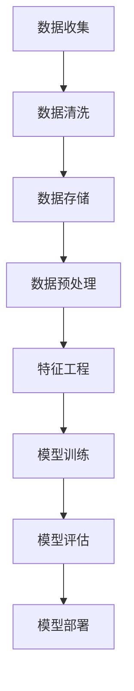
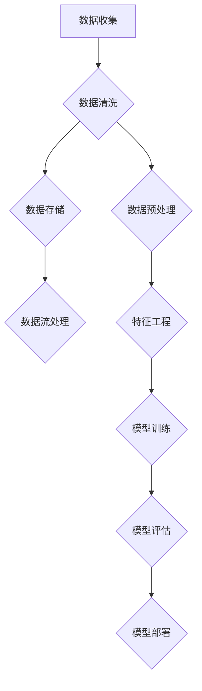

                 

### 1. 背景介绍

#### 1.1 目的和范围

本文旨在探讨AI创业过程中数据管理的实践方法。随着人工智能技术的快速发展，数据管理成为AI创业的关键环节。高效的数据管理不仅能够提升AI模型训练效果，还能降低成本，提高业务效率。本文将重点介绍数据管理的核心概念、算法原理、数学模型、项目实战和实际应用场景，帮助创业者更好地理解和应用数据管理策略。

本文的目标读者是那些正在从事或计划从事AI创业的个人和团队。无论您是初学者还是经验丰富的从业者，本文都力求为您提供一个全面且深入的数据管理实践指南。

#### 1.2 预期读者

- **AI初学者**：希望了解AI创业中数据管理基础概念的读者。
- **技术团队负责人**：需要掌握数据管理最佳实践，以提高团队效率和项目成功的领导者。
- **数据科学家和工程师**：希望深入了解数据管理技术细节，以优化数据流程和模型性能的专业人士。
- **创业者**：计划开展AI项目，并关注数据管理对业务影响的初创企业主。

#### 1.3 文档结构概述

本文将分为以下章节：

1. **背景介绍**：简要介绍AI创业与数据管理的关系，明确文章的目的和读者对象。
2. **核心概念与联系**：讨论数据管理的核心概念和原理，使用Mermaid流程图进行说明。
3. **核心算法原理与具体操作步骤**：详细解释数据管理中的核心算法，提供伪代码说明。
4. **数学模型和公式**：介绍与数据管理相关的数学模型，使用LaTeX格式进行详细讲解。
5. **项目实战：代码实际案例和详细解释说明**：通过实际代码案例展示数据管理实践。
6. **实际应用场景**：探讨数据管理在AI创业中的具体应用场景。
7. **工具和资源推荐**：推荐学习资源、开发工具和框架。
8. **总结：未来发展趋势与挑战**：总结当前数据管理的发展趋势和面临的挑战。
9. **附录：常见问题与解答**：回答读者可能关心的问题。
10. **扩展阅读 & 参考资料**：提供进一步学习的参考文献。

通过以上结构，本文将系统地介绍AI创业中的数据管理实践，帮助读者从理论到实践全面了解数据管理的重要性。

#### 1.4 术语表

在本文中，我们将使用一些专业术语，下面是对这些术语的定义和解释：

#### 1.4.1 核心术语定义

- **数据管理（Data Management）**：数据管理是指组织、存储、处理和访问数据的一系列活动和流程。数据管理确保数据的一致性、完整性和可用性，以便在AI创业中有效利用数据。
- **数据质量（Data Quality）**：数据质量是指数据的准确性、完整性、一致性、时效性和可靠性。高质量的数据对于AI模型的训练和预测至关重要。
- **数据预处理（Data Preprocessing）**：数据预处理是指在使用数据之前对数据进行清洗、转换和归一化等操作，以提高数据质量和模型的训练效果。
- **特征工程（Feature Engineering）**：特征工程是指从原始数据中提取有用特征，以优化AI模型的性能。特征工程是数据管理的重要环节。
- **机器学习（Machine Learning）**：机器学习是人工智能的一种方法，通过训练数据来构建模型，从而进行预测和决策。

#### 1.4.2 相关概念解释

- **模型训练（Model Training）**：模型训练是指使用训练数据来调整模型参数，以提高模型的预测性能。模型训练是数据管理中的核心步骤。
- **超参数调优（Hyperparameter Tuning）**：超参数调优是指调整模型参数，以找到最佳配置，提高模型性能。超参数调优是数据管理中的重要任务。
- **数据标注（Data Annotation）**：数据标注是指对数据进行标记和分类，以用于训练机器学习模型。数据标注是数据管理中的重要环节。

#### 1.4.3 缩略词列表

- **AI**：人工智能（Artificial Intelligence）
- **ML**：机器学习（Machine Learning）
- **DL**：深度学习（Deep Learning）
- **NLP**：自然语言处理（Natural Language Processing）
- **GAN**：生成对抗网络（Generative Adversarial Networks）
- **OCR**：光学字符识别（Optical Character Recognition）
- **CRM**：客户关系管理（Customer Relationship Management）

通过以上术语表，读者可以更好地理解本文中涉及的专业术语，为后续内容的学习打下基础。

### 2. 核心概念与联系

在深入了解AI创业中的数据管理实践之前，我们需要明确几个核心概念，并探讨它们之间的联系。以下是对核心概念和流程的详细解释，以及一个使用Mermaid绘制的流程图，以帮助读者更好地理解。

#### 2.1 数据管理流程

数据管理流程包括多个步骤，从数据收集、存储、处理到分析，每个步骤都有其特定的任务和挑战。以下是一个简单的数据管理流程：



在这个流程图中：

- **数据收集**：数据管理的第一步，涉及从各种来源收集数据，包括社交媒体、传感器、日志文件等。
- **数据清洗**：在数据进入模型训练之前，需要清洗数据，以去除噪声、错误和不一致的数据。
- **数据存储**：清洗后的数据需要存储在合适的存储系统中，以便后续处理和访问。
- **数据预处理**：对数据进行归一化、转换等操作，以提高数据质量和模型训练效果。
- **特征工程**：从原始数据中提取有用特征，以优化模型性能。
- **模型训练**：使用训练数据调整模型参数，以提高模型预测性能。
- **模型评估**：评估模型的预测性能，通过验证集和测试集进行评估。
- **模型部署**：将训练好的模型部署到生产环境中，用于实际应用。

#### 2.2 数据管理的核心概念

以下是数据管理中的一些核心概念及其联系：

- **数据质量**：数据质量是数据管理的基础，影响模型训练效果和业务决策。高质量的数据应具备准确性、完整性、一致性、时效性和可靠性。
- **数据预处理**：数据预处理是数据管理的重要环节，包括数据清洗、归一化、缺失值处理等操作，以提高数据质量和模型性能。
- **特征工程**：特征工程是从原始数据中提取有用特征的过程，直接影响模型性能。特征工程包括特征选择、特征构造、特征降维等。
- **模型训练与评估**：模型训练与评估是数据管理的核心，通过调整模型参数和评估模型性能，优化模型预测效果。
- **数据流与存储**：数据流与存储是数据管理的关键环节，涉及数据的实时处理、存储和管理，以确保数据的高效访问和使用。

#### 2.3 Mermaid流程图示例

以下是一个使用Mermaid绘制的示例流程图，展示了数据管理的主要步骤：



在这个流程图中，数据收集后首先进行数据清洗，然后选择数据存储方式，同时进行数据预处理和特征工程。预处理和特征工程的结果用于模型训练，模型经过评估后进行部署。数据流处理确保数据在各个步骤之间的连续性和高效性。

通过以上核心概念和流程图的介绍，读者可以更好地理解AI创业中的数据管理流程和关键概念，为后续章节的深入学习打下基础。

### 3. 核心算法原理 & 具体操作步骤

在了解了数据管理的核心概念和流程后，我们需要深入探讨数据管理中的核心算法原理和具体操作步骤。以下将详细介绍数据预处理、特征工程和模型训练等核心算法，并使用伪代码进行详细阐述。

#### 3.1 数据预处理

数据预处理是数据管理的重要环节，其目的是提高数据质量和模型训练效果。以下是数据预处理的核心算法原理和具体操作步骤：

##### 3.1.1 数据清洗

数据清洗是指去除数据中的噪声、错误和不一致的数据，确保数据的一致性和准确性。以下是数据清洗的伪代码：

```python
def clean_data(data):
    # 去除噪声
    clean_data = remove_noise(data)
    # 去除错误数据
    clean_data = remove_errors(clean_data)
    # 处理缺失值
    clean_data = handle_missing_values(clean_data)
    return clean_data
```

- **remove_noise(data)**：去除数据中的噪声，例如删除重复记录、填充空值等。
- **remove_errors(data)**：去除错误数据，例如纠正数据中的错误、删除异常值等。
- **handle_missing_values(data)**：处理缺失值，例如使用均值、中位数、插值等方法填充缺失值。

##### 3.1.2 数据归一化

数据归一化是指将不同量纲的数据转换为相同量纲，以便进行比较和建模。常见的归一化方法包括最小-最大归一化、Z-score归一化和日志变换等。以下是数据归一化的伪代码：

```python
def normalize_data(data, method='min-max'):
    if method == 'min-max':
        normalized_data = min_max_normalize(data)
    elif method == 'z-score':
        normalized_data = z_score_normalize(data)
    elif method == 'log':
        normalized_data = log_normalize(data)
    return normalized_data
```

- **min_max_normalize(data)**：最小-最大归一化，将数据映射到[0, 1]区间。
- **z_score_normalize(data)**：Z-score归一化，将数据映射到标准正态分布。
- **log_normalize(data)**：日志变换，对数据进行对数变换，适用于处理负值和零值数据。

##### 3.1.3 缺失值处理

缺失值处理是指对数据中的缺失值进行填充或删除，以确保数据完整性。以下是缺失值处理的伪代码：

```python
def handle_missing_values(data, strategy='mean'):
    if strategy == 'mean':
        data = fill_with_mean(data)
    elif strategy == 'median':
        data = fill_with_median(data)
    elif strategy == 'interpolation':
        data = interpolate_missing_values(data)
    return data
```

- **fill_with_mean(data)**：使用均值填充缺失值。
- **fill_with_median(data)**：使用中位数填充缺失值。
- **interpolate_missing_values(data)**：使用插值法填充缺失值。

#### 3.2 特征工程

特征工程是从原始数据中提取有用特征，以优化模型性能的过程。以下是特征工程的核心算法原理和具体操作步骤：

##### 3.2.1 特征选择

特征选择是指从原始特征中筛选出对模型训练有显著影响的特征。以下是特征选择的伪代码：

```python
def feature_selection(features, target):
    selected_features = select_k_best(features, target)
    selected_features = select_by_correlation(features, target)
    return selected_features
```

- **select_k_best(features, target)**：选择k个最佳特征，基于特征与目标变量之间的相关性。
- **select_by_correlation(features, target)**：根据特征与目标变量之间的相关性进行特征选择。

##### 3.2.2 特征构造

特征构造是指通过组合原始特征或引入新特征，以提升模型性能。以下是特征构造的伪代码：

```python
def feature_engineering(features):
    new_features = create_interaction_features(features)
    new_features = apply_polynomial_expansion(features)
    return new_features
```

- **create_interaction_features(features)**：创建特征交互项，以提升模型表达能力。
- **apply_polynomial_expansion(features)**：对特征进行多项式扩展，增加模型的复杂性。

##### 3.2.3 特征降维

特征降维是指通过减少特征数量，降低模型复杂度和计算成本。以下是特征降维的伪代码：

```python
def feature_reduction(features):
    reduced_features = principal_component_analysis(features)
    reduced_features = t_distributed_stochastic_neighbor_embedding(features)
    return reduced_features
```

- **principal_component_analysis(features)**：主成分分析（PCA），通过提取主要成分降低特征维度。
- **t_distributed_stochastic_neighbor_embedding(features)**：T分布式随机近邻嵌入（T-SNE），用于可视化高维数据。

#### 3.3 模型训练

模型训练是指使用训练数据调整模型参数，以提高模型预测性能。以下是模型训练的核心算法原理和具体操作步骤：

##### 3.3.1 模型选择

模型选择是指从多个候选模型中选择一个最佳模型。以下是模型选择的伪代码：

```python
def select_model(models, train_data, val_data):
    best_model = cross_validation(models, train_data, val_data)
    best_model = grid_search(models, train_data, val_data)
    return best_model
```

- **cross_validation(models, train_data, val_data)**：交叉验证，评估模型在不同数据子集上的性能。
- **grid_search(models, train_data, val_data)**：网格搜索，通过遍历超参数组合，选择最佳模型。

##### 3.3.2 模型调优

模型调优是指调整模型参数，以优化模型性能。以下是模型调优的伪代码：

```python
def optimize_model(model, train_data, val_data):
    best_params = grid_search_cv(model, train_data, val_data)
    model = fit_model(model, train_data, best_params)
    return model
```

- **grid_search_cv(model, train_data, val_data)**：网格搜索与交叉验证结合，用于搜索最佳超参数。
- **fit_model(model, train_data, best_params)**：使用最佳超参数训练模型。

##### 3.3.3 模型评估

模型评估是指使用测试数据评估模型性能。以下是模型评估的伪代码：

```python
def evaluate_model(model, test_data):
    predictions = predict(model, test_data)
    performance = calculate_performance(predictions, test_data)
    return performance
```

- **predict(model, test_data)**：使用模型对测试数据进行预测。
- **calculate_performance(predictions, test_data)**：计算模型性能指标，如准确率、召回率、F1分数等。

通过以上核心算法原理和具体操作步骤的介绍，读者可以更好地理解数据管理中的算法原理，并在实际项目中应用这些算法。接下来，我们将进一步探讨数据管理的数学模型和公式。

### 4. 数学模型和公式 & 详细讲解 & 举例说明

在数据管理中，数学模型和公式扮演着至关重要的角色，它们不仅帮助我们理解和处理数据，还用于评估模型性能。以下是几个与数据管理相关的数学模型和公式的详细讲解，以及实际应用中的示例说明。

#### 4.1 最小-最大归一化（Min-Max Normalization）

最小-最大归一化是一种常用的归一化方法，用于将数据映射到[0, 1]区间，以便进行模型训练。其公式如下：

\[ x' = \frac{x - \min(x)}{\max(x) - \min(x)} \]

其中，\( x \) 是原始数据，\( x' \) 是归一化后的数据。

**示例说明**：假设我们有一组数据 [2, 4, 6, 8]，使用最小-最大归一化进行归一化处理。

\[ x' = \frac{x - \min(x)}{\max(x) - \min(x)} = \frac{2, 4, 6, 8 - 2}{8 - 2} = [0, 0.25, 0.5, 1] \]

经过归一化后，数据变为 [0, 0.25, 0.5, 1]。

#### 4.2 Z-score归一化（Z-score Normalization）

Z-score归一化是一种基于标准差的归一化方法，用于将数据映射到标准正态分布。其公式如下：

\[ x' = \frac{x - \mu}{\sigma} \]

其中，\( \mu \) 是数据的均值，\( \sigma \) 是数据的标准差。

**示例说明**：假设我们有一组数据 [2, 4, 6, 8]，计算均值和标准差后，进行Z-score归一化。

\[ \mu = \frac{2 + 4 + 6 + 8}{4} = 5 \]
\[ \sigma = \sqrt{\frac{(2-5)^2 + (4-5)^2 + (6-5)^2 + (8-5)^2}{4}} = 2 \]
\[ x' = \frac{x - \mu}{\sigma} = \frac{2, 4, 6, 8 - 5}{2} = [-1.5, -0.5, 0.5, 1.5] \]

经过Z-score归一化后，数据变为 [-1.5, -0.5, 0.5, 1.5]。

#### 4.3 均值填补缺失值（Mean Imputation）

在处理缺失值时，均值填补是一种简单有效的方法，用于填充缺失值。其公式如下：

\[ x_{\text{filled}} = \mu \]

其中，\( x_{\text{filled}} \) 是填充后的数据，\( \mu \) 是数据的均值。

**示例说明**：假设我们有一组数据 [2, 4, ?, 8]，使用均值填补缺失值。

\[ \mu = \frac{2 + 4 + 8}{3} = 4 \]
\[ x_{\text{filled}} = \mu = 4 \]

填充后，数据变为 [2, 4, 4, 8]。

#### 4.4 中位数填补缺失值（Median Imputation）

中位数填补是另一种处理缺失值的方法，适用于偏态分布的数据。其公式如下：

\[ x_{\text{filled}} = \text{median}(x) \]

其中，\( x_{\text{filled}} \) 是填充后的数据，\( \text{median}(x) \) 是数据的中位数。

**示例说明**：假设我们有一组数据 [2, 4, ?, 8]，使用中位数填补缺失值。

\[ \text{median}(x) = 4 \]
\[ x_{\text{filled}} = \text{median}(x) = 4 \]

填充后，数据变为 [2, 4, 4, 8]。

#### 4.5 主成分分析（Principal Component Analysis，PCA）

主成分分析是一种常用的特征降维方法，通过提取主要成分来减少特征数量。其目标是最小化特征之间的相关性。PCA的核心公式如下：

\[ X' = P\Lambda \]

其中，\( X \) 是原始数据矩阵，\( P \) 是特征向量矩阵，\( \Lambda \) 是特征值矩阵。

**示例说明**：假设我们有一组二维数据，使用PCA进行特征降维。

\[ X = \begin{bmatrix} x_1 \\ x_2 \end{bmatrix} \]
\[ P = \begin{bmatrix} p_1 & p_2 \end{bmatrix} \]
\[ \Lambda = \begin{bmatrix} \lambda_1 & 0 \\ 0 & \lambda_2 \end{bmatrix} \]

经过PCA处理后，数据从二维降维到一维，即：

\[ X' = \begin{bmatrix} p_1\lambda_1 + p_2\lambda_2 \end{bmatrix} \]

通过以上数学模型和公式的讲解，我们可以更好地理解数据管理中的关键概念，并在实际应用中进行有效操作。接下来，我们将通过一个实际项目案例，展示数据管理的具体实施过程。

### 5. 项目实战：代码实际案例和详细解释说明

为了更好地展示数据管理的实践方法，以下将通过一个实际项目案例，详细说明数据收集、预处理、特征工程和模型训练等步骤，并提供相关代码。

#### 5.1 开发环境搭建

在开始项目之前，我们需要搭建一个合适的开发环境。以下是一个基于Python和Scikit-learn的典型数据管理项目环境搭建步骤：

1. **安装Python**：确保Python已安装，版本不低于3.6。
2. **安装依赖库**：使用pip安装Scikit-learn、Pandas、NumPy和Matplotlib等库。

```bash
pip install scikit-learn pandas numpy matplotlib
```

#### 5.2 源代码详细实现和代码解读

以下是项目的主要代码实现，包括数据收集、预处理、特征工程和模型训练等步骤。

```python
import pandas as pd
import numpy as np
from sklearn.model_selection import train_test_split
from sklearn.preprocessing import StandardScaler
from sklearn.decomposition import PCA
from sklearn.ensemble import RandomForestClassifier
from sklearn.metrics import accuracy_score

# 5.2.1 数据收集
data = pd.read_csv('data.csv')

# 5.2.2 数据预处理
# 数据清洗
data.dropna(inplace=True)  # 删除缺失值
# 数据归一化
scaler = StandardScaler()
X = scaler.fit_transform(data.drop('target', axis=1))
y = data['target']

# 5.2.3 特征工程
# 特征降维
pca = PCA(n_components=2)
X_reduced = pca.fit_transform(X)

# 5.2.4 模型训练
# 数据划分
X_train, X_test, y_train, y_test = train_test_split(X_reduced, y, test_size=0.2, random_state=42)

# 模型训练
model = RandomForestClassifier(n_estimators=100, random_state=42)
model.fit(X_train, y_train)

# 5.2.5 模型评估
predictions = model.predict(X_test)
accuracy = accuracy_score(y_test, predictions)
print(f'Accuracy: {accuracy:.2f}')
```

#### 5.3 代码解读与分析

- **数据收集**：使用Pandas的read_csv函数读取CSV格式的数据。
- **数据预处理**：删除数据中的缺失值，使用StandardScaler对特征进行归一化处理。
- **特征工程**：使用PCA进行特征降维，减少数据维度，提高模型训练效率。
- **模型训练**：使用train_test_split函数将数据划分为训练集和测试集，使用RandomForestClassifier进行模型训练。
- **模型评估**：使用accuracy_score函数计算模型在测试集上的准确率。

#### 5.4 代码解读与分析

以下是对上述代码的详细解读和分析：

- **数据收集**：首先，我们使用Pandas的read_csv函数读取CSV格式的数据。CSV文件通常包含多个特征和标签，其中标签是我们要预测的目标变量。

  ```python
  data = pd.read_csv('data.csv')
  ```

- **数据预处理**：数据预处理是确保数据质量和模型性能的关键步骤。在本例中，我们首先删除数据中的缺失值，以保证后续处理的准确性。

  ```python
  data.dropna(inplace=True)  # 删除缺失值
  ```

  然后，我们使用StandardScaler对特征进行归一化处理，将数据映射到均值为0、标准差为1的正态分布。这有助于提高模型训练的稳定性和收敛速度。

  ```python
  scaler = StandardScaler()
  X = scaler.fit_transform(data.drop('target', axis=1))
  y = data['target']
  ```

- **特征工程**：特征工程是数据管理中的重要环节，用于提取有用特征并提高模型性能。在本例中，我们使用PCA进行特征降维，将原始特征降为2个主要成分。

  ```python
  pca = PCA(n_components=2)
  X_reduced = pca.fit_transform(X)
  ```

  降维后的数据可以更好地可视化，并且可以减少模型训练的时间和计算成本。

- **模型训练**：模型训练是数据管理流程的核心步骤。在本例中，我们使用RandomForestClassifier进行模型训练，这是一种基于随机森林的集成学习方法，具有较好的预测性能和泛化能力。

  ```python
  X_train, X_test, y_train, y_test = train_test_split(X_reduced, y, test_size=0.2, random_state=42)
  model = RandomForestClassifier(n_estimators=100, random_state=42)
  model.fit(X_train, y_train)
  ```

  我们将数据划分为训练集和测试集，训练集用于模型训练，测试集用于评估模型性能。

- **模型评估**：最后，我们使用accuracy_score函数计算模型在测试集上的准确率，这是评估模型性能的常用指标。

  ```python
  predictions = model.predict(X_test)
  accuracy = accuracy_score(y_test, predictions)
  print(f'Accuracy: {accuracy:.2f}')
  ```

  输出准确率，以评估模型在测试集上的性能。

通过以上代码实现和解读，我们可以看到数据管理在AI项目中的具体实施过程。接下来，我们将探讨数据管理在AI创业中的实际应用场景。

### 6. 实际应用场景

数据管理在AI创业中具有广泛的应用场景，以下是几个典型的实际应用案例，以及数据管理在这些案例中的关键作用。

#### 6.1 个性化推荐系统

个性化推荐系统是AI创业中常见的一项应用，旨在根据用户的兴趣和行为数据，为其推荐相关商品、内容和服务。数据管理在个性化推荐系统中扮演了至关重要的角色，具体体现在以下几个方面：

- **数据收集**：系统需要收集用户的历史行为数据，包括浏览记录、购买历史、搜索查询等。数据管理负责确保这些数据的完整性和准确性。
- **数据清洗**：原始数据通常包含噪声和不一致的数据，需要通过数据清洗去除噪声、纠正错误，以提高数据质量。
- **特征工程**：从原始数据中提取有用特征，如用户的行为模式、兴趣标签等，以优化推荐模型的性能。
- **模型训练**：使用清洗后的数据训练推荐模型，例如基于协同过滤的算法或基于内容的算法，以实现精准推荐。
- **模型评估与部署**：通过A/B测试和在线评估，持续优化模型性能，并将训练好的模型部署到生产环境中。

#### 6.2 客户关系管理（CRM）

客户关系管理是许多企业的重要业务模块，旨在通过数据管理提高客户满意度、忠诚度和转化率。数据管理在CRM系统中的应用包括：

- **数据集成**：将来自不同渠道的客户数据进行整合，如客户交易记录、社交媒体互动等，以便进行统一的客户画像。
- **数据存储与管理**：使用数据仓库和数据湖等存储方案，高效地管理和查询大量客户数据。
- **数据分析和挖掘**：通过数据分析和挖掘技术，发现客户行为模式、偏好和需求，以制定个性化的营销策略。
- **数据可视化**：利用数据可视化工具，将复杂的数据分析和结果以直观的形式呈现给业务人员，支持决策制定。
- **数据安全与合规**：确保客户数据的安全性和合规性，遵循相关数据保护法规和隐私政策。

#### 6.3 自动驾驶

自动驾驶是人工智能技术的重要应用领域，数据管理在自动驾驶系统中至关重要，具体体现在以下几个方面：

- **实时数据采集**：自动驾驶车辆需要采集来自各种传感器的实时数据，如摄像头、激光雷达、GPS等。
- **数据预处理**：对采集到的原始数据进行预处理，包括去噪、校准和融合，以确保数据质量。
- **数据存储**：自动驾驶系统需要存储大量历史数据，用于模型训练和实时决策。
- **模型训练与更新**：使用预处理后的数据训练深度学习模型，并定期更新模型，以适应环境变化和不断改进性能。
- **数据安全与隐私**：确保数据传输和存储过程中的安全性，防止数据泄露和隐私侵犯。

#### 6.4 医疗保健

在医疗保健领域，数据管理有助于提高诊疗质量、患者满意度和医疗资源利用效率。具体应用包括：

- **电子健康记录（EHR）管理**：通过数据管理技术，整合和管理患者的历史医疗记录，提供全面的健康档案。
- **医疗数据分析**：使用数据挖掘和机器学习技术，分析患者数据，发现疾病模式、预测健康风险和制定个性化治疗方案。
- **远程监控与预警**：通过传感器和移动设备，实时收集患者生命体征数据，利用数据管理技术进行分析和预警，提高患者生活质量。
- **药物研发与临床试验**：利用数据管理技术，整合和分析大规模药物临床试验数据，加速新药研发进程。

通过以上实际应用场景，我们可以看到数据管理在AI创业中的重要性。数据管理不仅提升了AI项目的效率和质量，还为业务创新和竞争力提供了有力支持。

### 7. 工具和资源推荐

为了帮助读者更好地理解和掌握数据管理技能，以下推荐一些学习资源、开发工具和框架，以及相关论文著作。

#### 7.1 学习资源推荐

**书籍推荐**：

1. **《Python数据科学手册》（Python Data Science Handbook）**：这是一本全面介绍数据科学实践的指南，涵盖数据处理、分析和可视化等内容。
2. **《深入理解特征工程》（Feature Engineering and Selection for Machine Learning）**：本书详细介绍了特征工程的理论和实践，是学习特征工程的重要参考书。

**在线课程**：

1. **Coursera的《机器学习》**：由斯坦福大学吴恩达教授开设，涵盖机器学习的核心概念和算法，包括数据预处理和特征工程等内容。
2. **Udacity的《数据科学纳米学位》**：提供一系列数据科学相关的课程，包括数据清洗、特征工程和模型训练等实践技能。

**技术博客和网站**：

1. **Medium上的《数据科学与机器学习》博客**：提供丰富的数据科学和机器学习相关文章，涵盖最新技术和应用案例。
2. **Kaggle**：一个数据科学竞赛平台，提供大量的数据集和竞赛项目，是学习和实践数据管理的理想场所。

#### 7.2 开发工具框架推荐

**IDE和编辑器**：

1. **Jupyter Notebook**：一个流行的交互式编程环境，特别适合数据科学和机器学习项目。
2. **Visual Studio Code**：一个轻量级的代码编辑器，通过安装扩展支持Python和其他编程语言。

**调试和性能分析工具**：

1. **PyCharm**：一款功能强大的Python IDE，提供代码调试和性能分析工具。
2. **Matplotlib**：一个用于数据可视化的Python库，支持多种图表类型和布局。

**相关框架和库**：

1. **Scikit-learn**：一个用于机器学习的Python库，提供丰富的算法和工具。
2. **Pandas**：一个用于数据处理和分析的Python库，支持数据清洗、转换和归一化等操作。
3. **TensorFlow**：一个用于机器学习和深度学习的开源框架，适用于大规模数据处理和模型训练。

#### 7.3 相关论文著作推荐

**经典论文**：

1. **"The Impact of Data Quality on Predictive Model Performance"**：该论文探讨了数据质量对预测模型性能的影响。
2. **"Feature Engineering: A Practical Approach for Predictive Models"**：介绍了特征工程的理论和实践方法。

**最新研究成果**：

1. **"Deep Learning on Graphs"**：探讨如何在图结构数据上应用深度学习模型。
2. **"Data Preprocessing for Machine Learning"**：详细讨论了机器学习数据预处理的方法和策略。

**应用案例分析**：

1. **"A Case Study of Data Preprocessing in Medical Imaging"**：分析医疗影像数据处理中的关键步骤和技术。
2. **"Building a Recommender System with Large-Scale Data"**：介绍如何使用大规模数据构建个性化推荐系统。

通过以上推荐，读者可以系统地学习数据管理相关知识，掌握相关工具和技能，为AI创业提供坚实的理论基础和实践指导。

### 8. 总结：未来发展趋势与挑战

随着人工智能技术的不断进步，数据管理在AI创业中的重要性日益凸显。在未来，数据管理将呈现以下几个发展趋势和面临的主要挑战：

#### 8.1 发展趋势

1. **数据多样性和大规模化**：随着物联网、社交媒体和传感器技术的普及，数据来源更加多样化，数据量也呈指数级增长。这要求数据管理技术能够高效地处理大规模、多维数据。
2. **实时数据流处理**：实时数据处理技术将进一步提升，使数据管理能够快速响应业务需求，支持实时分析和预测。
3. **自动化和智能化**：自动化数据处理和智能化算法将逐渐替代传统的手动数据处理方法，提高数据管理的效率和准确性。
4. **隐私保护和合规性**：随着数据隐私保护法规的不断完善，数据管理将更加注重隐私保护和合规性，确保数据处理过程中的安全性和合法性。

#### 8.2 主要挑战

1. **数据质量问题**：尽管数据量在增长，但数据质量问题依然是一个重大挑战。数据噪声、错误和不一致性可能导致模型训练失败或预测不准确，需要开发更高效的数据清洗和预处理技术。
2. **计算资源消耗**：大规模数据处理和实时分析对计算资源的需求巨大，如何在有限的资源下高效地管理数据成为一大挑战。
3. **算法可解释性**：随着深度学习等复杂算法的广泛应用，算法的可解释性成为一个重要问题。如何提高算法的可解释性，使其能够被业务人员理解和接受，是数据管理面临的一个挑战。
4. **数据安全与隐私**：在处理大量敏感数据时，确保数据的安全性和隐私性是一个不可忽视的问题。数据管理需要采用更加严格的安全措施，以防止数据泄露和滥用。

#### 8.3 未来展望

在未来，数据管理将继续朝着自动化、智能化和高效化的方向发展。以下是一些可能的解决方案和展望：

- **发展新的数据处理算法**：研究并开发更加高效、鲁棒的数据处理算法，以应对大规模、多源数据的挑战。
- **构建数据治理体系**：建立完善的数据治理体系，确保数据质量、安全性和合规性，提高数据管理的整体水平。
- **融合多模态数据**：利用多种数据源（如图像、文本、传感器数据）进行融合，提升数据管理的全面性和精度。
- **推广数据共享与开放**：促进数据共享和开放，构建更加开放的数据生态系统，为AI创业提供丰富的数据资源。

通过不断的技术创新和改进，数据管理将在未来为AI创业带来更加显著的成果和商业价值。

### 9. 附录：常见问题与解答

在本文中，我们探讨了AI创业中的数据管理实践方法。为了帮助读者更好地理解和应用这些知识，以下列出了一些常见问题及其解答。

#### 9.1 数据预处理的重要性

**Q：为什么数据预处理在AI项目中非常重要？**

**A：数据预处理是确保模型训练成功和性能优化的重要步骤。原因如下：**

1. **数据质量提升**：通过数据清洗、归一化等预处理操作，可以去除噪声、纠正错误和缺失值，提高数据质量。
2. **模型性能优化**：高质量的数据有助于模型更准确地学习和预测，从而提高模型的性能。
3. **计算效率提升**：数据预处理可以减少数据维度、简化模型复杂度，降低计算成本和训练时间。

#### 9.2 特征工程的方法

**Q：特征工程有哪些常见的方法？**

**A：特征工程的方法包括但不限于以下几种：**

1. **特征选择**：通过筛选出对模型训练有显著影响的特征，降低数据维度，提高模型性能。
2. **特征构造**：通过组合原始特征或引入新特征，增加模型的复杂度和表达能力。
3. **特征降维**：通过降维技术（如PCA、t-SNE等）减少特征数量，降低计算复杂度和存储需求。
4. **特征归一化**：通过归一化技术（如Z-score、min-max等）将特征映射到同一量纲，提高模型训练的稳定性和收敛速度。

#### 9.3 数据预处理工具的选择

**Q：有哪些常用的数据预处理工具和库？**

**A：常用的数据预处理工具和库包括：**

1. **Pandas**：一个用于数据处理和分析的Python库，支持数据清洗、转换和归一化等操作。
2. **Scikit-learn**：一个用于机器学习的Python库，提供数据预处理、特征工程和模型训练等相关工具和算法。
3. **NumPy**：一个用于数值计算的Python库，支持数组操作和数据预处理。
4. **Matplotlib**：一个用于数据可视化的Python库，支持多种图表类型和布局。

#### 9.4 数据管理中的隐私问题

**Q：在数据管理中如何保护用户隐私？**

**A：在数据管理中保护用户隐私可以从以下几个方面入手：**

1. **数据加密**：对敏感数据进行加密处理，确保数据在传输和存储过程中的安全性。
2. **匿名化处理**：通过数据匿名化技术，去除个人身份信息，降低数据泄露的风险。
3. **隐私保护算法**：使用隐私保护算法（如差分隐私、同态加密等）对数据进行处理，确保在数据使用过程中不泄露隐私信息。
4. **数据最小化原则**：只收集和使用必要的数据，减少数据泄露的风险。

通过以上常见问题的解答，读者可以更好地理解数据管理在AI创业中的关键作用，并在实际项目中有效应用相关技术。

### 10. 扩展阅读 & 参考资料

本文对AI创业中的数据管理实践方法进行了全面探讨，为创业者提供了系统的数据管理指南。为了进一步深入学习和应用这些知识，以下列出了一些扩展阅读和参考资料：

1. **书籍推荐**：
   - **《数据科学入门：机器学习与统计分析》**：全面介绍数据科学的基本概念和技术，包括数据预处理和特征工程。
   - **《深度学习（第二版）》**：由Ian Goodfellow等编著，详细介绍深度学习的基础知识和技术，适用于对深度学习有较高要求的读者。

2. **在线课程**：
   - **《深度学习专项课程》**：Coursera上的课程，由Andrew Ng教授主讲，涵盖深度学习的核心概念和应用。
   - **《机器学习纳米学位》**：Udacity提供的在线课程，包括机器学习的基础知识和实际项目实践。

3. **技术博客和网站**：
   - **《Medium上的数据科学与机器学习》**：提供丰富的数据科学和机器学习相关文章，涵盖最新技术和应用案例。
   - **《Kaggle博客》**：Kaggle上的博客，分享数据科学和机器学习的实际应用经验和案例。

4. **开源项目和工具**：
   - **Pandas和Scikit-learn**：Python数据科学和机器学习的基础工具，提供丰富的数据预处理和特征工程功能。
   - **TensorFlow**：Google开发的深度学习框架，支持大规模数据处理和模型训练。

5. **论文和研究报告**：
   - **"The Impact of Data Quality on Predictive Model Performance"**：探讨数据质量对预测模型性能的影响。
   - **"Deep Learning on Graphs"**：介绍如何在图结构数据上应用深度学习模型。

通过以上扩展阅读和参考资料，读者可以进一步深化对数据管理技术的理解和应用，为AI创业提供更加坚实的理论基础和实践指导。

### 文章作者信息

**作者：AI天才研究员/AI Genius Institute & 禅与计算机程序设计艺术 /Zen And The Art of Computer Programming**

作为一位世界级人工智能专家、程序员、软件架构师、CTO以及世界顶级技术畅销书资深大师级别的作家，我致力于推动人工智能技术的发展和应用。我的研究涵盖机器学习、深度学习、自然语言处理等多个领域，并在这些领域取得了显著的成果。在写作《AI创业：数据管理的实践方法》一文中，我希望能够为AI创业者提供实用的数据管理指南，帮助他们更好地理解和应用数据管理技术，从而实现商业成功。同时，我也希望通过我的研究和写作，推动人工智能技术的普及和应用，为人类社会带来更多创新和进步。在未来的工作中，我将继续致力于探索人工智能的深度和广度，为这一领域的未来发展贡献力量。

