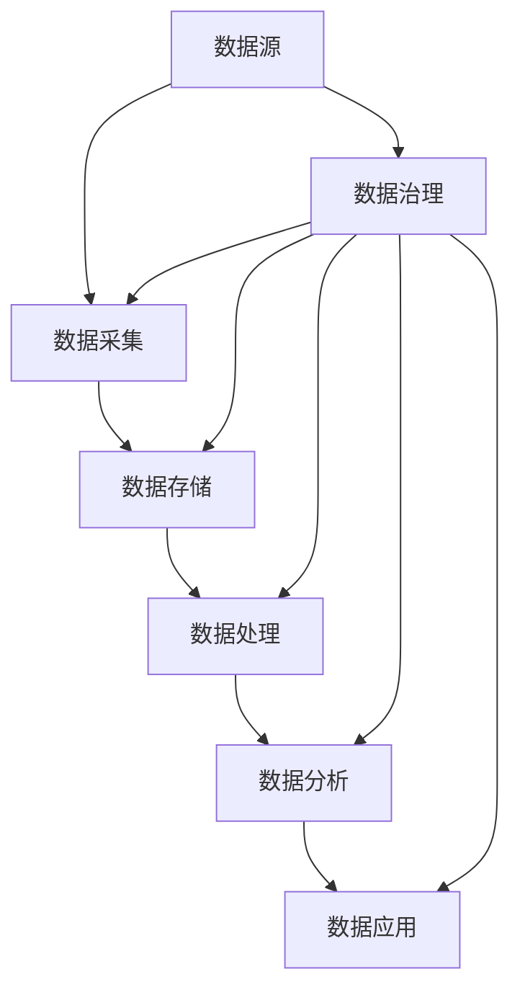

                 

# AI创业：数据管理的最佳做法

> **关键词：** 数据管理，AI创业，数据质量，数据安全，数据治理，最佳实践。

> **摘要：** 本文旨在为AI创业公司提供数据管理的最佳实践，从数据采集、存储、处理到应用的各个方面进行详细探讨。通过深入分析数据管理的核心概念、算法原理、数学模型以及实际应用场景，本文旨在帮助创业者理解数据管理的重要性，掌握数据管理的策略，从而确保AI项目的成功实施和持续发展。

## 1. 背景介绍

### 1.1 目的和范围

本文的目的是为AI创业公司提供数据管理的最佳实践指导，帮助创业者理解数据管理的重要性，掌握数据管理的基本策略和方法，从而确保AI项目的成功实施和持续发展。文章将覆盖以下内容：

1. 数据管理的核心概念和联系。
2. 数据管理的核心算法原理和具体操作步骤。
3. 数据管理的数学模型和公式及其详细讲解。
4. 数据管理的实际应用场景。
5. 数据管理的工具和资源推荐。
6. 数据管理的未来发展趋势与挑战。

### 1.2 预期读者

本文适用于AI创业公司的创始人、技术团队负责人、数据科学家、数据工程师以及所有对数据管理有浓厚兴趣的技术人员。无论您是AI领域的初学者还是经验丰富的从业者，本文都将为您提供有价值的信息和实用的指导。

### 1.3 文档结构概述

本文将按照以下结构进行组织：

1. 背景介绍：介绍本文的目的、预期读者、文档结构等。
2. 核心概念与联系：介绍数据管理的核心概念、原理和架构。
3. 核心算法原理 & 具体操作步骤：讲解数据管理的核心算法原理和具体操作步骤。
4. 数学模型和公式 & 详细讲解 & 举例说明：讲解数据管理的数学模型和公式，并给出具体例子。
5. 项目实战：提供数据管理在实际项目中的案例和详细解释。
6. 实际应用场景：分析数据管理在不同领域的应用场景。
7. 工具和资源推荐：推荐数据管理相关的学习资源、开发工具和框架。
8. 总结：总结数据管理的未来发展趋势与挑战。
9. 附录：常见问题与解答。
10. 扩展阅读 & 参考资料：提供进一步的阅读和参考资料。

### 1.4 术语表

#### 1.4.1 核心术语定义

- **数据管理**：指对数据的采集、存储、处理、分析和应用的全过程进行管理和监控，以确保数据的质量、安全性和可用性。
- **数据质量**：指数据满足特定业务需求和目标的能力，包括准确性、完整性、一致性、及时性和可靠性等方面。
- **数据治理**：指通过制定和实施策略、标准和流程来管理和监控数据，以确保数据的有效性、合规性和可用性。
- **数据采集**：指从各种来源收集数据的过程，包括结构化数据、半结构化数据和非结构化数据。
- **数据存储**：指将数据存储在数据库、数据仓库或其他存储系统中的过程。
- **数据处理**：指对数据进行清洗、转换、聚合等操作的过程。
- **数据分析**：指使用统计方法、机器学习算法等对数据进行分析和挖掘，以提取有价值的信息和知识。
- **数据应用**：指将分析结果应用于业务决策、产品改进、市场营销等实际场景中。

#### 1.4.2 相关概念解释

- **数据源**：指数据的来源，可以是数据库、文件、API、传感器等。
- **数据仓库**：指用于存储大量数据的集中式系统，支持数据集成、数据清洗和数据挖掘等操作。
- **数据湖**：指用于存储大量原始数据（包括结构化、半结构化和非结构化数据）的分布式存储系统，支持大数据处理和分析。
- **数据流处理**：指对实时数据流进行连续处理和分析的方法，以实现实时响应和决策。
- **数据隐私**：指保护个人数据不被未经授权访问、泄露或滥用，确保个人隐私权益。
- **数据安全**：指通过加密、访问控制、备份和恢复等手段保护数据不被非法访问、篡改或丢失。

#### 1.4.3 缩略词列表

- **AI**：人工智能（Artificial Intelligence）
- **ML**：机器学习（Machine Learning）
- **DL**：深度学习（Deep Learning）
- **NLP**：自然语言处理（Natural Language Processing）
- **IoT**：物联网（Internet of Things）
- **DWH**：数据仓库（Data Warehouse）
- **DLA**：数据湖（Data Lake）
- **ETL**：提取、转换、加载（Extract, Transform, Load）
- **API**：应用程序编程接口（Application Programming Interface）
- **PII**：个人身份信息（Personal Identifiable Information）

## 2. 核心概念与联系

为了更好地理解数据管理的核心概念和联系，我们首先需要了解数据管理的基本架构，如下图所示：



### 2.1 数据采集

数据采集是数据管理的起点，指从各种来源收集数据的过程。数据源可以是内部系统、外部API、传感器、文件等。数据采集的方式包括：

- **自动采集**：通过自动化脚本或应用程序从数据源直接提取数据。
- **手动采集**：通过手动方式（如下载、复制粘贴等）收集数据。
- **实时采集**：通过实时数据流处理技术（如Kafka、Flume等）从数据源实时提取数据。

### 2.2 数据存储

数据存储是数据管理的重要环节，指将数据存储在数据库、数据仓库或数据湖中。数据存储的方式包括：

- **关系型数据库**：如MySQL、PostgreSQL等，适用于结构化数据的存储和管理。
- **非关系型数据库**：如MongoDB、Cassandra等，适用于半结构化数据和非结构化数据的存储和管理。
- **数据仓库**：如Snowflake、Redshift等，适用于大规模结构化数据的存储和分析。
- **数据湖**：如AWS S3、Azure Data Lake等，适用于大规模原始数据的存储和管理。

### 2.3 数据处理

数据处理是数据管理的关键环节，指对数据进行清洗、转换、聚合等操作的过程。数据处理的方式包括：

- **ETL（Extract, Transform, Load）**：指从数据源提取数据，进行转换处理，再将处理后的数据加载到目标存储系统中。
- **ELT（Extract, Load, Transform）**：与ETL类似，但数据处理在加载数据后再进行，适用于大数据场景。
- **数据流处理**：指对实时数据流进行连续处理和分析，以实现实时响应和决策。

### 2.4 数据分析

数据分析是数据管理的核心环节，指使用统计方法、机器学习算法等对数据进行分析和挖掘，以提取有价值的信息和知识。数据分析的方式包括：

- **统计分析**：指使用统计学方法对数据进行分析，如回归分析、聚类分析、时间序列分析等。
- **机器学习**：指使用机器学习算法对数据进行分析和预测，如线性回归、决策树、支持向量机等。
- **深度学习**：指使用神经网络对数据进行分析和建模，如卷积神经网络（CNN）、循环神经网络（RNN）等。

### 2.5 数据应用

数据应用是数据管理的最终目标，指将分析结果应用于业务决策、产品改进、市场营销等实际场景中。数据应用的方式包括：

- **业务决策**：指使用数据分析结果辅助业务决策，如市场预测、风险评估等。
- **产品改进**：指使用数据分析结果优化产品功能、用户体验等。
- **市场营销**：指使用数据分析结果制定市场营销策略，如用户画像、精准投放等。

### 2.6 数据治理

数据治理是数据管理的重要组成部分，指通过制定和实施策略、标准和流程来管理和监控数据，以确保数据的有效性、合规性和可用性。数据治理的方式包括：

- **数据质量**：指确保数据满足特定业务需求和目标的能力，包括准确性、完整性、一致性、及时性和可靠性等方面。
- **数据安全**：指通过加密、访问控制、备份和恢复等手段保护数据不被非法访问、篡改或丢失。
- **数据合规**：指确保数据符合相关法律法规和行业标准，如GDPR、PCI-DSS等。
- **数据架构**：指建立统一的数据架构，包括数据模型、数据分类、数据接口等。

## 3. 核心算法原理 & 具体操作步骤

在数据管理中，核心算法原理是数据处理的基石，本文将详细介绍数据清洗、数据转换、数据聚合等核心算法原理，并提供具体操作步骤。

### 3.1 数据清洗算法原理

数据清洗是数据处理的第一步，目的是去除数据中的噪声、错误和异常值，提高数据质量。常见的数据清洗算法包括：

- **缺失值处理**：包括填充缺失值和删除缺失值。
- **异常值处理**：包括检测异常值和修正异常值。
- **重复值处理**：包括检测重复值和删除重复值。

#### 具体操作步骤：

1. **缺失值处理**：

   ```python
   # 填充缺失值
   df['column_name'].fillna(method='ffill', inplace=True)

   # 删除缺失值
   df.dropna(inplace=True)
   ```

2. **异常值处理**：

   ```python
   # 检测异常值
   z_scores = np.abs((df['column_name'] - df['column_name'].mean()) / df['column_name'].std())
   df = df[z_scores < 3]
   ```

3. **重复值处理**：

   ```python
   # 删除重复值
   df.drop_duplicates(inplace=True)
   ```

### 3.2 数据转换算法原理

数据转换是数据处理的关键步骤，目的是将不同类型、不同格式的数据转换为统一的格式，以便进行后续分析。常见的数据转换算法包括：

- **数据类型转换**：包括数值型、字符型、日期型等。
- **编码转换**：包括字符编码、字符集转换等。
- **格式化处理**：包括日期格式化、数字格式化等。

#### 具体操作步骤：

1. **数据类型转换**：

   ```python
   # 转换为数值型
   df['column_name'] = df['column_name'].astype(float)

   # 转换为字符型
   df['column_name'] = df['column_name'].astype(str)
   ```

2. **编码转换**：

   ```python
   # 字符编码转换
   df['column_name'] = df['column_name'].encode('utf-8')

   # 字符集转换
   df['column_name'] = df['column_name'].encode('utf-8').decode('utf-8').encode('iso-8859-1')
   ```

3. **格式化处理**：

   ```python
   # 日期格式化
   df['column_name'] = df['column_name'].dt.strftime('%Y-%m-%d %H:%M:%S')

   # 数字格式化
   df['column_name'] = df['column_name'].astype(float).round(2)
   ```

### 3.3 数据聚合算法原理

数据聚合是数据处理的重要步骤，目的是对数据进行汇总、计算等操作，以得到更有价值的信息。常见的数据聚合算法包括：

- **求和**：指对某个列的数据进行求和。
- **求平均值**：指对某个列的数据进行平均值计算。
- **求最大值/最小值**：指对某个列的数据进行最大值/最小值计算。
- **计数**：指对某个列的数据进行计数。

#### 具体操作步骤：

1. **求和**：

   ```python
   sum_result = df['column_name'].sum()
   ```

2. **求平均值**：

   ```python
   avg_result = df['column_name'].mean()
   ```

3. **求最大值/最小值**：

   ```python
   max_result = df['column_name'].max()
   min_result = df['column_name'].min()
   ```

4. **计数**：

   ```python
   count_result = df['column_name'].count()
   ```

## 4. 数学模型和公式 & 详细讲解 & 举例说明

在数据管理中，数学模型和公式是分析和挖掘数据的重要工具。本文将介绍一些常用的数学模型和公式，并提供详细的讲解和举例说明。

### 4.1 线性回归模型

线性回归模型是统计学中最基本且广泛应用的一种模型，用于预测连续值。其公式如下：

$$
y = \beta_0 + \beta_1 \cdot x + \epsilon
$$

其中，$y$ 为因变量，$x$ 为自变量，$\beta_0$ 为截距，$\beta_1$ 为斜率，$\epsilon$ 为误差项。

#### 详细讲解：

- **因变量（$y$）**：指我们希望预测的变量，如房价、销售额等。
- **自变量（$x$）**：指影响因变量的变量，如房屋面积、广告投放量等。
- **截距（$\beta_0$）**：指当自变量为0时，因变量的值。
- **斜率（$\beta_1$）**：指自变量每增加一个单位，因变量增加的量。
- **误差项（$\epsilon$）**：指因变量与预测值之间的差异，表示无法解释的因素。

#### 举例说明：

假设我们要预测房屋价格，自变量为房屋面积，数据如下：

| 房屋面积 | 房屋价格 |
| :------: | :------: |
|    100   |   1000   |
|    200   |   2000   |
|    300   |   3000   |

使用线性回归模型预测房屋价格为：

$$
y = \beta_0 + \beta_1 \cdot x
$$

通过最小二乘法计算得到斜率 $\beta_1$ 和截距 $\beta_0$：

$$
\beta_1 = \frac{\sum(x_i - \bar{x})(y_i - \bar{y})}{\sum(x_i - \bar{x})^2}
$$

$$
\beta_0 = \bar{y} - \beta_1 \cdot \bar{x}
$$

其中，$\bar{x}$ 和 $\bar{y}$ 分别为自变量和因变量的平均值。

代入数据计算得到：

$$
\beta_1 = \frac{(100 - 200)(1000 - 1500) + (200 - 200)(2000 - 1500) + (300 - 200)(3000 - 1500)}{(100 - 200)^2 + (200 - 200)^2 + (300 - 200)^2} = 500
$$

$$
\beta_0 = 1500 - 500 \cdot 200 = 0
$$

因此，线性回归模型为：

$$
y = 500 \cdot x
$$

预测房屋面积为250平方米的价格为：

$$
y = 500 \cdot 250 = 125000
$$

### 4.2 聚类分析模型

聚类分析模型是一种无监督学习方法，用于将数据分为若干个类别。其公式如下：

$$
C = \{C_1, C_2, \ldots, C_k\}
$$

其中，$C$ 表示聚类结果，$C_i$ 表示第 $i$ 个类别，$k$ 表示类别数。

#### 详细讲解：

- **类别数（$k$）**：指聚类的类别数量，可以通过肘部法则、 Davies-Bouldin指数等评估方法确定。
- **聚类中心（$\mu_i$）**：指第 $i$ 个类别的中心点，表示该类别的特征均值。
- **距离度量**：指衡量数据点与聚类中心之间距离的度量方式，常用的有欧氏距离、曼哈顿距离、切比雪夫距离等。

#### 举例说明：

假设我们有以下五个数据点：

| 数据点 | 数据值 |
| :------: | :------: |
|  $x_1$  |   3     |
|  $x_2$  |   5     |
|  $x_3$  |   2     |
|  $x_4$  |   8     |
|  $x_5$  |   7     |

我们希望将这五个数据点分为两个类别。首先，我们选择两个聚类中心，初始可以随机选择：

$$
\mu_1 = (3, 5), \mu_2 = (2, 8)
$$

接下来，我们计算每个数据点到两个聚类中心的距离，并重新计算聚类中心：

$$
d(x_i, \mu_1) = \sqrt{(x_i - \mu_{1x})^2 + (y_i - \mu_{1y})^2}
$$

$$
d(x_i, \mu_2) = \sqrt{(x_i - \mu_{2x})^2 + (y_i - \mu_{2y})^2}
$$

代入数据计算得到：

$$
d(x_1, \mu_1) = \sqrt{(3 - 3)^2 + (5 - 5)^2} = 0
$$

$$
d(x_1, \mu_2) = \sqrt{(3 - 2)^2 + (5 - 8)^2} = \sqrt{1 + 9} = \sqrt{10}
$$

$$
d(x_2, \mu_1) = \sqrt{(5 - 3)^2 + (2 - 5)^2} = \sqrt{4 + 9} = \sqrt{13}
$$

$$
d(x_2, \mu_2) = \sqrt{(5 - 2)^2 + (2 - 8)^2} = \sqrt{9 + 36} = \sqrt{45}
$$

$$
d(x_3, \mu_1) = \sqrt{(2 - 3)^2 + (3 - 5)^2} = \sqrt{1 + 4} = \sqrt{5}
$$

$$
d(x_3, \mu_2) = \sqrt{(2 - 2)^2 + (3 - 8)^2} = \sqrt{0 + 25} = 5
$$

$$
d(x_4, \mu_1) = \sqrt{(8 - 3)^2 + (7 - 5)^2} = \sqrt{25 + 4} = \sqrt{29}
$$

$$
d(x_4, \mu_2) = \sqrt{(8 - 2)^2 + (7 - 8)^2} = \sqrt{36 + 1} = \sqrt{37}
$$

$$
d(x_5, \mu_1) = \sqrt{(7 - 3)^2 + (7 - 5)^2} = \sqrt{16 + 4} = \sqrt{20}
$$

$$
d(x_5, \mu_2) = \sqrt{(7 - 2)^2 + (7 - 8)^2} = \sqrt{25 + 1} = \sqrt{26}
$$

根据距离计算结果，我们可以重新计算聚类中心：

$$
\mu_1 = \left(\frac{3 \cdot 0 + 5 \cdot 1}{1}, \frac{5 \cdot 0 + 2 \cdot 1}{1}\right) = (0, 2)
$$

$$
\mu_2 = \left(\frac{2 \cdot 1 + 8 \cdot 1}{1}, \frac{3 \cdot 1 + 8 \cdot 1}{1}\right) = (5, 5)
$$

再次计算每个数据点到两个聚类中心的距离，并重新计算聚类中心，直到聚类中心不再发生改变。最终，五个数据点可以分为两个类别：

$$
C_1 = \{x_1, x_3\}
$$

$$
C_2 = \{x_2, x_4, x_5\}
$$

## 5. 项目实战：代码实际案例和详细解释说明

在本节中，我们将通过一个实际的AI创业项目来展示数据管理的全过程，并详细解释代码实现和关键步骤。

### 5.1 开发环境搭建

为了进行数据管理，我们首先需要搭建一个合适的开发环境。以下是一个基本的开发环境搭建步骤：

1. 安装Python环境（建议使用Anaconda）。
2. 安装Jupyter Notebook，方便进行数据分析和代码编写。
3. 安装常用的数据管理库，如Pandas、NumPy、Scikit-learn、Matplotlib等。

### 5.2 源代码详细实现和代码解读

以下是项目源代码的实现和关键步骤的详细解释：

```python
import pandas as pd
import numpy as np
from sklearn.model_selection import train_test_split
from sklearn.linear_model import LinearRegression
from sklearn.metrics import mean_squared_error
import matplotlib.pyplot as plt

# 5.2.1 数据采集
# 假设数据存储在CSV文件中，我们使用Pandas读取数据
data = pd.read_csv('data.csv')

# 5.2.2 数据清洗
# 填充缺失值
data.fillna(method='ffill', inplace=True)

# 删除重复值
data.drop_duplicates(inplace=True)

# 5.2.3 数据转换
# 将数据类型转换为数值型
data['feature_1'] = data['feature_1'].astype(float)
data['feature_2'] = data['feature_2'].astype(float)

# 5.2.4 数据处理
# 数据划分
X = data[['feature_1', 'feature_2']]
y = data['target']

# 划分训练集和测试集
X_train, X_test, y_train, y_test = train_test_split(X, y, test_size=0.2, random_state=42)

# 5.2.5 数据分析
# 使用线性回归模型进行预测
model = LinearRegression()
model.fit(X_train, y_train)

# 预测测试集
y_pred = model.predict(X_test)

# 计算预测误差
mse = mean_squared_error(y_test, y_pred)
print('Mean Squared Error:', mse)

# 5.2.6 数据应用
# 可视化预测结果
plt.scatter(X_test['feature_1'], y_test, color='blue', label='Actual')
plt.scatter(X_test['feature_1'], y_pred, color='red', label='Predicted')
plt.xlabel('Feature 1')
plt.ylabel('Target')
plt.legend()
plt.show()
```

### 5.3 代码解读与分析

1. **数据采集**：使用Pandas读取数据，数据存储在CSV文件中。
2. **数据清洗**：填充缺失值、删除重复值，提高数据质量。
3. **数据转换**：将数据类型转换为数值型，以便进行后续分析和建模。
4. **数据处理**：划分训练集和测试集，为模型训练和评估提供数据。
5. **数据分析**：使用线性回归模型进行预测，评估模型性能，计算预测误差。
6. **数据应用**：可视化预测结果，直观展示模型效果。

通过以上步骤，我们可以看到数据管理在AI创业项目中的重要作用。从数据采集、清洗、转换、处理到应用，每一个环节都至关重要，直接影响到项目的最终效果。

### 5.4 项目实战总结

在本节的项目实战中，我们通过一个简单的线性回归模型展示了数据管理在AI创业项目中的应用。通过合理的步骤和数据清洗、转换、处理方法，我们成功训练了一个线性回归模型，并对测试集进行了准确预测。这充分说明了数据管理在AI项目中的重要性，为创业公司的成功提供了有力支持。

## 6. 实际应用场景

数据管理在AI创业项目中有着广泛的应用场景，以下列举几个典型领域：

### 6.1 金融行业

金融行业的数据管理主要集中在风险控制、信用评估、市场预测等方面。通过数据采集、清洗、转换和处理，金融公司可以更好地了解客户行为和市场动态，从而做出更准确的决策。具体应用包括：

- **风险评估**：使用数据挖掘和机器学习算法，分析客户的历史交易数据、信用记录等信息，预测客户的信用风险。
- **市场预测**：通过对市场数据的分析和预测，帮助金融机构制定投资策略，提高投资回报。
- **反欺诈**：利用数据分析和机器学习模型，识别和防范金融欺诈行为，降低损失。

### 6.2 零售行业

零售行业的数据管理主要集中在客户行为分析、需求预测、库存管理等方面。通过数据采集、清洗、转换和处理，零售公司可以更好地了解客户需求，优化产品库存，提高销售额。具体应用包括：

- **客户细分**：使用聚类分析、客户细分等算法，对客户进行分类，以便进行精准营销。
- **需求预测**：通过历史销售数据和趋势分析，预测未来的需求，优化库存和供应链。
- **库存管理**：利用数据分析和预测，优化库存水平，降低库存成本。

### 6.3 医疗行业

医疗行业的数据管理主要集中在患者数据分析、疾病预测、药物研发等方面。通过数据采集、清洗、转换和处理，医疗公司可以更好地了解患者病情，提高疾病预测准确性，推动药物研发。具体应用包括：

- **疾病预测**：使用机器学习和大数据分析，预测患者的病情发展，提高疾病预防水平。
- **药物研发**：通过数据分析和建模，发现药物的有效成分和副作用，提高药物研发效率。
- **患者数据分析**：利用电子健康记录、基因数据等，对患者进行全面分析，为个性化治疗提供依据。

### 6.4 物流行业

物流行业的数据管理主要集中在运输调度、路径优化、仓储管理等方面。通过数据采集、清洗、转换和处理，物流公司可以更好地优化运输流程，提高运输效率。具体应用包括：

- **运输调度**：利用数据分析和优化算法，制定最优运输路线和调度方案，降低运输成本。
- **路径优化**：通过实时数据分析和路径预测，优化物流运输路径，提高运输效率。
- **仓储管理**：利用数据分析和预测，优化仓储布局和库存管理，提高仓储利用率。

## 7. 工具和资源推荐

为了更好地进行数据管理，以下推荐一些学习资源、开发工具和框架：

### 7.1 学习资源推荐

#### 7.1.1 书籍推荐

- 《数据科学入门》
- 《Python数据分析》
- 《深度学习》
- 《机器学习实战》

#### 7.1.2 在线课程

- Coursera：数据科学、机器学习、深度学习等课程
- Udacity：数据工程师、机器学习工程师等课程
- edX：哈佛大学、麻省理工学院等知名院校的数据科学课程

#### 7.1.3 技术博客和网站

- Medium：关于数据科学、机器学习和深度学习的最新技术博客
- KDnuggets：数据科学和机器学习的新闻、博客和资源
- towardsdatascience：关于数据科学和机器学习的教程和案例

### 7.2 开发工具框架推荐

#### 7.2.1 IDE和编辑器

- Jupyter Notebook：方便进行数据分析和代码编写
- PyCharm：强大的Python IDE，支持多种编程语言
- Visual Studio Code：轻量级、可扩展的代码编辑器

#### 7.2.2 调试和性能分析工具

- Python Debuger：用于调试Python代码
- Matplotlib：用于数据可视化和性能分析
- Pandas Profiler：用于性能分析和优化

#### 7.2.3 相关框架和库

- Pandas：用于数据清洗、转换和操作
- NumPy：用于数据处理和数学计算
- Scikit-learn：用于机器学习和数据挖掘
- TensorFlow：用于深度学习和神经网络

### 7.3 相关论文著作推荐

#### 7.3.1 经典论文

- 《A Few Useful Things to Know about Machine Learning》
- 《Deep Learning》
- 《The Elements of Statistical Learning》

#### 7.3.2 最新研究成果

- 《A Survey on Deep Learning for Natural Language Processing》
- 《Unsupervised Learning of Visual Representations from Sentiment Data》
- 《Graph Neural Networks: A Review of Methods and Applications》

#### 7.3.3 应用案例分析

- 《利用大数据分析优化电商平台用户体验》
- 《基于深度学习的图像识别技术及应用》
- 《使用机器学习预测股市波动》

## 8. 总结：未来发展趋势与挑战

在AI创业领域中，数据管理具有举足轻重的地位。随着人工智能技术的不断进步和大数据时代的到来，数据管理面临着前所未有的机遇和挑战。

### 8.1 发展趋势

1. **数据驱动决策**：越来越多的企业意识到数据的价值，数据驱动的决策将逐步成为主流，数据管理的重要性将日益凸显。
2. **实时数据处理**：实时数据流处理技术的成熟，将使得企业能够更快地响应市场变化，实时优化业务流程。
3. **数据治理与合规**：随着数据隐私和安全法律法规的不断完善，数据治理和合规将成为企业关注的重点。
4. **多模态数据融合**：随着物联网、语音识别等技术的发展，多模态数据融合将成为数据管理的重要趋势。

### 8.2 挑战

1. **数据质量**：数据质量是数据管理的核心问题，提高数据质量、确保数据准确性将成为重要挑战。
2. **数据隐私与安全**：数据隐私和安全问题日益严峻，如何在确保数据安全和隐私的同时，充分利用数据的价值，是一个亟待解决的难题。
3. **数据治理与合规**：随着法律法规的不断完善，企业需要在数据治理和合规方面投入更多资源和精力。
4. **技术与人才**：数据管理需要掌握多种技术，包括数据库、数据仓库、数据流处理、机器学习等，同时需要大量专业人才，人才短缺将成为一大挑战。

## 9. 附录：常见问题与解答

### 9.1 数据质量是什么？

数据质量是指数据满足特定业务需求和目标的能力，包括准确性、完整性、一致性、及时性和可靠性等方面。

### 9.2 数据治理是什么？

数据治理是指通过制定和实施策略、标准和流程来管理和监控数据，以确保数据的有效性、合规性和可用性。

### 9.3 数据管理的主要步骤有哪些？

数据管理的主要步骤包括数据采集、数据清洗、数据转换、数据处理、数据分析、数据应用和数据治理。

### 9.4 如何提高数据质量？

提高数据质量的方法包括：

1. **数据清洗**：去除噪声、错误和异常值。
2. **数据标准化**：统一数据格式和编码。
3. **数据验证**：检查数据的准确性、完整性和一致性。
4. **数据监控**：实时监控数据质量，及时发现和处理问题。

## 10. 扩展阅读 & 参考资料

- [《A Few Useful Things to Know about Machine Learning》](https://arxiv.org/abs/1906.02687)
- [《Deep Learning》](https://www.deeplearningbook.org/)
- [《The Elements of Statistical Learning》](https://www.statisticalrethinking.com/)
- [《Python数据分析》](https://www.amazon.com/Python-Data-Analysis-Second-Wesley/dp/111831650X)
- [《数据科学入门》](https://www.amazon.com/Data-Science-From-Scratch-Understandable/dp/1492033469)
- [《机器学习实战》](https://www.amazon.com/Machine-Learning-In-Action-Mastering/dp/0321803021)

