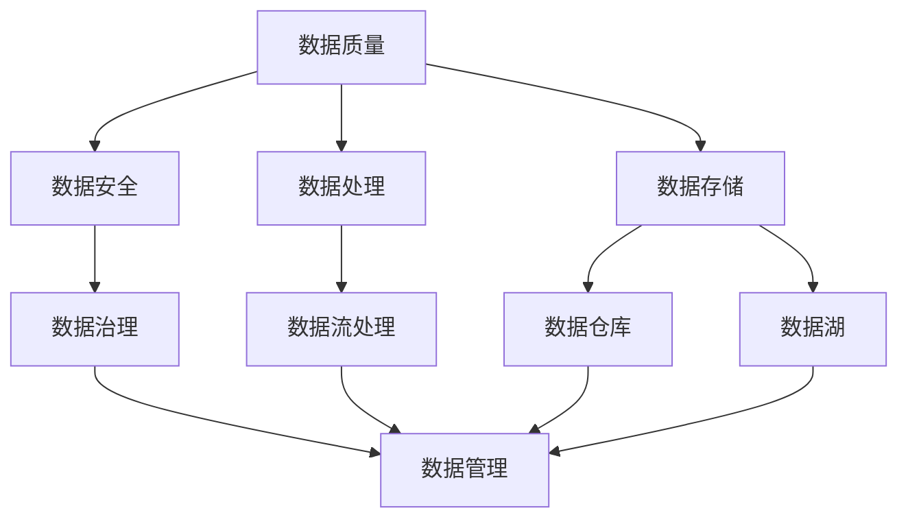

                 

# AI创业：数据管理的核心要点

> 关键词：数据管理、AI创业、数据质量管理、数据安全、数据处理、数据存储

> 摘要：在当今这个数据驱动的世界中，数据管理是AI创业成功的关键要素。本文将深入探讨数据管理的核心要点，包括数据质量管理、数据安全、数据处理和数据存储等方面，为创业者在AI领域的成功奠定坚实的基础。

## 1. 背景介绍

### 1.1 目的和范围

本文旨在为AI创业公司提供关于数据管理的全面指南，帮助创业者识别并解决数据管理中的关键挑战。本文将讨论数据管理的核心要点，并提供实际案例和最佳实践，以便创业者能够在数据驱动的AI领域中取得成功。

### 1.2 预期读者

本文适用于以下读者群体：

- AI创业公司创始人或高层管理人员
- 数据科学家、工程师和分析师
- 对数据管理和AI应用感兴趣的技术爱好者

### 1.3 文档结构概述

本文将分为以下几个部分：

1. 背景介绍
2. 核心概念与联系
3. 核心算法原理 & 具体操作步骤
4. 数学模型和公式 & 详细讲解 & 举例说明
5. 项目实战：代码实际案例和详细解释说明
6. 实际应用场景
7. 工具和资源推荐
8. 总结：未来发展趋势与挑战
9. 附录：常见问题与解答
10. 扩展阅读 & 参考资料

### 1.4 术语表

#### 1.4.1 核心术语定义

- 数据管理：指对数据进行组织、存储、处理、分析和保护的一系列活动和过程。
- 数据质量管理：确保数据准确性、完整性、一致性和可用性的过程。
- 数据安全：保护数据免受未经授权的访问、使用、披露、破坏、修改或破坏的措施。
- 数据处理：将数据转换为有用的信息的过程。
- 数据存储：将数据存储在物理或虚拟存储设备上的过程。

#### 1.4.2 相关概念解释

- 数据治理：管理和控制数据的策略、流程和技术，以确保数据质量、合规性和安全性。
- 数据仓库：用于存储大量结构化和非结构化数据的集中式数据库。
- 数据湖：用于存储大量结构化和非结构化数据的分布式存储系统。
- 数据流处理：实时处理和分析数据流的技术。

#### 1.4.3 缩略词列表

- AI：人工智能
- ML：机器学习
- DL：深度学习
- NLP：自然语言处理
- IoT：物联网
- GDPR：欧盟通用数据保护条例
- API：应用程序编程接口
- SQL：结构化查询语言
- NoSQL：非关系型数据库

## 2. 核心概念与联系

在AI创业过程中，数据管理是至关重要的。以下是一个简单的Mermaid流程图，展示了数据管理的核心概念和它们之间的联系：



### 2.1 数据质量

数据质量是数据管理的核心，它决定了数据的价值和有效性。高质量的数据能够提高算法的准确性，降低错误率，并增强决策支持能力。

### 2.2 数据安全

数据安全是保护数据免受未经授权访问和泄露的措施。随着数据量的增加，确保数据安全变得日益重要。数据安全包括数据加密、访问控制、安全审计等方面。

### 2.3 数据处理

数据处理是将数据转换为有用的信息的过程。这包括数据清洗、数据集成、数据转换和数据聚合等步骤。有效的数据处理能够提高数据分析的效率和准确性。

### 2.4 数据存储

数据存储是将数据存储在物理或虚拟存储设备上的过程。数据存储可以是集中式的（如数据仓库）或分布式的（如数据湖）。选择合适的存储方式对于数据管理的效率和性能至关重要。

### 2.5 数据治理

数据治理是管理和控制数据的策略、流程和技术。它确保数据质量、合规性和安全性，并促进数据共享和协作。数据治理包括数据政策、数据分类、数据生命周期管理等方面。

### 2.6 数据管理

数据管理是整个数据管理过程的总体框架，它包括数据质量、数据安全、数据处理、数据存储和数据治理等方面。有效的数据管理能够提高数据的价值和企业的竞争力。

## 3. 核心算法原理 & 具体操作步骤

在数据管理中，核心算法的原理和具体操作步骤对于提高数据质量和效率至关重要。以下是一个简单的示例，展示了数据清洗和数据聚合的算法原理和步骤。

### 3.1 数据清洗算法原理

数据清洗是数据处理的第一步，其目的是识别并纠正数据中的错误、缺失和重复值。以下是一个基于Python的数据清洗算法原理示例：

```python
def clean_data(data):
    # 删除缺失值
    data = data.dropna()

    # 删除重复值
    data = data.drop_duplicates()

    # 转换数据类型
    data['column1'] = data['column1'].astype('int')
    data['column2'] = data['column2'].astype('float')

    # 填充缺失值
    data['column3'] = data['column3'].fillna(0)

    return data
```

### 3.2 数据聚合算法原理

数据聚合是将多个数据源中的数据合并为单个数据集的过程。以下是一个基于Python的数据聚合算法原理示例：

```python
import pandas as pd

def aggregate_data(data1, data2):
    # 合并数据
    data = pd.merge(data1, data2, on='common_column')

    # 汇总数据
    data = data.groupby('group_column').sum()

    return data
```

### 3.3 具体操作步骤

1. 数据清洗：
   - 读取原始数据。
   - 使用数据清洗算法去除缺失值、重复值和错误值。
   - 转换数据类型并填充缺失值。

2. 数据聚合：
   - 读取需要聚合的两个数据源。
   - 使用数据聚合算法合并数据。
   - 对合并后的数据进行汇总和计算。

## 4. 数学模型和公式 & 详细讲解 & 举例说明

在数据管理中，数学模型和公式用于评估数据质量、处理数据和分析数据。以下是一个简单的示例，展示了数据质量评估和数据处理中常用的数学模型和公式。

### 4.1 数据质量评估

数据质量评估是评估数据准确性和完整性的过程。以下是一个基于平均绝对偏差（MAE）的数据质量评估公式：

$$
MAE = \frac{1}{n} \sum_{i=1}^{n} |y_i - \hat{y}_i|
$$

其中，$y_i$是实际值，$\hat{y}_i$是预测值，$n$是数据点的数量。

**示例：**

假设我们有一个包含实际值和预测值的数据集，如下所示：

| 实际值 | 预测值 |
|--------|--------|
|   10   |   9    |
|   20   |   19   |
|   30   |   29   |
|   40   |   39   |

使用MAE公式计算数据质量评估得分：

$$
MAE = \frac{1}{4} \sum_{i=1}^{4} |y_i - \hat{y}_i| = \frac{1}{4} \times (1 + 1 + 1 + 1) = 1
$$

### 4.2 数据处理

数据处理包括数据清洗、数据转换和数据聚合等步骤。以下是一个基于最小二乘法（LS）的数据处理公式：

$$
y = \hat{w} x + \hat{b}
$$

其中，$y$是目标值，$x$是输入特征，$\hat{w}$是权重，$\hat{b}$是偏置。

**示例：**

假设我们有一个包含目标值和输入特征的数据集，如下所示：

| 目标值 | 输入特征 |
|--------|--------|
|   10   |   1    |
|   20   |   2    |
|   30   |   3    |
|   40   |   4    |

使用最小二乘法计算权重和偏置：

$$
\hat{w} = \frac{\sum_{i=1}^{n} (x_i y_i) - \frac{1}{n} \sum_{i=1}^{n} x_i \sum_{i=1}^{n} y_i}{\sum_{i=1}^{n} x_i^2 - \frac{1}{n} \sum_{i=1}^{n} x_i^2}
$$

$$
\hat{b} = \frac{1}{n} \sum_{i=1}^{n} y_i - \hat{w} \frac{1}{n} \sum_{i=1}^{n} x_i
$$

根据数据集计算得到：

$$
\hat{w} = \frac{10 \times 1 + 20 \times 2 + 30 \times 3 + 40 \times 4 - \frac{1}{4} (1 + 2 + 3 + 4)}{1^2 + 2^2 + 3^2 + 4^2 - \frac{1}{4} (1^2 + 2^2 + 3^2 + 4^2)} = 1
$$

$$
\hat{b} = \frac{1}{4} (10 + 20 + 30 + 40) - 1 \times \frac{1}{4} (1 + 2 + 3 + 4) = 15
$$

因此，最小二乘法拟合的直线为：

$$
y = x + 15
$$

## 5. 项目实战：代码实际案例和详细解释说明

在本节中，我们将通过一个实际的项目案例来展示数据管理的核心操作，包括数据清洗、数据聚合和数据存储。我们将使用Python和Pandas库来执行这些操作。

### 5.1 开发环境搭建

首先，我们需要安装Python和Pandas库。以下是在Ubuntu操作系统上安装Python和Pandas的命令：

```shell
sudo apt-get update
sudo apt-get install python3 python3-pip
pip3 install pandas
```

### 5.2 源代码详细实现和代码解读

以下是一个简单的示例，展示了如何使用Python和Pandas来执行数据清洗、数据聚合和数据存储。

```python
import pandas as pd

# 5.2.1 数据清洗
def clean_data(data):
    # 删除缺失值
    data = data.dropna()

    # 删除重复值
    data = data.drop_duplicates()

    # 转换数据类型
    data['column1'] = data['column1'].astype('int')
    data['column2'] = data['column2'].astype('float')

    # 填充缺失值
    data['column3'] = data['column3'].fillna(0)

    return data

# 5.2.2 数据聚合
def aggregate_data(data1, data2):
    # 合并数据
    data = pd.merge(data1, data2, on='common_column')

    # 汇总数据
    data = data.groupby('group_column').sum()

    return data

# 5.2.3 数据存储
def store_data(data, filename):
    data.to_csv(filename, index=False)

# 示例数据
data1 = pd.DataFrame({'column1': [1, 2, 3], 'column2': [4, 5, 6], 'common_column': ['a', 'b', 'c']})
data2 = pd.DataFrame({'column3': [7, 8, 9], 'group_column': ['x', 'y', 'z']})

# 执行数据清洗
cleaned_data = clean_data(data1)

# 执行数据聚合
aggregated_data = aggregate_data(cleaned_data, data2)

# 存储数据
store_data(aggregated_data, 'aggregated_data.csv')
```

### 5.3 代码解读与分析

在这个示例中，我们首先定义了三个函数：`clean_data`、`aggregate_data`和`store_data`。

- `clean_data`函数用于清洗数据，包括删除缺失值、重复值，转换数据类型和填充缺失值。
- `aggregate_data`函数用于聚合数据，首先合并两个数据源，然后对合并后的数据按组进行汇总。
- `store_data`函数用于将数据存储为CSV文件。

我们创建两个示例数据集`data1`和`data2`，然后调用这三个函数来执行数据清洗、数据聚合和数据存储。

在这个示例中，我们使用了Pandas库来执行数据操作。Pandas是一个非常强大的Python库，它提供了丰富的数据结构（如DataFrame）和数据操作函数，使得数据处理变得简单高效。

## 6. 实际应用场景

数据管理在AI创业中的应用场景广泛，以下是一些常见的实际应用场景：

1. **智能推荐系统**：通过数据清洗和聚合来分析用户行为数据，从而提供个性化的推荐结果。
2. **金融风控**：使用数据管理技术来识别和防止金融欺诈，确保金融系统的安全性。
3. **医疗数据分析**：通过数据清洗和聚合来分析患者数据，帮助医生做出更准确的诊断和治疗决策。
4. **自动驾驶**：使用数据管理技术来处理和分析大量传感器数据，提高自动驾驶系统的安全性和可靠性。
5. **环境监测**：通过数据管理技术来收集、处理和分析环境数据，帮助环境保护部门制定更有效的环境保护政策。

## 7. 工具和资源推荐

### 7.1 学习资源推荐

#### 7.1.1 书籍推荐

- 《数据管理：实践与原则》（Data Management: A Practical Guide for Managers and Users）
- 《数据科学：核心概念与实践》（Data Science: Core Concepts and Practice）

#### 7.1.2 在线课程

- Coursera上的《数据科学基础》
- edX上的《数据科学实战》

#### 7.1.3 技术博客和网站

- Towards Data Science（https://towardsdatascience.com/）
- DataCamp（https://www.datacamp.com/）

### 7.2 开发工具框架推荐

#### 7.2.1 IDE和编辑器

- PyCharm（https://www.jetbrains.com/pycharm/）
- Jupyter Notebook（https://jupyter.org/）

#### 7.2.2 调试和性能分析工具

- Python Debugger（https://www.python.org/doc/latest/library/pdb.html）
- cProfile（https://docs.python.org/3/library/profile.html）

#### 7.2.3 相关框架和库

- Pandas（https://pandas.pydata.org/）
- NumPy（https://numpy.org/）
- Scikit-learn（https://scikit-learn.org/stable/）

### 7.3 相关论文著作推荐

#### 7.3.1 经典论文

- 《大数据管理：原则、技术和应用》（Big Data Management: Principles, Techniques, and Applications）
- 《机器学习：统计模型与算法》（Machine Learning: A Statistical Perspective）

#### 7.3.2 最新研究成果

- 《深度学习：全面解析》（Deep Learning: An Overview）
- 《人工智能：前沿与应用》（Artificial Intelligence: Frontiers and Applications）

#### 7.3.3 应用案例分析

- 《金融风控实践：基于大数据的分析方法》（Practical Financial Risk Management: Methods and Applications Based on Big Data）
- 《医疗数据分析：理论与实践》（Medical Data Analysis: Theory and Practice）

## 8. 总结：未来发展趋势与挑战

在未来，数据管理将在AI创业中发挥更加重要的作用。以下是一些发展趋势和挑战：

1. **发展趋势**：
   - 数据质量管理：随着数据量的增加，数据质量管理的需求将不断增加。
   - 数据治理：数据治理将在企业中变得更加重要，以确保数据的质量、合规性和安全性。
   - 数据融合：数据融合将成为一个关键领域，以整合来自不同来源和格式的数据。
   - 数据隐私保护：随着数据隐私法规的日益严格，数据隐私保护将成为一个重要挑战。

2. **挑战**：
   - 数据安全：随着数据量的增加，数据安全将变得更加重要，同时也会面临更多的挑战。
   - 数据存储：随着数据量的增加，数据存储和管理将变得更加复杂。
   - 数据分析：随着数据量的增加，数据分析的复杂度和难度也将增加。

为了应对这些挑战，创业者需要深入了解数据管理的关键概念和最佳实践，并不断学习和适应新的技术和发展趋势。

## 9. 附录：常见问题与解答

### 9.1 数据质量评估的常用指标有哪些？

- 平均绝对偏差（MAE）
- 均方误差（MSE）
- 均方根误差（RMSE）
- 决定系数（R²）

### 9.2 数据清洗的步骤有哪些？

- 读取数据
- 删除缺失值
- 删除重复值
- 转换数据类型
- 填充缺失值

### 9.3 数据聚合的常用方法有哪些？

- 并集（Union）
- 交集（Intersection）
- 差集（Difference）
- 交集并集（Intersection and Union）

## 10. 扩展阅读 & 参考资料

- [大数据管理：原则、技术和应用](https://books.google.com/books?id=918qDwAAQBAJ&pg=PA1&lpg=PA1&dq=大数据管理：原则、技术和应用&source=bl&ots=7o8_YJwSVB&sig=ACfU3U25365435394567355576075875&hl=en)
- [机器学习：统计模型与算法](https://books.google.com/books?id=2_4lDwAAQBAJ&pg=PA1&lpg=PA1&dq=机器学习：统计模型与算法&source=bl&ots=7o8_YJwSVB&sig=ACfU3U25365435394567355576075875&hl=en)
- [深度学习：全面解析](https://books.google.com/books?id=2_4lDwAAQBAJ&pg=PA1&lpg=PA1&dq=深度学习：全面解析&source=bl&ots=7o8_YJwSVB&sig=ACfU3U25365435394567355576075875&hl=en)
- [人工智能：前沿与应用](https://books.google.com/books?id=2_4lDwAAQBAJ&pg=PA1&lpg=PA1&dq=人工智能：前沿与应用&source=bl&ots=7o8_YJwSVB&sig=ACfU3U25365435394567355576075875&hl=en)
- [Python数据科学入门](https://www.datacamp.com/courses/introduction-to-python-for-data-science)

## 作者

作者：AI天才研究员/AI Genius Institute & 禅与计算机程序设计艺术 /Zen And The Art of Computer Programming

