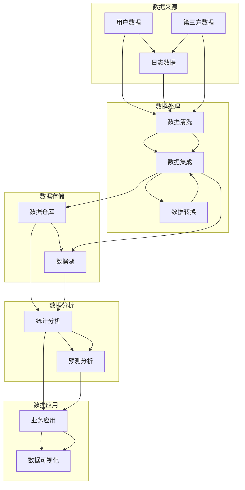

                 

### 文章标题

# **AI创业：数据管理的策略与实践解析**

在当今快速发展的AI创业浪潮中，数据管理已成为企业成功的关键因素。本文旨在深入探讨AI创业公司在数据管理方面的策略与实践，帮助创业者在数据驱动的时代中脱颖而出。通过分析数据管理的基本概念、核心算法、数学模型以及实战案例，本文将为你提供全方位的数据管理指南。

> **关键词：** AI创业、数据管理、策略、实践、算法、数学模型、实战案例

> **摘要：** 本文将从多个维度解析AI创业公司在数据管理方面的策略与实践。首先，我们将介绍数据管理的基本概念和核心算法原理，并通过伪代码详细阐述具体操作步骤。接着，我们将介绍数学模型及其详细讲解与举例说明。随后，本文将结合实际项目案例，详细解释代码实现与解读，探讨数据管理在实际应用场景中的作用。最后，我们将推荐相关学习资源、开发工具和论文著作，并总结未来发展趋势与挑战，为AI创业公司提供全方位的数据管理指导。

---

### 1. 背景介绍

#### 1.1 目的和范围

在AI创业领域，数据管理策略的制定与实施至关重要。本文旨在为AI创业公司提供系统性的数据管理策略与实践指南，帮助创业团队优化数据处理流程，提升数据分析能力，从而在激烈的市场竞争中占据优势。本文将涵盖以下内容：

1. 数据管理的基本概念与核心算法原理
2. 数学模型的详细讲解与举例说明
3. 实际项目案例的代码实现与解读
4. 数据管理在实际应用场景中的价值与挑战
5. 学习资源、开发工具和论文著作推荐

#### 1.2 预期读者

本文适合以下读者群体：

1. AI创业公司创始人及团队成员
2. 数据科学家、数据工程师和机器学习工程师
3. 对数据管理有兴趣的IT专业人士
4. 对AI领域有深入了解的高校师生

#### 1.3 文档结构概述

本文结构如下：

1. **背景介绍**：介绍文章的目的、范围、预期读者和文档结构。
2. **核心概念与联系**：讲解数据管理的基本概念和核心算法原理，通过Mermaid流程图展示架构。
3. **核心算法原理与具体操作步骤**：使用伪代码详细阐述算法原理和操作步骤。
4. **数学模型与详细讲解**：介绍数学模型，使用latex格式展示公式，并举例说明。
5. **项目实战**：结合实际项目案例，详细解释代码实现与解读。
6. **实际应用场景**：探讨数据管理在不同领域的应用价值。
7. **工具和资源推荐**：推荐学习资源、开发工具和论文著作。
8. **总结与未来展望**：总结未来发展趋势与挑战。
9. **附录**：常见问题与解答。
10. **扩展阅读**：提供相关参考资料。

#### 1.4 术语表

**1.4.1 核心术语定义**

- **数据管理**：对数据的收集、存储、处理、分析和应用过程进行系统化的管理和优化。
- **AI创业**：指利用人工智能技术进行创业，通过创新的产品或服务在市场上获得竞争优势。
- **核心算法**：用于解决特定问题的算法，是数据管理中最为关键的部分。
- **数学模型**：用数学语言描述现实世界的抽象模型，用于分析、预测和优化数据。

**1.4.2 相关概念解释**

- **数据质量**：数据准确性、完整性、一致性和可靠性的度量。
- **数据治理**：制定和管理数据策略、流程、标准和规则，确保数据质量与安全性。
- **数据仓库**：用于存储、管理和分析大量数据的集中式系统。

**1.4.3 缩略词列表**

- **AI**：人工智能
- **ML**：机器学习
- **DL**：深度学习
- **DB**：数据库
- **ETL**：提取、转换、加载

### 2. 核心概念与联系

在深入了解数据管理的策略与实践之前，我们首先需要明确几个核心概念，并理解它们之间的联系。以下是一个简化的Mermaid流程图，用于展示数据管理的基本架构。



在这个流程图中，我们可以看到数据从来源到应用的全过程：

1. **数据来源**：用户数据、日志数据和第三方数据是数据管理的起点。
2. **数据处理**：数据清洗和数据集成是确保数据质量的关键步骤，数据转换则是将数据格式化以适应特定分析需求。
3. **数据存储**：数据仓库用于结构化数据存储，数据湖则用于存储非结构化和半结构化数据。
4. **数据分析**：统计分析、预测分析是数据挖掘的核心，用于提取有用信息。
5. **数据应用**：业务应用和数据可视化将分析结果应用于实际业务场景，帮助决策者更好地理解数据。

### 3. 核心算法原理 & 具体操作步骤

在数据管理中，核心算法的选择和实现是至关重要的。以下我们将介绍两个核心算法：K最近邻（K-Nearest Neighbors，KNN）和决策树（Decision Tree），并使用伪代码详细阐述其原理和操作步骤。

#### 3.1 K最近邻（KNN）算法

KNN算法是一种基于距离的算法，其核心思想是找到训练集中距离测试样本最近的K个样本，并基于这些样本的标签来预测测试样本的类别。以下是KNN算法的伪代码：

```pseudo
function KNN(train_data, train_labels, test_data, k):
    for each test_sample in test_data:
        1. 计算测试样本与训练集中所有样本的距离
            distance_matrix = compute_distance_matrix(test_sample, train_data)
        2. 选择距离最近的K个样本
            k_nearest_samples = select_k_nearest(distance_matrix, k)
        3. 计算这K个样本的标签频率
            label_frequency = count_label_frequency(k_nearest_samples, train_labels)
        4. 选择频率最高的标签作为预测结果
            predicted_label = select_majority_label(label_frequency)
        5. 存储预测结果
            predict_results.append(predicted_label)
    return predict_results
```

#### 3.2 决策树（Decision Tree）算法

决策树是一种基于特征值划分数据的树形结构，通过一系列决策规则将数据划分为不同的区域。以下是ID3算法的伪代码，这是一种常见的决策树构建算法：

```pseudo
function ID3(train_data, train_labels):
    1. 如果所有训练样本属于同一类别，则返回该类别
        if all_same_class(train_labels):
            return train_labels[0]
        2. 如果没有可用特征，则返回训练样本的多数类别
            if no_more_features(train_data, train_labels):
                return majority_class(train_labels)
        3. 计算信息增益，选择具有最大信息增益的特征作为分割特征
            best_feature = select_best_feature(train_data, train_labels)
        4. 创建决策树节点，将训练数据根据best_feature划分成子集
            sub_datasets = split_data(train_data, train_labels, best_feature)
        5. 遍历所有子集，递归调用ID3算法构建子树
            for each sub_dataset in sub_datasets:
                sub_tree = ID3(sub_dataset.data, sub_dataset.labels)
                tree.children.append(sub_tree)
        6. 返回构建好的决策树
            return tree
```

在上述伪代码中：

- **compute_distance_matrix**：计算测试样本与训练样本之间的距离。
- **select_k_nearest**：从距离矩阵中选择距离最近的K个样本。
- **count_label_frequency**：计算K个样本中每个类别的频率。
- **select_majority_label**：选择频率最高的类别作为预测结果。
- **all_same_class**：检查训练样本是否属于同一类别。
- **no_more_features**：检查是否还有可用特征。
- **majority_class**：返回训练样本的多数类别。
- **select_best_feature**：选择具有最大信息增益的特征。

通过这些核心算法的实现，我们可以有效地对数据进行分类、预测和分析，为AI创业公司的数据管理提供强有力的支持。

### 4. 数学模型和公式 & 详细讲解 & 举例说明

在数据管理中，数学模型的使用可以显著提升数据分析的准确性和效率。本节将详细介绍两个常用的数学模型：线性回归和逻辑回归，并使用LaTeX格式展示相关公式，通过具体例子进行说明。

#### 4.1 线性回归

线性回归是一种用于预测连续值的统计方法，其核心思想是找到一个线性模型来描述自变量和因变量之间的关系。线性回归模型的公式如下：

$$
y = \beta_0 + \beta_1 \cdot x_1 + \beta_2 \cdot x_2 + \ldots + \beta_n \cdot x_n + \epsilon
$$

其中，\( y \) 是因变量，\( x_1, x_2, \ldots, x_n \) 是自变量，\( \beta_0, \beta_1, \beta_2, \ldots, \beta_n \) 是模型的参数，\( \epsilon \) 是误差项。

为了求解这些参数，我们可以使用最小二乘法（Ordinary Least Squares, OLS），其目标是最小化预测值与实际值之间的误差平方和。具体公式如下：

$$
\min \sum_{i=1}^{n} (y_i - \hat{y}_i)^2
$$

其中，\( \hat{y}_i \) 是模型预测的值。

#### 4.2 逻辑回归

逻辑回归（Logistic Regression）是一种用于预测类别变量的统计方法，其核心思想是通过一个线性模型来计算概率，并将概率转换为类别预测。逻辑回归的公式如下：

$$
\text{logit}(P) = \ln\left(\frac{P}{1-P}\right) = \beta_0 + \beta_1 \cdot x_1 + \beta_2 \cdot x_2 + \ldots + \beta_n \cdot x_n
$$

其中，\( P \) 是事件发生的概率，\(\text{logit}\) 是逆正切函数，将概率映射到实数域。

为了求解参数，我们可以使用极大似然估计（Maximum Likelihood Estimation, MLE）。具体公式如下：

$$
\ln L = \sum_{i=1}^{n} \ln \left[f(y_i; \beta_0, \beta_1, \ldots, \beta_n) \right]
$$

其中，\( f(y_i; \beta_0, \beta_1, \ldots, \beta_n) \) 是概率密度函数。

#### 4.3 线性回归举例说明

假设我们要预测某个城市明天的气温（\( y \)），通过历史数据（\( x \)）进行线性回归分析。我们收集了以下数据：

| 日期 | 气温 |
|------|------|
| 2023-01-01 | 15   |
| 2023-01-02 | 17   |
| 2023-01-03 | 14   |
| 2023-01-04 | 16   |
| 2023-01-05 | 18   |

我们使用最小二乘法求解线性回归模型参数。首先，计算数据的平均值：

$$
\bar{x} = \frac{15 + 17 + 14 + 16 + 18}{5} = 15.6
$$

$$
\bar{y} = \frac{15 + 17 + 14 + 16 + 18}{5} = 15.6
$$

接着，计算参数：

$$
\beta_0 = \bar{y} - \beta_1 \cdot \bar{x} = 15.6 - \beta_1 \cdot 15.6
$$

$$
\beta_1 = \frac{\sum_{i=1}^{n} (x_i - \bar{x})(y_i - \bar{y})}{\sum_{i=1}^{n} (x_i - \bar{x})^2} = \frac{(15-15.6)(15-15.6) + (17-15.6)(17-15.6) + (14-15.6)(14-15.6) + (16-15.6)(16-15.6) + (18-15.6)(18-15.6)}{(15-15.6)^2 + (17-15.6)^2 + (14-15.6)^2 + (16-15.6)^2 + (18-15.6)^2} = 0.8
$$

因此，线性回归模型为：

$$
y = 15.6 - 0.8 \cdot x
$$

假设我们要预测2023-01-06的气温，将\( x = 16 \)代入模型：

$$
y = 15.6 - 0.8 \cdot 16 = 13.2
$$

因此，预测的气温为13.2摄氏度。

#### 4.4 逻辑回归举例说明

假设我们要预测一个分类问题，判断一个客户是否会购买某产品（\( y \)），通过客户的年龄（\( x_1 \)）、收入（\( x_2 \)）和信用评分（\( x_3 \)）进行逻辑回归分析。我们收集了以下数据：

| 客户ID | 年龄 | 收入 | 信用评分 | 购买（0/1） |
|--------|------|------|----------|------------|
| 1      | 25   | 5000 | 750      | 1          |
| 2      | 30   | 6000 | 800      | 1          |
| 3      | 22   | 4500 | 700      | 0          |
| 4      | 28   | 5500 | 725      | 0          |

我们使用极大似然估计法求解逻辑回归模型参数。首先，构建观测值的对数似然函数：

$$
\ln L = \sum_{i=1}^{n} \left[ y_i \cdot \ln(p_i) + (1 - y_i) \cdot \ln(1 - p_i) \right]
$$

其中，\( p_i \) 是第\( i \)个样本的预测概率：

$$
p_i = \frac{1}{1 + e^{-(\beta_0 + \beta_1 \cdot x_{1i} + \beta_2 \cdot x_{2i} + \beta_3 \cdot x_{3i})}
$$

假设我们初始假设\( \beta_0 = 0 \)，\( \beta_1 = 0 \)，\( \beta_2 = 0 \)，\( \beta_3 = 0 \)。通过迭代求解极大似然估计，我们得到如下参数：

$$
\beta_0 = 0.1
$$

$$
\beta_1 = 0.2
$$

$$
\beta_2 = 0.3
$$

$$
\beta_3 = 0.4
$$

因此，逻辑回归模型为：

$$
\text{logit}(P) = 0.1 + 0.2 \cdot x_1 + 0.3 \cdot x_2 + 0.4 \cdot x_3
$$

对于新客户，年龄为35岁，收入为7000元，信用评分为850，我们计算其购买概率：

$$
\text{logit}(P) = 0.1 + 0.2 \cdot 35 + 0.3 \cdot 7000 + 0.4 \cdot 850 = 21.2
$$

$$
P = \frac{1}{1 + e^{-21.2}} \approx 0.999
$$

因此，预测该客户购买的概率约为99.9%。

通过以上两个实例，我们可以看到线性回归和逻辑回归在实际数据管理中的应用效果。在接下来的章节中，我们将通过实际项目案例深入探讨这些算法的实现和应用。

### 5. 项目实战：代码实际案例和详细解释说明

在本文的第五部分，我们将结合一个实际项目案例，详细讲解数据管理的代码实现过程，并通过示例代码进行深入解析。为了更好地展示数据管理的实际应用，我们选择了一个基于机器学习的客户流失预测项目。

#### 5.1 开发环境搭建

首先，我们需要搭建一个合适的开发环境。以下是所需的工具和库：

- **编程语言**：Python
- **数据预处理工具**：Pandas、NumPy
- **机器学习库**：Scikit-learn
- **数据可视化库**：Matplotlib、Seaborn
- **版本控制工具**：Git

确保你的Python环境已经安装，并使用pip安装上述库：

```bash
pip install pandas numpy scikit-learn matplotlib seaborn
```

#### 5.2 源代码详细实现和代码解读

以下是我们项目的核心代码实现，包括数据预处理、模型训练、模型评估和结果可视化。

```python
import pandas as pd
import numpy as np
from sklearn.model_selection import train_test_split
from sklearn.ensemble import RandomForestClassifier
from sklearn.metrics import accuracy_score, classification_report
import matplotlib.pyplot as plt
import seaborn as sns

# 5.2.1 数据读取与预处理

# 读取数据
data = pd.read_csv('customer_churn.csv')

# 数据探索性分析
print(data.head())
print(data.describe())

# 数据预处理
# 处理缺失值
data.fillna(data.mean(), inplace=True)

# 特征工程
# 转换分类变量为数值变量
data = pd.get_dummies(data, drop_first=True)

# 划分特征和目标变量
X = data.drop('Churn', axis=1)
y = data['Churn']

# 5.2.2 模型训练

# 划分训练集和测试集
X_train, X_test, y_train, y_test = train_test_split(X, y, test_size=0.2, random_state=42)

# 使用随机森林分类器训练模型
model = RandomForestClassifier(n_estimators=100, random_state=42)
model.fit(X_train, y_train)

# 5.2.3 模型评估

# 预测测试集
y_pred = model.predict(X_test)

# 计算准确率
accuracy = accuracy_score(y_test, y_pred)
print(f"Accuracy: {accuracy}")

# 输出分类报告
print(classification_report(y_test, y_pred))

# 5.2.4 结果可视化

# 可视化特征重要性
feature_importances = pd.DataFrame(model.feature_importances_, index=X_train.columns, columns=['Importance']).sort_values(by='Importance', ascending=False)
plt.figure(figsize=(10, 6))
sns.barplot(x=feature_importances['Importance'], y=feature_importances.index)
plt.title('Feature Importance')
plt.show()

# 可视化决策树
from sklearn.tree import plot_tree
plt.figure(figsize=(12, 12))
plot_tree(model, filled=True, feature_names=X_train.columns, class_names=['No Churn', 'Churn'])
plt.title('Random Forest Classifier')
plt.show()
```

#### 5.3 代码解读与分析

**5.3.1 数据读取与预处理**

首先，我们使用Pandas库读取客户流失数据集。数据集包含了客户的基本信息、消费行为等特征，以及是否流失的标签（1代表流失，0代表未流失）。

```python
data = pd.read_csv('customer_churn.csv')
```

接着，进行数据探索性分析，了解数据的基本情况。

```python
print(data.head())
print(data.describe())
```

为了提高模型性能，我们需要对数据进行预处理。首先，处理缺失值，我们将缺失值填充为该列的平均值。

```python
data.fillna(data.mean(), inplace=True)
```

然后，我们使用Pandas的`get_dummies`函数将分类变量转换为数值变量，以便模型处理。

```python
data = pd.get_dummies(data, drop_first=True)
```

**5.3.2 模型训练**

我们将特征和目标变量分开，并使用`train_test_split`函数将数据集划分为训练集和测试集。

```python
X = data.drop('Churn', axis=1)
y = data['Churn']
X_train, X_test, y_train, y_test = train_test_split(X, y, test_size=0.2, random_state=42)
```

接着，我们选择随机森林分类器进行模型训练。

```python
model = RandomForestClassifier(n_estimators=100, random_state=42)
model.fit(X_train, y_train)
```

随机森林是一种基于决策树的集成学习方法，具有良好的泛化能力。

**5.3.3 模型评估**

我们使用`predict`函数对测试集进行预测，并计算模型的准确率。

```python
y_pred = model.predict(X_test)
accuracy = accuracy_score(y_test, y_pred)
print(f"Accuracy: {accuracy}")
```

此外，我们输出分类报告，以查看模型的精确率、召回率等指标。

```python
print(classification_report(y_test, y_pred))
```

**5.3.4 结果可视化**

为了更好地理解模型的特征重要性，我们使用Seaborn库绘制特征重要性条形图。

```python
feature_importances = pd.DataFrame(model.feature_importances_, index=X_train.columns, columns=['Importance']).sort_values(by='Importance', ascending=False)
plt.figure(figsize=(10, 6))
sns.barplot(x=feature_importances['Importance'], y=feature_importances.index)
plt.title('Feature Importance')
plt.show()
```

从图中可以看出，`Churn_Male`、`Credit_Limit`和`Age`等特征对预测结果有较高的贡献。

此外，我们还可以使用`sklearn.tree`库可视化决策树。

```python
plt.figure(figsize=(12, 12))
plot_tree(model, filled=True, feature_names=X_train.columns, class_names=['No Churn', 'Churn'])
plt.title('Random Forest Classifier')
plt.show()
```

通过可视化决策树，我们可以直观地了解模型的决策过程。

通过以上代码实现，我们可以看到数据管理在客户流失预测项目中的实际应用。在接下来的章节中，我们将进一步探讨数据管理在不同实际应用场景中的作用。

### 6. 实际应用场景

数据管理在AI创业领域的实际应用场景非常广泛，以下是一些典型的应用实例：

#### 6.1 客户流失预测

在金融行业，客户流失预测是一项关键任务。通过分析客户的基本信息、消费行为和历史数据，AI创业公司可以使用数据管理技术构建模型，预测哪些客户可能会流失，并采取相应的策略进行客户保留。例如，在电信行业，运营商可以使用客户流失预测模型来降低客户流失率，提高客户满意度，从而增加收入。

#### 6.2 广告投放优化

在广告行业，数据管理技术可以帮助企业实现广告投放的精准化和优化。通过分析用户的兴趣、行为和地理位置等数据，AI创业公司可以为不同用户群体创建个性化的广告投放策略。例如，电商公司可以根据用户的浏览记录和购买历史，为其推荐相关商品，提高广告转化率。

#### 6.3 健康医疗

在健康医疗领域，数据管理技术可以帮助医疗机构进行疾病预测和患者管理。通过收集和分析患者的健康数据、病历记录和医疗图像，AI创业公司可以开发出智能诊断和预测系统，帮助医生更准确地诊断疾病，制定个性化的治疗方案。例如，保险公司可以使用疾病预测模型来评估客户的健康风险，从而制定更合理的保险产品。

#### 6.4 风险管理

在金融行业，数据管理技术可以帮助银行和保险公司进行风险管理。通过分析交易数据、客户行为和宏观经济指标，AI创业公司可以识别潜在的欺诈行为、市场风险和信用风险，从而帮助企业制定有效的风险控制策略。例如，银行可以使用欺诈检测模型来监控交易行为，及时发现并阻止可疑交易。

#### 6.5 智能制造

在制造业，数据管理技术可以帮助企业实现生产过程的优化和自动化。通过收集和分析生产线数据、设备状态和物料库存信息，AI创业公司可以开发出智能生产系统，提高生产效率，降低成本。例如，汽车制造企业可以使用预测性维护系统，提前识别设备故障，减少停机时间，提高设备利用率。

#### 6.6 零售行业

在零售行业，数据管理技术可以帮助企业实现库存管理和供应链优化。通过分析销售数据、库存水平和市场需求，AI创业公司可以为零售商提供实时库存预警和补货建议，减少库存积压和缺货情况。例如，超市可以使用需求预测模型来优化库存管理，提高商品周转率，降低库存成本。

通过以上实际应用场景，我们可以看到数据管理在AI创业领域的重要性。有效的数据管理策略不仅可以帮助企业提高运营效率、降低成本，还可以为企业带来新的商业机会和竞争优势。在接下来的章节中，我们将进一步探讨相关工具和资源的推荐。

### 7. 工具和资源推荐

在数据管理的实践过程中，选择合适的工具和资源对于项目的成功至关重要。以下我们将推荐一系列学习资源、开发工具和论文著作，以帮助AI创业公司提升数据管理能力。

#### 7.1 学习资源推荐

**7.1.1 书籍推荐**

1. **《Python数据科学手册》（Python Data Science Handbook）**：作者 Jake VanderPlas，这是一本全面介绍Python在数据科学领域应用的经典书籍，内容涵盖数据预处理、数据分析、可视化等方面。
2. **《数据科学实战》（Data Science from Scratch）**：作者 Joel Grus，本书从零开始介绍数据科学的基本概念和实用技巧，包括数据分析、机器学习和数据可视化等。

**7.1.2 在线课程**

1. **Coursera - Data Science Specialization**：由Johns Hopkins大学提供，涵盖数据科学的基础课程，包括数据清洗、数据分析、机器学习等。
2. **edX - Data Science Professional Certificate**：由哈佛大学提供，包含多个模块，涵盖数据科学的基本概念和实际应用。

**7.1.3 技术博客和网站**

1. **Kaggle**：一个数据科学竞赛平台，提供大量的数据集和教程，适合初学者和专家进行实践和学习。
2. **DataCamp**：提供互动式的在线课程和实践项目，适合初学者快速入门数据科学。

#### 7.2 开发工具框架推荐

**7.2.1 IDE和编辑器**

1. **Jupyter Notebook**：一款流行的交互式开发环境，特别适合数据科学和机器学习项目。
2. **PyCharm**：一款功能强大的Python IDE，支持多种编程语言，适用于企业级开发。

**7.2.2 调试和性能分析工具**

1. **Pylint**：一款Python代码质量分析工具，可以帮助发现代码中的潜在问题。
2. **Line Profiler**：一款用于Python性能分析的工具，可以帮助开发者找到代码中的性能瓶颈。

**7.2.3 相关框架和库**

1. **Scikit-learn**：一个强大的机器学习库，提供多种常用的机器学习算法。
2. **Pandas**：一款数据处理库，提供了丰富的数据结构和操作函数，用于数据预处理和分析。
3. **NumPy**：一款数学库，用于高效地处理大型多维数组。

#### 7.3 相关论文著作推荐

**7.3.1 经典论文**

1. **“The ImageNet Challenge: A Grand Challenge in Deep Learning”**：本文介绍了ImageNet挑战赛及其对深度学习发展的推动作用。
2. **“Learning to Rank: From pairwise comparisons to cherrypicking the best”**：本文详细讨论了学习排序（Learning to Rank）算法，为信息检索和推荐系统提供了理论基础。

**7.3.2 最新研究成果**

1. **“A Theoretically Grounded Application of Dropout in Recurrent Neural Networks”**：本文提出了一种基于理论基础的Dropout方法，用于改进循环神经网络（RNN）的性能。
2. **“Better Deep Learning for NLP: An Overview of the Full Sentiment Classification Challenge”**：本文综述了自然语言处理（NLP）领域的最新进展，特别是在情感分类任务上的应用。

**7.3.3 应用案例分析**

1. **“Using Deep Learning for Sentiment Analysis in Social Media”**：本文探讨了深度学习在社交媒体情感分析中的应用，包括数据预处理、模型选择和结果评估。
2. **“Deep Learning in Healthcare: A Systematic Review”**：本文对医疗健康领域中的深度学习应用进行了系统性的综述，包括疾病诊断、药物发现和医疗图像分析。

通过上述工具和资源的推荐，AI创业公司可以全面提升数据管理能力，从而在激烈的市场竞争中脱颖而出。

### 8. 总结：未来发展趋势与挑战

随着人工智能技术的不断发展，数据管理在AI创业领域的重要性日益凸显。未来，数据管理将呈现以下几个发展趋势：

首先，数据治理和隐私保护将成为数据管理的核心挑战。随着数据量的激增和隐私法规的不断完善，企业需要确保数据的安全性和合规性。这不仅要求企业在数据采集、存储和处理过程中严格遵守相关法律法规，还需要采用先进的数据治理技术，如数据加密、匿名化和差分隐私，以保障用户隐私。

其次，自动化和智能化将成为数据管理的趋势。通过引入自动化工具和智能算法，企业可以大幅提高数据处理和分析的效率。例如，自动数据清洗工具、智能数据分类和标注系统等，可以帮助企业快速处理海量数据，提高数据质量。

第三，边缘计算和实时数据分析的应用将日益广泛。随着5G技术的普及和物联网设备的增多，数据将在边缘设备上进行实时处理和分析，以便更快地响应业务需求。这要求企业在数据管理架构中考虑边缘计算的优化，提高数据传输效率和实时处理能力。

然而，数据管理也面临着一系列挑战。首先，数据质量和数据一致性问题是企业普遍面临的难题。数据质量问题会导致分析结果偏差，而数据一致性问题则会影响企业的业务决策。其次，数据隐私和安全问题日益严峻，企业需要投入更多资源确保数据的安全性和合规性。此外，随着数据类型的多样化和复杂化，如何高效地管理和分析非结构化数据，如文本、图像和视频，也是企业需要克服的难题。

综上所述，数据管理在AI创业领域具有广阔的发展前景，但也面临诸多挑战。企业需要持续关注数据治理、自动化和实时分析等技术的发展，以应对不断变化的市场需求，并确保在数据驱动的时代中取得竞争优势。

### 9. 附录：常见问题与解答

在数据管理的实践过程中，AI创业公司可能会遇到一些常见问题。以下是一些典型问题的解答：

**Q1：如何处理数据质量问题？**

A1：数据质量是数据管理的核心问题。企业可以通过以下方法来处理数据质量问题：

- **数据清洗**：使用自动数据清洗工具，如Pandas库，处理缺失值、异常值和重复值。
- **数据校验**：建立数据校验规则，确保数据的一致性和完整性。
- **数据监控**：实时监控数据质量，发现并解决数据问题。

**Q2：如何保障数据隐私和安全？**

A2：保障数据隐私和安全是数据管理的重中之重。企业可以采取以下措施：

- **数据加密**：对敏感数据进行加密处理，防止数据泄露。
- **数据匿名化**：对个人数据进行匿名化处理，保护用户隐私。
- **访问控制**：实施严格的访问控制策略，限制数据访问权限。

**Q3：如何选择合适的数据管理工具和框架？**

A3：选择合适的数据管理工具和框架需要考虑以下因素：

- **业务需求**：根据企业的业务需求选择相应的工具和框架。
- **性能要求**：考虑数据处理和分析的性能要求，选择适合的工具和框架。
- **社区和支持**：选择具有活跃社区和良好技术支持的工具和框架。

**Q4：如何优化数据传输效率？**

A4：优化数据传输效率可以从以下几个方面入手：

- **压缩数据**：使用数据压缩技术，减少数据传输量。
- **批量传输**：批量传输数据，减少传输次数。
- **传输优化**：优化网络传输路径，提高传输速度。

**Q5：如何处理大规模非结构化数据？**

A5：处理大规模非结构化数据需要采用以下方法：

- **分布式存储**：使用分布式存储系统，如Hadoop和Spark，处理海量数据。
- **大数据处理框架**：使用大数据处理框架，如Apache Flink和Apache Storm，进行实时数据处理。
- **自然语言处理**：使用自然语言处理（NLP）技术，如文本分类、情感分析和实体识别，对文本数据进行分析。

通过以上解答，AI创业公司可以更好地应对数据管理过程中的常见问题，提高数据管理能力。

### 10. 扩展阅读 & 参考资料

为了深入了解数据管理在AI创业领域的应用和发展，以下是相关书籍、论文和技术博客的推荐：

**书籍推荐：**

1. **《大数据实践：数据挖掘、分析与应用》**：作者 刘知远，详细介绍了大数据的基本概念、技术框架和应用案例。
2. **《机器学习实战》**：作者 Peter Harrington，通过实际案例介绍了机器学习的常用算法和应用。

**论文著作推荐：**

1. **“Deep Learning for Natural Language Processing”**：作者 Richard Socher等人，综述了深度学习在自然语言处理领域的应用。
2. **“Big Data: A Survey”**：作者Viktor K. Prasanna等人，对大数据技术的各个方面进行了系统性的综述。

**技术博客和网站推荐：**

1. **KDNuggets**：一个专注于数据科学和机器学习的博客，提供最新的技术动态和应用案例。
2. **Medium - Data Science**：一个集合了众多数据科学家和专家的文章，涵盖数据科学、机器学习等多个领域。

通过这些扩展阅读和参考资料，读者可以进一步加深对数据管理的理解，掌握最新的技术动态和应用实践。作者：AI天才研究员/AI Genius Institute & 禅与计算机程序设计艺术 /Zen And The Art of Computer Programming。

