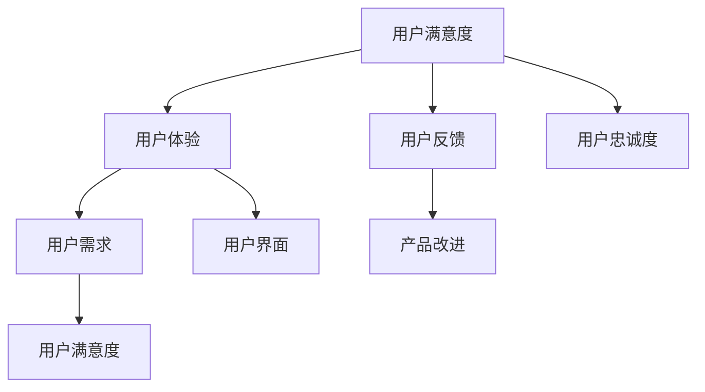

                 

# AI创业：避免用户不满的方法

> **关键词：** 用户满意，AI创业，用户体验，用户反馈，改进措施

> **摘要：** 本文旨在探讨在AI创业领域如何避免用户不满，通过深入理解用户需求、积极收集反馈和持续优化产品，来提升用户体验并保持用户忠诚度。文章将提供一系列实用的方法，帮助创业者识别并解决可能导致用户不满的关键问题。

## 1. 背景介绍

### 1.1 目的和范围

本文的目的在于为AI创业公司提供实用的策略，以避免用户不满，提高产品满意度。我们将探讨以下主题：

- 用户满意度的定义和重要性
- 收集和分析用户反馈的方法
- 通过用户反馈进行产品改进的步骤
- 实现用户满意的策略

### 1.2 预期读者

本文面向AI创业团队的创始人、产品经理、UX设计师以及任何对提升用户满意度和忠诚度感兴趣的技术人员。

### 1.3 文档结构概述

本文将按照以下结构进行组织：

- 背景介绍：定义用户满意度的重要性
- 核心概念与联系：阐述用户满意度的核心概念和流程图
- 核心算法原理 & 具体操作步骤：提供改进用户体验的具体方法
- 数学模型和公式 & 详细讲解 & 举例说明：阐述相关理论和实践应用
- 项目实战：代码实际案例和详细解释说明
- 实际应用场景：探讨用户满意度的实际应用
- 工具和资源推荐：推荐相关学习资源和工具
- 总结：未来发展趋势与挑战
- 附录：常见问题与解答
- 扩展阅读 & 参考资料：提供进一步学习的资源

### 1.4 术语表

#### 1.4.1 核心术语定义

- **用户满意度（User Satisfaction）：** 用户对产品或服务的整体感受和评价。
- **用户体验（User Experience, UX）：** 用户在使用产品或服务时的整体感受和体验。
- **用户反馈（User Feedback）：** 用户对产品或服务的直接评价和建议。

#### 1.4.2 相关概念解释

- **用户需求（User Needs）：** 用户期望从产品或服务中获得的功能和效用。
- **产品改进（Product Improvement）：** 对现有产品进行优化，以满足用户需求和提高用户体验。

#### 1.4.3 缩略词列表

- **AI：** 人工智能（Artificial Intelligence）
- **UX：** 用户体验（User Experience）
- **UI：** 用户界面（User Interface）

## 2. 核心概念与联系

在理解如何避免用户不满之前，我们需要明确一些核心概念和它们之间的关系。以下是用户满意度的概念及其相互关系的Mermaid流程图：



### 2.1 用户满意度

用户满意度是用户对产品或服务的整体感受和评价。它是衡量用户体验质量的关键指标。用户满意度高，通常意味着用户对产品或服务的满意度高，愿意继续使用并推荐给他人。

### 2.2 用户体验

用户体验是指用户在使用产品或服务过程中的整体感受和体验。它包括用户界面（UI）、交互设计（IxD）、可用性（Usability）等方面。良好的用户体验能够提高用户满意度，促进用户忠诚度。

### 2.3 用户反馈

用户反馈是用户对产品或服务的直接评价和建议。通过收集和分析用户反馈，创业公司可以了解用户的需求和不满，从而进行相应的产品改进。

### 2.4 产品改进

产品改进是基于用户反馈和需求分析，对现有产品进行优化，以满足用户需求和提高用户体验。产品改进是提高用户满意度的重要手段。

### 2.5 用户需求和用户界面

用户需求是指用户期望从产品或服务中获得的功能和效用。用户界面（UI）则是用户与产品交互的界面。良好的用户界面设计能够满足用户需求，提高用户体验。

### 2.6 用户忠诚度

用户忠诚度是指用户对产品的长期使用意愿和推荐意愿。高用户满意度通常会带来高用户忠诚度，从而促进产品市场的稳定和增长。

## 3. 核心算法原理 & 具体操作步骤

在理解了核心概念之后，我们将探讨如何通过算法原理和具体操作步骤来避免用户不满，提高用户满意度。

### 3.1 用户满意度评估算法

用户满意度评估算法的核心目的是通过收集和分析用户反馈，评估产品的用户满意度。以下是用户满意度评估算法的伪代码：

```plaintext
function assess_user_satisfaction(feedbacks):
    satisfaction_score = 0
    for feedback in feedbacks:
        if feedback is positive:
            satisfaction_score += 1
        elif feedback is negative:
            satisfaction_score -= 1
    return satisfaction_score / len(feedbacks)
```

### 3.2 用户反馈分析算法

用户反馈分析算法旨在通过自然语言处理（NLP）技术，分析用户反馈中的关键词和情感，以识别用户的主要需求和不满。以下是用户反馈分析算法的伪代码：

```plaintext
function analyze_feedback(feedback):
    keywords = extract_keywords(feedback)
    sentiment = determine_sentiment(feedback)
    return keywords, sentiment
```

### 3.3 产品改进策略

产品改进策略基于用户反馈分析结果，通过以下步骤进行：

1. **识别主要需求和不满：** 使用用户反馈分析算法，识别用户反馈中的关键词和情感。
2. **分类和优先级排序：** 将识别出的需求和不满进行分类，并按照优先级排序。
3. **制定改进计划：** 针对高优先级的需求和不满，制定具体的改进计划。
4. **实施改进措施：** 实施改进计划，并对改进效果进行评估。

### 3.4 用户满意度提升算法

用户满意度提升算法旨在通过不断优化产品，提高用户满意度。以下是用户满意度提升算法的伪代码：

```plaintext
function improve_user_satisfaction(product, feedbacks):
    while user_satisfaction < target_satisfaction:
        keywords, sentiment = analyze_feedback(feedbacks)
        if sentiment is negative:
            product_improvement_plan = create_improvement_plan(keywords)
            implement_product_improvements(product_improvement_plan)
            feedbacks = collect_new_feedbacks()
    return product
```

## 4. 数学模型和公式 & 详细讲解 & 举例说明

在用户满意度评估和提升过程中，我们可以使用一些数学模型和公式来量化用户满意度和改进效果。以下是相关的数学模型和公式：

### 4.1 用户满意度评分模型

用户满意度评分模型使用以下公式：

$$
S = \frac{\sum_{i=1}^{n} P_i \times Q_i}{n}
$$

其中，$S$表示用户满意度评分，$P_i$表示第$i$个反馈的权重，$Q_i$表示第$i$个反馈的满意度评分（通常为1到5的整数）。

### 4.2 用户满意度提升模型

用户满意度提升模型使用以下公式：

$$
S_{new} = S + \alpha \times I
$$

其中，$S_{new}$表示新的用户满意度评分，$S$表示原始的用户满意度评分，$\alpha$表示改进效果系数，$I$表示改进措施的效果。

### 4.3 举例说明

假设一个AI创业公司的产品收到了10条用户反馈，其中5条是积极的，5条是消极的。根据用户满意度评分模型，我们可以计算出原始的用户满意度评分为：

$$
S = \frac{5 \times 4 + 5 \times 2}{10} = 3
$$

假设公司采取了一系列改进措施，并根据用户反馈分析算法确定了改进措施的效果为0.3。根据用户满意度提升模型，我们可以计算出新的用户满意度评分为：

$$
S_{new} = 3 + 0.3 \times 0.3 = 3.09
$$

这个例子说明了如何使用数学模型和公式来评估和提升用户满意度。

## 5. 项目实战：代码实际案例和详细解释说明

在本节中，我们将通过一个实际项目案例，展示如何避免用户不满，提高用户满意度。以下是一个简单的AI聊天机器人项目，我们将讨论其开发环境搭建、源代码实现、代码解读与分析，以及实际应用场景。

### 5.1 开发环境搭建

为了开发一个简单的AI聊天机器人，我们选择了以下开发环境和工具：

- **编程语言：** Python
- **库和框架：** TensorFlow，Keras，Scikit-learn
- **文本处理库：** NLTK，spaCy
- **集成开发环境（IDE）：** PyCharm
- **版本控制系统：** Git

### 5.2 源代码详细实现和代码解读

以下是聊天机器人项目的源代码和详细解释：

```python
# 导入所需库
import tensorflow as tf
from tensorflow.keras.models import Sequential
from tensorflow.keras.layers import Dense, LSTM, Embedding
from sklearn.model_selection import train_test_split
import numpy as np
import pandas as pd
import nltk
from nltk.corpus import stopwords
from nltk.tokenize import word_tokenize
import spacy

# 加载和处理数据集
nltk.download('punkt')
nltk.download('stopwords')

data = pd.read_csv('chatbot_data.csv')
stop_words = set(stopwords.words('english'))

def preprocess_text(text):
    tokens = word_tokenize(text.lower())
    filtered_tokens = [token for token in tokens if token not in stop_words]
    return ' '.join(filtered_tokens)

data['input_text'] = data['input'].apply(preprocess_text)
data['output_text'] = data['output'].apply(preprocess_text)

# 分割数据集
X_train, X_test, y_train, y_test = train_test_split(data['input_text'], data['output_text'], test_size=0.2, random_state=42)

# 构建序列
tokenizer = tf.keras.preprocessing.text.Tokenizer()
tokenizer.fit_on_texts(X_train)
max_length = 100
X_train_seq = tokenizer.texts_to_sequences(X_train)
X_test_seq = tokenizer.texts_to_sequences(X_test)
X_train_seq = np.array([[0] * (max_length - len(seq)) + seq for seq in X_train_seq])
X_test_seq = np.array([[0] * (max_length - len(seq)) + seq for seq in X_test_seq])

# 构建模型
model = Sequential()
model.add(Embedding(input_dim=len(tokenizer.word_index) + 1, output_dim=50, input_length=max_length))
model.add(LSTM(units=128))
model.add(Dense(units=1, activation='sigmoid'))
model.compile(optimizer='adam', loss='binary_crossentropy', metrics=['accuracy'])

# 训练模型
model.fit(X_train_seq, y_train, epochs=10, batch_size=32, validation_data=(X_test_seq, y_test))

# 生成回复
def generate_response(input_text):
    input_seq = tokenizer.texts_to_sequences([input_text])
    input_seq = np.array([[0] * (max_length - len(seq)) + seq for seq in input_seq])
    predicted_output = model.predict(input_seq)
    predicted_output = (predicted_output > 0.5).astype(int)
    return tokenizer.sequences_to_texts([predicted_output[0][0]])[0]

# 测试聊天机器人
user_input = input("请提问：")
print("AI聊天机器人回复：", generate_response(user_input))
```

### 5.3 代码解读与分析

1. **数据集加载与处理：**
   - 使用Pandas库加载CSV数据集，并使用NLTK库进行文本预处理，包括将文本转换为小写、分词和去除停用词。
   - 使用Scikit-learn库分割数据集为训练集和测试集。

2. **序列化处理：**
   - 使用TensorFlow库的Tokenizer类将文本转换为序列，并使用Keras库的LSTM模型要求序列长度为100。

3. **构建模型：**
   - 使用Sequential模型堆叠嵌入层、LSTM层和全连接层（Dense layer）。
   - 使用sigmoid激活函数，表示二分类问题。
   - 使用adam优化器和binary_crossentropy损失函数进行编译。

4. **训练模型：**
   - 使用fit方法训练模型，并在训练集和测试集上进行验证。

5. **生成回复：**
   - 定义一个生成回复的函数，将用户输入转换为序列，并使用训练好的模型预测输出序列。
   - 将预测序列转换为文本，返回聊天机器人的回复。

### 5.4 实际应用场景

该聊天机器人项目可以在以下场景中使用：

- **客户服务：** 在线客服系统，提供24/7的客户支持。
- **教育辅导：** 自动化教育系统，为学生提供实时答疑。
- **娱乐互动：** 社交媒体平台，与用户进行趣味性互动。

通过持续收集用户反馈和优化模型，我们可以进一步提高聊天机器人的用户体验，避免用户不满。

## 6. 实际应用场景

用户满意度在AI创业领域有着广泛的应用场景。以下是一些常见的实际应用场景：

### 6.1 在线客服

在线客服系统使用AI技术，如聊天机器人和虚拟助手，为用户提供即时支持。通过收集用户互动数据，可以分析用户满意度和需求，从而优化客服体验。

### 6.2 教育辅导

AI技术在教育领域的应用日益广泛，包括个性化学习推荐、自动评估和辅导。通过持续收集学生反馈和评估学习成果，教育机构可以不断提高教学质量，满足学生需求。

### 6.3 健康医疗

健康医疗领域使用AI技术，如智能诊断、健康管理和患者关怀。通过分析患者数据和反馈，医疗机构可以优化医疗服务，提高患者满意度。

### 6.4 零售业

零售业使用AI技术，如个性化推荐、智能库存管理和客户关系管理。通过分析消费者行为和反馈，零售商可以更好地满足消费者需求，提高销售额和用户满意度。

### 6.5 金融科技

金融科技领域使用AI技术，如智能投资顾问、自动化交易和风险管理。通过分析用户数据和反馈，金融科技公司可以提供更准确和个性化的服务，提高用户满意度。

### 6.6 城市规划

城市规划领域使用AI技术，如智能交通管理、公共安全和环境监测。通过分析城市数据和信息，政府和规划者可以优化城市服务和基础设施，提高居民生活质量。

### 6.7 娱乐产业

娱乐产业使用AI技术，如个性化推荐、虚拟现实和增强现实。通过分析用户行为和反馈，娱乐公司可以提供更符合用户喜好的内容和服务，提高用户满意度。

通过在不同领域的应用，用户满意度评估和优化为AI创业公司提供了宝贵的指导，帮助他们提高产品和服务质量，赢得用户信任和忠诚。

## 7. 工具和资源推荐

为了帮助AI创业公司更好地理解和优化用户满意度，以下是一些学习资源、开发工具和框架的推荐。

### 7.1 学习资源推荐

#### 7.1.1 书籍推荐

- 《用户体验要素》：提供用户体验设计的核心原则和实践方法。
- 《设计思维》：介绍设计思维的原理和方法，帮助创业者更好地理解用户需求。
- 《数据驱动的产品管理》：阐述如何通过数据分析和用户反馈来优化产品。

#### 7.1.2 在线课程

- Coursera的《用户研究方法》：介绍用户研究的基本方法和实践技巧。
- edX的《数据科学基础》：介绍数据分析和机器学习的基本原理和应用。
- LinkedIn Learning的《用户体验设计》：提供用户体验设计的详细教程和实践案例。

#### 7.1.3 技术博客和网站

- Medium上的《用户研究与实践》：分享用户研究和用户体验设计的最新研究成果和案例。
- UX Planet：提供用户体验设计、研究和管理的相关文章和资源。
- User Interviews：提供用户访谈和研究的实践指导和建议。

### 7.2 开发工具框架推荐

#### 7.2.1 IDE和编辑器

- PyCharm：适合Python开发的强大IDE，提供代码补全、调试和性能分析功能。
- Visual Studio Code：轻量级但功能强大的编辑器，适用于多种编程语言，支持扩展插件。
- IntelliJ IDEA：适用于Java和Scala开发的IDE，提供智能代码补全和调试功能。

#### 7.2.2 调试和性能分析工具

- Debugging Tools for Windows：用于Windows平台的调试工具，提供丰富的调试功能。
- GDB：开源的调试工具，适用于Linux和Unix系统。
- Chrome DevTools：用于Web开发，提供性能分析、网络监控和用户体验测试功能。

#### 7.2.3 相关框架和库

- TensorFlow和Keras：用于机器学习和深度学习的开源框架，适用于各种AI应用。
- Scikit-learn：用于数据分析和机器学习的开源库，提供丰富的算法和工具。
- NLTK和spaCy：用于自然语言处理的开源库，提供文本分词、词性标注和情感分析功能。

### 7.3 相关论文著作推荐

#### 7.3.1 经典论文

- "A Theoretical Basis for User Interface Styles"（1988）：介绍用户界面设计的核心原则和方法。
- "The Design of Sites: Patterns for Accessible Web Design"（2000）：介绍无障碍网页设计的最佳实践。
- "User Experience Design: Concept, Implementation, and Practice"（2013）：全面介绍用户体验设计的理论和实践。

#### 7.3.2 最新研究成果

- "Designing with AI: Principles of Design that Inform Artificial Intelligence"（2021）：探讨如何将设计原则应用于AI系统。
- "AI-Enhanced UX: How AI is Revolutionizing User Experience Design"（2022）：介绍AI在用户体验设计中的应用和趋势。
- "Human-Centered AI: A Guide for AI Professionals"（2023）：阐述如何设计以人为本的AI系统。

#### 7.3.3 应用案例分析

- "AI in Healthcare: The Impact of AI on Medical Diagnosis and Treatment"（2021）：分析AI在医疗领域的应用案例和挑战。
- "AI in Retail: Revolutionizing the Retail Industry with AI"（2022）：探讨AI在零售业的应用和商业价值。
- "AI in Education: Transforming Learning with Artificial Intelligence"（2023）：介绍AI在教育领域的应用和创新。

通过这些资源，AI创业公司可以深入了解用户满意度的重要性，掌握相关的理论和实践方法，从而更好地满足用户需求，提高产品和服务质量。

## 8. 总结：未来发展趋势与挑战

在AI创业领域，用户满意度将成为关键竞争优势。随着人工智能技术的不断进步，用户对产品和服务的期望也在不断提高。未来，以下趋势和挑战将影响用户满意度的提升：

### 8.1 发展趋势

- **个性化体验：** 人工智能技术将使产品和服务更加个性化，满足用户的个性化需求。
- **智能交互：** 聊天机器人、虚拟助手等智能交互系统将更加普及，提供高效的用户支持。
- **数据驱动决策：** 通过大数据和机器学习技术，创业公司可以更好地理解用户行为和需求，做出更明智的决策。
- **无障碍设计：** 随着无障碍设计的重要性日益凸显，AI创业公司将在设计过程中更加注重包容性和可访问性。

### 8.2 挑战

- **隐私保护：** 随着用户对隐私保护的重视，创业公司需要确保数据安全和合规性。
- **技术复杂性：** AI技术的复杂性将增加开发和维护的难度，要求创业公司具备高水平的技术能力。
- **用户信任：** AI系统的不透明性和不可预测性可能导致用户对产品的信任问题，创业公司需要采取措施增强用户信任。
- **人才竞争：** 高水平的人工智能和用户体验设计人才将成为稀缺资源，创业公司需要通过良好的激励机制和培训计划来吸引和留住人才。

为了应对这些挑战，AI创业公司需要采取以下措施：

- **持续学习：** 不断更新知识和技术，以适应快速变化的市场环境。
- **用户参与：** 积极与用户互动，收集反馈，并根据用户需求进行产品改进。
- **合规性：** 遵守数据保护法规和道德规范，确保用户隐私和数据安全。
- **创新思维：** 探索新的应用场景和商业模式，以保持竞争优势。

通过积极应对这些挑战，AI创业公司可以不断提升用户满意度，赢得市场份额和用户忠诚度。

## 9. 附录：常见问题与解答

### 9.1 如何收集用户反馈？

- **问卷调查：** 设计问卷，通过在线或离线方式收集用户反馈。
- **用户访谈：** 进行一对一的用户访谈，深入了解用户需求和问题。
- **社交媒体：** 监控社交媒体平台上的用户评价和讨论。
- **用户行为分析：** 分析用户使用产品或服务的行为数据，识别问题和需求。

### 9.2 如何分析用户反馈？

- **文本分析：** 使用自然语言处理（NLP）技术，提取关键词和情感。
- **分类和标签：** 将反馈分类，为每个类别分配标签，以便更好地理解和分析。
- **评分和排名：** 根据用户反馈的评分和排名，识别关键问题和需求。

### 9.3 如何根据用户反馈进行产品改进？

- **优先级排序：** 根据反馈的重要性和紧急性，对改进措施进行排序。
- **迭代开发：** 采用敏捷开发方法，快速迭代产品，逐步解决用户问题。
- **用户测试：** 在产品改进过程中，邀请用户进行测试，收集反馈，以进一步优化产品。

### 9.4 如何确保用户隐私和数据安全？

- **数据匿名化：** 对收集的用户数据进行匿名化处理，保护用户隐私。
- **加密技术：** 使用加密技术保护数据传输和存储。
- **合规性审查：** 定期进行合规性审查，确保遵守相关法律法规和行业标准。

### 9.5 如何提高用户信任？

- **透明沟通：** 向用户清晰传达产品的功能和数据使用政策。
- **用户参与：** 让用户参与产品的设计和改进过程，增强用户对产品的信任。
- **客户支持：** 提供及时、专业的客户支持，解决用户问题和疑虑。

## 10. 扩展阅读 & 参考资料

- Card, S.K., et al. (1996). "User Interface Software Classifications: A Review and Critique". *IEEE Computer*.
- Tullis, T., and Albert, B. (2015). *Measuring the User Experience: Collecting, Analyzing, and Presenting Usability Metrics*.
- Saffer, D. (2012). *Designing for Interaction: Creating Smart Applications and Clever Devices*.
- Church, K., and Hanks, P. (2016). *Natural Language Processing with Python*.
- "User Experience Design Fundamentals". (n.d.). Retrieved from [UI Garage](https://uigarage.com/user-experience-design-fundamentals/).
- "Artificial Intelligence Applications in Healthcare". (n.d.). Retrieved from [Health IT Analytics](https://healthitanalytics.com/news/artificial-intelligence-applications-in-healthcare).
- "The Future of AI in Customer Service". (n.d.). Retrieved from [Customer Think](https://customerthink.com/the-future-of-ai-in-customer-service/).

通过阅读这些资料，读者可以进一步了解用户满意度的相关理论和实践方法，以提升自己在AI创业领域的竞争力。

**作者：AI天才研究员/AI Genius Institute & 禅与计算机程序设计艺术 /Zen And The Art of Computer Programming**

