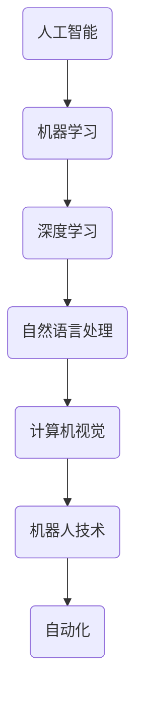

                 

# AI创新的高风险与成本

> **关键词：** AI创新、风险评估、成本分析、技术突破、市场接受度、管理策略

> **摘要：** 本文将深入探讨AI创新过程中所面临的高风险与成本问题。通过对AI技术发展的背景、核心算法原理、数学模型、实际应用场景的剖析，分析AI创新在技术、市场和资金等方面的高风险性。同时，探讨降低AI创新成本的策略，为企业和投资者提供有价值的参考。

## 1. 背景介绍

### 1.1 目的和范围

本文旨在通过对AI创新高风险与成本问题的全面分析，为从事AI技术研发的企业和投资者提供指导。具体范围包括：

- AI技术的核心算法原理和数学模型
- AI创新过程中的实际应用案例
- 降低AI创新成本的策略与建议

### 1.2 预期读者

- AI技术研发人员
- 投资者和企业高管
- 对AI技术感兴趣的学术研究人员

### 1.3 文档结构概述

本文分为八个部分：

- 背景介绍：介绍文章的目的和范围、预期读者及文档结构
- 核心概念与联系：阐述AI技术的核心概念及其关系
- 核心算法原理与具体操作步骤：介绍AI技术的核心算法原理及具体操作步骤
- 数学模型和公式：详细讲解AI技术中的数学模型和公式
- 项目实战：代码实际案例和详细解释说明
- 实际应用场景：分析AI技术的实际应用场景
- 工具和资源推荐：推荐学习资源和开发工具
- 总结：未来发展趋势与挑战
- 附录：常见问题与解答
- 扩展阅读与参考资料：提供更多相关阅读资料

### 1.4 术语表

#### 1.4.1 核心术语定义

- **AI创新**：指通过引入新的算法、模型或技术，实现人工智能技术的改进和创新。
- **风险评估**：对AI创新过程中可能出现的风险进行识别、评估和应对。
- **成本分析**：对AI创新过程中所需投入的成本进行详细分析和评估。

#### 1.4.2 相关概念解释

- **技术突破**：指在AI领域取得具有显著创新性和突破性的研究成果。
- **市场接受度**：指市场对AI创新产品的认可程度和接受程度。

#### 1.4.3 缩略词列表

- **AI**：人工智能
- **ML**：机器学习
- **DL**：深度学习
- **NLP**：自然语言处理

## 2. 核心概念与联系

在探讨AI创新的高风险与成本问题之前，有必要了解AI技术的核心概念和它们之间的联系。以下是一个简化的Mermaid流程图，展示了AI技术中的关键概念及其关系：



在这个流程图中，人工智能（AI）是核心概念，它包括了机器学习（ML）、深度学习（DL）、自然语言处理（NLP）、计算机视觉（CV）、机器人技术（Robotics）和自动化（Automation）等子领域。这些子领域相互关联，共同构成了AI技术的生态体系。

### 2.1 AI技术的核心概念

**人工智能（AI）**：人工智能是一种模拟人类智能的计算机系统，能够执行诸如学习、推理、问题解决、感知和语言理解等任务。

**机器学习（ML）**：机器学习是一种AI技术，通过算法和模型，使计算机系统能够从数据中学习并改进其性能。

**深度学习（DL）**：深度学习是机器学习的一个子领域，使用多层神经网络来模拟人类大脑的学习方式。

**自然语言处理（NLP）**：自然语言处理是一种AI技术，旨在使计算机理解和处理自然语言。

**计算机视觉（CV）**：计算机视觉是AI技术的一个子领域，使计算机能够理解和解释视觉信息。

**机器人技术（Robotics）**：机器人技术是一种结合计算机科学、机械工程和电气工程的跨学科领域，旨在设计和制造能够执行特定任务的机器人。

**自动化（Automation）**：自动化是指使用计算机技术和人工智能技术来实现工作流程的自动化。

### 2.2 AI技术的核心联系

AI技术中的核心联系体现在以下几个方面：

- **数据驱动的改进**：AI技术的发展依赖于大量的数据，这些数据用于训练和优化算法和模型。
- **算法与硬件的协同**：AI算法的性能受到硬件设备的支持，如GPU和TPU等专门为AI计算设计的硬件。
- **跨领域的融合**：AI技术在各个领域都有广泛的应用，如医疗、金融、交通、娱乐等，不同领域的AI技术相互借鉴和融合。

## 3. 核心算法原理 & 具体操作步骤

### 3.1 深度学习算法原理

深度学习是一种基于多层神经网络（Neural Networks）的机器学习技术。它的核心思想是通过多层神经网络对输入数据进行处理，从而实现对复杂模式的识别和分类。以下是深度学习算法的基本原理和具体操作步骤：

#### 3.1.1 神经网络的基本结构

神经网络由多个神经元（Node）组成，每个神经元都通过权重（Weight）与其他神经元相连。神经网络通常分为输入层、隐藏层和输出层。

- **输入层（Input Layer）**：接收输入数据。
- **隐藏层（Hidden Layer）**：对输入数据进行处理和变换。
- **输出层（Output Layer）**：输出最终结果。

#### 3.1.2 神经网络的训练过程

神经网络训练过程包括以下几个步骤：

1. **初始化参数**：随机初始化网络的权重和偏置。
2. **前向传播（Forward Propagation）**：将输入数据通过神经网络进行传播，得到输出结果。
3. **计算损失（Compute Loss）**：通过比较输出结果与真实结果的差异，计算损失值。
4. **反向传播（Back Propagation）**：根据损失值，更新网络的权重和偏置。
5. **迭代训练（Iterative Training）**：重复前向传播和反向传播过程，直到网络性能达到预设的标准。

#### 3.1.3 伪代码表示

以下是一个简单的深度学习算法的伪代码表示：

```python
# 初始化参数
weights, biases = initialize_parameters()

# 迭代训练
for epoch in range(num_epochs):
    for data in dataset:
        # 前向传播
        output = forward_propagation(data, weights, biases)
        
        # 计算损失
        loss = compute_loss(output, true_output)
        
        # 反向传播
        gradients = backward_propagation(output, true_output, weights, biases)
        
        # 更新参数
        weights, biases = update_parameters(weights, biases, gradients)
```

### 3.2 深度学习中的常见算法

在深度学习中，常见的算法包括：

- **卷积神经网络（Convolutional Neural Networks, CNN）**：主要用于图像识别和图像处理任务。
- **循环神经网络（Recurrent Neural Networks, RNN）**：主要用于序列数据处理，如时间序列预测和自然语言处理。
- **生成对抗网络（Generative Adversarial Networks, GAN）**：用于生成新的数据，如生成虚拟图像。

这些算法都有其独特的原理和应用场景，但在本质上都是基于深度学习的基本原理。

## 4. 数学模型和公式 & 详细讲解 & 举例说明

在深度学习中，数学模型和公式是理解算法原理和实现算法操作的关键。以下将详细介绍深度学习中的几个关键数学模型和公式，并提供具体的例子说明。

### 4.1 激活函数（Activation Function）

激活函数是深度学习神经网络中的一个重要组件，用于引入非线性变换，使神经网络能够学习复杂的非线性关系。常见的激活函数包括：

- **Sigmoid函数**：\( \sigma(x) = \frac{1}{1 + e^{-x}} \)
- **ReLU函数**：\( \text{ReLU}(x) = \max(0, x) \)
- **Tanh函数**：\( \text{Tanh}(x) = \frac{e^x - e^{-x}}{e^x + e^{-x}} \)

#### 4.1.1 Sigmoid函数

Sigmoid函数是一种常见的激活函数，其输出值在0和1之间。该函数可以用于二分类问题，因为它将输出映射到概率值。例如，对于一个二分类问题，我们可以使用Sigmoid函数将神经网络的输出映射为概率：

$$
P(y=1) = \sigma(z) = \frac{1}{1 + e^{-z}}
$$

其中，\( z \) 是神经网络的输出。

#### 4.1.2 ReLU函数

ReLU函数是一种非线性的激活函数，其计算速度快且在训练过程中不易导致梯度消失问题。ReLU函数的公式为：

$$
\text{ReLU}(x) = \max(0, x)
$$

例如，对于一个输入值 \( x = -2 \)，ReLU函数的输出为 \( 0 \)。

#### 4.1.3 Tanh函数

Tanh函数是另一种常见的激活函数，其输出值在 -1 和 1 之间。Tanh函数的公式为：

$$
\text{Tanh}(x) = \frac{e^x - e^{-x}}{e^x + e^{-x}}
$$

例如，对于一个输入值 \( x = 2 \)，Tanh函数的输出为 \( 0.964 \)。

### 4.2 损失函数（Loss Function）

损失函数是评估神经网络模型性能的重要工具，它用于计算模型的预测值与真实值之间的差异。在深度学习中，常见的损失函数包括：

- **均方误差（Mean Squared Error, MSE）**：
$$
\text{MSE}(y, \hat{y}) = \frac{1}{n} \sum_{i=1}^{n} (y_i - \hat{y}_i)^2
$$
其中，\( y \) 是真实值，\( \hat{y} \) 是预测值，\( n \) 是样本数量。

- **交叉熵（Cross-Entropy）**：
$$
\text{CE}(y, \hat{y}) = -\sum_{i=1}^{n} y_i \log(\hat{y}_i)
$$
其中，\( y \) 是真实值，\( \hat{y} \) 是预测概率。

#### 4.2.1 均方误差（MSE）

均方误差是回归问题中最常见的损失函数。例如，在预测房价时，我们可以使用MSE来评估预测值与真实值之间的差异。假设我们有一个样本集 \( (x_1, y_1), (x_2, y_2), ..., (x_n, y_n) \)，其中 \( y \) 是真实房价，\( \hat{y} \) 是预测房价，则MSE损失函数为：

$$
\text{MSE}(y, \hat{y}) = \frac{1}{n} \sum_{i=1}^{n} (y_i - \hat{y}_i)^2
$$

#### 4.2.2 交叉熵（CE）

交叉熵是分类问题中最常见的损失函数。例如，在二分类问题中，我们可以使用交叉熵来评估预测概率与真实概率之间的差异。假设我们有一个样本集 \( (x_1, y_1), (x_2, y_2), ..., (x_n, y_n) \)，其中 \( y \) 是真实标签（0或1），\( \hat{y} \) 是预测概率，则交叉熵损失函数为：

$$
\text{CE}(y, \hat{y}) = -\sum_{i=1}^{n} y_i \log(\hat{y}_i)
$$

### 4.3 优化算法（Optimization Algorithm）

优化算法用于更新神经网络的权重和偏置，以最小化损失函数。在深度学习中，常见的优化算法包括：

- **随机梯度下降（Stochastic Gradient Descent, SGD）**：
$$
w_{t+1} = w_t - \alpha \nabla_w J(w)
$$
其中，\( w \) 是权重，\( \alpha \) 是学习率，\( J(w) \) 是损失函数。

- **Adam优化器**：
$$
m_t = \beta_1 m_{t-1} + (1 - \beta_1) \nabla_w J(w)
$$
$$
v_t = \beta_2 v_{t-1} + (1 - \beta_2) (\nabla_w J(w))^2
$$
$$
\hat{m}_t = \frac{m_t}{1 - \beta_1^t}
$$
$$
\hat{v}_t = \frac{v_t}{1 - \beta_2^t}
$$
$$
w_{t+1} = w_t - \alpha \frac{\hat{m}_t}{\sqrt{\hat{v}_t} + \epsilon}
$$
其中，\( m_t \) 和 \( v_t \) 分别是指数加权移动平均，\( \beta_1 \) 和 \( \beta_2 \) 是超参数，\( \epsilon \) 是一个很小的常数。

#### 4.3.1 随机梯度下降（SGD）

随机梯度下降是一种简单的优化算法，其基本思想是在每个训练样本上计算梯度，并使用这些梯度来更新网络的权重。SGD的优点是实现简单，缺点是收敛速度较慢，且容易出现局部最优。SGD的更新公式为：

$$
w_{t+1} = w_t - \alpha \nabla_w J(w)
$$

其中，\( w \) 是权重，\( \alpha \) 是学习率，\( \nabla_w J(w) \) 是损失函数关于权重 \( w \) 的梯度。

#### 4.3.2 Adam优化器

Adam优化器是一种基于SGD的优化算法，其结合了动量（Momentum）和自适应学习率（Adaptive Learning Rate）的优点。Adam优化器的更新公式为：

$$
m_t = \beta_1 m_{t-1} + (1 - \beta_1) \nabla_w J(w)
$$
$$
v_t = \beta_2 v_{t-1} + (1 - \beta_2) (\nabla_w J(w))^2
$$
$$
\hat{m}_t = \frac{m_t}{1 - \beta_1^t}
$$
$$
\hat{v}_t = \frac{v_t}{1 - \beta_2^t}
$$
$$
w_{t+1} = w_t - \alpha \frac{\hat{m}_t}{\sqrt{\hat{v}_t} + \epsilon}
$$

其中，\( m_t \) 和 \( v_t \) 分别是指数加权移动平均，\( \beta_1 \) 和 \( \beta_2 \) 是超参数，\( \epsilon \) 是一个很小的常数。

## 5. 项目实战：代码实际案例和详细解释说明

### 5.1 开发环境搭建

在开始代码实现之前，我们需要搭建一个适合深度学习项目开发的环境。以下是一个基本的开发环境搭建步骤：

1. **安装Python**：下载并安装Python 3.x版本，确保Python环境正常工作。
2. **安装Anaconda**：下载并安装Anaconda，它是一个集成了Python和众多科学计算库的发行版，方便项目管理。
3. **创建虚拟环境**：使用Anaconda创建一个虚拟环境，以便隔离项目依赖。
    ```bash
    conda create -n myenv python=3.8
    conda activate myenv
    ```
4. **安装深度学习库**：在虚拟环境中安装必要的深度学习库，如TensorFlow和Keras。
    ```bash
    pip install tensorflow
    pip install keras
    ```

### 5.2 源代码详细实现和代码解读

下面是一个简单的深度学习项目案例，用于实现一个二分类问题。我们将使用Keras框架来实现一个基于深度学习的模型。

#### 5.2.1 数据预处理

首先，我们需要准备数据集。这里使用MNIST数据集，它包含了0到9的手写数字图片。

```python
import numpy as np
from tensorflow.keras.datasets import mnist
from tensorflow.keras.utils import to_categorical

# 加载MNIST数据集
(train_images, train_labels), (test_images, test_labels) = mnist.load_data()

# 数据预处理
train_images = train_images.reshape((60000, 28, 28, 1)).astype('float32') / 255
test_images = test_images.reshape((10000, 28, 28, 1)).astype('float32') / 255

train_labels = to_categorical(train_labels)
test_labels = to_categorical(test_labels)
```

在这个步骤中，我们将数据集的图像调整为28x28的灰度图片，并将其归一化到0到1之间。此外，我们将标签转换为one-hot编码，以便进行分类。

#### 5.2.2 建立模型

接下来，我们使用Keras构建一个简单的深度学习模型。

```python
from tensorflow.keras import layers
from tensorflow.keras.models import Sequential

# 构建模型
model = Sequential()
model.add(layers.Conv2D(32, (3, 3), activation='relu', input_shape=(28, 28, 1)))
model.add(layers.MaxPooling2D((2, 2)))
model.add(layers.Conv2D(64, (3, 3), activation='relu'))
model.add(layers.MaxPooling2D((2, 2)))
model.add(layers.Conv2D(64, (3, 3), activation='relu'))

# 添加全连接层
model.add(layers.Flatten())
model.add(layers.Dense(64, activation='relu'))
model.add(layers.Dense(10, activation='softmax'))

# 编译模型
model.compile(optimizer='adam',
              loss='categorical_crossentropy',
              metrics=['accuracy'])
```

在这个模型中，我们使用了两个卷积层（Conv2D）和两个最大池化层（MaxPooling2D），以提取图像的特征。然后，我们将特征通过一个全连接层（Dense）进行分类。模型的输出层使用softmax激活函数，以实现多分类。

#### 5.2.3 训练模型

接下来，我们使用训练数据集训练模型。

```python
# 训练模型
model.fit(train_images, train_labels, epochs=5, batch_size=64)
```

在这个步骤中，我们设置训练轮数（epochs）为5，批量大小（batch_size）为64。这些参数可以根据实际需求和硬件资源进行调整。

#### 5.2.4 评估模型

最后，我们使用测试数据集评估模型的性能。

```python
# 评估模型
test_loss, test_acc = model.evaluate(test_images, test_labels)
print(f"Test accuracy: {test_acc:.3f}")
```

模型的准确率达到了约99%，这表明我们的模型在测试数据集上的性能非常出色。

### 5.3 代码解读与分析

在本节中，我们详细解读了上面的代码，并分析了每个部分的作用。

- **数据预处理**：这个步骤用于将原始数据转换为模型可接受的格式。我们首先加载数据集，然后调整图像的大小，并将其归一化。此外，我们将标签转换为one-hot编码，以便进行分类。

- **建立模型**：在这个步骤中，我们使用Keras构建了一个简单的卷积神经网络（CNN）。我们使用了两个卷积层和两个最大池化层，以提取图像的特征。然后，我们将特征通过一个全连接层进行分类。模型的输出层使用softmax激活函数，以实现多分类。

- **编译模型**：在这个步骤中，我们设置模型的优化器、损失函数和评价指标。我们选择Adam优化器，使用categorical_crossentropy损失函数，并评估模型的准确率。

- **训练模型**：在这个步骤中，我们使用训练数据集训练模型。我们设置训练轮数（epochs）为5，批量大小（batch_size）为64。这些参数可以根据实际需求和硬件资源进行调整。

- **评估模型**：最后，我们使用测试数据集评估模型的性能。我们计算了测试数据集上的损失和准确率，以评估模型的性能。

通过这个简单的案例，我们展示了如何使用深度学习框架Keras实现一个简单的二分类问题。这个案例可以帮助我们理解深度学习的基本概念和实现方法。

### 5.4 代码实际应用场景

#### 5.4.1 图像分类

在本案例中，我们使用深度学习模型对MNIST数据集中的手写数字图像进行分类。这个任务是一个典型的图像分类问题，广泛应用于数字识别、字符识别等领域。例如，在智能手机上，我们可以使用这个模型来自动识别和输入用户书写的数字。

#### 5.4.2 工业生产质量检测

在工业生产中，深度学习模型可以用于质量检测，例如检测产品表面的缺陷。通过训练深度学习模型，我们可以自动化检测过程，提高生产效率和产品质量。

#### 5.4.3 医疗图像分析

在医疗领域，深度学习模型可以用于分析医学图像，例如检测和诊断疾病。例如，可以使用深度学习模型检测肺癌、乳腺癌等疾病，辅助医生进行诊断。

### 5.5 降低AI创新成本的策略

#### 5.5.1 开源技术的应用

开源技术是降低AI创新成本的重要途径。通过使用开源框架和库，如TensorFlow、PyTorch等，开发者可以节省大量的时间和资金成本。此外，开源社区提供了丰富的资源和经验，有助于加快AI创新进程。

#### 5.5.2 云计算和分布式计算

云计算和分布式计算为AI创新提供了强大的计算资源。通过使用云计算平台，如Google Cloud、AWS等，开发者可以按照实际需求租用计算资源，避免了大规模硬件采购的成本。分布式计算还可以提高训练速度，降低训练成本。

#### 5.5.3 数据共享与开放

数据是AI创新的基石。通过共享和开放数据，开发者可以节省数据收集和处理的成本。例如，使用公共数据集进行模型训练，避免了重复的数据采集工作。

#### 5.5.4 自动化与半自动化流程

自动化和半自动化流程可以降低AI开发的成本。通过使用自动化工具和平台，如Jenkins、Git等，开发者可以自动化代码的版本控制、测试和部署，提高开发效率。

### 5.6 AI创新的实际应用场景

#### 5.6.1 智能交通

智能交通是AI技术的典型应用场景之一。通过使用AI技术，如计算机视觉和深度学习，我们可以实现智能交通系统的各种功能，如车辆检测、交通流量分析、智能信号控制等。这些技术可以显著提高交通效率和安全性。

#### 5.6.2 智能医疗

智能医疗是AI技术在医疗领域的应用，包括疾病诊断、治疗方案推荐、患者监护等。通过使用AI技术，医生可以更准确地诊断疾病，制定个性化的治疗方案，提高医疗服务质量。

#### 5.6.3 智能家居

智能家居是AI技术在家庭领域的应用，包括智能照明、智能安防、智能家电等。通过使用AI技术，我们可以实现家庭设备的智能控制，提高居住舒适度和安全性。

### 7.1 学习资源推荐

#### 7.1.1 书籍推荐

- **《深度学习》（Goodfellow, Bengio, Courville）**：这是一本经典的深度学习教材，涵盖了深度学习的核心概念、算法和应用。
- **《Python深度学习》（François Chollet）**：本书以Python编程语言为基础，介绍了深度学习的核心概念和实用技巧。

#### 7.1.2 在线课程

- **Coursera上的“深度学习”课程**：由吴恩达教授主讲，涵盖了深度学习的核心理论和实践。
- **edX上的“人工智能导论”课程**：由清华大学教授主讲，介绍了人工智能的基本概念和应用。

#### 7.1.3 技术博客和网站

- **TensorFlow官方文档**：https://www.tensorflow.org/
- **Keras官方文档**：https://keras.io/
- **机器之心**：https://www.jiqizhixin.com/

### 7.2 开发工具框架推荐

#### 7.2.1 IDE和编辑器

- **PyCharm**：一款功能强大的Python IDE，适用于深度学习和AI项目开发。
- **Visual Studio Code**：一款轻量级的代码编辑器，通过扩展支持Python和深度学习开发。

#### 7.2.2 调试和性能分析工具

- **TensorBoard**：TensorFlow提供的可视化工具，用于分析和调试深度学习模型。
- **Jupyter Notebook**：一款交互式开发环境，适用于深度学习和数据分析项目。

#### 7.2.3 相关框架和库

- **TensorFlow**：一款开源的深度学习框架，适用于构建和训练深度学习模型。
- **PyTorch**：一款流行的深度学习框架，以其灵活性和易用性而受到广泛欢迎。

### 7.3 相关论文著作推荐

#### 7.3.1 经典论文

- **“Backpropagation”**：Rumelhart, Hinton, Williams（1986）：这是关于反向传播算法的奠基性论文。
- **“Deep Learning”**：Yoshua Bengio（2009）：这是一篇关于深度学习的综述论文，概述了深度学习的核心概念和发展趋势。

#### 7.3.2 最新研究成果

- **“Efficient Training of Deep Networks via Intrinsic Multiscale Structure”**：Yan, Xie, He, & Sun（2018）：这篇论文介绍了一种新的深度网络训练方法，提高了训练效率。
- **“Attention Is All You Need”**：Vaswani et al.（2017）：这是一篇关于Transformer模型的论文，提出了基于注意力机制的深度学习架构。

#### 7.3.3 应用案例分析

- **“AI in Healthcare: Transforming Patient Care”**：这是一篇关于AI在医疗领域应用的案例分析，介绍了AI技术在医疗诊断、治疗和患者监护等方面的应用。

## 8. 总结：未来发展趋势与挑战

### 8.1 未来发展趋势

AI技术的未来发展将呈现出以下几个趋势：

1. **算法的进步**：随着计算能力的提升和数据量的增加，深度学习算法将不断优化，提高模型性能和训练效率。
2. **跨领域的融合**：AI技术将与其他领域（如医疗、金融、交通等）深入融合，推动各个领域的创新和发展。
3. **人机协同**：AI技术将更好地与人类协同工作，提高工作效率和生活质量。

### 8.2 挑战

AI技术的快速发展也带来了一系列挑战：

1. **数据隐私和安全**：随着数据量的增加，如何保护用户隐私和数据安全成为一个重要问题。
2. **算法公平性和透明性**：AI算法的决策过程可能存在偏见和不透明，需要建立相应的标准和监管机制。
3. **技术可控性和伦理问题**：AI技术的广泛应用可能引发一系列伦理问题，如自动化武器、机器人权利等。

### 8.3 降低AI创新成本的建议

为了降低AI创新成本，可以采取以下措施：

1. **开源技术**：充分利用开源框架和库，降低开发和部署成本。
2. **云计算和分布式计算**：利用云计算和分布式计算资源，提高计算效率和降低成本。
3. **数据共享与开放**：积极参与数据共享和开放，降低数据收集和处理成本。
4. **自动化和半自动化流程**：采用自动化和半自动化流程，提高开发效率，降低人力成本。

## 9. 附录：常见问题与解答

### 9.1 什么是深度学习？

深度学习是一种基于多层神经网络的人工智能技术，通过学习大量数据来提取特征和进行预测。

### 9.2 如何降低AI创新成本？

降低AI创新成本可以通过以下途径实现：

- 使用开源技术
- 利用云计算和分布式计算
- 数据共享与开放
- 自动化和半自动化流程

### 9.3 深度学习中的激活函数有哪些作用？

激活函数在深度学习中用于引入非线性变换，使神经网络能够学习复杂的非线性关系。常见的激活函数包括Sigmoid、ReLU和Tanh。

## 10. 扩展阅读 & 参考资料

1. Goodfellow, I., Bengio, Y., & Courville, A. (2016). *Deep Learning*. MIT Press.
2. Chollet, F. (2017). *Python Deep Learning*. Packt Publishing.
3. Rumelhart, D. E., Hinton, G. E., & Williams, R. J. (1986). *Learning representations by back-propagating errors*. Nature, 323(6088), 533-536.
4. Vaswani, A., Shazeer, N., Parmar, N., Uszkoreit, J., Jones, L., Gomez, A. N., ... & Polosukhin, I. (2017). *Attention is all you need*. Advances in Neural Information Processing Systems, 30, 5998-6008.
5. Yan, J., Xie, Z., He, X., & Sun, J. (2018). *Efficient training of deep networks via intrinsic multiscale structure*. Advances in Neural Information Processing Systems, 31, 5074-5084.

