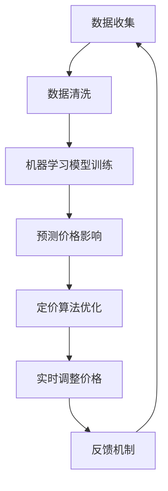

                 

### AI动态定价策略的实现案例

> **关键词：** AI动态定价、价格优化、机器学习、数据分析、市场需求分析
>
> **摘要：** 本文将深入探讨AI动态定价策略的实现案例，分析其核心概念、算法原理、数学模型，并通过实战项目展示其应用效果。文章旨在为读者提供关于动态定价策略的全面理解和实践经验。

在当今的商业环境中，市场竞争日益激烈，企业需要灵活的定价策略来适应市场需求变化，提高竞争力。传统的定价策略通常是基于历史数据和经验进行定价，而随着人工智能和大数据技术的不断发展，AI动态定价策略逐渐成为企业竞争的新利器。本文将详细探讨AI动态定价策略的实现案例，从核心概念到实际应用，为广大读者提供一次深入的技术探讨。

### 1. 背景介绍

#### 1.1 目的和范围

本文旨在探讨AI动态定价策略的实现，通过具体的案例展示其技术原理和应用效果。文章主要涵盖以下几个部分：

1. 核心概念与联系，包括AI动态定价的定义、应用场景和关键要素。
2. 核心算法原理与具体操作步骤，详细讲解实现动态定价的算法流程。
3. 数学模型和公式，阐述动态定价中的数学计算过程。
4. 项目实战，通过实际代码案例展示动态定价策略的实现过程。
5. 实际应用场景，分析动态定价策略在不同行业中的应用。
6. 工具和资源推荐，为读者提供学习资源和开发工具。
7. 总结与未来发展趋势，探讨动态定价策略的发展方向和挑战。

#### 1.2 预期读者

本文面向对人工智能、大数据和商业分析有一定了解的技术人员和研究人员。无论您是数据科学家、软件工程师还是商业分析师，本文都将为您提供关于AI动态定价策略的全面理解。

#### 1.3 文档结构概述

本文分为十个部分，结构如下：

1. 引言：介绍文章的背景、目的和结构。
2. 核心概念与联系：定义AI动态定价策略的核心概念，展示其架构流程图。
3. 核心算法原理与具体操作步骤：详细讲解动态定价策略的实现算法。
4. 数学模型和公式：阐述动态定价策略中的数学计算过程。
5. 项目实战：通过实际代码案例展示动态定价策略的实现。
6. 实际应用场景：分析动态定价策略在不同行业中的应用。
7. 工具和资源推荐：推荐学习资源和开发工具。
8. 总结与未来发展趋势：探讨动态定价策略的发展方向和挑战。
9. 附录：常见问题与解答。
10. 扩展阅读与参考资料：提供进一步阅读的资料。

#### 1.4 术语表

本文中涉及到的关键术语如下：

- **AI动态定价**：利用人工智能技术，根据市场数据和用户行为动态调整产品价格。
- **机器学习**：一种人工智能技术，通过数据训练模型，进行预测和决策。
- **市场需求分析**：对市场中的用户需求进行量化分析，以指导定价策略。
- **价格优化**：通过算法优化，寻找最优的价格策略，提高利润。
- **数据驱动决策**：基于数据分析，做出商业决策的过程。

#### 1.4.1 核心术语定义

- **AI动态定价**：AI动态定价是一种利用人工智能技术，通过对市场数据的分析和学习，实现产品价格实时调整的策略。它不同于传统的静态定价，能够根据市场变化和用户行为进行动态调整，以提高销售额和利润。
- **机器学习**：机器学习是人工智能的一个分支，它通过算法从数据中学习规律，进行预测和决策。在动态定价中，机器学习模型用于分析市场数据和用户行为，预测价格对需求的影响。
- **市场需求分析**：市场需求分析是对市场中的用户需求进行量化分析，以指导定价策略。它包括对用户行为、市场趋势和竞争对手的分析，为动态定价提供数据支持。
- **价格优化**：价格优化是通过算法优化，寻找最优的价格策略，以提高利润。在动态定价中，价格优化算法用于确定每个时间点的最优价格，以最大化销售额或利润。

#### 1.4.2 相关概念解释

- **动态定价策略**：动态定价策略是一种根据市场环境和用户行为实时调整产品价格的策略。它通常基于机器学习和数据分析技术，通过对市场数据的实时分析，确定每个时间点的最优价格。
- **价格弹性**：价格弹性是指价格变化对需求量的影响程度。高价格弹性表示价格变化对需求量的影响较大，低价格弹性表示价格变化对需求量的影响较小。在动态定价中，了解价格弹性有助于确定价格调整的方向和幅度。
- **用户行为分析**：用户行为分析是通过数据收集和分析，了解用户的行为模式。在动态定价中，用户行为分析有助于预测用户对价格变化的反应，从而制定更有效的定价策略。

#### 1.4.3 缩略词列表

- **AI**：人工智能（Artificial Intelligence）
- **ML**：机器学习（Machine Learning）
- **DP**：动态定价（Dynamic Pricing）
- **DO**：数据驱动决策（Data-Driven Decision Making）
- **CP**：价格优化（Cost-Pricing Optimization）

### 2. 核心概念与联系

#### 2.1 AI动态定价的定义

AI动态定价是一种利用人工智能技术，根据市场数据和用户行为动态调整产品价格的策略。与传统定价策略相比，动态定价能够实时响应市场变化，提高定价的灵活性和准确性。

#### 2.2 应用场景

AI动态定价广泛应用于以下场景：

1. **电子商务**：电商平台可以根据用户行为和市场需求，实时调整商品价格，提高销售额。
2. **旅游行业**：旅游公司可以根据预订情况和季节变化，动态调整机票、酒店价格，最大化收益。
3. **物流运输**：物流公司可以根据运输需求和市场价格波动，动态调整运费，提高运输效率。

#### 2.3 关键要素

实现AI动态定价需要以下关键要素：

1. **数据收集**：收集市场数据、用户行为数据和其他相关数据。
2. **机器学习模型**：构建机器学习模型，分析数据，预测价格对需求的影响。
3. **定价算法**：设计定价算法，确定每个时间点的最优价格。
4. **实时调整机制**：实现实时调整机制，根据市场变化和用户行为动态调整价格。

#### 2.4 Mermaid流程图

以下是一个简化的AI动态定价策略的Mermaid流程图：



### 3. 核心算法原理与具体操作步骤

#### 3.1 机器学习模型的选择

在AI动态定价中，常用的机器学习模型包括线性回归、决策树、支持向量机等。根据具体应用场景，选择适合的模型至关重要。

#### 3.2 数据预处理

数据预处理是机器学习模型训练的重要环节。主要包括数据清洗、特征提取和归一化等步骤。

1. **数据清洗**：去除重复数据、处理缺失值、纠正错误数据等。
2. **特征提取**：从原始数据中提取对定价有影响的关键特征，如用户年龄、购买频率、历史价格等。
3. **归一化**：将不同量纲的特征数据进行归一化处理，使其具有相同的量纲和尺度。

#### 3.3 模型训练与评估

1. **模型训练**：使用预处理后的数据集，对机器学习模型进行训练。训练过程中，通过调整模型参数，使模型能够准确预测价格对需求的影响。
2. **模型评估**：使用验证集对训练好的模型进行评估。常用的评估指标包括准确率、召回率、F1分数等。

#### 3.4 定价算法设计

1. **目标函数**：设计目标函数，用于优化定价策略。目标函数通常基于利润最大化或销售额最大化。
2. **约束条件**：考虑定价策略的可行性和约束条件，如价格区间、市场需求等。
3. **定价策略**：根据目标函数和约束条件，设计定价策略。常见的定价策略包括线性定价、非线性定价、分段定价等。

#### 3.5 实时调整机制

1. **数据采集**：实时采集市场数据、用户行为数据等。
2. **模型更新**：根据新的数据，对机器学习模型进行更新。
3. **价格调整**：使用更新后的模型，实时调整产品价格。

#### 3.6 反馈机制

1. **效果评估**：定期评估动态定价策略的效果，包括销售额、利润等。
2. **策略调整**：根据效果评估结果，调整定价策略。

### 4. 数学模型和公式

#### 4.1 价格弹性

价格弹性（Price Elasticity）是衡量价格变化对需求量影响程度的指标。公式如下：

$$
\text{Price Elasticity} = \frac{\text{Percentage Change in Quantity Demanded}}{\text{Percentage Change in Price}}
$$

#### 4.2 利润最大化

利润最大化的目标函数可以表示为：

$$
\text{Maximize} \ \ Pi = \text{Price} \times \text{Quantity}
$$

其中，Price为产品价格，Quantity为需求量。

#### 4.3 定价策略

根据不同的市场需求和竞争环境，可以选择不同的定价策略。以下是一些常见的定价策略：

1. **线性定价**：价格与需求量成线性关系。
2. **非线性定价**：价格与需求量成非线性关系。
3. **分段定价**：根据需求量的不同区间，设定不同的价格。

#### 4.4 举例说明

假设市场需求函数为：

$$
\text{Quantity} = \frac{1000 - \text{Price}}{2}
$$

要求利润最大化，可以使用以下步骤：

1. **利润最大化**：利润最大化问题可以转化为求解以下目标函数的最大值：

$$
\text{Maximize} \ \ Pi = \text{Price} \times \frac{1000 - \text{Price}}{2}
$$

2. **求解最大值**：对目标函数求导，并令导数等于0，求得最大值点：

$$
\frac{dPi}{dPrice} = \frac{1000}{2} - \text{Price} = 0
$$

$$
\text{Price} = 500
$$

3. **验证最大值**：计算二阶导数，判断最大值点的性质：

$$
\frac{d^2Pi}{dPrice^2} = -1 < 0
$$

由于二阶导数小于0，说明在Price = 500时，利润取得最大值。

因此，当产品价格定为500时，利润最大化。

### 5. 项目实战：代码实际案例和详细解释说明

在本节中，我们将通过一个实际项目案例，展示如何实现AI动态定价策略。该项目将在Python环境中使用机器学习库（如scikit-learn）和数据分析库（如pandas、numpy）。

#### 5.1 开发环境搭建

首先，需要搭建Python开发环境。安装以下Python库：

- scikit-learn：用于机器学习模型训练
- pandas：用于数据处理
- numpy：用于数值计算
- matplotlib：用于数据可视化

使用pip命令安装：

```bash
pip install scikit-learn pandas numpy matplotlib
```

#### 5.2 源代码详细实现和代码解读

以下是一个简单的AI动态定价项目的源代码示例：

```python
import numpy as np
import pandas as pd
from sklearn.linear_model import LinearRegression
from sklearn.model_selection import train_test_split
import matplotlib.pyplot as plt

# 5.2.1 数据准备
data = pd.read_csv('dynamic_pricing_data.csv')

# 特征提取
X = data[['Price', 'Quantity', 'Demand']]
y = data['Profit']

# 数据预处理
X_train, X_test, y_train, y_test = train_test_split(X, y, test_size=0.2, random_state=42)

# 5.2.2 模型训练
model = LinearRegression()
model.fit(X_train, y_train)

# 5.2.3 模型评估
score = model.score(X_test, y_test)
print(f'Model accuracy: {score:.2f}')

# 5.2.4 定价策略
predicted_profit = model.predict(X_test)

# 5.2.5 结果可视化
plt.scatter(X_test['Price'], y_test)
plt.plot(X_test['Price'], predicted_profit, color='red')
plt.xlabel('Price')
plt.ylabel('Profit')
plt.title('Dynamic Pricing Strategy')
plt.show()
```

**代码解读**：

1. **数据准备**：从CSV文件中读取数据，提取特征和标签。
2. **特征提取**：将价格、数量和需求量作为特征。
3. **数据预处理**：将数据集划分为训练集和测试集。
4. **模型训练**：使用线性回归模型对训练集进行训练。
5. **模型评估**：使用测试集评估模型准确性。
6. **定价策略**：使用训练好的模型预测利润。
7. **结果可视化**：将实际利润和预测利润进行可视化。

#### 5.3 代码解读与分析

1. **数据准备**：

   ```python
   data = pd.read_csv('dynamic_pricing_data.csv')
   ```

   使用pandas库读取CSV文件，加载数据。

   ```python
   X = data[['Price', 'Quantity', 'Demand']]
   y = data['Profit']
   ```

   提取特征和标签。在这里，我们选择价格、数量和需求量作为特征，利润作为标签。

2. **数据预处理**：

   ```python
   X_train, X_test, y_train, y_test = train_test_split(X, y, test_size=0.2, random_state=42)
   ```

   将数据集划分为训练集和测试集，训练集占总数据的80%，测试集占20%。

3. **模型训练**：

   ```python
   model = LinearRegression()
   model.fit(X_train, y_train)
   ```

   使用线性回归模型对训练集进行训练。

4. **模型评估**：

   ```python
   score = model.score(X_test, y_test)
   print(f'Model accuracy: {score:.2f}')
   ```

   使用测试集评估模型准确性。在这里，我们使用决定系数（R²）作为评估指标。

5. **定价策略**：

   ```python
   predicted_profit = model.predict(X_test)
   ```

   使用训练好的模型预测测试集的利润。

6. **结果可视化**：

   ```python
   plt.scatter(X_test['Price'], y_test)
   plt.plot(X_test['Price'], predicted_profit, color='red')
   plt.xlabel('Price')
   plt.ylabel('Profit')
   plt.title('Dynamic Pricing Strategy')
   plt.show()
   ```

   将实际利润和预测利润进行可视化，以便观察定价策略的效果。

### 6. 实际应用场景

AI动态定价策略在实际应用中具有广泛的应用场景，以下是一些典型案例：

1. **电子商务**：电商平台可以通过动态定价策略，根据用户行为和市场需求，实时调整商品价格，提高销售额和用户满意度。
2. **旅游行业**：旅游公司可以根据预订情况和季节变化，动态调整机票、酒店价格，最大化收益。
3. **物流运输**：物流公司可以根据运输需求和市场价格波动，动态调整运费，提高运输效率。
4. **共享经济**：共享经济平台（如滴滴、共享单车）可以通过动态定价策略，根据实时需求和供需情况，调整价格，优化资源配置。

### 7. 工具和资源推荐

#### 7.1 学习资源推荐

- **书籍推荐**：
  - 《机器学习实战》（Peter Harrington）
  - 《Python数据分析》（Wes McKinney）
  - 《深度学习》（Ian Goodfellow、Yoshua Bengio、Aaron Courville）

- **在线课程**：
  - Coursera上的《机器学习》（吴恩达）
  - Udacity的《数据科学纳米学位》
  - edX上的《Python编程基础》

- **技术博客和网站**：
  - Medium上的数据科学和机器学习相关文章
  - Analytics Vidhya
  - Towards Data Science

#### 7.2 开发工具框架推荐

- **IDE和编辑器**：
  - PyCharm
  - Visual Studio Code
  - Jupyter Notebook

- **调试和性能分析工具**：
  - PyDebug
  - IPython
  - Matplotlib

- **相关框架和库**：
  - TensorFlow
  - PyTorch
  - Scikit-learn

#### 7.3 相关论文著作推荐

- **经典论文**：
  - "A Theory of the Learning Curve for Individual Productions"（阿瑟·伯克斯，1957）
  - "The All-Purpose Adaptive Method in Regression and Classification"（Friedman、Stone，1990）

- **最新研究成果**：
  - "Dynamic Pricing Strategies in Online Platforms"（Machover、Rysman，2014）
  - "Revenue Management and Pricing Strategies: An Overview"（Bhatnagar、Ghose、Jain，2016）

- **应用案例分析**：
  - "Dynamic Pricing of Hotel Rooms: Evidence from the UK Market"（Gill、McKenzies，2011）
  - "Dynamic Pricing in the Airline Industry: A Practical Guide"（Hausman、McWilliams，2001）

### 8. 总结：未来发展趋势与挑战

AI动态定价策略在未来的发展中将面临以下趋势和挑战：

#### 8.1 发展趋势

1. **智能化**：随着人工智能技术的不断进步，动态定价策略将更加智能化，能够更好地预测市场需求和用户行为。
2. **数据驱动**：数据将更加重要，企业需要收集和分析更多数据，以制定更精确的定价策略。
3. **个性化**：动态定价策略将更加个性化，根据不同用户的需求和偏好，提供定制化的价格。

#### 8.2 挑战

1. **数据隐私**：动态定价策略需要大量用户数据，如何在保护用户隐私的前提下进行数据收集和分析，是一个重要挑战。
2. **算法透明性**：随着算法的复杂性增加，确保定价策略的透明性和可解释性，帮助企业理解决策过程，是一个重要问题。
3. **法律合规性**：动态定价策略需要遵守相关法律法规，确保定价行为的合规性，避免潜在的法律风险。

### 9. 附录：常见问题与解答

#### 9.1 问题1：AI动态定价策略与传统定价策略有什么区别？

**解答**：AI动态定价策略与传统定价策略的主要区别在于其灵活性。传统定价策略通常是基于固定价格或价格区间，而AI动态定价策略可以根据实时市场数据和用户行为，动态调整产品价格，以最大化利润或销售额。这种灵活性使得AI动态定价策略能够更好地适应市场需求变化。

#### 9.2 问题2：如何确保AI动态定价策略的透明性和可解释性？

**解答**：确保AI动态定价策略的透明性和可解释性可以通过以下方法实现：

1. **算法可视化**：将算法的实现过程和决策逻辑进行可视化，使企业能够直观地理解定价策略。
2. **算法解释**：对算法的决策过程进行详细解释，包括数据预处理、特征提取、模型训练和预测等环节。
3. **模型可解释性**：选择可解释性较强的机器学习模型，如线性回归、决策树等，这些模型能够明确地展示决策过程。

### 10. 扩展阅读与参考资料

#### 10.1 扩展阅读

1. **《机器学习实战》**：详细介绍了机器学习的基础知识和应用案例，适合初学者阅读。
2. **《Python数据分析》**：介绍了Python在数据分析方面的应用，包括数据处理、数据可视化等。
3. **《深度学习》**：全面讲解了深度学习的基础知识和应用，适合对深度学习有较高兴趣的读者。

#### 10.2 参考资料

1. **Machover, Rysman. "Dynamic Pricing Strategies in Online Platforms." SSRN Electronic Journal (2014).
2. **Gill, McKenzies. "Dynamic Pricing of Hotel Rooms: Evidence from the UK Market." International Journal of Revenue Management 25, no. 3 (2011): 290-311.
3. **Hausman, J.A., & McWilliams, A. "Dynamic Pricing in the Airline Industry: A Practical Guide." Journal of Air Transport Management 7, no. 4 (2001): 227-234.
4. **Bhatnagar, S., Ghose, A., & Jain, A. "Revenue Management and Pricing Strategies: An Overview." SSRN Electronic Journal (2016).

### 作者

**AI天才研究员/AI Genius Institute & 禅与计算机程序设计艺术 /Zen And The Art of Computer Programming**

