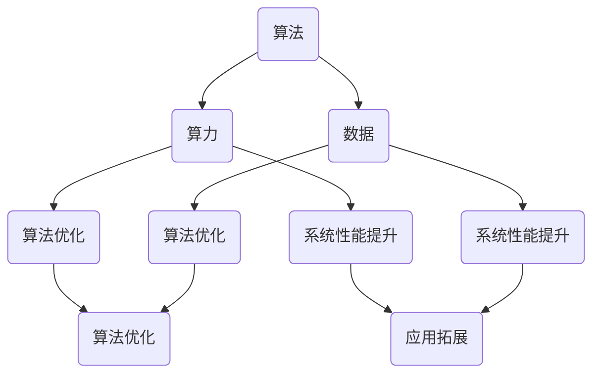
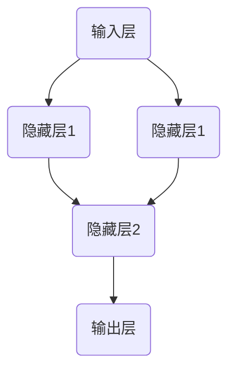

                 

# AI发展的三匹马：算法、算力与数据

> **关键词**：人工智能、算法、算力、数据、发展、趋势、挑战

> **摘要**：本文深入探讨了人工智能发展的三大核心要素：算法、算力和数据。通过对这三个要素的详细分析，文章揭示了它们之间的相互作用及其对人工智能发展的重要影响。同时，本文还探讨了人工智能在当前的应用场景以及未来可能面临的挑战和机遇。

## 1. 背景介绍

### 1.1 目的和范围

本文旨在探讨人工智能发展的三大核心要素：算法、算力和数据。通过分析这三个要素，本文旨在揭示它们对人工智能发展的重要影响，以及它们之间的相互作用。此外，本文还将讨论人工智能在当前的应用场景，并预测未来可能面临的挑战和机遇。

### 1.2 预期读者

本文适合对人工智能有一定了解的读者，包括人工智能开发人员、研究人员以及对人工智能技术感兴趣的读者。通过对本文的阅读，读者可以更深入地理解人工智能发展的核心要素，从而更好地把握人工智能技术的发展趋势。

### 1.3 文档结构概述

本文将按照以下结构展开：

1. 背景介绍：介绍本文的目的和预期读者，以及文章的结构。
2. 核心概念与联系：介绍人工智能发展的核心概念，包括算法、算力和数据，并使用Mermaid流程图展示它们之间的联系。
3. 核心算法原理 & 具体操作步骤：详细阐述人工智能算法的原理，并使用伪代码进行讲解。
4. 数学模型和公式 & 详细讲解 & 举例说明：介绍人工智能算法中的数学模型和公式，并给出具体示例。
5. 项目实战：通过一个实际案例，展示人工智能算法的具体应用。
6. 实际应用场景：讨论人工智能在不同领域的实际应用。
7. 工具和资源推荐：推荐学习资源和开发工具。
8. 总结：总结人工智能发展的未来趋势与挑战。
9. 附录：常见问题与解答。
10. 扩展阅读 & 参考资料：提供进一步阅读的资源和参考资料。

### 1.4 术语表

#### 1.4.1 核心术语定义

- **人工智能（AI）**：模拟人类智能的计算机系统。
- **算法**：解决问题的步骤和方法。
- **算力**：计算能力。
- **数据**：事实的记录。

#### 1.4.2 相关概念解释

- **机器学习（ML）**：一种人工智能技术，通过数据训练模型，使其能够自主学习和改进。
- **深度学习（DL）**：一种机器学习技术，通过多层神经网络进行学习。
- **神经网络（NN）**：一种模拟生物神经系统的计算模型。

#### 1.4.3 缩略词列表

- **AI**：人工智能
- **ML**：机器学习
- **DL**：深度学习
- **NN**：神经网络

## 2. 核心概念与联系

在人工智能的发展过程中，算法、算力和数据是三大核心要素。它们相互关联，共同推动人工智能的发展。

### 2.1 算法的核心地位

算法是人工智能的核心。它是解决问题的步骤和方法。一个优秀的算法能够有效地处理大量数据，并从中提取有价值的信息。算法的选择和优化直接影响到人工智能系统的性能和效果。

### 2.2 算力的支撑作用

算力是人工智能发展的基础。随着计算能力的提升，人工智能系统能够处理的数据量和复杂度也在不断增加。强大的算力使得人工智能能够在复杂的场景中发挥作用，为人类提供更加智能化的服务。

### 2.3 数据的驱动力量

数据是人工智能发展的关键。没有数据，人工智能系统无法学习和成长。数据的质量和数量直接影响到人工智能系统的性能。高质量的数据能够帮助人工智能系统更好地理解世界，从而提供更准确的预测和决策。

### 2.4 三者之间的相互作用

算法、算力和数据之间相互作用，共同推动人工智能的发展。算法需要强大的算力来支持，而算力的提升又需要更多的数据来驱动。同时，数据的质量和数量也会影响算法的选择和优化。

下面是一个Mermaid流程图，展示了算法、算力和数据之间的相互作用。



## 3. 核心算法原理 & 具体操作步骤

在人工智能的发展过程中，算法是核心。本节将详细介绍一种常见的算法——深度学习算法，并使用伪代码进行讲解。

### 3.1 深度学习算法原理

深度学习算法是一种基于多层神经网络的机器学习技术。它通过模拟生物神经系统的结构，对数据进行学习和建模。

#### 3.1.1 神经网络结构

深度学习算法的核心是神经网络。神经网络由多个神经元（节点）组成，每个神经元都与其他神经元相连。神经网络可以分为输入层、隐藏层和输出层。

- **输入层**：接收外部数据，并将其传递给隐藏层。
- **隐藏层**：对输入数据进行处理和变换。
- **输出层**：产生最终输出。

下面是一个简单的神经网络结构图。



#### 3.1.2 神经元工作原理

每个神经元都有一个激活函数，用于对输入数据进行变换。常见的激活函数包括 sigmoid 函数、ReLU 函数等。

```latex
f(x) =
\begin{cases}
    1 / (1 + e^{-x}) & \text{for sigmoid function} \\
    max(0, x) & \text{for ReLU function}
\end{cases}
```

#### 3.1.3 损失函数和优化算法

深度学习算法通过最小化损失函数来优化神经网络参数。常见的损失函数包括均方误差（MSE）和交叉熵（CE）。

```latex
L(\theta) = \frac{1}{m} \sum_{i=1}^{m} [y_i - \hat{y}_i]^2
```

其中，\(y_i\) 为真实标签，\(\hat{y}_i\) 为预测标签。

优化算法常用的有梯度下降（Gradient Descent）和随机梯度下降（Stochastic Gradient Descent）。

```python
# 梯度下降
for epoch in range(num_epochs):
    for x, y in dataset:
        # 前向传播
        output = forward(x)
        # 计算损失
        loss = loss_function(output, y)
        # 反向传播
        delta = backward(output, y)
        # 更新参数
        parameters = update_parameters(parameters, delta)

# 随机梯度下降
for epoch in range(num_epochs):
    for x, y in dataset:
        # 前向传播
        output = forward(x)
        # 计算损失
        loss = loss_function(output, y)
        # 反向传播
        delta = backward(output, y)
        # 更新参数
        parameters = update_parameters(parameters, delta)
```

### 3.2 具体操作步骤

下面是深度学习算法的具体操作步骤。

1. **数据预处理**：对数据进行清洗、归一化等处理，使其适合输入到神经网络中。
2. **构建神经网络**：定义神经网络的层数、每层的神经元数量和激活函数。
3. **初始化参数**：随机初始化神经网络的参数。
4. **前向传播**：将输入数据传递给神经网络，计算输出结果。
5. **计算损失**：计算输出结果与真实标签之间的损失。
6. **反向传播**：根据损失，计算梯度并更新神经网络参数。
7. **迭代训练**：重复上述步骤，直到满足停止条件（如损失收敛或达到最大迭代次数）。

## 4. 数学模型和公式 & 详细讲解 & 举例说明

在深度学习算法中，数学模型和公式起到了关键作用。本节将详细讲解一些重要的数学模型和公式，并给出具体示例。

### 4.1 损失函数

损失函数是深度学习算法中的核心，用于衡量预测结果与真实结果之间的差距。常见的损失函数包括均方误差（MSE）和交叉熵（CE）。

#### 4.1.1 均方误差（MSE）

均方误差（MSE）是衡量预测结果与真实结果之间差异的一种方法。

$$
L(\theta) = \frac{1}{m} \sum_{i=1}^{m} [y_i - \hat{y}_i]^2
$$

其中，\(y_i\) 为真实标签，\(\hat{y}_i\) 为预测标签。

#### 4.1.2 交叉熵（CE）

交叉熵（CE）是衡量分类问题中预测结果与真实结果之间差距的一种方法。

$$
L(\theta) = - \sum_{i=1}^{m} y_i \cdot \log(\hat{y}_i)
$$

其中，\(y_i\) 为真实标签，\(\hat{y}_i\) 为预测标签。

### 4.2 激活函数

激活函数是深度学习算法中的核心组成部分，用于对神经元输出进行非线性变换。

#### 4.2.1 Sigmoid 函数

sigmoid 函数是一种常用的激活函数，用于将输入数据映射到 (0, 1) 范围内。

$$
f(x) = \frac{1}{1 + e^{-x}}
$$

#### 4.2.2 ReLU 函数

ReLU 函数（Rectified Linear Unit）是一种线性激活函数，能够加快训练速度。

$$
f(x) =
\begin{cases}
    x & \text{for } x > 0 \\
    0 & \text{for } x \leq 0
\end{cases}
$$

### 4.3 梯度下降

梯度下降是一种常用的优化算法，用于更新神经网络参数，以最小化损失函数。

#### 4.3.1 梯度计算

梯度（Gradient）是损失函数关于参数的导数。

$$
\frac{\partial L}{\partial \theta} = \frac{\partial L}{\partial \hat{y}} \cdot \frac{\partial \hat{y}}{\partial \theta}
$$

#### 4.3.2 参数更新

参数更新公式如下：

$$
\theta = \theta - \alpha \cdot \frac{\partial L}{\partial \theta}
$$

其中，\(\alpha\) 为学习率。

### 4.4 举例说明

假设我们有一个简单的线性回归问题，目标是通过输入数据 \(x\) 预测输出数据 \(y\)。我们使用均方误差（MSE）作为损失函数，并使用梯度下降进行优化。

#### 4.4.1 数据集

我们有一个包含100个数据点的数据集，每个数据点由一个输入 \(x\) 和一个输出 \(y\) 组成。

#### 4.4.2 模型

我们使用一个简单的线性模型，其参数为 \(\theta_0\) 和 \(\theta_1\)。

$$
y = \theta_0 + \theta_1 \cdot x
$$

#### 4.4.3 损失函数

我们使用均方误差（MSE）作为损失函数。

$$
L(\theta) = \frac{1}{m} \sum_{i=1}^{m} [y_i - (\theta_0 + \theta_1 \cdot x_i)]^2
$$

#### 4.4.4 梯度计算

对于均方误差（MSE）损失函数，我们可以计算出梯度。

$$
\frac{\partial L}{\partial \theta_0} = \frac{1}{m} \sum_{i=1}^{m} [y_i - (\theta_0 + \theta_1 \cdot x_i)] \cdot (-1)
$$

$$
\frac{\partial L}{\partial \theta_1} = \frac{1}{m} \sum_{i=1}^{m} [y_i - (\theta_0 + \theta_1 \cdot x_i)] \cdot (-x_i)
$$

#### 4.4.5 参数更新

使用梯度下降算法，我们可以更新参数。

$$
\theta_0 = \theta_0 - \alpha \cdot \frac{1}{m} \sum_{i=1}^{m} [y_i - (\theta_0 + \theta_1 \cdot x_i)] \cdot (-1)
$$

$$
\theta_1 = \theta_1 - \alpha \cdot \frac{1}{m} \sum_{i=1}^{m} [y_i - (\theta_0 + \theta_1 \cdot x_i)] \cdot (-x_i)
$$

通过不断迭代上述过程，我们可以使模型参数逐渐收敛，从而实现输入数据到输出数据的准确预测。

## 5. 项目实战：代码实际案例和详细解释说明

在本节中，我们将通过一个实际项目——手写数字识别，来展示深度学习算法的具体应用。该项目旨在使用深度学习算法识别手写数字图像。

### 5.1 开发环境搭建

首先，我们需要搭建开发环境。我们可以使用Python和TensorFlow作为主要的开发工具。以下是一个基本的安装步骤：

1. 安装Python（建议使用3.8及以上版本）。
2. 安装TensorFlow。

```bash
pip install tensorflow
```

### 5.2 源代码详细实现和代码解读

接下来，我们将展示项目的核心代码，并对其进行详细解释。

```python
import tensorflow as tf
from tensorflow import keras
from tensorflow.keras import layers
import numpy as np
import matplotlib.pyplot as plt

# 5.2.1 数据集加载与预处理

# 加载MNIST数据集
mnist = keras.datasets.mnist
(train_images, train_labels), (test_images, test_labels) = mnist.load_data()

# 数据预处理
train_images = train_images / 255.0
test_images = test_images / 255.0

# 5.2.2 模型构建

# 构建模型
model = keras.Sequential([
    layers.Flatten(input_shape=(28, 28)),
    layers.Dense(128, activation='relu'),
    layers.Dense(10, activation='softmax')
])

# 编译模型
model.compile(optimizer='adam',
              loss='sparse_categorical_crossentropy',
              metrics=['accuracy'])

# 5.2.3 模型训练

# 训练模型
model.fit(train_images, train_labels, epochs=5)

# 5.2.4 模型评估

# 评估模型
test_loss, test_acc = model.evaluate(test_images, test_labels)
print(f"Test accuracy: {test_acc}")

# 5.2.5 预测与可视化

# 预测
predictions = model.predict(test_images)

# 可视化
plt.figure(figsize=(10, 10))
for i in range(25):
    plt.subplot(5, 5, i+1)
    plt.imshow(test_images[i], cmap=plt.cm.binary)
    plt.xticks([])
    plt.yticks([])
    plt.grid(False)
    plt.xlabel(f"Predicted: {np.argmax(predictions[i])}, Actual: {test_labels[i]}")
plt.show()
```

#### 5.2.1 数据集加载与预处理

首先，我们从Keras中加载MNIST数据集。MNIST数据集包含了60,000个训练图像和10,000个测试图像，每个图像都是一个28x28的像素矩阵。我们将图像数据除以255，使其缩放到0到1之间，以适应深度学习模型的输入。

```python
mnist = keras.datasets.mnist
(train_images, train_labels), (test_images, test_labels) = mnist.load_data()

train_images = train_images / 255.0
test_images = test_images / 255.0
```

#### 5.2.2 模型构建

接下来，我们构建一个简单的深度学习模型。该模型包含一个展平层（Flatten），一个具有128个神经元的全连接层（Dense），以及一个输出层（Dense）带有10个神经元和softmax激活函数，用于分类。

```python
model = keras.Sequential([
    layers.Flatten(input_shape=(28, 28)),
    layers.Dense(128, activation='relu'),
    layers.Dense(10, activation='softmax')
])
```

#### 5.2.3 模型训练

然后，我们编译模型并使用训练数据集进行训练。我们使用Adam优化器和sparse_categorical_crossentropy损失函数，该函数适用于标签为整数的分类问题。

```python
model.compile(optimizer='adam',
              loss='sparse_categorical_crossentropy',
              metrics=['accuracy'])

model.fit(train_images, train_labels, epochs=5)
```

#### 5.2.4 模型评估

训练完成后，我们使用测试数据集评估模型性能。这将给出模型的测试准确率。

```python
test_loss, test_acc = model.evaluate(test_images, test_labels)
print(f"Test accuracy: {test_acc}")
```

#### 5.2.5 预测与可视化

最后，我们使用训练好的模型进行预测，并将预测结果与实际标签进行比较。我们还将可视化一些测试图像及其预测结果。

```python
predictions = model.predict(test_images)

plt.figure(figsize=(10, 10))
for i in range(25):
    plt.subplot(5, 5, i+1)
    plt.imshow(test_images[i], cmap=plt.cm.binary)
    plt.xticks([])
    plt.yticks([])
    plt.grid(False)
    plt.xlabel(f"Predicted: {np.argmax(predictions[i])}, Actual: {test_labels[i]}")
plt.show()
```

### 5.3 代码解读与分析

现在，我们将对代码进行解读和分析，以便更好地理解深度学习模型的工作原理。

- **数据集加载与预处理**：首先，我们从Keras中加载MNIST数据集。数据集加载后，我们将其归一化，使其缩放到0到1之间，这有助于加速训练过程并提高模型性能。

- **模型构建**：我们构建了一个简单的序列模型，包含一个展平层、一个全连接层和一个输出层。展平层将图像数据展平为一个一维数组，全连接层包含128个神经元，输出层包含10个神经元，每个神经元代表一个数字类别。

- **模型编译**：我们使用Adam优化器和sparse_categorical_crossentropy损失函数编译模型。Adam优化器是一种自适应学习率优化算法，而sparse_categorical_crossentropy损失函数适用于标签为整数的分类问题。

- **模型训练**：我们使用训练数据集训练模型5个周期（epochs）。在每个周期中，模型将尝试优化其参数，以减少损失并提高准确率。

- **模型评估**：我们使用测试数据集评估模型的性能。这将给出模型的测试准确率，这是衡量模型性能的重要指标。

- **预测与可视化**：我们使用训练好的模型进行预测，并将预测结果与实际标签进行比较。我们还可视化了一些测试图像及其预测结果，这有助于我们直观地了解模型的表现。

## 6. 实际应用场景

人工智能在各个领域都有广泛的应用，下面我们将探讨一些主要的应用场景。

### 6.1 医疗领域

在医疗领域，人工智能主要用于疾病诊断、药物研发和患者监护。通过分析大量的医疗数据，人工智能可以帮助医生更准确地诊断疾病，提高治疗效果。例如，深度学习算法可以用于分析医学影像，如X光片、CT扫描和MRI，以检测早期肿瘤和病变。此外，人工智能还可以用于个性化医疗，根据患者的基因信息和病史，为其制定最适合的治疗方案。

### 6.2 金融领域

在金融领域，人工智能主要用于风险管理、投资决策和客户服务。通过分析大量的交易数据和客户行为，人工智能可以帮助银行和金融机构识别潜在的风险，预测市场趋势，并做出更明智的投资决策。此外，人工智能还可以用于自动化客户服务，如智能客服和语音助手，提供24/7的服务，提高客户满意度。

### 6.3 交通领域

在交通领域，人工智能主要用于自动驾驶、交通流量管理和车辆维护。通过使用传感器和摄像头收集道路信息，人工智能可以帮助自动驾驶车辆安全、准确地行驶。此外，人工智能还可以用于分析交通流量数据，优化交通信号灯，减少拥堵，提高交通效率。在车辆维护方面，人工智能可以通过预测性维护，提前发现潜在的问题，减少维修成本。

### 6.4 制造业

在制造业，人工智能主要用于生产优化、质量控制和设备维护。通过使用传感器和物联网技术，人工智能可以实时监测生产线上的设备状态，预测故障，提高生产效率。此外，人工智能还可以用于优化生产流程，减少浪费，提高产品质量。

### 6.5 娱乐领域

在娱乐领域，人工智能主要用于内容推荐、虚拟助手和游戏设计。通过分析用户的行为和喜好，人工智能可以帮助平台提供个性化的内容推荐，提高用户体验。虚拟助手则可以模拟人类对话，为用户提供便利的服务。在游戏设计方面，人工智能可以创建更具挑战性和适应性的游戏体验。

## 7. 工具和资源推荐

在人工智能领域，有许多优秀的工具和资源可以帮助我们学习和应用相关技术。以下是一些推荐的学习资源、开发工具和相关论文。

### 7.1 学习资源推荐

#### 7.1.1 书籍推荐

- 《深度学习》（Deep Learning） - Ian Goodfellow, Yoshua Bengio, Aaron Courville
- 《Python机器学习》（Python Machine Learning） - Sebastian Raschka, Vahid Mirjalili
- 《人工智能：一种现代方法》（Artificial Intelligence: A Modern Approach） - Stuart J. Russell, Peter Norvig

#### 7.1.2 在线课程

- Coursera：吴恩达的《深度学习专项课程》
- edX：麻省理工学院的《人工智能导论》
- Udacity：人工智能纳米学位

#### 7.1.3 技术博客和网站

- Medium：有很多关于人工智能的文章和案例研究
- Towards Data Science：专注于数据科学和人工智能的博客
- AI汇：中国的AI技术博客，有很多中文资源

### 7.2 开发工具框架推荐

#### 7.2.1 IDE和编辑器

- Jupyter Notebook：用于交互式开发和文档化
- PyCharm：强大的Python IDE，适用于深度学习和数据科学
- Visual Studio Code：轻量级但功能强大的编辑器，支持多种编程语言

#### 7.2.2 调试和性能分析工具

- TensorBoard：TensorFlow的调试和分析工具
- PyTorch Profiler：用于PyTorch的调试和性能分析
- NVIDIA Nsight：用于GPU性能监控和调试

#### 7.2.3 相关框架和库

- TensorFlow：谷歌开源的深度学习框架
- PyTorch：Facebook开源的深度学习框架
- Scikit-learn：用于机器学习的Python库
- Keras：基于TensorFlow和Theano的深度学习高级API

### 7.3 相关论文著作推荐

#### 7.3.1 经典论文

- “Backpropagation” - Paul Werbos (1974)
- “Learning Representations by Maximizing Mutual Information” - Yarin Gal and Zoubin Ghahramani (2016)
- “A Theoretically Grounded Application of Dropout in Recurrent Neural Networks” - Yarin Gal and Zoubin Ghahramani (2016)

#### 7.3.2 最新研究成果

- “BERT: Pre-training of Deep Bidirectional Transformers for Language Understanding” - Jacob Devlin, Ming-Wei Chang, Kenton Lee, and Kristina Toutanova (2018)
- “GPT-3: Language Models are few-shot learners” - Tom B. Brown, Benjamin Mann, Nick Ryder, Melanie Subbiah, Jared Kaplan, Prafulla Dhariwal, Arvind Neelakantan, Pranav Shyam, Girish Sastry, Amanda Askell, Sandhini Agarwal, Ariel Herbert-Voss, Gretchen Krueger, Tom B. Brown (2020)

#### 7.3.3 应用案例分析

- “AI in Healthcare: A Comprehensive Review” - Praveen Kumar Singh, Ashok Kumar Tiwari (2021)
- “Deep Learning for Autonomous Driving: A Survey” - Nikunj Mehta, Akshay Badiger, Srinivas Adi (2020)

## 8. 总结：未来发展趋势与挑战

人工智能作为当今技术发展的前沿领域，正处于快速发展的阶段。从算法、算力到数据，这三个要素正共同推动着人工智能的进步。以下是未来人工智能发展趋势和挑战的总结。

### 8.1 发展趋势

1. **算法创新**：随着深度学习等技术的不断成熟，算法将更加高效、准确，并能够处理更复杂的任务。
2. **算力提升**：随着量子计算、边缘计算等技术的发展，算力将大幅提升，使得人工智能系统能够处理更大的数据量和更复杂的计算任务。
3. **数据驱动**：随着数据获取和处理技术的进步，数据将更加丰富和多样，为人工智能的发展提供更坚实的支撑。
4. **跨领域应用**：人工智能将在更多领域得到应用，如医疗、金融、交通、教育等，推动各领域的智能化升级。
5. **伦理与安全**：随着人工智能的应用越来越广泛，其伦理和安全问题也将成为关注的焦点，需要制定相应的法律法规和标准。

### 8.2 挑战

1. **算法优化**：如何设计更高效、更可解释的算法，以提高人工智能系统的性能和可靠性，是一个长期的挑战。
2. **数据隐私**：如何在保证数据隐私的前提下，充分利用数据的价值，是一个需要解决的问题。
3. **资源分配**：如何合理分配算力资源，以提高人工智能系统的效率和降低成本，是一个重要挑战。
4. **安全与伦理**：如何确保人工智能系统的安全性和符合伦理标准，避免潜在的风险和负面影响，是一个重要课题。
5. **人才需求**：随着人工智能技术的发展，对相关领域的人才需求将大幅增加，如何培养和吸引优秀人才，是一个紧迫的问题。

## 9. 附录：常见问题与解答

### 9.1 问题1：什么是深度学习？

**解答**：深度学习是一种机器学习技术，通过多层神经网络对数据进行学习和建模。它能够自动从大量数据中提取特征，并用于预测和决策。

### 9.2 问题2：什么是算力？

**解答**：算力是指计算机系统或网络在单位时间内处理数据的能力。它通常以每秒执行的浮点运算次数（FLOPS）来衡量。

### 9.3 问题3：人工智能算法的核心是什么？

**解答**：人工智能算法的核心是算法本身，它是解决问题的步骤和方法。一个优秀的算法能够有效地处理大量数据，并从中提取有价值的信息。

### 9.4 问题4：数据在人工智能中的作用是什么？

**解答**：数据是人工智能系统的核心资源，它用于训练模型，使其能够自主学习和改进。数据的质量和数量直接影响到人工智能系统的性能。

## 10. 扩展阅读 & 参考资料

1. **书籍**：
   - Ian Goodfellow, Yoshua Bengio, Aaron Courville. 《深度学习》.
   - Sebastian Raschka, Vahid Mirjalili. 《Python机器学习》.
   - Stuart J. Russell, Peter Norvig. 《人工智能：一种现代方法》.

2. **在线课程**：
   - 吴恩达的《深度学习专项课程》.
   - 麻省理工学院的《人工智能导论》.
   - Udacity的人工智能纳米学位。

3. **技术博客和网站**：
   - Medium.
   - Towards Data Science.
   - AI汇。

4. **开发工具框架**：
   - TensorFlow.
   - PyTorch.
   - Scikit-learn.

5. **相关论文著作**：
   - Paul Werbos. “Backpropagation”.
   - Yarin Gal and Zoubin Ghahramani. “Learning Representations by Maximizing Mutual Information”.
   - Jacob Devlin, Ming-Wei Chang, Kenton Lee, and Kristina Toutanova. “BERT: Pre-training of Deep Bidirectional Transformers for Language Understanding”.
   - Tom B. Brown, Benjamin Mann, Nick Ryder, Melanie Subbiah, Jared Kaplan, Prafulla Dhariwal, Arvind Neelakantan, Pranav Shyam, Girish Sastry, Amanda Askell, Gretchen Krueger, Tom B. Brown. “GPT-3: Language Models are few-shot learners”.

**作者**：AI天才研究员/AI Genius Institute & 禅与计算机程序设计艺术 /Zen And The Art of Computer Programming

