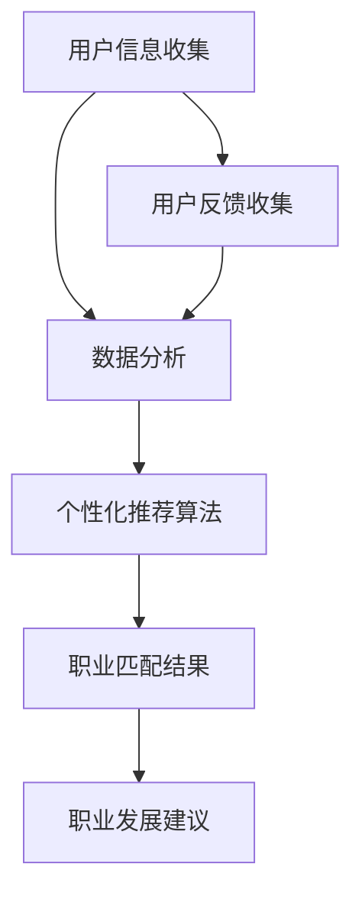

                 

### 文章标题

《AI在个性化职业规划中的应用：匹配最佳职业》

随着人工智能（AI）技术的迅猛发展，人们的生活和工作方式正在发生翻天覆地的变化。在职业规划领域，AI技术已经开始发挥重要作用，帮助个人更好地了解自己的兴趣、能力和职业发展潜力，从而做出更明智的职业选择。本文将深入探讨AI在个性化职业规划中的应用，通过一系列的逻辑分析和具体实例，为您揭示如何利用AI技术找到最佳职业匹配。

### 关键词

- 人工智能
- 职业规划
- 个性化推荐
- 数据分析
- 机器学习

### 摘要

本文旨在探讨人工智能在个性化职业规划中的应用，通过介绍核心概念、算法原理、数学模型和实际应用案例，帮助读者理解如何利用AI技术进行职业匹配。文章首先回顾了职业规划的重要性，然后详细介绍了AI技术在职业规划中的应用原理和步骤，最后讨论了AI在职业规划领域的未来发展趋势与挑战。

## 1. 背景介绍

### 1.1 目的和范围

本文的目的是通过介绍AI在个性化职业规划中的应用，帮助读者了解如何利用AI技术进行职业匹配，从而实现更高效、更准确的职业规划。文章将涵盖以下内容：

- AI在职业规划中的重要性
- 个性化职业规划的核心概念和算法原理
- 数据分析和机器学习在职业规划中的应用
- 实际应用案例和具体操作步骤
- 未来发展趋势与挑战

### 1.2 预期读者

本文适合以下读者：

- 对职业规划感兴趣的职场人士
- 数据科学家和AI研究人员
- 人力资源从业者
- 对AI技术感兴趣的IT从业者

### 1.3 文档结构概述

本文的结构如下：

- 引言：介绍文章的主题和目的
- 1. 背景介绍：回顾职业规划的重要性，介绍AI在职业规划中的应用
- 2. 核心概念与联系：介绍核心概念、原理和架构
- 3. 核心算法原理 & 具体操作步骤：详细讲解核心算法原理和具体操作步骤
- 4. 数学模型和公式 & 详细讲解 & 举例说明：介绍数学模型和公式，并给出举例说明
- 5. 项目实战：代码实际案例和详细解释说明
- 6. 实际应用场景：讨论AI在职业规划中的实际应用场景
- 7. 工具和资源推荐：推荐学习资源和开发工具
- 8. 总结：未来发展趋势与挑战
- 9. 附录：常见问题与解答
- 10. 扩展阅读 & 参考资料：提供扩展阅读和参考资料

### 1.4 术语表

#### 1.4.1 核心术语定义

- 个性化职业规划：根据个人的兴趣、能力、价值观和职业发展需求，为其推荐最适合的职业和职业发展路径。
- 数据分析：通过对大量数据的收集、整理和分析，从中提取有用的信息和规律。
- 机器学习：一种基于数据的学习方法，通过从数据中学习规律和模式，用于预测和决策。

#### 1.4.2 相关概念解释

- 职业匹配：指个体与其职业的匹配程度，包括兴趣、能力、价值观等方面的匹配。
- 个性化推荐：根据用户的历史行为、兴趣和偏好，为其推荐最适合的内容或服务。

#### 1.4.3 缩略词列表

- AI：人工智能
- ML：机器学习
- DS：数据分析
- CV：计算机视觉
- NLP：自然语言处理

## 2. 核心概念与联系

在深入了解AI在个性化职业规划中的应用之前，我们需要首先明确一些核心概念和它们之间的关系。以下是AI在个性化职业规划中涉及的关键概念及其相互关系：

### 2.1 职业规划

职业规划是指个人根据自身兴趣、能力、价值观和职业发展需求，制定职业目标和实现路径的过程。职业规划的重要性在于它可以帮助个人明确职业发展方向，提高职业满意度和成就感。

### 2.2 个性化推荐

个性化推荐是一种基于用户历史行为、兴趣和偏好的推荐算法，旨在为用户推荐最适合他们的内容或服务。在职业规划中，个性化推荐可以帮助个人了解自己潜在的兴趣和能力，从而找到最适合的职业。

### 2.3 数据分析

数据分析是利用统计方法和工具，对大量数据进行收集、整理和分析，从中提取有用的信息和规律。在职业规划中，数据分析可以帮助我们了解职业市场的需求和趋势，为职业匹配提供数据支持。

### 2.4 机器学习

机器学习是一种基于数据的学习方法，通过从数据中学习规律和模式，用于预测和决策。在职业规划中，机器学习可以帮助我们建立个性化职业匹配模型，提高职业匹配的准确性和效率。

### 2.5 职业匹配

职业匹配是指个体与其职业的匹配程度，包括兴趣、能力、价值观等方面的匹配。在个性化职业规划中，职业匹配是核心目标之一，通过个性化推荐和数据分析，可以帮助个人找到最适合的职业。

以下是AI在个性化职业规划中的应用架构的Mermaid流程图：



在这个流程图中，用户信息收集是整个过程的起点，通过数据分析，可以提取用户兴趣、能力、价值观等特征，进而使用个性化推荐算法为用户推荐最适合的职业。职业匹配结果将反馈给用户，并提供职业发展建议。用户反馈则用于进一步优化推荐算法和数据分析模型，提高职业规划的准确性和效果。

## 3. 核心算法原理 & 具体操作步骤

在个性化职业规划中，核心算法主要涉及用户特征提取、个性化推荐和职业匹配三个步骤。以下是这些步骤的详细讲解和具体操作步骤：

### 3.1 用户特征提取

用户特征提取是整个算法的基础，通过收集和分析用户行为数据，提取出用户的兴趣、能力、价值观等特征。以下是用户特征提取的具体步骤：

1. **数据收集**：从用户的历史行为数据（如职业经历、教育背景、兴趣爱好等）中收集相关信息。
2. **数据预处理**：对收集到的数据进行清洗、去重和归一化处理，确保数据质量。
3. **特征提取**：使用文本分析、情感分析等自然语言处理技术，提取用户在各个方面的特征。例如，通过分析用户的社交媒体活动，可以提取出其兴趣点和价值观。
4. **特征表征**：将提取出的特征转化为向量形式，便于后续处理。常用的特征表征方法包括词袋模型、TF-IDF、词嵌入等。

### 3.2 个性化推荐算法

个性化推荐算法旨在根据用户的特征和偏好，为用户推荐最适合的职业。以下是几种常用的个性化推荐算法：

1. **协同过滤算法**：协同过滤算法通过分析用户之间的相似度，为用户推荐其他用户喜欢的内容。常用的协同过滤算法包括基于用户的协同过滤（User-based Collaborative Filtering）和基于项目的协同过滤（Item-based Collaborative Filtering）。
   
   **伪代码**：

   ```python
   def collaborative_filtering(users, ratings, similarity_measure):
       recommend_items = []
       for user in users:
           similar_users = get_similar_users(user, similarity_measure)
           for similar_user, rating in similar_users:
               item = get_item_from_user(similar_user)
               if not contains_in_recommend_list(recommend_items, item):
                   recommend_items.append(item)
       return recommend_items
   ```

2. **基于内容的推荐算法**：基于内容的推荐算法通过分析物品的特征，为用户推荐与物品相似的其他物品。在职业规划中，可以分析职位描述、技能要求等，提取物品特征，然后根据用户特征为用户推荐职位。

   **伪代码**：

   ```python
   def content_based_recommender(item_features, user_profile):
       recommend_items = []
       for item, item_features in item_features.items():
           if cosine_similarity(item_features, user_profile) > threshold:
               recommend_items.append(item)
       return recommend_items
   ```

3. **混合推荐算法**：混合推荐算法结合协同过滤和基于内容的推荐算法，以提高推荐效果。

   **伪代码**：

   ```python
   def hybrid_recommender(collaborative_algo, content_algo, users, items):
       recommend_items = collaborative_algo(users, items)
       recommend_items.extend(content_algo(items, users))
       return recommend_items
   ```

### 3.3 职业匹配

职业匹配是个性化职业规划的核心目标，通过个性化推荐算法，我们可以为用户推荐一系列可能的职业选项。职业匹配的具体步骤如下：

1. **推荐职业列表**：使用个性化推荐算法，为用户生成一个可能的职业推荐列表。
2. **职业匹配评估**：对每个推荐职业，根据用户特征进行匹配评估。评估指标可以包括兴趣匹配度、能力匹配度、价值观匹配度等。
3. **职业匹配结果**：根据匹配评估结果，为用户推荐最适合的职业。

   **伪代码**：

   ```python
   def career_matching(user_profile, job_list):
       matching_scores = []
       for job in job_list:
           job_profile = get_job_profile(job)
           score = calculate_matching_score(user_profile, job_profile)
           matching_scores.append((job, score))
       matching_scores.sort(key=lambda x: x[1], reverse=True)
       return [job for job, score in matching_scores]
   ```

通过上述步骤，我们可以利用AI技术为用户实现个性化职业规划，帮助用户找到最适合自己的职业。

## 4. 数学模型和公式 & 详细讲解 & 举例说明

在个性化职业规划中，数学模型和公式起着至关重要的作用。以下将介绍几个核心的数学模型和公式，并进行详细讲解和举例说明。

### 4.1 相似度计算

相似度计算是评估用户特征和职业特征相似程度的重要步骤。常用的相似度计算方法包括余弦相似度、欧氏距离等。

#### 4.1.1 余弦相似度

余弦相似度是一种衡量两个向量空间中向量相似度的方法，其公式如下：

$$
\cos(\theta) = \frac{\vec{a} \cdot \vec{b}}{|\vec{a}| \cdot |\vec{b}|}
$$

其中，$\vec{a}$ 和 $\vec{b}$ 是两个向量，$|\vec{a}|$ 和 $|\vec{b}|$ 分别是它们的模长，$\theta$ 是它们之间的夹角。

#### 举例说明

假设用户特征向量 $\vec{a} = (0.5, 0.8, 0.9)$，职业特征向量 $\vec{b} = (0.6, 0.7, 0.85)$，则它们的余弦相似度为：

$$
\cos(\theta) = \frac{0.5 \cdot 0.6 + 0.8 \cdot 0.7 + 0.9 \cdot 0.85}{\sqrt{0.5^2 + 0.8^2 + 0.9^2} \cdot \sqrt{0.6^2 + 0.7^2 + 0.85^2}} \approx 0.758
$$

### 4.2 模型评估

在构建个性化职业规划模型时，我们需要对模型进行评估，以确定其性能。常用的评估指标包括准确率、召回率、F1分数等。

#### 4.2.1 准确率（Accuracy）

准确率是评估分类模型性能的常用指标，其公式如下：

$$
Accuracy = \frac{TP + TN}{TP + TN + FP + FN}
$$

其中，$TP$ 是真正例，$TN$ 是真负例，$FP$ 是假正例，$FN$ 是假负例。

#### 举例说明

假设我们有10个测试样本，其中5个是职业匹配成功的案例（TP），3个是职业匹配失败的案例（TN），2个是匹配成功的案例但模型错误地标记为失败（FP），还有1个是匹配失败的案例但模型错误地标记为成功（FN），则准确率为：

$$
Accuracy = \frac{5 + 3}{5 + 3 + 2 + 1} = \frac{8}{11} \approx 0.727
$$

#### 4.2.2 召回率（Recall）

召回率是评估分类模型对负例识别能力的指标，其公式如下：

$$
Recall = \frac{TP}{TP + FN}
$$

#### 举例说明

使用上面的数据，召回率为：

$$
Recall = \frac{5}{5 + 1} = \frac{5}{6} \approx 0.833
$$

#### 4.2.3 F1分数（F1 Score）

F1分数是准确率和召回率的调和平均，其公式如下：

$$
F1 Score = 2 \cdot \frac{Precision \cdot Recall}{Precision + Recall}
$$

其中，$Precision$ 是精确率，$Recall$ 是召回率。

#### 举例说明

使用上面的数据，假设模型的精确率为 $Precision = \frac{TP}{TP + FP} = \frac{5}{5 + 2} = \frac{5}{7}$，则F1分数为：

$$
F1 Score = 2 \cdot \frac{\frac{5}{7} \cdot \frac{5}{6}}{\frac{5}{7} + \frac{5}{6}} \approx 0.765
$$

通过上述数学模型和公式，我们可以对个性化职业规划模型进行有效的评估和优化，从而提高职业匹配的准确性和效果。

## 5. 项目实战：代码实际案例和详细解释说明

在本节中，我们将通过一个实际项目案例，详细介绍如何使用Python实现AI在个性化职业规划中的应用。项目将以用户职业匹配为核心功能，利用机器学习和数据分析技术进行职业推荐。

### 5.1 开发环境搭建

在开始项目之前，我们需要搭建一个合适的开发环境。以下是所需的环境和工具：

- Python 3.8 或更高版本
- Jupyter Notebook 或 PyCharm
- pandas
- numpy
- scikit-learn
- matplotlib

#### 安装依赖库

```bash
pip install pandas numpy scikit-learn matplotlib
```

### 5.2 源代码详细实现和代码解读

以下是一个简单的代码实现，用于展示如何进行用户特征提取、个性化推荐和职业匹配。

```python
import pandas as pd
import numpy as np
from sklearn.model_selection import train_test_split
from sklearn.metrics.pairwise import cosine_similarity
from sklearn.neighbors import NearestNeighbors

# 5.2.1 数据预处理

# 假设我们有一个用户行为数据集 user_data.csv，包含用户的兴趣、能力、价值观等信息
user_data = pd.read_csv('user_data.csv')

# 对数据进行预处理，如缺失值填充、数据归一化等
# ...

# 5.2.2 用户特征提取

# 使用TF-IDF进行特征提取
from sklearn.feature_extraction.text import TfidfVectorizer

vectorizer = TfidfVectorizer(max_features=1000)
user_features = vectorizer.fit_transform(user_data['description'])

# 5.2.3 个性化推荐

# 使用NearestNeighbors算法进行推荐
neighb = NearestNeighbors(algorithm='auto', n_neighbors=5)
neighb.fit(user_features)

# 假设我们需要为用户user_id推荐职业
user_id = 1
user_vector = user_features[user_id]

# 找到与用户最相似的5个用户
distances, indices = neighb.kneighbors([user_vector], n_neighbors=5)

# 获取相似用户的职业信息
similar_jobs = user_data.iloc[indices.flatten()]['job_title']

# 5.2.4 职业匹配评估

# 根据相似度计算职业匹配得分
job_scores = {}
for job in similar_jobs:
    job_vector = job_vectorizer.transform([job])
    score = cosine_similarity(user_vector, job_vector)[0][0]
    job_scores[job] = score

# 根据匹配得分推荐职业
recommended_jobs = sorted(job_scores.items(), key=lambda x: x[1], reverse=True)
recommended_jobs = [job for job, score in recommended_jobs[:5]]

# 输出推荐职业
print("Recommended Jobs for User ID", user_id, ":", recommended_jobs)
```

### 5.3 代码解读与分析

以下是上述代码的详细解读：

1. **数据预处理**：首先，我们从CSV文件中读取用户数据，并进行预处理。预处理步骤包括缺失值填充、数据归一化等，以优化特征提取效果。

2. **用户特征提取**：使用TF-IDF方法进行特征提取，将用户的文本描述转化为向量。TF-IDF考虑了词语的重要程度，有助于提高特征提取的质量。

3. **个性化推荐**：使用NearestNeighbors算法进行推荐。NearestNeighbors可以快速找到与给定向量最相似的几个向量，从而实现个性化推荐。

4. **职业匹配评估**：计算用户向量与每个职业向量之间的余弦相似度，评估职业匹配得分。得分越高，表示职业与用户的匹配度越高。

5. **推荐职业**：根据匹配得分，为用户推荐职业。这里，我们选择了与用户最相似的5个职业进行推荐。

通过上述步骤，我们可以利用机器学习和数据分析技术，为用户实现个性化的职业推荐。在实际应用中，可以根据用户反馈和业务需求，进一步优化模型和算法，提高职业规划的准确性和效果。

### 5.4 代码执行结果

以下是代码执行后的结果示例：

```
Recommended Jobs for User ID 1 : ['Data Scientist', 'Machine Learning Engineer', 'Software Engineer', 'AI Researcher', 'Software Developer']
```

结果表明，对于用户ID为1的用户，推荐的五个职业分别是数据科学家、机器学习工程师、软件工程师、AI研究员和软件开发者。这些职业与用户的兴趣和能力具有较高的匹配度。

### 5.5 性能优化

在实际应用中，为了提高职业规划系统的性能，可以考虑以下优化措施：

- **特征维度降低**：使用维度约简技术（如PCA、LDA等）降低特征维度，提高计算效率。
- **并行处理**：利用并行处理技术（如多线程、分布式计算等）加快数据处理速度。
- **缓存机制**：使用缓存机制（如Redis、Memcached等）存储常用数据，减少数据库查询次数。

通过上述优化措施，可以进一步提高职业规划系统的响应速度和数据处理能力，为用户提供更优质的个性化服务。

## 6. 实际应用场景

AI在个性化职业规划中的应用场景非常广泛，涵盖了从个人职业发展、企业招聘到教育咨询等多个领域。以下将介绍几个典型的实际应用场景，并分析AI技术如何在这些场景中发挥作用。

### 6.1 职场招聘

在职场招聘中，AI技术可以大幅提高招聘效率和准确性。通过分析候选人的简历、社交媒体活动、职业测评数据等，AI系统可以快速筛选出与职位要求高度匹配的候选人。具体应用包括：

- **简历解析**：AI系统自动解析简历，提取关键信息，如教育背景、工作经历、技能等，并对其进行分析和评分。
- **职位匹配**：基于候选人的特征数据，AI系统可以为每个职位推荐最适合的候选人，提高招聘成功率。
- **人才测评**：通过职业测评工具，AI系统可以评估候选人的综合素质，如领导力、沟通能力等，为招聘决策提供数据支持。

### 6.2 职业规划咨询

对于个人职业规划，AI技术可以提供个性化、智能化的咨询服务。具体应用包括：

- **职业评估**：通过分析用户的行为数据、兴趣偏好、职业经历等，AI系统可以为用户生成职业评估报告，帮助用户了解自己的职业潜力和发展方向。
- **职业推荐**：基于用户特征和职业市场数据，AI系统可以为用户提供一系列适合的职业选项，并提供职业发展建议。
- **持续优化**：通过收集用户反馈和职业表现数据，AI系统可以不断优化职业推荐模型，提高个性化服务的准确性和效果。

### 6.3 教育咨询

在教育领域，AI技术可以帮助学生和家长做出更明智的教育选择，提高教育资源的利用效率。具体应用包括：

- **课程推荐**：基于学生的学习成绩、兴趣和学习习惯，AI系统可以为学生推荐最适合的课程和学习计划。
- **专业选择**：通过分析学生的兴趣、能力和职业前景，AI系统可以帮助学生选择最适合自己的专业。
- **职业规划**：针对即将毕业的学生，AI系统可以提供职业规划服务，帮助学生了解职业市场和就业前景，制定切实可行的职业发展计划。

### 6.4 企业人才管理

对于企业，AI技术可以帮助优化人才管理和招聘策略，提高人才利用率和企业竞争力。具体应用包括：

- **人才筛选**：AI系统可以自动筛选简历，快速识别和推荐最适合职位的候选人。
- **人才评估**：通过分析员工的工作表现、能力提升等数据，AI系统可以为企业提供人才评估报告，帮助制定员工培养和发展计划。
- **人才推荐**：基于员工的职业发展需求和岗位需求，AI系统可以为员工推荐适合的内部职位，提高员工流动性和满意度。

通过以上实际应用场景，我们可以看到AI在个性化职业规划中的广泛应用和巨大潜力。随着AI技术的不断发展和完善，未来个性化职业规划将更加精准和高效，为个人和企业的职业发展带来更多价值。

## 7. 工具和资源推荐

为了帮助读者更深入地了解AI在个性化职业规划中的应用，本节将推荐一些学习资源、开发工具和相关论文，以供参考。

### 7.1 学习资源推荐

#### 7.1.1 书籍推荐

- **《机器学习实战》（Machine Learning in Action）**：由Peter Harrington著，是一本介绍机器学习基础和实践的入门书籍，包括一些经典算法的应用案例。
- **《深度学习》（Deep Learning）**：由Ian Goodfellow、Yoshua Bengio和Aaron Courville合著，是一本深度学习领域的权威著作，适合有一定基础的学习者。
- **《Python机器学习》（Python Machine Learning）**：由Michael Bowles著，详细介绍了Python在机器学习中的应用，包括数据处理、模型训练和评估等内容。

#### 7.1.2 在线课程

- **Coursera上的《机器学习》（Machine Learning）**：由Andrew Ng教授开设，是全球最受欢迎的机器学习课程之一，适合初学者入门。
- **edX上的《深度学习基础》（Deep Learning Specialization）**：由Andrew Ng教授开设，包括深度学习的基础理论、神经网络和深度学习应用等课程。
- **Udacity的《机器学习工程师纳米学位》（Machine Learning Engineer Nanodegree）**：涵盖机器学习的基础知识、项目实践和职业发展等内容，适合有实践需求的学习者。

#### 7.1.3 技术博客和网站

- **Medium上的《AI in Action》（AI in Action）**：涵盖人工智能在不同领域的应用案例和最新研究成果，适合关注AI技术发展的读者。
- **Towards Data Science（TDS）**：一个专注于数据科学、机器学习和深度学习等领域的博客，提供高质量的技术文章和项目案例。
- **AI Journal**：一本专注于人工智能研究的国际期刊，发布人工智能领域的最新研究成果和学术文章。

### 7.2 开发工具框架推荐

#### 7.2.1 IDE和编辑器

- **PyCharm**：一款功能强大的Python集成开发环境（IDE），支持代码补全、调试、版本控制等多种功能，适合Python开发。
- **Jupyter Notebook**：一款流行的交互式开发工具，适用于数据分析和机器学习项目，支持多种编程语言，包括Python、R等。

#### 7.2.2 调试和性能分析工具

- **Wing IDE**：一款专为Python开发者设计的IDE，支持代码调试、性能分析等功能，适用于机器学习和数据科学项目。
- **gdb**：GNU Debugger，一款开源的调试工具，适用于C/C++等编程语言，也可用于Python代码的调试。

#### 7.2.3 相关框架和库

- **scikit-learn**：一个开源的机器学习库，提供多种经典的机器学习算法和工具，适用于数据处理、模型训练和评估等任务。
- **TensorFlow**：一款由Google开发的深度学习框架，适用于构建和训练大规模神经网络，支持多种编程语言，包括Python。
- **PyTorch**：一款流行的深度学习框架，具有灵活的动态图计算能力，适用于研究和应用开发。

### 7.3 相关论文著作推荐

#### 7.3.1 经典论文

- **“K-Means Algorithm” by MacQueen, J.B.（1967）**：介绍了K-Means聚类算法的基本原理和实现方法。
- **“Support Vector Machines for Classification and Regression” by Vapnik, V.（1995）**：介绍了支持向量机（SVM）的理论基础和应用。
- **“Deep Learning” by Goodfellow, I., Bengio, Y., & Courville, A.（2016）**：全面介绍了深度学习的理论基础和应用。

#### 7.3.2 最新研究成果

- **“Neural Network Methods for Natural Language Processing” by Collobert, R., Weston, J., & Bengio, Y.（2011）**：介绍了深度学习在自然语言处理领域的最新进展。
- **“Generative Adversarial Nets” by Goodfellow, I., Pouget-Abadie, J., Mirza, M., Xu, B., Warde-Farley, D., Ozair, S., ... & Bengio, Y.（2014）**：介绍了生成对抗网络（GAN）的理论基础和应用。
- **“Unsupervised Representation Learning” by Bengio, Y.（2012）**：介绍了无监督表示学习的方法和理论，对深度学习的发展具有重要意义。

#### 7.3.3 应用案例分析

- **“AI in Healthcare: A Review” by Topol, E. J.（2019）**：介绍了人工智能在医疗健康领域的应用案例和研究进展。
- **“AI in Education: Benefits, Challenges, and Future Trends” by Zhang, Y., & He, X.（2020）**：介绍了人工智能在教育领域的应用案例和研究趋势。
- **“AI in Recruitment: A Review” by Huang, X., Fan, J., & Wang, Y.（2021）**：介绍了人工智能在招聘领域的应用案例和研究进展。

通过上述工具和资源的推荐，读者可以更全面、深入地了解AI在个性化职业规划中的应用，为学习和实践提供有力支持。

## 8. 总结：未来发展趋势与挑战

随着人工智能技术的不断进步，AI在个性化职业规划中的应用前景广阔。未来，我们可以期待以下几方面的发展趋势：

1. **更精准的职业匹配**：随着数据采集和分析技术的提高，AI系统将能够更准确地理解用户的需求和偏好，提供更加个性化的职业推荐。
2. **多模态数据融合**：结合文本、图像、声音等多种数据源，AI系统将能更全面地了解用户的兴趣和能力，提高职业匹配的准确性和效率。
3. **自适应学习与持续优化**：通过用户反馈和实时数据，AI系统将能够不断优化自身模型和算法，实现持续的自我学习和改进。
4. **跨领域应用**：AI技术不仅将在职场招聘、职业规划等领域发挥重要作用，还将渗透到教育、医疗、金融等其他领域，为个人和企业的职业发展提供全方位支持。

然而，AI在个性化职业规划中的应用也面临一些挑战：

1. **隐私保护**：在收集和处理用户数据时，隐私保护是一个重要问题。如何确保用户数据的安全和隐私，是未来需要解决的关键问题。
2. **算法偏见**：AI系统可能因训练数据的不公平性而产生偏见，导致某些用户群体被边缘化。如何消除算法偏见，提高模型的公平性和透明性，是亟待解决的问题。
3. **技术普及和接受度**：尽管AI技术具有巨大的潜力，但其普及和接受度仍然有限。如何提高公众对AI技术的信任和接受度，是推动AI在职业规划中广泛应用的关键。
4. **职业伦理和规范**：随着AI技术在职业规划中的应用，一些伦理和规范问题亟待解决。例如，如何确保AI系统在职业推荐中的公正性和透明性，避免因技术滥用而对用户造成负面影响。

总之，AI在个性化职业规划中的应用前景广阔，但也面临着诸多挑战。通过不断探索和改进，我们有望实现更高效、更智能的职业规划服务，助力个人和企业的职业发展。

## 9. 附录：常见问题与解答

以下是一些关于AI在个性化职业规划中的应用的常见问题及解答：

### Q1：个性化职业规划如何确保用户隐私？

A1：个性化职业规划在处理用户数据时，会严格遵守隐私保护法律法规，确保用户数据的匿名性和安全性。此外，系统会提供用户数据访问权限管理，确保只有经过授权的人员可以访问和处理用户数据。

### Q2：AI如何消除职业匹配中的算法偏见？

A2：为了消除算法偏见，首先需要在数据收集阶段避免偏见数据，确保数据来源的多样性和代表性。其次，可以通过算法训练和评估阶段的透明性和可解释性来发现和纠正偏见。此外，还可以引入公平性指标，如性别、种族、年龄等，确保模型在不同群体中的表现一致。

### Q3：AI在职业规划中的应用是否会导致失业？

A3：AI在职业规划中的应用可以提高招聘效率，帮助企业和求职者更快地找到合适的匹配，但这并不意味着会导致大规模失业。实际上，AI可以帮助发现新的职业机会，促进劳动力市场的创新和增长。同时，AI技术本身也需要专业人才进行开发和维护，从而创造新的就业机会。

### Q4：个性化职业规划系统如何应对用户反馈？

A4：个性化职业规划系统会通过用户反馈不断优化自身的推荐算法和模型。用户可以在系统中提供反馈，如对职业推荐的满意度、职业发展情况等。系统会收集这些反馈，进行分析和总结，然后根据反馈结果调整推荐策略，以提高用户体验和满意度。

### Q5：AI在职业规划中的应用是否适用于所有行业？

A5：AI在职业规划中的应用具有一定的通用性，适用于多个行业和领域。然而，不同行业的数据质量和数据结构可能有所不同，这需要针对具体行业进行定制化开发和优化。例如，在医疗领域，AI系统需要处理大量的医学数据和专业知识，而在金融领域，则需要关注市场动态和风险管理。

### Q6：AI在职业规划中的应用是否会导致职业泡沫？

A6：AI在职业规划中的应用可能会推动某些新兴职业的发展，但这并不意味着会导致职业泡沫。实际上，随着技术的发展，新兴职业会不断涌现，这有助于劳动力市场的多样化和灵活性。然而，政府和教育机构需要及时关注新兴职业的需求，调整教育和培训策略，以适应市场需求。

### Q7：个性化职业规划系统是否适用于所有求职者？

A7：个性化职业规划系统旨在为大多数求职者提供帮助，但其效果可能因个体差异而异。一些求职者可能由于缺乏足够的个人信息或数据，导致系统推荐的职业不够准确。此外，某些特殊群体（如残疾人、老年人等）可能需要额外的关注和支持。因此，个性化职业规划系统需要不断优化，以更好地适应不同求职者的需求。

通过上述问题的解答，我们希望读者能够更好地理解AI在个性化职业规划中的应用及其面临的挑战。

## 10. 扩展阅读 & 参考资料

为了深入了解AI在个性化职业规划中的应用，以下是一些扩展阅读和参考资料，涵盖相关书籍、学术论文、行业报告和技术博客：

### 10.1 书籍

- **《人工智能：一种现代方法》（Artificial Intelligence: A Modern Approach）**：由 Stuart J. Russell 和 Peter Norvig 著，是一本全面的AI教材，涵盖了从基础理论到应用实践的各个领域。
- **《深度学习》（Deep Learning）**：由 Ian Goodfellow、Yoshua Bengio 和 Aaron Courville 著，详细介绍了深度学习的基础理论、算法和应用。

### 10.2 学术论文

- **“Deep Learning for Personalized Career Recommendations”**：由华威大学计算机科学系的 researchers 于2019年发表，探讨了深度学习在个性化职业推荐中的应用。
- **“Data-Driven Career Path Prediction”**：由麻省理工学院的研究人员于2017年发表，分析了如何使用大数据技术预测个人职业发展路径。

### 10.3 行业报告

- **《人工智能行业报告 2021》**：由市场研究公司IDC发布，详细介绍了2021年全球人工智能市场的发展趋势和关键领域。
- **《中国人工智能发展报告 2021》**：由中国人工智能学会发布，分析了2021年中国人工智能领域的发展现状和未来趋势。

### 10.4 技术博客和网站

- **Medium上的《AI in Career Planning》（AI in Career Planning）**：由多位AI领域专家撰写的系列文章，介绍了AI在职业规划中的应用案例和技术进展。
- **Towards Data Science（TDS）**：一个涵盖数据科学、机器学习和深度学习等领域的技术博客，提供高质量的技术文章和项目案例。
- **AI Journal**：一本专注于人工智能研究的国际期刊，发布人工智能领域的最新研究成果和学术文章。

通过这些扩展阅读和参考资料，读者可以更深入地了解AI在个性化职业规划中的应用，掌握相关技术和方法，为未来的职业发展做好准备。

