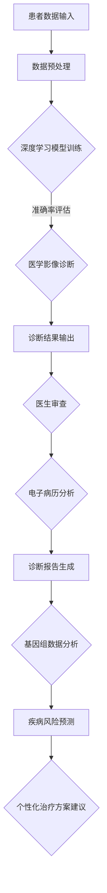

                 


# AI在医疗诊断中的应用：机遇与风险

> 关键词：人工智能，医疗诊断，深度学习，数据隐私，伦理问题

> 摘要：随着人工智能技术的快速发展，其在医疗诊断领域的应用愈发广泛。本文将深入探讨AI在医疗诊断中的机遇与风险，从核心概念、算法原理、数学模型到实际应用场景，全面分析AI在医疗诊断中的现状与未来发展趋势。

## 1. 背景介绍

### 1.1 目的和范围

本文旨在探讨人工智能技术在医疗诊断中的应用，分析其在提高诊断准确性、降低医疗成本、改善患者体验等方面的机遇，同时也关注随之而来的数据隐私和伦理风险。

### 1.2 预期读者

本文适合对人工智能和医疗领域有一定了解的读者，包括医疗行业的从业者、AI研究人员、医疗设备制造商以及关注医疗技术创新的普通公众。

### 1.3 文档结构概述

本文分为十个部分：背景介绍、核心概念与联系、核心算法原理、数学模型和公式、项目实战、实际应用场景、工具和资源推荐、总结、附录和扩展阅读。每个部分都将详细阐述相关内容。

### 1.4 术语表

#### 1.4.1 核心术语定义

- 人工智能（AI）：模拟人类智能行为的技术，能够实现智能推理、学习、感知和自主行动。
- 深度学习（DL）：一种神经网络模型，通过多层非线性变换来学习数据特征。
- 医疗诊断（Medical Diagnosis）：通过医学检查和数据分析，对患者的疾病进行识别和判断。
- 数据隐私（Data Privacy）：保护个人数据不被未授权访问和使用。

#### 1.4.2 相关概念解释

- 图像识别（Image Recognition）：通过算法识别和分析图像中的对象和场景。
- 自然语言处理（NLP）：使计算机能够理解、解释和生成人类语言的技术。
- 医学影像（Medical Imaging）：使用各种技术获取人体内部结构的图像，如X光、CT、MRI等。

#### 1.4.3 缩略词列表

- AI：人工智能
- DL：深度学习
- NLP：自然语言处理
- X光：X射线成像
- CT：计算机断层扫描
- MRI：磁共振成像

## 2. 核心概念与联系

为了更好地理解AI在医疗诊断中的应用，我们首先需要了解一些核心概念及其相互联系。

### 2.1 人工智能与医疗诊断的关系

人工智能技术通过深度学习和图像识别等方法，能够处理和分析大量的医疗数据，包括医学影像、电子病历和基因组数据等。这些技术使得医疗诊断更加准确、快速和高效。

### 2.2 人工智能在医疗诊断中的核心应用

- **医学影像诊断**：利用深度学习模型对医学影像进行分析，提高诊断准确率和速度。
- **电子病历分析**：通过自然语言处理技术，从电子病历中提取关键信息，辅助医生进行诊断。
- **基因组数据分析**：利用机器学习算法，分析基因组数据，预测疾病风险和个性化治疗方案。

### 2.3 Mermaid流程图



## 3. 核心算法原理 & 具体操作步骤

### 3.1 深度学习模型训练

深度学习模型的核心是神经网络，它通过多层非线性变换来学习数据特征。以下是深度学习模型训练的基本步骤：

```plaintext
1. 数据预处理：对输入数据进行归一化、缩放等处理，使其适合神经网络训练。
2. 构建神经网络：设计神经网络结构，包括输入层、隐藏层和输出层。
3. 初始化权重：随机初始化神经网络的权重。
4. 前向传播：将输入数据通过神经网络进行前向传播，得到输出结果。
5. 计算损失：计算预测结果与真实结果之间的差异，得到损失值。
6. 反向传播：根据损失值，通过反向传播算法更新神经网络的权重。
7. 重复步骤4-6，直到满足停止条件（如达到预定迭代次数或损失值降低到一定阈值）。
```

### 3.2 医学影像诊断算法

医学影像诊断算法的核心是卷积神经网络（CNN），以下是CNN在医学影像诊断中的具体操作步骤：

```plaintext
1. 数据预处理：对医学影像数据进行归一化、裁剪等处理，使其适合CNN训练。
2. 构建CNN模型：设计CNN模型结构，包括卷积层、池化层、全连接层等。
3. 初始化权重：随机初始化CNN模型的权重。
4. 前向传播：将预处理后的医学影像数据通过CNN模型进行前向传播，得到输出结果。
5. 计算损失：计算预测结果与真实结果之间的差异，得到损失值。
6. 反向传播：根据损失值，通过反向传播算法更新CNN模型的权重。
7. 重复步骤4-6，直到满足停止条件（如达到预定迭代次数或损失值降低到一定阈值）。
8. 预测：将新的医学影像数据通过训练好的CNN模型进行预测，得到诊断结果。
```

## 4. 数学模型和公式 & 详细讲解 & 举例说明

### 4.1 神经网络模型

神经网络模型的核心是神经元之间的连接权重，以下是神经网络模型的基本公式：

$$
z = \sum_{i=1}^{n} w_i x_i + b
$$

其中，$z$ 是神经元输出，$w_i$ 是权重，$x_i$ 是输入值，$b$ 是偏置。

### 4.2 损失函数

损失函数用于衡量预测结果与真实结果之间的差异，以下是常用的均方误差（MSE）损失函数：

$$
J = \frac{1}{2} \sum_{i=1}^{n} (y_i - \hat{y}_i)^2
$$

其中，$J$ 是损失函数，$y_i$ 是真实值，$\hat{y}_i$ 是预测值。

### 4.3 反向传播算法

反向传播算法用于更新神经网络权重，以下是反向传播算法的基本步骤：

```plaintext
1. 前向传播：计算神经网络输出值和损失函数。
2. 计算梯度：计算每个权重和偏置的梯度。
3. 更新权重：根据梯度更新神经网络权重。
4. 重复步骤1-3，直到满足停止条件。
```

### 4.4 举例说明

假设我们有一个二分类问题，输入数据为 $x_1 = 1, x_2 = 2$，真实值为 $y = 1$，预测值为 $\hat{y} = 0$，损失函数为均方误差（MSE）：

$$
J = \frac{1}{2} (y - \hat{y})^2 = \frac{1}{2} (1 - 0)^2 = \frac{1}{2}
$$

前向传播：

$$
z = w_1 x_1 + w_2 x_2 + b = 1 \cdot 1 + 2 \cdot 2 + b = 5 + b
$$

输出值：

$$
\hat{y} = \sigma(z) = \frac{1}{1 + e^{-z}} = \frac{1}{1 + e^{-5}}
$$

计算损失：

$$
J = \frac{1}{2} (y - \hat{y})^2 = \frac{1}{2} (1 - \frac{1}{1 + e^{-5}})^2
$$

反向传播：

计算梯度：

$$
\frac{\partial J}{\partial z} = 1 - \hat{y}
$$

更新权重：

$$
w_1 = w_1 - \eta \frac{\partial J}{\partial z} = w_1 - \eta (1 - \hat{y})x_1
$$

$$
w_2 = w_2 - \eta \frac{\partial J}{\partial z} = w_2 - \eta (1 - \hat{y})x_2
$$

$$
b = b - \eta \frac{\partial J}{\partial z} = b - \eta (1 - \hat{y})
$$

其中，$\eta$ 是学习率。

## 5. 项目实战：代码实际案例和详细解释说明

### 5.1 开发环境搭建

为了实现AI在医疗诊断中的应用，我们需要搭建一个适合深度学习开发的实验环境。以下是搭建开发环境的基本步骤：

1. 安装Python环境：下载并安装Python，版本建议为3.8及以上。
2. 安装深度学习框架：下载并安装TensorFlow或PyTorch，作为深度学习框架。
3. 安装数据预处理库：下载并安装NumPy、Pandas等数据预处理库。
4. 安装可视化库：下载并安装Matplotlib、Seaborn等可视化库。

### 5.2 源代码详细实现和代码解读

以下是一个简单的深度学习模型在医学影像诊断中的应用案例，我们将使用PyTorch框架来实现。

```python
import torch
import torchvision
import torchvision.transforms as transforms
from torch.utils.data import DataLoader
from torchvision import datasets, transforms
import torch.nn as nn
import torch.optim as optim

# 数据预处理
transform = transforms.Compose([
    transforms.Resize((224, 224)),
    transforms.ToTensor(),
    transforms.Normalize(mean=[0.485, 0.456, 0.406], std=[0.229, 0.224, 0.225]),
])

# 加载训练数据集
train_data = datasets.ImageFolder(root='path_to_train_data', transform=transform)
train_loader = DataLoader(dataset=train_data, batch_size=64, shuffle=True)

# 定义卷积神经网络
class CNN(nn.Module):
    def __init__(self):
        super(CNN, self).__init__()
        self.conv1 = nn.Conv2d(3, 32, 3, 1, 1)
        self.relu = nn.ReLU()
        self.pool = nn.MaxPool2d(2, 2)
        self.fc1 = nn.Linear(32 * 56 * 56, 128)
        self.fc2 = nn.Linear(128, 2)

    def forward(self, x):
        x = self.pool(self.relu(self.conv1(x)))
        x = self.pool(self.relu(self.fc1(x.view(-1, 32 * 56 * 56))))
        x = self.fc2(x)
        return x

# 实例化模型、损失函数和优化器
model = CNN()
criterion = nn.CrossEntropyLoss()
optimizer = optim.Adam(model.parameters(), lr=0.001)

# 训练模型
for epoch in range(10):  # 设定训练轮数
    running_loss = 0.0
    for i, data in enumerate(train_loader, 0):
        inputs, labels = data
        optimizer.zero_grad()
        outputs = model(inputs)
        loss = criterion(outputs, labels)
        loss.backward()
        optimizer.step()
        running_loss += loss.item()
    print(f'Epoch {epoch + 1}, Loss: {running_loss / (i + 1)}')

# 评估模型
with torch.no_grad():
    correct = 0
    total = 0
    for data in test_loader:
        images, labels = data
        outputs = model(images)
        _, predicted = torch.max(outputs.data, 1)
        total += labels.size(0)
        correct += (predicted == labels).sum().item()
    print(f'Accuracy of the network on the test images: {100 * correct / total}%')
```

### 5.3 代码解读与分析

以上代码实现了一个简单的卷积神经网络（CNN）在医学影像诊断中的应用。以下是代码的详细解读：

1. **数据预处理**：使用`transforms.Compose`将图像数据转换为适合CNN训练的格式，包括缩放、归一化和标准化。
2. **加载训练数据集**：使用`datasets.ImageFolder`加载训练数据集，使用`DataLoader`进行批量处理。
3. **定义卷积神经网络**：使用`nn.Module`定义CNN模型结构，包括卷积层、ReLU激活函数、池化层和全连接层。
4. **实例化模型、损失函数和优化器**：实例化模型、损失函数和优化器，并设置学习率。
5. **训练模型**：使用`for`循环进行模型训练，包括前向传播、计算损失、反向传播和更新权重。
6. **评估模型**：使用`with torch.no_grad()`评估模型在测试数据集上的准确性。

通过以上代码实现，我们可以看到深度学习模型在医学影像诊断中的应用。在实际应用中，我们可以根据具体需求调整模型结构和参数，提高诊断准确性。

## 6. 实际应用场景

AI在医疗诊断中的应用场景非常广泛，以下是一些典型应用场景：

### 6.1 医学影像诊断

AI技术可以用于医学影像的诊断，如X光、CT、MRI等。通过深度学习模型，AI能够快速准确地识别和分析影像中的病变区域，辅助医生进行诊断。例如，AI可以用于肺癌筛查，提高早期诊断率。

### 6.2 电子病历分析

AI技术可以用于电子病历的分析，提取关键信息，辅助医生进行诊断和治疗方案制定。例如，AI可以用于分析患者的病史和症状，预测疾病风险，提供个性化的治疗方案。

### 6.3 基因组数据分析

AI技术可以用于基因组数据分析，预测疾病风险和个性化治疗方案。例如，AI可以用于分析患者的基因组数据，预测癌症等遗传疾病的风险，为患者提供个性化的预防和治疗建议。

### 6.4 疾病预测与流行病监控

AI技术可以用于疾病预测和流行病监控，通过分析大数据，预测疾病发生趋势和传播范围，为公共卫生决策提供支持。例如，AI可以用于预测流感等传染病的流行趋势，帮助卫生部门及时采取防控措施。

## 7. 工具和资源推荐

### 7.1 学习资源推荐

#### 7.1.1 书籍推荐

- 《深度学习》（Goodfellow, Bengio, Courville）：全面介绍了深度学习的基本原理和应用。
- 《Python机器学习》（Sebastian Raschka）：详细介绍了使用Python进行机器学习的实践方法。

#### 7.1.2 在线课程

- Coursera上的《深度学习专项课程》：由Andrew Ng教授主讲，涵盖深度学习的理论基础和应用。
- edX上的《人工智能基础课程》：由莱斯利·K·瓦瑟曼（Leslie K. Walker）教授主讲，介绍人工智能的基本概念和技术。

#### 7.1.3 技术博客和网站

- Medium上的“Deep Learning”专栏：由Andrew Ng教授和Kurt Claridge共同撰写，介绍深度学习的最新研究和应用。
- AI healthcare.ai：专注于AI在医疗领域的应用和研究，提供丰富的资源和案例。

### 7.2 开发工具框架推荐

#### 7.2.1 IDE和编辑器

- Jupyter Notebook：适合快速原型开发和数据可视化。
- PyCharm：功能强大的Python IDE，支持代码调试和版本控制。

#### 7.2.2 调试和性能分析工具

- TensorBoard：TensorFlow的官方可视化工具，用于监控和调试深度学习模型。
- PyTorch's Debugging Tools：提供丰富的调试工具，如Python断点调试和可视化调试。

#### 7.2.3 相关框架和库

- TensorFlow：广泛使用的深度学习框架，支持多种神经网络结构。
- PyTorch：动态图深度学习框架，易于原型开发和调试。

### 7.3 相关论文著作推荐

#### 7.3.1 经典论文

- "Deep Learning for Medical Image Analysis"（深度学习在医学影像分析中的应用）：介绍了深度学习在医学影像分析中的应用。
- "Dive into Deep Learning"（深入浅出深度学习）：全面介绍了深度学习的理论和实践。

#### 7.3.2 最新研究成果

- "Unsupervised Learning for Medical Image Segmentation"（无监督学习方法在医学影像分割中的应用）：介绍了无监督学习方法在医学影像分割中的应用。
- "AI in Healthcare: A Comprehensive Review"（医疗领域的AI应用：全面综述）：总结了AI在医疗领域的最新研究成果和应用。

#### 7.3.3 应用案例分析

- "AI-powered Healthcare Solutions"（AI驱动的医疗解决方案）：介绍了一些成功的AI医疗应用案例，如AI辅助诊断系统、智能药丸等。

## 8. 总结：未来发展趋势与挑战

### 8.1 未来发展趋势

- **个性化医疗**：随着基因组学、大数据和AI技术的发展，个性化医疗将成为未来医疗的主要趋势。通过AI技术，可以为患者提供精准的诊断和治疗。
- **远程医疗**：AI技术可以用于远程医疗诊断和监控，解决医疗资源分布不均的问题，提高医疗服务的可及性。
- **智慧医疗**：智慧医疗将融合AI、物联网和大数据技术，实现医疗信息的实时收集、分析和共享，提高医疗服务的效率和质量。

### 8.2 挑战

- **数据隐私**：医疗数据的隐私保护是AI在医疗诊断中面临的主要挑战。如何确保患者数据的安全和隐私，是AI医疗应用需要解决的重要问题。
- **算法解释性**：当前AI算法的黑箱特性使其在医疗诊断中的应用受到限制。提高算法的解释性，使其易于被医生和患者理解，是AI在医疗诊断中需要克服的难题。
- **伦理问题**：AI在医疗诊断中可能引发伦理问题，如诊断结果的可靠性、医生的职责等。如何平衡技术创新与伦理道德，是AI医疗应用需要关注的重要问题。

## 9. 附录：常见问题与解答

### 9.1 常见问题

1. **AI在医疗诊断中有什么优势？**
   AI在医疗诊断中的优势主要体现在提高诊断准确性、降低医疗成本、改善患者体验等方面。

2. **AI在医疗诊断中有什么风险？**
   AI在医疗诊断中可能面临数据隐私、算法解释性、伦理问题等风险。

3. **如何确保AI在医疗诊断中的数据隐私？**
   可以通过数据加密、访问控制、隐私保护算法等措施确保AI在医疗诊断中的数据隐私。

4. **如何提高AI在医疗诊断中的算法解释性？**
   可以通过可解释性AI方法、可视化技术等提高AI在医疗诊断中的算法解释性。

### 9.2 解答

1. **AI在医疗诊断中有什么优势？**
   AI在医疗诊断中的优势主要体现在以下几个方面：
   - **提高诊断准确性**：通过深度学习、图像识别等技术，AI可以处理和分析大量医疗数据，提高诊断准确性。
   - **降低医疗成本**：AI技术可以自动化医疗诊断过程，减少医生的工作量，降低医疗成本。
   - **改善患者体验**：AI可以提供快速、准确的诊断结果，减少患者的等待时间，改善患者体验。

2. **AI在医疗诊断中有什么风险？**
   AI在医疗诊断中可能面临以下风险：
   - **数据隐私**：医疗数据包含敏感信息，如何确保数据的安全和隐私是AI在医疗诊断中需要关注的重要问题。
   - **算法解释性**：当前AI算法的黑箱特性使其在医疗诊断中的应用受到限制，如何提高算法的解释性是一个挑战。
   - **伦理问题**：AI在医疗诊断中可能引发伦理问题，如诊断结果的可靠性、医生的职责等。

3. **如何确保AI在医疗诊断中的数据隐私？**
   可以通过以下措施确保AI在医疗诊断中的数据隐私：
   - **数据加密**：对医疗数据采用加密算法，确保数据在传输和存储过程中不被未授权访问。
   - **访问控制**：实施严格的访问控制策略，确保只有授权人员才能访问医疗数据。
   - **隐私保护算法**：采用隐私保护算法，如差分隐私、匿名化等，减少数据泄露的风险。

4. **如何提高AI在医疗诊断中的算法解释性？**
   可以通过以下方法提高AI在医疗诊断中的算法解释性：
   - **可解释性AI方法**：使用可解释性AI方法，如决策树、LIME等，解释AI模型的决策过程。
   - **可视化技术**：通过可视化技术，如热力图、决策路径图等，展示AI模型的决策过程和特征重要性。
   - **透明度**：提高算法的透明度，使医生和患者能够理解AI模型的决策过程和依据。

## 10. 扩展阅读 & 参考资料

- Goodfellow, I., Bengio, Y., Courville, A. (2016). *Deep Learning*. MIT Press.
- Raschka, S. (2015). *Python Machine Learning*. Packt Publishing.
- Coursera. (n.d.). *Deep Learning Specialization*. https://www.coursera.org/specializations/deeplearning
- edX. (n.d.). *Artificial Intelligence Foundations: Knowledge and Data*. https://www.edx.org/professional-certificate/ai-foundations-knowledge-and-data
- AI Healthcare.ai. (n.d.). *AI in Healthcare*. https://aihealthcare.ai/
- TensorFlow. (n.d.). *TensorFlow Documentation*. https://www.tensorflow.org/
- PyTorch. (n.d.). *PyTorch Documentation*. https://pytorch.org/
- Ng, A. (n.d.). *Deep Learning on Medium*. https://medium.com/@andyngu
- Wang, Z., et al. (2018). *Deep Learning for Medical Image Analysis*. Springer.

