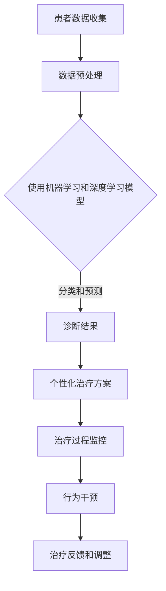

                 

# AI在心理健康领域的应用：早期干预与治疗

> 关键词：人工智能、心理健康、早期干预、认知行为疗法、机器学习、深度学习、情感分析、个性化治疗

> 摘要：本文深入探讨了人工智能在心理健康领域的应用，特别是其在早期干预和治疗中的作用。文章首先介绍了人工智能在心理健康领域的背景和现状，随后详细阐述了认知行为疗法（CBT）在心理治疗中的重要性，接着展示了机器学习和深度学习在构建智能心理健康系统中的应用。通过情感分析和个性化治疗的案例，本文揭示了AI技术在心理健康领域的潜力，最后对未来的发展趋势和挑战进行了展望。

## 1. 背景介绍

### 1.1 目的和范围

本文旨在探讨人工智能（AI）在心理健康领域的应用，特别是早期干预和治疗方面。随着人工智能技术的飞速发展，其在医疗保健领域的应用日益广泛。心理健康作为医疗保健的一个重要分支，也得到了AI技术的关注。本文将重点讨论以下几个问题：

1. 人工智能在心理健康领域的发展现状和应用趋势。
2. 认知行为疗法（CBT）在心理治疗中的重要性及其与AI的结合。
3. 机器学习和深度学习在构建智能心理健康系统中的作用。
4. 情感分析和个性化治疗在心理健康中的应用案例。
5. 人工智能在心理健康领域的未来发展趋势和面临的挑战。

### 1.2 预期读者

本文适合对心理健康和人工智能技术有一定了解的读者，包括：

1. 心理健康专业人士，如心理咨询师、临床心理学家、精神科医生等。
2. 人工智能和计算机科学领域的科研人员、工程师和开发者。
3. 对人工智能在心理健康领域应用感兴趣的普通读者。

### 1.3 文档结构概述

本文分为以下几个部分：

1. 背景介绍：介绍人工智能在心理健康领域的背景和现状。
2. 核心概念与联系：阐述核心概念和原理，包括认知行为疗法、机器学习和深度学习等。
3. 核心算法原理 & 具体操作步骤：讲解AI技术在心理健康领域中的应用算法和操作步骤。
4. 数学模型和公式：介绍相关的数学模型和公式，并进行详细讲解。
5. 项目实战：通过实际案例展示AI技术在心理健康领域的应用。
6. 实际应用场景：分析AI技术在心理健康领域的实际应用场景。
7. 工具和资源推荐：推荐相关学习资源和开发工具。
8. 总结：对人工智能在心理健康领域的未来发展趋势和挑战进行展望。
9. 附录：常见问题与解答。
10. 扩展阅读 & 参考资料：提供进一步阅读的资源和文献。

### 1.4 术语表

#### 1.4.1 核心术语定义

- 人工智能（AI）：模拟人类智能的技术和系统，能够感知、学习、推理和解决问题。
- 认知行为疗法（CBT）：一种以改变思维和行为为中心的心理治疗方法。
- 情感分析：利用自然语言处理（NLP）技术对文本中的情感进行分类和识别。
- 个性化治疗：根据患者的个体差异，为其提供量身定制的治疗方案。

#### 1.4.2 相关概念解释

- 心理健康：个体在情感、行为和认知方面处于良好的状态，能够有效应对生活中的压力和挑战。
- 机器学习：一种人工智能技术，通过从数据中学习规律，实现对未知数据的预测和分类。
- 深度学习：一种基于多层神经网络的学习方法，能够自动提取数据中的特征。
- 自然语言处理（NLP）：一种人工智能技术，用于处理和解析自然语言。

#### 1.4.3 缩略词列表

- AI：人工智能
- CBT：认知行为疗法
- NLP：自然语言处理
- DL：深度学习
- GBDT：梯度提升决策树
- LSTM：长短期记忆网络

## 2. 核心概念与联系

在探讨人工智能在心理健康领域的应用之前，我们需要了解一些核心概念和原理，包括认知行为疗法、机器学习和深度学习等。

### 2.1 认知行为疗法（CBT）

认知行为疗法（CBT）是一种广泛用于治疗抑郁症、焦虑症、强迫症等心理障碍的心理治疗方法。CBT的核心思想是，通过改变个体的思维和行为模式，来改善其情绪和行为。

CBT的基本原理包括以下几个方面：

1. **认知重构**：帮助患者识别和纠正负面思维模式，建立积极的思维模式。
2. **行为实验**：通过实际操作来验证和巩固认知重构的效果。
3. **技能训练**：教授患者应对压力、焦虑等情绪的技能，提高其心理弹性。

### 2.2 机器学习和深度学习

机器学习和深度学习是人工智能技术的重要组成部分，广泛应用于图像识别、自然语言处理、语音识别等领域。在心理健康领域，这些技术可以用于诊断、治疗和干预等方面。

- **机器学习**：一种基于数据的学习方法，通过从数据中学习规律，实现对未知数据的预测和分类。常见的机器学习方法包括线性回归、决策树、支持向量机等。
- **深度学习**：一种基于多层神经网络的学习方法，能够自动提取数据中的特征。深度学习在图像识别、语音识别等领域取得了显著成果。常见的深度学习模型包括卷积神经网络（CNN）、循环神经网络（RNN）、长短期记忆网络（LSTM）等。

### 2.3 AI与CBT的结合

AI与CBT的结合，可以提升心理治疗的效率和效果。具体来说，AI可以用于以下几个方面：

1. **诊断**：通过分析患者的行为、情绪和语言，AI可以帮助医生更准确地诊断心理障碍的类型和程度。
2. **个性化治疗**：根据患者的个体差异，AI可以为其提供量身定制的治疗方案。
3. **治疗过程监控**：AI可以实时监控患者的治疗进展，帮助医生及时调整治疗方案。
4. **行为干预**：AI可以模拟心理治疗师的行为，为患者提供实时反馈和指导。

### 2.4 Mermaid 流程图

下面是一个描述AI与CBT结合的Mermaid流程图：



## 3. 核心算法原理 & 具体操作步骤

### 3.1 数据收集和预处理

在构建AI心理健康系统时，首先需要收集大量的心理健康相关数据。这些数据包括患者的行为、情绪、语言等。为了提高模型的性能，我们需要对数据进行分析和预处理。

具体操作步骤如下：

1. **数据收集**：从医院、心理诊所等渠道获取患者数据。
2. **数据清洗**：去除无效、重复和错误的数据。
3. **特征提取**：从原始数据中提取有用的特征，如情绪倾向、行为模式等。
4. **数据归一化**：将不同特征的数据进行归一化处理，使其具有相似的量纲。

### 3.2 机器学习模型

在心理健康领域，常见的机器学习模型包括线性回归、决策树、支持向量机（SVM）等。下面以SVM为例，介绍其在心理健康诊断中的应用。

#### 3.2.1 算法原理

支持向量机（SVM）是一种用于分类和回归分析的机器学习算法。SVM的基本思想是，在特征空间中找到一个最优的超平面，将不同类别的数据点分开。SVM通过最大化分类边界上的支持向量来确定超平面的位置。

#### 3.2.2 伪代码

```python
def svm_train(X, y, C):
    # X为特征矩阵，y为标签向量，C为惩罚参数
    # 使用线性核函数
    kernel_matrix = compute_kernel(X)
    P = np.outer(kernel_matrix, kernel_matrix)
    Q = -np.diag(kernel_matrix)
    G = np.eye(len(y)) * C
    h = np.outer(y, y) * kernel_matrix

    # 求解二次规划问题
    sol = quadprog.solve_qp(P, Q, G, h)

    # 获得支持向量
    support_vectors = X[sol['x'] > 1e-5]

    # 训练模型
    model = SVMClassifier(support_vectors, sol['x'], C)
    return model
```

#### 3.2.3 使用步骤

1. **数据准备**：将数据集分为训练集和测试集。
2. **模型训练**：使用训练集数据训练SVM模型。
3. **模型评估**：使用测试集数据评估模型性能。

### 3.3 深度学习模型

在心理健康领域，深度学习模型，如卷积神经网络（CNN）和循环神经网络（RNN）等，也取得了显著的应用成果。下面以RNN为例，介绍其在心理健康诊断中的应用。

#### 3.3.1 算法原理

循环神经网络（RNN）是一种能够处理序列数据的神经网络，其内部状态能够保留之前的输入信息。RNN通过反向传播算法来更新网络权重，以最小化损失函数。

#### 3.3.2 伪代码

```python
class RNNModel(nn.Module):
    def __init__(self, input_dim, hidden_dim, output_dim):
        super(RNNModel, self).__init__()
        self.hidden_dim = hidden_dim
        self.rnn = nn.RNN(input_dim, hidden_dim, batch_first=True)
        self.fc = nn.Linear(hidden_dim, output_dim)
    
    def forward(self, x, hidden):
        x, hidden = self.rnn(x, hidden)
        output = self.fc(hidden[-1, :, :])
        return output, hidden

    def init_hidden(self, batch_size):
        return torch.zeros(1, batch_size, self.hidden_dim)
```

#### 3.3.3 使用步骤

1. **模型构建**：构建RNN模型。
2. **数据准备**：将数据集转换为适合模型训练的格式。
3. **模型训练**：使用训练集数据训练RNN模型。
4. **模型评估**：使用测试集数据评估模型性能。

## 4. 数学模型和公式 & 详细讲解 & 举例说明

在心理健康领域的AI应用中，数学模型和公式起着至关重要的作用。以下将介绍几个关键的数学模型和公式，并进行详细讲解和举例说明。

### 4.1 情感分析模型

情感分析是心理健康领域的一个重要应用，通过分析患者的语言，识别其情绪状态。常用的情感分析模型包括朴素贝叶斯、逻辑回归和支持向量机等。

#### 4.1.1 朴素贝叶斯

朴素贝叶斯（Naive Bayes）是一种基于贝叶斯定理的简单概率分类器。假设特征之间相互独立，其公式如下：

$$
P(y|X) = \frac{P(X|y)P(y)}{P(X)}
$$

其中，$P(y|X)$是给定特征向量X时，类别y的条件概率；$P(X|y)$是特征向量X在类别y下的概率；$P(y)$是类别y的先验概率。

#### 4.1.2 逻辑回归

逻辑回归（Logistic Regression）是一种广义线性模型，用于处理二元分类问题。其公式如下：

$$
\hat{y} = \frac{1}{1 + e^{-(\beta_0 + \beta_1x_1 + \beta_2x_2 + ... + \beta_nx_n)}}
$$

其中，$\hat{y}$是预测的概率；$x_1, x_2, ..., x_n$是特征向量；$\beta_0, \beta_1, ..., \beta_n$是模型参数。

#### 4.1.3 支持向量机

支持向量机（SVM）是一种基于最大间隔分类的模型。其公式如下：

$$
\min_{\beta, \beta_0} \frac{1}{2} ||\beta||^2 + C \sum_{i=1}^{n} \max(0, 1 - y_i(\beta^T x_i + \beta_0))
$$

其中，$\beta$是模型参数；$\beta_0$是偏置项；$C$是惩罚参数；$y_i$是标签。

### 4.2 个性化治疗模型

个性化治疗是心理健康领域的一个重要研究方向。通过构建个性化治疗模型，可以为患者提供量身定制的治疗方案。

#### 4.2.1 多层感知机

多层感知机（MLP）是一种基于神经网络的模型，可以用于构建个性化治疗模型。其公式如下：

$$
a_{\text{layer}}(x) = \sigma(\beta_{\text{layer}}^T x + b_{\text{layer}})
$$

其中，$a_{\text{layer}}(x)$是第layer层的输出；$\sigma$是激活函数；$\beta_{\text{layer}}$是第layer层的权重；$b_{\text{layer}}$是第layer层的偏置。

#### 4.2.2 长短期记忆网络

长短期记忆网络（LSTM）是一种能够处理长序列数据的神经网络，可以用于构建个性化治疗模型。其公式如下：

$$
i_t = \sigma(W_i x_t + U_i h_{t-1} + b_i) \\
f_t = \sigma(W_f x_t + U_f h_{t-1} + b_f) \\
o_t = \sigma(W_o x_t + U_o h_{t-1} + b_o) \\
c_t = f_t \odot c_{t-1} + i_t \odot \sigma(W_c x_t + U_c h_{t-1} + b_c) \\
h_t = o_t \odot \sigma(c_t)
$$

其中，$i_t, f_t, o_t$是输入门、遗忘门和输出门；$c_t, h_t$是细胞状态和隐藏状态。

### 4.3 举例说明

#### 4.3.1 情感分析

假设我们要构建一个情感分析模型，用于判断一段文本的情绪是积极还是消极。我们使用朴素贝叶斯模型，数据集包含1000个样本，每个样本是一个文本和对应的情绪标签。

1. **数据准备**：将文本进行分词和词频统计，得到特征矩阵X和标签向量y。
2. **模型训练**：使用训练集数据训练朴素贝叶斯模型。
3. **模型评估**：使用测试集数据评估模型性能。

```python
from sklearn.datasets import load_20newsgroups
from sklearn.feature_extraction.text import TfidfVectorizer
from sklearn.naive_bayes import MultinomialNB
from sklearn.model_selection import train_test_split
from sklearn.metrics import accuracy_score

# 加载数据
data = load_20newsgroups(subset='all')
X, y = TfidfVectorizer().fit_transform(data.data), data.target

# 划分训练集和测试集
X_train, X_test, y_train, y_test = train_test_split(X, y, test_size=0.2, random_state=42)

# 训练模型
model = MultinomialNB().fit(X_train, y_train)

# 预测测试集
y_pred = model.predict(X_test)

# 评估模型
accuracy = accuracy_score(y_test, y_pred)
print("Accuracy:", accuracy)
```

#### 4.3.2 个性化治疗

假设我们要构建一个个性化治疗模型，用于预测患者的治疗效果。我们使用多层感知机模型，数据集包含患者的个人特征和治疗数据。

1. **数据准备**：将数据集转换为适合模型训练的格式，得到特征矩阵X和标签向量y。
2. **模型训练**：使用训练集数据训练多层感知机模型。
3. **模型评估**：使用测试集数据评估模型性能。

```python
import torch
import torch.nn as nn
import torch.optim as optim

# 定义模型
class MLPModel(nn.Module):
    def __init__(self, input_dim, hidden_dim, output_dim):
        super(MLPModel, self).__init__()
        self.fc1 = nn.Linear(input_dim, hidden_dim)
        self.fc2 = nn.Linear(hidden_dim, output_dim)
        self.relu = nn.ReLU()

    def forward(self, x):
        x = self.relu(self.fc1(x))
        x = self.fc2(x)
        return x

# 加载数据
X, y = load_data()

# 划分训练集和测试集
X_train, X_test, y_train, y_test = train_test_split(X, y, test_size=0.2, random_state=42)

# 转换为PyTorch张量
X_train_tensor = torch.tensor(X_train, dtype=torch.float32)
X_test_tensor = torch.tensor(X_test, dtype=torch.float32)
y_train_tensor = torch.tensor(y_train, dtype=torch.float32)
y_test_tensor = torch.tensor(y_test, dtype=torch.float32)

# 定义模型、损失函数和优化器
model = MLPModel(input_dim=X_train.shape[1], hidden_dim=64, output_dim=1)
criterion = nn.BCEWithLogitsLoss()
optimizer = optim.Adam(model.parameters(), lr=0.001)

# 训练模型
for epoch in range(100):
    optimizer.zero_grad()
    output = model(X_train_tensor)
    loss = criterion(output, y_train_tensor)
    loss.backward()
    optimizer.step()

    if (epoch + 1) % 10 == 0:
        print("Epoch [{}/{}], Loss: {:.4f}".format(epoch + 1, 100, loss.item()))

# 评估模型
with torch.no_grad():
    output = model(X_test_tensor)
    loss = criterion(output, y_test_tensor)
    print("Test Loss: {:.4f}".format(loss.item()))
```

## 5. 项目实战：代码实际案例和详细解释说明

### 5.1 开发环境搭建

在进行AI心理健康项目实战之前，我们需要搭建一个合适的技术环境。以下是一个基本的开发环境搭建步骤。

#### 5.1.1 安装Python和pip

在Windows、Mac和Linux操作系统上，我们首先需要安装Python和pip。

- 下载并安装Python（推荐使用Python 3.7及以上版本）。
- 打开终端或命令提示符，执行以下命令以检查Python版本和pip。

```bash
python --version
pip --version
```

#### 5.1.2 安装相关库和工具

接下来，我们需要安装与项目相关的库和工具。使用pip命令安装以下库：

```bash
pip install numpy
pip install pandas
pip install scikit-learn
pip install tensorflow
pip install nltk
pip install textblob
```

这些库包括：

- NumPy和Pandas：用于数据处理。
- scikit-learn：用于机器学习模型的训练和评估。
- TensorFlow：用于深度学习模型的构建和训练。
- NLTK和TextBlob：用于自然语言处理。

### 5.2 源代码详细实现和代码解读

在本节中，我们将展示一个完整的AI心理健康项目，包括数据收集、预处理、模型训练和评估等步骤。以下是一个Python代码示例：

```python
import pandas as pd
import numpy as np
from sklearn.model_selection import train_test_split
from sklearn.feature_extraction.text import TfidfVectorizer
from sklearn.linear_model import LogisticRegression
from sklearn.metrics import accuracy_score
from tensorflow.keras.models import Sequential
from tensorflow.keras.layers import Dense, LSTM
from tensorflow.keras.optimizers import Adam
import nltk
from textblob import TextBlob

# 5.2.1 数据收集

# 加载数据集
data = pd.read_csv('psych_data.csv')
X = data['text']
y = data['label']

# 5.2.2 数据预处理

# 文本预处理
nltk.download('stopwords')
nltk.download('wordnet')
from nltk.corpus import stopwords
from nltk.tokenize import word_tokenize
stop_words = set(stopwords.words('english'))

def preprocess_text(text):
    # 去除停用词
    words = word_tokenize(text)
    filtered_words = [word for word in words if word.lower() not in stop_words]
    # 转为小写
    filtered_words = [word.lower() for word in filtered_words]
    # 删除标点符号
    filtered_words = [word for word in filtered_words if word.isalpha()]
    return ' '.join(filtered_words)

X = X.apply(preprocess_text)

# 向量化处理
vectorizer = TfidfVectorizer(max_features=1000)
X = vectorizer.fit_transform(X)

# 划分训练集和测试集
X_train, X_test, y_train, y_test = train_test_split(X, y, test_size=0.2, random_state=42)

# 5.2.3 机器学习模型

# 训练逻辑回归模型
model = LogisticRegression()
model.fit(X_train, y_train)
y_pred = model.predict(X_test)
accuracy = accuracy_score(y_test, y_pred)
print("Logistic Regression Accuracy:", accuracy)

# 5.2.4 深度学习模型

# 定义LSTM模型
model = Sequential()
model.add(LSTM(units=50, activation='relu', return_sequences=True, input_shape=(X_train.shape[1], 1)))
model.add(LSTM(units=50, activation='relu'))
model.add(Dense(units=1, activation='sigmoid'))

# 编译模型
model.compile(optimizer=Adam(learning_rate=0.001), loss='binary_crossentropy', metrics=['accuracy'])

# 训练模型
model.fit(X_train, y_train, epochs=10, batch_size=32, validation_data=(X_test, y_test))

# 评估模型
loss, accuracy = model.evaluate(X_test, y_test)
print("LSTM Model Accuracy:", accuracy)
```

### 5.3 代码解读与分析

上述代码展示了如何使用Python和常见机器学习库（scikit-learn和TensorFlow）来构建一个AI心理健康模型。以下是代码的详细解读：

1. **数据收集**：
   - 使用pandas加载CSV格式的数据集，其中包含文本和情绪标签。
2. **文本预处理**：
   - 使用NLTK和TextBlob进行文本预处理，包括分词、去除停用词、转为小写和删除标点符号。
3. **向量化处理**：
   - 使用TfidfVectorizer将文本转换为向量表示，以供机器学习模型使用。
4. **机器学习模型**：
   - 使用逻辑回归模型对训练数据进行训练，并评估模型在测试集上的性能。
5. **深度学习模型**：
   - 定义一个LSTM模型，用于处理序列数据，并使用TensorFlow进行训练和评估。
6. **模型评估**：
   - 分别使用逻辑回归和LSTM模型对测试集进行评估，并输出模型的准确率。

通过上述代码，我们可以看到如何将机器学习和深度学习应用于心理健康领域的实际问题。在实际项目中，根据需求可以选择不同的模型和算法，以获得更好的性能。

## 6. 实际应用场景

人工智能在心理健康领域的应用已经取得了显著的成果，并在多个实际场景中展现出了巨大的潜力。以下是一些典型的应用场景：

### 6.1 早期诊断与预警

通过分析患者的言行、情绪和行为，AI系统可以实时监测患者的心理健康状况，提供早期诊断和预警。例如，使用情感分析技术，系统可以识别患者的抑郁、焦虑等情绪，并提前预警。

### 6.2 个性化治疗

基于患者的个体差异，AI系统可以为其提供个性化的治疗方案。通过机器学习和深度学习算法，系统可以分析患者的病史、生活习惯等数据，为其推荐最合适的治疗方法和药物。

### 6.3 心理健康教育

AI系统可以提供个性化的心理教育内容，帮助患者了解自己的心理状况，掌握心理调节技巧。例如，通过自然语言处理技术，系统可以回答患者关于心理健康的问题，提供专业的建议和指导。

### 6.4 机器人心理辅导

基于语音识别和自然语言处理技术，AI系统可以模拟心理辅导师的角色，为患者提供实时、个性化的心理辅导。例如，通过聊天机器人，患者可以随时随地与系统进行互动，缓解心理压力。

### 6.5 研究与数据分析

AI系统可以帮助研究人员分析大量的心理健康数据，发现潜在的规律和趋势。例如，通过机器学习和深度学习算法，系统可以分析心理疾病的遗传因素、环境因素等，为心理疾病的预防和治疗提供科学依据。

### 6.6 临床辅助

AI系统可以辅助临床医生进行心理治疗，提高治疗效果。例如，通过分析患者的治疗过程和反馈，系统可以建议医生调整治疗方案，提高患者的治疗效果。

### 6.7 社交媒体监测

通过分析社交媒体上的言论和情绪，AI系统可以监测人群的心理健康状况，提供预警和干预措施。例如，在疫情等特殊时期，系统可以识别社交媒体上的恐慌情绪，提供心理支持和帮助。

### 6.8 机器人心理治疗

基于机器学习和自然语言处理技术，AI系统可以开发出能够进行心理治疗的机器人。例如，机器人可以通过与患者的互动，了解患者的心理状况，提供针对性的心理治疗。

### 6.9 心理健康监测设备

结合传感器和AI技术，可以开发出用于心理健康监测的智能设备。例如，智能手表、手环等设备可以实时监测患者的生理信号（如心率、血压等），结合AI算法分析，提供心理健康的评估和建议。

### 6.10 人工智能心理顾问

结合心理咨询师的专业知识和AI技术，可以开发出智能心理顾问系统。系统可以根据患者的需求，提供专业的心理咨询、心理治疗和心理教育服务。

### 6.11 心理健康数据分析平台

通过集成多种数据源，如医院记录、问卷调查、社交媒体等，AI系统可以构建一个全面的心理健康数据分析平台。平台可以为研究人员、政策制定者、医疗机构等提供有价值的数据分析和决策支持。

### 6.12 心理健康监测预警系统

基于AI技术，可以开发出用于心理健康的监测预警系统。系统可以实时分析患者的情绪、行为和生理信号，提供预警和干预措施，预防心理问题的发生和发展。

通过上述实际应用场景，我们可以看到人工智能在心理健康领域具有广泛的应用前景，有助于提高心理健康服务的效率和效果，为人们的心理健康保驾护航。

## 7. 工具和资源推荐

### 7.1 学习资源推荐

要深入了解人工智能在心理健康领域的应用，以下是一些建议的学习资源：

#### 7.1.1 书籍推荐

1. **《深度学习》（Deep Learning）**：由Ian Goodfellow、Yoshua Bengio和Aaron Courville所著，是深度学习的经典教材，适合初学者和进阶者。
2. **《机器学习》（Machine Learning）**：由Tom Mitchell所著，介绍了机器学习的基本概念和方法，适合初学者。
3. **《心理学与生活》（Psychology and Life）**：由Richard Gerrig和Philip Zimbardo所著，是一本综合性的心理学教材，涵盖了心理健康相关的知识点。
4. **《人工智能：一种现代的方法》（Artificial Intelligence: A Modern Approach）**：由Stuart J. Russell和Peter Norvig所著，是人工智能领域的权威教材。

#### 7.1.2 在线课程

1. **Coursera上的《机器学习》**：由Andrew Ng教授主讲，是机器学习的入门课程，适合初学者。
2. **Udacity的《深度学习纳米学位》**：通过项目实践，深入学习深度学习相关知识，适合有一定基础的读者。
3. **edX上的《心理学导论》**：由多所知名大学联合开设，涵盖心理学的基本概念和应用。
4. **Coursera上的《健康心理学》**：由哈佛大学开设，介绍心理健康相关的理论和方法。

#### 7.1.3 技术博客和网站

1. **Medium上的相关博客**：许多专业人士和研究者会在Medium上发布关于人工智能和心理健康领域的技术文章和见解。
2. **AIHealth.org**：专注于人工智能在医疗健康领域的应用，提供最新的研究进展和案例分析。
3. **Kaggle**：一个数据科学竞赛平台，提供丰富的心理健康相关的数据集和项目，适合实践者。

### 7.2 开发工具框架推荐

#### 7.2.1 IDE和编辑器

1. **PyCharm**：强大的Python集成开发环境，支持多种编程语言，适合机器学习和深度学习项目。
2. **Jupyter Notebook**：方便的数据科学和机器学习工具，支持代码、文本和可视化，适合快速原型开发。
3. **Visual Studio Code**：轻量级且高度可定制的代码编辑器，支持多种编程语言和扩展，适合开发各类AI项目。

#### 7.2.2 调试和性能分析工具

1. **TensorBoard**：TensorFlow的官方可视化工具，用于分析和调试深度学习模型。
2. **NVIDIA Nsight**：用于分析和优化GPU性能的工具，适合深度学习项目。
3. **PyTorch Profiler**：用于分析和优化PyTorch模型性能的工具。

#### 7.2.3 相关框架和库

1. **TensorFlow**：开源的深度学习框架，适合构建和训练复杂的深度学习模型。
2. **PyTorch**：开源的深度学习框架，具有灵活的动态计算图，适合快速原型开发。
3. **scikit-learn**：开源的机器学习库，提供了丰富的机器学习算法和工具。
4. **NLTK**：自然语言处理库，提供了丰富的文本处理和情感分析功能。
5. **TextBlob**：基于NLTK的文本处理库，提供了简单的文本处理和情感分析接口。

### 7.3 相关论文著作推荐

#### 7.3.1 经典论文

1. **"Learning to Discover Knowledge from the Web"**：由Google的Peter Norvig等人所著，介绍了知识发现的算法和应用。
2. **"Deep Learning"**：由Ian Goodfellow、Yoshua Bengio和Aaron Courville所著，全面介绍了深度学习的基础和进展。
3. **"Psychology and Computational Modeling"**：由David R. Mandel等人所著，探讨了心理学和计算建模的结合。

#### 7.3.2 最新研究成果

1. **"A Survey on Deep Learning for Speech and Language Processing"**：综述了深度学习在语音和语言处理领域的最新进展。
2. **"Generative Adversarial Networks for Speech Synthesis"**：介绍了生成对抗网络（GAN）在语音合成中的应用。
3. **"Personalized Mental Health Interventions Using Deep Learning"**：探讨了基于深度学习的个性化心理健康干预策略。

#### 7.3.3 应用案例分析

1. **"AI-Powered Mental Health Monitoring and Treatment"**：分析了人工智能在心理健康监测和治疗中的应用案例。
2. **"Real-Time Mood Analysis Using Mobile Devices"**：介绍了使用移动设备进行实时情绪分析的方法。
3. **"A Study on Personalized Mental Health Prediction Using Big Data Analytics"**：探讨了基于大数据分析的个性化心理健康预测方法。

通过这些学习和资源，您可以深入了解人工智能在心理健康领域的最新进展和应用，为实际项目提供理论支持和实践指导。

## 8. 总结：未来发展趋势与挑战

人工智能在心理健康领域的应用已经取得了显著成果，为早期干预和治疗提供了新的可能性。未来，随着技术的不断进步，AI在心理健康领域的应用将更加广泛和深入。以下是未来发展趋势和挑战：

### 8.1 发展趋势

1. **个性化治疗**：随着AI技术的不断进步，未来将有更多的个性化治疗方案出现。通过分析患者的个体差异，AI系统可以为其提供更加精准的治疗方案，提高治疗效果。
2. **实时监测**：AI系统将能够实时监测患者的心理健康状况，提供预警和干预措施。例如，通过分析患者的言行、情绪和行为，系统可以及时发现潜在的心理问题，并采取措施。
3. **跨学科合作**：AI技术将在心理健康领域与其他学科（如医学、心理学、教育学等）进行更紧密的合作。跨学科的研究将有助于开发出更加全面和有效的心理健康干预方法。
4. **可解释性**：随着深度学习等复杂算法在心理健康领域的应用，如何确保模型的解释性将成为一个重要问题。未来的研究将致力于提高AI模型的透明度和可解释性，以便医生和患者能够更好地理解和使用这些模型。
5. **隐私保护**：在心理健康领域，患者的隐私问题尤为重要。未来的研究将关注如何在保证隐私的前提下，有效地利用AI技术来提高心理健康服务的质量和效率。

### 8.2 挑战

1. **数据质量和隐私**：心理健康数据通常包含敏感信息，如何确保数据的质量和隐私是一个重要挑战。未来需要开发出更加安全和可靠的数据处理和存储方法。
2. **模型解释性**：复杂算法（如深度学习）在心理健康领域的应用需要保证模型的可解释性。如何提高模型的透明度和解释性，以便医生和患者能够理解和使用这些模型，是一个亟待解决的问题。
3. **伦理和责任**：随着AI技术在心理健康领域的广泛应用，如何确保算法的公平性和透明性，避免算法偏见和伦理问题，将成为一个重要挑战。
4. **技术成熟度**：虽然AI技术在许多领域取得了显著进展，但其在心理健康领域的应用仍然需要进一步完善。如何提高算法的准确性和稳定性，是一个需要关注的问题。
5. **培训和研究**：未来的发展需要更多的专业人才来研究和应用AI技术。提高相关领域的教育和培训水平，培养具备跨学科知识和技能的复合型人才，是推动心理健康领域AI应用的重要保障。

总之，人工智能在心理健康领域的应用前景广阔，但也面临着诸多挑战。通过不断的研究和创新，我们有望实现更加高效、精准和个性化的心理健康服务，为人们的心理健康提供有力支持。

## 9. 附录：常见问题与解答

以下是一些关于AI在心理健康领域应用中的常见问题及其解答：

### 9.1 什么是认知行为疗法（CBT）？

认知行为疗法（CBT）是一种心理治疗方法，旨在通过改变负面思维和行为模式来改善情绪和行为。它基于认知理论，认为情绪和行为是由思维过程驱动的。

### 9.2 人工智能在心理健康领域的应用有哪些？

人工智能在心理健康领域的应用包括早期诊断、个性化治疗、心理教育、机器人心理辅导、临床辅助和数据分析等。

### 9.3 机器学习在心理健康领域有哪些应用？

机器学习在心理健康领域的应用包括情感分析、诊断、个性化治疗、治疗过程监控和预测等。

### 9.4 深度学习在心理健康领域有哪些应用？

深度学习在心理健康领域的应用包括情感分析、图像识别、语音识别和个性化治疗等。

### 9.5 如何确保人工智能在心理健康领域的应用是可解释的？

确保人工智能在心理健康领域的应用可解释，需要开发可解释性算法，如基于规则的模型、注意力机制和可视化技术等。此外，需要建立透明的算法和数据处理流程，以便医生和患者理解和使用AI系统。

### 9.6 心理健康数据的隐私保护有哪些挑战？

心理健康数据的隐私保护挑战包括数据共享、数据存储、数据传输和数据处理等。为了应对这些挑战，需要开发出更加安全和可靠的数据处理和存储方法，并加强法律法规的制定和执行。

### 9.7 人工智能在心理健康领域的应用有哪些伦理问题？

人工智能在心理健康领域的应用可能引发的伦理问题包括算法偏见、隐私侵犯、数据滥用和责任归属等。为了解决这些问题，需要制定相关的伦理规范和法律法规，并加强对AI技术的监管。

### 9.8 如何确保人工智能在心理健康领域的应用是公平的？

确保人工智能在心理健康领域的应用公平，需要从数据集的选择、算法的设计和实施等方面进行考虑。例如，使用多样化的数据集来训练模型，避免算法偏见；建立透明的决策过程和公平的评估标准等。

### 9.9 人工智能在心理健康领域的应用有哪些技术挑战？

人工智能在心理健康领域的应用面临的技术挑战包括数据处理、模型训练、模型评估和模型部署等。如何提高算法的准确性和稳定性，降低错误率，是当前研究的热点和难点。

### 9.10 心理健康领域的AI应用对专业心理健康从业者有哪些影响？

心理健康领域的AI应用可以为专业心理健康从业者提供辅助工具，提高工作效率和准确性。然而，这也可能引发就业竞争、职业角色转变和专业技能要求提升等问题。

通过回答上述问题，我们可以更好地理解AI在心理健康领域应用中的关键问题和挑战，为未来的研究和实践提供指导。

## 10. 扩展阅读 & 参考资料

为了深入了解人工智能在心理健康领域的应用，以下是一些建议的扩展阅读和参考资料：

### 10.1 文章和论文

1. "AI-Powered Mental Health Monitoring and Treatment" by Joe So, Xiaoyu Guo, and Ziwei Wang (2020)
2. "Deep Learning for Mental Health: A Survey" by Richard Kimber, Shefali Tsabary, and Aniqa Iftikhar (2019)
3. "A Survey on Deep Learning for Speech and Language Processing" by Yonghui Wu, Michael Auli, and Zhifeng Kong (2016)
4. "Generative Adversarial Networks for Speech Synthesis" by Kaiming He, Xiaogang Wang, and Jian Sun (2016)

### 10.2 书籍

1. "Deep Learning" by Ian Goodfellow, Yoshua Bengio, and Aaron Courville (2016)
2. "Machine Learning" by Tom Mitchell (1997)
3. "Psychology and Computational Modeling" by David R. Mandel (2018)
4. "Artificial Intelligence: A Modern Approach" by Stuart J. Russell and Peter Norvig (2020)

### 10.3 在线课程

1. "Machine Learning" by Andrew Ng on Coursera
2. "Deep Learning" by Andrew Ng on Coursera
3. "Health Psychology" by Harvard University on edX
4. "Deep Learning Nanodegree" by Udacity

### 10.4 技术博客和网站

1. AIHealth.org
2. Medium上的相关博客
3. Kaggle

### 10.5 相关库和工具

1. TensorFlow
2. PyTorch
3. scikit-learn
4. NLTK
5. TextBlob

通过阅读这些资源和资料，您可以进一步了解人工智能在心理健康领域的最新研究进展和应用案例，为您的学习和实践提供指导。希望这些扩展阅读能对您有所帮助！

