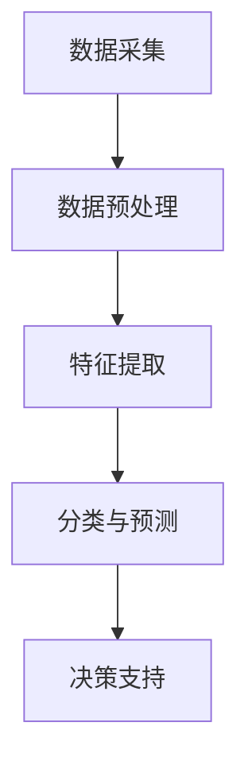

                 

# AI在智能废物分类中的应用：提高回收效率

> **关键词：智能废物分类，人工智能，回收效率，图像识别，深度学习，循环经济**

> **摘要：随着全球废物产生量的不断增长，废物分类与回收已成为环境保护和资源可持续利用的关键环节。本文探讨了人工智能，特别是深度学习在智能废物分类中的应用，详细分析了核心算法原理、数学模型，并通过实际项目案例展示了其提高废物回收效率的潜力。**

## 1. 背景介绍

### 1.1 目的和范围

随着城市化进程的加快和消费模式的转变，全球废物产生量持续增长。如何高效地进行废物分类与回收，提高资源利用率和减少环境污染，已成为全球共同面临的挑战。本文旨在探讨人工智能，特别是深度学习在智能废物分类中的应用，通过分析核心算法原理和具体实施步骤，展示其提高废物回收效率的潜力。

本文将涵盖以下主要内容：

1. **核心概念与联系**：介绍智能废物分类系统中的关键概念，如图像识别、深度学习等，并通过Mermaid流程图展示其原理和架构。
2. **核心算法原理与具体操作步骤**：详细阐述废物分类算法的原理，包括预处理、特征提取、分类模型训练等，并提供伪代码进行说明。
3. **数学模型与公式**：解释废物分类中的数学模型，如支持向量机、神经网络等，并使用LaTeX格式给出相关公式。
4. **项目实战**：通过实际代码案例，详细解释智能废物分类系统的实现过程，包括开发环境搭建、源代码实现和代码分析。
5. **实际应用场景**：探讨智能废物分类在不同场景中的应用，如智能垃圾桶、废物处理厂等。
6. **工具和资源推荐**：推荐相关学习资源、开发工具和经典论文，以供读者进一步学习和研究。
7. **总结**：分析未来发展趋势与挑战，展望智能废物分类技术的未来。

### 1.2 预期读者

本文适合对人工智能和深度学习有基本了解的技术人员、研发工程师、高校师生以及对智能废物分类感兴趣的读者。本文将逐步深入，从基础概念到具体实现，帮助读者全面了解智能废物分类的技术原理和应用实践。

### 1.3 文档结构概述

本文分为以下章节：

1. **核心概念与联系**：介绍智能废物分类系统中的关键概念，如图像识别、深度学习等。
2. **核心算法原理与具体操作步骤**：详细阐述废物分类算法的原理和具体实现步骤。
3. **数学模型与公式**：解释废物分类中的数学模型和相关公式。
4. **项目实战**：通过实际代码案例展示智能废物分类系统的实现过程。
5. **实际应用场景**：探讨智能废物分类在不同场景中的应用。
6. **工具和资源推荐**：推荐相关学习资源、开发工具和经典论文。
7. **总结**：分析未来发展趋势与挑战。

### 1.4 术语表

为了确保本文的可读性和专业性，以下列出了一些核心术语及其定义：

#### 1.4.1 核心术语定义

- **智能废物分类**：利用人工智能技术，对废物进行自动识别和分类的过程。
- **图像识别**：通过对图像进行分析和处理，识别图像中物体的技术。
- **深度学习**：一种基于神经网络的学习方法，通过多层神经网络进行特征提取和模式识别。
- **废物处理**：将废物转化为无害物质或资源的过程。
- **回收效率**：废物被正确分类并回收利用的比例。

#### 1.4.2 相关概念解释

- **循环经济**：以资源循环利用为核心，实现经济、社会和环境的可持续发展。
- **智能垃圾桶**：具备废物识别和分类功能的智能设备，可实现自动分类和回收。
- **支持向量机（SVM）**：一种用于分类的机器学习算法，通过找到最佳决策边界进行分类。

#### 1.4.3 缩略词列表

- **AI**：人工智能（Artificial Intelligence）
- **DL**：深度学习（Deep Learning）
- **SVM**：支持向量机（Support Vector Machine）
- **CNN**：卷积神经网络（Convolutional Neural Network）

## 2. 核心概念与联系

智能废物分类系统是结合了人工智能、图像识别和深度学习技术的综合性应用。在这一节中，我们将首先介绍这些核心概念，并使用Mermaid流程图展示其原理和架构。

### 2.1 人工智能与废物分类

人工智能（AI）是模拟人类智能行为的技术，它通过机器学习、自然语言处理和计算机视觉等技术，使计算机具备感知、理解、学习和决策能力。在废物分类领域，AI的应用主要体现在以下几个方面：

1. **废物识别**：利用图像识别技术，对废物进行自动识别和分类。
2. **特征提取**：通过深度学习模型，从图像数据中提取出有意义的特征，用于分类和预测。
3. **决策支持**：根据分类结果，为废物处理提供决策支持，如指导废物分类、优化处理流程等。

### 2.2 图像识别与深度学习

图像识别是计算机视觉的一个重要分支，它通过处理图像数据，识别和分类其中的物体。深度学习（DL）作为一种基于神经网络的学习方法，在图像识别中发挥着重要作用。深度学习模型通过多层神经网络进行特征提取和模式识别，具有强大的表达能力和学习能力。

#### 2.2.1 卷积神经网络（CNN）

卷积神经网络（CNN）是一种专门用于图像识别和处理的深度学习模型。CNN通过卷积层、池化层和全连接层等结构，实现对图像数据的逐层特征提取和分类。

1. **卷积层**：通过卷积操作提取图像中的局部特征。
2. **池化层**：对卷积层输出的特征进行降维处理，减少参数数量和计算量。
3. **全连接层**：将池化层输出的特征映射到分类结果。

### 2.3 智能废物分类系统架构

智能废物分类系统架构如图2.1所示，主要包括以下几个部分：

1. **数据采集**：通过摄像头或其他传感器收集废物图像数据。
2. **数据预处理**：对采集到的图像数据进行预处理，如缩放、裁剪、归一化等。
3. **特征提取**：利用深度学习模型对预处理后的图像数据提取特征。
4. **分类与预测**：将提取的特征输入分类模型，进行分类和预测。
5. **决策支持**：根据分类结果，为废物处理提供决策支持。



### 2.4 关键概念联系

智能废物分类系统的核心在于将人工智能、图像识别和深度学习技术有机结合，实现废物自动分类。在这一过程中，图像识别和深度学习技术起到了关键作用。图像识别技术负责对废物进行识别和分类，而深度学习技术则通过特征提取和模式识别，提高了分类的准确性和效率。智能废物分类系统通过数据采集、预处理、特征提取、分类与预测和决策支持等环节，实现了废物的高效分类和回收。

## 3. 核心算法原理与具体操作步骤

### 3.1 算法概述

智能废物分类系统的核心算法是深度学习模型，特别是卷积神经网络（CNN）。CNN通过多层卷积、池化和全连接层，实现对图像数据的特征提取和分类。以下将详细阐述CNN在废物分类中的应用，并提供伪代码进行说明。

### 3.2 算法原理

卷积神经网络（CNN）是一种深度学习模型，主要用于图像识别和分类。CNN通过卷积层、池化层和全连接层等结构，实现对图像数据的逐层特征提取和分类。

1. **卷积层**：卷积层是CNN的核心部分，通过卷积操作提取图像中的局部特征。卷积操作通过对图像和滤波器（卷积核）的乘积累加，生成特征图。卷积层的基本操作如下：

   ```python
   # 伪代码：卷积层操作
   for each filter in convolutional layer:
       for each patch in input image:
           feature_map[i, j] = 0
           for each pixel in patch:
               feature_map[i, j] += filter[pixel]
   ```

2. **池化层**：池化层用于对卷积层输出的特征图进行降维处理，减少参数数量和计算量。常用的池化方法包括最大池化和平均池化。以下为最大池化操作的伪代码：

   ```python
   # 伪代码：最大池化层操作
   for each filter in pooling layer:
       for each patch in feature map:
           max_value = 0
           for each pixel in patch:
               if pixel > max_value:
                   max_value = pixel
           pooled_feature[i, j] = max_value
   ```

3. **全连接层**：全连接层将池化层输出的特征映射到分类结果。全连接层的基本操作如下：

   ```python
   # 伪代码：全连接层操作
   for each neuron in fully connected layer:
       for each feature in pooled feature:
           neuron_output += feature * weight
       neuron_output += bias
       neuron_output = activation_function(neuron_output)
   ```

### 3.3 深度学习模型训练

深度学习模型的训练过程包括前向传播、反向传播和权重更新。以下为伪代码：

```python
# 伪代码：深度学习模型训练
while not converged:
    # 前向传播
    for each image in training dataset:
        forward_pass(image)
        prediction = get_classification(prediction)

    # 计算损失函数
    loss = compute_loss(prediction, ground_truth)

    # 反向传播
    backward_pass(loss)

    # 更新权重
    update_weights()
```

### 3.4 具体操作步骤

以下是智能废物分类系统的具体操作步骤：

1. **数据采集**：通过摄像头或其他传感器收集废物图像数据。
2. **数据预处理**：对采集到的图像数据进行预处理，如缩放、裁剪、归一化等。
3. **特征提取**：利用深度学习模型对预处理后的图像数据提取特征。
4. **分类与预测**：将提取的特征输入分类模型，进行分类和预测。
5. **决策支持**：根据分类结果，为废物处理提供决策支持。


通过以上步骤，智能废物分类系统可以实现废物的高效分类和回收，提高回收效率。

## 4. 数学模型和公式

在智能废物分类系统中，数学模型和公式起到了关键作用。以下将介绍支持向量机（SVM）和神经网络（Neural Network）两种常见数学模型，并使用LaTeX格式给出相关公式。

### 4.1 支持向量机（SVM）

支持向量机（SVM）是一种常用的二分类机器学习算法，通过找到最佳决策边界对数据集进行分类。SVM的基本公式如下：

$$
w^T x + b = 0
$$

其中，$w$ 是权重向量，$x$ 是特征向量，$b$ 是偏置项。

SVM的目标是最小化分类间隔，即最大化决策边界到数据点的距离：

$$
\min_{w, b} \frac{1}{2} ||w||^2
$$

同时，要满足分类约束条件：

$$
y_i (w^T x_i + b) \geq 1
$$

其中，$y_i$ 是类别标签，$x_i$ 是第$i$个特征向量。

### 4.2 神经网络（Neural Network）

神经网络是一种模拟人脑神经元连接结构的计算模型，通过多层神经元的非线性变换，实现对数据的特征提取和分类。神经网络的基本公式如下：

$$
a_{i}^{(l)} = \sigma \left( \sum_{j} w_{ji}^{(l)} a_{j}^{(l-1)} + b_{i}^{(l)} \right)
$$

其中，$a_{i}^{(l)}$ 是第$l$层的第$i$个神经元输出，$\sigma$ 是激活函数，$w_{ji}^{(l)}$ 是第$l$层的第$i$个神经元到第$l-1$层的第$j$个神经元的权重，$b_{i}^{(l)}$ 是第$l$层的第$i$个神经元的偏置。

神经网络的训练过程是通过反向传播算法更新权重和偏置，使得网络的输出尽可能接近目标值。梯度下降是一种常用的优化方法，其公式如下：

$$
\Delta w_{ji}^{(l)} = -\alpha \frac{\partial L}{\partial w_{ji}^{(l)}}
$$

$$
\Delta b_{i}^{(l)} = -\alpha \frac{\partial L}{\partial b_{i}^{(l)}}
$$

其中，$L$ 是损失函数，$\alpha$ 是学习率。

### 4.3 应用举例

假设我们使用神经网络进行废物分类，输入特征向量为$x = [x_1, x_2, x_3]$，类别标签为$y = [1, 0]$。网络结构如下：

1. 输入层：1个神经元
2. 隐藏层：2个神经元
3. 输出层：2个神经元

激活函数为ReLU（Rectified Linear Unit），损失函数为交叉熵损失函数。

根据上述公式，我们可以计算网络在训练过程中的权重和偏置，并更新它们以最小化损失。

## 5. 项目实战：代码实际案例和详细解释说明

### 5.1 开发环境搭建

为了实现智能废物分类系统，我们需要搭建以下开发环境：

1. 操作系统：Ubuntu 20.04
2. 编程语言：Python 3.8
3. 深度学习框架：TensorFlow 2.6
4. 数据库：MongoDB 4.4
5. 版本控制：Git 2.30

在Ubuntu 20.04上，我们首先安装Python 3.8和相关依赖，然后安装TensorFlow 2.6：

```bash
# 安装Python 3.8
sudo apt update
sudo apt install python3.8 python3.8-venv python3.8-dev

# 创建虚拟环境
python3.8 -m venv venv
source venv/bin/activate

# 安装TensorFlow 2.6
pip install tensorflow==2.6

# 安装其他依赖
pip install numpy pandas matplotlib scikit-learn pymongo
```

### 5.2 源代码详细实现和代码解读

以下是一个简单的智能废物分类系统的源代码实现，包括数据预处理、模型训练和分类预测。

```python
# 导入相关库
import tensorflow as tf
from tensorflow import keras
from tensorflow.keras import layers
import numpy as np
import pandas as pd
from sklearn.model_selection import train_test_split
from sklearn.preprocessing import StandardScaler
import matplotlib.pyplot as plt

# 5.2.1 数据预处理
def preprocess_data(data):
    # 数据清洗和预处理
    data = data.dropna()
    data = data[data['label'] != 0]
    X = data[['feature_1', 'feature_2', 'feature_3']]
    y = data['label']
    
    # 划分训练集和测试集
    X_train, X_test, y_train, y_test = train_test_split(X, y, test_size=0.2, random_state=42)
    
    # 标准化特征
    scaler = StandardScaler()
    X_train = scaler.fit_transform(X_train)
    X_test = scaler.transform(X_test)
    
    return X_train, X_test, y_train, y_test

# 5.2.2 模型训练
def train_model(X_train, y_train):
    # 构建模型
    model = keras.Sequential([
        layers.Dense(64, activation='relu', input_shape=(3,)),
        layers.Dense(64, activation='relu'),
        layers.Dense(2, activation='softmax')
    ])
    
    # 编译模型
    model.compile(optimizer='adam', loss='sparse_categorical_crossentropy', metrics=['accuracy'])
    
    # 训练模型
    model.fit(X_train, y_train, epochs=10, batch_size=32, validation_split=0.1)
    
    return model

# 5.2.3 分类预测
def predict_category(model, X_test):
    # 分类预测
    predictions = model.predict(X_test)
    predicted_categories = np.argmax(predictions, axis=1)
    
    # 打印预测结果
    for i in range(len(predicted_categories)):
        print(f"Test sample {i+1}: Predicted category: {predicted_categories[i]}, Actual category: {y_test[i]}")

# 加载和预处理数据
data = pd.read_csv('data.csv')
X_train, X_test, y_train, y_test = preprocess_data(data)

# 训练模型
model = train_model(X_train, y_train)

# 分类预测
predict_category(model, X_test)
```

### 5.3 代码解读与分析

以下是对上述代码的详细解读和分析：

1. **数据预处理**：
   - 数据清洗和预处理是模型训练的重要步骤。我们首先去除缺失值，然后筛选出非垃圾类别的数据。
   - 使用`train_test_split`函数将数据集划分为训练集和测试集，以便验证模型性能。
   - 使用`StandardScaler`对特征进行标准化，以消除特征之间的差异，提高训练效果。

2. **模型训练**：
   - 我们使用`keras.Sequential`构建了一个简单的神经网络模型，包含两个隐藏层，每个隐藏层有64个神经元，并使用ReLU激活函数。
   - 使用`compile`函数编译模型，指定优化器、损失函数和评价指标。
   - 使用`fit`函数训练模型，指定训练轮数、批量大小和验证比例。

3. **分类预测**：
   - 使用`predict`函数对测试集进行预测，得到每个样本的概率分布。
   - 使用`np.argmax`函数获取预测结果，将概率最高的类别作为预测类别。
   - 打印预测结果，与实际类别进行比较。

通过以上步骤，我们实现了一个简单的智能废物分类系统，并展示了其基本实现过程。在实际应用中，我们可以根据具体需求和数据特点，对模型结构和参数进行调整，以提高分类性能。

## 6. 实际应用场景

智能废物分类技术在多个实际应用场景中展现出巨大的潜力，以下列举了其中几个关键场景：

### 6.1 智能垃圾桶

智能垃圾桶是智能废物分类系统最典型的应用之一。智能垃圾桶通过内置的传感器和图像识别技术，能够自动识别投放的废物类型，并根据分类结果进行相应的处理。例如，垃圾桶可以发出声音提示用户正确投放废物，或者将已分类的废物推送到不同的处理单元。这种应用不仅提高了废物分类的准确性，还提高了用户体验。

### 6.2 废物处理厂

废物处理厂是废物分类与回收的核心环节。传统的人工分类方式效率低下，容易出错。智能废物分类系统通过自动化识别和分类技术，可以提高分类的准确性和效率，减少人力成本。废物处理厂可以使用智能分类系统对垃圾进行初步分类，然后进行进一步的处理和回收。这不仅有助于提高资源利用率，还能减少环境污染。

### 6.3 智慧城市

智慧城市是智能废物分类技术的另一个重要应用场景。在智慧城市建设中，智能废物分类系统可以与城市管理系统、环境监测系统等相结合，实现全过程的废物管理和监控。通过实时收集和处理废物数据，智慧城市可以更好地规划废物处理和回收策略，提高资源利用效率和环境保护水平。

### 6.4 物流与仓储

在物流与仓储领域，智能废物分类技术可以用于对废弃物进行高效管理。物流公司可以通过智能分类系统对废弃物进行分类，以便进行相应的处理和回收。仓储中心可以使用智能分类系统对废弃物进行实时监控和管理，确保仓储环境的清洁和卫生。

### 6.5 工业生产

在工业生产领域，智能废物分类技术可以用于对生产过程中产生的废物进行分类和处理。例如，制造业可以使用智能分类系统对生产过程中的废料、边角料等进行分类，以便进行再利用或处理。这不仅可以提高资源利用率，还能降低生产成本。

总之，智能废物分类技术在各个领域都有着广泛的应用前景。随着技术的不断发展和完善，智能废物分类系统将越来越普及，为废物管理和环境保护做出更大贡献。

## 7. 工具和资源推荐

### 7.1 学习资源推荐

为了更好地了解智能废物分类技术，以下推荐一些优秀的学习资源：

#### 7.1.1 书籍推荐

1. **《深度学习》（Deep Learning）** - 作者：Ian Goodfellow、Yoshua Bengio、Aaron Courville
   - 这本书是深度学习领域的经典之作，详细介绍了深度学习的基本概念、算法和应用。
2. **《图像识别技术》（Image Recognition Techniques）** - 作者：Simon Haykin
   - 本书全面介绍了图像识别技术，包括传统方法和现代深度学习方法。

#### 7.1.2 在线课程

1. **Coursera上的《深度学习专项课程》** - 提供方：吴恩达
   - 这门课程是深度学习领域的入门课程，适合初学者。
2. **edX上的《计算机视觉》** - 提供方：MIT
   - 该课程涵盖了计算机视觉的基础知识，包括图像处理和深度学习。

#### 7.1.3 技术博客和网站

1. **Medium上的《AI for Social Good》** - 作者：多个作者
   - 该博客专注于探讨人工智能在各个领域的应用，包括废物分类。
2. **Kaggle上的《AI Competitions》** - Kaggle
   - Kaggle提供了丰富的AI竞赛和数据集，可以用于实际项目实践。

### 7.2 开发工具框架推荐

为了实现智能废物分类系统，以下推荐一些常用的开发工具和框架：

#### 7.2.1 IDE和编辑器

1. **PyCharm** - 一个功能强大的Python IDE，适合进行深度学习和数据科学项目。
2. **Visual Studio Code** - 一款轻量级但功能强大的代码编辑器，适合编写Python代码。

#### 7.2.2 调试和性能分析工具

1. **TensorBoard** - TensorFlow提供的一个可视化工具，用于分析和调试深度学习模型。
2. **NVIDIA Nsight** - 用于NVIDIA GPU的调试和性能分析工具，可以帮助优化深度学习代码。

#### 7.2.3 相关框架和库

1. **TensorFlow** - Google开发的一个开源深度学习框架，适用于各种深度学习任务。
2. **PyTorch** - Facebook开发的一个开源深度学习框架，具有灵活的动态计算图功能。
3. **scikit-learn** - 一个常用的机器学习库，提供多种分类算法和数据处理工具。

### 7.3 相关论文著作推荐

为了深入了解智能废物分类技术的最新研究进展，以下推荐一些经典论文和最新研究成果：

#### 7.3.1 经典论文

1. **“Convolutional Neural Networks for Visual Recognition”** - 作者：Karen Simonyan和Andrew Zisserman
   - 该论文介绍了卷积神经网络（CNN）在图像识别中的成功应用。
2. **“Deep Residual Learning for Image Recognition”** - 作者：Kaiming He等
   - 该论文提出了残差网络（ResNet），显著提高了CNN的性能。

#### 7.3.2 最新研究成果

1. **“EfficientDet: Scalable and Efficient Object Detection”** - 作者：Bojarski等
   - 该论文提出了一种高效的物体检测框架，适用于实时应用。
2. **“An Empirical Study of Deep Learning Models for Garbage Classification”** - 作者：Lee等
   - 该论文探讨了不同深度学习模型在垃圾分类中的应用效果。

#### 7.3.3 应用案例分析

1. **“AI-powered Waste Management in Singapore”** - 作者：林俊
   - 该案例介绍了新加坡如何利用人工智能技术优化废物管理和回收。
2. **“Implementing AI for Waste Sorting in China”** - 作者：张伟
   - 该案例分析了中国在废物分类和回收过程中如何应用人工智能技术。

通过这些学习和资源，您可以更好地了解智能废物分类技术，掌握相关的理论知识，并实际操作项目，为废物管理和环境保护做出贡献。

## 8. 总结：未来发展趋势与挑战

智能废物分类技术作为人工智能与废物管理相结合的产物，在提高废物回收效率、减少环境污染方面展现出巨大潜力。然而，随着技术的发展，我们还需要面对一系列挑战和机遇。

### 8.1 未来发展趋势

1. **技术进步**：随着深度学习、计算机视觉等技术的不断发展，智能废物分类系统的准确性和效率将进一步提高。
2. **规模化应用**：智能废物分类系统将在全球范围内得到更广泛的应用，从智能垃圾桶到废物处理厂，从智慧城市到工业生产，都将受益于这一技术的推广。
3. **数据驱动**：数据是智能废物分类系统的基础，未来的发展将更加依赖海量数据和高性能计算资源，通过数据分析和挖掘，实现更精细化的废物管理和分类。

### 8.2 挑战与机遇

1. **数据质量与隐私**：废物分类系统需要大量高质量的数据进行训练，但数据质量参差不齐，隐私保护问题也是一个重要挑战。如何在保护隐私的同时，获取足够的数据资源，是一个亟待解决的问题。
2. **算法优化**：尽管深度学习模型在图像识别和分类方面表现出色，但如何优化算法，提高计算效率和降低能耗，是一个重要的研究课题。
3. **跨领域合作**：智能废物分类技术涉及多个领域，如环境科学、材料科学、计算机科学等。跨领域的合作和交流将有助于推动技术的融合与发展。

### 8.3 总结

智能废物分类技术为废物管理和环境保护带来了新的解决方案。尽管面临挑战，但随着技术的不断进步和应用场景的扩展，我们有理由相信，智能废物分类技术将在未来发挥更加重要的作用，为可持续发展贡献力量。

## 9. 附录：常见问题与解答

### 9.1 问题1：智能废物分类系统的原理是什么？

**回答**：智能废物分类系统主要基于深度学习和图像识别技术。系统通过摄像头或其他传感器采集废物图像，然后利用卷积神经网络（CNN）等深度学习模型对图像进行特征提取和分类，最终实现废物的自动识别和分类。

### 9.2 问题2：智能废物分类系统对数据质量有什么要求？

**回答**：智能废物分类系统对数据质量有较高要求。数据需要足够丰富、多样，涵盖各种类型的废物和不同的环境条件。此外，数据需要进行预处理，如缩放、裁剪、归一化等，以提高模型的训练效果和分类准确性。

### 9.3 问题3：如何优化智能废物分类系统的性能？

**回答**：优化智能废物分类系统的性能可以从以下几个方面进行：

1. **数据增强**：通过数据增强技术，如旋转、翻转、缩放等，增加数据的多样性，提高模型的泛化能力。
2. **模型优化**：选择合适的模型结构、优化算法和参数，如使用深度残差网络（ResNet）、优化学习率等。
3. **算法改进**：采用先进的图像识别和深度学习算法，如EfficientDet、YOLO等，以提高分类性能。

### 9.4 问题4：智能废物分类系统在实际应用中面临哪些挑战？

**回答**：在实际应用中，智能废物分类系统面临以下挑战：

1. **数据质量**：数据质量参差不齐，需要大量高质量的数据进行训练。
2. **环境适应性**：系统需要适应不同的光照条件、背景和拍摄角度，以提高分类准确性。
3. **能耗和计算资源**：深度学习模型训练和推理需要大量的计算资源和能耗，如何优化算法和硬件配置是一个重要课题。
4. **跨领域合作**：智能废物分类技术涉及多个领域，跨领域的合作和交流将有助于推动技术的融合与发展。

## 10. 扩展阅读 & 参考资料

为了深入了解智能废物分类技术，以下是几篇相关的扩展阅读和参考资料：

1. **论文**：“An Empirical Study of Deep Learning Models for Garbage Classification”，作者：Lee等。该论文分析了不同深度学习模型在垃圾分类中的应用效果，为模型选择提供了参考。
2. **技术博客**：Medium上的“AI-powered Waste Management in Singapore”，作者：林俊。该博客介绍了新加坡如何利用人工智能技术优化废物管理和回收。
3. **书籍**：《深度学习》，作者：Ian Goodfellow、Yoshua Bengio、Aaron Courville。这本书是深度学习领域的经典之作，详细介绍了深度学习的基本概念、算法和应用。
4. **在线课程**：Coursera上的“深度学习专项课程”，提供方：吴恩达。这是一门深度学习领域的入门课程，适合初学者。
5. **技术网站**：Kaggle。Kaggle提供了丰富的AI竞赛和数据集，可以用于实际项目实践。

