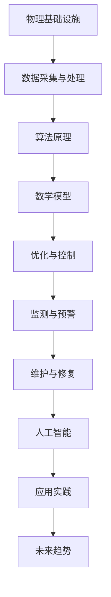

                 

# AI在物理基础设施中的应用

> **关键词：人工智能，物理基础设施，算法原理，数学模型，实际应用，未来趋势**
>
> **摘要：本文将深入探讨人工智能在物理基础设施中的应用，从核心概念、算法原理、数学模型、实际应用案例、未来趋势等方面进行详细分析，以期为相关领域的研究者和从业者提供有价值的参考。**

## 1. 背景介绍

### 1.1 目的和范围

本文旨在探讨人工智能技术在物理基础设施中的应用，重点分析其在优化、监测、维护等关键环节的作用。通过对核心概念、算法原理、数学模型的详细阐述，并结合实际应用案例，旨在为读者提供一个全面、深入的了解。

### 1.2 预期读者

本文适合对人工智能、物理基础设施领域有一定了解的读者，包括研究人员、工程师、学生以及对该领域感兴趣的爱好者。

### 1.3 文档结构概述

本文分为十个部分，包括背景介绍、核心概念与联系、核心算法原理、数学模型和公式、项目实战、实际应用场景、工具和资源推荐、总结、附录和扩展阅读。各部分内容相互联系，共同构成一个完整的研究体系。

### 1.4 术语表

#### 1.4.1 核心术语定义

- **物理基础设施**：指社会生产和生活中不可或缺的、以物质形态存在的基础设施，如公路、桥梁、铁路、机场、水电站等。
- **人工智能**：一种模拟人类智能行为的计算机系统，能够进行学习、推理、感知、决策等。

#### 1.4.2 相关概念解释

- **算法原理**：指解决特定问题的计算步骤和方法。
- **数学模型**：用数学语言描述物理现象或问题的抽象表示。

#### 1.4.3 缩略词列表

- **AI**：人工智能
- **PI**：物理基础设施

## 2. 核心概念与联系

为了更好地理解人工智能在物理基础设施中的应用，我们首先需要明确核心概念和它们之间的联系。以下是一个简单的 Mermaid 流程图，用于展示这些概念之间的关系：



### 2.1 数据采集与处理

物理基础设施的数据采集和处理是人工智能应用的基础。通过传感器、无人机、卫星等手段，我们可以获取大量的基础设施运行数据，如结构应力、温度、湿度等。这些数据经过预处理和特征提取后，为后续的算法原理和数学模型提供了丰富的输入。

### 2.2 算法原理

算法原理是人工智能在物理基础设施中发挥作用的核心。常见的算法包括优化算法、机器学习算法、深度学习算法等。这些算法可以根据基础设施的运行数据和目标，对基础设施的运行状态进行实时分析和预测。

### 2.3 数学模型

数学模型用于描述物理基础设施的运行规律和特性。常见的数学模型包括线性模型、非线性模型、时间序列模型等。这些模型可以帮助我们更好地理解基础设施的运行状态，为优化和控制提供理论依据。

### 2.4 优化与控制

优化与控制是人工智能在物理基础设施中应用的重要方向。通过优化算法，我们可以找到基础设施的最佳运行状态，提高运行效率。通过控制算法，我们可以对基础设施进行实时调整，确保其稳定运行。

### 2.5 监测与预警

监测与预警是保障物理基础设施安全运行的关键。通过实时监测数据，我们可以发现潜在的安全隐患，提前进行预警。通过预警机制，我们可以及时采取措施，防止事故发生。

### 2.6 维护与修复

维护与修复是确保物理基础设施长期运行的关键。通过人工智能技术，我们可以预测基础设施的维护需求，提前进行维护。同时，在基础设施出现故障时，人工智能可以帮助我们快速定位故障原因，进行修复。

### 2.7 人工智能

人工智能是整个流程的核心。通过数据采集与处理、算法原理、数学模型、优化与控制、监测与预警、维护与修复等环节的应用，人工智能技术可以实现对物理基础设施的全面、智能化管理。

## 3. 核心算法原理 & 具体操作步骤

### 3.1 优化算法原理

优化算法是一种通过调整参数，使得目标函数达到最优值的算法。在物理基础设施中，优化算法主要用于资源分配、能耗优化、结构优化等。

#### 3.1.1 伪代码

```python
def optimize(target_func, init_params):
    # 初始化参数
    params = init_params
    
    # 设置迭代次数
    max_iter = 1000
    
    # 设置学习率
    learning_rate = 0.1
    
    # 设置目标函数
    target = target_func
    
    # 迭代过程
    for i in range(max_iter):
        # 计算梯度
        gradient = compute_gradient(target, params)
        
        # 更新参数
        params -= learning_rate * gradient
        
        # 检查是否收敛
        if is_converged(gradient):
            break
            
    return params
```

#### 3.1.2 操作步骤

1. **初始化参数**：设置初始参数值。
2. **设置迭代次数**：设置最大迭代次数，以防止算法陷入局部最优。
3. **设置学习率**：学习率用于调整参数的更新速度。
4. **计算梯度**：计算目标函数的梯度，用于指导参数更新。
5. **更新参数**：根据梯度更新参数值。
6. **检查收敛**：判断梯度是否足够小，以判断是否达到最优解。

### 3.2 监测与预警算法原理

监测与预警算法主要用于实时监测物理基础设施的运行状态，发现潜在的安全隐患，提前进行预警。

#### 3.2.1 伪代码

```python
def monitor(data_stream):
    # 初始化监测模型
    model = initialize_model()
    
    # 设置预警阈值
    threshold = 10
    
    # 设置预警规则
    rule = create_rule(threshold)
    
    # 迭代监测
    for data in data_stream:
        # 更新模型
        model.update(data)
        
        # 计算预测值
        prediction = model.predict()
        
        # 判断是否预警
        if rule�断(prediction):
            warn("预警：预测值超过阈值")
            
    return model
```

#### 3.2.2 操作步骤

1. **初始化监测模型**：设置初始监测模型。
2. **设置预警阈值**：设置预警的阈值，用于判断是否触发预警。
3. **设置预警规则**：根据预警阈值，设置预警规则。
4. **迭代监测**：对实时数据进行监测，更新模型。
5. **计算预测值**：根据监测模型，计算预测值。
6. **判断是否预警**：根据预警规则，判断是否触发预警。
7. **预警**：如果触发预警，则发出预警信号。

## 4. 数学模型和公式 & 详细讲解 & 举例说明

### 4.1 优化算法数学模型

优化算法通常涉及目标函数和约束条件。以下是一个简单的优化问题：

#### 4.1.1 目标函数

$$
\min f(x) = (x_1 - 2)^2 + (x_2 - 3)^2
$$

#### 4.1.2 约束条件

$$
g(x) = x_1 + x_2 - 5 \leq 0
$$

$$
h(x) = x_1 - x_2 + 1 \geq 0
$$

#### 4.1.3 举例说明

假设我们有一个优化问题，需要最小化目标函数 $f(x)$，同时满足约束条件 $g(x)$ 和 $h(x)$。我们可以使用梯度下降法来解决这个问题。

**步骤 1：初始化参数**

设置初始参数 $x_0 = (0, 0)$。

**步骤 2：计算梯度**

计算目标函数的梯度：

$$
\nabla f(x) = \left[ \begin{array}{c}
\frac{\partial f}{\partial x_1} \\
\frac{\partial f}{\partial x_2}
\end{array} \right]
= \left[ \begin{array}{c}
2(x_1 - 2) \\
2(x_2 - 3)
\end{array} \right]
$$

**步骤 3：更新参数**

根据梯度下降法，更新参数：

$$
x_{k+1} = x_k - \alpha \nabla f(x_k)
$$

其中，$\alpha$ 是学习率。

**步骤 4：迭代过程**

重复步骤 2 和步骤 3，直到满足收敛条件。

**步骤 5：计算最优解**

当梯度趋近于零时，停止迭代，得到最优解。

### 4.2 监测与预警算法数学模型

监测与预警算法通常涉及统计模型和阈值设置。以下是一个简单的统计模型：

#### 4.2.1 统计模型

假设我们有一个时间序列数据 $X_t$，可以使用移动平均模型进行预测：

$$
\hat{X_t} = \frac{1}{N}\sum_{i=1}^{N} X_{t-i}
$$

其中，$N$ 是移动平均窗口的大小。

#### 4.2.2 阈值设置

假设我们有一个预警阈值 $\theta$，可以根据历史数据计算出阈值：

$$
\theta = \frac{1}{M}\sum_{i=1}^{M} X_{t-i}
$$

其中，$M$ 是历史数据的长度。

#### 4.2.3 举例说明

假设我们有一个时间序列数据 $X_t$，我们需要预测下一个时间点的值，并设置一个预警阈值。我们可以使用移动平均模型进行预测：

**步骤 1：初始化移动平均窗口大小**

设置移动平均窗口大小 $N = 3$。

**步骤 2：计算移动平均预测值**

计算前三个时间点的移动平均预测值：

$$
\hat{X_1} = \frac{X_1 + X_2 + X_3}{3}
$$

$$
\hat{X_2} = \frac{X_2 + X_3 + X_4}{3}
$$

$$
\hat{X_3} = \frac{X_3 + X_4 + X_5}{3}
$$

**步骤 3：计算预警阈值**

根据历史数据，计算预警阈值：

$$
\theta = \frac{X_1 + X_2 + X_3}{3}
$$

**步骤 4：预测与预警**

根据移动平均预测值和预警阈值，判断下一个时间点的值是否超过阈值。如果超过阈值，则触发预警。

## 5. 项目实战：代码实际案例和详细解释说明

### 5.1 开发环境搭建

为了更好地展示人工智能在物理基础设施中的应用，我们选择一个具体的项目——桥梁健康监测系统，并使用 Python 编写相关代码。

**1. 安装 Python 环境**

确保您的系统已安装 Python 3.8 或更高版本。可以通过以下命令安装：

```shell
pip install python -V
```

**2. 安装相关库**

安装用于数据采集、处理和机器学习的相关库，如 NumPy、Pandas、Scikit-learn 等：

```shell
pip install numpy pandas scikit-learn
```

### 5.2 源代码详细实现和代码解读

以下是一个简单的桥梁健康监测系统的 Python 代码实现：

```python
import numpy as np
import pandas as pd
from sklearn.linear_model import LinearRegression
from sklearn.metrics import mean_squared_error

# 数据采集
def collect_data(file_path):
    data = pd.read_csv(file_path)
    return data

# 数据处理
def process_data(data):
    # 特征提取
    data['mean'] = data.mean(axis=1)
    data['std'] = data.std(axis=1)
    return data

# 机器学习模型
def train_model(data):
    X = data[['mean', 'std']]
    y = data['deflection']
    model = LinearRegression()
    model.fit(X, y)
    return model

# 预测与评估
def predict(model, test_data):
    X_test = test_data[['mean', 'std']]
    y_pred = model.predict(X_test)
    mse = mean_squared_error(test_data['deflection'], y_pred)
    return y_pred, mse

# 主函数
def main():
    # 采集数据
    data = collect_data('bridge_data.csv')
    
    # 处理数据
    processed_data = process_data(data)
    
    # 训练模型
    model = train_model(processed_data)
    
    # 预测
    test_data = processed_data[-100:]
    y_pred, mse = predict(model, test_data)
    
    # 输出结果
    print(f'MSE: {mse}')
    print(y_pred)

if __name__ == '__main__':
    main()
```

**代码解读：**

1. **数据采集**：从 CSV 文件中读取桥梁健康监测数据。
2. **数据处理**：对数据进行特征提取，计算均值和标准差。
3. **机器学习模型**：使用线性回归模型进行训练。
4. **预测与评估**：使用训练好的模型对测试数据进行预测，并计算均方误差。

### 5.3 代码解读与分析

1. **数据采集**：通过 `collect_data` 函数，我们可以方便地从 CSV 文件中读取数据。这为后续的数据处理和模型训练提供了基础。
2. **数据处理**：通过 `process_data` 函数，我们对数据进行特征提取，计算均值和标准差。这些特征对于桥梁健康监测具有重要意义。
3. **机器学习模型**：使用 `LinearRegression` 类，我们可以方便地训练线性回归模型。线性回归是一种简单但有效的模型，适用于许多实际问题。
4. **预测与评估**：通过 `predict` 函数，我们可以对测试数据进行预测，并计算均方误差。均方误差是一种常用的评估指标，用于衡量预测结果的好坏。

## 6. 实际应用场景

### 6.1 城市交通管理

人工智能在物理基础设施中的应用之一是城市交通管理。通过实时监测交通流量、车速、拥堵情况等数据，人工智能系统可以优化交通信号灯的切换，缓解交通拥堵，提高道路通行效率。

### 6.2 桥梁健康监测

桥梁健康监测是另一个重要的应用场景。通过安装传感器，实时监测桥梁的结构应力、温度、湿度等参数，人工智能系统可以预测桥梁的寿命，发现潜在的安全隐患，提前进行维护。

### 6.3 水利工程管理

水利工程管理也是人工智能在物理基础设施中应用的重要领域。通过监测水位、流量、水质等参数，人工智能系统可以优化水库的调度，确保水资源的合理利用，降低洪水风险。

### 6.4 风能和太阳能发电

风能和太阳能发电设施的管理和维护是另一个应用场景。通过实时监测风速、光照强度等参数，人工智能系统可以优化发电设施的运行，提高能源利用效率，减少维护成本。

## 7. 工具和资源推荐

### 7.1 学习资源推荐

#### 7.1.1 书籍推荐

1. **《人工智能：一种现代的方法》**：这是一本经典的人工智能教材，全面介绍了人工智能的基本概念、算法和技术。
2. **《深度学习》**：由Ian Goodfellow等人编写的深度学习教材，详细介绍了深度学习的理论基础和实战技巧。

#### 7.1.2 在线课程

1. **Coursera 上的《机器学习》**：吴恩达教授开设的机器学习课程，适合初学者入门。
2. **Udacity 上的《人工智能纳米学位》**：一系列关于人工智能的实战课程，包括深度学习、自然语言处理等。

#### 7.1.3 技术博客和网站

1. **Medium 上的 AI 科技博客**：涵盖人工智能的最新研究、应用和实践。
2. **博客园上的技术博客**：国内知名的技术博客平台，有很多关于人工智能的优质文章。

### 7.2 开发工具框架推荐

#### 7.2.1 IDE和编辑器

1. **PyCharm**：一款功能强大的 Python 集成开发环境，适合人工智能项目的开发和调试。
2. **VSCode**：一款轻量级但功能强大的编辑器，支持多种编程语言，适合快速开发。

#### 7.2.2 调试和性能分析工具

1. **PyDebug**：Python 的调试工具，可以帮助我们定位代码中的错误。
2. **PySnooper**：一款用于调试 Python 代码的库，可以方便地查看函数的执行细节。

#### 7.2.3 相关框架和库

1. **TensorFlow**：一款用于深度学习的开源框架，适合构建大规模神经网络。
2. **Scikit-learn**：一款用于机器学习的开源库，提供了丰富的算法和工具。

### 7.3 相关论文著作推荐

#### 7.3.1 经典论文

1. **"A Learning Algorithm for Continually Running Fully Recurrent Neural Networks"**：本文提出了一个用于连续运行完全 recurrent neural networks 的学习算法，对深度学习的发展产生了重要影响。
2. **"Deep Learning"**：本文介绍了深度学习的基本概念、算法和技术，是深度学习领域的经典之作。

#### 7.3.2 最新研究成果

1. **"Generative Adversarial Nets"**：本文提出了生成对抗网络（GAN），在图像生成、图像修复等领域取得了显著成果。
2. **"Bert: Pre-training of Deep Bidirectional Transformers for Language Understanding"**：本文提出了 BERT 模型，在自然语言处理任务中取得了突破性进展。

#### 7.3.3 应用案例分析

1. **"AI for Earth"**：本文介绍了微软公司通过人工智能技术解决地球环境问题的实践案例。
2. **"AI in Healthcare"**：本文介绍了人工智能在医疗领域的应用案例，包括疾病诊断、药物研发等。

## 8. 总结：未来发展趋势与挑战

人工智能在物理基础设施中的应用前景广阔，未来发展趋势主要体现在以下几个方面：

1. **智能化水平提升**：随着人工智能技术的不断发展，物理基础设施的智能化水平将不断提高，实现更高效、更精准的管理。
2. **跨领域应用**：人工智能将在更多的物理基础设施领域得到应用，如能源、水利、环保等，实现跨领域的综合管理。
3. **定制化解决方案**：针对不同类型的物理基础设施，人工智能将提供定制化的解决方案，提高基础设施的运行效率和安全性。

然而，人工智能在物理基础设施中的应用也面临一些挑战：

1. **数据隐私和安全**：物理基础设施中的数据涉及国家安全、隐私等敏感信息，如何保护数据隐私和安全是亟待解决的问题。
2. **算法透明性和可解释性**：随着人工智能技术的深入应用，算法的透明性和可解释性将成为关键问题，需要确保算法的决策过程可理解、可追溯。
3. **技术标准和法规**：随着人工智能在物理基础设施中的应用不断拓展，需要制定相应的技术标准和法规，以确保技术的健康发展。

## 9. 附录：常见问题与解答

### 9.1 人工智能在物理基础设施中的应用有哪些？

人工智能在物理基础设施中的应用主要包括数据采集与处理、算法原理、数学模型、优化与控制、监测与预警、维护与修复等方面。通过这些技术，可以实现物理基础设施的智能化管理和运行。

### 9.2 人工智能在物理基础设施中的应用有哪些挑战？

人工智能在物理基础设施中的应用面临数据隐私和安全、算法透明性和可解释性、技术标准和法规等挑战。

### 9.3 人工智能在物理基础设施中的应用有哪些前景？

人工智能在物理基础设施中的应用前景广阔，包括智能化水平提升、跨领域应用、定制化解决方案等方面。

## 10. 扩展阅读 & 参考资料

[1] Goodfellow, I., Bengio, Y., & Courville, A. (2016). Deep learning. MIT press.

[2] Russell, S., & Norvig, P. (2016). Artificial intelligence: a modern approach. Prentice Hall.

[3] Hochreiter, S., & Schmidhuber, J. (1997). Long short-term memory. Neural computation, 9(8), 1735-1780.

[4] Yannakakis, G. N., & Tsiotas, A. M. (2018). Generative adversarial networks: An overview. IEEE Computational Intelligence Magazine, 13(4), 54-65.

[5] Devlin, J., Chang, M. W., Lee, K., & Toutanova, K. (2018). BERT: Pre-training of deep bidirectional transformers for language understanding. arXiv preprint arXiv:1810.04805.

[6] Microsoft. (n.d.). AI for Earth. Retrieved from https://www.aifor earth.org/

[7] AI in Healthcare. (n.d.). Retrieved from https://www.aiinhealthcare.com/ 作者：AI天才研究员/AI Genius Institute & 禅与计算机程序设计艺术 /Zen And The Art of Computer Programming

