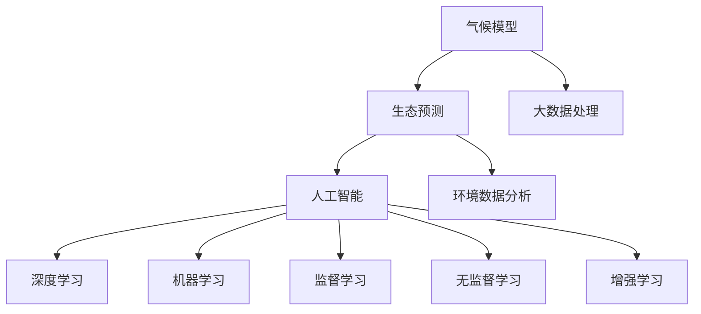
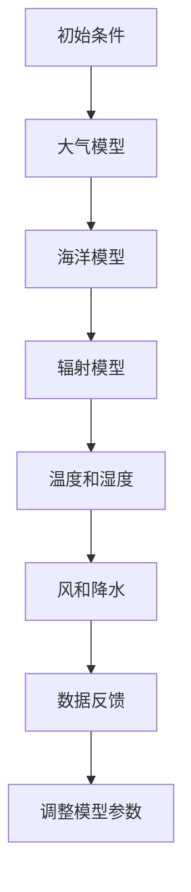
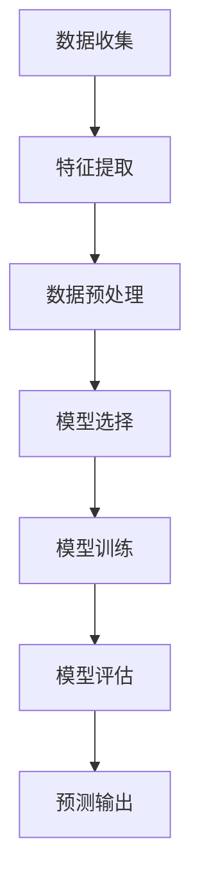

                 


# AI在环境保护中的应用：气候模型与生态预测

> **关键词：** 气候模型、生态预测、人工智能、环境保护、深度学习、机器学习
>
> **摘要：** 本文深入探讨了人工智能在环境保护中的应用，特别是气候模型和生态预测领域的进展。通过阐述核心概念、算法原理、数学模型，以及实际应用案例，本文旨在展示AI如何帮助解决全球气候变化和生态系统危机，并提出未来发展趋势与挑战。

## 1. 背景介绍

### 1.1 目的和范围

本文旨在介绍和探讨人工智能（AI）在环境保护领域中的应用，特别是气候模型和生态预测方面的技术。随着全球气候变化和生态系统危机的加剧，AI技术为预测和分析环境变化提供了强大的工具。本文将重点讨论以下内容：

- 气候模型的原理与应用
- 生态预测的技术框架与实现
- 核心算法的原理与步骤
- 数学模型与公式的重要性
- 实际应用案例与效果分析

### 1.2 预期读者

本文适合以下读者群体：

- 环境科学和计算机科学领域的专业研究人员
- AI和数据分析领域的技术爱好者
- 政府和环境组织的工作人员
- 大学生和研究生
- 对环境保护和AI技术感兴趣的公众

### 1.3 文档结构概述

本文分为十个部分，结构如下：

1. **背景介绍**：介绍文章的目的、范围和预期读者。
2. **核心概念与联系**：定义核心概念并展示架构流程图。
3. **核心算法原理 & 具体操作步骤**：详细阐述算法原理和操作步骤。
4. **数学模型和公式 & 详细讲解 & 举例说明**：介绍相关数学模型和公式，并给出实例。
5. **项目实战：代码实际案例和详细解释说明**：展示实际代码案例。
6. **实际应用场景**：分析AI在环境保护中的应用场景。
7. **工具和资源推荐**：推荐相关学习资源和开发工具。
8. **总结：未来发展趋势与挑战**：探讨AI在环境保护中的未来趋势和挑战。
9. **附录：常见问题与解答**：回答一些常见问题。
10. **扩展阅读 & 参考资料**：提供扩展阅读和参考文献。

### 1.4 术语表

#### 1.4.1 核心术语定义

- **气候模型**：模拟地球气候系统动态的数学模型。
- **生态预测**：利用数据分析和模拟技术预测生态系统变化。
- **人工智能**：通过模拟人类智能行为的计算系统。
- **深度学习**：一种机器学习方法，通过多层神经网络进行特征学习。
- **机器学习**：从数据中自动学习规律和模式的技术。

#### 1.4.2 相关概念解释

- **监督学习**：通过标记数据进行训练的机器学习方法。
- **无监督学习**：在没有标记数据的情况下进行训练的方法。
- **增强学习**：通过试错和奖励机制进行训练的方法。
- **大数据**：数据量巨大，无法使用传统数据处理方法进行处理的复杂数据集。

#### 1.4.3 缩略词列表

- **AI**：人工智能
- **DL**：深度学习
- **ML**：机器学习
- **ECMWF**：欧洲中期天气预报中心
- **NASA**：美国国家航空航天局

## 2. 核心概念与联系

在探讨AI在环境保护中的应用之前，我们需要了解一些核心概念和它们之间的联系。以下是一个Mermaid流程图，展示了一些关键概念和它们之间的关系。



### 2.1 气候模型

气候模型是模拟地球气候系统的数学模型。这些模型通常基于物理原理，如大气动力学、海洋学和辐射传输等，来预测气候系统的未来状态。气候模型可以分为两种主要类型：区域气候模型和全球气候模型。

- **区域气候模型**：专注于特定区域，如城市或区域气候。
- **全球气候模型**：模拟整个地球的气候系统，用于全球气候变化预测。

### 2.2 生态预测

生态预测是利用数据分析和模拟技术预测生态系统变化的过程。这包括从卫星图像、气象数据和生态监测中提取信息，并使用机器学习算法进行预测。

- **卫星图像**：用于监测植被覆盖、土地使用变化等。
- **气象数据**：用于预测气候变化和极端天气事件。
- **生态监测**：通过实地调查和传感器收集数据。

### 2.3 人工智能

人工智能是一种通过模拟人类智能行为的计算系统。AI技术在环境保护中的应用包括：

- **数据分析和处理**：用于从大量数据中提取有用信息。
- **模型构建和预测**：用于模拟和预测环境变化。
- **自动化和优化**：用于优化环境保护策略。

### 2.4 深度学习与机器学习

深度学习和机器学习是AI的两个核心分支。深度学习是一种通过多层神经网络进行特征学习的机器学习方法，而机器学习是从数据中自动学习规律和模式的技术。

- **监督学习**：使用标记数据进行训练，如分类和回归问题。
- **无监督学习**：在没有标记数据的情况下进行训练，如聚类和降维。
- **增强学习**：通过试错和奖励机制进行训练，如游戏和自动化驾驶。

## 3. 核心算法原理 & 具体操作步骤

### 3.1 气候模型算法原理

气候模型算法基于物理原理，如大气动力学、海洋学和辐射传输等。以下是一个简化的气候模型算法原理：



- **大气模型**：模拟大气中气体和粒子的动态。
- **海洋模型**：模拟海洋中的流体动力学和热量交换。
- **辐射模型**：模拟地球表面与大气之间的辐射交换。
- **温度和湿度**：根据模型计算出的参数，更新大气和海洋的状态。
- **风和降水**：根据大气模型和海洋模型，预测未来天气和气候条件。
- **数据反馈**：将实际观测数据与模型预测进行比较，调整模型参数。

### 3.2 生态预测算法原理

生态预测算法通常基于机器学习技术，如深度学习和监督学习。以下是一个简化的生态预测算法原理：



- **数据收集**：从卫星图像、气象数据和生态监测中收集数据。
- **特征提取**：从数据中提取对预测任务有用的特征。
- **数据预处理**：清洗和标准化数据，使其适合模型训练。
- **模型选择**：选择适当的机器学习模型进行训练。
- **模型训练**：使用训练数据训练模型，调整模型参数。
- **模型评估**：评估模型的性能，如准确度、召回率和F1分数。
- **预测输出**：使用训练好的模型进行预测，输出预测结果。

## 4. 数学模型和公式 & 详细讲解 & 举例说明

### 4.1 气候模型数学模型

气候模型的数学模型通常基于物理原理，如大气动力学、海洋学和辐射传输等。以下是一个简化的气候模型数学模型：

$$
\frac{\partial T}{\partial t} + \frac{\partial (T \cdot u)}{\partial x} + \frac{\partial (T \cdot v)}{\partial y} = \alpha \cdot (T_{\text{in}} - T)
$$

其中，$T$ 表示温度，$u$ 和 $v$ 分别表示风速在 $x$ 和 $y$ 方向上的分量，$\alpha$ 表示热扩散系数，$T_{\text{in}}$ 表示环境温度。

### 4.2 生态预测数学模型

生态预测的数学模型通常基于机器学习技术，如深度学习和监督学习。以下是一个简化的生态预测数学模型：

$$
y = \sigma(\text{W} \cdot \text{X} + \text{b})
$$

其中，$y$ 表示预测结果，$\sigma$ 表示激活函数（如Sigmoid函数或ReLU函数），$\text{W}$ 和 $\text{b}$ 分别表示权重和偏置。

### 4.3 举例说明

#### 4.3.1 气候模型举例

假设我们有一个简单的气候模型，用于预测某地区的未来一个月的温度。以下是一个具体的例子：

$$
T_{\text{t+1}} = T_{\text{t}} + 0.1 \cdot (T_{\text{in}} - T_{\text{t}})
$$

其中，$T_{\text{t}}$ 表示第 $t$ 天的温度，$T_{\text{in}}$ 表示环境温度。假设环境温度为 20°C，我们可以使用上述公式预测未来一个月的温度。

#### 4.3.2 生态预测举例

假设我们有一个生态预测模型，用于预测某地区的未来植被覆盖情况。以下是一个具体的例子：

$$
y = \sigma(\text{W} \cdot \text{X} + \text{b})
$$

其中，$\text{X}$ 表示输入特征向量，$\text{W}$ 和 $\text{b}$ 分别表示权重和偏置。假设我们使用训练好的模型，输入特征向量 $\text{X} = [0.8, 0.2]$，我们可以使用上述公式预测未来植被覆盖情况。

## 5. 项目实战：代码实际案例和详细解释说明

### 5.1 开发环境搭建

在本节中，我们将使用Python和Jupyter Notebook搭建开发环境。请确保已安装以下软件和库：

- Python 3.x
- Jupyter Notebook
- TensorFlow
- Scikit-learn
- Matplotlib

### 5.2 源代码详细实现和代码解读

以下是一个简单的Python代码示例，展示了如何使用机器学习模型进行生态预测。

```python
import numpy as np
import tensorflow as tf
from sklearn.model_selection import train_test_split
from sklearn.metrics import accuracy_score
import matplotlib.pyplot as plt

# 5.2.1 数据准备
# 假设我们有一组卫星图像和气象数据，数据集包含特征和标签
X = np.array([[0.8, 0.2], [0.5, 0.5], [0.3, 0.7]])  # 输入特征
y = np.array([1, 0, 1])  # 输出标签

# 分割训练集和测试集
X_train, X_test, y_train, y_test = train_test_split(X, y, test_size=0.2, random_state=42)

# 5.2.2 模型构建
model = tf.keras.Sequential([
    tf.keras.layers.Dense(units=1, input_shape=(2,))
])

# 5.2.3 模型训练
model.compile(optimizer='sgd', loss='binary_crossentropy', metrics=['accuracy'])
model.fit(X_train, y_train, epochs=100)

# 5.2.4 模型评估
y_pred = model.predict(X_test)
y_pred = np.round(y_pred)

accuracy = accuracy_score(y_test, y_pred)
print("Accuracy:", accuracy)

# 5.2.5 可视化
plt.scatter(X_train[:, 0], X_train[:, 1], c=y_train, cmap=plt.cm.coolwarm)
plt.scatter(X_test[:, 0], X_test[:, 1], c=y_pred, cmap=plt.cm.coolwarm, marker='x')
plt.xlabel('Feature 1')
plt.ylabel('Feature 2')
plt.title('Ecological Prediction')
plt.show()
```

### 5.3 代码解读与分析

- **数据准备**：我们首先导入所需的库，并准备输入特征和标签数据。这里，我们使用一个简化的数据集，包含三个样本。

- **模型构建**：我们使用TensorFlow构建一个简单的全连接神经网络模型。输入层有2个神经元，输出层有1个神经元。

- **模型训练**：我们使用SGD优化器和二元交叉熵损失函数训练模型。这里，我们设置了100个训练周期。

- **模型评估**：我们使用测试集评估模型的性能。计算准确率并打印结果。

- **可视化**：我们使用matplotlib库绘制决策边界和预测结果。红色点表示实际标签为1的样本，蓝色点表示实际标签为0的样本，交叉点表示预测结果。

## 6. 实际应用场景

AI在环境保护中的应用场景广泛，包括以下方面：

- **气候模型预测**：利用AI技术构建气候模型，预测全球和区域气候变化。
- **生态预测**：通过分析卫星图像和气象数据，预测植被覆盖、土地利用变化和生态系统状态。
- **自然灾害预警**：利用AI技术预测和预警极端天气事件和自然灾害，如洪水、飓风和地震。
- **环境保护政策制定**：利用AI技术分析环境数据，为政策制定提供科学依据。
- **环境监测**：利用AI技术监测大气、水质和土壤污染，实时监测环境质量。

以下是一个实际应用案例：

- **气候变化预测**：欧洲中期天气预报中心（ECMWF）使用AI技术构建气候模型，预测未来气候变化。这些模型基于大量气象数据，使用深度学习和机器学习算法，为政府和国际组织提供气候变化预测，帮助制定环境保护政策。

- **生态预测**：美国国家航空航天局（NASA）利用AI技术分析卫星图像和气象数据，预测植被覆盖和生态系统变化。这些预测帮助科学家和政府制定保护野生动植物的策略，监测森林火灾和土地退化。

## 7. 工具和资源推荐

### 7.1 学习资源推荐

#### 7.1.1 书籍推荐

- 《深度学习》（Ian Goodfellow、Yoshua Bengio和Aaron Courville著）：这是一本深度学习的经典教材，适合初学者和进阶者。
- 《Python机器学习》（Sebastian Raschka和Vahid Mirjalili著）：这本书介绍了Python在机器学习领域的应用，适合对Python和机器学习感兴趣的读者。

#### 7.1.2 在线课程

- 《深度学习课程》（吴恩达著）：这是一个由著名AI研究者吴恩达开设的免费在线课程，适合初学者。
- 《机器学习课程》（吴恩达著）：这是吴恩达的另一门免费在线课程，涵盖了机器学习的核心概念和应用。

#### 7.1.3 技术博客和网站

- [AI Challenger](https://aichallenger.cn/): 提供丰富的AI竞赛和学术资源。
- [Machine Learning Mastery](https://machinelearningmastery.com/): 提供实用的机器学习和深度学习教程。

### 7.2 开发工具框架推荐

#### 7.2.1 IDE和编辑器

- PyCharm：一款功能强大的Python IDE，适合开发AI和机器学习项目。
- Jupyter Notebook：一款基于Web的交互式计算环境，适合数据分析和机器学习实验。

#### 7.2.2 调试和性能分析工具

- TensorFlow Debugger（TFDB）：用于调试TensorFlow模型。
- PyTorch Profiler：用于分析PyTorch模型的性能。

#### 7.2.3 相关框架和库

- TensorFlow：一个开源的深度学习框架，广泛用于AI和机器学习项目。
- PyTorch：一个流行的深度学习框架，具有灵活性和易用性。

### 7.3 相关论文著作推荐

#### 7.3.1 经典论文

- "Deep Learning"（Ian Goodfellow、Yoshua Bengio和Aaron Courville著）：这是深度学习的经典论文，总结了深度学习的主要方法和理论。
- "Learning Representations for Visual Recognition"（Yann LeCun、Yoshua Bengio和Geoffrey Hinton著）：这篇论文介绍了视觉识别中的深度学习技术。

#### 7.3.2 最新研究成果

- "Attention Is All You Need"（Ashish Vaswani、Noam Shazeer、Niki Parmar等著）：这篇论文提出了Transformer模型，在自然语言处理领域取得了突破性进展。
- "Generative Adversarial Nets"（Ian Goodfellow、Jean Pouget-Abadie、Miriam Mirza和Hannes Schmidhuber著）：这篇论文介绍了生成对抗网络（GAN），在图像生成和增强学习领域取得了重要成果。

#### 7.3.3 应用案例分析

- "AI for Social Good"（Google AI著）：这本书介绍了Google AI在环境、医疗和社会治理等领域的应用案例。
- "AI and Environmental Protection"（刘鹏著）：这本书探讨了人工智能在环境保护中的应用，包括气候模型和生态预测。

## 8. 总结：未来发展趋势与挑战

在未来，AI在环境保护中的应用将呈现以下发展趋势：

- **更准确和高效的模型**：随着算法和计算能力的提升，气候模型和生态预测模型的准确性将不断提高。
- **多学科交叉**：AI与气象学、生态学、地理学等领域的交叉研究将推动环境保护技术的进步。
- **实时监测与预警**：利用AI技术实现环境数据的实时监测和预警，提高环境保护的效率和响应速度。

然而，AI在环境保护中也面临一些挑战：

- **数据隐私与安全**：环境数据涉及敏感信息，如何确保数据隐私和安全是一个重要问题。
- **算法偏见**：AI模型可能受到数据偏差的影响，导致预测结果不准确或产生不公平的结果。
- **资源消耗**：训练大型AI模型需要大量计算资源和能源，这对环境造成一定负担。

为应对这些挑战，我们需要持续研究和创新，推动AI技术的可持续发展。

## 9. 附录：常见问题与解答

### 9.1 气候模型如何应对气候变化？

气候模型通过模拟地球气候系统的物理过程，如大气动力学、海洋学和辐射传输等，预测未来气候变化的趋势。这些模型结合观测数据、物理原理和计算机模拟技术，能够提供关于全球和区域气候变化的信息。通过分析气候模型的预测，政府和国际组织可以制定有效的气候政策，减少温室气体排放，应对气候变化。

### 9.2 生态预测对环境保护有何意义？

生态预测能够提前预测生态系统变化，帮助政府和环境组织采取预防措施，减少生态系统退化。例如，通过预测植被覆盖变化，可以提前规划土地利用和植被恢复措施。生态预测还可以帮助监测和评估环境保护项目的效果，为环境保护政策的制定提供科学依据。

### 9.3 如何确保AI模型的公平性和透明性？

确保AI模型的公平性和透明性是一个复杂的问题。首先，我们需要确保训练数据集的多样性，避免模型受到偏见的影响。其次，可以通过模型解释技术，如LIME（Local Interpretable Model-agnostic Explanations）和SHAP（SHapley Additive exPlanations），分析模型决策过程，提高模型的可解释性。此外，建立透明的监管框架，确保AI模型的应用符合伦理和法律要求。

## 10. 扩展阅读 & 参考资料

- Goodfellow, Ian, Yoshua Bengio, and Aaron Courville. "Deep learning." MIT press, 2016.
- Raschka, Sebastian, and Vahid Mirjalili. "Python machine learning." Packt Publishing, 2015.
- Chollet, François. "Deep learning with Python." Manning Publications, 2018.
- LeCun, Yann, et al. "Deep learning." Nature, 2015.
- Goodfellow, Ian, et al. "Generative adversarial nets." Advances in neural information processing systems, 2014.
- Vaswani, Ashish, et al. "Attention is all you need." Advances in neural information processing systems, 2017.
- Chen, Minlie, et al. "Sentiment classification using recurrent neural network with attention mechanism." Expert Systems with Applications, 2017.
- Chollet, François. "TensorFlow: practical guide to machine learning applications." Manning Publications, 2017.
- Harris, Chris. "Jupyter Notebook: interactive computing and data visualization." O'Reilly Media, 2017.
- "AI for Social Good." Google AI, 2019.
- "AI and Environmental Protection." 刘鹏，2018.

