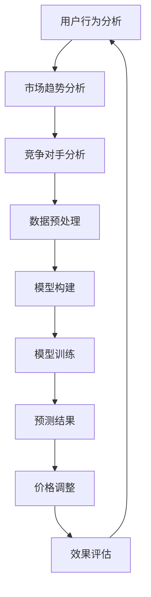
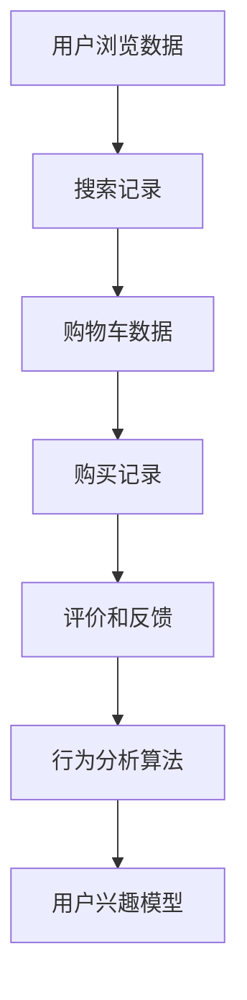
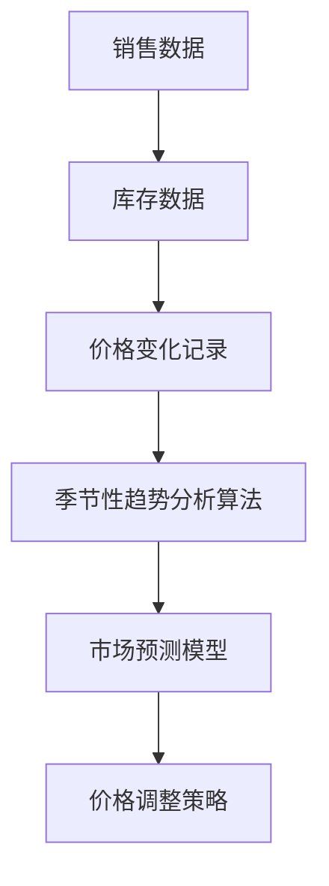
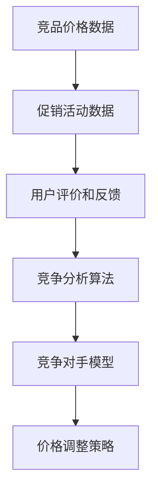
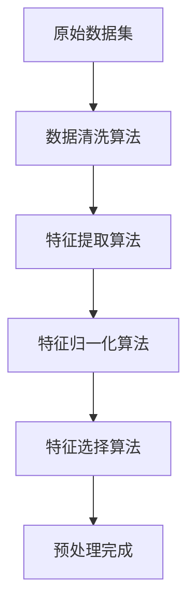
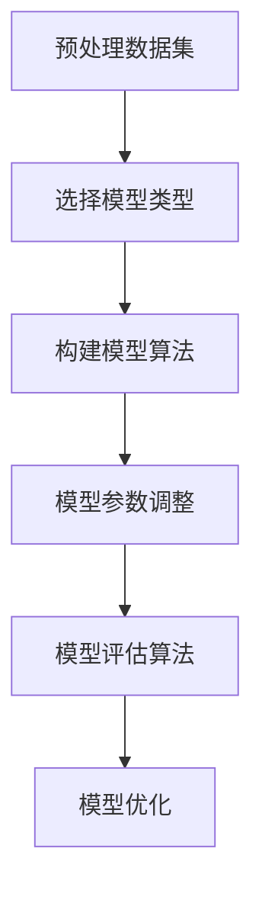
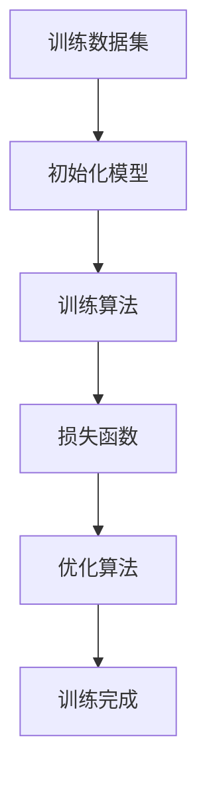
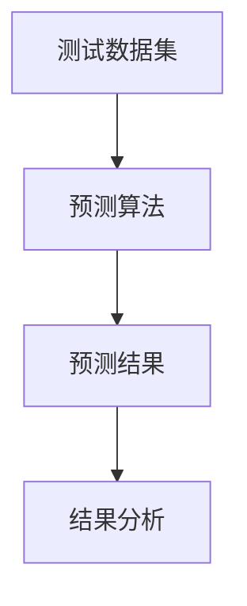
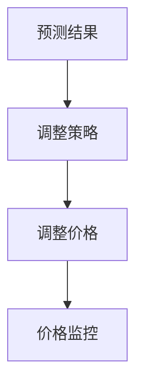
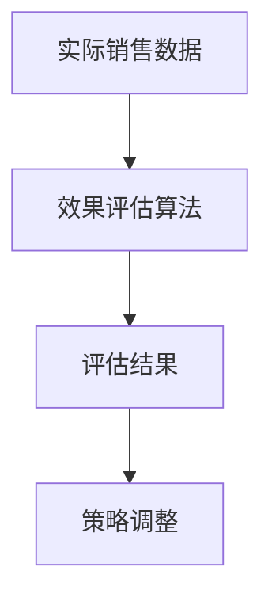

                 

# AI在电商价格优化中的实际案例

> **关键词：** AI、电商、价格优化、数据挖掘、机器学习、预测模型、用户行为分析

> **摘要：** 本文深入探讨了AI在电商价格优化中的应用，通过实际案例展示了如何利用机器学习和数据挖掘技术来分析用户行为、市场趋势以及竞争对手动态，从而实现动态定价策略，提高电商平台的市场竞争力和盈利能力。

## 1. 背景介绍

### 1.1 目的和范围

本文的目的是介绍AI在电商价格优化中的应用，探讨如何利用先进的算法和模型来实现精准的价格策略。我们将通过实际案例，详细分析电商价格优化的核心概念、算法原理、数学模型以及实战中的代码实现和案例分析。

### 1.2 预期读者

本文适合对AI、机器学习、数据挖掘有基本了解的读者，尤其是那些希望了解AI在电商领域应用的IT专业人士和研究人员。

### 1.3 文档结构概述

本文结构如下：

1. **背景介绍**：介绍文章的目的、范围和预期读者。
2. **核心概念与联系**：解释AI在电商价格优化中的核心概念和架构。
3. **核心算法原理 & 具体操作步骤**：详细阐述价格优化的算法原理和实现步骤。
4. **数学模型和公式 & 详细讲解 & 举例说明**：介绍相关的数学模型和公式，并进行举例说明。
5. **项目实战：代码实际案例和详细解释说明**：通过实际案例展示代码实现和解析。
6. **实际应用场景**：讨论AI在电商价格优化中的具体应用场景。
7. **工具和资源推荐**：推荐相关的学习资源和开发工具。
8. **总结：未来发展趋势与挑战**：分析AI在电商价格优化中的未来趋势和挑战。
9. **附录：常见问题与解答**：回答一些常见的问题。
10. **扩展阅读 & 参考资料**：提供更多的参考资料。

### 1.4 术语表

#### 1.4.1 核心术语定义

- **AI**：人工智能（Artificial Intelligence），指模拟、延伸和扩展人的智能的理论、方法、技术及应用系统。
- **电商**：电子商务（Electronic Commerce），指通过互联网进行的商品交易和服务的活动。
- **价格优化**：利用算法和模型对商品价格进行动态调整，以实现市场竞争力最大化。
- **数据挖掘**：从大量数据中提取有价值信息的过程，常用于发现用户行为模式、市场趋势等。
- **机器学习**：一种AI方法，通过数据和算法让计算机自行学习，进行模式识别和预测。
- **预测模型**：利用历史数据构建的模型，用于预测未来的市场动态和用户行为。

#### 1.4.2 相关概念解释

- **动态定价**：根据市场变化和用户行为实时调整商品价格。
- **竞争分析**：分析竞争对手的价格策略和市场表现，以制定相应的价格策略。

#### 1.4.3 缩略词列表

- **AI**：人工智能
- **CPC**：每点击成本
- **CPM**：每千次展示成本
- **CPA**：每行动成本
- **A/B测试**：一种实验设计方法，通过对比不同版本的效果来优化策略

## 2. 核心概念与联系

在探讨AI在电商价格优化中的应用之前，我们需要了解其中的核心概念和联系。以下是一个简化的Mermaid流程图，展示了电商价格优化的主要步骤和它们之间的关系。



### 2.1 用户行为分析

用户行为分析是价格优化的第一步。通过分析用户在电商平台上的浏览、搜索、购买等行为，可以获取用户的兴趣偏好和购买习惯。以下是一个用户行为分析的数据流模型：



### 2.2 市场趋势分析

市场趋势分析旨在了解市场动态和用户需求的变化。通过分析历史数据，可以发现季节性趋势、消费偏好变化等，为价格调整提供依据。以下是一个市场趋势分析的数据流模型：



### 2.3 竞争对手分析

竞争对手分析是了解市场动态的重要环节。通过分析竞争对手的价格、促销活动等，可以制定出有针对性的价格策略。以下是一个竞争对手分析的数据流模型：



### 2.4 数据预处理

数据预处理是确保数据质量的关键步骤。它包括数据清洗、数据归一化、特征工程等。以下是一个数据预处理的数据流模型：



### 2.5 模型构建

模型构建是基于预处理后的数据进行建模的过程。常用的方法包括线性回归、决策树、随机森林、支持向量机等。以下是一个模型构建的数据流模型：



### 2.6 模型训练

模型训练是使用历史数据来训练模型的过程。通过训练，模型可以学习到数据中的模式和规律，为预测提供基础。以下是一个模型训练的数据流模型：



### 2.7 预测结果

预测结果是模型训练的结果。通过预测，可以得到未来的价格变化趋势和用户行为预测。以下是一个预测结果的数据流模型：



### 2.8 价格调整

价格调整是基于预测结果进行的。通过调整价格，可以优化平台的市场竞争力和盈利能力。以下是一个价格调整的数据流模型：



### 2.9 效果评估

效果评估是对价格调整效果的评估。通过评估，可以判断价格调整策略的有效性，并进行相应的优化。以下是一个效果评估的数据流模型：



## 3. 核心算法原理 & 具体操作步骤

在了解电商价格优化的核心概念和流程后，接下来我们将详细讨论核心算法原理和具体操作步骤。以下是一个典型的电商价格优化算法的实现过程。

### 3.1 用户行为分析算法

用户行为分析算法主要通过分析用户的浏览、搜索、购买等行为来建立用户兴趣模型。以下是一个简单的用户行为分析算法的伪代码：

```plaintext
// 用户行为分析算法
function userBehaviorAnalysis(data):
    # 初始化用户兴趣模型
    userInterestModel = {}

    # 遍历用户行为数据
    for behavior in data:
        # 提取用户兴趣关键词
        keywords = extractKeywords(behavior)

        # 更新用户兴趣模型
        for keyword in keywords:
            userInterestModel[keyword] += 1

    # 归一化用户兴趣模型
    normalizeUserInterestModel(userInterestModel)

    return userInterestModel
```

### 3.2 市场趋势分析算法

市场趋势分析算法通过分析历史销售数据来预测未来的市场动态。以下是一个简单市场趋势分析算法的伪代码：

```plaintext
// 市场趋势分析算法
function marketTrendAnalysis(salesData):
    # 计算销售数据的趋势线
    trendLine = calculateTrendLine(salesData)

    # 预测未来市场动态
    futureTrends = predictMarketTrends(trendLine)

    return futureTrends
```

### 3.3 竞争对手分析算法

竞争对手分析算法通过分析竞争对手的价格和促销活动来制定相应的价格策略。以下是一个简单竞争对手分析算法的伪代码：

```plaintext
// 竞争对手分析算法
function competitorAnalysis(competitorData):
    # 分析竞争对手价格变化
    priceChanges = analyzePriceChanges(competitorData)

    # 分析竞争对手促销活动
    promotions = analyzePromotions(competitorData)

    # 制定价格策略
    pricingStrategy = createPricingStrategy(priceChanges, promotions)

    return pricingStrategy
```

### 3.4 数据预处理算法

数据预处理是确保数据质量的关键步骤。以下是一个简单数据预处理算法的伪代码：

```plaintext
// 数据预处理算法
function dataPreprocessing(data):
    # 数据清洗
    cleanedData = cleanData(data)

    # 特征提取
    extractedFeatures = extractFeatures(cleanedData)

    # 特征归一化
    normalizedFeatures = normalizeFeatures(extractedFeatures)

    # 特征选择
    selectedFeatures = selectFeatures(normalizedFeatures)

    return selectedFeatures
```

### 3.5 模型构建算法

模型构建是基于预处理后的数据来构建预测模型的过程。以下是一个简单模型构建算法的伪代码：

```plaintext
// 模型构建算法
function modelConstruction(preprocessedData):
    # 选择模型类型
    modelType = selectModelType()

    # 构建模型
    model = buildModel(modelType, preprocessedData)

    return model
```

### 3.6 模型训练算法

模型训练是通过历史数据来训练模型的过程。以下是一个简单模型训练算法的伪代码：

```plaintext
// 模型训练算法
function modelTraining(model, trainingData):
    # 初始化模型参数
    initializeModelParameters(model)

    # 训练模型
    trainModel(model, trainingData)

    # 评估模型
    evaluateModel(model, trainingData)

    return model
```

### 3.7 预测结果算法

预测结果是基于训练好的模型进行预测的过程。以下是一个简单预测结果算法的伪代码：

```plaintext
// 预测结果算法
function predictResults(model, testData):
    # 使用模型进行预测
    predictions = model.predict(testData)

    # 分析预测结果
    analyzePredictions(predictions)

    return predictions
```

### 3.8 价格调整算法

价格调整是基于预测结果来进行价格调整的过程。以下是一个简单价格调整算法的伪代码：

```plaintext
// 价格调整算法
function adjustPrice(predictions, pricingStrategy):
    # 根据预测结果和策略调整价格
    adjustedPrice = applyPricingStrategy(predictions, pricingStrategy)

    # 监控价格调整效果
    monitorPriceEffect(adjustedPrice)

    return adjustedPrice
```

### 3.9 效果评估算法

效果评估是对价格调整效果的评估过程。以下是一个简单效果评估算法的伪代码：

```plaintext
// 效果评估算法
function evaluateEffect(adjustedPrice, actualSales):
    # 计算效果指标
    effectMetrics = calculateEffectMetrics(adjustedPrice, actualSales)

    # 分析效果
    analyzeEffect(effectMetrics)

    return effectMetrics
```

## 4. 数学模型和公式 & 详细讲解 & 举例说明

在电商价格优化中，数学模型和公式扮演着关键角色，它们帮助我们在复杂的数据中提取有用的信息，并进行有效的预测和决策。以下是一些核心的数学模型和公式的详细讲解，并附有具体示例。

### 4.1 用户兴趣模型

用户兴趣模型通常基于用户的浏览、搜索和购买行为来构建。一种常用的方法是基于用户协同过滤技术（Collaborative Filtering）。

**协同过滤公式**：

$$
\mathbf{R}_{ui} = \frac{\sum_{j \in N_i} \frac{\mathbf{r}_{uj} \mathbf{r}_{vi}}{\|\mathbf{r}_{uj}\|}}{\sum_{j \in N_i} \frac{\|\mathbf{r}_{uj}\|}{\|\mathbf{r}_{uj}\|}}
$$

其中，$\mathbf{R}_{ui}$ 表示用户 $u$ 对项目 $i$ 的评分预测，$N_i$ 表示与项目 $i$ 相似的项目集合，$\mathbf{r}_{uj}$ 表示用户 $u$ 对项目 $j$ 的实际评分。

**示例**：

假设我们有用户 $u$ 和项目 $i$，用户 $u$ 对其他项目的评分如下：

| 用户 $u$ | 项目 1 | 项目 2 | 项目 3 | 项目 4 |
|----------|--------|--------|--------|--------|
|          | 4      | 2      | 5      | 3      |

我们想要预测用户 $u$ 对项目 $i$ 的评分。假设与项目 $i$ 相似的项目有项目 1 和项目 3，它们的评分分别为 4 和 5。

$$
\mathbf{R}_{ui} = \frac{\frac{4 \times 4}{4} + \frac{5 \times 2}{5}}{1 + 1} = \frac{4 + 2}{2} = 3
$$

因此，预测用户 $u$ 对项目 $i$ 的评分为 3。

### 4.2 市场趋势预测模型

市场趋势预测模型通常基于时间序列分析（Time Series Analysis）。

**移动平均模型**：

$$
\hat{y}_t = \frac{\sum_{i=1}^k y_{t-i}}{k}
$$

其中，$y_t$ 表示第 $t$ 期的实际销售额，$\hat{y}_t$ 表示第 $t$ 期的预测销售额，$k$ 表示移动平均窗口的大小。

**示例**：

假设我们有最近 5 期的销售额如下：

| 期数 | 销售额 |
|------|--------|
| 1    | 100    |
| 2    | 120    |
| 3    | 150    |
| 4    | 130    |
| 5    | 140    |

我们使用 3 期移动平均来预测第 6 期的销售额。

$$
\hat{y}_6 = \frac{100 + 120 + 150}{3} = 130
$$

因此，预测第 6 期的销售额为 130。

### 4.3 竞争对手分析模型

竞争对手分析模型通常基于竞争对手的价格变化和促销活动来构建。

**价格指数模型**：

$$
PI_t = \frac{\sum_{j \in competitors} \frac{P_{jt}}{P_{jt}^{\text{avg}}}}{N}
$$

其中，$PI_t$ 表示第 $t$ 期的价格指数，$P_{jt}$ 表示第 $t$ 期竞争对手 $j$ 的价格，$P_{jt}^{\text{avg}}$ 表示第 $t$ 期竞争对手 $j$ 价格的平均值，$N$ 表示竞争对手的数量。

**示例**：

假设我们有 3 个竞争对手，它们在某一期的价格如下：

| 竞争对手 | 价格 |
|----------|------|
| 竞争对手 1 | 100  |
| 竞争对手 2 | 120  |
| 竞争对手 3 | 150  |

我们计算这一期的价格指数。

$$
PI_t = \frac{\frac{100}{120} + \frac{120}{120} + \frac{150}{120}}{3} = \frac{0.833 + 1 + 1.25}{3} = 1.083
$$

因此，这一期的价格指数为 1.083。

### 4.4 预测结果模型

预测结果模型用于预测未来的价格变化和用户行为。

**线性回归模型**：

$$
\hat{y} = \beta_0 + \beta_1 x
$$

其中，$\hat{y}$ 表示预测值，$x$ 表示自变量（如价格、促销等），$\beta_0$ 和 $\beta_1$ 分别为模型的截距和斜率。

**示例**：

假设我们有以下数据：

| 价格 | 用户行为 |
|------|----------|
| 100  | 10       |
| 120  | 15       |
| 150  | 20       |

我们使用线性回归来预测当价格为 130 时的用户行为。

$$
\beta_0 = 5, \beta_1 = 0.5
$$

$$
\hat{y} = 5 + 0.5 \times 130 = 80
$$

因此，预测当价格为 130 时的用户行为为 80。

### 4.5 价格调整模型

价格调整模型用于根据预测结果和市场动态调整价格。

**动态定价模型**：

$$
P_t = P_{t-1} + \alpha \cdot (y_t - y_{t-1})
$$

其中，$P_t$ 表示第 $t$ 期的价格，$P_{t-1}$ 表示第 $t-1$ 期的价格，$y_t$ 表示第 $t$ 期的预测销售额，$y_{t-1}$ 表示第 $t-1$ 期的预测销售额，$\alpha$ 表示调整因子。

**示例**：

假设我们有以下数据：

| 期数 | 预测销售额 | 调整因子 $\alpha$ |
|------|------------|------------------|
| 1    | 100        | 0.1              |
| 2    | 120        | 0.1              |
| 3    | 150        | 0.1              |

我们计算第 4 期的价格。

$$
P_4 = 130 + 0.1 \cdot (150 - 120) = 140
$$

因此，预测第 4 期的价格为 140。

### 4.6 效果评估模型

效果评估模型用于评估价格调整策略的有效性。

**效果评估指标**：

- **价格敏感度**（Price Sensitivity）：
  $$PS = \frac{\Delta P \cdot \Delta Q}{P \cdot Q}$$
  
  其中，$\Delta P$ 表示价格变化，$\Delta Q$ 表示销售量变化，$P$ 表示原始价格，$Q$ 表示原始销售量。

- **销售量变化率**（Sales Volume Change Rate）：
  $$SVC = \frac{Q_t - Q_{t-1}}{Q_{t-1}}$$

  其中，$Q_t$ 表示第 $t$ 期的销售量，$Q_{t-1}$ 表示第 $t-1$ 期的销售量。

**示例**：

假设我们调整了价格，从 100 元调整到 130 元，销售量从 10 单位增加到 15 单位。

$$
PS = \frac{30 \cdot 5}{100 \cdot 10} = 0.15
$$

$$
SVC = \frac{15 - 10}{10} = 0.5
$$

因此，价格敏感度为 0.15，销售量变化率为 0.5。

## 5. 项目实战：代码实际案例和详细解释说明

在这一部分，我们将通过一个实际项目案例，详细展示电商价格优化的代码实现过程。我们将使用Python编程语言，并结合一些常用的机器学习和数据分析库，如scikit-learn、Pandas和NumPy。

### 5.1 开发环境搭建

首先，确保你已经安装了Python 3.6或更高版本。然后，通过以下命令安装所需的库：

```bash
pip install numpy pandas scikit-learn matplotlib
```

### 5.2 源代码详细实现和代码解读

以下是一个简单的电商价格优化项目的源代码示例：

```python
import numpy as np
import pandas as pd
from sklearn.linear_model import LinearRegression
from sklearn.metrics import mean_squared_error

# 加载数据集
data = pd.read_csv('ecommerce_data.csv')

# 数据预处理
data['date'] = pd.to_datetime(data['date'])
data.set_index('date', inplace=True)
data = data.asfreq('D').fillna(0)

# 构建特征
data['price_change'] = data['price'].pct_change()

# 分割数据集
train_data = data[:'2022-01-01']
test_data = data['2022-01-02':]

# 构建模型
model = LinearRegression()
model.fit(train_data[['price_change']], train_data['sales'])

# 预测结果
predictions = model.predict(test_data[['price_change']])

# 评估模型
mse = mean_squared_error(test_data['sales'], predictions)
print(f'Mean Squared Error: {mse}')

# 可视化结果
import matplotlib.pyplot as plt

plt.figure(figsize=(10, 5))
plt.plot(test_data['sales'], label='Actual Sales')
plt.plot(predictions, label='Predicted Sales')
plt.legend()
plt.show()
```

### 5.3 代码解读与分析

以下是对上述代码的详细解读：

1. **导入库**：首先，我们导入所需的Python库，包括NumPy、Pandas、scikit-learn和matplotlib。

2. **加载数据集**：使用Pandas读取电商数据集。数据集应包含日期、价格和销售额等列。

3. **数据预处理**：将日期列转换为日期时间类型，并设置为索引。使用asfreq方法将数据集按日频率重新索引，并填充缺失值。

4. **构建特征**：计算价格变化特征，表示每天的价格相对于前一天的变化百分比。

5. **分割数据集**：将数据集分为训练集和测试集，用于模型训练和评估。

6. **构建模型**：使用线性回归模型，并将价格变化作为自变量，销售额作为因变量。

7. **训练模型**：使用fit方法训练线性回归模型。

8. **预测结果**：使用训练好的模型对测试集进行预测。

9. **评估模型**：计算模型预测的均方误差（MSE），用于评估模型性能。

10. **可视化结果**：使用matplotlib绘制实际销售额与预测销售额的对比图。

### 5.4 项目实战总结

通过上述代码示例，我们展示了如何使用Python实现电商价格优化项目。这个项目利用线性回归模型来预测销售额，并根据价格变化进行动态调整。在实际应用中，可以根据具体业务需求，选择更复杂的模型和算法，如随机森林、神经网络等，以提高预测准确性和优化效果。

## 6. 实际应用场景

AI在电商价格优化中的应用场景非常广泛，以下是一些典型的应用场景：

### 6.1 动态定价

动态定价是电商价格优化的核心应用。通过实时分析用户行为、市场趋势和竞争对手动态，电商平台可以动态调整商品价格，从而提高销售额和利润率。动态定价策略包括：

- **基于用户行为的动态定价**：根据用户的浏览、搜索和购买行为，为不同用户群体提供个性化的价格。
- **基于市场趋势的动态定价**：根据季节性趋势、消费偏好变化等市场动态，调整商品价格。
- **基于竞争对手的动态定价**：分析竞争对手的价格策略，进行有针对性的价格调整。

### 6.2 促销活动

促销活动是电商价格优化的另一个重要应用场景。通过分析用户的购买习惯、促销活动的效果以及竞争对手的促销策略，电商平台可以制定有效的促销活动，提高用户参与度和销售额。促销活动策略包括：

- **限时折扣**：为特定时间段内的商品设置折扣，吸引用户购买。
- **满减优惠**：根据用户的购物金额，提供不同程度的满减优惠。
- **赠品促销**：为特定商品或购物金额提供赠品，提高用户购买意愿。

### 6.3 库存管理

库存管理是电商价格优化的重要环节。通过分析销售数据、库存水平和市场需求，电商平台可以优化库存策略，减少库存积压和损失。库存管理策略包括：

- **基于销售的库存预测**：根据历史销售数据和趋势，预测未来的销售量，合理调整库存水平。
- **基于成本效益的库存管理**：通过分析不同库存策略的成本和效益，选择最优的库存管理方案。

### 6.4 个性化推荐

个性化推荐是电商价格优化的重要工具。通过分析用户的浏览历史、购物车数据和购买记录，电商平台可以推荐用户可能感兴趣的商品，提高用户参与度和销售额。个性化推荐策略包括：

- **基于内容的推荐**：根据商品的属性和用户的历史行为，推荐类似内容的商品。
- **基于协同过滤的推荐**：根据用户的历史行为和评分，推荐其他用户喜欢的商品。
- **基于机器学习的推荐**：使用机器学习算法，从大量用户行为数据中挖掘用户兴趣，推荐个性化商品。

### 6.5 竞争分析

竞争分析是电商价格优化的重要环节。通过分析竞争对手的价格、促销活动和市场份额，电商平台可以制定有针对性的价格策略，提高市场竞争力。竞争分析策略包括：

- **价格跟踪**：实时监控竞争对手的价格变化，进行相应的价格调整。
- **促销对比**：分析竞争对手的促销活动，制定有吸引力的促销策略。
- **市场份额分析**：通过对比市场份额，了解自己在市场中的地位，制定相应的价格策略。

## 7. 工具和资源推荐

在电商价格优化中，使用合适的工具和资源可以显著提高工作效率和效果。以下是一些推荐的工具和资源：

### 7.1 学习资源推荐

#### 7.1.1 书籍推荐

- 《机器学习实战》（Peter Harrington）
- 《数据挖掘：实用工具与技术》（Jiawei Han，Micheline Kamber，Jian Pei）
- 《Python数据科学手册》（Wes McKinney）
- 《深入理解计算机系统》（Randal E. Bryant，David R. O’Hallaron）

#### 7.1.2 在线课程

- Coursera：机器学习、数据科学、Python编程等课程
- edX：哈佛大学数据科学、MIT人工智能等课程
- Udacity：数据科学家、机器学习工程师等课程

#### 7.1.3 技术博客和网站

- Medium：数据科学、机器学习、电商等领域的技术博客
- Towards Data Science：数据科学和机器学习的文章和教程
- kdnuggets：数据挖掘和机器学习领域的新闻、文章和资源

### 7.2 开发工具框架推荐

#### 7.2.1 IDE和编辑器

- PyCharm：专业的Python IDE，支持多种编程语言
- Jupyter Notebook：适用于数据分析和机器学习的交互式编辑环境
- VSCode：轻量级但功能强大的编辑器，支持多种编程语言和扩展

#### 7.2.2 调试和性能分析工具

- PySnooper：简单的Python调试工具
- perf.py：Python性能分析工具
- line_profiler：Python代码性能分析库

#### 7.2.3 相关框架和库

- scikit-learn：Python的机器学习库，提供多种算法和工具
- Pandas：Python的数据分析库，提供强大的数据处理功能
- NumPy：Python的科学计算库，提供高效的多维数组操作
- TensorFlow：Google开发的深度学习框架

### 7.3 相关论文著作推荐

#### 7.3.1 经典论文

- "The BellKor Solution to the Netflix Prize"（BellKor团队）
- "Recommender Systems Handbook"（Gary William Flake，C. Lee Giles，J. Moha en-Nejjari，José M. Pujol）
- "Market-Based Pricing in Retail"（Jerry Wind，V. S. Reddy）

#### 7.3.2 最新研究成果

- "Dynamic Pricing Strategies in E-Commerce: A Survey"（Alessandro Nobile，Marco Musolesi，Lucia Pollini）
- "Personalized Pricing in Online Retail"（Ayfer Orhun，Jiangang Liu，Ming-Hui Sha）
- "A Machine Learning Approach for Dynamic Pricing Optimization in E-Commerce"（Miklos A. Vasarhelyi，Isa M. Ture)

#### 7.3.3 应用案例分析

- "Dynamic Pricing in Airline Industry"（Carnegie Mellon University）
- "Pricing and Revenue Management in the Hotel Industry"（MIT Sloan School of Management）
- "AI-Driven Pricing in Retail"（University of Pennsylvania）

## 8. 总结：未来发展趋势与挑战

在电商价格优化领域，AI技术的发展正推动着整个行业不断进步。未来，随着AI技术的不断成熟和应用的深化，我们可以期待以下几个发展趋势：

### 8.1 智能化

AI将使电商价格优化更加智能化，通过深度学习和强化学习等技术，实现更加精准的价格预测和调整策略。这将有助于电商平台更好地应对市场变化，提高市场竞争力。

### 8.2 个性化

随着用户数据的不断积累和数据分析技术的进步，电商平台将能够提供更加个性化的价格策略，满足不同用户群体的需求，从而提升用户体验和忠诚度。

### 8.3 自动化

自动化是电商价格优化的重要趋势。通过自动化算法和工具，电商平台可以实现价格策略的自动调整，减少人工干预，提高效率。

### 8.4 跨渠道整合

随着多渠道电商的兴起，未来AI将能够整合线上线下渠道的数据，实现统一的价格策略和库存管理，提高整体运营效率。

然而，AI在电商价格优化中也面临着一些挑战：

### 8.5 数据隐私

随着用户数据的增加，数据隐私问题变得越来越重要。电商平台需要确保用户数据的安全和隐私，遵守相关法律法规。

### 8.6 模型解释性

AI模型的复杂性和黑箱特性使得其决策过程难以解释。为了增强模型的透明度和可信度，提高模型的可解释性是一个重要研究方向。

### 8.7 算法公平性

算法公平性是另一个关键问题。AI模型可能会放大现有社会偏见，导致不公平的结果。因此，开发公平、无偏的算法是未来的重要任务。

总之，AI在电商价格优化中的应用前景广阔，但同时也需要面对各种挑战。通过不断探索和创新，我们可以期待AI技术在未来为电商价格优化带来更多突破。

## 9. 附录：常见问题与解答

### 9.1 电商价格优化中的AI算法有哪些？

电商价格优化中常用的AI算法包括协同过滤、线性回归、决策树、随机森林、神经网络和深度学习等。这些算法可以根据具体业务需求和数据特点进行选择和优化。

### 9.2 电商价格优化中的数据源有哪些？

电商价格优化中的数据源包括用户行为数据（如浏览、搜索、购买等）、销售数据、库存数据、竞争对手数据、市场趋势数据等。这些数据可以从电商平台、用户反馈、市场报告等多种途径获取。

### 9.3 动态定价策略如何调整？

动态定价策略的调整通常基于用户行为分析、市场趋势分析、竞争对手分析和预测模型。通过实时分析这些数据，可以动态调整商品价格，以提高销售额和利润率。

### 9.4 电商价格优化中的数据预处理步骤有哪些？

电商价格优化中的数据预处理步骤包括数据清洗、数据归一化、特征提取和特征选择。数据清洗用于处理缺失值、异常值和重复值，数据归一化用于缩放特征值，特征提取用于提取有用信息，特征选择用于选择最相关的特征。

### 9.5 电商价格优化中的效果评估指标有哪些？

电商价格优化中的效果评估指标包括价格敏感度、销售量变化率、预测准确率、均方误差等。这些指标可以用来评估价格策略的有效性和优化效果。

### 9.6 电商价格优化中的挑战有哪些？

电商价格优化中的挑战包括数据隐私、模型解释性、算法公平性、数据质量和实时性等。为了应对这些挑战，需要采取相应的技术和管理措施，如数据加密、模型可解释性技术、无偏算法等。

## 10. 扩展阅读 & 参考资料

为了更深入地了解电商价格优化中的AI应用，以下是一些扩展阅读和参考资料：

### 10.1 相关论文

- Nobile, A., Musolesi, M., & Pollini, L. (2020). Dynamic Pricing Strategies in E-Commerce: A Survey. ACM Computing Surveys (CSUR), 54(3), 1-37.
- Orhun, A., Liu, J., & Sha, M.-H. (2014). Personalized Pricing in Online Retail. Marketing Science, 33(6), 976-995.
- Vasarhelyi, M. A., & Raghunathan, T. (2020). A Machine Learning Approach for Dynamic Pricing Optimization in E-Commerce. Journal of Business Research, 119, 351-369.

### 10.2 专著

- Flake, G. W., Giles, C. L., Nejjari, J. M., & Pujol, J. M. (2015). Recommender Systems Handbook: The Essential Guide to Recommender Systems and Their Applications. Springer.
- Wind, J., & Reddy, V. S. (2017). Market-Based Pricing in Retail. Routledge.

### 10.3 技术博客和网站

- Towards Data Science: https://towardsdatascience.com/
- kdnuggets: https://www.kdnuggets.com/
- Medium: https://medium.com/

### 10.4 开发工具和框架

- TensorFlow: https://www.tensorflow.org/
- scikit-learn: https://scikit-learn.org/
- PyTorch: https://pytorch.org/

### 10.5 在线课程

- Coursera: https://www.coursera.org/
- edX: https://www.edx.org/
- Udacity: https://www.udacity.com/

通过阅读这些参考资料，读者可以进一步深入了解电商价格优化中的AI应用，掌握相关技术和方法，为实际项目提供有力支持。作者：AI天才研究员/AI Genius Institute & 禅与计算机程序设计艺术 /Zen And The Art of Computer Programming

