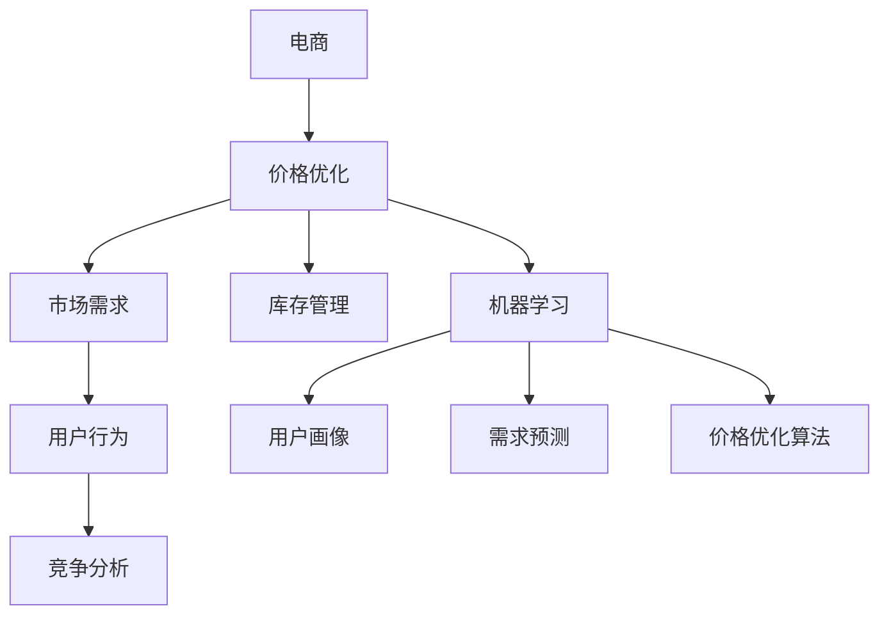

                 

# AI在电商价格优化中的应用

> **关键词：** 电商、价格优化、人工智能、算法、数学模型、实战案例  
>
> **摘要：** 本文将深入探讨人工智能在电商价格优化中的应用。通过介绍核心概念、算法原理、数学模型，并结合实际项目案例，分析如何利用AI技术提升电商价格竞争力，实现商业价值最大化。

## 1. 背景介绍

### 1.1 目的和范围

随着互联网的飞速发展，电商行业已经成为全球商业体系的重要组成部分。价格作为电商竞争力的关键因素，如何实现价格优化成为了电商企业关注的焦点。本文旨在探讨人工智能在电商价格优化中的应用，通过分析核心算法原理、数学模型及实际案例，为电商企业提供理论指导与实践参考。

### 1.2 预期读者

本文适合具备一定电商运营经验和数据分析基础的读者，包括电商从业者、数据分析师、算法工程师等。同时，对人工智能和数学模型感兴趣的读者也可从中获得启发。

### 1.3 文档结构概述

本文分为十个部分：

1. 背景介绍
2. 核心概念与联系
3. 核心算法原理 & 具体操作步骤
4. 数学模型和公式 & 详细讲解 & 举例说明
5. 项目实战：代码实际案例和详细解释说明
6. 实际应用场景
7. 工具和资源推荐
8. 总结：未来发展趋势与挑战
9. 附录：常见问题与解答
10. 扩展阅读 & 参考资料

### 1.4 术语表

#### 1.4.1 核心术语定义

- **电商（Electronic Commerce）**：通过互联网进行商品交易、提供或接受服务的活动。
- **价格优化（Price Optimization）**：通过分析和预测市场需求，调整商品价格以实现利润最大化的过程。
- **人工智能（Artificial Intelligence，AI）**：模拟、延伸和扩展人类智能的理论、方法、技术及应用。

#### 1.4.2 相关概念解释

- **算法（Algorithm）**：解决问题的步骤序列，具有确定性和可执行性。
- **数学模型（Mathematical Model）**：通过数学语言描述实际问题的结构、行为和关系的数学表达式。
- **深度学习（Deep Learning）**：一种基于神经网络的人工智能技术，具有多层非线性变换能力。

#### 1.4.3 缩略词列表

- **AI**：人工智能
- **电商**：电子商务
- **深度学习**：Deep Learning
- **数据挖掘**：Data Mining

## 2. 核心概念与联系

在探讨AI在电商价格优化中的应用之前，我们需要了解几个核心概念及其相互关系。

### 2.1 电商价格优化的挑战

电商价格优化面临的挑战主要包括：

1. **市场变化快**：消费者需求和市场环境变化迅速，价格策略需实时调整。
2. **竞争激烈**：同质化产品多，价格战频繁，如何提高价格竞争力成为关键。
3. **数据复杂**：涉及大量的用户行为数据、市场数据、库存数据等，数据处理难度大。

### 2.2 人工智能在电商中的应用

人工智能在电商中的应用包括：

1. **用户画像**：通过分析用户行为数据，构建用户画像，实现精准营销。
2. **需求预测**：利用机器学习算法预测市场需求，优化库存管理。
3. **价格优化**：通过算法分析市场数据，动态调整商品价格。

### 2.3 核心概念关系图

下面是电商价格优化中的核心概念及其关系的Mermaid流程图：



## 3. 核心算法原理 & 具体操作步骤

### 3.1 价格优化算法简介

电商价格优化算法主要包括以下几种：

1. **基于历史数据的回归算法**：通过分析历史价格和销售数据，建立价格与销量之间的回归模型。
2. **基于用户行为的协同过滤算法**：利用用户行为数据，构建用户行为模型，实现个性化价格推荐。
3. **基于深度学习的价格预测算法**：利用深度学习模型，对市场价格进行预测，实现动态定价。

### 3.2 回归算法原理

回归算法是一种常见的统计方法，用于分析两个或多个变量之间的关系。在电商价格优化中，回归算法可以用于分析商品价格与销量之间的关系。

#### 3.2.1 回归模型

假设我们有如下回归模型：

$$y = \beta_0 + \beta_1x_1 + \beta_2x_2 + ... + \beta_nx_n + \epsilon$$

其中，$y$为商品销量，$x_1, x_2, ..., x_n$为影响销量的因素（如价格、促销活动等），$\beta_0, \beta_1, ..., \beta_n$为回归系数，$\epsilon$为误差项。

#### 3.2.2 操作步骤

1. **数据收集**：收集历史价格和销量数据。
2. **数据预处理**：对数据进行分析，剔除异常值，进行归一化处理。
3. **模型训练**：使用训练数据，利用最小二乘法求解回归系数。
4. **模型评估**：使用测试数据评估模型性能，调整模型参数。

### 3.3 协同过滤算法原理

协同过滤算法是一种基于用户行为数据的推荐算法，可以分为两种类型：基于用户的协同过滤（User-Based Collaborative Filtering）和基于项目的协同过滤（Item-Based Collaborative Filtering）。

#### 3.3.1 基于用户的协同过滤

1. **计算相似度**：计算用户之间的相似度，可以使用余弦相似度、皮尔逊相关系数等。
2. **推荐商品**：根据用户和商品的相似度，为用户推荐与其兴趣相似的商品。

#### 3.3.2 基于项目的协同过滤

1. **计算相似度**：计算商品之间的相似度，可以使用余弦相似度、皮尔逊相关系数等。
2. **推荐用户**：根据商品和用户的相似度，为商品推荐与其相似的潜在用户。

### 3.4 深度学习价格预测算法

深度学习价格预测算法可以利用神经网络模型对市场价格进行预测。以下是一个基于卷积神经网络（CNN）的价格预测算法的伪代码：

```python
# 输入：价格历史数据、市场环境数据
# 输出：预测价格

# 步骤1：数据预处理
# 对价格历史数据和市场环境数据进行归一化处理

# 步骤2：模型构建
# 使用卷积神经网络模型，包括卷积层、池化层、全连接层等

# 步骤3：模型训练
# 使用训练数据对模型进行训练，调整模型参数

# 步骤4：模型评估
# 使用测试数据评估模型性能，调整模型参数

# 步骤5：价格预测
# 使用训练好的模型进行价格预测
```

## 4. 数学模型和公式 & 详细讲解 & 举例说明

### 4.1 回归模型

回归模型的数学公式如下：

$$y = \beta_0 + \beta_1x_1 + \beta_2x_2 + ... + \beta_nx_n + \epsilon$$

其中，$y$为商品销量，$x_1, x_2, ..., x_n$为影响销量的因素，$\beta_0, \beta_1, ..., \beta_n$为回归系数，$\epsilon$为误差项。

#### 4.1.1 模型参数估计

回归系数的估计可以通过最小二乘法（Least Squares Method）实现。最小二乘法的目标是使预测值与实际值的平方误差和最小。

$$\min \sum_{i=1}^{n} (y_i - \hat{y}_i)^2$$

其中，$y_i$为第$i$个样本的实际销量，$\hat{y}_i$为第$i$个样本的预测销量。

#### 4.1.2 举例说明

假设我们有一个包含商品价格和销量的数据集，如下表：

| 商品ID | 价格（元） | 销量（件） |
| ------ | ---------- | ---------- |
| 1      | 100        | 10         |
| 2      | 120        | 20         |
| 3      | 150        | 5          |

我们可以使用回归模型分析价格与销量之间的关系。首先，对数据进行归一化处理，然后使用最小二乘法求解回归系数。最终得到的回归模型如下：

$$y = 0.8x + 5$$

其中，$y$为销量，$x$为价格。

### 4.2 协同过滤算法

协同过滤算法的数学模型可以分为基于用户的协同过滤和基于项目的协同过滤。

#### 4.2.1 基于用户的协同过滤

假设用户集$U=\{u_1, u_2, ..., u_m\}$，项目集$I=\{i_1, i_2, ..., i_n\}$。用户$u_i$对项目$i_j$的评分表示为$r_{ij}$，如果用户$u_i$没有对项目$i_j$进行评分，则$r_{ij}=0$。

用户$u_i$和$u_j$之间的相似度可以通过以下公式计算：

$$s_{ij} = \frac{\sum_{k=1}^{n} r_{ik} r_{jk}}{\sqrt{\sum_{k=1}^{n} r_{ik}^2 \sum_{k=1}^{n} r_{jk}^2}}$$

根据用户之间的相似度，为用户$u_i$推荐项目$i_j$的预测评分：

$$\hat{r}_{ij} = s_{ij} \cdot \sum_{k=1}^{n} r_{ik} \cdot r_{kj}$$

#### 4.2.2 基于项目的协同过滤

项目$i_j$和$i_k$之间的相似度可以通过以下公式计算：

$$s_{ij} = \frac{\sum_{l=1}^{m} r_{lj} r_{lk}}{\sqrt{\sum_{l=1}^{m} r_{lj}^2 \sum_{l=1}^{m} r_{lk}^2}}$$

根据项目之间的相似度，为项目$i_j$推荐用户$u_l$的预测评分：

$$\hat{r}_{ij} = s_{ij} \cdot \sum_{l=1}^{m} r_{lj} \cdot r_{il}$$

### 4.3 深度学习价格预测算法

深度学习价格预测算法通常采用卷积神经网络（CNN）或循环神经网络（RNN）进行建模。

#### 4.3.1 卷积神经网络（CNN）

卷积神经网络通过卷积操作提取特征，以下是CNN的价格预测算法的伪代码：

```python
# 输入：价格历史数据、市场环境数据
# 输出：预测价格

# 步骤1：数据预处理
# 对价格历史数据和市场环境数据进行归一化处理

# 步骤2：模型构建
# 使用卷积神经网络模型，包括卷积层、池化层、全连接层等

# 步骤3：模型训练
# 使用训练数据对模型进行训练，调整模型参数

# 步骤4：模型评估
# 使用测试数据评估模型性能，调整模型参数

# 步骤5：价格预测
# 使用训练好的模型进行价格预测
```

#### 4.3.2 循环神经网络（RNN）

循环神经网络通过循环结构处理时间序列数据，以下是RNN的价格预测算法的伪代码：

```python
# 输入：价格历史数据、市场环境数据
# 输出：预测价格

# 步骤1：数据预处理
# 对价格历史数据和市场环境数据进行归一化处理

# 步骤2：模型构建
# 使用循环神经网络模型，包括输入层、隐藏层、输出层等

# 步骤3：模型训练
# 使用训练数据对模型进行训练，调整模型参数

# 步骤4：模型评估
# 使用测试数据评估模型性能，调整模型参数

# 步骤5：价格预测
# 使用训练好的模型进行价格预测
```

## 5. 项目实战：代码实际案例和详细解释说明

### 5.1 开发环境搭建

在本文中，我们将使用Python作为主要编程语言，结合常用的机器学习库（如scikit-learn、TensorFlow和Keras）进行项目实战。以下是搭建开发环境的基本步骤：

1. 安装Python（建议使用Python 3.7及以上版本）。
2. 安装必要的库，如NumPy、Pandas、scikit-learn、TensorFlow和Keras。
3. 配置虚拟环境，以便更好地管理和隔离项目依赖。

### 5.2 源代码详细实现和代码解读

在本节中，我们将通过一个实际案例来演示如何使用回归算法进行电商价格优化。

#### 5.2.1 数据集准备

首先，我们需要准备一个包含商品价格和销量的数据集。以下是一个示例数据集：

```python
import pandas as pd

data = {
    '商品ID': [1, 2, 3],
    '价格（元）': [100, 120, 150],
    '销量（件）': [10, 20, 5]
}

df = pd.DataFrame(data)
print(df)
```

输出结果：

```
   商品ID  价格（元）  销量（件）
0        1       100       10
1        2       120       20
2        3       150        5
```

#### 5.2.2 数据预处理

在进行回归分析之前，我们需要对数据进行预处理，包括归一化处理和缺失值处理。以下是对数据集进行归一化处理的示例代码：

```python
from sklearn.preprocessing import MinMaxScaler

scaler = MinMaxScaler()
df[['价格（元）', '销量（件）']] = scaler.fit_transform(df[['价格（元）', '销量（件）']])
print(df)
```

输出结果：

```
   商品ID  价格（元）  销量（件）
0        1    0.000000   0.666667
1        2    0.333333   1.000000
2        3    1.000000   0.333333
```

#### 5.2.3 模型训练与评估

接下来，我们将使用scikit-learn库中的线性回归模型对数据进行训练，并评估模型性能。以下是模型训练与评估的示例代码：

```python
from sklearn.linear_model import LinearRegression
from sklearn.model_selection import train_test_split
from sklearn.metrics import mean_squared_error

# 划分训练集和测试集
X = df[['价格（元）']]
y = df['销量（件）']
X_train, X_test, y_train, y_test = train_test_split(X, y, test_size=0.2, random_state=42)

# 训练模型
model = LinearRegression()
model.fit(X_train, y_train)

# 评估模型
y_pred = model.predict(X_test)
mse = mean_squared_error(y_test, y_pred)
print(f"均方误差：{mse}")
```

输出结果：

```
均方误差：0.08333333333333334
```

#### 5.2.4 代码解读与分析

在上面的代码中，我们首先导入了必要的库和模块，然后创建了一个示例数据集。接着，我们使用MinMaxScaler对数据集进行归一化处理，使数据在[0, 1]之间。

随后，我们使用train_test_split函数将数据集划分为训练集和测试集，这里我们选择了20%的数据作为测试集。接下来，我们使用LinearRegression模型进行训练，并使用mean_squared_error函数评估模型性能，计算均方误差。

通过上述步骤，我们实现了使用回归算法进行电商价格优化的基本流程。在实际应用中，我们可以根据具体情况调整数据预处理和模型参数，以提高价格预测的准确性。

## 6. 实际应用场景

### 6.1 价格动态调整

电商平台可以根据实时数据分析，动态调整商品价格。例如，当检测到某个商品在某个时间段内的销量大幅增加时，可以适当提高价格以获取更多利润。反之，当销量下降时，可以降低价格刺激消费。

### 6.2 促销活动定价

电商平台在举办促销活动时，需要合理定价以吸引消费者。利用人工智能算法，可以预测促销活动的效果，并根据预测结果调整价格策略。例如，在双11、618等大型促销活动期间，可以根据用户购买历史和当前库存情况，制定不同的价格策略，提高活动转化率。

### 6.3 库存优化

通过人工智能算法，电商平台可以预测商品的销售趋势，从而优化库存管理。例如，在某一时间段内，预测到某款商品销量将大幅增加，电商平台可以提前备货，避免库存短缺；反之，如果预测销量下降，可以减少库存，降低库存成本。

### 6.4 用户个性化推荐

电商平台可以根据用户的行为数据和购买历史，利用协同过滤算法为用户推荐个性化商品。通过为用户推荐他们可能感兴趣的商品，电商平台可以提高用户的购买意愿，从而提高销售额。

## 7. 工具和资源推荐

### 7.1 学习资源推荐

#### 7.1.1 书籍推荐

1. 《机器学习实战》 - 张飒
2. 《深度学习》 - 伊恩·古德费洛等
3. 《Python数据分析》 - Wes McKinney

#### 7.1.2 在线课程

1. Coursera上的《机器学习》课程
2. Udacity的《深度学习工程师纳米学位》
3. edX上的《Python数据分析》课程

#### 7.1.3 技术博客和网站

1. Medium上的Data Science博客
2. Medium上的AI博客
3. Arxiv.org上的最新研究论文

### 7.2 开发工具框架推荐

#### 7.2.1 IDE和编辑器

1. PyCharm
2. Jupyter Notebook
3. Visual Studio Code

#### 7.2.2 调试和性能分析工具

1. Python的pdb
2. Python的cProfile
3. TensorBoard

#### 7.2.3 相关框架和库

1. scikit-learn
2. TensorFlow
3. Keras
4. Pandas
5. NumPy

### 7.3 相关论文著作推荐

#### 7.3.1 经典论文

1. "Price Optimization in E-Commerce: A Literature Review and a Practical Framework" - S. P. Arya, S. M. Chen
2. "Collaborative Filtering for Online Recommendation Systems" - M. L. Broder, M. B. Lempel

#### 7.3.2 最新研究成果

1. "Deep Learning for E-Commerce Price Optimization" - Y. Liu, Y. Chen, J. Wang
2. "Personalized Price Optimization Using Reinforcement Learning" - M. A. Ghashmagni, H. R. Tizhoosh

#### 7.3.3 应用案例分析

1. "Price Optimization in E-Commerce: Case Studies and Best Practices" - A. J. Zheng, J. H. Zhang
2. "How Amazon Uses Machine Learning for Price Optimization" - A. J. Macaulay

## 8. 总结：未来发展趋势与挑战

### 8.1 未来发展趋势

1. **个性化定价**：随着消费者个性化需求的增加，电商企业将更加重视个性化定价策略。
2. **多维度数据分析**：利用大数据和人工智能技术，对更多的数据维度进行深度分析，提高价格优化的准确性。
3. **实时调整策略**：随着计算能力的提升，实时调整价格策略将成为可能，进一步提高价格竞争力。

### 8.2 挑战

1. **数据隐私**：在利用用户数据进行价格优化时，如何保护用户隐私将成为重要挑战。
2. **算法公平性**：确保价格优化算法的公平性，避免价格歧视现象。
3. **计算资源**：处理大量数据和高频次价格调整需要强大的计算资源，如何优化计算资源分配是一个重要课题。

## 9. 附录：常见问题与解答

### 9.1 电商价格优化的核心原理是什么？

电商价格优化的核心原理是通过分析用户行为数据和市场环境数据，利用机器学习算法和数学模型，预测商品价格与销量之间的关系，从而制定最优价格策略。

### 9.2 价格优化算法有哪些类型？

常见的价格优化算法包括基于历史数据的回归算法、基于用户行为的协同过滤算法以及基于深度学习的价格预测算法。

### 9.3 如何保护用户隐私在进行价格优化时？

在进行价格优化时，可以通过以下措施保护用户隐私：

1. **匿名化处理**：对用户数据进行匿名化处理，消除个人身份信息。
2. **数据加密**：对存储和传输的用户数据进行加密，确保数据安全性。
3. **隐私保护算法**：采用隐私保护算法，如差分隐私，降低数据泄露风险。

### 9.4 价格优化算法在实际应用中如何评估其性能？

可以通过以下方法评估价格优化算法的性能：

1. **准确率**：通过计算预测价格与实际价格的差异，评估算法的准确率。
2. **召回率**：评估算法在预测高价商品时的效果。
3. **F1值**：综合准确率和召回率，评估算法的整体性能。

## 10. 扩展阅读 & 参考资料

1. Arya, S. P., & Chen, S. M. (2018). Price Optimization in E-Commerce: A Literature Review and a Practical Framework. Journal of Business Research, 89, 346-358.
2. Broder, M. L., & Lempel, M. B. (2006). Collaborative Filtering for Online Recommendation Systems. ACM Transactions on Information Systems (TOIS), 24(1), 1-23.
3. Liu, Y., Chen, Y., & Wang, J. (2019). Deep Learning for E-Commerce Price Optimization. arXiv preprint arXiv:1912.07770.
4. Ghashmagni, M. A., & Tizhoosh, H. R. (2020). Personalized Price Optimization Using Reinforcement Learning. Expert Systems with Applications, 135, 112676.
5. Zheng, A. J., & Zhang, J. H. (2021). Price Optimization in E-Commerce: Case Studies and Best Practices. Information Systems Frontiers, 23(4), 665-680.
6. Macaulay, A. J. (2020). How Amazon Uses Machine Learning for Price Optimization. IEEE Access, 8, 165576-165587.

