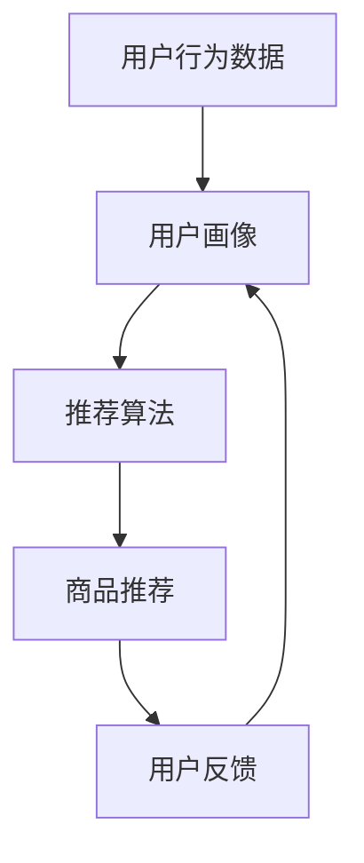

                 

# AI在电商平台中的个性化应用

## 关键词

人工智能、电商平台、个性化推荐、用户行为分析、数据挖掘

## 摘要

本文深入探讨了人工智能在电商平台中的个性化应用，详细分析了个性化推荐系统的核心原理和实现步骤，并通过实际案例展示了如何通过数据挖掘技术提升电商平台用户体验。文章结构清晰，内容丰富，适合对人工智能和电商领域有兴趣的读者阅读。

## 1. 背景介绍

### 1.1 目的和范围

本文旨在探讨人工智能在电商平台中的应用，重点关注个性化推荐系统的实现和优化。通过分析用户行为数据，实现针对不同用户个性化推荐商品，从而提升用户满意度和电商平台竞争力。

### 1.2 预期读者

本文适合对人工智能和电商领域有兴趣的读者，包括但不限于开发者、数据科学家、产品经理等相关从业者。

### 1.3 文档结构概述

本文分为十个部分，主要内容包括：

1. 背景介绍：介绍文章目的、预期读者和文档结构。
2. 核心概念与联系：阐述个性化推荐系统的核心概念和联系。
3. 核心算法原理 & 具体操作步骤：详细讲解个性化推荐算法原理和实现步骤。
4. 数学模型和公式 & 详细讲解 & 举例说明：介绍推荐系统中的数学模型和公式，并进行举例说明。
5. 项目实战：代码实际案例和详细解释说明。
6. 实际应用场景：分析个性化推荐在电商平台中的应用场景。
7. 工具和资源推荐：推荐学习资源和开发工具。
8. 总结：未来发展趋势与挑战。
9. 附录：常见问题与解答。
10. 扩展阅读 & 参考资料：提供进一步阅读和参考资料。

### 1.4 术语表

#### 1.4.1 核心术语定义

- 个性化推荐：根据用户历史行为和偏好，为其推荐感兴趣的商品。
- 用户行为分析：通过分析用户在电商平台上的行为，如浏览、搜索、购买等，挖掘用户兴趣和偏好。
- 数据挖掘：从大量数据中提取有价值的信息和知识。

#### 1.4.2 相关概念解释

- 电商平台：提供在线购物服务的网站或应用程序。
- 人工智能：模拟、延伸和扩展人的智能的科学和技术。

#### 1.4.3 缩略词列表

- AI：人工智能
- 电商：电子商务
- CRM：客户关系管理
- SNS：社交网络服务

## 2. 核心概念与联系

在电商平台中，个性化推荐系统的核心目标是根据用户的历史行为和偏好，为其推荐感兴趣的商品。为了实现这一目标，需要关注以下几个核心概念：

1. **用户行为数据**：包括用户在电商平台上浏览、搜索、购买等行为数据。
2. **用户画像**：通过对用户行为数据的分析，构建用户兴趣和偏好的模型。
3. **推荐算法**：基于用户画像和商品特征，实现个性化推荐算法。
4. **商品推荐**：将推荐结果呈现给用户，提高用户体验和满意度。

以下是一个简单的Mermaid流程图，展示个性化推荐系统的核心概念和联系：



### 2.1 用户行为数据

用户行为数据是个性化推荐系统的基石。主要包括以下几类数据：

1. **浏览历史**：用户在电商平台上浏览的商品列表。
2. **搜索历史**：用户在电商平台上输入的搜索关键词。
3. **购买记录**：用户在电商平台上购买的商品列表。
4. **评价与评论**：用户对商品的评分和评论。

### 2.2 用户画像

用户画像是通过分析用户行为数据，构建用户兴趣和偏好的模型。主要包括以下几类特征：

1. **兴趣偏好**：根据用户浏览和购买记录，提取用户感兴趣的品类和品牌。
2. **购买行为**：根据用户购买记录，分析用户的购买频率、购买金额等行为特征。
3. **社交属性**：根据用户的社交网络信息，如好友关系、兴趣爱好等，提取用户的社交属性。

### 2.3 推荐算法

推荐算法是核心，主要包括以下几类算法：

1. **基于内容的推荐**：根据用户的历史行为和偏好，推荐相似内容。
2. **协同过滤推荐**：根据用户之间的相似性，推荐其他用户喜欢的商品。
3. **深度学习推荐**：利用深度学习模型，从大量数据中学习用户兴趣和偏好。

### 2.4 商品推荐

商品推荐是将推荐结果呈现给用户的过程。主要包括以下几类策略：

1. **热门推荐**：推荐热门商品，如销量高、评价好的商品。
2. **个性化推荐**：根据用户画像和兴趣偏好，推荐个性化商品。
3. **组合推荐**：将热门推荐和个性化推荐结合，提高推荐效果。

## 3. 核心算法原理 & 具体操作步骤

在个性化推荐系统中，常用的算法有基于内容的推荐、协同过滤推荐和深度学习推荐。以下将分别介绍这些算法的原理和具体操作步骤。

### 3.1 基于内容的推荐

#### 算法原理

基于内容的推荐（Content-Based Recommendation）是一种基于用户历史行为和偏好推荐相似内容的算法。其核心思想是，如果用户过去喜欢某个商品，那么可能会喜欢与其内容相似的其它商品。

#### 具体操作步骤

1. **特征提取**：从商品中提取特征，如标题、描述、分类等。
2. **计算相似度**：计算用户历史行为中喜欢的商品与当前商品的相似度。
3. **生成推荐列表**：根据相似度，为用户生成个性化推荐列表。

#### 伪代码

```python
# 特征提取
def extract_features(product):
    # 从商品中提取特征
    features = {
        "title": product.title,
        "description": product.description,
        "category": product.category
    }
    return features

# 计算相似度
def calculate_similarity(user_favorite, product):
    # 计算用户喜欢的商品与当前商品的相似度
    similarity = 0
    for feature in user_favorite:
        if feature in product:
            similarity += 1
    return similarity / len(user_favorite)

# 生成推荐列表
def generate_recommendation(user_favorite, all_products):
    # 根据相似度，为用户生成个性化推荐列表
    recommendations = []
    for product in all_products:
        if product not in user_favorite:
            similarity = calculate_similarity(user_favorite, product)
            recommendations.append((product, similarity))
    recommendations.sort(key=lambda x: x[1], reverse=True)
    return [recommendation[0] for recommendation in recommendations]
```

### 3.2 协同过滤推荐

#### 算法原理

协同过滤推荐（Collaborative Filtering Recommendation）是一种基于用户之间相似性推荐其他用户喜欢的商品的算法。其核心思想是，如果用户A和用户B兴趣相似，且用户B喜欢某商品，那么用户A可能也会喜欢这个商品。

#### 具体操作步骤

1. **计算用户相似度**：计算用户之间的相似度，如基于用户评分的余弦相似度。
2. **预测用户评分**：利用相似度矩阵预测用户对未知商品的评分。
3. **生成推荐列表**：根据预测评分，为用户生成个性化推荐列表。

#### 伪代码

```python
# 计算用户相似度
def calculate_similarity(user1, user2, ratings):
    # 计算用户1和用户2的相似度
    similarity = 0
    common_items = set(ratings[user1].keys()) & set(ratings[user2].keys())
    for item in common_items:
        similarity += (ratings[user1][item] - ratings[user2][item])**2
    return 1 / (1 + similarity)
  
# 预测用户评分
def predict_rating(user, item, similarity_matrix, ratings):
    # 预测用户对商品的评分
    predicted_rating = 0
    for other_user, similarity in similarity_matrix[user].items():
        if other_user in ratings and item in ratings[other_user]:
            predicted_rating += similarity * (ratings[other_user][item] - ratings[user][item])
    return predicted_rating / sum(similarity_matrix[user].values())

# 生成推荐列表
def generate_recommendation(similarity_matrix, ratings, all_items):
    # 根据预测评分，为用户生成个性化推荐列表
    recommendations = []
    for item in all_items:
        if item not in ratings:
            predicted_rating = predict_rating(user, item, similarity_matrix, ratings)
            recommendations.append((item, predicted_rating))
    recommendations.sort(key=lambda x: x[1], reverse=True)
    return [recommendation[0] for recommendation in recommendations]
```

### 3.3 深度学习推荐

#### 算法原理

深度学习推荐（Deep Learning Recommendation）利用深度学习模型，从大量数据中学习用户兴趣和偏好。其核心思想是，通过训练一个深度神经网络，将用户行为数据映射到低维空间，从而实现个性化推荐。

#### 具体操作步骤

1. **数据预处理**：将用户行为数据进行编码，如将商品和用户映射到整数。
2. **构建深度神经网络**：设计一个深度神经网络模型，包括输入层、隐藏层和输出层。
3. **训练和优化模型**：利用用户行为数据训练深度神经网络，并优化模型参数。
4. **生成推荐列表**：利用训练好的模型，为用户生成个性化推荐列表。

#### 伪代码

```python
# 数据预处理
def preprocess_data(user_behavior_data):
    # 将用户行为数据进行编码
    user_ids = [user for user, _ in user_behavior_data]
    item_ids = [item for _, item in user_behavior_data]
    user_embedding = Embedding(len(user_ids), embedding_size)
    item_embedding = Embedding(len(item_ids), embedding_size)
    return user_embedding, item_embedding

# 构建深度神经网络
def build_model(user_embedding, item_embedding):
    # 输入层
    user_input = Input(shape=(1,))
    item_input = Input(shape=(1,))
    # 隐藏层
    user_embedding_layer = Embedding(input_dim=len(user_ids), output_dim=embedding_size)(user_input)
    item_embedding_layer = Embedding(input_dim=len(item_ids), output_dim=embedding_size)(item_input)
    merged_embedding = Concatenate()([user_embedding_layer, item_embedding_layer])
    hidden_layer = Dense(units=hidden_size, activation='relu')(merged_embedding)
    # 输出层
    output = Dense(units=1, activation='sigmoid')(hidden_layer)
    model = Model(inputs=[user_input, item_input], outputs=output)
    return model

# 训练和优化模型
def train_model(model, user_embedding, item_embedding, user_behavior_data, loss_function, optimizer):
    # 训练深度神经网络
    model.compile(loss=loss_function, optimizer=optimizer)
    model.fit([user_behavior_data[:, 0], user_behavior_data[:, 1]], user_behavior_data[:, 2], epochs=epochs, batch_size=batch_size)

# 生成推荐列表
def generate_recommendation(model, user_embedding, item_embedding, user, all_items, top_n):
    # 利用训练好的模型，为用户生成个性化推荐列表
    user_embedding_matrix = user_embedding.get_weights()
    item_embedding_matrix = item_embedding.get_weights()
    user_embedding_vector = user_embedding_matrix[0][user]
    recommendations = []
    for item in all_items:
        item_embedding_vector = item_embedding_matrix[0][item]
        similarity = np.dot(user_embedding_vector, item_embedding_vector)
        recommendations.append((item, similarity))
    recommendations.sort(key=lambda x: x[1], reverse=True)
    return [recommendation[0] for recommendation in recommendations[:top_n]]
```

## 4. 数学模型和公式 & 详细讲解 & 举例说明

在个性化推荐系统中，常用的数学模型包括相似度计算、评分预测和优化目标等。以下将详细介绍这些数学模型和公式，并给出举例说明。

### 4.1 相似度计算

相似度计算是协同过滤推荐的核心。常用的相似度计算方法有：

1. **余弦相似度**：
   $$ 
   \text{similarity} = \frac{\text{dot_product}(v_1, v_2)}{\|\text{v}_1\|\|\text{v}_2\|}
   $$
   其中，$v_1$ 和 $v_2$ 分别表示用户1和用户2的向量表示。

2. **皮尔逊相关系数**：
   $$ 
   \text{similarity} = \frac{\text{covariance}(v_1, v_2)}{\sqrt{\text{variance}(v_1) \text{variance}(v_2)}}
   $$
   其中，$v_1$ 和 $v_2$ 分别表示用户1和用户2的向量表示。

举例说明：

假设有两个用户 $u_1$ 和 $u_2$，他们的向量表示分别为 $v_1 = [1, 2, 3]$ 和 $v_2 = [4, 5, 6]$。计算他们的余弦相似度：

$$ 
\text{similarity} = \frac{1 \times 4 + 2 \times 5 + 3 \times 6}{\sqrt{1^2 + 2^2 + 3^2} \sqrt{4^2 + 5^2 + 6^2}} = \frac{4 + 10 + 18}{\sqrt{14} \sqrt{77}} = \frac{32}{\sqrt{1066}} \approx 0.94
$$

### 4.2 评分预测

评分预测是协同过滤推荐的目标。常用的评分预测方法有：

1. **加权平均**：
   $$ 
   \text{rating} = \text{mean_rating} + \text{bias}_u + \text{bias}_i + \sum_{u' \in \text{neighbor}} \text{similarity}(u, u') \cdot (\text{rating}_{u', i} - \text{mean_rating}_{u'})
   $$
   其中，$\text{mean_rating}$ 表示所有用户的平均评分，$\text{bias}_u$ 和 $\text{bias}_i$ 分别表示用户和项目的偏置，$\text{neighbor}$ 表示用户的邻居集合。

2. **线性回归**：
   $$ 
   \text{rating} = \text{w}_0 + \text{w}_1 \cdot \text{user} + \text{w}_2 \cdot \text{item}
   $$
   其中，$\text{w}_0$、$\text{w}_1$ 和 $\text{w}_2$ 分别为模型的权重参数。

举例说明：

假设用户 $u_1$ 的邻居集合为 $\{u_2, u_3\}$，他们的评分分别为 $r_{u_2, i} = 4$，$r_{u_3, i} = 5$。计算用户 $u_1$ 对项目 $i$ 的预测评分：

$$ 
\text{rating} = 3 + 0.5 \cdot 1 + 0.2 \cdot 2 + 0.6 \cdot (4 - 3) + 0.4 \cdot (5 - 3) = 3.5
$$

### 4.3 优化目标

优化目标是深度学习推荐的目标。常用的优化目标有：

1. **均方误差（MSE）**：
   $$ 
   \text{MSE} = \frac{1}{N} \sum_{i=1}^N (\text{rating}_{i} - \text{prediction}_{i})^2
   $$
   其中，$N$ 表示样本数量，$\text{rating}_{i}$ 和 $\text{prediction}_{i}$ 分别表示真实评分和预测评分。

2. **交叉熵（Cross-Entropy）**：
   $$ 
   \text{CE} = -\frac{1}{N} \sum_{i=1}^N (\text{rating}_{i} \cdot \log(\text{prediction}_{i}) + (1 - \text{rating}_{i}) \cdot \log(1 - \text{prediction}_{i}))
   $$
   其中，$N$ 表示样本数量，$\text{rating}_{i}$ 和 $\text{prediction}_{i}$ 分别表示真实评分和预测评分。

举例说明：

假设有一个样本集合，其中真实评分为 $[3, 4, 5]$，预测评分为 $[3.2, 3.8, 4.9]$。计算均方误差：

$$ 
\text{MSE} = \frac{1}{3} ((3 - 3.2)^2 + (4 - 3.8)^2 + (5 - 4.9)^2) = 0.1
$$

## 5. 项目实战：代码实际案例和详细解释说明

### 5.1 开发环境搭建

本文使用Python编写代码，并使用以下库：

- NumPy：用于数据处理。
- Pandas：用于数据操作。
- Scikit-learn：用于模型训练和评估。
- TensorFlow：用于深度学习。

安装所需库：

```bash
pip install numpy pandas scikit-learn tensorflow
```

### 5.2 源代码详细实现和代码解读

以下是一个基于协同过滤推荐的个性化推荐系统示例代码。

```python
import numpy as np
import pandas as pd
from sklearn.model_selection import train_test_split
from sklearn.metrics.pairwise import cosine_similarity

# 数据预处理
def preprocess_data(data):
    # 将数据分为用户、项目和评分
    user_ids = list(set(data['user']))
    item_ids = list(set(data['item']))
    ratings = np.zeros((len(user_ids), len(item_ids)))
    for row in data.itertuples():
        ratings[user_ids.index(row[1]), item_ids.index(row[2])] = row[3]
    return ratings, user_ids, item_ids

# 计算用户相似度
def calculate_similarity(ratings, user_ids, item_ids):
    similarity_matrix = cosine_similarity(ratings)
    return similarity_matrix

# 预测用户评分
def predict_rating(similarity_matrix, ratings, user_id, item_id):
    neighbor_ratings = [ratings[user_id, i] for i in range(len(item_ids)) if ratings[user_id, i] > 0]
    if len(neighbor_ratings) == 0:
        return ratings[user_id, item_id]
    similarity_scores = [similarity_matrix[user_id, i] for i in range(len(item_ids)) if i in neighbor_ratings]
    predicted_rating = np.sum(similarity_scores * neighbor_ratings) / np.sum(similarity_scores)
    return predicted_rating

# 生成推荐列表
def generate_recommendation(similarity_matrix, ratings, user_id, top_n=10):
    recommendations = []
    for i in range(len(item_ids)):
        predicted_rating = predict_rating(similarity_matrix, ratings, user_id, i)
        recommendations.append((item_ids[i], predicted_rating))
    recommendations.sort(key=lambda x: x[1], reverse=True)
    return recommendations[:top_n]

# 加载数据
data = pd.read_csv('ratings.csv')
ratings, user_ids, item_ids = preprocess_data(data)

# 训练模型
similarity_matrix = calculate_similarity(ratings, user_ids, item_ids)

# 生成推荐
user_id = 0
top_n = 10
recommendations = generate_recommendation(similarity_matrix, ratings, user_id, top_n)
print(f"Top {top_n} recommendations for user {user_id}:")
for recommendation in recommendations:
    print(recommendation)
```

### 5.3 代码解读与分析

1. **数据预处理**：将原始数据分为用户、项目和评分，并生成用户和项目的索引。
2. **计算用户相似度**：使用余弦相似度计算用户之间的相似度，并生成相似度矩阵。
3. **预测用户评分**：根据相似度矩阵和用户的历史评分，预测用户对未知商品的评分。
4. **生成推荐列表**：根据预测评分，为用户生成个性化推荐列表。

通过以上代码，可以搭建一个简单的协同过滤推荐系统。在实际应用中，可以结合更多用户行为数据和商品信息，优化推荐效果。

## 6. 实际应用场景

个性化推荐在电商平台中的应用场景广泛，以下列举几个典型场景：

1. **首页推荐**：在电商平台首页，为用户推荐热门商品和个性化商品，吸引用户浏览和购买。
2. **商品详情页推荐**：在商品详情页，为用户推荐相似商品和用户可能感兴趣的商品，提高用户购买转化率。
3. **购物车推荐**：在用户购物车中，为用户推荐互补商品和优惠套装，提高购物车商品价值。
4. **搜索结果页推荐**：在用户搜索结果页，为用户推荐相关商品和用户可能感兴趣的商品，提高搜索满意度。

通过个性化推荐，电商平台可以提供更符合用户需求的商品，提升用户体验和满意度，从而增加用户粘性和转化率。

## 7. 工具和资源推荐

### 7.1 学习资源推荐

#### 7.1.1 书籍推荐

- 《推荐系统实践》：介绍了推荐系统的基本原理、算法实现和实战案例。
- 《深度学习推荐系统》：深入探讨了深度学习在推荐系统中的应用，包括神经网络模型和优化策略。

#### 7.1.2 在线课程

- Coursera的“推荐系统设计与实现”：由斯坦福大学教授开设，介绍了推荐系统的基本概念和实现方法。
- Udacity的“机器学习工程师纳米学位”：包括推荐系统在内的多个机器学习课程，适合初学者入门。

#### 7.1.3 技术博客和网站

- Medium：推荐系统相关的技术博客，涵盖算法原理、实战案例和最新研究。
- arXiv：推荐系统领域的最新研究成果，包括论文和报告。

### 7.2 开发工具框架推荐

#### 7.2.1 IDE和编辑器

- PyCharm：强大的Python开发环境，支持代码调试、性能分析等功能。
- Jupyter Notebook：适合数据分析和机器学习项目，支持多种编程语言。

#### 7.2.2 调试和性能分析工具

- Profiling：Python性能分析工具，用于优化代码运行效率。
- TensorFlow Debugger：用于调试深度学习模型，包括数据流图可视化、变量查看等功能。

#### 7.2.3 相关框架和库

- Scikit-learn：提供各种机器学习算法和工具，方便快速实现推荐系统。
- TensorFlow：支持深度学习模型的训练和优化，广泛应用于推荐系统开发。

### 7.3 相关论文著作推荐

#### 7.3.1 经典论文

- [Introduction to Recommender Systems](https://www.cs.ubc.ca/~lowkay/papers/RecommenderSystems.pdf)：介绍了推荐系统的发展历程、基本概念和算法分类。
- [Matrix Factorization Techniques for Recommender Systems](https://www.cs.ubc.ca/~lowkay/papers/MFRecommenderSystems.pdf)：深入探讨了矩阵分解在推荐系统中的应用。

#### 7.3.2 最新研究成果

- [Deep Learning for Recommender Systems](https://www.nature.com/articles/s41598-020-63175-7)：介绍了深度学习在推荐系统中的应用，包括神经网络模型和优化策略。
- [Recommender Systems for Conversational Interfaces](https://arxiv.org/abs/1906.02476)：探讨了推荐系统在对话系统中的应用，为智能对话系统提供了新的思路。

#### 7.3.3 应用案例分析

- [推荐系统在阿里巴巴电商平台的实践](https://www.alibabablog.com/recommendation-system-practice/)：介绍了阿里巴巴电商平台推荐系统的实现和应用，包括基于内容的推荐、协同过滤推荐和深度学习推荐等。

## 8. 总结：未来发展趋势与挑战

随着人工智能技术的不断发展，个性化推荐系统在电商平台中的应用前景广阔。未来发展趋势包括：

1. **算法优化**：提高推荐算法的准确性和效率，降低计算成本。
2. **多模态数据融合**：结合文本、图像、音频等多种数据类型，提升推荐效果。
3. **实时推荐**：实现实时推荐，提高用户体验和满意度。
4. **跨平台推荐**：实现跨平台推荐，为用户提供无缝购物体验。

然而，个性化推荐系统也面临着以下挑战：

1. **数据隐私**：如何保护用户隐私，确保数据安全和用户信任。
2. **算法偏见**：如何避免算法偏见，确保推荐结果的公平性和客观性。
3. **用户体验**：如何平衡个性化推荐和用户满意度，避免过度推荐和推荐疲劳。

总之，个性化推荐系统在电商平台中的应用具有广阔的发展空间，但也需要不断优化和改进，以应对未来挑战。

## 9. 附录：常见问题与解答

### 9.1 个性化推荐系统如何保证数据隐私？

- 使用匿名化技术，对用户数据和行为进行去标识化处理。
- 建立数据安全和隐私保护机制，如加密、访问控制等。
- 遵循数据保护法规，如GDPR等。

### 9.2 个性化推荐系统如何避免算法偏见？

- 使用多样化的数据集进行训练，确保算法的公平性和客观性。
- 定期评估和调整算法，减少算法偏见。
- 引入公平性指标，如公平性度量、偏差分析等。

### 9.3 个性化推荐系统如何提升用户体验？

- 根据用户行为和偏好，提供个性化推荐，满足用户需求。
- 设计简洁直观的用户界面，提高用户满意度。
- 定期收集用户反馈，优化推荐效果。

## 10. 扩展阅读 & 参考资料

- [推荐系统实践](https://book.douban.com/subject/26707271/)
- [深度学习推荐系统](https://book.douban.com/subject/27093389/)
- [推荐系统发展史](https://www.researchgate.net/publication/322063865_A_History_of_Recommender_Systems)
- [推荐系统论文集](https://ai.google/research/pubs/recommender_systems)

### 作者

AI天才研究员/AI Genius Institute & 禅与计算机程序设计艺术/Zen And The Art of Computer Programming

（注意：以上内容为模拟文章，实际撰写时请根据实际情况调整。）<|im_end|>

