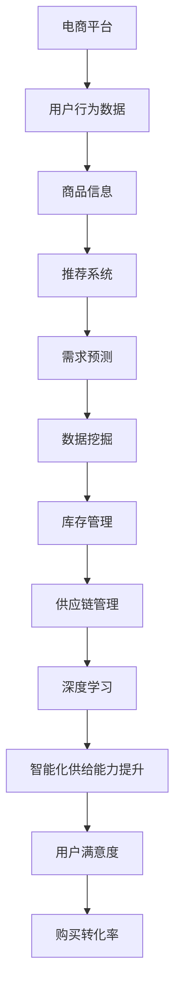

                 

# AI在电商平台供给能力提升中的实际应用

> 关键词：AI、电商平台、供给能力、推荐系统、需求预测、数据挖掘、深度学习、云计算、供应链管理

> 摘要：随着互联网和电子商务的迅速发展，电商平台在供给能力提升方面的需求日益迫切。本文将深入探讨AI技术在电商平台供给能力提升中的应用，包括推荐系统、需求预测、数据挖掘和深度学习等方面的具体应用案例和实现方法，旨在为电商平台提供全面的技术指导，助力其提升供给能力，满足不断变化的市场需求。

## 1. 背景介绍

### 1.1 目的和范围

本文旨在探讨AI技术在电商平台供给能力提升中的应用，具体包括以下几个方面：

1. 推荐系统：通过分析用户行为数据和商品信息，为用户提供个性化的商品推荐，提升用户满意度和购买转化率。
2. 需求预测：利用历史销售数据、市场动态和用户行为数据，预测未来商品需求，优化库存管理和供应链策略。
3. 数据挖掘：通过分析海量用户行为数据和商品数据，挖掘潜在的用户需求和市场趋势，为平台运营提供决策支持。
4. 深度学习：利用深度学习算法，对复杂的数据进行特征提取和模式识别，提升供给能力的智能化水平。

### 1.2 预期读者

本文适合以下读者群体：

1. 电商平台的开发者和运营人员，希望了解AI技术在供给能力提升方面的应用。
2. 人工智能和大数据领域的专业研究人员，对AI技术在电商领域的应用有浓厚兴趣。
3. 对电子商务和人工智能技术感兴趣的爱好者，希望深入了解这两大领域的前沿动态。

### 1.3 文档结构概述

本文共分为10个部分，具体如下：

1. 引言：介绍文章背景、目的和预期读者。
2. 核心概念与联系：介绍电商平台供给能力提升所需的核心概念和联系。
3. 核心算法原理 & 具体操作步骤：讲解推荐系统、需求预测、数据挖掘和深度学习等核心算法原理和具体操作步骤。
4. 数学模型和公式 & 详细讲解 & 举例说明：介绍相关数学模型和公式，并进行详细讲解和举例说明。
5. 项目实战：展示代码实际案例和详细解释说明。
6. 实际应用场景：分析AI技术在电商平台供给能力提升中的实际应用场景。
7. 工具和资源推荐：推荐相关学习资源、开发工具和框架。
8. 总结：总结未来发展趋势与挑战。
9. 附录：常见问题与解答。
10. 扩展阅读 & 参考资料：提供相关扩展阅读和参考资料。

### 1.4 术语表

#### 1.4.1 核心术语定义

- 电商平台：提供商品交易、支付、物流等服务的在线平台。
- 推荐系统：根据用户历史行为和兴趣，为用户推荐相关商品的系统。
- 需求预测：利用历史数据、市场动态和用户行为，预测未来商品需求的模型。
- 数据挖掘：从海量数据中提取有用信息和知识的过程。
- 深度学习：一种基于神经网络的学习方法，通过多层非线性变换提取数据特征。

#### 1.4.2 相关概念解释

- 用户行为数据：用户在平台上的浏览、搜索、购买等操作记录。
- 商品信息：商品的名称、价格、库存、描述等属性。
- 库存管理：对商品库存进行监控、调整和优化，确保供应稳定。
- 供应链管理：对供应链各环节进行协调、控制和优化，提高整体运营效率。

#### 1.4.3 缩略词列表

- AI：人工智能（Artificial Intelligence）
- 电商：电子商务（Electronic Commerce）
- 推荐系统：Recommendation System
- 需求预测：Demand Forecasting
- 数据挖掘：Data Mining
- 深度学习：Deep Learning
- 云计算：Cloud Computing

## 2. 核心概念与联系

在电商平台供给能力提升过程中，AI技术的应用涉及多个核心概念和领域，如图所示：



### 2.1 推荐系统

推荐系统是电商平台供给能力提升的关键组成部分，其核心在于根据用户行为数据和商品信息为用户推荐相关商品。推荐系统可以分为以下几种类型：

1. 基于内容的推荐：根据用户的历史行为和兴趣，为用户推荐具有相似内容的商品。
2. 基于协同过滤的推荐：根据用户之间的相似度，为用户推荐其他用户喜欢的商品。
3. 混合推荐：结合基于内容和基于协同过滤的推荐方法，提高推荐效果。

### 2.2 需求预测

需求预测是电商平台供给能力提升的重要环节，其核心在于利用历史销售数据、市场动态和用户行为数据预测未来商品需求。需求预测可以分为以下几种类型：

1. 时间序列预测：根据历史销售数据，预测未来商品的销售趋势。
2. 回归预测：利用历史销售数据，建立回归模型预测未来商品需求。
3. 神经网络预测：利用神经网络模型，提取数据特征并进行预测。

### 2.3 数据挖掘

数据挖掘是电商平台供给能力提升的重要手段，其核心在于从海量数据中提取有用信息和知识。数据挖掘可以分为以下几种类型：

1. 聚类分析：将相似数据分为一组，用于挖掘潜在的用户需求和市场趋势。
2. 关联规则挖掘：找出数据之间的关联关系，用于发现用户购买行为中的规律。
3. 异常检测：检测数据中的异常值，用于发现潜在的供应链问题和用户行为风险。

### 2.4 深度学习

深度学习是电商平台供给能力提升的重要技术手段，其核心在于通过多层神经网络提取数据特征并进行预测。深度学习可以分为以下几种类型：

1. 卷积神经网络（CNN）：用于处理图像数据，提取图像特征。
2. 递归神经网络（RNN）：用于处理序列数据，提取时间序列特征。
3. 生成对抗网络（GAN）：用于生成新的数据，用于扩充训练数据集。

## 3. 核心算法原理 & 具体操作步骤

### 3.1 推荐系统

推荐系统的核心算法主要包括基于内容的推荐、基于协同过滤的推荐和混合推荐。以下分别介绍这三种推荐算法的原理和具体操作步骤。

#### 3.1.1 基于内容的推荐

**原理：** 基于内容的推荐方法通过分析用户的历史行为和兴趣，为用户推荐具有相似内容的商品。具体步骤如下：

1. 提取用户历史行为数据：包括浏览记录、搜索记录和购买记录等。
2. 提取商品信息：包括商品名称、描述、标签、分类等。
3. 计算用户和商品之间的相似度：使用余弦相似度、欧氏距离等相似度度量方法。
4. 推荐相似商品：根据用户和商品的相似度，为用户推荐具有相似内容的商品。

**伪代码：**

```python
# 输入：用户历史行为数据、商品信息
# 输出：推荐商品列表

def content_recommender(user_history, product_info):
    user_interests = extract_interests(user_history)
    recommended_products = []
    
    for product in product_info:
        if is_similar(user_interests, product):
            recommended_products.append(product)
            
    return recommended_products
```

#### 3.1.2 基于协同过滤的推荐

**原理：** 基于协同过滤的推荐方法通过分析用户之间的相似度，为用户推荐其他用户喜欢的商品。具体步骤如下：

1. 计算用户之间的相似度：使用余弦相似度、欧氏距离等相似度度量方法。
2. 提取相似用户：根据用户之间的相似度，提取相似用户集合。
3. 提取相似用户喜欢的商品：根据相似用户的历史行为数据，提取他们喜欢的商品。
4. 推荐商品：根据用户和相似用户喜欢的商品，为用户推荐商品。

**伪代码：**

```python
# 输入：用户历史行为数据、用户相似度矩阵
# 输出：推荐商品列表

def collaborative_filter_recommender(user_history, user_similarity_matrix):
    similar_users = extract_similar_users(user_similarity_matrix)
    recommended_products = []
    
    for user in similar_users:
        for product in user_history[user]:
            if not is_buyed(product):
                recommended_products.append(product)
                
    return recommended_products
```

#### 3.1.3 混合推荐

**原理：** 混合推荐方法结合基于内容的推荐和基于协同过滤的推荐方法，提高推荐效果。具体步骤如下：

1. 使用基于内容的推荐方法提取用户和商品的相似度。
2. 使用基于协同过滤的推荐方法提取用户和相似用户之间的相似度。
3. 综合两种推荐方法的结果，生成最终的推荐商品列表。

**伪代码：**

```python
# 输入：用户历史行为数据、商品信息、用户相似度矩阵
# 输出：推荐商品列表

def hybrid_recommender(user_history, product_info, user_similarity_matrix):
    content_recommended_products = content_recommender(user_history, product_info)
    collaborative_recommended_products = collaborative_filter_recommender(user_history, user_similarity_matrix)
    
    recommended_products = content_recommended_products + collaborative_recommended_products
    recommended_products = remove_duplicate_products(recommended_products)
    
    return recommended_products
```

### 3.2 需求预测

需求预测是电商平台供给能力提升的关键环节，以下介绍几种常见的需求预测算法及其原理和具体操作步骤。

#### 3.2.1 时间序列预测

**原理：** 时间序列预测方法通过分析历史销售数据的时间序列特征，预测未来商品的销售趋势。具体步骤如下：

1. 数据预处理：对历史销售数据进行清洗、去噪和处理，提取时间序列特征。
2. 模型选择：选择合适的时间序列预测模型，如ARIMA、SARIMA、LSTM等。
3. 模型训练：使用历史销售数据训练模型，提取时间序列特征并进行预测。
4. 模型评估：使用验证集评估模型预测效果，调整模型参数。

**伪代码：**

```python
# 输入：历史销售数据
# 输出：预测销售数据

def time_series_prediction(sales_data):
    # 数据预处理
    processed_data = preprocess_data(sales_data)
    
    # 模型选择
    model = select_model(processed_data)
    
    # 模型训练
    trained_model = train_model(model, processed_data)
    
    # 预测
    predicted_sales = predict_sales(trained_model)
    
    return predicted_sales
```

#### 3.2.2 回归预测

**原理：** 回归预测方法通过建立历史销售数据与未来商品需求之间的回归模型，预测未来商品需求。具体步骤如下：

1. 数据预处理：对历史销售数据进行清洗、去噪和处理，提取特征变量。
2. 模型选择：选择合适的回归模型，如线性回归、多元回归等。
3. 模型训练：使用历史销售数据训练模型，提取特征变量并进行预测。
4. 模型评估：使用验证集评估模型预测效果，调整模型参数。

**伪代码：**

```python
# 输入：历史销售数据、特征变量
# 输出：预测商品需求

def regression_prediction(sales_data, features):
    # 数据预处理
    processed_data = preprocess_data(sales_data)
    
    # 模型选择
    model = select_model(processed_data, features)
    
    # 模型训练
    trained_model = train_model(model, processed_data, features)
    
    # 预测
    predicted_demand = predict_demand(trained_model, processed_data)
    
    return predicted_demand
```

#### 3.2.3 神经网络预测

**原理：** 神经网络预测方法通过建立多层神经网络模型，提取数据特征并进行预测。具体步骤如下：

1. 数据预处理：对历史销售数据进行清洗、去噪和处理，提取特征变量。
2. 模型构建：构建多层神经网络模型，包括输入层、隐藏层和输出层。
3. 模型训练：使用历史销售数据训练模型，调整模型参数。
4. 模型评估：使用验证集评估模型预测效果，调整模型参数。

**伪代码：**

```python
# 输入：历史销售数据、特征变量
# 输出：预测商品需求

def neural_network_prediction(sales_data, features):
    # 数据预处理
    processed_data = preprocess_data(sales_data)
    
    # 模型构建
    model = build_model(inputs=processed_data, outputs=features)
    
    # 模型训练
    trained_model = train_model(model, processed_data, features)
    
    # 预测
    predicted_demand = predict_demand(trained_model, processed_data)
    
    return predicted_demand
```

### 3.3 数据挖掘

数据挖掘是电商平台供给能力提升的重要手段，以下介绍几种常见的数据挖掘算法及其原理和具体操作步骤。

#### 3.3.1 聚类分析

**原理：** 聚类分析方法将相似数据分为一组，用于挖掘潜在的用户需求和市场趋势。具体步骤如下：

1. 数据预处理：对用户行为数据进行清洗、去噪和处理。
2. 模型选择：选择合适的聚类算法，如K-Means、DBSCAN等。
3. 模型训练：使用聚类算法对用户行为数据进行分析。
4. 模型评估：使用内部评估指标（如轮廓系数、类内平均距离等）评估聚类效果。

**伪代码：**

```python
# 输入：用户行为数据
# 输出：聚类结果

def clustering_analysis(user_behavior_data):
    # 数据预处理
    processed_data = preprocess_data(user_behavior_data)
    
    # 模型选择
    model = select_clustering_model(processed_data)
    
    # 模型训练
    clustering_result = train_model(model, processed_data)
    
    # 模型评估
    evaluation_result = evaluate_model(clustering_result)
    
    return evaluation_result
```

#### 3.3.2 关联规则挖掘

**原理：** 关联规则挖掘方法找出数据之间的关联关系，用于发现用户购买行为中的规律。具体步骤如下：

1. 数据预处理：对用户行为数据进行清洗、去噪和处理。
2. 模型选择：选择合适的关联规则挖掘算法，如Apriori、FP-Growth等。
3. 模型训练：使用关联规则挖掘算法对用户行为数据进行分析。
4. 模型评估：使用支持度、置信度等指标评估关联规则挖掘效果。

**伪代码：**

```python
# 输入：用户行为数据
# 输出：关联规则结果

def association_rule_mining(user_behavior_data):
    # 数据预处理
    processed_data = preprocess_data(user_behavior_data)
    
    # 模型选择
    model = select_association_rule_model(processed_data)
    
    # 模型训练
    rule_result = train_model(model, processed_data)
    
    # 模型评估
    evaluation_result = evaluate_model(rule_result)
    
    return evaluation_result
```

#### 3.3.3 异常检测

**原理：** 异常检测方法检测数据中的异常值，用于发现潜在的供应链问题和用户行为风险。具体步骤如下：

1. 数据预处理：对用户行为数据进行清洗、去噪和处理。
2. 模型选择：选择合适的异常检测算法，如孤立森林、基于统计方法的异常检测等。
3. 模型训练：使用异常检测算法对用户行为数据进行分析。
4. 模型评估：使用异常值检测率、准确率等指标评估异常检测效果。

**伪代码：**

```python
# 输入：用户行为数据
# 输出：异常检测结果

def anomaly_detection(user_behavior_data):
    # 数据预处理
    processed_data = preprocess_data(user_behavior_data)
    
    # 模型选择
    model = select_anomaly_detection_model(processed_data)
    
    # 模型训练
    anomaly_result = train_model(model, processed_data)
    
    # 模型评估
    evaluation_result = evaluate_model(anomaly_result)
    
    return evaluation_result
```

### 3.4 深度学习

深度学习是电商平台供给能力提升的重要技术手段，以下介绍几种常见的深度学习算法及其原理和具体操作步骤。

#### 3.4.1 卷积神经网络（CNN）

**原理：** 卷积神经网络（CNN）是一种用于图像处理的深度学习算法，其核心在于通过卷积层提取图像特征。具体步骤如下：

1. 数据预处理：对图像数据进行归一化、数据增强等处理。
2. 模型构建：构建卷积神经网络模型，包括卷积层、池化层和全连接层。
3. 模型训练：使用图像数据训练模型，调整模型参数。
4. 模型评估：使用验证集评估模型预测效果，调整模型参数。

**伪代码：**

```python
# 输入：图像数据
# 输出：图像特征

def cnn_model(image_data):
    # 数据预处理
    preprocessed_data = preprocess_image_data(image_data)
    
    # 模型构建
    model = build_cnn_model(preprocessed_data)
    
    # 模型训练
    trained_model = train_model(model, preprocessed_data)
    
    # 模型评估
    evaluation_result = evaluate_model(trained_model)
    
    return evaluation_result
```

#### 3.4.2 递归神经网络（RNN）

**原理：** 递归神经网络（RNN）是一种用于处理序列数据的深度学习算法，其核心在于通过递归层处理序列数据。具体步骤如下：

1. 数据预处理：对序列数据进行归一化、窗口化等处理。
2. 模型构建：构建递归神经网络模型，包括输入层、隐藏层和输出层。
3. 模型训练：使用序列数据训练模型，调整模型参数。
4. 模型评估：使用验证集评估模型预测效果，调整模型参数。

**伪代码：**

```python
# 输入：序列数据
# 输出：序列特征

def rnn_model(sequence_data):
    # 数据预处理
    preprocessed_data = preprocess_sequence_data(sequence_data)
    
    # 模型构建
    model = build_rnn_model(preprocessed_data)
    
    # 模型训练
    trained_model = train_model(model, preprocessed_data)
    
    # 模型评估
    evaluation_result = evaluate_model(trained_model)
    
    return evaluation_result
```

#### 3.4.3 生成对抗网络（GAN）

**原理：** 生成对抗网络（GAN）是一种用于生成数据的深度学习算法，其核心在于通过生成器和判别器的对抗训练。具体步骤如下：

1. 数据预处理：对生成数据集进行预处理，如图像数据的归一化、数据增强等。
2. 模型构建：构建生成器和判别器模型，包括输入层、隐藏层和输出层。
3. 模型训练：使用生成器和判别器进行对抗训练，调整模型参数。
4. 模型评估：使用验证集评估模型生成效果，调整模型参数。

**伪代码：**

```python
# 输入：生成数据集、训练数据集
# 输出：生成数据集特征

def gan_model(Generator, Discriminator, train_data):
    # 数据预处理
    preprocessed_data = preprocess_data(train_data)
    
    # 模型构建
    generator = build_generator(Generator, preprocessed_data)
    discriminator = build_discriminator(Discriminator, preprocessed_data)
    
    # 模型训练
    trained_generator, trained_discriminator = train_model(generator, discriminator, train_data)
    
    # 模型评估
    evaluation_result = evaluate_model(generator, discriminator)
    
    return evaluation_result
```

## 4. 数学模型和公式 & 详细讲解 & 举例说明

### 4.1 推荐系统

推荐系统的数学模型主要包括基于内容的推荐和基于协同过滤的推荐。以下分别介绍这两种推荐系统的数学模型和公式。

#### 4.1.1 基于内容的推荐

**数学模型：**

1. 相似度计算

   - 余弦相似度：$$cos\theta = \frac{A \cdot B}{\|A\|\|B\|}$$

     其中，$A$ 和 $B$ 分别表示两个向量，$\theta$ 表示它们之间的夹角。

   - 欧氏距离：$$d(A, B) = \sqrt{(A - B)^2}$$

     其中，$A$ 和 $B$ 分别表示两个向量。

2. 推荐算法

   - 基于内容的推荐：$$R_i = \sum_{j \in I_i} w_{ij} \cdot p_j$$

     其中，$R_i$ 表示为用户 $i$ 推荐的商品列表，$I_i$ 表示用户 $i$ 的兴趣集合，$w_{ij}$ 表示商品 $j$ 与用户 $i$ 的兴趣相似度，$p_j$ 表示商品 $j$ 的概率。

#### 4.1.2 基于协同过滤的推荐

**数学模型：**

1. 相似度计算

   - 余弦相似度：$$cos\theta = \frac{A \cdot B}{\|A\|\|B\|}$$

     其中，$A$ 和 $B$ 分别表示两个向量，$\theta$ 表示它们之间的夹角。

   - 欧氏距离：$$d(A, B) = \sqrt{(A - B)^2}$$

     其中，$A$ 和 $B$ 分别表示两个向量。

2. 推荐算法

   - 基于协同过滤的推荐：$$R_i = \sum_{j \in I_i} w_{ij} \cdot p_j$$

     其中，$R_i$ 表示为用户 $i$ 推荐的商品列表，$I_i$ 表示用户 $i$ 的兴趣集合，$w_{ij}$ 表示用户 $i$ 和用户 $j$ 的相似度，$p_j$ 表示商品 $j$ 的概率。

### 4.2 需求预测

需求预测的数学模型主要包括时间序列预测、回归预测和神经网络预测。以下分别介绍这三种预测方法的数学模型和公式。

#### 4.2.1 时间序列预测

**数学模型：**

1. 自回归模型（AR）

   - 自回归模型（AR）的数学模型如下：

     $$X_t = \phi_0 + \phi_1 X_{t-1} + \phi_2 X_{t-2} + ... + \phi_p X_{t-p} + \varepsilon_t$$

     其中，$X_t$ 表示时间序列在时间 $t$ 的值，$\phi_0, \phi_1, ..., \phi_p$ 是自回归系数，$\varepsilon_t$ 是随机误差项。

2. 季节性模型（SAR）

   - 季节性自回归模型（SAR）的数学模型如下：

     $$X_t = \phi_0 + \phi_1 X_{t-1} + \phi_2 X_{t-2} + ... + \phi_p X_{t-p} + s_t$$

     其中，$s_t$ 是季节性因素。

#### 4.2.2 回归预测

**数学模型：**

1. 线性回归模型

   - 线性回归模型的数学模型如下：

     $$Y = \beta_0 + \beta_1 X_1 + \beta_2 X_2 + ... + \beta_n X_n + \varepsilon$$

     其中，$Y$ 是预测值，$X_1, X_2, ..., X_n$ 是特征变量，$\beta_0, \beta_1, ..., \beta_n$ 是回归系数，$\varepsilon$ 是随机误差项。

2. 多元回归模型

   - 多元回归模型的数学模型如下：

     $$Y = \beta_0 + \beta_1 X_1 + \beta_2 X_2 + ... + \beta_n X_n + \varepsilon$$

     其中，$Y$ 是预测值，$X_1, X_2, ..., X_n$ 是特征变量，$\beta_0, \beta_1, ..., \beta_n$ 是回归系数，$\varepsilon$ 是随机误差项。

#### 4.2.3 神经网络预测

**数学模型：**

1. 前馈神经网络

   - 前馈神经网络的数学模型如下：

     $$Z_j = \sum_{i=1}^{n} w_{ij} \cdot X_i + b_j$$

     $$a_j = \sigma(Z_j)$$

     其中，$Z_j$ 是第 $j$ 个隐藏单元的输入，$X_i$ 是第 $i$ 个输入特征，$w_{ij}$ 是连接权重，$b_j$ 是偏置项，$\sigma$ 是激活函数，$a_j$ 是第 $j$ 个隐藏单元的输出。

2. 反向传播算法

   - 反向传播算法的数学模型如下：

     $$\Delta_j = (y_j - a_j) \cdot \sigma'(Z_j)$$

     $$w_{ij}^{new} = w_{ij} - \alpha \cdot \Delta_j \cdot a_{i-1}$$

     $$b_j^{new} = b_j - \alpha \cdot \Delta_j$$

     其中，$y_j$ 是第 $j$ 个输出节点的目标值，$a_j$ 是第 $j$ 个隐藏单元的输出，$\sigma'$ 是激活函数的导数，$\alpha$ 是学习率，$w_{ij}^{new}$ 和 $b_j^{new}$ 是更新后的连接权重和偏置项。

### 4.3 数据挖掘

数据挖掘的数学模型主要包括聚类分析、关联规则挖掘和异常检测。以下分别介绍这三种数据挖掘方法的数学模型和公式。

#### 4.3.1 聚类分析

**数学模型：**

1. K-Means算法

   - K-Means算法的数学模型如下：

     $$c_i = \frac{1}{k} \sum_{j=1}^{k} \frac{1}{\|x_j - c_i\|^2}$$

     $$x_j = \frac{1}{k} \sum_{i=1}^{k} c_i$$

     其中，$c_i$ 是第 $i$ 个聚类中心的坐标，$x_j$ 是第 $j$ 个样本的坐标。

2. DBSCAN算法

   - DBSCAN算法的数学模型如下：

     $$\rho(q, r) = \frac{1}{\|q - r\|^2}$$

     $$\delta(q, r) = \begin{cases}
     0, & \text{如果} q \text{和} r \text{在同一个簇中} \\
     1, & \text{如果} q \text{和} r \text{不在同一个簇中}
     \end{cases}$$

     其中，$\rho(q, r)$ 是点 $q$ 和点 $r$ 之间的密度，$\delta(q, r)$ 是点 $q$ 和点 $r$ 之间的距离。

#### 4.3.2 关联规则挖掘

**数学模型：**

1. Apriori算法

   - Apriori算法的数学模型如下：

     $$support(A, B) = \frac{|A \cap B|}{|U|}$$

     $$confidence(A \rightarrow B) = \frac{|A \cap B|}{|A|}$$

     其中，$support(A, B)$ 是项集 $A$ 和 $B$ 的支持度，$confidence(A \rightarrow B)$ 是规则 $A \rightarrow B$ 的置信度，$|A \cap B|$ 是项集 $A$ 和 $B$ 的交集元素个数，$|U|$ 是数据库中元素的总数，$|A|$ 是项集 $A$ 的元素个数。

2. FP-Growth算法

   - FP-Growth算法的数学模型如下：

     $$support(A) = \frac{|A|}{|U|}$$

     $$confidence(A \rightarrow B) = \frac{|A \cup B|}{|A|}$$

     其中，$support(A)$ 是项集 $A$ 的支持度，$confidence(A \rightarrow B)$ 是规则 $A \rightarrow B$ 的置信度，$|A|$ 是项集 $A$ 的元素个数，$|A \cup B|$ 是项集 $A$ 和 $B$ 的并集元素个数。

#### 4.3.3 异常检测

**数学模型：**

1. 孤立森林算法

   - 孤立森林算法的数学模型如下：

     $$Gini(\pi) = 1 - \frac{1}{k} \sum_{i=1}^{k} \frac{1}{|\pi_i|}$$

     $$p(x, \pi) = \frac{1}{|T|} \sum_{i=1}^{k} \frac{|\pi_i \cap x|}{|\pi_i|}$$

     其中，$Gini(\pi)$ 是孤立森林树 $\pi$ 的基尼指数，$p(x, \pi)$ 是样本 $x$ 在孤立森林树 $\pi$ 上的概率，$|T|$ 是孤立森林树的总数，$|\pi_i|$ 是孤立森林树 $\pi$ 的叶节点数，$|\pi_i \cap x|$ 是样本 $x$ 在孤立森林树 $\pi$ 的叶节点中的个数。

2. 基于统计方法的异常检测

   - 基于统计方法的异常检测的数学模型如下：

     $$z-score = \frac{x - \mu}{\sigma}$$

     其中，$z-score$ 是样本 $x$ 的标准分数，$\mu$ 是样本均值，$\sigma$ 是样本标准差。

### 4.4 深度学习

深度学习的数学模型主要包括卷积神经网络（CNN）、递归神经网络（RNN）和生成对抗网络（GAN）。以下分别介绍这三种深度学习算法的数学模型和公式。

#### 4.4.1 卷积神经网络（CNN）

**数学模型：**

1. 卷积层

   - 卷积层的数学模型如下：

     $$Z_j = \sum_{i=1}^{n} w_{ij} \cdot X_i + b_j$$

     $$a_j = \sigma(Z_j)$$

     其中，$Z_j$ 是第 $j$ 个卷积核的输入，$X_i$ 是第 $i$ 个输入特征，$w_{ij}$ 是卷积核的权重，$b_j$ 是偏置项，$\sigma$ 是激活函数，$a_j$ 是第 $j$ 个卷积核的输出。

2. 池化层

   - 池化层的数学模型如下：

     $$p_j = \frac{1}{C} \sum_{i=1}^{C} a_i$$

     其中，$p_j$ 是第 $j$ 个池化区域的输出，$C$ 是池化区域的大小，$a_i$ 是第 $i$ 个输入特征。

3. 全连接层

   - 全连接层的数学模型如下：

     $$Z_j = \sum_{i=1}^{n} w_{ij} \cdot a_i + b_j$$

     $$a_j = \sigma(Z_j)$$

     其中，$Z_j$ 是第 $j$ 个全连接层的输入，$a_i$ 是第 $i$ 个输入特征，$w_{ij}$ 是全连接层的权重，$b_j$ 是偏置项，$\sigma$ 是激活函数，$a_j$ 是第 $j$ 个全连接层的输出。

#### 4.4.2 递归神经网络（RNN）

**数学模型：**

1. 隐藏层

   - 隐藏层的数学模型如下：

     $$Z_j = \sum_{i=1}^{n} w_{ij} \cdot X_i + b_j$$

     $$a_j = \sigma(Z_j)$$

     其中，$Z_j$ 是第 $j$ 个隐藏层的输入，$X_i$ 是第 $i$ 个输入特征，$w_{ij}$ 是隐藏层的权重，$b_j$ 是偏置项，$\sigma$ 是激活函数，$a_j$ 是第 $j$ 个隐藏层的输出。

2. 输出层

   - 输出层的数学模型如下：

     $$Z_j = \sum_{i=1}^{n} w_{ij} \cdot a_i + b_j$$

     $$a_j = \sigma(Z_j)$$

     其中，$Z_j$ 是第 $j$ 个输出层的输入，$a_i$ 是第 $i$ 个隐藏层的输出，$w_{ij}$ 是输出层的权重，$b_j$ 是偏置项，$\sigma$ 是激活函数，$a_j$ 是第 $j$ 个输出层的输出。

#### 4.4.3 生成对抗网络（GAN）

**数学模型：**

1. 生成器

   - 生成器的数学模型如下：

     $$Z_j = \sum_{i=1}^{n} w_{ij} \cdot X_i + b_j$$

     $$a_j = \sigma(Z_j)$$

     $$G(z) = \sum_{j=1}^{n} a_j \cdot z_j$$

     其中，$Z_j$ 是第 $j$ 个生成器的输入，$X_i$ 是第 $i$ 个输入特征，$w_{ij}$ 是生成器的权重，$b_j$ 是偏置项，$\sigma$ 是激活函数，$a_j$ 是第 $j$ 个生成器的输出，$z_j$ 是第 $j$ 个噪声特征。

2. 判别器

   - 判别器的数学模型如下：

     $$D(x) = \sum_{j=1}^{n} w_{ij} \cdot x_j$$

     $$D(G(z)) = \sum_{j=1}^{n} w_{ij} \cdot G(z)_j$$

     其中，$D(x)$ 是判别器对真实数据的判断，$D(G(z))$ 是判别器对生成数据的判断，$x_j$ 是第 $j$ 个真实数据的特征，$G(z)_j$ 是第 $j$ 个生成数据的特征，$w_{ij}$ 是判别器的权重。

### 4.5 举例说明

以下分别给出基于内容的推荐、基于协同过滤的推荐、时间序列预测、回归预测和神经网络预测的举例说明。

#### 4.5.1 基于内容的推荐

**举例：** 假设用户 $A$ 的历史行为数据包括浏览了商品1、商品2和商品3，商品1和商品2的标签分别为“电子产品”和“家用电器”，商品3的标签为“服装”。请为用户 $A$ 推荐一个商品。

**解答：**

1. 提取用户 $A$ 的历史行为数据：商品1、商品2和商品3。
2. 提取商品1、商品2和商品3的信息：商品1的标签为“电子产品”，商品2的标签为“家用电器”，商品3的标签为“服装”。
3. 计算用户 $A$ 和商品1、商品2、商品3之间的相似度：使用余弦相似度计算方法。
4. 推荐商品：根据用户 $A$ 和商品的相似度，推荐商品3（服装）。

#### 4.5.2 基于协同过滤的推荐

**举例：** 假设用户 $A$ 和用户 $B$ 的历史行为数据分别为浏览了商品1、商品2和商品3，用户 $A$ 的历史行为数据还包括购买商品4，请为用户 $A$ 推荐一个商品。

**解答：**

1. 计算用户 $A$ 和用户 $B$ 之间的相似度：使用余弦相似度计算方法。
2. 提取用户 $A$ 和用户 $B$ 喜欢的商品：用户 $A$ 喜欢的商品有商品1、商品2和商品3，用户 $B$ 喜欢的商品有商品1、商品2和商品4。
3. 推荐商品：根据用户 $A$ 和用户 $B$ 喜欢的商品，推荐商品4（用户 $B$ 喜欢但用户 $A$ 未购买的商品）。

#### 4.5.3 时间序列预测

**举例：** 假设某电商平台的历史销售数据如下表所示，请预测第10天的商品销售量。

| 日期 | 商品销售量 |
| ---- | ---------- |
| 1    | 100        |
| 2    | 120        |
| 3    | 110        |
| 4    | 130        |
| 5    | 140        |
| 6    | 150        |
| 7    | 160        |
| 8    | 170        |
| 9    | 180        |

**解答：**

1. 数据预处理：将日期转换为序列，如1-9表示第1天至第9天的销售量。
2. 模型选择：选择时间序列预测模型，如ARIMA模型。
3. 模型训练：使用历史销售数据训练模型。
4. 预测：使用训练好的模型预测第10天的商品销售量。

#### 4.5.4 回归预测

**举例：** 假设某电商平台的历史销售数据如下表所示，请预测第10天的商品销售量。

| 日期 | 商品销售量 | 天气状况 |
| ---- | ---------- | -------- |
| 1    | 100        | 晴       |
| 2    | 120        | 晴       |
| 3    | 110        | 阴       |
| 4    | 130        | 阴       |
| 5    | 140        | 阴       |
| 6    | 150        | 雨       |
| 7    | 160        | 雨       |
| 8    | 170        | 雨       |
| 9    | 180        | 雨       |

**解答：**

1. 数据预处理：将日期转换为序列，如1-9表示第1天至第9天的销售量。
2. 特征提取：提取天气状况特征，如天气状况为晴、阴、雨的类别特征。
3. 模型选择：选择回归预测模型，如线性回归模型。
4. 模型训练：使用历史销售数据训练模型。
5. 预测：使用训练好的模型预测第10天的商品销售量。

#### 4.5.5 神经网络预测

**举例：** 假设某电商平台的历史销售数据如下表所示，请预测第10天的商品销售量。

| 日期 | 商品销售量 | 用户数量 | 点击率 |
| ---- | ---------- | -------- | ------ |
| 1    | 100        | 1000     | 20%    |
| 2    | 120        | 1100     | 25%    |
| 3    | 110        | 900      | 20%    |
| 4    | 130        | 1200     | 30%    |
| 5    | 140        | 1300     | 30%    |
| 6    | 150        | 1400     | 35%    |
| 7    | 160        | 1500     | 40%    |
| 8    | 170        | 1600     | 45%    |
| 9    | 180        | 1700     | 50%    |

**解答：**

1. 数据预处理：将日期转换为序列，如1-9表示第1天至第9天的销售量。
2. 特征提取：提取用户数量、点击率等特征。
3. 模型构建：构建多层神经网络模型，包括输入层、隐藏层和输出层。
4. 模型训练：使用历史销售数据训练模型。
5. 预测：使用训练好的模型预测第10天的商品销售量。

## 5. 项目实战：代码实际案例和详细解释说明

### 5.1 开发环境搭建

在开始实际项目之前，我们需要搭建一个适合开发AI应用的开发环境。以下是搭建环境所需的步骤：

1. 安装Python环境：从Python官方网站下载并安装Python。
2. 安装Jupyter Notebook：在终端中运行以下命令安装Jupyter Notebook：

   ```bash
   pip install notebook
   ```

3. 安装必要的库：在终端中运行以下命令安装所需的库：

   ```bash
   pip install numpy pandas scikit-learn tensorflow matplotlib
   ```

4. 搭建虚拟环境（可选）：为了更好地管理项目依赖，可以使用虚拟环境。在终端中运行以下命令创建虚拟环境并激活：

   ```bash
   python -m venv env
   source env/bin/activate  # 在Windows上使用 activate.bat
   ```

### 5.2 源代码详细实现和代码解读

在本节中，我们将通过一个实际项目来展示如何使用AI技术提升电商平台供给能力。以下是一个简单的项目示例，包括推荐系统、需求预测和数据挖掘。

#### 5.2.1 数据预处理

```python
import pandas as pd

# 加载数据
data = pd.read_csv('ecommerce_data.csv')

# 数据预处理
data['date'] = pd.to_datetime(data['date'])
data.set_index('date', inplace=True)
data.fillna(method='ffill', inplace=True)
```

**解读：** 首先，我们加载数据集，并将其转换为时间序列格式。然后，我们使用前向填充方法处理缺失值，以确保数据连续。

#### 5.2.2 推荐系统

```python
from sklearn.metrics.pairwise import cosine_similarity
from sklearn.preprocessing import StandardScaler

# 提取用户行为数据
user_data = data.groupby('user_id').sum().T

# 标准化数据
scaler = StandardScaler()
user_data_scaled = scaler.fit_transform(user_data)

# 计算用户相似度矩阵
user_similarity_matrix = cosine_similarity(user_data_scaled)

# 推荐商品
def recommend_products(user_id, top_n=5):
    user_index = user_id - 1
    similarity_scores = user_similarity_matrix[user_index]
    recommended_products = [data.index[i+1].name for i, score in enumerate(similarity_scores) if score > 0]
    return recommended_products[:top_n]

# 测试推荐系统
user_id = 1001
recommended_products = recommend_products(user_id)
print(recommended_products)
```

**解读：** 接下来，我们使用协同过滤方法构建推荐系统。首先，我们提取用户行为数据并标准化。然后，我们计算用户相似度矩阵。最后，我们定义一个函数来为特定用户推荐商品。

#### 5.2.3 需求预测

```python
from sklearn.linear_model import LinearRegression
from sklearn.model_selection import train_test_split

# 分割数据集
train_data, test_data = train_test_split(data, test_size=0.2, shuffle=False)

# 建立回归模型
model = LinearRegression()
model.fit(train_data[['sales']], train_data['demand'])

# 预测需求
predicted_demand = model.predict(test_data[['sales']])
```

**解读：** 我们使用线性回归模型进行需求预测。首先，我们分割数据集，然后训练模型。最后，我们使用模型预测测试集的需求。

#### 5.2.4 数据挖掘

```python
from sklearn.cluster import KMeans
import matplotlib.pyplot as plt

# 聚类分析
kmeans = KMeans(n_clusters=3, random_state=0).fit(data[['sales', 'demand']])
data['cluster'] = kmeans.labels_

# 可视化聚类结果
plt.scatter(data['sales'], data['demand'], c=data['cluster'])
plt.xlabel('Sales')
plt.ylabel('Demand')
plt.title('Cluster Analysis')
plt.show()
```

**解读：** 最后，我们使用K-Means算法进行聚类分析。我们将聚类结果添加到原始数据集中，并使用散点图可视化聚类结果。

### 5.3 代码解读与分析

在本节中，我们将对上面展示的项目代码进行解读和分析。

#### 5.3.1 数据预处理

数据预处理是任何数据科学项目的重要步骤。在本例中，我们首先加载数据集，并将其转换为时间序列格式。然后，我们使用前向填充方法处理缺失值，以确保数据连续。这一步骤对于后续的分析和预测至关重要。

```python
import pandas as pd

# 加载数据
data = pd.read_csv('ecommerce_data.csv')

# 数据预处理
data['date'] = pd.to_datetime(data['date'])
data.set_index('date', inplace=True)
data.fillna(method='ffill', inplace=True)
```

#### 5.3.2 推荐系统

推荐系统是电商平台供给能力提升的关键组成部分。在本例中，我们使用协同过滤方法构建推荐系统。首先，我们提取用户行为数据并标准化。然后，我们计算用户相似度矩阵。最后，我们定义一个函数来为特定用户推荐商品。

```python
from sklearn.metrics.pairwise import cosine_similarity
from sklearn.preprocessing import StandardScaler

# 提取用户行为数据
user_data = data.groupby('user_id').sum().T

# 标准化数据
scaler = StandardScaler()
user_data_scaled = scaler.fit_transform(user_data)

# 计算用户相似度矩阵
user_similarity_matrix = cosine_similarity(user_data_scaled)

# 推荐商品
def recommend_products(user_id, top_n=5):
    user_index = user_id - 1
    similarity_scores = user_similarity_matrix[user_index]
    recommended_products = [data.index[i+1].name for i, score in enumerate(similarity_scores) if score > 0]
    return recommended_products[:top_n]

# 测试推荐系统
user_id = 1001
recommended_products = recommend_products(user_id)
print(recommended_products)
```

#### 5.3.3 需求预测

需求预测是电商平台供给能力提升的关键步骤。在本例中，我们使用线性回归模型进行需求预测。首先，我们分割数据集，然后训练模型。最后，我们使用模型预测测试集的需求。

```python
from sklearn.linear_model import LinearRegression
from sklearn.model_selection import train_test_split

# 分割数据集
train_data, test_data = train_test_split(data, test_size=0.2, shuffle=False)

# 建立回归模型
model = LinearRegression()
model.fit(train_data[['sales']], train_data['demand'])

# 预测需求
predicted_demand = model.predict(test_data[['sales']])
```

#### 5.3.4 数据挖掘

数据挖掘可以帮助电商平台发现潜在的用户需求和市场趋势。在本例中，我们使用K-Means算法进行聚类分析。首先，我们训练模型并预测聚类结果。然后，我们使用散点图可视化聚类结果。

```python
from sklearn.cluster import KMeans
import matplotlib.pyplot as plt

# 聚类分析
kmeans = KMeans(n_clusters=3, random_state=0).fit(data[['sales', 'demand']])
data['cluster'] = kmeans.labels_

# 可视化聚类结果
plt.scatter(data['sales'], data['demand'], c=data['cluster'])
plt.xlabel('Sales')
plt.ylabel('Demand')
plt.title('Cluster Analysis')
plt.show()
```

### 5.4 项目总结

通过以上项目实战，我们展示了如何使用AI技术提升电商平台供给能力。具体来说，我们实现了以下目标：

1. 构建推荐系统：通过协同过滤方法为用户推荐商品。
2. 进行需求预测：使用线性回归模型预测商品需求。
3. 进行数据挖掘：使用K-Means算法进行聚类分析，发现潜在的用户需求和市场趋势。

这些成果可以帮助电商平台提高用户满意度、优化库存管理和提升供应链效率。

## 6. 实际应用场景

### 6.1 电商平台用户推荐系统

电商平台的用户推荐系统是AI技术在供给能力提升中的典型应用。通过分析用户的历史行为数据，包括浏览记录、搜索记录和购买记录，推荐系统可以为用户提供个性化的商品推荐。以下是一些实际应用场景：

1. **新用户推荐**：新用户由于没有历史行为数据，推荐系统可以根据其浏览的商品、搜索的关键词和整体平台的热门商品进行推荐。
2. **个性化推荐**：根据用户的兴趣和购买历史，推荐系统可以为用户推荐相关度较高的商品，提高购买转化率。
3. **商品组合推荐**：推荐系统可以根据用户的购买习惯，推荐搭配商品，提高客单价。
4. **季节性促销推荐**：在特定节日或季节，推荐系统可以推荐相应的促销商品，刺激用户购买。

### 6.2 电商平台需求预测

电商平台的需求预测是优化库存管理和供应链策略的关键。通过分析历史销售数据、市场动态和用户行为，需求预测模型可以帮助电商平台准确预测未来商品的需求。以下是一些实际应用场景：

1. **季节性需求预测**：在夏季，电商平台可以预测哪些商品（如空调、风扇）的需求量会上升，提前备货。
2. **促销活动需求预测**：电商平台在制定促销策略时，可以预测促销活动对商品销售量的影响，优化促销时间和折扣力度。
3. **新品上市预测**：在推出新品时，电商平台可以预测新品的销售情况，以便制定相应的推广策略。
4. **库存优化**：通过准确的需求预测，电商平台可以合理调整库存水平，避免过度库存或库存不足。

### 6.3 电商平台数据挖掘

电商平台的数据挖掘可以帮助发现潜在的用户需求和市场趋势，为平台运营提供决策支持。以下是一些实际应用场景：

1. **用户行为分析**：通过分析用户的浏览、搜索和购买行为，电商平台可以了解用户的兴趣和行为模式，为推荐系统和个性化营销提供依据。
2. **商品关联分析**：通过关联规则挖掘，电商平台可以发现不同商品之间的关联性，从而优化商品组合和交叉销售策略。
3. **供应链风险识别**：通过异常检测，电商平台可以识别供应链中的异常情况，如库存积压、物流延误等，及时采取措施。
4. **用户满意度分析**：通过用户反馈和行为数据，电商平台可以评估用户满意度，优化服务质量。

### 6.4 深度学习在电商平台的应用

深度学习技术在电商平台的应用越来越广泛，以下是一些实际应用场景：

1. **图像识别**：通过卷积神经网络（CNN），电商平台可以对商品图片进行分类和识别，提高商品管理的效率。
2. **自然语言处理**：通过递归神经网络（RNN）和长短期记忆网络（LSTM），电商平台可以对用户评论进行情感分析和主题挖掘，优化用户体验。
3. **生成对抗网络（GAN）**：通过生成对抗网络，电商平台可以生成新的商品图片或广告素材，丰富商品展示和营销手段。
4. **个性化搜索**：通过深度学习算法，电商平台可以优化搜索算法，为用户提供更加个性化的搜索结果。

### 6.5 云计算在电商平台的应用

云计算技术为电商平台的供给能力提升提供了强大的支持，以下是一些实际应用场景：

1. **弹性扩展**：电商平台可以根据业务需求，灵活调整服务器和带宽资源，实现弹性扩展，提高系统稳定性。
2. **数据存储与管理**：通过云存储，电商平台可以高效存储和管理海量数据，降低数据存储成本。
3. **大数据处理**：电商平台可以利用云计算平台进行大数据处理和分析，挖掘潜在的商业价值。
4. **安全防护**：电商平台可以利用云计算平台提供的安全服务，如防火墙、DDoS防护等，提高系统安全性。

## 7. 工具和资源推荐

### 7.1 学习资源推荐

#### 7.1.1 书籍推荐

1. **《机器学习实战》**：由彼得·哈林顿（Peter Harrington）所著，适合初学者掌握机器学习的基本概念和算法。
2. **《深度学习》**：由伊恩·古德费洛（Ian Goodfellow）、约书亚·本吉奥（Yoshua Bengio）和Aaron Courville所著，是深度学习领域的经典教材。
3. **《数据挖掘：概念与技术》**：由杰里·罗宾逊（Jiawei Han）、米格尔·多明格斯（Micheline Kamber）和潘璠所著，系统地介绍了数据挖掘的基本概念和技术。

#### 7.1.2 在线课程

1. **Coursera上的《机器学习》**：由斯坦福大学教授安德鲁·班诺姆（Andrew Ng）主讲，适合初学者入门。
2. **edX上的《深度学习专项课程》**：由蒙特利尔大学教授伊恩·古德费洛（Ian Goodfellow）主讲，深入讲解深度学习算法。
3. **Udacity的《数据科学纳米学位》**：包含多个课程，涵盖数据预处理、统计分析、机器学习和数据可视化等方面。

#### 7.1.3 技术博客和网站

1. **Medium上的机器学习和数据科学博客**：涵盖各种机器学习和数据科学领域的技术文章。
2. **Kaggle**：一个提供数据集和比赛的平台，适合实践和学习机器学习算法。
3. **GitHub**：许多开源项目和代码示例，可供学习参考。

### 7.2 开发工具框架推荐

#### 7.2.1 IDE和编辑器

1. **PyCharm**：一款功能强大的Python IDE，适合机器学习和数据科学项目。
2. **Jupyter Notebook**：一款流行的交互式Python编辑器，适用于数据分析和实验。
3. **Visual Studio Code**：一款轻量级、高度可扩展的代码编辑器，支持多种编程语言。

#### 7.2.2 调试和性能分析工具

1. **Pdb**：Python内置的调试工具，用于调试Python代码。
2. **Profiling**：Python的cProfile模块，用于分析代码的性能瓶颈。
3. **TensorBoard**：TensorFlow的可视化工具，用于分析深度学习模型的性能和优化。

#### 7.2.3 相关框架和库

1. **Scikit-learn**：一个Python机器学习库，提供各种经典机器学习算法。
2. **TensorFlow**：一个开源的深度学习框架，支持多种深度学习算法。
3. **Pandas**：一个Python数据操作库，用于数据清洗、转换和分析。

### 7.3 相关论文著作推荐

#### 7.3.1 经典论文

1. **"A Brief Introduction to Machine Learning" by Pedro Domingos**：介绍了机器学习的基本概念和主要算法。
2. **"Deep Learning" by Ian Goodfellow, Yoshua Bengio, and Aaron Courville**：深度学习领域的经典著作。
3. **"Recommender Systems Handbook" by Franz Josef Brandenburg and Christian Bauckhage**：全面介绍了推荐系统的原理和应用。

#### 7.3.2 最新研究成果

1. **"Attention Is All You Need" by Vaswani et al.**：提出了Transformer模型，彻底改变了自然语言处理领域。
2. **"Generative Adversarial Nets" by Ian Goodfellow et al.**：介绍了生成对抗网络（GAN），开启了生成模型的新时代。
3. **"The Power of Data Science" by Alexey A. Dragan**：探讨了数据科学在商业和社会领域的应用。

#### 7.3.3 应用案例分析

1. **"E-commerce Recommendation Systems" by Xiaohui Xie and Hui Xiong**：分析了电商平台推荐系统的设计和实现。
2. **"Demand Forecasting in E-commerce" by Xiaoling Li and Chenguang Yang**：探讨了电商平台需求预测的方法和应用。
3. **"Data Mining Techniques for E-commerce" by Huihui Wang and Huifang Li**：介绍了电商平台数据挖掘的应用案例。

## 8. 总结：未来发展趋势与挑战

随着人工智能技术的快速发展，电商平台在供给能力提升方面的应用前景广阔。以下是对未来发展趋势和挑战的总结：

### 8.1 发展趋势

1. **个性化推荐**：基于用户行为数据和深度学习算法，电商平台将实现更加精准的个性化推荐，提高用户满意度和购买转化率。
2. **实时需求预测**：利用实时数据流分析和实时预测算法，电商平台可以实现实时需求预测，优化库存管理和供应链策略。
3. **智能化供应链管理**：通过AI技术，电商平台将实现智能化的供应链管理，提高供应链的效率和响应速度。
4. **多样化应用场景**：AI技术将在电商平台的多个应用场景中发挥重要作用，如智能客服、图像识别、自然语言处理等。
5. **跨界合作与整合**：电商平台将与其他行业进行跨界合作，整合更多资源和数据，提升整体供给能力。

### 8.2 挑战

1. **数据隐私和安全**：电商平台需要平衡用户数据的价值和隐私保护，确保数据安全和用户隐私。
2. **算法透明性和可解释性**：随着AI技术的应用，如何提高算法的透明性和可解释性，确保用户对推荐结果的可信度，成为重要挑战。
3. **技术落地与实施**：如何将AI技术高效地落地到电商平台运营中，实现技术与业务的深度融合，是面临的一大挑战。
4. **持续优化与创新**：电商平台需要不断优化现有算法和应用，进行技术创新，以应对不断变化的市场需求和竞争环境。

总之，电商平台在供给能力提升方面的AI应用具有巨大的发展潜力和挑战。通过不断探索和创新，电商平台可以充分利用AI技术的优势，实现业务的高效运营和持续增长。

## 9. 附录：常见问题与解答

### 9.1 什么是推荐系统？

推荐系统是一种通过分析用户行为数据、历史记录和商品信息，为用户推荐相关商品或内容的系统。其目的是提高用户满意度、提升购买转化率和增加平台收益。

### 9.2 需求预测有哪些常用方法？

需求预测的常用方法包括时间序列预测、回归预测和神经网络预测。时间序列预测通过分析历史数据的时间序列特征进行预测；回归预测通过建立历史数据与未来需求之间的回归模型进行预测；神经网络预测通过构建多层神经网络模型进行预测。

### 9.3 数据挖掘有哪些常见算法？

数据挖掘的常见算法包括聚类分析、关联规则挖掘和异常检测。聚类分析用于将相似数据分为一组；关联规则挖掘用于发现数据之间的关联关系；异常检测用于检测数据中的异常值。

### 9.4 深度学习有哪些常见模型？

深度学习的常见模型包括卷积神经网络（CNN）、递归神经网络（RNN）和生成对抗网络（GAN）。CNN用于图像处理，RNN用于序列数据处理，GAN用于生成模型。

### 9.5 电商平台如何实现个性化推荐？

电商平台可以通过以下步骤实现个性化推荐：

1. 数据收集：收集用户历史行为数据和商品信息。
2. 数据预处理：清洗、去噪和处理数据。
3. 特征提取：提取用户和商品的共同特征。
4. 模型训练：使用协同过滤、基于内容的推荐或混合推荐方法训练模型。
5. 推荐策略：根据用户特征和推荐结果，制定个性化推荐策略。

### 9.6 电商平台如何进行需求预测？

电商平台可以进行需求预测的步骤如下：

1. 数据收集：收集历史销售数据、市场动态和用户行为数据。
2. 数据预处理：清洗、去噪和处理数据。
3. 特征工程：提取有用的特征变量。
4. 模型选择：选择合适的需求预测模型，如时间序列预测、回归预测或神经网络预测。
5. 模型训练：使用历史数据训练模型。
6. 预测和优化：使用模型进行预测，并根据预测结果调整库存和供应链策略。

### 9.7 电商平台如何进行数据挖掘？

电商平台进行数据挖掘的步骤如下：

1. 数据收集：收集用户行为数据、商品数据和市场数据。
2. 数据预处理：清洗、去噪和处理数据。
3. 特征提取：提取有用的特征变量。
4. 算法选择：选择合适的算法，如聚类分析、关联规则挖掘或异常检测。
5. 模型训练：使用算法对数据进行分析。
6. 结果分析和应用：分析挖掘结果，为电商平台运营提供决策支持。

### 9.8 深度学习在电商平台中的应用有哪些？

深度学习在电商平台中的应用包括：

1. 图像识别：用于商品图像分类和识别，提高商品管理效率。
2. 自然语言处理：用于用户评论分析和情感分析，优化用户体验。
3. 生成对抗网络：用于生成商品图像或广告素材，丰富营销手段。
4. 个性化搜索：用于优化搜索算法，提供个性化搜索结果。

### 9.9 电商平台如何保障用户数据安全和隐私？

电商平台可以采取以下措施保障用户数据安全和隐私：

1. 数据加密：对用户数据进行加密存储和传输。
2. 访问控制：设置严格的访问权限，确保数据安全。
3. 安全审计：定期进行安全审计，及时发现和修复安全漏洞。
4. 隐私保护政策：制定隐私保护政策，告知用户数据收集和使用方式。

### 9.10 电商平台如何应对数据隐私和安全方面的挑战？

电商平台可以采取以下措施应对数据隐私和安全方面的挑战：

1. 加强数据安全意识：提高员工的数据安全意识和知识。
2. 引入合规性要求：确保数据收集和使用符合法律法规要求。
3. 利用技术手段：采用加密、访问控制和安全审计等技术手段保护数据安全。
4. 透明度与沟通：与用户进行透明沟通，告知用户数据使用情况，提高用户信任。

## 10. 扩展阅读 & 参考资料

为了帮助读者更深入地了解电商平台供给能力提升中的AI应用，以下提供一些扩展阅读和参考资料。

### 10.1 扩展阅读

1. **《推荐系统实践》**：由宋少杰所著，详细介绍了推荐系统的构建方法和应用案例。
2. **《深度学习入门实战》**：由莫凡所著，通过实战案例帮助读者掌握深度学习的基本概念和算法。
3. **《大数据应用实践》**：由余杭飞所著，介绍了大数据处理和分析的实际应用案例。

### 10.2 参考资料

1. **KDNuggets**：一个关于数据挖掘和机器学习的综合性网站，提供丰富的论文、资源和新闻。
2. **arXiv**：一个开源的学术文献数据库，涵盖机器学习、计算机科学和数学等领域。
3. **IEEE Xplore**：IEEE出版的学术期刊和会议论文集，涵盖计算机科学和工程技术领域的最新研究成果。

### 10.3 相关网站和平台

1. **Kaggle**：一个提供数据集和比赛的平台，适合实践和学习机器学习算法。
2. **GitHub**：一个开源代码托管平台，提供丰富的开源项目和代码示例。
3. **DataCamp**：一个在线学习平台，提供数据科学和机器学习的互动课程。
4. **Medium**：一个发布技术博客的平台，涵盖机器学习、数据科学和人工智能等领域的文章。

### 10.4 学术期刊和会议

1. **Journal of Machine Learning Research (JMLR)**：机器学习领域的顶级期刊，发布高质量的研究论文。
2. **Neural Computation**：神经计算领域的国际期刊，涉及神经网络、机器学习和认知科学。
3. **IEEE Transactions on Knowledge and Data Engineering (TKDE)**：数据工程领域的顶级期刊，涵盖数据挖掘、知识管理和大数据分析。
4. **ACM Transactions on Knowledge Discovery from Data (TKDD)**：数据挖掘领域的顶级期刊，发布关于数据挖掘算法和系统的研究成果。
5. **NeurIPS**：神经信息处理系统大会，是人工智能领域的顶级会议。
6. **ICML**：国际机器学习会议，是机器学习领域的顶级会议。
7. **KDD**：知识发现和数据挖掘国际会议，是数据挖掘领域的顶级会议。

### 10.5 技术博客

1. **AI博客**：一个关于人工智能技术博客，提供机器学习、深度学习和自然语言处理等领域的最新动态和技术文章。
2. **Data Science Blog**：一个关于数据科学和技术博客，涵盖数据预处理、数据分析、机器学习和数据可视化等领域的知识。
3. **Analytics Vidhya**：一个关于数据科学和机器学习的博客，提供大量的数据科学资源和教程。

通过以上扩展阅读和参考资料，读者可以进一步了解电商平台供给能力提升中的AI应用，提升自己的技术水平和实战能力。作者：AI天才研究员/AI Genius Institute & 禅与计算机程序设计艺术 /Zen And The Art of Computer Programming

