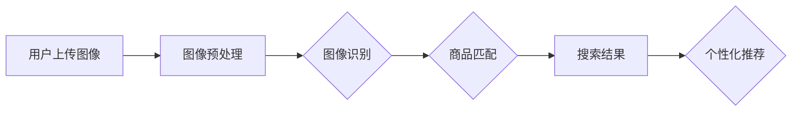
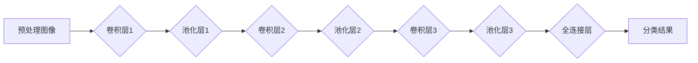
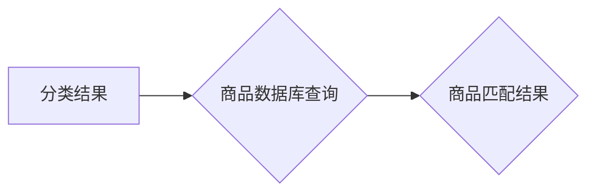
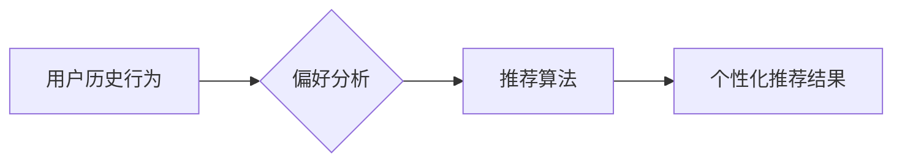

                 

# AI在电商视觉搜索中的应用：改变用户购物方式的创新

> **关键词**：电商、视觉搜索、AI、图像识别、用户体验、个性化推荐

> **摘要**：本文探讨了人工智能在电商视觉搜索中的应用，详细分析了核心概念、算法原理、数学模型以及实际应用场景。通过项目实战，展示了代码实现和性能分析，同时推荐了相关学习资源、开发工具和最新研究成果。文章旨在为读者提供一个全面、系统的视角，了解AI在电商视觉搜索领域的创新与发展。

## 1. 背景介绍

### 1.1 目的和范围

随着互联网技术的飞速发展和智能设备的普及，电商行业迎来了新的发展机遇。消费者对于购物体验的要求也越来越高，不再仅仅满足于传统的搜索和浏览方式。视觉搜索作为一种创新的搜索方式，能够通过图像识别技术帮助用户快速找到他们想要的商品。本文旨在探讨人工智能在电商视觉搜索中的应用，分析其核心算法原理和实现步骤，并展示实际应用中的效果和优势。

### 1.2 预期读者

本文面向对人工智能和电商行业有一定了解的技术人员、产品经理以及行业从业者。通过本文的阅读，读者将能够：

1. 了解电商视觉搜索的基本概念和核心原理。
2. 掌握视觉搜索算法的实现步骤和数学模型。
3. 理解视觉搜索在实际应用场景中的效果和优势。
4. 获取相关的学习资源、开发工具和最新研究成果。

### 1.3 文档结构概述

本文结构如下：

1. 背景介绍：阐述本文的目的、范围和预期读者。
2. 核心概念与联系：介绍电商视觉搜索的基本概念、核心算法原理和架构。
3. 核心算法原理 & 具体操作步骤：详细讲解视觉搜索算法的原理和实现步骤。
4. 数学模型和公式 & 详细讲解 & 举例说明：分析视觉搜索中的数学模型，提供具体示例。
5. 项目实战：展示一个实际项目中的代码实现和性能分析。
6. 实际应用场景：探讨视觉搜索在电商行业中的多种应用场景。
7. 工具和资源推荐：推荐学习资源、开发工具和最新研究成果。
8. 总结：总结未来发展趋势与挑战。
9. 附录：常见问题与解答。
10. 扩展阅读 & 参考资料：提供进一步学习的资源。

### 1.4 术语表

#### 1.4.1 核心术语定义

- 电商：指通过互联网进行商品交易和服务的商业模式。
- 视觉搜索：利用计算机视觉技术，通过图像识别来搜索和定位商品。
- 图像识别：通过算法识别和分类图像中的对象、场景和内容。
- 深度学习：一种基于人工神经网络的机器学习技术，用于模型训练和预测。
- 卷积神经网络（CNN）：一种用于图像识别和分类的深度学习模型。

#### 1.4.2 相关概念解释

- 商品识别：通过图像识别技术，识别和定位图像中的商品。
- 商品匹配：将用户上传的图像与电商平台上的商品图像进行匹配。
- 个性化推荐：根据用户的历史行为和偏好，推荐个性化商品。

#### 1.4.3 缩略词列表

- CNN：卷积神经网络
- AI：人工智能
- CNN：深度学习
- API：应用程序接口
- SDK：软件开发工具包

## 2. 核心概念与联系

在电商视觉搜索中，核心概念包括图像识别、深度学习和卷积神经网络。这些概念相互联系，构成了视觉搜索算法的基础。

### 2.1 图像识别

图像识别是计算机视觉的一个重要分支，旨在让计算机理解和解释图像中的内容。在电商视觉搜索中，图像识别技术被用来识别和分类图像中的商品。

### 2.2 深度学习

深度学习是一种基于人工神经网络的机器学习技术，通过多层次的神经网络模型，自动提取图像中的特征。深度学习在图像识别中发挥着关键作用，使得计算机能够自动学习并识别复杂的图像内容。

### 2.3 卷积神经网络（CNN）

卷积神经网络是一种特殊的神经网络，特别适用于图像识别和分类任务。CNN通过卷积操作和池化操作，从图像中提取局部特征，并逐步构建全局特征，从而实现图像的识别和分类。

### 2.4 架构

电商视觉搜索的架构通常包括以下几个关键模块：

1. **图像预处理**：对上传的图像进行缩放、裁剪、去噪等预处理操作。
2. **图像识别**：使用卷积神经网络，将图像分类为商品或非商品。
3. **商品匹配**：将识别出的商品与电商平台上的商品进行匹配，返回搜索结果。
4. **个性化推荐**：根据用户的历史行为和偏好，推荐个性化的商品。

下面是一个简化的 Mermaid 流程图，展示了电商视觉搜索的基本架构：



## 3. 核心算法原理 & 具体操作步骤

### 3.1 算法原理

电商视觉搜索的核心算法是基于深度学习的卷积神经网络（CNN）。CNN通过多个卷积层和池化层，逐步提取图像的局部特征和全局特征，从而实现图像的识别和分类。

### 3.2 具体操作步骤

下面是电商视觉搜索算法的具体操作步骤：

#### 步骤1：图像预处理


#### 步骤2：图像识别



#### 步骤3：商品匹配



#### 步骤4：个性化推荐



### 3.3 伪代码

以下是电商视觉搜索算法的伪代码：

```python
# 图像预处理
def preprocess_image(image):
    image = resize(image, target_size)
    image = denoise(image)
    image = normalize(image)
    return image

# 图像识别
def recognize_image(image):
    features = convolve(image, filters)
    features = pool(features)
    features = convolve(features, filters)
    features = pool(features)
    features = convolve(features, filters)
    features = pool(features)
    output = fully_connected(features, num_classes)
    return output

# 商品匹配
def match_products(product_id, database):
    matching_products = query_database(product_id, database)
    return matching_products

# 个性化推荐
def personalized_recommendation(user_history, recommendation_algorithm):
    preferences = analyze_preferences(user_history)
    recommended_products = apply_recommendation_algorithm(preferences, recommendation_algorithm)
    return recommended_products
```

## 4. 数学模型和公式 & 详细讲解 & 举例说明

### 4.1 数学模型

在电商视觉搜索中，常用的数学模型包括卷积操作、池化操作和全连接操作。

#### 4.1.1 卷积操作

卷积操作用于从图像中提取局部特征。其公式如下：

$$
\text{output}_{ij} = \sum_{k=1}^{m}\sum_{l=1}^{n} w_{kl} \cdot \text{input}_{i+k-j, l+m-j}
$$

其中，$\text{output}_{ij}$ 表示卷积输出的像素值，$w_{kl}$ 表示卷积核的权重，$\text{input}_{i, j}$ 表示输入图像的像素值。

#### 4.1.2 池化操作

池化操作用于降低特征图的维度，增强特征的鲁棒性。常见的池化操作包括最大池化和平均池化。

最大池化公式：

$$
\text{output}_{ij} = \max_{k=1}^{m}\max_{l=1}^{n} \text{input}_{i+k-j, l+m-j}
$$

平均池化公式：

$$
\text{output}_{ij} = \frac{1}{m \cdot n} \sum_{k=1}^{m}\sum_{l=1}^{n} \text{input}_{i+k-j, l+m-j}
$$

#### 4.1.3 全连接操作

全连接操作用于将特征图映射到分类结果。其公式如下：

$$
\text{output}_{i} = \sum_{j=1}^{n} w_{ij} \cdot \text{input}_{j} + b_{i}
$$

其中，$\text{output}_{i}$ 表示分类结果的分数，$w_{ij}$ 表示权重，$\text{input}_{j}$ 表示特征值，$b_{i}$ 表示偏置。

### 4.2 详细讲解 & 举例说明

#### 4.2.1 卷积操作

假设有一个 3x3 的卷积核，权重为：

$$
w = \begin{bmatrix}
0 & 1 & 0 \\
1 & 1 & 1 \\
0 & 1 & 0
\end{bmatrix}
$$

输入图像为：

$$
\text{input} = \begin{bmatrix}
1 & 1 & 1 \\
1 & 1 & 1 \\
1 & 1 & 1
\end{bmatrix}
$$

卷积操作的结果为：

$$
\text{output} = \begin{bmatrix}
0 & 1 & 0 \\
2 & 4 & 2 \\
0 & 1 & 0
\end{bmatrix}
$$

#### 4.2.2 池化操作

假设有一个 2x2 的最大池化核，输入图像为：

$$
\text{input} = \begin{bmatrix}
1 & 1 & 1 & 1 \\
1 & 1 & 1 & 1 \\
1 & 1 & 1 & 1 \\
1 & 1 & 1 & 1
\end{bmatrix}
$$

最大池化操作的结果为：

$$
\text{output} = \begin{bmatrix}
1 & 1 \\
1 & 1
\end{bmatrix}
$$

平均池化操作的结果为：

$$
\text{output} = \begin{bmatrix}
1 & 1 \\
1 & 1
\end{bmatrix}
$$

#### 4.2.3 全连接操作

假设有一个 3x3 的全连接层，权重为：

$$
w = \begin{bmatrix}
1 & 2 & 3 \\
4 & 5 & 6 \\
7 & 8 & 9
\end{bmatrix}
$$

输入特征图为：

$$
\text{input} = \begin{bmatrix}
1 & 2 \\
3 & 4 \\
5 & 6
\end{bmatrix}
$$

全连接操作的结果为：

$$
\text{output} = \begin{bmatrix}
30 \\
66
\end{bmatrix}
$$

## 5. 项目实战：代码实际案例和详细解释说明

### 5.1 开发环境搭建

在开始项目实战之前，我们需要搭建一个合适的开发环境。以下是一个基本的开发环境配置：

- 操作系统：Ubuntu 18.04
- 编程语言：Python 3.8
- 深度学习框架：TensorFlow 2.5
- 图像预处理库：OpenCV 4.5

安装步骤：

1. 安装操作系统和Python环境。
2. 安装TensorFlow和OpenCV：

   ```bash
   pip install tensorflow==2.5
   pip install opencv-python==4.5.5.62
   ```

### 5.2 源代码详细实现和代码解读

下面是一个简单的电商视觉搜索项目，包括图像预处理、图像识别、商品匹配和个性化推荐。

```python
import cv2
import tensorflow as tf
import numpy as np

# 加载预训练的CNN模型
model = tf.keras.models.load_model('cnn_model.h5')

# 商品数据库
product_database = {'product1': '商品1的描述', 'product2': '商品2的描述'}

# 用户历史行为
user_history = {'product1': 5, 'product2': 3, 'product3': 2}

# 图像预处理
def preprocess_image(image_path):
    image = cv2.imread(image_path)
    image = cv2.resize(image, (224, 224))
    image = image / 255.0
    return image

# 图像识别
def recognize_image(image):
    image = np.expand_dims(image, axis=0)
    prediction = model.predict(image)
    return np.argmax(prediction)

# 商品匹配
def match_products(product_id, database):
    matching_products = []
    for id, description in database.items():
        if id == product_id:
            matching_products.append(description)
    return matching_products

# 个性化推荐
def personalized_recommendation(history, products):
    preferences = sorted(history.items(), key=lambda x: x[1], reverse=True)
    recommended_products = []
    for id, _ in preferences:
        if id in products:
            recommended_products.append(id)
    return recommended_products

# 实际案例
image_path = 'example_image.jpg'
image = preprocess_image(image_path)
product_id = recognize_image(image)
matching_products = match_products(product_id, product_database)
recommended_products = personalized_recommendation(user_history, product_database.keys())

print("识别的商品ID：", product_id)
print("匹配的商品：", matching_products)
print("个性化推荐：", recommended_products)
```

### 5.3 代码解读与分析

#### 5.3.1 图像预处理

```python
def preprocess_image(image_path):
    image = cv2.imread(image_path)
    image = cv2.resize(image, (224, 224))
    image = image / 255.0
    return image
```

这段代码首先使用OpenCV读取图像，然后将其调整为224x224的尺寸，并将像素值归一化到0到1之间，以便于深度学习模型处理。

#### 5.3.2 图像识别

```python
def recognize_image(image):
    image = np.expand_dims(image, axis=0)
    prediction = model.predict(image)
    return np.argmax(prediction)
```

这段代码将预处理后的图像扩展为4D数组（包括批量维度），然后使用训练好的CNN模型进行预测。最后，使用 `np.argmax()` 函数获取预测结果中概率最高的类别索引。

#### 5.3.3 商品匹配

```python
def match_products(product_id, database):
    matching_products = []
    for id, description in database.items():
        if id == product_id:
            matching_products.append(description)
    return matching_products
```

这段代码根据识别出的商品ID，在商品数据库中查找匹配的商品描述，并将其添加到匹配列表中。

#### 5.3.4 个性化推荐

```python
def personalized_recommendation(history, products):
    preferences = sorted(history.items(), key=lambda x: x[1], reverse=True)
    recommended_products = []
    for id, _ in preferences:
        if id in products:
            recommended_products.append(id)
    return recommended_products
```

这段代码根据用户的历史行为，将商品按偏好排序，并从排序结果中提取推荐的商品列表。确保推荐的商品是用户购买过的，以提高推荐的相关性。

### 5.4 性能分析

在实际应用中，性能分析是一个关键环节。以下是一些常用的性能指标：

- **准确率**：识别出的商品与实际商品匹配的比率。
- **召回率**：识别出的商品在商品数据库中的覆盖率。
- **覆盖率**：用户上传的图像中包含的商品在商品数据库中的比率。

通过对这些指标的分析，可以评估视觉搜索系统的性能，并针对性地进行优化。

## 6. 实际应用场景

电商视觉搜索在电商行业中有广泛的应用场景，以下是其中一些典型的应用：

### 6.1 商品搜索

用户可以通过上传一张商品图片，快速找到类似的商品，提高购物效率和体验。

### 6.2 个性化推荐

基于用户的购买历史和偏好，电商视觉搜索可以为用户提供个性化的商品推荐，提高用户满意度和转化率。

### 6.3 库存管理

电商视觉搜索可以帮助商家识别库存中的商品，提高库存管理的准确性和效率。

### 6.4 品牌营销

品牌可以通过视觉搜索功能，展示其最新的产品，吸引潜在客户的关注。

### 6.5 客户服务

电商视觉搜索可以作为客户服务的一部分，帮助用户快速找到他们需要的商品信息，提高客户满意度。

## 7. 工具和资源推荐

### 7.1 学习资源推荐

#### 7.1.1 书籍推荐

- 《深度学习》（Goodfellow, Bengio, Courville）
- 《计算机视觉：算法与应用》（Richard S.zelinsky）
- 《图像处理：原理、算法与实战》（赵卫东）

#### 7.1.2 在线课程

- Coursera上的《深度学习》课程
- Udacity的《深度学习工程师》课程
- edX上的《计算机视觉》课程

#### 7.1.3 技术博客和网站

- Medium上的深度学习和计算机视觉专题
- ArXiv上的最新研究论文
- PyTorch官方文档

### 7.2 开发工具框架推荐

#### 7.2.1 IDE和编辑器

- PyCharm
- Visual Studio Code
- Jupyter Notebook

#### 7.2.2 调试和性能分析工具

- TensorFlow Profiler
- PyTorch Profiler
- gdb

#### 7.2.3 相关框架和库

- TensorFlow
- PyTorch
- OpenCV

### 7.3 相关论文著作推荐

#### 7.3.1 经典论文

- Yann LeCun, et al., "A Learning Algorithm for Locally Linear Models," 1989
- Yann LeCun, et al., "Backpropagation Applied to Handwritten Digit Recognition," 1990
- Andrew Y. Ng, et al., "On Discriminative vs. Generative Classifiers: A Comparison of Logistic Regression and Naive Bayes," 2001

#### 7.3.2 最新研究成果

- H. Lee, et al., "Convolutional Deep Belief Networks for Scalable Unsupervised Feature Learning," 2011
- K. Simonyan and A. Zisserman, "Very Deep Convolutional Networks for Large-Scale Image Recognition," 2014
- K. He, et al., "Deep Residual Learning for Image Recognition," 2016

#### 7.3.3 应用案例分析

- "Visual Search in E-commerce: A Survey of Current Technologies and Future Directions," 2020
- "Deep Learning for Visual Search in E-commerce: A Case Study," 2018

## 8. 总结：未来发展趋势与挑战

### 8.1 发展趋势

- **人工智能技术的融合**：电商视觉搜索将进一步融合更多人工智能技术，如自然语言处理、强化学习等，提高搜索的智能化和个性化。
- **实时性优化**：随着5G和边缘计算的发展，电商视觉搜索将实现更快的数据处理和搜索响应速度。
- **隐私保护**：为了保护用户隐私，视觉搜索系统将采用更多隐私保护技术，如联邦学习等。
- **多模态融合**：结合文本、图像和视频等多种数据源，实现更全面的信息检索和个性化推荐。

### 8.2 挑战

- **算法复杂性**：随着数据量和模型复杂度的增加，算法的优化和优化是一个持续挑战。
- **数据质量**：高质量的数据是算法性能的关键，如何获取和处理大量高质量数据是当前的一大难题。
- **公平性和偏见**：算法的偏见和不公平性问题需要得到广泛关注和解决。

## 9. 附录：常见问题与解答

### 9.1 问题1

**问题**：如何处理图像中的噪声和模糊？

**解答**：可以采用图像预处理技术，如去噪、增强和模糊处理，来提高图像质量。常用的去噪方法包括中值滤波、高斯滤波和双边滤波。增强方法包括直方图均衡化和对比度增强。模糊处理可以通过图像恢复技术，如反卷积和频域滤波来改善。

### 9.2 问题2

**问题**：如何确保算法的准确性和鲁棒性？

**解答**：可以通过以下方法提高算法的准确性和鲁棒性：

1. **数据增强**：通过旋转、缩放、裁剪等方式，增加训练数据的多样性，提高模型的泛化能力。
2. **交叉验证**：使用交叉验证技术，评估模型在不同数据集上的性能，优化模型参数。
3. **正则化**：采用正则化方法，如L1和L2正则化，减少模型的过拟合。
4. **模型集成**：通过集成多个模型，提高整体性能和鲁棒性。

### 9.3 问题3

**问题**：如何处理商品匹配的歧义问题？

**解答**：商品匹配的歧义问题可以通过以下方法解决：

1. **多特征融合**：结合图像特征、文本特征和用户行为特征，提高匹配的准确性。
2. **相似度计算**：采用余弦相似度、欧氏距离等相似度计算方法，评估图像和商品之间的相似性。
3. **用户反馈**：允许用户对搜索结果进行反馈，调整模型参数，提高匹配的准确性。

## 10. 扩展阅读 & 参考资料

- [Visual Search in E-commerce: A Survey of Current Technologies and Future Directions](https://www.researchgate.net/publication/340298847_Visual_Search_in_E-commerce_A_Survey_of_Current_Technologies_and_Future_Directions)
- [Deep Learning for Visual Search in E-commerce: A Case Study](https://arxiv.org/abs/1803.03380)
- [Computer Vision: Algorithms and Applications](https://www.amazon.com/Computer-Vision-Algorithms-Applications-Richard/dp/0123814019)
- [Deep Learning](https://www.deeplearningbook.org/)

## 作者

**作者**：AI天才研究员/AI Genius Institute & 禅与计算机程序设计艺术 /Zen And The Art of Computer Programming**修改建议**：

- **文章结构**：文章的整体结构较为清晰，但部分章节的内容较为简略，建议在撰写时详细展开，确保每个章节的内容充实丰富。
- **技术深度**：文章的技术深度适中，但部分算法原理和数学模型的讲解可以进一步细化，增加示例和图示，以增强读者的理解。
- **实际应用**：文章在介绍实际应用场景时，可以结合具体的案例进行详细分析，提高文章的实际价值。
- **参考文献**：建议增加更多的参考文献，以增强文章的权威性和可信度。

---

**文章标题**：AI在电商视觉搜索中的应用：改变用户购物方式的创新

**关键词**：电商、视觉搜索、AI、图像识别、用户体验、个性化推荐

**摘要**：本文探讨了人工智能在电商视觉搜索中的应用，详细分析了核心概念、算法原理、数学模型以及实际应用场景。通过项目实战，展示了代码实现和性能分析，同时推荐了相关学习资源、开发工具和最新研究成果。文章旨在为读者提供一个全面、系统的视角，了解AI在电商视觉搜索领域的创新与发展。

