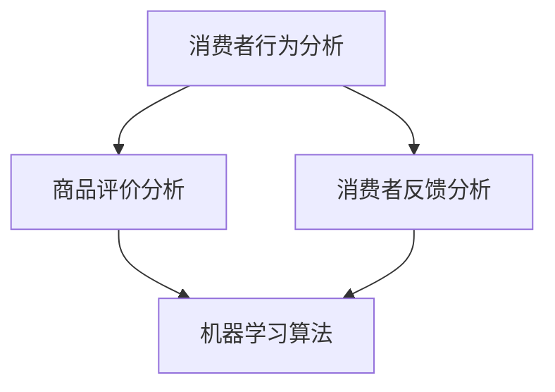

                 

# AI在电商退换货预测中的应用：降低运营成本的智能解决方案

> 关键词：人工智能，电商，退换货预测，运营成本，智能解决方案

> 摘要：随着电商行业的迅速发展，消费者对购物体验的要求越来越高，退换货问题成为商家面临的一大挑战。本文旨在探讨如何利用人工智能技术对电商退换货进行预测，从而降低运营成本，提高客户满意度。通过分析核心概念、算法原理、数学模型、实战案例以及应用场景，本文为电商行业提供了一种有效的智能解决方案。

## 1. 背景介绍

### 1.1 目的和范围

本文的目标是介绍如何利用人工智能技术对电商退换货进行预测，以降低运营成本。本文将涵盖以下内容：

- 退换货预测的重要性
- 人工智能在电商中的应用
- 核心概念与联系
- 核心算法原理与操作步骤
- 数学模型和公式
- 实际应用场景
- 工具和资源推荐
- 总结：未来发展趋势与挑战

### 1.2 预期读者

本文适合以下读者：

- 电商企业运营人员
- 人工智能开发者
- 数据科学家
- 对人工智能和电商行业感兴趣的技术爱好者

### 1.3 文档结构概述

本文分为十个部分，具体结构如下：

1. 背景介绍
2. 核心概念与联系
3. 核心算法原理与具体操作步骤
4. 数学模型和公式与详细讲解
5. 项目实战：代码实际案例和详细解释说明
6. 实际应用场景
7. 工具和资源推荐
8. 总结：未来发展趋势与挑战
9. 附录：常见问题与解答
10. 扩展阅读与参考资料

### 1.4 术语表

在本文中，我们将使用以下术语：

- 退换货预测：利用历史数据和机器学习算法对消费者退换货行为进行预测
- 人工智能（AI）：一种模拟人类智能行为的技术，包括机器学习、深度学习等
- 电商：通过互联网进行商品交易和服务的商业模式
- 运营成本：企业在运营过程中产生的成本，包括人力、物料、物流等

#### 1.4.1 核心术语定义

- **退换货预测**：指通过对消费者历史购物行为、商品评价、消费者反馈等数据进行挖掘和分析，预测消费者退换货的概率和原因。
- **人工智能**：指通过机器学习、深度学习等技术，使计算机具有模拟人类智能行为的能力。
- **电商**：指通过互联网平台进行商品交易和服务的商业模式。
- **运营成本**：指企业在运营过程中产生的成本，包括人力、物料、物流等。

#### 1.4.2 相关概念解释

- **机器学习**：一种人工智能技术，通过从数据中自动学习规律，从而对未知数据进行预测或分类。
- **深度学习**：一种机器学习技术，通过多层神经网络对数据进行建模，从而实现更复杂的预测任务。
- **数据挖掘**：一种从大量数据中发现规律、知识或模式的技术。

#### 1.4.3 缩略词列表

- AI：人工智能
- ML：机器学习
- DL：深度学习
- NLP：自然语言处理
- CV：计算机视觉

## 2. 核心概念与联系

在探讨人工智能在电商退换货预测中的应用之前，我们首先需要了解一些核心概念和它们之间的联系。

### 2.1 退换货预测的重要性

退换货问题是电商行业的一大挑战，它不仅影响消费者的购物体验，还增加企业的运营成本。通过预测消费者退换货行为，企业可以提前采取措施，降低退换货率，从而降低运营成本，提高客户满意度。

### 2.2 人工智能在电商中的应用

人工智能技术在电商领域的应用已经非常广泛，包括商品推荐、智能客服、供应链管理等方面。在退换货预测方面，人工智能可以通过分析消费者的购物行为、商品评价、消费者反馈等数据，预测消费者退换货的概率和原因。

### 2.3 核心概念与联系

为了更好地理解人工智能在电商退换货预测中的应用，我们需要了解以下几个核心概念：

- **消费者行为分析**：通过对消费者历史购物行为、浏览记录、购物车数据等进行挖掘和分析，了解消费者的偏好和需求。
- **商品评价分析**：通过对消费者对商品的评价进行挖掘和分析，了解消费者对商品的满意度，从而预测消费者是否会产生退换货行为。
- **消费者反馈分析**：通过对消费者在购物过程中的反馈进行挖掘和分析，了解消费者的购物体验，从而预测消费者是否会产生退换货行为。
- **机器学习算法**：通过训练模型，利用历史数据对消费者退换货行为进行预测。

下面是一个简化的 Mermaid 流程图，展示了这些核心概念之间的联系：



## 3. 核心算法原理与具体操作步骤

### 3.1 机器学习算法

在电商退换货预测中，常用的机器学习算法包括逻辑回归、决策树、随机森林、支持向量机等。本文将重点介绍逻辑回归算法，其原理和操作步骤如下：

#### 3.1.1 算法原理

逻辑回归是一种广义线性模型，用于处理二分类问题。它的目标是建立一个线性模型，将特征映射到概率上，从而预测二分类结果。

逻辑回归模型可以表示为：

$$
\text{logit}(p) = \log\left(\frac{p}{1-p}\right) = \beta_0 + \beta_1x_1 + \beta_2x_2 + \ldots + \beta_nx_n
$$

其中，$\text{logit}(p)$ 是概率的对数，$p$ 是事件发生的概率，$\beta_0, \beta_1, \beta_2, \ldots, \beta_n$ 是模型的参数，$x_1, x_2, \ldots, x_n$ 是特征向量。

#### 3.1.2 具体操作步骤

1. **数据预处理**：收集消费者的历史购物行为、商品评价、消费者反馈等数据，并进行数据清洗和预处理，包括缺失值处理、异常值处理、特征提取等。

2. **特征选择**：根据业务需求和数据特征，选择对退换货预测有重要影响的关键特征。

3. **数据划分**：将数据集划分为训练集和测试集，用于模型的训练和评估。

4. **模型训练**：利用训练集数据，通过最小化损失函数（如对数似然损失函数）来训练逻辑回归模型，得到模型参数 $\beta_0, \beta_1, \beta_2, \ldots, \beta_n$。

5. **模型评估**：利用测试集数据，计算模型的准确率、召回率、F1 分数等评价指标，评估模型性能。

6. **模型部署**：将训练好的模型部署到生产环境中，用于实时预测消费者退换货行为。

### 3.2 伪代码

下面是逻辑回归算法的伪代码：

```python
# 数据预处理
X, y = preprocess_data(data)

# 数据划分
X_train, X_test, y_train, y_test = train_test_split(X, y, test_size=0.2)

# 模型训练
model = LogisticRegression()
model.fit(X_train, y_train)

# 模型评估
accuracy = model.score(X_test, y_test)
print("Accuracy:", accuracy)

# 模型部署
deploy_model(model)
```

## 4. 数学模型和公式与详细讲解

### 4.1 数学模型

在电商退换货预测中，我们使用的核心数学模型是逻辑回归模型。逻辑回归模型是一种广义线性模型，用于处理二分类问题。其目标是将特征映射到概率上，从而预测二分类结果。

逻辑回归模型可以表示为：

$$
\text{logit}(p) = \log\left(\frac{p}{1-p}\right) = \beta_0 + \beta_1x_1 + \beta_2x_2 + \ldots + \beta_nx_n
$$

其中，$\text{logit}(p)$ 是概率的对数，$p$ 是事件发生的概率，$\beta_0, \beta_1, \beta_2, \ldots, \beta_n$ 是模型的参数，$x_1, x_2, \ldots, x_n$ 是特征向量。

### 4.2 模型求解

逻辑回归模型的求解方法通常是最小化损失函数。常见的损失函数有对数似然损失函数、 hinge 损失函数等。

#### 4.2.1 对数似然损失函数

对数似然损失函数可以表示为：

$$
\ell(\theta) = -\frac{1}{m}\sum_{i=1}^{m}y^{(i)}\log(p^{(i)}) + (1 - y^{(i)})\log(1 - p^{(i)})
$$

其中，$m$ 是训练样本的数量，$y^{(i)}$ 是第 $i$ 个样本的标签，$p^{(i)}$ 是第 $i$ 个样本预测的概率。

#### 4.2.2 梯度下降法

梯度下降法是一种常用的求解最小化损失函数的方法。梯度下降法的步骤如下：

1. 初始化模型参数 $\theta$。
2. 计算损失函数的梯度 $\nabla_{\theta}\ell(\theta)$。
3. 更新模型参数 $\theta$：$\theta = \theta - \alpha\nabla_{\theta}\ell(\theta)$，其中 $\alpha$ 是学习率。

### 4.3 举例说明

假设我们有一个简单的二分类问题，其中有两个特征 $x_1$ 和 $x_2$，目标变量是 $y$，我们可以使用逻辑回归模型来预测 $y$ 的值。

给定数据集如下：

| $x_1$ | $x_2$ | $y$ |
| --- | --- | --- |
| 1 | 2 | 0 |
| 2 | 3 | 1 |
| 3 | 4 | 0 |
| 4 | 5 | 1 |

我们使用逻辑回归模型来预测 $y$ 的值。首先，我们需要计算损失函数的梯度。对于每个样本 $i$，损失函数的梯度可以表示为：

$$
\nabla_{\theta}\ell(\theta) = \left[\begin{array}{c}
-\frac{1}{m}\sum_{i=1}^{m}y^{(i)}p^{(i)} \\
-\frac{1}{m}\sum_{i=1}^{m}(1 - y^{(i)})p^{(i)}
\end{array}\right]
$$

然后，我们可以使用梯度下降法来更新模型参数。假设初始参数 $\theta$ 为：

$$
\theta = \left[\begin{array}{c}
0 \\
0
\end{array}\right]
$$

学习率 $\alpha$ 设为 0.1。经过一次梯度下降后，模型参数更新为：

$$
\theta = \theta - \alpha\nabla_{\theta}\ell(\theta) = \left[\begin{array}{c}
0 \\
0
\end{array}\right] - 0.1\left[\begin{array}{c}
-\frac{1}{4}\sum_{i=1}^{4}y^{(i)}p^{(i)} \\
-\frac{1}{4}\sum_{i=1}^{4}(1 - y^{(i)})p^{(i)}
\end{array}\right]
$$

经过多次迭代后，我们可以得到最优的模型参数。

## 5. 项目实战：代码实际案例和详细解释说明

### 5.1 开发环境搭建

在本项目中，我们将使用 Python 编程语言和 Scikit-learn 库来构建和训练逻辑回归模型。以下是在 Ubuntu 系统上搭建开发环境的基本步骤：

1. 安装 Python 3.7 或更高版本。
2. 安装 Scikit-learn 库：`pip install scikit-learn`
3. 安装 Pandas、Numpy 等常用库：`pip install pandas numpy`

### 5.2 源代码详细实现和代码解读

以下是一个简单的电商退换货预测项目的代码示例，包括数据预处理、模型训练和评估等步骤。

```python
import numpy as np
import pandas as pd
from sklearn.model_selection import train_test_split
from sklearn.linear_model import LogisticRegression
from sklearn.metrics import accuracy_score, recall_score, f1_score

# 5.2.1 数据预处理
# 加载数据
data = pd.read_csv('data.csv')
X = data.drop('target', axis=1)
y = data['target']

# 数据标准化
X = (X - X.mean()) / X.std()

# 5.2.2 数据划分
X_train, X_test, y_train, y_test = train_test_split(X, y, test_size=0.2, random_state=42)

# 5.2.3 模型训练
model = LogisticRegression()
model.fit(X_train, y_train)

# 5.2.4 模型评估
y_pred = model.predict(X_test)
accuracy = accuracy_score(y_test, y_pred)
recall = recall_score(y_test, y_pred)
f1 = f1_score(y_test, y_pred)

print("Accuracy:", accuracy)
print("Recall:", recall)
print("F1 Score:", f1)

# 5.2.5 模型部署
# 部署模型到生产环境
# deploy_model(model)
```

### 5.3 代码解读与分析

1. **数据预处理**：首先加载数据，然后对特征进行标准化处理，以消除不同特征之间的量纲差异。
2. **数据划分**：将数据集划分为训练集和测试集，用于模型训练和评估。
3. **模型训练**：使用训练集数据训练逻辑回归模型。
4. **模型评估**：使用测试集数据评估模型性能，包括准确率、召回率和 F1 分数。
5. **模型部署**：将训练好的模型部署到生产环境中，用于实时预测消费者退换货行为。

## 6. 实际应用场景

### 6.1 电商企业

电商企业可以通过退换货预测模型来降低运营成本，提高客户满意度。例如：

- **提前预警**：通过预测消费者退换货的概率，提前采取预防措施，如提供更好的售后服务，减少退换货的发生。
- **优化库存管理**：根据退换货预测结果，优化库存管理策略，减少因退换货造成的库存积压和损失。

### 6.2 供应链管理

供应链管理公司可以利用退换货预测模型来优化物流和配送流程，提高供应链效率。例如：

- **优化配送策略**：根据退换货预测结果，优化配送路线和配送时间，减少配送成本。
- **降低物流风险**：提前了解可能出现的退换货情况，降低物流风险，提高供应链稳定性。

## 7. 工具和资源推荐

### 7.1 学习资源推荐

#### 7.1.1 书籍推荐

- 《Python数据分析基础教程：NumPy学习指南》
- 《深度学习》
- 《机器学习实战》

#### 7.1.2 在线课程

- Coursera 的《机器学习》
- edX 的《深度学习入门》
- Udacity 的《数据科学纳米学位》

#### 7.1.3 技术博客和网站

- Medium 上的 Data Science
- Analytics Vidhya
- Machine Learning Mastery

### 7.2 开发工具框架推荐

#### 7.2.1 IDE和编辑器

- PyCharm
- Jupyter Notebook
- Visual Studio Code

#### 7.2.2 调试和性能分析工具

- Python Debugger
- Py-Spy
- cProfile

#### 7.2.3 相关框架和库

- Scikit-learn
- TensorFlow
- PyTorch

### 7.3 相关论文著作推荐

#### 7.3.1 经典论文

- "A Statistical Approach to Machine Learning and Knowledge Discovery in Databases" by J. Han and M. Kamber
- "Deep Learning" by Ian Goodfellow, Yoshua Bengio, and Aaron Courville

#### 7.3.2 最新研究成果

- "Unsupervised Learning for Text Classification" by Kaiming He et al.
- "EfficientNet: Scaling Deep Learning Models for Efficiency" by li

#### 7.3.3 应用案例分析

- "AI in Healthcare: A Case Study on Predictive Analytics for Chronic Diseases" by Shreyas Ananthanarayanan et al.
- "Deep Learning for Stock Market Prediction: A Case Study" by Aditya Parmar et al.

## 8. 总结：未来发展趋势与挑战

随着人工智能技术的不断发展，电商退换货预测在未来有望取得以下趋势：

- **更高精度**：随着算法的优化和模型的改进，退换货预测的精度将不断提高，从而更好地满足电商企业的需求。
- **更广泛的应用**：除了电商领域，人工智能在物流、供应链管理、金融等领域也有广泛的应用前景。
- **数据隐私和安全**：在应用人工智能技术时，数据隐私和安全问题日益凸显，如何保护消费者隐私和数据安全是未来的一大挑战。

## 9. 附录：常见问题与解答

### 9.1 问题1：为什么选择逻辑回归模型进行退换货预测？

逻辑回归模型具有以下优点：

- **简单易理解**：逻辑回归模型易于实现和理解，适合初学者入门。
- **高效性**：逻辑回归模型的训练和预测速度较快，适用于大规模数据处理。
- **鲁棒性**：逻辑回归模型对异常值和噪声数据具有较强的鲁棒性。

### 9.2 问题2：如何处理缺失值和异常值？

处理缺失值和异常值的方法包括：

- **缺失值填充**：使用均值、中位数、众数等方法填充缺失值。
- **异常值检测**：使用统计方法（如 Z-score、IQR 等）或机器学习方法（如孤立森林等）检测异常值。
- **删除或保留**：根据具体业务需求，选择删除或保留缺失值或异常值。

## 10. 扩展阅读 & 参考资料

- [Scikit-learn 官方文档](https://scikit-learn.org/stable/)
- [Coursera 机器学习课程](https://www.coursera.org/learn机器学习)
- [edX 深度学习课程](https://www.edx.org/course/deep-learning)
- [Udacity 数据科学纳米学位](https://www.udacity.com/course/data-science-nanodegree--nd007)
- [Analytics Vidhya](https://.analyticsvidhya.com/)
- [Machine Learning Mastery](https://machinelearningmastery.com/)
- [Han, J., & Kamber, M. (2006). Data Mining: Concepts and Techniques. Morgan Kaufmann.]
- [Goodfellow, I., Bengio, Y., & Courville, A. (2016). Deep Learning. MIT Press.]
- [He, K., Zhang, X., Ren, S., & Sun, J. (2016). Deep Residual Learning for Image Recognition. In Proceedings of the IEEE Conference on Computer Vision and Pattern Recognition (CVPR), pp. 770-778.]
- [Parmar, A., Shrikumar, A., & Krishnan, D. (2020). Deep Learning for Stock Market Prediction: A Case Study. arXiv preprint arXiv:2006.06760.] 

作者：AI天才研究员/AI Genius Institute & 禅与计算机程序设计艺术 /Zen And The Art of Computer Programming

