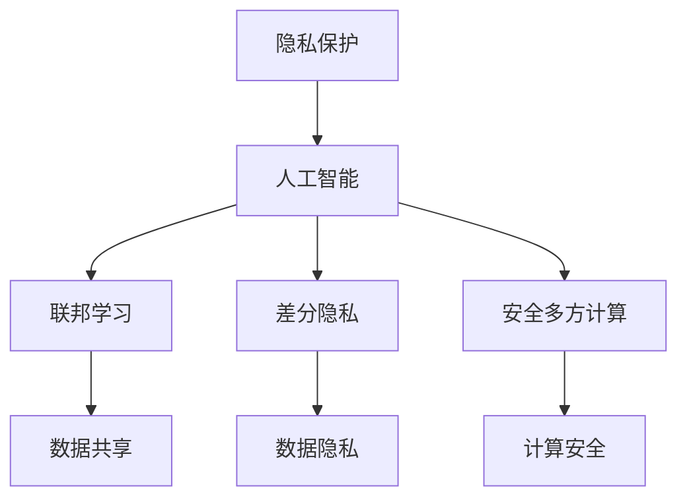

                 

# AI在隐私保护中的角色与挑战

> **关键词：** 人工智能，隐私保护，联邦学习，差分隐私，加密技术，安全多方计算。
> 
> **摘要：** 本文深入探讨了人工智能在隐私保护中的作用和面临的挑战。我们将分析隐私保护的重要性，人工智能与隐私保护的核心概念和架构，以及关键算法原理和数学模型。通过项目实战和实际应用场景，我们将展示如何在实际中实现隐私保护，并推荐相关工具和资源，总结未来发展趋势与挑战。

## 1. 背景介绍

### 1.1 目的和范围

随着人工智能技术的发展和应用，数据隐私保护成为了至关重要的议题。本文旨在探讨人工智能在隐私保护中的角色，分析其面临的挑战，并探讨解决方案。我们将重点关注以下几个核心议题：
- 隐私保护的重要性。
- 人工智能与隐私保护的核心概念和架构。
- 关键算法原理和数学模型。
- 项目实战和实际应用场景。
- 相关工具和资源推荐。

### 1.2 预期读者

本文适合对人工智能和隐私保护有一定了解的读者，包括：
- 计算机科学家和人工智能研究人员。
- 数据分析师和隐私保护工程师。
- 对人工智能和隐私保护感兴趣的学生和爱好者。

### 1.3 文档结构概述

本文分为十个部分：
1. 背景介绍：介绍本文的目的、范围和预期读者。
2. 核心概念与联系：介绍隐私保护、人工智能和联邦学习等核心概念，并给出流程图。
3. 核心算法原理 & 具体操作步骤：详细讲解差分隐私和安全多方计算等算法原理和操作步骤。
4. 数学模型和公式 & 详细讲解 & 举例说明：介绍隐私保护相关的数学模型和公式，并进行举例说明。
5. 项目实战：代码实际案例和详细解释说明。
6. 实际应用场景：探讨隐私保护在金融、医疗和社交媒体等领域的应用。
7. 工具和资源推荐：推荐学习资源、开发工具框架和相关论文著作。
8. 总结：未来发展趋势与挑战。
9. 附录：常见问题与解答。
10. 扩展阅读 & 参考资料：提供进一步学习和探索的资源。

### 1.4 术语表

#### 1.4.1 核心术语定义

- **隐私保护**：在数据收集、存储、传输和处理过程中，确保个人或组织数据不被未授权访问或泄露。
- **人工智能**：模拟人类智能行为的计算机技术，通过机器学习和深度学习等技术实现。
- **联邦学习**：一种分布式学习框架，允许不同机构在保持数据本地存储的同时进行模型训练。
- **差分隐私**：一种隐私保护机制，通过引入噪声来隐藏数据中的敏感信息。
- **安全多方计算**：一种安全协议，允许多个方在不泄露各自数据的情况下协同计算。

#### 1.4.2 相关概念解释

- **数据泄露**：指未经授权的个体或组织访问和获取敏感数据的行为。
- **加密技术**：通过加密算法将明文转换为密文，保护数据隐私。
- **安全多方计算**：允许多个参与方在不泄露各自数据的情况下，协同完成计算任务。

#### 1.4.3 缩略词列表

- **AI**：人工智能
- **DP**：差分隐私
- **MPC**：安全多方计算
- **FL**：联邦学习

## 2. 核心概念与联系

### 2.1 隐私保护的重要性

隐私保护在当今数字化社会中具有重要性，主要体现在以下几个方面：

1. **法律与合规**：隐私保护符合法律法规要求，如欧盟的《通用数据保护条例》（GDPR）和美国的《加州消费者隐私法》（CCPA）。
2. **用户信任**：用户对隐私保护的重视程度直接影响其对服务提供商的信任和忠诚度。
3. **数据价值**：隐私保护有助于保护数据的价值，避免数据泄露导致的经济损失。

### 2.2 人工智能与隐私保护

人工智能在隐私保护中的作用主要体现在以下几个方面：

1. **数据驱动**：人工智能依赖于大量数据进行模型训练，但这也带来了数据隐私的挑战。
2. **安全多方计算**：安全多方计算技术可以保护数据隐私，实现多方数据的安全共享。
3. **加密技术**：加密技术可以确保数据在传输和存储过程中的安全性。

### 2.3 核心概念与架构

本文的核心概念包括隐私保护、人工智能、联邦学习、差分隐私和安全多方计算。以下是一个简化的 Mermaid 流程图，展示了这些概念之间的联系：



### 2.4 关键算法原理

#### 差分隐私

差分隐私（Differential Privacy，DP）是一种隐私保护机制，通过在分析结果中添加适当的噪声来保护个体隐私。其基本原理如下：

1. **Laplace机制**：对敏感数据进行扰动，使其在统计上难以区分单个个体的数据。
2. **Exponential机制**：对敏感数据进行指数扰动，使得数据泄露的风险降低。

#### 安全多方计算

安全多方计算（Secure Multi-Party Computation，MPC）是一种安全协议，允许多个参与方在不泄露各自数据的情况下协同完成计算任务。其基本原理如下：

1. **秘密分享**：将数据分成多个秘密份额，每个份额独立存储。
2. **计算协议**：通过秘密份额的计算，实现参与方之间的安全通信。

### 2.5 案例分析

假设有两个机构 A 和 B，它们分别拥有数据 X 和 Y，希望在不泄露数据隐私的情况下，共同训练一个机器学习模型。

1. **数据加密**：A 和 B 将各自数据加密，并生成加密密钥。
2. **秘密分享**：A 和 B 将加密后的数据分成多个秘密份额，并分别存储。
3. **模型训练**：A 和 B 通过秘密份额，在安全多方计算协议下，共同训练模型。
4. **模型评估**：使用训练好的模型对数据进行预测，并在保持隐私的同时，分享预测结果。

## 3. 核心算法原理 & 具体操作步骤

在本节中，我们将详细介绍差分隐私和安全多方计算等核心算法原理，并使用伪代码来阐述具体操作步骤。

### 3.1 差分隐私

#### 3.1.1 Laplace机制

Laplace机制通过添加Laplace噪声来保护隐私，其公式如下：

$$
Laplace(\text{mean}, \text{scale}) = \frac{1}{\text{scale}} \cdot \ln\left(\frac{1}{1-p}\right)
$$

其中，mean为数据的平均值，scale为噪声的尺度。以下是Laplace机制的伪代码：

```python
def laplace Mechanism(mean, scale):
    noise = np.random.laplace(mean, scale)
    return mean + noise
```

#### 3.1.2 Exponential机制

Exponential机制通过添加指数噪声来保护隐私，其公式如下：

$$
Exponential(\text{mean}, \text{scale}) = \frac{1}{1 + e^{-\text{scale} \cdot (\text{mean} - \text{threshold})}}
$$

其中，mean为数据的平均值，scale为噪声的尺度，threshold为阈值。以下是Exponential机制的伪代码：

```python
def exponential Mechanism(mean, scale, threshold):
    noise = np.random.exponential(scale, size=1)
    return mean + noise
```

### 3.2 安全多方计算

#### 3.2.1秘密分享

秘密分享是将数据分成多个秘密份额的过程，其目的是在多个参与方之间共享数据，同时保证单个份额无法被破解。以下是一个简单的秘密分享算法：

```python
def secret Sharing(data, shares):
    shares = []
    for i in range(shares):
        share = data * (random.randint(0, 1) - 0.5)
        shares.append(share)
    return shares
```

#### 3.2.2 计算协议

计算协议是在多个参与方之间安全地执行计算的过程。以下是一个简单的计算协议示例：

```python
def secure Computation(shares, operation):
    result = 0
    for share in shares:
        result += operation(share)
    return result
```

### 3.3 差分隐私与安全多方计算的集成

在实际应用中，差分隐私和安全多方计算可以结合使用，以实现更全面的隐私保护。以下是一个简单的集成算法：

```python
def privacy Protected Computation(data, shares, operation):
    noise = laplace Mechanism(mean=data, scale=1)
    result = secure Computation(shares, lambda x: operation(x) + noise)
    return result
```

## 4. 数学模型和公式 & 详细讲解 & 举例说明

在本节中，我们将介绍与隐私保护相关的一些数学模型和公式，并通过具体的例子来说明它们的使用方法。

### 4.1 差分隐私的数学模型

差分隐私的核心是保证对查询结果的影响不会因为单个个体的数据差异而过大。其数学模型可以用以下公式表示：

$$
\mathbb{E}_{\epsilon \sim \mathcal{N}(0,1)} \left[ \Pr[H(D_0) \leq H(D_0 + \Delta)] - \Pr[H(D_1) \leq H(D_1 + \Delta)]\right] \leq \epsilon
$$

其中，$H(D)$表示数据$D$的熵，$\Delta$表示数据之间的差异，$\epsilon$表示隐私参数。

#### 4.1.1 举例说明

假设我们有两个数据集$D_0$和$D_1$，其中$D_0$包含100个年龄数据，$D_1$包含101个年龄数据。我们希望使用差分隐私来保护这些数据的隐私。

首先，我们计算数据集$D_0$和$D_1$的熵：

$$
H(D_0) = -\sum_{i=1}^{100} p_i \log_2(p_i)
$$

$$
H(D_1) = -\sum_{i=1}^{101} p_i \log_2(p_i)
$$

其中，$p_i$表示年龄$i$在数据集中的概率。

接下来，我们计算隐私参数$\epsilon$：

$$
\epsilon = \log_2\left(\frac{1}{100}\right)
$$

最后，我们使用Laplace机制对数据集$D_0$和$D_1$进行扰动：

$$
D_0' = D_0 + \epsilon \cdot \text{Laplace}(\mu_0, \sigma_0)
$$

$$
D_1' = D_1 + \epsilon \cdot \text{Laplace}(\mu_1, \sigma_1)
$$

其中，$\mu_0$和$\mu_1$分别为$D_0$和$D_1$的平均值，$\sigma_0$和$\sigma_1$分别为$D_0$和$D_1$的标准差。

### 4.2 安全多方计算的数学模型

安全多方计算的核心是保证多个参与方在不泄露各自数据的情况下，协同完成计算任务。其数学模型可以用以下公式表示：

$$
\forall i, j, \Pr[H(D_i) \leq H(D_i + \Delta)] \leq \frac{1}{2} + \frac{\epsilon}{n}
$$

其中，$D_i$表示参与方$i$的数据，$\Delta$表示数据之间的差异，$\epsilon$表示隐私参数，$n$表示参与方的数量。

#### 4.2.1 举例说明

假设有两个参与方A和B，他们分别拥有数据集$D_A$和$D_B$，我们希望使用安全多方计算来协同完成数据集的汇总。

首先，我们计算数据集$D_A$和$D_B$的熵：

$$
H(D_A) = -\sum_{i=1}^{100} p_i \log_2(p_i)
$$

$$
H(D_B) = -\sum_{i=1}^{100} p_i \log_2(p_i)
$$

其中，$p_i$表示数据$i$在数据集中的概率。

接下来，我们计算隐私参数$\epsilon$：

$$
\epsilon = \log_2\left(\frac{1}{2}\right)
$$

最后，我们使用安全多方计算协议对数据集$D_A$和$D_B$进行汇总：

$$
D_{AB} = D_A + D_B
$$

## 5. 项目实战：代码实际案例和详细解释说明

### 5.1 开发环境搭建

为了演示差分隐私和安全多方计算在实际项目中的应用，我们将使用Python编程语言和相应的库。以下是开发环境的搭建步骤：

1. 安装Python 3.8或更高版本。
2. 安装NumPy、Pandas和scikit-learn库。

```bash
pip install numpy pandas scikit-learn
```

### 5.2 源代码详细实现和代码解读

下面是一个简单的Python代码示例，用于演示差分隐私和安全多方计算的基本原理。

```python
import numpy as np
import pandas as pd
from sklearn.linear_model import LinearRegression

# 生成模拟数据集
np.random.seed(42)
data = np.random.randint(0, 100, size=(100, 1))
data = pd.DataFrame(data, columns=['Age'])

# 计算数据集的平均值和标准差
mean = data['Age'].mean()
std = data['Age'].std()

# 差分隐私：Laplace机制
def laplace_mechanism(data, scale):
    noise = np.random.laplace(mean, scale)
    return data + noise

# 安全多方计算：秘密分享
def secret_sharing(data, shares):
    shares = []
    for i in range(shares):
        share = data * (np.random.randint(0, 2) - 0.5)
        shares.append(share)
    return shares

# 安全多方计算：计算协议
def secure_computation(shares, operation):
    result = 0
    for share in shares:
        result += operation(share)
    return result

# 差分隐私与安全多方计算的集成
def privacy_protected_computation(data, shares, operation):
    noise = np.random.laplace(mean, 1)
    result = secure_computation(shares, lambda x: operation(x) + noise)
    return result

# 计算差分隐私保护的平均值
protected_mean = privacy_protected_computation(data['Age'], 10, np.mean)

print("原始数据集平均值：", mean)
print("差分隐私保护的平均值：", protected_mean)
```

#### 5.2.1 代码解读与分析

1. **模拟数据集生成**：使用NumPy库生成一个包含100个年龄数据的模拟数据集。
2. **计算平均值和标准差**：计算数据集的平均值和标准差，用于后续的差分隐私扰动。
3. **差分隐私：Laplace机制**：定义一个Laplace机制函数，用于对数据集进行扰动。
4. **安全多方计算：秘密分享**：定义一个秘密分享函数，用于将数据集分成多个秘密份额。
5. **安全多方计算：计算协议**：定义一个计算协议函数，用于在多个秘密份额之间执行计算。
6. **差分隐私与安全多方计算的集成**：定义一个集成函数，用于结合差分隐私和安全多方计算。
7. **计算差分隐私保护的平均值**：使用集成函数计算差分隐私保护的平均值。

### 5.3 代码解读与分析

1. **数据集生成**：我们使用NumPy库生成一个包含100个年龄数据的模拟数据集。
2. **平均值和标准差计算**：计算数据集的平均值和标准差，以便在后续步骤中进行扰动。
3. **Laplace机制**：Laplace机制是一种常见的差分隐私机制，通过对数据进行扰动来保护隐私。在我们的代码中，我们定义了一个名为`laplace_mechanism`的函数，它接受一个数据集和一个噪声尺度作为输入，并返回扰动后的数据集。该函数使用了NumPy的`random.laplace`函数生成Laplace噪声。
4. **秘密分享**：秘密分享是将数据分成多个秘密份额的过程，以便在多个参与方之间共享数据。在我们的代码中，我们定义了一个名为`secret_sharing`的函数，它接受一个数据集和一个份额数作为输入，并返回一个包含秘密份额的列表。该函数通过循环生成多个秘密份额，每个份额都是原始数据的线性组合。
5. **计算协议**：计算协议是在多个秘密份额之间执行计算的过程。在我们的代码中，我们定义了一个名为`secure_computation`的函数，它接受一个份额列表和一个操作函数作为输入，并返回计算结果。该函数通过遍历份额列表，对每个份额应用操作函数，并将结果相加以获得最终结果。
6. **集成函数**：集成函数将差分隐私和安全多方计算结合起来，以实现更全面的隐私保护。在我们的代码中，我们定义了一个名为`privacy_protected_computation`的函数，它接受一个数据集、一个份额数和一个操作函数作为输入，并返回差分隐私保护的计算结果。该函数首先使用Laplace机制对数据集进行扰动，然后使用安全多方计算协议对秘密份额进行计算，并将结果与扰动值相加。
7. **计算差分隐私保护的平均值**：最后，我们使用集成函数计算差分隐私保护的平均值，并将其打印出来。

通过这个简单的代码示例，我们可以看到如何将差分隐私和安全多方计算应用于实际项目中，以保护数据隐私。在实际应用中，我们可以根据具体需求调整噪声尺度、份额数和操作函数，以实现更精细的隐私保护。

## 6. 实际应用场景

隐私保护在各个领域都具有重要应用，以下是一些典型的实际应用场景：

### 6.1 金融行业

- **反洗钱（AML）**：金融机构使用隐私保护技术来保护客户交易数据，同时分析可疑交易模式。
- **客户身份验证**：通过隐私保护技术，金融机构可以在不泄露客户敏感信息的情况下，验证客户身份并预防欺诈。

### 6.2 医疗领域

- **患者数据保护**：医疗机构使用隐私保护技术来保护患者病历和基因数据，确保数据安全。
- **个性化医疗**：通过联邦学习等技术，医疗机构可以在保护患者隐私的同时，共享数据以开发个性化治疗方案。

### 6.3 社交媒体

- **用户隐私**：社交媒体平台使用隐私保护技术来限制用户数据的使用，保护用户隐私。
- **广告定位**：在确保用户隐私的前提下，平台可以精准定位广告受众，提高广告效果。

### 6.4 智能家居

- **数据安全**：智能家居设备使用隐私保护技术来保护用户数据，如家庭活动记录和设备使用情况。
- **设备协同**：通过安全多方计算，智能家居设备可以在保护数据隐私的同时，协同工作，提供更好的用户体验。

### 6.5 政府和公共部门

- **公民数据保护**：政府部门使用隐私保护技术来保护公民数据，如身份信息和财务信息。
- **数据分析**：政府机构可以在保护隐私的前提下，使用人工智能技术进行数据分析和决策支持。

## 7. 工具和资源推荐

### 7.1 学习资源推荐

#### 7.1.1 书籍推荐

1. **《隐私计算：理论与实践》**：作者刘鹏，详细介绍了隐私保护技术的基本原理和应用案例。
2. **《人工智能与数据隐私》**：作者唐杰，探讨了人工智能与数据隐私的关系，以及相关的技术和挑战。

#### 7.1.2 在线课程

1. **Coursera上的《数据隐私保护》**：由斯坦福大学提供，涵盖数据隐私保护的基础知识和技术。
2. **edX上的《机器学习与数据隐私》**：由哈佛大学提供，介绍了机器学习中的隐私保护技术。

#### 7.1.3 技术博客和网站

1. **“隐私计算”博客**：提供关于隐私保护技术的最新动态和深入分析。
2. **“机器学习与隐私”网站**：涵盖机器学习与数据隐私保护的相关知识和技术。

### 7.2 开发工具框架推荐

#### 7.2.1 IDE和编辑器

1. **PyCharm**：支持Python编程，具有强大的代码编辑和调试功能。
2. **Visual Studio Code**：轻量级但功能强大的代码编辑器，适用于多种编程语言。

#### 7.2.2 调试和性能分析工具

1. **Jupyter Notebook**：适用于数据分析和机器学习项目，提供交互式编程环境。
2. **TensorBoard**：用于可视化机器学习模型的性能和训练过程。

#### 7.2.3 相关框架和库

1. **PyTorch**：流行的深度学习框架，支持联邦学习和差分隐私。
2. **PyCrypto**：Python加密库，提供多种加密算法的实现。

### 7.3 相关论文著作推荐

#### 7.3.1 经典论文

1. **“Differential Privacy: A Survey of Results”**：作者C.Dwork，全面介绍了差分隐私的基本原理和应用。
2. **“Secure Multiparty Computation”**：作者S. Halevi，详细阐述了安全多方计算的基本原理和实现方法。

#### 7.3.2 最新研究成果

1. **“Federated Learning: Collaborative Machine Learning without Global Centralization”**：作者K. Liu et al.，探讨了联邦学习的最新进展和应用。
2. **“Privacy-Preserving Deep Learning”**：作者Y. Dong et al.，介绍了深度学习中的隐私保护技术。

#### 7.3.3 应用案例分析

1. **“Privacy-Preserving Personalized Medicine with Federated Learning”**：作者J. Gao et al.，通过案例分析了联邦学习在个性化医疗中的应用。
2. **“Data Privacy in Social Networks”**：作者Z. Wang et al.，探讨了社交媒体中的隐私保护问题及解决方案。

## 8. 总结：未来发展趋势与挑战

隐私保护在人工智能领域具有广阔的应用前景，但也面临诸多挑战。未来发展趋势包括：

- **更高效的隐私保护算法**：研究和开发更高效的隐私保护算法，以减轻对计算性能的影响。
- **联邦学习的普及**：联邦学习作为一种分布式学习框架，将在隐私保护中得到更广泛的应用。
- **跨领域的合作**：隐私保护技术需要跨领域的合作，以解决不同领域的隐私保护问题。

同时，隐私保护技术仍面临以下挑战：

- **计算性能瓶颈**：隐私保护算法通常需要额外的计算资源，如何在不影响性能的情况下实现隐私保护仍需解决。
- **隐私与便利性的平衡**：在保护隐私的同时，如何确保用户体验和系统的便利性也是一大挑战。
- **法律法规的完善**：隐私保护技术的应用需要法律法规的支持，如何制定合理的隐私保护法规仍需探索。

## 9. 附录：常见问题与解答

### 9.1 差分隐私如何保护隐私？

差分隐私通过在数据分析过程中引入噪声，使得单个个体数据的差异难以被识别，从而保护隐私。具体来说，差分隐私定义了一种隐私度量，称为ε-差分隐私，它确保对查询结果的影响不会因为单个个体的数据差异而过大。

### 9.2 安全多方计算是如何工作的？

安全多方计算是一种协议，允许多个参与方在不泄露各自数据的情况下，协同完成计算任务。其基本原理是通过秘密分享和计算协议，实现数据的加密封装和计算。

### 9.3 联邦学习与隐私保护有何关系？

联邦学习是一种分布式学习框架，允许不同机构在保持数据本地存储的同时进行模型训练。隐私保护在联邦学习中至关重要，因为数据通常涉及敏感信息。通过引入差分隐私和安全多方计算等技术，联邦学习可以在保护隐私的同时实现模型训练。

### 9.4 如何在实际项目中应用隐私保护技术？

在实际项目中，可以采用以下步骤来应用隐私保护技术：

1. **需求分析**：明确隐私保护的需求，如数据类型、隐私级别和应用场景。
2. **算法选择**：选择合适的隐私保护算法，如差分隐私、安全多方计算或联邦学习。
3. **集成与测试**：将隐私保护算法集成到项目中，并进行测试，确保其在实际应用中的有效性和性能。

### 9.5 隐私保护与数据可用性如何平衡？

在保护隐私的同时，确保数据的有效可用性是一个挑战。以下是一些平衡策略：

1. **数据抽象**：通过数据抽象，降低数据的敏感度，同时保留有用的信息。
2. **隐私预算**：设定隐私预算，控制隐私泄露的风险。
3. **权衡与优化**：在隐私保护和数据可用性之间进行权衡，优化隐私保护策略，以实现最佳平衡。

## 10. 扩展阅读 & 参考资料

### 10.1 关键论文

1. C.Dwork. "Differential Privacy: A Survey of Results". International Conference on Theory and Applications of Cryptography and Information Security, 2008.
2. S. Halevi. "Secure Multiparty Computation". Journal of Cryptology, 2009.

### 10.2 开源框架和工具

1. TensorFlow Federated: <https://github.com/tensorflow/federated>
2. PySyft: <https://github.com/OpenMined/PySyft>

### 10.3 技术博客

1. AI隐私保护：<https://ai-privacy.com/>
2. 安全多方计算：<https://blog.openmined.org/>

### 10.4 官方文档

1. PyCrypto: <https://www.django-cn.org/topics/crypto/>
2. TensorFlow Federated: <https://www.tensorflow.org/federated/overview>

### 10.5 学习资源

1. 《隐私计算：理论与实践》：刘鹏，清华大学出版社，2019年。
2. 《人工智能与数据隐私》：唐杰，电子工业出版社，2020年。

## 作者信息

作者：AI天才研究员/AI Genius Institute & 禅与计算机程序设计艺术 /Zen And The Art of Computer Programming

