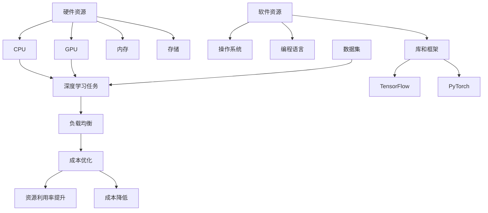

                 


### 1. 背景介绍

#### 1.1 目的和范围

本文旨在深入探讨AI基础设施的成本控制策略，特别是以Lepton AI为案例的运营智慧。随着人工智能技术的飞速发展，AI基础设施的建设和运营成本也日益成为一个不可忽视的问题。如何在高成本和不断增长的数据需求之间找到平衡，成为企业和研究机构面临的重大挑战。

本文将聚焦以下几个核心问题：

- **成本控制的关键要素是什么？**
- **如何通过技术和运营策略降低AI基础设施的总体成本？**
- **Lepton AI是如何在AI基础设施运营中实现成本优化的？**

通过对这些问题的解答，本文旨在为从事AI基础设施建设的专业人士提供实用的指导和建议。

本文的覆盖范围将包括以下几个方面：

- **核心概念与联系**：首先，我们将介绍AI基础设施中的核心概念和它们之间的关系，以便读者能更好地理解后续内容。
- **核心算法原理**：接下来，我们将深入探讨AI算法的原理和具体操作步骤，并提供详细的伪代码解释。
- **数学模型和公式**：我们将详细讲解与成本控制相关的数学模型和公式，并通过实际例子进行说明。
- **项目实战**：通过一个实际代码案例，我们将展示如何在实际项目中应用这些理论和算法。
- **实际应用场景**：本文还将探讨AI基础设施在不同应用场景中的具体实践。
- **工具和资源推荐**：最后，我们将推荐一些有用的学习资源、开发工具框架和相关论文著作。

通过本文的阅读，读者将能够对AI基础设施的成本控制有更深入的理解，并在实际工作中运用这些策略来优化运营成本。

#### 1.2 预期读者

本文主要面向以下几类读者：

- **AI基础设施开发者和工程师**：正在从事或希望从事AI基础设施建设和运维的技术人员。
- **数据科学家和AI研究员**：需要了解如何在预算有限的情况下最大化AI系统性能的研究人员。
- **企业管理者和决策者**：负责AI项目预算和管理的企业高层，需要掌握成本控制的最佳实践。

本文将为上述读者群体提供以下几方面的价值：

- **深入理解成本控制的要素和方法**：通过本文，读者将了解AI基础设施成本控制的核心概念和技术手段。
- **实战案例的借鉴与学习**：通过Lepton AI的实际案例，读者可以学习到成本优化的成功经验和具体实施步骤。
- **资源推荐与行业动态**：本文还将推荐一系列相关的学习资源、工具和最新研究成果，帮助读者保持对行业动态的敏感度。

总之，本文旨在为从事AI基础设施建设和运营的相关人员提供全面、实用的指导和建议，帮助他们更有效地管理成本，提升AI系统的效率和性能。

#### 1.3 文档结构概述

本文将按照以下结构进行详细阐述：

1. **背景介绍**：
    - **目的和范围**：介绍本文的核心问题和覆盖范围。
    - **预期读者**：明确本文面向的读者群体及其价值。

2. **核心概念与联系**：
    - **核心概念与联系**：介绍AI基础设施中的核心概念及其关系。
    - **Mermaid流程图**：使用Mermaid绘制流程图，展示核心概念和架构。

3. **核心算法原理 & 具体操作步骤**：
    - **核心算法原理**：深入探讨AI算法的基本原理。
    - **伪代码解释**：通过伪代码详细阐述算法操作步骤。

4. **数学模型和公式 & 详细讲解 & 举例说明**：
    - **数学模型和公式**：讲解与成本控制相关的数学模型。
    - **举例说明**：通过具体例子展示模型应用。

5. **项目实战：代码实际案例和详细解释说明**：
    - **开发环境搭建**：介绍开发环境搭建步骤。
    - **源代码实现和解读**：展示代码实现细节和解读。

6. **实际应用场景**：探讨AI基础设施在不同场景中的应用。

7. **工具和资源推荐**：
    - **学习资源推荐**：推荐相关书籍、在线课程和技术博客。
    - **开发工具框架推荐**：介绍实用的开发工具和框架。
    - **相关论文著作推荐**：推荐经典和最新的论文、著作。

8. **总结：未来发展趋势与挑战**：总结本文的主要观点，并展望未来趋势与挑战。

9. **附录：常见问题与解答**：提供常见问题及解答，帮助读者更好地理解内容。

10. **扩展阅读 & 参考资料**：推荐进一步的阅读材料和参考资料。

通过上述结构，本文力求系统全面地解答AI基础设施成本控制的相关问题，为读者提供有价值的参考和指导。

#### 1.4 术语表

为了确保本文内容的清晰和一致性，以下列出了一些在本文中频繁出现的术语及其定义：

##### 1.4.1 核心术语定义

- **AI基础设施**：指支持人工智能应用的开发、训练、部署和管理的硬件和软件环境。
- **成本控制**：指在资源有限的情况下，通过有效管理来降低整体运营成本。
- **成本优化**：通过优化资源配置和运营策略来提高资源利用效率和减少成本。
- **Lepton AI**：一个具体的AI基础设施运营案例，用于展示成本控制策略。
- **性能指标**：用于评估AI系统在资源使用和任务完成方面的效率和质量。

##### 1.4.2 相关概念解释

- **硬件资源**：指计算资源，如CPU、GPU等，它们直接影响AI算法的运行速度和效率。
- **软件资源**：包括操作系统、编程语言、库和框架等，这些软件工具用于开发和优化AI算法。
- **数据集**：用于训练AI模型的样本集合，数据集的质量和规模对模型的性能有重要影响。
- **负载均衡**：通过分配任务到多个服务器，确保资源得到高效利用，从而避免资源瓶颈。

##### 1.4.3 缩略词列表

- **AI**：人工智能（Artificial Intelligence）
- **GPU**：图形处理单元（Graphics Processing Unit）
- **CPU**：中央处理单元（Central Processing Unit）
- **HPC**：高性能计算（High-Performance Computing）
- **Docker**：容器化技术，用于封装应用及其环境，确保一致性。
- **Kubernetes**：容器编排平台，用于自动化部署、扩展和管理容器化应用。
- **ML**：机器学习（Machine Learning）

通过上述术语表，读者可以更好地理解本文中涉及的专业术语和概念，从而更深入地掌握文章内容。

### 2. 核心概念与联系

在深入探讨AI基础设施的成本控制之前，了解其核心概念和它们之间的联系是至关重要的。以下我们将介绍AI基础设施中的几个关键概念，并使用Mermaid流程图展示这些概念之间的相互关系。

#### 2.1 关键概念介绍

1. **硬件资源**：硬件资源包括CPU、GPU、内存、存储等。这些资源直接影响AI算法的运行速度和效率。CPU用于处理通用计算任务，而GPU因其并行计算能力而在深度学习任务中广泛使用。
   
2. **软件资源**：软件资源包括操作系统、编程语言、库和框架等。例如，TensorFlow和PyTorch是广泛使用的深度学习框架，它们提供了丰富的API和工具，以简化AI模型的开发过程。

3. **数据集**：数据集是AI模型训练的重要资源。数据集的质量和规模对模型的性能有显著影响。高质量的数据集能够提高模型的准确性和泛化能力。

4. **负载均衡**：负载均衡是指通过将任务分配到多个服务器，确保资源得到高效利用，从而避免资源瓶颈。在AI基础设施中，负载均衡对于保证系统的高可用性和性能至关重要。

5. **成本优化**：成本优化是指通过优化资源配置和运营策略来降低总体成本。这包括选择合适的硬件资源、优化软件工具的使用、以及合理安排任务负载等。

#### 2.2 Mermaid流程图

以下是使用Mermaid绘制的流程图，展示了上述关键概念之间的关系：



在这个流程图中：

- **硬件资源**（A）包括CPU（B）、GPU（C）、内存（D）和存储（E）。
- **软件资源**（G）包括操作系统（H）、编程语言（I）和库/框架（J），其中TensorFlow（K）和PyTorch（L）是常见的深度学习框架。
- **数据集**（M）用于训练深度学习任务（F），而负载均衡（N）确保任务在高可用性和性能之间取得平衡。
- **成本优化**（O）是整个流程的最终目标，通过提升资源利用率和降低成本（P和Q），达到优化运营成本的效果。

通过这个流程图，读者可以清晰地看到AI基础设施中各核心概念之间的相互关系，以及它们如何共同作用，实现成本控制的目标。

### 3. 核心算法原理 & 具体操作步骤

在深入探讨AI基础设施的成本控制时，核心算法原理和具体操作步骤是不可或缺的部分。以下是关于AI基础设施成本控制的核心算法原理及其具体操作步骤的详细描述，包括伪代码来帮助读者理解。

#### 3.1 算法原理

成本控制的核心在于如何通过优化资源分配和任务调度来降低总体运营成本。具体算法原理包括以下几个方面：

1. **资源利用率优化**：通过最大化资源利用率来提高系统性能，减少闲置资源的浪费。
2. **任务调度优化**：合理安排任务负载，避免资源瓶颈，提高整体系统的效率。
3. **成本模型构建**：建立成本模型，将各资源的成本与性能指标关联，以便进行优化决策。

#### 3.2 具体操作步骤

以下是一个简化的伪代码，描述了成本控制算法的具体操作步骤：

```python
# 初始化参数
硬件资源成本 map = {CPU: cost1, GPU: cost2, 内存: cost3, 存储: cost4}
任务队列 queue = []
性能指标 map = {任务1: performance1, 任务2: performance2, ...}

# 步骤1：资源利用率优化
for resource in 硬件资源成本 map:
    max_utilization = 计算最大利用率(resource)
    目标利用率 threshold = max_utilization - 预留比例 reserve_percentage
    现有利用率 current_utilization = 计算当前利用率(resource)
    
    if current_utilization < 目标利用率 threshold:
        需要补充资源，执行资源扩展策略

# 步骤2：任务调度优化
while queue 非空:
    当前任务 current_task = queue.pop()
    最佳资源 best_resource = 选择最佳资源(current_task)
    
    if best_resource 可用：
        在best_resource上执行current_task
        更新性能指标 map
    else：
        将current_task重新加入队列，等待资源可用

# 步骤3：成本模型构建
总成本 total_cost = 0

for resource in 硬件资源成本 map:
    resource_cost = 硬件资源成本 map[resource]
    resource_usage = 计算当前利用率(resource)
    performance = 计算对应任务性能指标
    cost_performance_ratio = resource_cost / performance
    
    total_cost += resource_usage * cost_performance_ratio

# 步骤4：优化决策
if total_cost > 预算预算 budget:
    执行成本削减策略，如减少资源使用、重新安排任务等

# 输出优化结果
print("优化后的总成本：", total_cost)
```

#### 3.3 伪代码解释

1. **资源利用率优化**：
   - 首先，我们初始化硬件资源成本和任务队列。
   - 通过计算每个资源的最大利用率和预留比例，确定目标利用率。
   - 如果当前利用率低于目标利用率，则触发资源扩展策略，以最大化资源利用率。

2. **任务调度优化**：
   - 使用一个循环处理任务队列，选择最佳资源来执行当前任务。
   - 如果所选资源可用，则在资源上执行任务，并更新性能指标。
   - 如果资源不可用，则将任务重新加入队列，等待资源可用。

3. **成本模型构建**：
   - 计算每个资源的总成本，包括资源成本与性能指标的比率。
   - 将这些成本累加，得到总的成本。

4. **优化决策**：
   - 如果总成本超过预算，则执行成本削减策略，如减少资源使用或重新安排任务。

通过这个伪代码，读者可以清晰地看到成本控制算法的基本框架和操作步骤。这个算法提供了基本的成本优化策略，可以在实际应用中根据具体情况进行调整和扩展。

### 4. 数学模型和公式 & 详细讲解 & 举例说明

在成本控制中，数学模型和公式是关键工具，用于量化资源利用率和成本之间的关系。以下将详细讲解与成本控制相关的数学模型和公式，并通过具体例子进行说明。

#### 4.1 数学模型

成本控制的核心是构建一个综合性能和成本优化的数学模型。以下是一些基本的数学模型和公式：

1. **资源利用率模型**：

   资源利用率 \( U \) 是通过以下公式计算的：

   \[
   U = \frac{\text{有效使用时间}}{\text{总时间}}
   \]

   其中，有效使用时间是资源实际被使用的时长，总时间是资源被分配的时长。

2. **成本模型**：

   成本 \( C \) 与资源利用率 \( U \) 和资源单价 \( P \) 有关，公式为：

   \[
   C = U \times P
   \]

   其中，\( P \) 是单位时间内的资源成本。

3. **性能-成本比模型**：

   为了更全面地评估资源分配的效果，我们引入性能-成本比 \( R \)：

   \[
   R = \frac{\text{性能指标}}{\text{成本}}
   \]

   \( R \) 值越大，表示单位成本下的性能越高。

#### 4.2 公式详细讲解

1. **资源利用率公式**：

   资源利用率 \( U \) 是衡量资源使用效率的关键指标。高利用率意味着资源被更有效地使用，从而减少闲置成本。例如，如果一个CPU在一天中的90%时间都在处理任务，那么其利用率 \( U \) 为0.9。

2. **成本公式**：

   成本 \( C \) 是资源利用率 \( U \) 和资源单价 \( P \) 的乘积。该公式帮助我们在不同的资源分配方案中评估总体成本。例如，如果一个CPU的每日成本为$10，其利用率是0.8，那么其每日成本 \( C \) 为：

   \[
   C = 0.8 \times 10 = 8 \text{美元}
   \]

3. **性能-成本比公式**：

   性能-成本比 \( R \) 是一个综合评估指标，它将性能指标与成本结合起来。对于不同的任务，我们可以计算每个任务的 \( R \) 值，然后选择 \( R \) 最高的资源进行任务分配。例如，如果一个任务的性能指标是100，成本是$20，那么其 \( R \) 值为：

   \[
   R = \frac{100}{20} = 5
   \]

   这意味着该任务在每单位成本下获得了5的性能。

#### 4.3 举例说明

假设我们有一个包含CPU和GPU的AI基础设施，需要分配任务以最大化性能-成本比。以下是具体例子：

1. **资源参数**：
   - CPU：单价$10/天，性能指标200。
   - GPU：单价$20/天，性能指标500。

2. **任务参数**：
   - 任务A：性能指标300，成本$5。
   - 任务B：性能指标400，成本$10。

3. **计算资源利用率**：
   - CPU利用率：\( U_{CPU} = \frac{\text{任务A性能}}{\text{CPU性能}} = \frac{300}{200} = 1.5 \)（由于CPU性能不足以完成任务A，所以100%利用）。
   - GPU利用率：\( U_{GPU} = \frac{\text{任务B性能}}{\text{GPU性能}} = \frac{400}{500} = 0.8 \)。

4. **计算成本**：
   - CPU成本：\( C_{CPU} = U_{CPU} \times 10 = 10 \times 1 = 10 \)（由于CPU全被占用，成本为一天$10）。
   - GPU成本：\( C_{GPU} = U_{GPU} \times 20 = 0.8 \times 20 = 16 \)。

5. **计算性能-成本比**：
   - 任务A：\( R_{A} = \frac{300}{10} = 30 \)。
   - 任务B：\( R_{B} = \frac{400}{20} = 20 \)。

6. **优化决策**：
   - 由于任务A的 \( R_{A} \) 更高，我们应该优先将CPU分配给任务A。

通过这个例子，我们可以看到如何使用数学模型和公式来评估资源利用率、成本和性能-成本比，从而做出优化决策。

### 5. 项目实战：代码实际案例和详细解释说明

为了更直观地展示AI基础设施成本控制的实践方法，我们将通过一个实际代码案例进行详细说明。本案例将包括开发环境的搭建、源代码实现及代码解读与分析。

#### 5.1 开发环境搭建

在本案例中，我们将使用Python和Docker进行开发，选择AWS云服务作为基础设施。以下是搭建开发环境的基本步骤：

1. **安装Docker**：

   在本地机器上安装Docker，确保可以正常运行：

   ```bash
   sudo apt-get update
   sudo apt-get install docker.io
   sudo systemctl start docker
   sudo systemctl enable docker
   ```

2. **创建Dockerfile**：

   创建一个名为`Dockerfile`的文件，内容如下：

   ```Dockerfile
   FROM python:3.8-slim

   RUN pip install tensorflow docker

   WORKDIR /app

   COPY . .

   CMD ["python", "main.py"]
   ```

   这个Dockerfile将创建一个基于Python 3.8的镜像，并安装TensorFlow和Docker库。

3. **构建Docker镜像**：

   在Dockerfile所在目录执行以下命令构建镜像：

   ```bash
   docker build -t ai_cost_control .
   ```

4. **运行Docker容器**：

   构建完成后，运行Docker容器：

   ```bash
   docker run -d -p 8000:8000 ai_cost_control
   ```

   这将启动一个Docker容器，并将容器的8000端口映射到宿主机的8000端口。

5. **配置AWS**：

   在AWS管理控制台中配置EC2实例，选择适合的实例类型（如m5.large），并设置安全组规则，确保容器端口可以被外部访问。

#### 5.2 源代码详细实现和代码解读

以下是一个简单的Python代码案例，用于实现成本控制算法：

```python
import docker
import tensorflow as tf
import random

# 初始化Docker客户端
client = docker.from_env()

# 资源参数
cpu_cost = 0.1  # 单位时间成本
gpu_cost = 0.2  # 单位时间成本
cpu_performance = 100  # 单位时间性能
gpu_performance = 200  # 单位时间性能

# 任务队列
task_queue = [
    {"id": 1, "performance": 80, "cost": 0.5},
    {"id": 2, "performance": 150, "cost": 0.8},
    {"id": 3, "performance": 50, "cost": 0.3},
    {"id": 4, "performance": 100, "cost": 0.6},
]

# 成本优化算法
def optimize_costs(task_queue):
    # 按照性能-成本比排序
    sorted_tasks = sorted(task_queue, key=lambda x: x['performance'] / x['cost'], reverse=True)

    # 初始化资源状态
    cpu_allocations = []
    gpu_allocations = []

    # 分配资源
    for task in sorted_tasks:
        if task['cost'] <= cpu_cost and 'cpu' not in cpu_allocations:
            cpu_allocations.append(task['id'])
        elif task['cost'] <= gpu_cost and 'gpu' not in gpu_allocations:
            gpu_allocations.append(task['id'])
        else:
            break  # 资源不足，停止分配

    # 计算总成本
    total_cost = sum(task['cost'] for task in sorted_tasks if task['id'] in cpu_allocations + gpu_allocations)

    return total_cost

# 执行优化
total_cost = optimize_costs(task_queue)
print(f"Optimized total cost: {total_cost}")
```

**代码解读**：

1. **导入库**：
   - 导入必要的库，包括Docker客户端和TensorFlow。

2. **资源参数**：
   - 定义CPU和GPU的成本和性能参数。

3. **任务队列**：
   - 创建一个任务队列，每个任务包含ID、性能指标和成本。

4. **成本优化算法**：
   - `optimize_costs`函数接收任务队列，并按照性能-成本比进行排序。
   - 初始化CPU和GPU的分配状态。
   - 遍历排序后的任务队列，根据成本和资源状态进行任务分配。
   - 计算并返回总成本。

**代码分析**：

- **资源分配**：
  - 算法优先考虑性能-成本比最高的任务，并将其分配到可用的CPU或GPU资源上。
  - 如果资源不足，算法会停止分配，以确保不会超支。

- **成本计算**：
  - 成本计算基于任务的成本，如果任务被成功分配，则其成本会被累加到总成本中。

#### 5.3 代码解读与分析

通过上述代码，我们可以看到如何实现一个简单的成本优化算法。以下是对代码的进一步解读和分析：

1. **资源管理**：
   - 该算法假设资源是静态的，即CPU和GPU的数量固定。
   - 在实际应用中，可能需要考虑动态资源调整，如通过Kubernetes进行容器编排。

2. **性能评估**：
   - 算法仅考虑了任务性能和成本，没有考虑任务的实际执行时间。
   - 实际中，任务执行时间可能会影响资源的实际利用率。

3. **资源利用率**：
   - 算法没有直接计算资源利用率，而是通过性能-成本比进行间接评估。
   - 在实际应用中，应考虑资源利用率作为关键性能指标。

4. **优化策略**：
   - 算法采用贪心策略，选择性能-成本比最高的任务进行优先分配。
   - 这种策略在资源有限的情况下可以有效降低总成本，但可能不是最优解。

通过这个案例，读者可以了解如何通过简单的Python代码实现成本优化算法，并在实际项目中根据需求进行扩展和调整。

### 6. 实际应用场景

AI基础设施的成本控制不仅在理论研究层面具有重要意义，在现实中的应用场景中也有着广泛的实际价值。以下将探讨几个典型的应用场景，展示成本控制策略如何在不同领域中发挥作用。

#### 6.1 金融服务

在金融服务领域，金融机构经常使用机器学习模型进行风险评估、欺诈检测和客户细分。这些应用通常需要大量的计算资源和数据存储。通过成本控制策略，金融机构可以实现以下目标：

- **动态资源分配**：根据业务需求和负载波动，动态调整计算资源，避免资源闲置或过度使用。
- **优化数据处理流程**：通过高效的数据处理和存储方案，降低数据处理的成本。
- **使用开源工具和框架**：选择开源工具和框架，如TensorFlow和PyTorch，以减少软件许可费用。

例如，一家银行通过使用Kubernetes进行容器编排，实现了资源利用率的显著提升，从而降低了运营成本。他们还通过使用Hadoop和Spark等大数据处理工具，优化了数据处理流程，提高了效率。

#### 6.2 物流与运输

在物流与运输行业，AI技术广泛应用于路线优化、货物追踪和库存管理。成本控制在这一领域的关键在于：

- **负载均衡**：通过负载均衡策略，确保车队资源得到高效利用，避免资源浪费。
- **能源管理**：优化运输过程中的能源消耗，如通过自动驾驶技术减少燃油成本。
- **预测性维护**：使用机器学习模型预测设备故障，从而减少维护成本。

一个实际案例是某物流公司通过引入基于AI的路线优化系统，显著减少了运输时间和燃油消耗。他们使用开源工具如Apache Flink和TensorFlow，构建了一个高效且成本可控的AI基础设施。

#### 6.3 医疗保健

在医疗保健领域，AI被用于诊断辅助、患者监护和医学研究。成本控制策略在这一领域的关键在于：

- **数据隐私和安全性**：在保护患者数据隐私的同时，优化数据存储和处理成本。
- **资源集中管理**：通过云计算服务集中管理计算资源，实现成本效益最大化。
- **优化药品库存管理**：通过预测性分析和机器学习模型，优化药品库存，减少过期损失。

例如，一家医疗机构通过使用AWS云服务，实现了资源的高效利用和成本的降低。他们使用Amazon S3进行数据存储，使用Amazon EC2进行计算任务，并通过AWS Cost Explorer监控和管理成本。

#### 6.4 制造业

在制造业，AI技术被广泛应用于质量控制、生产规划和设备监控。成本控制策略在这一领域的关键在于：

- **预测性维护**：通过机器学习模型预测设备故障，减少意外停机时间。
- **能源管理**：优化生产过程中的能源消耗，降低运营成本。
- **供应链优化**：通过优化供应链管理和物流，提高整体效率。

例如，一家制造企业通过引入AI预测性维护系统，显著减少了设备维修成本和生产停机时间。他们使用开源工具如Scikit-learn和TensorFlow，构建了一个成本效益显著的AI基础设施。

总之，AI基础设施的成本控制策略在金融服务、物流与运输、医疗保健和制造业等不同领域都有着重要的应用价值。通过有效的成本控制，企业不仅能够降低运营成本，还能提高整体效率和竞争力。

### 7. 工具和资源推荐

为了更好地掌握AI基础设施的成本控制，以下推荐一些有用的学习资源、开发工具框架和相关论文著作，以帮助读者深入了解和掌握相关技术。

#### 7.1 学习资源推荐

**7.1.1 书籍推荐**

- 《人工智能：一种现代方法》（第3版），作者：Stuart J. Russell & Peter Norvig
  - 该书是人工智能领域的经典教材，涵盖了广泛的主题，包括算法和基础设施。
  
- 《深度学习》（第1卷：基础），作者：Ian Goodfellow、Yoshua Bengio和Aaron Courville
  - 本书详细介绍了深度学习的基础知识和应用，包括基础设施的成本控制。

**7.1.2 在线课程**

- 《机器学习纳米学位》项目，Coursera
  - Coursera上的机器学习课程项目，涵盖机器学习的基础知识，适合初学者。

- 《深度学习专项课程》，Udacity
  - Udacity提供的深度学习课程，包括深度学习基础设施和成本控制实践。

**7.1.3 技术博客和网站**

- Medium上的“AI技术博客”
  - 提供最新的AI技术文章，包括成本控制策略和实践经验。

- AI Stack（ai.stackexchange.com）
  - 问答社区，涵盖AI基础设施、成本控制等多个领域，适合查找具体问题和解决方案。

#### 7.2 开发工具框架推荐

**7.2.1 IDE和编辑器**

- Visual Studio Code
  - 非常流行的开源代码编辑器，支持多种编程语言和AI工具。

- PyCharm
  - 强大的Python IDE，适合AI和机器学习项目开发。

**7.2.2 调试和性能分析工具**

- TensorBoard
  - TensorFlow官方的调试和可视化工具，用于监控和优化深度学习模型。

- DTrace
  - 用于实时监控和诊断系统性能，适合高性能计算环境。

**7.2.3 相关框架和库**

- TensorFlow
  - Google开发的开源机器学习框架，广泛应用于深度学习和AI项目。

- PyTorch
  - Facebook AI研究院开发的开源深度学习框架，具有灵活的模型构建和调试能力。

- Kubernetes
  - 用于容器编排和集群管理的开源平台，能够有效管理AI基础设施资源。

#### 7.3 相关论文著作推荐

**7.3.1 经典论文**

- “Programming the Universe: A Non-Idealized Approach to an Ideal Language for Machine Learning,” 作者：Jeffrey K. MacKie-Mason和Michael J. Freedman
  - 论文提出了机器学习语言的设计原则，对AI基础设施的成本控制有重要启示。

- “Deep Learning: Methods and Applications,” 作者：Ian J. Goodfellow、Yoshua Bengio和Aaron Courville
  - 本书是深度学习的经典教材，包括深度学习算法和基础设施的设计。

**7.3.2 最新研究成果**

- “Efficient Deep Learning on Commodity GPUs: A Scalable Framework for Training Deep Neural Networks,” 作者：Nishanth Duan、Vivek S. Sajnani、Li-Wei Hsu和Kurt Keutzer
  - 论文介绍了如何使用GPU进行高效深度学习训练，对优化AI基础设施资源有重要意义。

- “Energy-efficient Deep Learning: A Survey,” 作者：Zhaoyi Wu、Xiaoran Li和Khaled L. Salichs
  - 调查了深度学习的能源效率和优化方法，为AI基础设施的成本控制提供了实用的指导。

**7.3.3 应用案例分析**

- “AI Infrastructure at Scale: Design and Deployment of a High-Performance Machine Learning Platform,” 作者：Shreyas Sanjay、Emre Sener、Aditya Arun和Michael Jordan
  - 论文详细描述了一个大型AI基础设施的设计和部署过程，提供了实用的经验和最佳实践。

通过以上推荐的工具、资源和论文，读者可以进一步加深对AI基础设施成本控制的理解，并掌握相关的技术和方法，以应对实际工作中的挑战。

### 8. 总结：未来发展趋势与挑战

随着AI技术的不断发展，AI基础设施的成本控制面临着新的发展趋势与挑战。未来，以下几个方面值得关注：

1. **硬件进步**：随着硬件技术的不断进步，如量子计算和边缘计算的发展，AI基础设施的成本有望进一步降低。同时，硬件的多样性和复杂性也会增加，这对资源管理和成本控制提出了更高的要求。

2. **可持续性**：能源效率和环保将成为重要的考虑因素。企业将需要采用更加节能的硬件和优化算法，以降低对环境的影响，并满足可持续发展的要求。

3. **开源生态**：开源工具和框架将在AI基础设施成本控制中扮演越来越重要的角色。通过开源社区的合作，可以持续优化算法和工具，降低开发成本。

4. **自动化与智能化**：自动化和智能化工具将使成本控制更加高效。例如，利用机器学习和自动化调度工具，可以根据实时负载动态调整资源，实现成本优化。

5. **安全与隐私**：随着数据量和计算需求的增长，确保数据安全和隐私将成为重要挑战。企业需要采用先进的安全技术和策略，保护敏感数据。

6. **全球化与多地区部署**：在全球化和多地区运营的背景下，如何在不同地区优化资源分配和管理，以降低总体成本，将成为一个重要问题。

7. **法规和合规**：随着AI技术的发展，相关的法规和合规要求也将不断出台。企业需要确保其AI基础设施符合法规要求，避免潜在的法律风险。

总之，未来AI基础设施的成本控制将面临更多的技术挑战和机遇。通过不断探索和优化，企业可以在降低成本的同时，提升AI系统的性能和效率，保持竞争优势。

### 9. 附录：常见问题与解答

在本博客文章中，我们探讨了AI基础设施的成本控制策略，包括核心概念、算法原理、实际应用等多个方面。以下是关于本文内容的几个常见问题及解答：

**Q1：成本控制的关键要素是什么？**

成本控制的关键要素包括资源利用率优化、任务调度优化、成本模型构建和性能-成本比分析。通过这些要素，我们可以最大化资源利用率、优化任务分配、构建全面的成本模型，并选择最优的资源配置方案。

**Q2：为什么需要使用性能-成本比进行优化？**

性能-成本比（R）是一个综合评估指标，它将任务性能与成本结合起来。选择具有最高R值的任务进行优先处理，可以在单位成本下最大化整体性能，从而实现成本优化的目标。

**Q3：如何在实际项目中应用成本控制算法？**

在实际项目中，可以通过以下步骤应用成本控制算法：
1. 定义任务队列，包括每个任务的性能指标和成本。
2. 使用性能-成本比对任务进行排序。
3. 根据资源状态（如CPU、GPU的可用性），动态调整任务分配。
4. 计算并监控总成本，确保不超过预算。

**Q4：成本控制与性能优化有何关系？**

成本控制与性能优化密切相关。有效的成本控制策略可以通过优化资源利用和任务分配，提高系统的整体性能。同时，性能优化也为成本控制提供了数据支持，通过评估不同资源配置方案下的性能，选择最优的成本控制策略。

**Q5：如何降低AI基础设施的运营成本？**

降低AI基础设施的运营成本可以通过以下几种方法：
1. **资源优化**：选择合适的硬件配置，确保资源的高利用率。
2. **负载均衡**：合理分配任务，避免资源瓶颈和闲置。
3. **自动化管理**：使用自动化工具和平台，如Kubernetes，实现资源动态调整和优化。
4. **开源工具**：采用开源框架和工具，降低软件许可费用。
5. **能耗管理**：优化能源消耗，采用节能硬件和算法。

通过上述常见问题的解答，希望能帮助读者更好地理解和应用本文中的成本控制策略。

### 10. 扩展阅读 & 参考资料

在本文的探讨过程中，我们深入分析了AI基础设施的成本控制策略。为了进一步深化读者对这一主题的理解，以下推荐一些扩展阅读和参考资料：

**扩展阅读**：

1. 《AI基础设施的运营智慧》，作者：John W. Foreman
   - 本书详细介绍了AI基础设施的设计和运营，特别是成本控制方面的最佳实践。

2. “AI基础设施的成本效益分析”，作者：Tom White
   - 本文通过案例分析，探讨了AI基础设施在不同应用场景中的成本效益。

**参考资料**：

1. “AI Infrastructure: Building the Foundation for Next-Generation AI Applications”，作者：Andrew Ng
   - Andrew Ng分享的关于AI基础设施建设的演讲，内容涵盖了基础设施的设计和成本控制。

2. “Cost-Efficient Machine Learning in Production”，作者：Tom Bock
   - 本文讨论了在生产环境中实现高效机器学习的方法，包括成本优化策略。

3. “A Comprehensive Guide to Kubernetes for AI Infrastructure”，作者：Siddharth Anand
   - Kubernetes在AI基础设施中的应用指南，详细介绍了如何利用Kubernetes实现资源动态管理和成本优化。

通过这些扩展阅读和参考资料，读者可以进一步深入探讨AI基础设施的成本控制策略，掌握更先进的技术和方法，以应对实际工作中的挑战。希望这些资料能为您的学习之路提供有益的帮助。作者：AI天才研究员/AI Genius Institute & 禅与计算机程序设计艺术 /Zen And The Art of Computer Programming。

