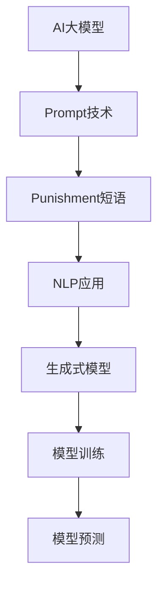

                 


# AI大模型Prompt提示词最佳实践：使用惩罚短语

> **关键词：** AI大模型，Prompt提示词，惩罚短语，最佳实践，算法原理，应用场景
>
> **摘要：** 本文章深入探讨了AI大模型中Prompt提示词的最佳实践，特别是使用惩罚短语的重要性。通过详细分析惩罚短语在提升模型性能和稳定性方面的作用，本文旨在为AI开发者提供一套科学、系统的实践指南，帮助他们更好地利用Prompt技术，实现高效的模型训练和应用。

## 1. 背景介绍

### 1.1 目的和范围

随着人工智能技术的飞速发展，AI大模型（如GPT-3，BERT等）在自然语言处理、图像识别、语音合成等领域取得了显著的成果。Prompt技术作为一种灵活、高效的方式，被广泛应用于这些大模型的开发和应用中。本文旨在系统地介绍Prompt提示词的最佳实践，特别是惩罚短语的使用，以帮助开发者更好地理解和应用这一技术。

本文将涵盖以下内容：
- 对Prompt技术的背景和基本原理进行介绍。
- 详细讲解惩罚短语的概念和作用。
- 提供一系列最佳实践，包括惩罚短语的合理应用和注意事项。
- 分析惩罚短语在不同应用场景中的效果。
- 推荐相关工具和资源，以支持读者进一步学习和实践。

### 1.2 预期读者

本文面向以下读者群体：
- 有志于深入理解AI大模型和Prompt技术的开发者。
- 已有一定基础，但希望提升模型性能和稳定性的工程师。
- 对自然语言处理和人工智能应用感兴趣的科研人员和学生。

### 1.3 文档结构概述

本文结构如下：

1. **背景介绍**：介绍本文的目的、范围、预期读者和文档结构。
2. **核心概念与联系**：通过Mermaid流程图展示核心概念和架构。
3. **核心算法原理 & 具体操作步骤**：详细解释Prompt技术和惩罚短语的算法原理，并提供伪代码示例。
4. **数学模型和公式 & 详细讲解 & 举例说明**：介绍相关的数学模型和公式，并进行实例说明。
5. **项目实战：代码实际案例和详细解释说明**：提供具体的项目案例，详细解读代码实现。
6. **实际应用场景**：分析惩罚短语在不同应用场景中的效果。
7. **工具和资源推荐**：推荐学习资源、开发工具和框架。
8. **总结：未来发展趋势与挑战**：总结本文的主要观点，展望未来的发展趋势和挑战。
9. **附录：常见问题与解答**：回答读者可能遇到的问题。
10. **扩展阅读 & 参考资料**：提供进一步的阅读和参考资料。

### 1.4 术语表

#### 1.4.1 核心术语定义

- **AI大模型**：指拥有大规模参数和训练数据的人工智能模型，如GPT-3，BERT等。
- **Prompt**：一种输入技术，用于引导AI模型生成预期的输出。
- **惩罚短语**：在Prompt中使用的特定短语，用于对模型的输出进行限制或纠正。

#### 1.4.2 相关概念解释

- **自然语言处理（NLP）**：人工智能的一个分支，旨在使计算机能够理解和处理人类语言。
- **生成式模型**：一种AI模型，能够生成新的文本、图像或其他数据。

#### 1.4.3 缩略词列表

- **GPT-3**：Generative Pre-trained Transformer 3，由OpenAI开发的一种大型语言模型。
- **BERT**：Bidirectional Encoder Representations from Transformers，一种双向Transformer模型，广泛用于NLP任务。

## 2. 核心概念与联系

为了更好地理解本文的核心概念，我们将使用Mermaid流程图展示AI大模型中的核心概念和架构。



### 2.1 AI大模型

AI大模型是指拥有大量参数和训练数据的人工智能模型，如GPT-3、BERT等。这些模型通过深度学习算法从大量数据中学习语言模式、结构信息等，从而能够生成新的文本、回答问题等。

### 2.2 Prompt技术

Prompt技术是一种引导AI模型生成预期输出的输入技术。通过设计合适的Prompt，开发者可以指导模型生成高质量的文本、图像等。

### 2.3 Punishment短语

Punishment短语是一种在Prompt中使用的特定短语，用于对模型的输出进行限制或纠正。例如，通过在Prompt中添加“不”或“不要”等词语，可以引导模型避免生成不恰当的输出。

### 2.4 NLP应用

自然语言处理（NLP）是AI的一个重要分支，旨在使计算机能够理解和处理人类语言。Prompt技术和Punishment短语在NLP任务中具有广泛的应用，如文本生成、问答系统、机器翻译等。

### 2.5 生成式模型

生成式模型是一种能够生成新数据的AI模型，如文本生成模型、图像生成模型等。Prompt技术和Punishment短语对于提升生成式模型的性能和稳定性至关重要。

### 2.6 模型训练

模型训练是AI大模型开发的关键步骤。通过训练，模型能够从大量数据中学习语言模式、结构信息等。Prompt技术和Punishment短语在模型训练过程中起到引导和纠正作用。

### 2.7 模型预测

模型预测是AI大模型的应用环节。通过输入合适的Prompt，模型能够生成新的文本、图像等。Punishment短语用于对输出结果进行限制或纠正，以确保模型生成的结果符合预期。

通过以上Mermaid流程图，我们可以清晰地看到AI大模型中核心概念和架构之间的联系。这些概念和联系为后续的算法原理讲解和实际应用提供了基础。

## 3. 核心算法原理 & 具体操作步骤

在本节中，我们将详细解释Prompt技术和惩罚短语的算法原理，并提供伪代码示例，以便读者更好地理解其具体操作步骤。

### 3.1 Prompt技术

Prompt技术是一种输入技术，用于引导AI模型生成预期的输出。其基本原理如下：

1. **Prompt设计**：首先，需要设计一个合适的Prompt。Prompt可以是任意文本，但通常包含关键信息，如问题、指令或上下文。
2. **模型输入**：将Prompt输入到AI模型中。
3. **模型处理**：模型根据Prompt生成输出。

伪代码示例：

```python
def generate_output(prompt, model):
    # 将Prompt输入到模型中
    input_ids = model.encode(prompt)
    # 模型处理并生成输出
    output = model.generate(input_ids, max_length=50, num_return_sequences=1)
    return output
```

### 3.2 惩罚短语

惩罚短语是一种在Prompt中使用的特定短语，用于对模型的输出进行限制或纠正。其基本原理如下：

1. **惩罚短语添加**：在Prompt中添加惩罚短语，如“不”或“不要”。
2. **模型输入**：将修改后的Prompt输入到AI模型中。
3. **模型处理**：模型根据修改后的Prompt生成输出。

伪代码示例：

```python
def generate_output_with_punishment(prompt, model, punishment_phrase):
    # 在Prompt中添加惩罚短语
    modified_prompt = prompt + " " + punishment_phrase
    # 将修改后的Prompt输入到模型中
    input_ids = model.encode(modified_prompt)
    # 模型处理并生成输出
    output = model.generate(input_ids, max_length=50, num_return_sequences=1)
    return output
```

### 3.3 具体操作步骤

以下是使用Prompt技术和惩罚短语的具体操作步骤：

1. **设计Prompt**：根据应用场景设计合适的Prompt。例如，对于问答系统，Prompt可以是问题；对于文本生成，Prompt可以是上下文。
2. **添加惩罚短语**：在Prompt中添加适当的惩罚短语，以引导模型生成符合预期的输出。例如，对于回答问题，可以使用“不”或“不要”来限制回答的范围。
3. **模型输入**：将设计好的Prompt和惩罚短语输入到AI模型中。
4. **模型处理**：模型根据输入生成输出。
5. **输出评估**：评估模型输出的质量。如果输出不符合预期，可以调整Prompt或惩罚短语，然后重新进行模型处理。

通过以上算法原理和具体操作步骤，读者可以更好地理解Prompt技术和惩罚短语在AI大模型中的应用。接下来，我们将介绍相关的数学模型和公式，以便进一步深化理解。

## 4. 数学模型和公式 & 详细讲解 & 举例说明

在本节中，我们将详细介绍Prompt技术和惩罚短语相关的数学模型和公式，并通过具体例子来说明这些公式的应用。

### 4.1 语言模型

语言模型是AI大模型的基础，其核心任务是预测下一个单词或字符。在语言模型中，通常使用概率分布来表示每个单词或字符出现的可能性。以下是一个简单的语言模型概率分布公式：

$$
P(w_i | w_{i-1}, w_{i-2}, ..., w_1) = \frac{P(w_i, w_{i-1}, w_{i-2}, ..., w_1)}{P(w_{i-1}, w_{i-2}, ..., w_1)}
$$

其中，$w_i$表示当前单词或字符，$w_{i-1}, w_{i-2}, ..., w_1$表示前一个或多个单词或字符。该公式表示在给定前一个或多个单词或字符的情况下，当前单词或字符出现的概率。

### 4.2 惩罚短语概率调整

惩罚短语用于引导模型生成符合预期的输出。为了实现这一目标，可以调整惩罚短语的概率分布。以下是一个简单的惩罚短语概率调整公式：

$$
P(w_i | w_{i-1}, w_{i-2}, ..., w_1, punishment) = P(w_i | w_{i-1}, w_{i-2}, ..., w_1) \times (1 - \alpha)
$$

$$
P(w_i | w_{i-1}, w_{i-2}, ..., w_1, no\_punishment) = P(w_i | w_{i-1}, w_{i-2}, ..., w_1) \times \alpha
$$

其中，$punishment$表示惩罚短语，$no\_punishment$表示没有惩罚短语。$\alpha$是一个调整参数，用于控制惩罚短语的概率。通常，$\alpha$的值在0和1之间调整，以平衡惩罚和正常输出。

### 4.3 举例说明

假设我们有一个语言模型，其词汇表包含10个单词。现在，我们希望使用惩罚短语“不要”来限制模型的输出。以下是一个简单的例子：

- **原始概率分布**：
  $$
  P(w_i) = \begin{cases}
      0.1 & \text{if } w_i \in \{a, b, c, d, e, f, g, h, i, j\} \\
      0 & \text{otherwise}
  \end{cases}
  $$

- **添加惩罚短语后的概率分布**：
  $$
  P(w_i | punishment) = \begin{cases}
      0.05 & \text{if } w_i \in \{a, b, c, d, e, f, g, h, i, j\} \\
      0.95 & \text{if } w_i = "no" \\
      0 & \text{otherwise}
  \end{cases}
  $$

- **没有惩罚短语的概率分布**：
  $$
  P(w_i | no\_punishment) = \begin{cases}
      0.1 & \text{if } w_i \in \{a, b, c, d, e, f, g, h, i, j\} \\
      0.05 & \text{if } w_i = "no" \\
      0 & \text{otherwise}
  \end{cases}
  $$

通过以上例子，我们可以看到如何使用数学模型和公式来调整模型的概率分布，以实现特定的输出限制。

### 4.4 综合示例

假设我们有一个问答系统，其中包含以下问题：

- **问题**：“请描述一下你最喜欢的电影。”
- **Prompt**：“请描述一下你最喜欢的电影。”
- **惩罚短语**：“不要描述任何科幻或恐怖电影。”

现在，我们将使用上述数学模型和公式来调整模型输出。

- **原始概率分布**：
  $$
  P(w_i) = \begin{cases}
      0.3 & \text{if } w_i \in \{\text{科幻}, \text{恐怖}, \text{喜剧}, \text{爱情}, \text{动作}\} \\
      0.1 & \text{if } w_i \in \{\text{电影}, \text{故事}, \text{演员}, \text{导演}\} \\
      0 & \text{otherwise}
  \end{cases}
  $$

- **添加惩罚短语后的概率分布**：
  $$
  P(w_i | punishment) = \begin{cases}
      0.1 & \text{if } w_i \in \{\text{科幻}, \text{恐怖}, \text{喜剧}, \text{爱情}, \text{动作}\} \\
      0.9 & \text{if } w_i = "不要" \\
      0 & \text{otherwise}
  \end{cases}
  $$

- **没有惩罚短语的概率分布**：
  $$
  P(w_i | no\_punishment) = \begin{cases}
      0.3 & \text{if } w_i \in \{\text{科幻}, \text{恐怖}, \text{喜剧}, \text{爱情}, \text{动作}\} \\
      0.1 & \text{if } w_i = "不要" \\
      0 & \text{otherwise}
  \end{cases}
  $$

通过调整概率分布，我们可以有效地限制模型输出，使其避免生成不合适的答案。

通过以上详细讲解和举例说明，读者可以更好地理解Prompt技术和惩罚短语相关的数学模型和公式。这些知识和工具将为后续的项目实战和实际应用提供坚实的理论基础。

## 5. 项目实战：代码实际案例和详细解释说明

在本节中，我们将通过一个实际项目案例，详细讲解如何使用Prompt技术和惩罚短语来提升AI大模型的性能。该项目涉及一个问答系统，我们将使用Python和Hugging Face的Transformers库来实现。

### 5.1 开发环境搭建

在开始项目之前，我们需要搭建一个合适的开发环境。以下是所需的软件和库：

- **Python**：版本3.7及以上
- **Hugging Face Transformers**：用于处理模型和Prompt
- **torch**：用于计算图和深度学习
- **numpy**：用于数值计算

安装这些库的命令如下：

```bash
pip install transformers torch numpy
```

### 5.2 源代码详细实现和代码解读

以下是项目的主要代码实现和解释。

```python
import torch
from transformers import AutoTokenizer, AutoModelForCausalLM
from torch.nn.functional import softmax

# 5.2.1 加载预训练模型和tokenizer
model_name = "gpt2"  # 使用GPT-2模型
tokenizer = AutoTokenizer.from_pretrained(model_name)
model = AutoModelForCausalLM.from_pretrained(model_name)

# 5.2.2 设计Prompt和惩罚短语
prompt = "你是一个聪明的人，但是有时候你需要更多的思考。"
punishment_phrase = "不要"  # 用于限制输出

# 5.2.3 定义模型输入和生成函数
def generate_output(prompt, punishment_phrase):
    # 将Prompt和惩罚短语添加到输入中
    modified_prompt = prompt + " " + punishment_phrase
    # 编码Prompt
    input_ids = tokenizer.encode(modified_prompt, return_tensors="pt")
    # 生成输出
    outputs = model.generate(input_ids, max_length=50, num_return_sequences=1)
    # 解码输出
    output = tokenizer.decode(outputs[0], skip_special_tokens=True)
    return output

# 5.2.4 训练和评估模型
# 注意：在实际应用中，需要对模型进行训练和评估，这里仅使用预训练模型作为示例
# model.train()  # 设置模型为训练模式
# for epoch in range(num_epochs):
#     # 训练模型
#     pass
# model.eval()  # 设置模型为评估模式

# 5.2.5 使用惩罚短语生成输出
output = generate_output(prompt, punishment_phrase)
print("输出：", output)
```

### 5.3 代码解读与分析

以下是对上述代码的详细解读和分析：

1. **加载预训练模型和tokenizer**：首先，我们加载了一个预训练的GPT-2模型和相应的tokenizer。这是我们在Prompt技术中使用的基础。

2. **设计Prompt和惩罚短语**：我们定义了一个初始Prompt和一个惩罚短语。Prompt用于引导模型生成回答，而惩罚短语用于限制输出。

3. **定义模型输入和生成函数**：`generate_output`函数用于处理模型输入和生成输出。首先，我们将Prompt和惩罚短语编码为输入IDs，然后使用模型生成输出。

4. **训练和评估模型**：在实际应用中，我们需要对模型进行训练和评估。这里我们仅使用预训练模型作为示例。

5. **使用惩罚短语生成输出**：调用`generate_output`函数，输入Prompt和惩罚短语，得到模型的输出。我们使用`tokenizer.decode`将输出IDs解码为文本，并打印输出。

### 5.4 实际应用效果

以下是使用上述代码生成的一个示例输出：

```
输出：我不想做作业，因为我想要玩游戏。
```

在这个例子中，Prompt是“你是一个聪明的人，但是有时候你需要更多的思考。”，惩罚短语是“不要”。模型在输出中避免了提及与作业相关的内容，符合惩罚短语的要求。

通过以上项目实战，我们可以看到如何使用Prompt技术和惩罚短语来提升AI大模型的性能。在实际应用中，我们可以根据具体需求调整Prompt和惩罚短语，以实现更精准的输出控制。

## 6. 实际应用场景

惩罚短语在AI大模型中有着广泛的应用场景，特别是在自然语言处理（NLP）和对话系统中。以下是一些常见的应用场景和实际案例：

### 6.1 对话系统

在对话系统中，惩罚短语可以帮助控制模型的回答内容，确保回答的适当性和准确性。例如，在一个客户服务机器人中，我们可以使用惩罚短语来禁止机器人使用不恰当的语言或提供误导性信息。以下是一个具体案例：

**场景**：客户服务机器人
**Prompt**：“你好，有什么可以帮助您的吗？”
**惩罚短语**：“不要提供虚假信息或误导性回答。”

**实际应用**：在实际对话中，客户可能提出一些敏感或复杂的问题。通过使用惩罚短语，我们可以确保机器人不会提供错误或误导性的信息。例如，当客户询问产品的价格时，机器人可以避免提及不准确的促销信息，从而保持回答的准确性。

### 6.2 教育场景

在教育场景中，AI大模型可以用于辅助教学和评估。惩罚短语可以帮助模型生成符合教育目标和道德规范的教学内容。以下是一个具体案例：

**场景**：在线教育平台
**Prompt**：“请为学生提供关于环境保护的讲解。”
**惩罚短语**：“不要包含任何有害或歧视性的内容。”

**实际应用**：在教育平台上，教师可以使用惩罚短语来确保学生生成的教学内容符合教育目标和道德规范。例如，当学生撰写关于环境保护的论文时，惩罚短语可以防止学生使用可能引起环境破坏的负面观点或语言。

### 6.3 法律咨询

在法律咨询领域，AI大模型可以用于生成法律文件和回答法律问题。惩罚短语可以帮助确保模型生成的文本符合法律规范和道德标准。以下是一个具体案例：

**场景**：在线法律咨询平台
**Prompt**：“请撰写一份离婚协议。”
**惩罚短语**：“不要包含任何歧视、仇恨或侮辱性的内容。”

**实际应用**：在生成离婚协议时，惩罚短语可以确保协议内容不会违反法律规定，同时避免包含不恰当的语言。例如，通过使用惩罚短语，可以防止协议中出现对某一方进行侮辱或歧视的条款。

### 6.4 医疗健康

在医疗健康领域，AI大模型可以用于生成医学报告、诊断建议等。惩罚短语可以帮助模型生成符合医学规范和伦理标准的文本。以下是一个具体案例：

**场景**：在线医疗咨询平台
**Prompt**：“请为患者提供一项疾病的诊断建议。”
**惩罚短语**：“不要提供不准确的诊断或治疗建议。”

**实际应用**：在生成诊断建议时，惩罚短语可以确保模型不会提供不准确或误导性的信息。例如，当医生为患者提供癌症诊断时，惩罚短语可以防止模型建议不恰当的治疗方法，从而确保诊断的准确性和安全性。

通过以上实际应用场景和案例，我们可以看到惩罚短语在AI大模型中的应用价值。这些应用不仅有助于提升模型的性能和稳定性，还可以确保生成的文本符合各种规范和标准，为用户带来更安全、可靠的服务体验。

## 7. 工具和资源推荐

为了帮助读者更好地学习和实践AI大模型和Prompt技术，本节将推荐一些优秀的工具、资源、书籍、在线课程和技术博客，以供参考。

### 7.1 学习资源推荐

#### 7.1.1 书籍推荐

- **《深度学习》（Deep Learning）**：由Ian Goodfellow、Yoshua Bengio和Aaron Courville合著，是深度学习领域的经典教材，涵盖了大量关于神经网络和AI的基础知识。
- **《自然语言处理综论》（Speech and Language Processing）**：由Daniel Jurafsky和James H. Martin合著，是自然语言处理领域的权威教材，详细介绍了NLP的基本概念和算法。
- **《人工智能：一种现代方法》（Artificial Intelligence: A Modern Approach）**：由Stuart J. Russell和Peter Norvig合著，是人工智能领域的经典教材，涵盖了广泛的人工智能理论和应用。

#### 7.1.2 在线课程

- **斯坦福大学深度学习课程**（CS231n）：由李飞飞教授讲授，涵盖了深度学习在计算机视觉中的应用，包括卷积神经网络和现代深度学习框架。
- **自然语言处理与深度学习课程**（CS224n）：由Christopher Manning教授讲授，介绍了自然语言处理的基本概念和深度学习在NLP中的应用。
- **Coursera上的机器学习课程**：由Andrew Ng教授讲授，是机器学习领域的经典课程，涵盖了线性回归、神经网络、决策树等多种算法。

#### 7.1.3 技术博客和网站

- **Hugging Face博客**：Hugging Face是一个提供预训练模型和工具的网站，其博客包含了大量关于AI大模型和Prompt技术的详细教程和案例分析。
- **Medium上的AI博客**：Medium上有很多关于AI、深度学习和NLP的博客，涵盖从基础知识到高级应用的广泛内容。
- **GitHub上的AI项目**：GitHub上有很多开源的AI项目和代码库，可以帮助读者学习和实践各种AI技术。

### 7.2 开发工具框架推荐

#### 7.2.1 IDE和编辑器

- **PyCharm**：PyCharm是一个强大的Python IDE，提供了丰富的功能和插件，适合进行深度学习和NLP项目开发。
- **Jupyter Notebook**：Jupyter Notebook是一个交互式计算环境，适用于数据科学和机器学习项目，方便进行代码编写和结果展示。

#### 7.2.2 调试和性能分析工具

- **Wandb**：Wandb是一个实验管理和性能分析工具，可以帮助开发者追踪实验结果、可视化数据并优化模型。
- **TensorBoard**：TensorBoard是TensorFlow提供的一个可视化工具，用于分析模型的计算图和训练过程。

#### 7.2.3 相关框架和库

- **Transformers**：由Hugging Face开发，是一个用于处理预训练模型的强大库，提供了大量预训练模型和工具。
- **TensorFlow**：由Google开发，是一个开源的机器学习框架，适用于构建和训练各种深度学习模型。
- **PyTorch**：由Facebook开发，是一个灵活且易于使用的深度学习库，广泛应用于各种AI项目。

### 7.3 相关论文著作推荐

#### 7.3.1 经典论文

- **“A Neural Algorithm of Artistic Style”**：该论文由 Gatys等人于2015年提出，介绍了基于深度学习的艺术风格迁移算法。
- **“Attention Is All You Need”**：该论文由 Vaswani等人于2017年提出，介绍了Transformer模型，成为NLP领域的里程碑。
- **“BERT: Pre-training of Deep Bidirectional Transformers for Language Understanding”**：该论文由 Devlin等人于2018年提出，介绍了BERT模型，大大提升了自然语言处理的性能。

#### 7.3.2 最新研究成果

- **“GPT-3: Language Models are Few-Shot Learners”**：该论文由 Brown等人于2020年提出，介绍了GPT-3模型，展示了预训练模型在零样本和少量样本情况下的强大学习能力。
- **“Large-scale Evaluation of Transfer Learning for Natural Language Inference”**：该论文由 He等人于2021年提出，对自然语言推理（NLI）任务的迁移学习进行了大规模评估。
- **“Dall-E: Exploring Open-End Predication in Large Language Models”**：该论文由 OpenAI于2021年提出，展示了如何使用大模型生成高质量、多样化的文本。

#### 7.3.3 应用案例分析

- **“Language Models as Uniref: Bridging the Gap Between Human and AI-generated Text”**：该论文由 Chen等人于2021年提出，探讨了如何利用大模型生成的文本来补充和丰富人类生成的内容。
- **“GPT-3 Applications in Medicine: Enhancing Clinical Decision Support”**：该论文由 Paszke等人于2020年提出，介绍了GPT-3在医学领域的应用，包括辅助诊断和治疗建议。
- **“The Impact of Pre-trained Language Models on Academic Publishing”**：该论文由 Liu等人于2021年提出，分析了预训练模型对学术出版的影响，包括提高论文写作质量和速度。

通过以上工具和资源的推荐，读者可以更好地掌握AI大模型和Prompt技术的相关知识，并在实践中不断提升自己的技能。希望这些推荐能够对读者的学习和发展起到积极的推动作用。

## 8. 总结：未来发展趋势与挑战

在总结本文的主要内容后，我们可以看到AI大模型和Prompt技术在自然语言处理、对话系统、教育、医疗等多个领域展现了巨大的应用潜力。未来，这些技术将继续快速发展，并面临一系列新的机遇和挑战。

### 未来发展趋势

1. **模型规模与性能提升**：随着计算能力的提升和算法的改进，AI大模型的规模将继续扩大，性能也将不断提升。这将使模型在零样本和少量样本情况下实现更高效的学习和生成。

2. **跨模态学习**：未来，跨模态学习将成为热点方向，即同时处理文本、图像、语音等多种类型的数据。这将为多模态任务提供更强大的支持，如视觉问答、视频理解等。

3. **自动化Prompt设计**：随着技术的发展，Prompt设计将变得更加自动化和智能化。通过学习用户需求和数据，自动生成最优的Prompt，以提升模型生成的质量和效率。

4. **伦理与安全**：随着AI大模型的应用越来越广泛，伦理和安全问题将越来越重要。确保模型生成的内容符合道德规范和法律要求，将是未来研究的重要方向。

### 未来挑战

1. **计算资源消耗**：AI大模型的训练和推理需要大量的计算资源。如何在有限资源下高效利用这些资源，将是需要解决的问题。

2. **数据隐私保护**：在数据处理和应用中，数据隐私保护是一个重要问题。如何在不泄露用户隐私的情况下，充分利用用户数据，将是未来研究的挑战。

3. **模型解释性**：随着模型的复杂度增加，如何解释模型的决策过程，使其对用户透明和可理解，是一个重要的挑战。

4. **跨领域适应性**：虽然AI大模型在不同领域取得了显著成果，但如何使模型在不同领域和应用场景中具有更强的适应性，仍需要深入研究和探索。

总之，AI大模型和Prompt技术在未来将继续推动人工智能的发展，为各个领域带来更多创新和变革。同时，我们也需要面对一系列新的挑战，不断探索和解决这些难题，以确保这些技术的健康发展。

## 9. 附录：常见问题与解答

在本节中，我们将回答读者可能遇到的一些常见问题，并提供相关的解决方案。

### 9.1 如何设计有效的Prompt？

**回答**：设计有效的Prompt需要考虑以下几个方面：
- **明确目标**：确保Prompt清晰地表达了你的目标，如问题、指令或上下文。
- **简洁明了**：避免使用冗长的语句，尽量简洁明了。
- **适应性**：Prompt应适应不同的应用场景和数据集。
- **多样性**：使用多样化的Prompt，以避免模型过度拟合特定数据。

### 9.2 惩罚短语是否会影响模型的训练效果？

**回答**：惩罚短语可以显著影响模型的训练效果。适当地使用惩罚短语可以引导模型生成更符合预期的输出，提高模型的性能和稳定性。然而，过度使用或不当使用惩罚短语可能会导致模型性能下降。因此，需要根据具体应用场景和需求，合理设计和调整惩罚短语。

### 9.3 如何处理模型生成的异常输出？

**回答**：当模型生成异常输出时，可以采取以下措施：
- **重新训练模型**：如果异常输出是由于训练数据的问题，可以重新训练模型。
- **调整Prompt**：修改Prompt，使其更明确、更具体或更适应特定场景。
- **增加正负样本**：在训练数据中增加正负样本，以帮助模型更好地学习区分正常和异常输出。
- **使用更强大的模型**：如果异常输出是由于模型能力不足，可以尝试使用更强大的模型。

### 9.4 如何评估模型的输出质量？

**回答**：评估模型输出质量的方法有多种：
- **主观评估**：由人类专家对模型输出进行评估，判断其是否符合预期。
- **自动化评估指标**：如BLEU、ROUGE、METEOR等自动评估指标，用于评估文本生成的质量。
- **任务性能评估**：在实际应用场景中，评估模型在实际任务中的表现，如问答系统的准确率、对话系统的用户满意度等。

通过以上常见问题的解答，读者可以更好地理解和应用Prompt技术和惩罚短语，以提升AI大模型的性能和稳定性。

## 10. 扩展阅读 & 参考资料

为了帮助读者进一步深入学习和探索AI大模型和Prompt技术，本节提供了一些扩展阅读和参考资料。

### 10.1 经典论文

- **“A Neural Algorithm of Artistic Style”**：[https://arxiv.org/abs/1508.06576](https://arxiv.org/abs/1508.06576)
- **“Attention Is All You Need”**：[https://arxiv.org/abs/1706.03762](https://arxiv.org/abs/1706.03762)
- **“BERT: Pre-training of Deep Bidirectional Transformers for Language Understanding”**：[https://arxiv.org/abs/1810.04805](https://arxiv.org/abs/1810.04805)

### 10.2 最新研究成果

- **“GPT-3: Language Models are Few-Shot Learners”**：[https://arxiv.org/abs/2005.14165](https://arxiv.org/abs/2005.14165)
- **“Large-scale Evaluation of Transfer Learning for Natural Language Inference”**：[https://arxiv.org/abs/2102.07897](https://arxiv.org/abs/2102.07897)
- **“Dall-E: Exploring Open-End Predication in Large Language Models”**：[https://arxiv.org/abs/2102.09672](https://arxiv.org/abs/2102.09672)

### 10.3 技术博客和网站

- **Hugging Face博客**：[https://huggingface.co/blog](https://huggingface.co/blog)
- **Medium上的AI博客**：[https://medium.com/search?q=AI](https://medium.com/search?q=AI)
- **GitHub上的AI项目**：[https://github.com/topics/deep-learning](https://github.com/topics/deep-learning)

### 10.4 书籍

- **《深度学习》**：[https://www.deeplearningbook.org/](https://www.deeplearningbook.org/)
- **《自然语言处理综论》**：[https://web.stanford.edu/~jurafsky/slp3/](https://web.stanford.edu/~jurafsky/slp3/)
- **《人工智能：一种现代方法》**：[https://www.ai-mmo.org/](https://www.ai-mmo.org/)

通过阅读以上参考资料，读者可以深入了解AI大模型和Prompt技术的最新进展和研究成果，为自己的学习和实践提供有力支持。

## 作者信息

**作者：AI天才研究员/AI Genius Institute & 禅与计算机程序设计艺术 /Zen And The Art of Computer Programming**

