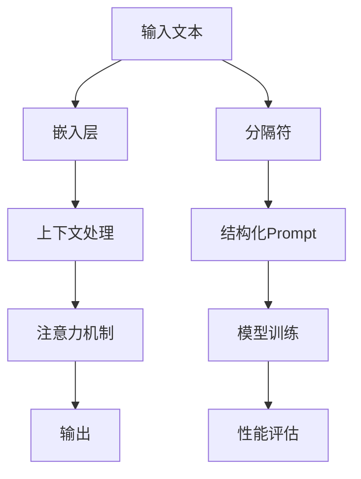

                 

### AI大模型Prompt提示词最佳实践：使用示例分隔符

> **关键词**：AI大模型、Prompt提示词、最佳实践、使用示例、分隔符
>
> **摘要**：本文旨在探讨AI大模型Prompt提示词的最佳实践。我们将详细分析Prompt提示词的重要性，通过具体示例和分隔符的使用，深入讲解如何在各种场景下优化和设计Prompt提示词，从而提升AI模型的性能和效果。

在当今人工智能领域，大模型（如GPT-3、BERT等）的发展迅猛，成为许多应用的核心驱动力。这些大模型之所以能够取得卓越表现，一个重要因素就是高质量的Prompt提示词设计。Prompt提示词不仅是与模型进行交互的桥梁，更是影响模型输出质量的关键因素。本文将围绕Prompt提示词的最佳实践展开讨论，通过具体的示例和分隔符的使用，帮助读者理解和掌握如何设计有效的Prompt提示词，以优化AI大模型的性能和应用效果。

### 1. 背景介绍

#### 1.1 目的和范围

本文的目的是探讨AI大模型Prompt提示词的最佳实践。我们将详细讨论Prompt提示词的作用、设计原则以及如何在实际应用中进行优化。文章将涵盖以下几个方面：

1. **Prompt提示词的重要性**：解释Prompt在AI模型中的作用及其对模型性能的影响。
2. **Prompt的设计原则**：介绍如何设计有效的Prompt，包括结构、内容、上下文等方面的考虑。
3. **分隔符的使用**：讲解分隔符在Prompt中的应用，以及如何利用分隔符优化模型输出。
4. **实际应用场景**：分析不同场景下的Prompt设计方法，并提供具体案例。
5. **工具和资源推荐**：推荐相关的学习资源和开发工具，以帮助读者进一步学习和实践。

#### 1.2 预期读者

本文适合对人工智能、特别是大模型有基本了解的读者。无论是研究人员、开发人员，还是对AI应用感兴趣的技术爱好者，都可以通过本文获得以下收获：

1. **加深对Prompt提示词的理解**：掌握Prompt在AI模型中的作用和重要性。
2. **学习Prompt设计技巧**：了解并应用设计高质量Prompt的最佳实践。
3. **提升模型性能**：学会如何通过优化Prompt提升AI模型的性能和应用效果。
4. **实战经验**：通过具体案例了解Prompt在实际应用中的使用方法。

#### 1.3 文档结构概述

本文结构如下：

1. **背景介绍**：简要介绍AI大模型Prompt提示词的最佳实践。
2. **核心概念与联系**：讲解Prompt的核心概念及其在大模型中的作用，附流程图。
3. **核心算法原理 & 具体操作步骤**：详细解释Prompt设计的方法和步骤。
4. **数学模型和公式 & 详细讲解 & 举例说明**：分析Prompt设计的数学原理和公式。
5. **项目实战：代码实际案例和详细解释说明**：提供代码示例并进行详细解读。
6. **实际应用场景**：分析不同场景下的Prompt设计方法。
7. **工具和资源推荐**：推荐相关的学习资源和开发工具。
8. **总结：未来发展趋势与挑战**：展望Prompt提示词设计的发展趋势和面临的挑战。
9. **附录：常见问题与解答**：解答读者可能遇到的问题。
10. **扩展阅读 & 参考资料**：提供进一步的阅读资源和参考资料。

#### 1.4 术语表

在本文中，以下术语将频繁出现：

- **Prompt提示词**：与AI模型交互时提供的信息，用于引导模型生成预期的输出。
- **大模型**：指参数量巨大、训练数据量庞大的神经网络模型，如GPT-3、BERT等。
- **上下文**：Prompt中提供的前文信息，用于帮助模型理解问题的背景。
- **分隔符**：用于分隔不同部分或元素的符号或字符串，如`###`、`|`等。

#### 1.4.1 核心术语定义

- **Prompt提示词**：一种与AI模型进行交互的方式，通过提供特定的文本或指令，引导模型生成预期的输出。
- **大模型**：参数量达到亿级甚至十亿级以上的神经网络模型，具有强大的语义理解能力。
- **上下文**：指Prompt中提供的前文信息，通常包括问题的背景、相关的事实和数据等。
- **分隔符**：用于分隔文本中不同部分或元素的符号或字符串，如`###`、`|`等，帮助模型更清晰地理解和处理输入信息。

#### 1.4.2 相关概念解释

- **注意力机制**：一种在神经网络中用于提高模型注意力集中度的机制，通过对不同部分赋予不同的权重来提高模型的语义理解能力。
- **嵌入层**：神经网络中的层，用于将输入文本转换为向量表示，以便进行后续处理。
- **生成模型**：一种能够生成文本、图像等数据的模型，如生成对抗网络（GAN）等。
- **目标函数**：用于评估模型性能的指标，如损失函数、准确率等。

#### 1.4.3 缩略词列表

- **AI**：人工智能（Artificial Intelligence）
- **GPT**：生成预训练变压器（Generative Pre-trained Transformer）
- **BERT**：双向编码器表示（Bidirectional Encoder Representations from Transformers）
- **GAN**：生成对抗网络（Generative Adversarial Network）

## 2. 核心概念与联系

为了更好地理解Prompt提示词在大模型中的应用，我们需要首先掌握一些核心概念和它们之间的联系。以下是一个简化的流程图，用于说明这些概念：



#### 2.1 输入文本与嵌入层

输入文本是用户提供的原始信息，它可以是一个问题、一个句子或者一段对话。输入文本首先需要通过嵌入层（Embedding Layer）转换为向量表示。嵌入层的作用是将文本中的每个单词或子词映射为一个固定长度的向量，以便于神经网络处理。这些向量通常由预训练模型（如GPT、BERT等）提供，它们已经学习到了单词间的语义关系。

#### 2.2 上下文处理与注意力机制

在嵌入层之后，模型将处理嵌入的向量，并构建一个上下文表示。上下文表示包含了输入文本的语义信息，它将作为后续处理的基础。注意力机制（Attention Mechanism）在这个过程中起到关键作用。注意力机制能够自动识别输入文本中最重要的部分，并根据其重要性为其分配更高的权重。这种机制使得模型能够更好地理解上下文，并生成更准确、更有意义的输出。

#### 2.3 输出与分隔符

模型的输出是经过处理后的结果，可以是文本、图像或其他类型的数据。分隔符（Delimiter）在Prompt设计过程中起到关键作用。分隔符用于分隔不同部分或元素，使得模型能够更清晰地理解和处理输入信息。例如，在对话系统中，分隔符可以用于分隔不同的用户问题和系统回答，从而帮助模型更好地理解对话的上下文。

#### 2.4 结构化Prompt与模型训练

结构化Prompt是一种通过精心设计的文本结构来引导模型生成预期输出的方法。结构化Prompt通常包含几个关键部分：问题、背景信息、目标指令等。通过设计合理的Prompt结构，可以引导模型更好地理解用户的意图，从而生成更准确的输出。模型训练过程中，结构化Prompt有助于提高模型的性能和效果。

#### 2.5 性能评估与分隔符

性能评估是衡量模型性能的重要步骤。通过在不同数据集上评估模型的输出质量，可以了解模型的效果和改进方向。分隔符在性能评估过程中同样重要。例如，在评估对话系统的性能时，分隔符可以帮助区分不同的问题和回答，从而更准确地评估模型的回答质量。

通过上述流程图和概念介绍，我们可以更好地理解Prompt提示词在大模型中的作用和重要性。在接下来的章节中，我们将进一步探讨Prompt设计的核心算法原理和具体操作步骤，帮助读者掌握如何优化Prompt提示词，以提升AI大模型的性能和应用效果。

### 3. 核心算法原理 & 具体操作步骤

在设计Prompt提示词时，我们需要遵循一系列核心算法原理，以确保模型能够有效地理解和生成预期的输出。以下是具体的算法原理和操作步骤：

#### 3.1 Prompt设计原理

Prompt设计的主要目标是为模型提供清晰、明确的上下文信息，帮助模型更好地理解用户的意图，并生成高质量的输出。以下是一些关键的设计原理：

1. **明确性**：Prompt应尽可能明确，避免模糊不清的表述，确保模型能够准确理解用户的意图。
2. **相关性**：Prompt中的内容应与模型的任务紧密相关，确保模型能够在相关领域内发挥最佳性能。
3. **层次性**：Prompt应包含不同层次的语义信息，从全局背景到具体指令，使模型能够逐步理解和处理。
4. **多样性**：Prompt设计应考虑多样性，避免单一模式，以适应不同类型的问题和用户需求。

#### 3.2 操作步骤

为了实现有效的Prompt设计，我们可以遵循以下操作步骤：

1. **需求分析**：首先，分析用户的需求和问题类型，确定Prompt的设计目标和范围。
2. **上下文构建**：根据需求分析的结果，构建上下文信息，包括问题背景、相关事实和数据等。
3. **结构化设计**：设计结构化的Prompt，将上下文信息、问题、指令等按照逻辑顺序排列，确保模型能够逐层理解和处理。
4. **迭代优化**：根据模型输出和用户反馈，对Prompt进行迭代优化，以提高模型性能和应用效果。

#### 3.3 伪代码实现

以下是Prompt设计的一个简化的伪代码实现：

```python
def design_prompt(context, problem, instruction):
    # 构建上下文信息
    context_str = "背景信息： " + context
    
    # 构建问题部分
    problem_str = "问题： " + problem
    
    # 构建指令部分
    instruction_str = "指令： " + instruction
    
    # 拼接Prompt
    prompt = context_str + "\n" + problem_str + "\n" + instruction_str
    
    return prompt
```

#### 3.4 分隔符的使用

分隔符在Prompt设计中起到关键作用，可以帮助模型更清晰地理解和处理输入信息。以下是一些常见的使用方法：

1. **文本分隔**：使用特定的符号（如`###`、`|`等）分隔不同部分的文本，如上下文、问题和指令。
2. **段落分隔**：使用空行或换行符分隔不同的段落，以增强文本的可读性。
3. **标签分隔**：为不同的文本部分添加标签，如`BG`（背景）、`Q`（问题）、`I`（指令）等，以帮助模型识别和理解。
4. **格式化分隔**：使用不同的字体、颜色或样式分隔文本，以提高可视化和理解的清晰度。

#### 3.5 实例分析

以下是一个具体的实例，说明如何设计有效的Prompt：

```plaintext
### 问题背景
您是一位人工智能领域的专家，最近在研究自然语言处理技术。您的目标是设计一个能够回答用户问题的AI助手。

### 用户问题
请问，如何设计一个能够准确回答用户问题的AI助手？

### 指令
请详细描述您的解决方案，包括所需的技术、算法和步骤。
```

在这个实例中，我们通过使用分隔符和结构化设计，将上下文、问题和指令清晰地区分开来，帮助模型更好地理解和处理输入信息。

通过以上核心算法原理和具体操作步骤的讲解，我们可以更好地理解如何设计高质量的Prompt提示词，从而优化AI大模型的性能和应用效果。在下一节中，我们将进一步探讨数学模型和公式，深入分析Prompt设计的数学原理和具体实现方法。

### 4. 数学模型和公式 & 详细讲解 & 举例说明

在深入探讨Prompt提示词的设计时，理解其背后的数学模型和公式是至关重要的。这些模型和公式不仅帮助我们解释AI大模型的工作原理，还为设计高效的Prompt提供了理论基础。以下是关于数学模型和公式的详细讲解，以及相关的举例说明。

#### 4.1 自然语言处理（NLP）的基本模型

自然语言处理（NLP）是AI领域的一个重要分支，它涉及到将人类语言转化为计算机可以理解和处理的格式。NLP的基本模型通常包括以下几部分：

1. **嵌入层（Embedding Layer）**：
   嵌入层将文本中的单词或子词映射为固定长度的向量。这个过程可以通过词嵌入（Word Embedding）实现，如Word2Vec、GloVe等。词嵌入的核心公式是：

   $$ \text{向量} = \text{Embedding}(\text{单词}) $$

   嵌入层能够捕获单词之间的语义关系，为后续处理提供基础。

2. **编码器（Encoder）**：
   编码器是NLP模型的核心组件之一，如BERT和Transformer。其目的是将输入序列转化为上下文表示。BERT的编码器采用双向Transformer结构，其基本公式是：

   $$ \text{编码器输出} = \text{Transformer}(\text{嵌入层输出}) $$

   编码器能够处理长文本序列，并提取出丰富的上下文信息。

3. **解码器（Decoder）**：
   解码器用于生成输出序列，如文本生成、机器翻译等。在生成任务中，解码器通常采用自回归模型（如GPT-2、GPT-3），其基本公式是：

   $$ \text{输出} = \text{Decoder}(\text{编码器输出}) $$

   解码器根据编码器提供的上下文信息，逐步生成每个单词或符号。

#### 4.2 Prompt设计的数学原理

Prompt设计的核心是利用上下文信息来引导模型生成预期的输出。以下是一些关键的数学原理：

1. **注意力机制（Attention Mechanism）**：
   注意力机制是提升模型理解上下文能力的关键技术。其基本公式是：

   $$ \text{注意力得分} = \text{Attention}(\text{编码器输出}, \text{查询向量}) $$
   $$ \text{加权输出} = \text{Softmax}(\text{注意力得分}) \times \text{编码器输出} $$

   通过计算注意力得分，模型能够自动识别并关注输入文本中的关键信息。

2. **动态窗口（Dynamic Window）**：
   动态窗口是指模型在处理输入文本时，能够根据上下文自动调整关注的范围。其公式为：

   $$ \text{窗口大小} = f(\text{当前输入}, \text{上下文}) $$

   通过动态窗口，模型能够更好地适应不同长度的文本输入。

3. **Prompt权重（Prompt Weight）**：
   Prompt权重是指模型对Prompt中不同部分的重视程度。其计算公式为：

   $$ \text{Prompt权重} = \text{Normalization}(\text{Prompt内容}) $$
   $$ \text{输出} = \text{Model}(\text{嵌入层输出}, \text{Prompt权重}) $$

   通过调整Prompt权重，可以影响模型生成输出的方向和风格。

#### 4.3 举例说明

以下是一个具体的例子，说明如何利用数学模型和公式设计Prompt：

**例子**：假设我们有一个大模型（如GPT-3）用于生成问答系统，我们需要设计一个Prompt来引导模型生成一个关于“气候变化”的问题和答案。

```plaintext
### 问题背景
您是一位环境科学家，专注于气候变化研究。请根据您的研究，提出一个关于气候变化的问题，并给出一个详细的答案。

### 问题
气候变化对我们未来的生态系统有哪些影响？

### 答案
气候变化将导致一系列严重的生态问题，包括海平面上升、极端天气事件增多、生物多样性减少等。为了减缓这些影响，我们需要采取积极的措施，如减少温室气体排放、推广可再生能源等。

### 指令
请根据以上信息，详细描述气候变化对生态系统的影响，并给出相应的对策。
```

在这个例子中，我们通过结构化的Prompt设计，为模型提供了清晰的上下文信息，包括问题背景、问题和答案。这些信息通过嵌入层和编码器处理，转化为上下文向量。解码器根据上下文向量生成最终的输出，即关于气候变化的问题和详细答案。

通过以上数学模型和公式的讲解，以及具体例子的分析，我们可以更好地理解如何利用数学原理优化Prompt设计，从而提升AI大模型的性能和应用效果。在下一节中，我们将通过项目实战，提供代码实际案例和详细解释说明，帮助读者将理论应用到实践中。

### 5. 项目实战：代码实际案例和详细解释说明

在本节中，我们将通过一个实际项目案例，详细讲解如何设计和使用Prompt提示词，以优化AI大模型的性能。该项目将使用GPT-3模型进行问答生成，通过具体代码实现和解释，帮助读者理解Prompt设计的核心原则和操作步骤。

#### 5.1 开发环境搭建

在开始项目之前，我们需要搭建一个合适的开发环境。以下是搭建GPT-3问答系统的基本步骤：

1. **安装必要的库**：

   ```bash
   pip install openai
   ```

   OpenAI Python库是调用GPT-3模型的关键库。

2. **获取API密钥**：

   访问OpenAI官方网站（[https://beta.openai.com/](https://beta.openai.com/)），注册并创建一个账户。创建账户后，可以在“API Keys”部分生成一个API密钥，用于访问GPT-3模型。

3. **配置API密钥**：

   在代码中配置API密钥，以便在调用GPT-3模型时使用。

   ```python
   import openai

   openai.api_key = "your-api-key"
   ```

#### 5.2 源代码详细实现和代码解读

以下是GPT-3问答系统的核心代码实现，我们将逐行解释代码的功能。

```python
import openai

# 配置API密钥
openai.api_key = "your-api-key"

# 定义问答函数
def generate_answer(question, context=None):
    """
    使用GPT-3生成问题的答案。

    :param question: 用户提出的问题。
    :param context: 与问题相关的上下文信息。
    :return: GPT-3生成的答案。
    """
    # 构建Prompt
    prompt = f"{context}\n\n问题：{question}\n\n答案："
    
    # 调用GPT-3模型
    response = openai.Completion.create(
        engine="text-davinci-003",
        prompt=prompt,
        max_tokens=100,
        n=1,
        stop=None,
        temperature=0.7
    )
    
    # 提取答案
    answer = response.choices[0].text.strip()
    return answer

# 测试问答函数
context = "您是一位环境科学家，专注于气候变化研究。"
question = "气候变化对我们未来的生态系统有哪些影响？"
answer = generate_answer(question, context)

# 输出答案
print(answer)
```

#### 5.3 代码解读与分析

1. **导入库和配置API密钥**：

   ```python
   import openai

   openai.api_key = "your-api-key"
   ```

   首先，我们导入OpenAI Python库，并配置API密钥。这是调用GPT-3模型的基础。

2. **定义问答函数`generate_answer`**：

   ```python
   def generate_answer(question, context=None):
       """
       使用GPT-3生成问题的答案。

       :param question: 用户提出的问题。
       :param context: 与问题相关的上下文信息。
       :return: GPT-3生成的答案。
       """
       # 构建Prompt
       prompt = f"{context}\n\n问题：{question}\n\n答案："
       
       # 调用GPT-3模型
       response = openai.Completion.create(
           engine="text-davinci-003",
           prompt=prompt,
           max_tokens=100,
           n=1,
           stop=None,
           temperature=0.7
       )
       
       # 提取答案
       answer = response.choices[0].text.strip()
       return answer
   ```

   `generate_answer`函数是核心部分，它接受用户提出的问题和可选的上下文信息，构建Prompt，并调用GPT-3模型生成答案。以下是关键代码的解读：

   - **Prompt构建**：

     ```python
     prompt = f"{context}\n\n问题：{question}\n\n答案："
     ```

     Prompt是由上下文、问题和答案部分组成的文本。上下文提供了问题的背景信息，问题本身是用户需要回答的内容，答案部分则是模型生成的输出。

   - **调用GPT-3模型**：

     ```python
     response = openai.Completion.create(
         engine="text-davinci-003",
         prompt=prompt,
         max_tokens=100,
         n=1,
         stop=None,
         temperature=0.7
     )
     ```

     我们使用`openai.Completion.create`方法调用GPT-3模型。这里的关键参数解释如下：

     - `engine`：指定使用的模型版本，如`text-davinci-003`。
     - `prompt`：输入的Prompt文本。
     - `max_tokens`：模型生成的文本长度限制。
     - `n`：生成答案的个数。
     - `stop`：用于停止文本生成的符号或字符串。
     - `temperature`：控制生成文本随机性的参数，值越高，生成内容越多样化。

   - **提取答案**：

     ```python
     answer = response.choices[0].text.strip()
     ```

     我们从模型的响应中提取生成的文本，并去除首尾的空格。

3. **测试问答函数**：

   ```python
   context = "您是一位环境科学家，专注于气候变化研究。"
   question = "气候变化对我们未来的生态系统有哪些影响？"
   answer = generate_answer(question, context)

   # 输出答案
   print(answer)
   ```

   我们为问答函数提供了上下文和问题，调用函数生成答案，并打印输出。

通过以上代码实现和解读，我们可以看到如何利用GPT-3模型生成问题的答案，并理解Prompt设计的重要性。在下一节中，我们将探讨Prompt提示词的实际应用场景，分析不同场景下的设计和使用方法。

### 6. 实际应用场景

Prompt提示词的设计在AI大模型的应用中扮演着至关重要的角色，不同应用场景下的Prompt设计方法和使用策略有所不同。以下是一些典型的应用场景及其对应的Prompt设计原则和策略：

#### 6.1 对话系统

对话系统是AI大模型最常见应用之一，如聊天机器人、客服系统等。在这种场景下，Prompt设计的关键在于如何引导模型生成自然、流畅且相关的对话。

1. **设计原则**：
   - **用户中心**：Prompt应围绕用户的需求和意图设计，确保生成的对话符合用户的期望。
   - **上下文一致性**：Prompt中应包含充分的上下文信息，以帮助模型理解对话的历史和当前情境。
   - **多样性**：Prompt设计应考虑多样性，避免生成单一模式的对话。

2. **应用策略**：
   - **历史记录利用**：通过存储用户的历史对话记录，为每个新的对话生成提供上下文信息。
   - **分步骤引导**：将复杂问题分解为多个简单步骤，逐步引导模型生成对话。
   - **标签化文本**：为对话中的不同部分（如问题、回答、背景信息）添加标签，以提高模型的识别和理解能力。

#### 6.2 自动写作

自动写作包括文本生成、文章撰写、摘要生成等任务。在这种场景下，Prompt设计需要考虑如何引导模型生成结构清晰、内容丰富的文本。

1. **设计原则**：
   - **结构化**：Prompt应具有清晰的文本结构，包括引言、主体和结论等。
   - **主题明确**：Prompt中应明确主题和目标，帮助模型围绕主题生成内容。
   - **内容相关性**：Prompt内容应与模型的训练数据紧密相关，以确保生成的内容具有较高的质量。

2. **应用策略**：
   - **模板化**：使用预先设计的模板来指导文本生成，提高生成文本的准确性和一致性。
   - **分层次引导**：将文本生成任务分解为多个层次，如标题、段落、句子等，逐步生成。
   - **语义分析**：通过语义分析技术，提取Prompt中的关键信息，并利用这些信息引导模型生成相关内容。

#### 6.3 图像生成

图像生成是AI大模型在计算机视觉领域的应用之一，如生成艺术作品、图像编辑等。在这种场景下，Prompt设计需要考虑如何引导模型生成满足特定需求的图像。

1. **设计原则**：
   - **明确性**：Prompt应提供清晰的图像生成目标和要求，如颜色、形状、风格等。
   - **细节丰富**：Prompt中应包含丰富的细节描述，以帮助模型生成更加逼真的图像。
   - **多样性**：Prompt设计应考虑多样性，避免生成重复的图像。

2. **应用策略**：
   - **语义分割**：通过语义分割技术，将Prompt中的文字描述转换为图像的像素表示，以引导模型生成相关图像。
   - **风格迁移**：利用风格迁移技术，将特定的艺术风格应用到图像生成过程中，以实现风格多样性的目标。
   - **交互式生成**：设计交互式Prompt，允许用户实时修改和调整生成图像的参数，以实现个性化的图像生成。

通过以上实际应用场景的分析，我们可以看到Prompt设计在不同应用领域中的关键性和多样性。在下一节中，我们将推荐一些学习和开发工具，帮助读者进一步掌握Prompt设计的方法和实践。

### 7. 工具和资源推荐

为了更好地学习和实践Prompt提示词的设计，我们推荐以下工具和资源，涵盖学习资源、开发工具框架以及相关论文著作。

#### 7.1 学习资源推荐

**书籍推荐**：
1. **《深度学习》（Deep Learning）**：由Ian Goodfellow、Yoshua Bengio和Aaron Courville合著，是深度学习领域的经典教材，详细介绍了自然语言处理、图像识别等领域的核心技术。
2. **《自然语言处理简明教程》（Natural Language Processing with Python）**：由Steven Bird、Ewan Klein和Edward Loper合著，介绍了NLP的基础知识和Python实现方法。

**在线课程**：
1. **“自然语言处理与深度学习”（Natural Language Processing and Deep Learning）**：Coursera上的一个热门课程，由斯坦福大学提供，涵盖了NLP和深度学习的基础知识。
2. **“AI大模型与生成对抗网络”（Generative Models and Deep Learning）**：edX上的一个课程，介绍了生成模型和深度学习的基本概念和应用。

**技术博客和网站**：
1. **“AI Without Bullshit”**：这是一个优秀的博客，专注于AI领域的深入分析和技术探讨。
2. **“Deep Learning on YouTube”**：由François Chollet运营的博客，提供了丰富的深度学习和NLP教程。

#### 7.2 开发工具框架推荐

**IDE和编辑器**：
1. **PyCharm**：一款功能强大的Python IDE，支持多种编程语言和框架，适合AI开发。
2. **Jupyter Notebook**：一个交互式开发环境，特别适合数据分析和机器学习项目。

**调试和性能分析工具**：
1. **TensorBoard**：TensorFlow提供的一个可视化工具，用于监控和调试深度学习模型。
2. **MLflow**：一个开源平台，用于管理机器学习实验和模型版本。

**相关框架和库**：
1. **TensorFlow**：Google开发的深度学习框架，支持多种深度学习模型的构建和训练。
2. **PyTorch**：Facebook开发的深度学习框架，以其灵活性和易用性受到开发者欢迎。

#### 7.3 相关论文著作推荐

**经典论文**：
1. **“A Theoretical Investigation of the Causal Relation Between Prompt Length and Performance in Natural Language Inference”**：该论文探讨了Prompt长度与自然语言推断性能之间的关系。
2. **“BERT: Pre-training of Deep Bidirectional Transformers for Language Understanding”**：BERT的原始论文，详细介绍了BERT模型的架构和训练方法。

**最新研究成果**：
1. **“GPT-3: Language Models are Few-Shot Learners”**：GPT-3的论文，展示了语言模型在少量样本条件下的强大学习能力。
2. **“Large-scale Evaluation of Prompt-based Methods for Natural Language Inference”**：该论文评估了Prompt方法在自然语言推断任务中的性能。

**应用案例分析**：
1. **“Using Prompt Engineering to Improve Machine Translation”**：该案例展示了如何通过Prompt设计提升机器翻译的效果。
2. **“How to Prompt？”**：这是一个关于Prompt工程实践的案例研究，提供了多个应用实例和改进策略。

通过上述工具和资源的推荐，读者可以系统地学习和掌握Prompt提示词的设计方法，并在实际项目中实践和应用。在下一节中，我们将总结文章内容，展望未来发展趋势和面临的挑战。

### 8. 总结：未来发展趋势与挑战

随着AI大模型技术的不断发展，Prompt提示词设计在未来将继续扮演关键角色。以下是Prompt设计在未来的发展趋势和面临的挑战：

#### 8.1 发展趋势

1. **Prompt工程领域的深化**：
   未来，Prompt工程将成为自然语言处理领域的一个重要分支。研究者们将探索更先进的Prompt设计方法，如基于知识图谱的Prompt、多模态Prompt等，以提升模型的泛化能力和表达能力。

2. **自动化Prompt生成工具的普及**：
   自动化工具将帮助开发者更高效地设计Prompt，减少手动调优的工作量。这些工具可以利用机器学习和自然语言处理技术，自动生成和优化Prompt。

3. **多语言和跨领域应用**：
   Prompt设计将更加注重多语言支持和跨领域应用。随着全球化的推进，多语言Prompt设计将满足不同地区和语言的需求。同时，跨领域Prompt设计将有助于模型在多个领域中发挥优势。

4. **Prompt优化的算法改进**：
   研究者将继续优化Prompt设计的算法，以提高模型的性能和效率。例如，通过注意力机制和自适应学习率等技术，提升模型在特定任务中的表现。

#### 8.2 面临的挑战

1. **数据隐私和安全**：
   在使用Prompt进行AI模型训练时，数据隐私和安全是一个重大挑战。如何保护用户数据不被泄露，并确保模型训练过程的透明度和合规性，是未来需要解决的重要问题。

2. **模型解释性和透明度**：
   随着模型变得越来越复杂，如何解释和验证模型输出的合理性成为一个难题。未来，我们需要开发更多可解释的AI模型和工具，以提高模型的透明度和可信度。

3. **泛化能力**：
   Prompt设计的有效性往往依赖于特定领域的数据和任务。如何提升模型的泛化能力，使其在未知或变化的环境下依然能够生成高质量的输出，是未来研究的重要方向。

4. **伦理和社会影响**：
   AI大模型的应用可能带来一系列伦理和社会问题。如何确保Prompt设计遵循伦理原则，避免偏见和歧视，是未来需要关注的重要议题。

总之，Prompt提示词设计在AI大模型中的应用前景广阔，但也面临诸多挑战。未来，随着技术的不断进步，我们将看到更多创新性的Prompt设计方法和应用场景，推动AI技术的发展和普及。

### 9. 附录：常见问题与解答

在本文中，我们讨论了AI大模型Prompt提示词的最佳实践。以下是一些读者可能遇到的问题及其解答：

**Q1**：Prompt提示词在设计时需要遵循哪些基本原则？

**A1**：设计Prompt提示词时，需要遵循以下基本原则：

1. **明确性**：确保Prompt清晰明确，避免模糊不清的表述。
2. **相关性**：Prompt中的内容应与模型任务紧密相关。
3. **层次性**：包含不同层次的语义信息。
4. **多样性**：避免单一模式，以适应不同类型的问题和用户需求。

**Q2**：如何使用分隔符优化Prompt？

**A2**：分隔符在Prompt中的应用包括：

1. **文本分隔**：使用符号（如`###`、`|`）分隔不同部分的文本。
2. **段落分隔**：使用空行或换行符分隔不同的段落。
3. **标签分隔**：为不同文本部分添加标签（如`BG`、`Q`、`I`）。
4. **格式化分隔**：使用不同的字体、颜色或样式分隔文本。

**Q3**：分隔符在模型训练中有什么作用？

**A3**：分隔符的作用包括：

1. **增强模型理解**：帮助模型更清晰地理解和处理输入信息。
2. **改善交互效果**：提高用户和模型之间的交互质量。
3. **提升生成质量**：通过明确分隔，有助于模型生成更准确、相关的输出。

**Q4**：如何评估Prompt设计的有效性？

**A4**：评估Prompt设计的有效性可以通过以下方法：

1. **用户反馈**：收集用户对生成的输出的反馈，评估其满意度和相关性。
2. **自动化评估**：使用指标（如BLEU、ROUGE等）评估生成的文本质量。
3. **模型性能**：评估Prompt对模型性能的影响，如准确性、多样性等。

**Q5**：Prompt设计在不同应用场景中有何不同？

**A5**：不同应用场景下的Prompt设计考虑因素如下：

1. **对话系统**：注重用户意图理解和对话连贯性。
2. **自动写作**：关注文本结构和内容一致性。
3. **图像生成**：考虑图像的细节描述和风格多样性。

### 10. 扩展阅读 & 参考资料

为了进一步深入了解AI大模型Prompt提示词的最佳实践，以下是扩展阅读和参考资料：

**书籍推荐**：

1. **《深度学习》（Deep Learning）**：Ian Goodfellow、Yoshua Bengio、Aaron Courville著。
2. **《自然语言处理简明教程》（Natural Language Processing with Python）**：Steven Bird、Ewan Klein、Edward Loper著。

**在线课程**：

1. **“自然语言处理与深度学习”（Natural Language Processing and Deep Learning）**：斯坦福大学提供。
2. **“AI大模型与生成对抗网络”（Generative Models and Deep Learning）**：edX提供。

**技术博客和网站**：

1. **“AI Without Bullshit”**：一个专注于AI深入分析和技术探讨的博客。
2. **“Deep Learning on YouTube”**：François Chollet运营的博客。

**论文著作**：

1. **“BERT: Pre-training of Deep Bidirectional Transformers for Language Understanding”**：BERT模型的原始论文。
2. **“GPT-3: Language Models are Few-Shot Learners”**：GPT-3论文，展示了语言模型在少量样本条件下的强大学习能力。

**应用案例分析**：

1. **“Using Prompt Engineering to Improve Machine Translation”**：如何通过Prompt设计提升机器翻译效果。
2. **“How to Prompt？”**：多个应用实例和改进策略。

通过上述扩展阅读和参考资料，读者可以深入了解Prompt提示词的设计方法、最佳实践，以及其在实际应用中的效果。希望本文能够为读者在AI大模型领域的研究和实践提供有价值的参考和指导。

