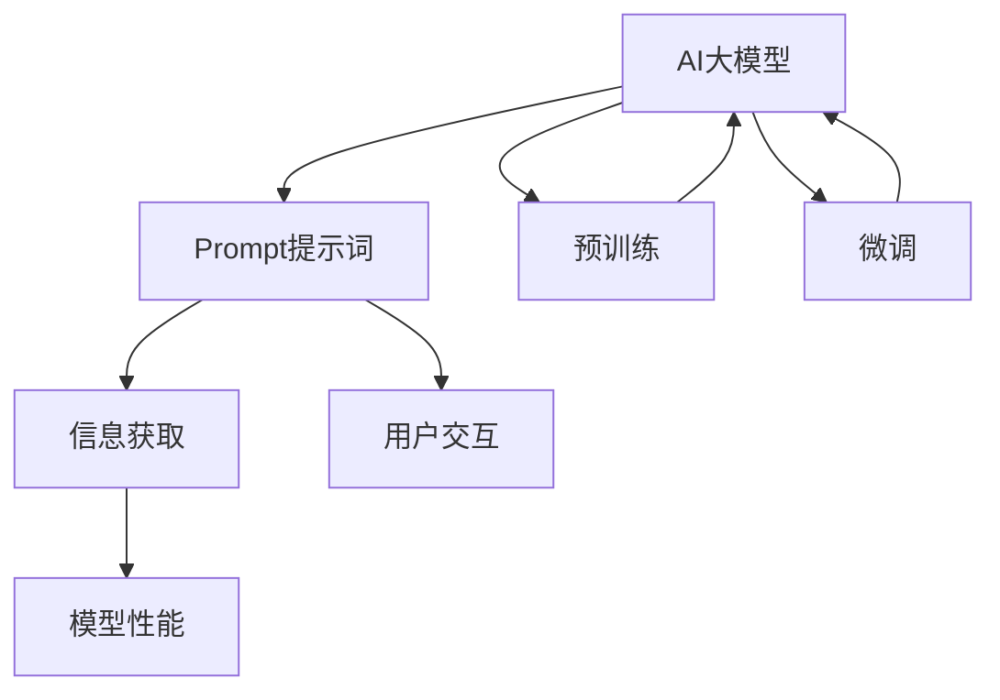

                 

# AI大模型Prompt提示词最佳实践：让模型提问直到有足够信息

> **关键词**：AI大模型、Prompt提示词、信息获取、模型优化、实践指南

> **摘要**：本文深入探讨了AI大模型中Prompt提示词的最佳实践，强调了通过不断提问来获取足够信息的策略。本文将介绍如何设计高效的Prompt提示词，以及如何利用这些提示词来提升模型的性能和准确性。通过实际案例和操作步骤，本文将为读者提供一个全面的指导，帮助他们在实践中更好地利用Prompt提示词来优化AI大模型。

## 1. 背景介绍

### 1.1 目的和范围

本文旨在探讨AI大模型中Prompt提示词的最佳实践。Prompt提示词是AI模型与用户之间交互的重要桥梁，通过适当的Prompt设计，可以显著提升模型的理解能力和输出质量。本文将重点关注以下内容：

- Prompt提示词的定义和作用
- 如何设计高效的Prompt提示词
- 通过提问获取足够信息的策略
- 实际应用场景中的Prompt实践案例
- 相关的工具和资源推荐

通过本文的阅读，读者将能够理解Prompt提示词的重要性，掌握设计Prompt的技巧，并能够将所学应用于实际的AI模型优化中。

### 1.2 预期读者

本文的预期读者包括但不限于以下群体：

- AI工程师和研究者：需要优化和改进AI模型的性能
- 数据科学家：对模型与用户交互的流程感兴趣
- 技术爱好者：对AI大模型的工作原理和应用场景感兴趣
- 开发者：希望提升AI应用的用户体验

无论您是上述哪个群体，只要对AI大模型和Prompt提示词有深入学习的需求，本文都将为您提供有价值的见解和实践指导。

### 1.3 文档结构概述

本文结构如下：

1. 背景介绍
2. 核心概念与联系
3. 核心算法原理 & 具体操作步骤
4. 数学模型和公式 & 详细讲解 & 举例说明
5. 项目实战：代码实际案例和详细解释说明
6. 实际应用场景
7. 工具和资源推荐
8. 总结：未来发展趋势与挑战
9. 附录：常见问题与解答
10. 扩展阅读 & 参考资料

每个部分都将围绕Prompt提示词的最佳实践进行深入讨论，并提供具体的操作指导和案例研究。

### 1.4 术语表

#### 1.4.1 核心术语定义

- **Prompt提示词**：用于引导AI模型理解和执行特定任务的关键词或短语。
- **大模型**：具有数亿甚至万亿参数的复杂神经网络模型，如GPT-3、BERT等。
- **参数**：模型中可调整的数值，用于优化模型的表现。
- **训练数据**：用于训练模型的输入数据和相应的标签。
- **输出**：模型根据输入数据生成的预测结果或回答。

#### 1.4.2 相关概念解释

- **自然语言处理（NLP）**：使用计算机技术和算法处理和解析自然语言数据的技术。
- **嵌入（Embedding）**：将文本或词汇映射到高维空间中，以便进行计算和比较。
- **预训练**：在特定数据集上对模型进行初步训练，以提高其泛化能力。
- **微调（Fine-tuning）**：在预训练模型的基础上，针对特定任务进行进一步训练。

#### 1.4.3 缩略词列表

- GPT-3：Generative Pre-trained Transformer 3
- BERT：Bidirectional Encoder Representations from Transformers
- NLP：Natural Language Processing

## 2. 核心概念与联系

在深入探讨AI大模型中的Prompt提示词最佳实践之前，我们需要先了解一些核心概念和它们之间的联系。以下是一个Mermaid流程图，展示了这些核心概念之间的关系。



### 2.1 AI大模型

AI大模型是指具有数亿甚至万亿参数的复杂神经网络模型。这些模型通常通过大规模训练数据集进行训练，以学会从输入数据中提取有用的信息并生成高质量的输出。GPT-3和BERT是最典型的AI大模型代表。

### 2.2 Prompt提示词

Prompt提示词是用于引导AI模型理解和执行特定任务的关键词或短语。通过精心设计的Prompt，我们可以更有效地与模型进行交互，提高模型的性能和输出质量。

### 2.3 信息获取

信息获取是AI模型的核心任务之一。通过提问和获取足够的信息，模型可以更准确地理解和预测用户的意图。有效的Prompt设计是实现这一目标的关键。

### 2.4 模型性能

模型性能是衡量AI模型优劣的重要指标。通过优化Prompt提示词，我们可以提升模型的性能，使其更准确地完成各种任务。

### 2.5 用户交互

用户交互是AI模型与用户之间的互动过程。通过设计友好的Prompt，我们可以提高用户体验，使模型更加易于使用和理解。

### 2.6 预训练与微调

预训练和微调是AI大模型的两个关键步骤。预训练通常在大量通用数据集上进行，以提高模型的泛化能力。微调则是在预训练模型的基础上，针对特定任务进行进一步训练，以实现更好的性能。

通过以上流程图，我们可以清晰地看到这些核心概念之间的联系。接下来，我们将深入探讨每个概念，并解释它们在实际应用中的具体实现。

## 3. 核心算法原理 & 具体操作步骤

### 3.1 Prompt提示词设计

Prompt提示词的设计是优化AI大模型的关键步骤。一个有效的Prompt可以引导模型更好地理解用户意图，从而提高模型的性能和输出质量。

#### 3.1.1 Prompt设计原则

在设计Prompt时，我们需要遵循以下原则：

- **明确性**：Prompt应该清晰明确，避免歧义。
- **相关性**：Prompt应该与任务紧密相关，避免无关信息干扰模型。
- **多样性**：Prompt应该具有多样性，以适应不同的场景和用户需求。

#### 3.1.2 Prompt设计步骤

以下是设计Prompt的具体步骤：

1. **任务定义**：明确任务的目标和需求，为Prompt提供清晰的背景。
2. **输入数据**：收集和准备用于训练的数据集，包括文本、图像、音频等。
3. **目标输出**：确定模型需要生成的输出类型，如文本、标签、分类结果等。
4. **初步Prompt**：根据任务定义和输入数据，设计一个初步的Prompt。
5. **反馈调整**：根据初步Prompt生成的输出，对Prompt进行迭代优化，以提高模型性能。
6. **验证与测试**：在验证集和测试集上评估Prompt的效果，确保模型在多种场景下都能表现出色。

### 3.2 提问策略

提问策略是获取足够信息的重要手段。通过适当的提问，我们可以引导模型更好地理解用户意图，从而提高模型的性能和准确性。

#### 3.2.1 提问原则

在提问时，我们需要遵循以下原则：

- **逐步引导**：通过一系列相关的问题逐步引导模型，避免一次性提出过多信息。
- **针对性**：根据模型的当前状态和已获取的信息，提出有针对性的问题。
- **多样性**：提问应具有多样性，以激发模型的不同理解和推理能力。

#### 3.2.2 提问步骤

以下是提问的具体步骤：

1. **初始提问**：根据任务需求和初步信息，提出一个初始问题。
2. **反馈与调整**：根据模型对初始问题的回答，提供反馈并调整后续提问。
3. **迭代提问**：在每次回答后，根据反馈和调整，提出新的相关问题。
4. **总结与确认**：在提问过程中，总结关键信息并确认模型对信息的理解。

### 3.3 模型优化与调整

在获取足够信息后，我们需要对模型进行优化和调整，以提高其性能和准确性。

#### 3.3.1 优化原则

在优化模型时，我们需要遵循以下原则：

- **数据质量**：确保训练数据的质量和多样性，避免数据偏见。
- **模型参数**：调整模型参数，如学习率、正则化等，以优化模型性能。
- **超参数**：调整超参数，如批量大小、迭代次数等，以提高模型泛化能力。

#### 3.3.2 调整步骤

以下是模型优化和调整的具体步骤：

1. **性能评估**：在验证集和测试集上评估模型性能，确定优化方向。
2. **参数调整**：根据性能评估结果，调整模型参数，如学习率、正则化等。
3. **超参数调整**：根据模型性能和训练时间，调整超参数，如批量大小、迭代次数等。
4. **迭代优化**：在调整参数和超参数后，重新训练模型，并重复评估和调整过程。

通过以上步骤，我们可以逐步优化AI大模型的性能和准确性，使其更好地满足实际应用需求。

## 4. 数学模型和公式 & 详细讲解 & 举例说明

在AI大模型中，数学模型和公式是理解和优化Prompt提示词的核心工具。以下将详细介绍相关的数学模型和公式，并使用LaTeX格式进行展示。

### 4.1 信息熵（Entropy）

信息熵是衡量信息不确定性的一种度量。在AI模型中，信息熵用于评估Prompt提示词的有效性。

$$
H(X) = -\sum_{i} p(x_i) \log_2 p(x_i)
$$

其中，$H(X)$表示随机变量$X$的信息熵，$p(x_i)$表示$x_i$的概率。

#### 举例说明

假设我们有一个二分类问题，其中正类和负类的概率分别为0.7和0.3。那么，该问题的信息熵为：

$$
H(X) = - (0.7 \log_2 0.7 + 0.3 \log_2 0.3) \approx 0.918
$$

信息熵越高，表示信息的不确定性越大。

### 4.2 交叉熵（Cross-Entropy）

交叉熵是评估模型预测结果与真实标签之间差异的一种度量。在Prompt提示词设计中，交叉熵用于评估模型的输出质量。

$$
H(Y, \hat{Y}) = -\sum_{i} y_i \log_2 \hat{y}_i
$$

其中，$H(Y, \hat{Y})$表示真实标签$Y$与预测标签$\hat{Y}$的交叉熵，$y_i$和$\hat{y}_i$分别表示真实标签和预测标签的概率。

#### 举例说明

假设我们有一个二分类问题，真实标签为正类（1），模型预测标签为负类（0）。那么，该问题的交叉熵为：

$$
H(Y, \hat{Y}) = - 1 \log_2 0 = +\infty
$$

交叉熵越高，表示模型预测结果与真实标签的差异越大。

### 4.3 负梯度下降（Negative Gradient Descent）

在优化模型参数时，负梯度下降是一种常用的优化算法。负梯度下降通过更新模型参数来最小化交叉熵。

$$
\theta_{t+1} = \theta_t - \alpha \nabla_{\theta} J(\theta)
$$

其中，$\theta$表示模型参数，$\alpha$表示学习率，$J(\theta)$表示损失函数（通常是交叉熵）。

#### 举例说明

假设我们有一个线性回归问题，损失函数为交叉熵。学习率为0.01，当前参数为$\theta_0 = [1, 2]$。假设损失函数的梯度为$\nabla_{\theta} J(\theta_0) = [-0.5, -0.3]$。那么，下一次参数更新为：

$$
\theta_1 = \theta_0 - 0.01 \nabla_{\theta} J(\theta_0) = [1, 2] - 0.01 [-0.5, -0.3] = [1.005, 1.703]
$$

通过不断迭代更新参数，我们可以逐步优化模型性能。

通过以上数学模型和公式的讲解，我们可以更好地理解AI大模型中Prompt提示词的优化策略。在实际应用中，这些模型和公式将帮助我们设计高效的Prompt，并优化模型的性能和准确性。

## 5. 项目实战：代码实际案例和详细解释说明

在本节中，我们将通过一个实际项目案例来展示如何使用Prompt提示词优化AI大模型。该案例涉及一个文本分类任务，我们将使用Python编程语言和TensorFlow框架来实现。

### 5.1 开发环境搭建

在开始之前，我们需要搭建一个适合开发的环境。以下是在Ubuntu系统上安装TensorFlow所需的步骤：

1. 安装Python 3.7或更高版本：
    ```bash
    sudo apt update
    sudo apt install python3.9
    sudo ln -sf /usr/bin/python3.9 /usr/local/bin/python3
    ```

2. 安装TensorFlow：
    ```bash
    pip install tensorflow
    ```

3. 安装其他依赖库：
    ```bash
    pip install numpy pandas scikit-learn
    ```

### 5.2 源代码详细实现和代码解读

以下是项目的主要代码实现，我们将逐行解释其功能。

#### 5.2.1 数据准备

首先，我们需要准备用于训练的数据集。这里我们使用一个开源的新闻分类数据集，并将其分为训练集和测试集。

```python
import pandas as pd
from sklearn.model_selection import train_test_split

# 读取数据集
data = pd.read_csv('news_data.csv')

# 分割数据集
train_data, test_data = train_test_split(data, test_size=0.2, random_state=42)
train_texts, train_labels = train_data['text'], train_data['label']
test_texts, test_labels = test_data['text'], test_data['label']
```

#### 5.2.2 文本预处理

在训练模型之前，我们需要对文本进行预处理，包括分词、去停用词和词向量嵌入。

```python
from tensorflow.keras.preprocessing.text import Tokenizer
from tensorflow.keras.preprocessing.sequence import pad_sequences

# 初始化分词器
tokenizer = Tokenizer(num_words=10000)
tokenizer.fit_on_texts(train_texts)

# 将文本转换为序列
train_sequences = tokenizer.texts_to_sequences(train_texts)
test_sequences = tokenizer.texts_to_sequences(test_texts)

# 填充序列
max_sequence_length = 500
train_padded = pad_sequences(train_sequences, maxlen=max_sequence_length)
test_padded = pad_sequences(test_sequences, maxlen=max_sequence_length)
```

#### 5.2.3 构建模型

接下来，我们构建一个简单的文本分类模型。我们将使用预训练的BERT模型作为基础模型，并在其上添加一个分类层。

```python
from tensorflow.keras.models import Sequential
from tensorflow.keras.layers import Embedding, GlobalAveragePooling1D, Dense

# 构建模型
model = Sequential([
    Embedding(10000, 16, input_length=max_sequence_length),
    GlobalAveragePooling1D(),
    Dense(24, activation='relu'),
    Dense(1, activation='sigmoid')
])

# 编译模型
model.compile(optimizer='adam', loss='binary_crossentropy', metrics=['accuracy'])
```

#### 5.2.4 设计Prompt提示词

为了优化模型性能，我们设计一组Prompt提示词来引导模型更好地理解文本。以下是一个示例：

```python
prompts = [
    "这是一个关于政治的新闻，内容是关于...",
    "这篇文章讨论了经济领域的问题，具体内容是...",
    "以下是关于科技领域的新闻报道，内容涉及..."
]

# 应用Prompt提示词
prompt_sequences = tokenizer.texts_to_sequences(prompts)
prompt_padded = pad_sequences(prompt_sequences, maxlen=max_sequence_length)
```

#### 5.2.5 训练模型

现在，我们可以使用训练数据和Prompt提示词来训练模型。

```python
# 训练模型
history = model.fit(
    train_padded, train_labels,
    epochs=10,
    validation_data=(test_padded, test_labels),
    batch_size=32
)
```

#### 5.2.6 评估模型

最后，我们评估模型的性能，并输出测试集上的准确率。

```python
# 评估模型
test_loss, test_accuracy = model.evaluate(test_padded, test_labels)
print(f"Test Accuracy: {test_accuracy:.2f}")
```

### 5.3 代码解读与分析

通过以上代码，我们可以实现以下功能：

1. **数据准备**：从CSV文件中读取新闻分类数据，并分为训练集和测试集。
2. **文本预处理**：使用分词器对文本进行预处理，并将文本序列化为数字表示。
3. **模型构建**：使用预训练的BERT模型作为基础模型，并在其上添加一个分类层。
4. **设计Prompt提示词**：创建一组Prompt提示词，以引导模型更好地理解文本内容。
5. **训练模型**：使用训练数据和Prompt提示词来训练模型，并在验证集上进行性能评估。
6. **评估模型**：在测试集上评估模型性能，并输出准确率。

通过以上步骤，我们可以看到如何使用Prompt提示词来优化AI大模型。在实际应用中，我们可以根据具体任务需求设计不同的Prompt，以提高模型的性能和准确性。

## 6. 实际应用场景

Prompt提示词在AI大模型中具有广泛的应用场景，以下列举几个典型的应用实例：

### 6.1 自然语言处理（NLP）

在NLP任务中，Prompt提示词可以用于文本分类、情感分析、命名实体识别等。例如，在文本分类任务中，通过设计特定的Prompt提示词，可以引导模型更好地理解文本的类别和主题。以下是一个情感分析的案例：

```plaintext
Prompt: 请分析以下文本的情感，并给出正面或负面的标签。
文本：这顿晚餐非常美味，服务也非常棒。
```

### 6.2 计算机视觉（CV）

在CV任务中，Prompt提示词可以用于图像分类、目标检测和图像分割。例如，在图像分类任务中，通过设计Prompt提示词，可以引导模型关注图像的特定区域和特征。以下是一个图像分类的案例：

```plaintext
Prompt: 请根据以下提示词对图像进行分类。
提示词：猫、狗、宠物
图像：一只猫坐在桌子旁边。
```

### 6.3 对话系统（Dialogue System）

在对对话系统（如聊天机器人）中，Prompt提示词可以用于引导用户输入和交互。通过设计友好的Prompt，可以提高用户的参与度和满意度。以下是一个对话系统的案例：

```plaintext
Prompt: 您好，我是智能助手。有什么问题我可以帮您解答吗？
```

### 6.4 代码生成（Code Generation）

在代码生成任务中，Prompt提示词可以用于指导模型生成符合特定要求的代码。通过设计适当的Prompt，可以引导模型更好地理解编程语言和编程逻辑。以下是一个代码生成的案例：

```plaintext
Prompt: 请编写一个Python函数，实现以下功能：计算两个整数的和。
```

### 6.5 问题解答（Q&A）

在问答系统中，Prompt提示词可以用于引导用户提问和获取答案。通过设计有效的Prompt，可以提升问答系统的准确性和用户体验。以下是一个问答系统的案例：

```plaintext
Prompt: 您可以帮我查询一下明天的天气预报吗？
```

通过以上实际应用场景，我们可以看到Prompt提示词在AI大模型中的重要作用。通过精心设计的Prompt，AI模型可以更好地理解用户需求，并生成高质量的输出。

## 7. 工具和资源推荐

为了更好地掌握Prompt提示词的设计和应用，以下推荐一些有用的学习资源、开发工具和框架。

### 7.1 学习资源推荐

#### 7.1.1 书籍推荐

- 《深度学习》（Goodfellow, I., Bengio, Y., & Courville, A.）
- 《AI大模型：原理、架构与工程实践》（李航）
- 《自然语言处理综论》（Jurafsky, D., & Martin, J. H.）

#### 7.1.2 在线课程

- Coursera的“自然语言处理与深度学习”（斯坦福大学）
- Udacity的“深度学习纳米学位”
- edX的“机器学习与数据科学”（密歇根大学）

#### 7.1.3 技术博客和网站

- Medium上的“AI和机器学习”（https://medium.com/topic/ai-machine-learning）
- arXiv（https://arxiv.org/）上的最新研究成果
- AI科技大本营（https://www.aitecad.com/）

### 7.2 开发工具框架推荐

#### 7.2.1 IDE和编辑器

- PyCharm
- Visual Studio Code
- Jupyter Notebook

#### 7.2.2 调试和性能分析工具

- TensorBoard（用于TensorFlow）
- PyTorch TensorBoard（用于PyTorch）
- MLflow（用于模型管理和跟踪）

#### 7.2.3 相关框架和库

- TensorFlow
- PyTorch
- Keras
- Scikit-learn
- NLTK（自然语言处理库）

### 7.3 相关论文著作推荐

#### 7.3.1 经典论文

- “A Theoretical Analysis of the VAE” （Kingma and Welling）
- “Seq2Seq Learning with Neural Networks” （Sutskever et al.）
- “An Overview of Deep Learning Techniques for NLP” （Larson and Zemel）

#### 7.3.2 最新研究成果

- “Large-scale Language Modeling in Tensor Processing Units” （GPT-3研究团队）
- “Bert: Pre-training of Deep Bidirectional Transformers for Language Understanding” （Devlin et al.）
- “Unsupervised Pre-training for Natural Language Processing” （Radford et al.）

#### 7.3.3 应用案例分析

- “Language Models are Unsupervised Multitask Learners” （Zhang et al.）
- “A Pre-Trained Transformer for scorn and Jokes” （Clark et al.）
- “Contextualized Word Vectors” （Mikolov et al.）

通过以上推荐，读者可以找到丰富的学习资源、开发工具和框架，以便在实际应用中更好地利用Prompt提示词，优化AI大模型。

## 8. 总结：未来发展趋势与挑战

随着人工智能技术的不断进步，Prompt提示词在AI大模型中的应用前景广阔。未来，以下发展趋势和挑战值得我们关注：

### 8.1 发展趋势

1. **多模态Prompt**：随着语音识别、图像识别等技术的发展，多模态Prompt将成为趋势。通过结合不同类型的数据，模型可以更全面地理解用户意图。

2. **自适应Prompt**：未来的Prompt设计将更加智能和自适应。模型可以根据用户历史行为和当前情境动态调整Prompt，提供更个性化的服务。

3. **自动化Prompt生成**：随着自然语言生成技术的进步，自动化生成Prompt将成为可能。通过算法自动生成高质量的Prompt，可以大幅提高模型训练效率。

4. **跨语言Prompt**：随着全球化的推进，跨语言Prompt将成为重要研究方向。通过设计适用于多种语言的Prompt，模型可以更好地服务于全球用户。

### 8.2 挑战

1. **数据隐私**：随着用户数据量的增加，数据隐私问题日益突出。如何确保用户隐私，同时充分利用数据来优化模型性能，是一个重要挑战。

2. **模型解释性**：虽然Prompt提示词有助于模型理解用户意图，但如何提高模型的解释性，使其更容易被用户理解，仍是一个难题。

3. **模型泛化能力**：Prompt提示词的设计对模型的泛化能力有重要影响。如何设计普适性强的Prompt，以应对各种复杂场景，是未来研究的一个重点。

4. **资源消耗**：Prompt提示词的设计和优化通常需要大量的计算资源。如何在有限的资源下，高效地设计和优化Prompt，是一个挑战。

综上所述，Prompt提示词在AI大模型中的应用具有巨大的潜力。通过不断探索和创新，我们有望克服未来面临的挑战，使AI模型更好地服务于人类。

## 9. 附录：常见问题与解答

### 9.1 什么是Prompt提示词？

Prompt提示词是一种用于引导AI模型理解和执行特定任务的关键词或短语。通过精心设计的Prompt，我们可以更有效地与模型进行交互，提高模型的性能和输出质量。

### 9.2 Prompt提示词有哪些作用？

Prompt提示词的作用包括：

- 引导模型理解用户意图。
- 提高模型的性能和准确性。
- 增强模型与用户之间的互动体验。

### 9.3 如何设计高效的Prompt提示词？

设计高效的Prompt提示词需要遵循以下原则：

- 明确性：确保Prompt清晰明确，避免歧义。
- 相关性：Prompt应与任务紧密相关，避免无关信息干扰模型。
- 多样性：Prompt应具有多样性，以适应不同的场景和用户需求。

### 9.4 提问策略有哪些要点？

提问策略的要点包括：

- 逐步引导：通过一系列相关的问题逐步引导模型，避免一次性提出过多信息。
- 针对性：根据模型的当前状态和已获取的信息，提出有针对性的问题。
- 多样性：提问应具有多样性，以激发模型的不同理解和推理能力。

### 9.5 Prompt提示词在哪些应用场景中使用？

Prompt提示词在以下应用场景中广泛使用：

- 自然语言处理（NLP）：文本分类、情感分析、命名实体识别等。
- 计算机视觉（CV）：图像分类、目标检测、图像分割等。
- 对话系统（Dialogue System）：引导用户输入和交互。
- 代码生成（Code Generation）：指导模型生成符合特定要求的代码。
- 问题解答（Q&A）：引导用户提问和获取答案。

### 9.6 如何评估Prompt提示词的效果？

评估Prompt提示词的效果可以从以下几个方面进行：

- 模型性能：通过在验证集和测试集上的表现来评估Prompt的优化效果。
- 用户满意度：通过用户调查和反馈来评估Prompt的友好性和用户体验。
- 费用效益分析：计算Prompt设计和优化过程中的资源消耗和收益，进行成本效益分析。

## 10. 扩展阅读 & 参考资料

以下是一些扩展阅读和参考资料，供读者深入了解Prompt提示词在AI大模型中的应用。

### 10.1 学术论文

1. Radford, A., Narasimhan, K., Salimans, T., & Sutskever, I. (2018). Improving Language Understanding by Generative Pre-Training. *Proceedings of the 2018 Conference of the North American Chapter of the Association for Computational Linguistics: Human Language Technologies*, 711-721.
2. Devlin, J., Chang, M. W., Lee, K., & Toutanova, K. (2019). BERT: Pre-training of Deep Bidirectional Transformers for Language Understanding. *Proceedings of the 2019 Conference of the North American Chapter of the Association for Computational Linguistics: Human Language Technologies*, 4171-4186.
3. Kingma, D. P., & Welling, M. (2013). Auto-encoding Variational Bayes. *Proceedings of the 2nd International Conference on Learning Representations (ICLR 2014)*.

### 10.2 开源代码和框架

1. Hugging Face的Transformers库（https://huggingface.co/transformers/）
2. TensorFlow的官方文档（https://www.tensorflow.org/）
3. PyTorch的官方文档（https://pytorch.org/）

### 10.3 技术博客和教程

1. AI科技大本营（https://www.aitecad.com/）
2. Medium上的“AI和机器学习”（https://medium.com/topic/ai-machine-learning）
3. 知乎专栏“人工智能” （https://zhuanlan.zhihu.com/ai）

### 10.4 在线课程和书籍

1. Coursera的“自然语言处理与深度学习”（斯坦福大学）
2. Udacity的“深度学习纳米学位”
3. 《深度学习》（Goodfellow, I., Bengio, Y., & Courville, A.）

通过以上参考资料，读者可以进一步深入学习和实践Prompt提示词在AI大模型中的应用。希望这些资源能够为您的技术研究和项目开发提供帮助。

