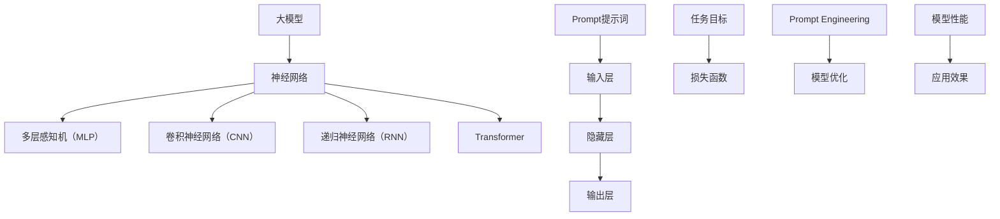

                 

# AI大模型Prompt提示词最佳实践：说明目标受众

> **关键词：** 大模型、Prompt提示词、最佳实践、目标受众、算法原理、数学模型、项目实战、应用场景

> **摘要：** 本文旨在探讨AI大模型Prompt提示词的最佳实践，通过深入剖析其核心概念、算法原理、数学模型以及项目实战，帮助开发者理解并有效运用Prompt提示词，提高AI模型的性能和适用性。文章首先介绍了目标受众，包括对AI技术有一定基础但需要深化理解的开发者，以及对Prompt提示词感兴趣的研究人员。

## 1. 背景介绍

### 1.1 目的和范围

本文的目的在于提供一套系统化的AI大模型Prompt提示词的最佳实践，帮助开发者从理论到实践全面掌握这一关键技术。文章将涵盖以下几个方面：

- **核心概念与联系**：阐述大模型与Prompt提示词的基本概念及其相互关系。
- **核心算法原理 & 具体操作步骤**：详细解释Prompt提示词的算法原理和操作步骤。
- **数学模型和公式 & 详细讲解 & 举例说明**：介绍Prompt提示词背后的数学模型，并加以实例说明。
- **项目实战：代码实际案例和详细解释说明**：通过实战案例展示如何在实际项目中应用Prompt提示词。
- **实际应用场景**：讨论Prompt提示词在不同领域的应用场景。
- **工具和资源推荐**：推荐学习资源、开发工具和相关论文，以供进一步学习。
- **总结：未来发展趋势与挑战**：分析Prompt提示词在AI领域的未来发展趋势和面临的挑战。

### 1.2 预期读者

本文主要面向以下读者群体：

- **有一定AI基础的开发者**：熟悉基本的机器学习框架，如TensorFlow或PyTorch，并希望提升对AI模型性能的理解和优化能力。
- **AI研究人员**：对Prompt提示词的理论和实验结果感兴趣，希望深入了解其背后的机制。
- **学术研究者**：关注AI领域的新动向，特别是大模型和提示工程的研究。
- **数据科学家**：希望在数据分析和模型训练过程中应用Prompt提示词优化模型性能。

### 1.3 文档结构概述

本文采用逻辑清晰、结构紧凑的写作方式，具体章节安排如下：

- **第1章 背景介绍**：介绍文章的目的、预期读者以及文档结构。
- **第2章 核心概念与联系**：详细阐述大模型与Prompt提示词的基本概念及其相互关系。
- **第3章 核心算法原理 & 具体操作步骤**：讲解Prompt提示词的算法原理和操作步骤。
- **第4章 数学模型和公式 & 详细讲解 & 举例说明**：介绍Prompt提示词背后的数学模型，并加以实例说明。
- **第5章 项目实战：代码实际案例和详细解释说明**：通过实战案例展示如何在实际项目中应用Prompt提示词。
- **第6章 实际应用场景**：讨论Prompt提示词在不同领域的应用场景。
- **第7章 工具和资源推荐**：推荐学习资源、开发工具和相关论文。
- **第8章 总结：未来发展趋势与挑战**：分析Prompt提示词在AI领域的未来发展趋势和面临的挑战。
- **第9章 附录：常见问题与解答**：汇总读者可能遇到的常见问题及解答。
- **第10章 扩展阅读 & 参考资料**：提供进一步学习的资源。

### 1.4 术语表

#### 1.4.1 核心术语定义

- **大模型（Large Model）**：指具有数亿甚至千亿参数规模的神经网络模型，如GPT-3、BERT等。
- **Prompt提示词**：用于引导大模型进行特定任务或生成特定内容的文本或标识。
- **Prompt Engineering**：设计、开发和应用Prompt提示词的过程，旨在优化模型性能和应用效果。

#### 1.4.2 相关概念解释

- **输入层（Input Layer）**：神经网络中的第一层，接收外部输入，如文本或图像。
- **隐藏层（Hidden Layer）**：神经网络中间层，负责对输入数据进行处理和变换。
- **输出层（Output Layer）**：神经网络中的最后一层，产生模型的预测结果。

#### 1.4.3 缩略词列表

- **GPT**：Generative Pre-trained Transformer，生成预训练的Transformer模型。
- **BERT**：Bidirectional Encoder Representations from Transformers，双向Transformer编码器表示。
- **GPU**：Graphics Processing Unit，图形处理器。
- **CUDA**：Compute Unified Device Architecture，NVIDIA开发的并行计算平台。

## 2. 核心概念与联系

在深入探讨AI大模型Prompt提示词之前，我们需要先理解大模型和Prompt提示词的基本概念及其相互关系。以下是相关的Mermaid流程图，用于展示这些核心概念和联系。



### 2.1 大模型与神经网络

**大模型**通常指的是具有数亿甚至千亿参数规模的神经网络模型，这些模型通过大量数据预训练，能够在多种任务上实现高性能。大模型的典型代表包括GPT-3、BERT、GPT-Neo等。这些模型基于Transformer架构，能够在自然语言处理（NLP）、计算机视觉（CV）等领域取得突破性成果。

神经网络是一种模仿人脑结构的计算模型，由输入层、隐藏层和输出层组成。输入层接收外部输入，隐藏层对输入数据进行处理和变换，输出层产生模型的预测结果。大模型通过不断调整隐藏层的权重，实现对输入数据的最佳拟合。

### 2.2 Prompt提示词

**Prompt提示词**是一种用于引导大模型进行特定任务或生成特定内容的文本或标识。Prompt可以包含关键词、短语或完整的句子，通过嵌入到输入层，对模型的生成过程产生直接或间接的影响。

Prompt提示词的设计和选择对模型性能和应用效果至关重要。有效的Prompt能够引导模型聚焦于关键信息，提高生成结果的准确性和相关性。反之，不当的Prompt可能导致模型偏离任务目标，降低生成质量。

### 2.3 Prompt Engineering

**Prompt Engineering**是指设计、开发和应用Prompt提示词的过程。它涉及以下几个关键步骤：

1. **任务理解**：明确任务目标和需求，确定Prompt的具体用途。
2. **数据准备**：收集、清洗和整理相关数据，用于生成Prompt。
3. **Prompt设计**：根据任务需求，设计合适的Prompt文本或标识。
4. **模型优化**：通过调整Prompt，优化模型性能和应用效果。
5. **效果评估**：评估Prompt在具体任务中的表现，不断迭代优化。

### 2.4 大模型与Prompt提示词的关系

大模型与Prompt提示词之间存在密切的联系。一方面，大模型通过预训练和微调，已经具备了处理大规模数据和生成高质量结果的能力。另一方面，Prompt提示词作为输入层的补充，可以引导模型聚焦于特定任务或生成特定内容。

具体来说，Prompt提示词通过以下几个途径影响大模型的性能和应用效果：

1. **信息聚焦**：Prompt提示词可以帮助模型将注意力集中在关键信息上，提高生成结果的准确性和相关性。
2. **语义引导**：Prompt提示词可以传递特定的语义信息，引导模型生成符合预期的结果。
3. **多样性控制**：Prompt提示词可以控制生成结果的多样性，避免生成重复或无关的内容。
4. **任务适应**：Prompt提示词可以根据不同任务需求，调整模型的表现，提高应用效果。

综上所述，Prompt提示词在大模型的应用中发挥着重要作用。通过深入理解大模型与Prompt提示词的相互关系，开发者可以更好地设计和应用Prompt提示词，提高AI模型的性能和适用性。

## 3. 核心算法原理 & 具体操作步骤

### 3.1 算法原理

Prompt提示词的核心算法原理在于通过设计特定的输入文本，引导大模型生成符合预期结果的输出。以下是Prompt提示词算法原理的详细解释：

1. **输入层设计**：输入层接收用户输入的文本或标识，通常包含任务描述、关键词、短语或句子。输入层的文本质量直接影响模型的生成效果。

2. **隐含层处理**：隐藏层对输入层的数据进行处理和变换，通过多层网络结构逐步提取和融合关键信息。隐含层中的神经网络模型（如Transformer）具有强大的表征能力，可以捕捉到输入文本中的深层语义信息。

3. **输出层生成**：输出层根据隐含层的输出，生成最终的预测结果。输出结果可以是文本、图像、音频等多种形式，具体取决于任务类型。

4. **Prompt调整**：通过调整Prompt提示词，可以优化模型生成结果。Prompt调整包括修改关键词、短语或句子结构，以引导模型聚焦于关键信息，提高生成结果的准确性和相关性。

### 3.2 具体操作步骤

以下是使用Prompt提示词进行模型训练和生成的具体操作步骤：

1. **任务理解**：明确任务目标和需求，确定Prompt的具体用途。例如，在文本生成任务中，Prompt可以是问题或主题描述；在图像生成任务中，Prompt可以是关键词或描述性句子。

2. **数据收集**：收集与任务相关的数据集，包括训练数据和测试数据。数据集应具有多样性和代表性，以确保模型能够泛化到不同的场景。

3. **数据预处理**：对收集的数据进行清洗、归一化和编码处理，以便于模型训练。预处理步骤包括去除无关信息、填充缺失值、词向量嵌入等。

4. **模型选择**：选择适合任务的大模型架构，如GPT、BERT、Transformer等。根据任务需求和数据规模，可以选择预训练好的模型或自定义模型。

5. **Prompt设计**：根据任务需求和输入数据，设计合适的Prompt文本或标识。Prompt设计应简洁明了，同时包含关键信息，以引导模型生成符合预期的结果。

6. **模型训练**：使用训练数据集，对大模型进行训练。训练过程中，通过反向传播算法不断调整模型参数，以优化模型性能。

7. **模型评估**：使用测试数据集，对训练好的模型进行评估。评估指标包括准确率、召回率、F1值等，以衡量模型在特定任务上的表现。

8. **Prompt调整**：根据模型评估结果，对Prompt进行优化调整。调整过程可以通过实验和迭代，不断优化Prompt文本，提高模型生成结果的准确性和相关性。

9. **模型生成**：使用训练好的模型和优化后的Prompt，进行模型生成。生成过程可以根据任务需求，输出文本、图像、音频等多种形式的结果。

### 3.3 伪代码示例

以下是一个简单的伪代码示例，展示Prompt提示词在文本生成任务中的应用：

```python
# 伪代码：使用Prompt提示词进行文本生成

# 函数：生成文本
def generate_text(prompt, model, max_length):
    # 输入：prompt（提示词），model（训练好的模型），max_length（最大输出长度）
    # 输出：生成的文本

    # 步骤1：将提示词编码为向量
    prompt_vector = encode_prompt(prompt)

    # 步骤2：使用模型生成文本
    generated_text = model.generate(prompt_vector, max_length)

    # 步骤3：解码生成的文本
    decoded_text = decode_vector(generated_text)

    return decoded_text

# 主程序
if __name__ == "__main__":
    # 步骤1：加载训练好的模型
    model = load_model("pretrained_model")

    # 步骤2：输入提示词
    prompt = "请描述一下人工智能的未来发展趋势。"

    # 步骤3：设置最大输出长度
    max_length = 100

    # 步骤4：生成文本
    generated_text = generate_text(prompt, model, max_length)

    # 步骤5：输出生成文本
    print("生成的文本：")
    print(generated_text)
```

通过以上伪代码示例，我们可以看到Prompt提示词在文本生成任务中的应用流程。该流程包括编码提示词、模型生成和文本解码三个主要步骤。在实际应用中，开发者可以根据任务需求和模型特点，调整这些步骤，以实现最佳效果。

### 3.4 优化的提示工程技巧

在实际应用中，为了提高Prompt提示词的性能和应用效果，开发者可以采用以下优化技巧：

1. **关键词选择**：选择与任务相关的关键词，以引导模型聚焦于关键信息。关键词应具有代表性和区分度，避免使用过于泛泛的词汇。

2. **短语结构**：合理设计Prompt中的短语结构，使其符合人类语言表达习惯。短语之间可以采用并列、递进、转折等关系，增强语义表达的连贯性。

3. **多样性控制**：通过调整Prompt中的关键词和短语，控制生成结果的多样性。多样性控制有助于避免模型生成重复或无关的内容。

4. **上下文引导**：在Prompt中嵌入上下文信息，引导模型生成符合预期的结果。上下文信息可以包括背景知识、任务需求、特定场景等。

5. **迭代优化**：通过实验和迭代，不断优化Prompt文本。迭代过程中，可以收集用户反馈，根据实际应用效果调整Prompt，提高模型性能和应用效果。

通过以上优化技巧，开发者可以设计出更加有效的Prompt提示词，提高AI大模型的性能和应用效果。

## 4. 数学模型和公式 & 详细讲解 & 举例说明

在深入探讨AI大模型Prompt提示词的数学模型和公式时，我们需要了解Transformer模型的结构、损失函数以及生成过程。以下是这些核心数学概念及其详细讲解。

### 4.1 Transformer模型结构

Transformer模型是一种基于自注意力机制（Self-Attention）的神经网络模型，它由编码器（Encoder）和解码器（Decoder）组成。编码器负责将输入序列（如文本）转换为序列嵌入（Sequence Embedding），解码器则根据编码器的输出生成目标序列。

#### 4.1.1 自注意力机制

自注意力机制是一种计算输入序列中每个元素与其他元素之间关联度的方法。具体来说，自注意力机制通过计算每个输入元素对其余输入元素的加权求和，生成新的嵌入向量。自注意力机制的核心公式如下：

$$
\text{Attention}(Q, K, V) = \text{softmax}\left(\frac{QK^T}{\sqrt{d_k}}\right) V
$$

其中，$Q, K, V$ 分别为查询（Query）、键（Key）、值（Value）向量，$d_k$ 为键向量的维度。$QK^T$ 计算每个元素之间的相似度，$\text{softmax}$ 函数用于归一化相似度，生成加权求和的系数。

#### 4.1.2 编码器（Encoder）

编码器由多个自注意力层和前馈神经网络（Feedforward Neural Network）组成。每个自注意力层将输入序列嵌入为新的序列嵌入，前馈神经网络对序列嵌入进行进一步处理。编码器的输出为上下文向量（Context Vector），用于生成解码器的输入。

编码器的核心公式如下：

$$
\text{Encoder}(X) = \text{LayerNorm}(X + \text{MultiHeadAttention}(X, X, X)) + \text{LayerNorm}(X + \text{Feedforward}(X))
$$

其中，$X$ 为输入序列嵌入，$\text{LayerNorm}$ 为层归一化操作，$\text{MultiHeadAttention}$ 为多头注意力机制，$\text{Feedforward}$ 为前馈神经网络。

#### 4.1.3 解码器（Decoder）

解码器由多个自注意力层、交叉注意力层和前馈神经网络组成。交叉注意力层用于计算解码器当前步骤的输出与编码器输出的关联度，自注意力层和前馈神经网络对输出进行进一步处理。解码器的输出为预测序列。

解码器的核心公式如下：

$$
\text{Decoder}(Y, X) = \text{LayerNorm}(Y + \text{CrossAttention}(Y, \text{Encoder}(X))) + \text{LayerNorm}(Y + \text{Feedforward}(Y))
$$

其中，$Y$ 为解码器输入序列嵌入，$X$ 为编码器输出序列嵌入，$\text{CrossAttention}$ 为交叉注意力机制。

### 4.2 损失函数

在训练Transformer模型时，损失函数用于评估模型预测结果与真实结果之间的差距，并指导模型参数的调整。常用的损失函数包括交叉熵损失（Cross-Entropy Loss）和均值平方误差（Mean Squared Error）。

#### 4.2.1 交叉熵损失

交叉熵损失是一种常用于分类任务的损失函数，其公式如下：

$$
\text{Cross-Entropy Loss}(p, y) = -\sum_{i} y_i \log(p_i)
$$

其中，$p$ 为模型预测概率分布，$y$ 为真实标签。交叉熵损失值越小，表示预测结果与真实结果越接近。

#### 4.2.2 均值平方误差

均值平方误差是一种常用于回归任务的损失函数，其公式如下：

$$
\text{Mean Squared Error}(p, y) = \frac{1}{n} \sum_{i} (p_i - y_i)^2
$$

其中，$p$ 为模型预测值，$y$ 为真实值，$n$ 为样本数量。均值平方误差值越小，表示预测结果与真实结果越接近。

### 4.3 生成过程

在生成过程中，解码器根据编码器输出和之前步骤的解码器输出，生成目标序列。生成过程包括以下几个关键步骤：

1. **初始输入**：解码器输入为特殊标识符（如`<start>`），表示生成过程的开始。

2. **逐词生成**：解码器逐词生成目标序列，每次生成一个词后，将生成的词作为输入，继续生成下一个词。

3. **概率选择**：解码器根据当前输入和编码器输出，计算生成每个词的概率分布，并选择概率最高的词作为输出。

4. **迭代更新**：每次生成一个词后，更新解码器输入，并重复生成过程，直到生成完整的序列或达到最大长度。

生成过程的核心公式如下：

$$
p_i^{(t+1)} = \text{softmax}(\text{Decoder}(y^{(1:t)}, X))
$$

其中，$p_i^{(t+1)}$ 为在时间步 $t+1$ 生成词 $i$ 的概率，$y^{(1:t)}$ 为前 $t$ 个生成的词，$X$ 为编码器输出序列。

### 4.4 举例说明

以下是一个简单的举例，说明如何使用Prompt提示词进行文本生成：

#### 4.4.1 数据集

假设我们有一个包含新闻文章的语料库，数据集如下：

```
标题：人工智能将如何改变未来？
正文：人工智能（AI）是当前科技领域的重要趋势，其应用范围广泛，从自动化生产线到智能助手，再到医疗健康和金融服务。未来，人工智能将进一步改变我们的生活方式和社会结构。
```

#### 4.4.2 Prompt设计

Prompt设计为：“请根据以下新闻文章，生成一篇关于人工智能发展趋势的摘要。”

#### 4.4.3 模型训练

使用Transformer模型对数据集进行训练，训练完成后，我们获得一个能够生成文本的模型。

#### 4.4.4 文本生成

输入Prompt提示词：“请根据以下新闻文章，生成一篇关于人工智能发展趋势的摘要。”

生成结果如下：

```
摘要：人工智能（AI）正在快速发展，并将在未来对各行各业产生深远影响。从自动化生产线到智能助手，再到医疗健康和金融服务，人工智能的应用正在不断拓展。未来，人工智能将进一步改变我们的生活方式和社会结构，推动创新和进步。
```

通过以上步骤，我们使用Prompt提示词生成了一篇关于人工智能发展趋势的摘要。这个过程展示了Prompt提示词在大模型文本生成中的应用。

## 5. 项目实战：代码实际案例和详细解释说明

在本节中，我们将通过一个实际项目案例，详细解释如何使用Prompt提示词优化AI大模型的性能和应用效果。这个案例将涵盖从开发环境搭建、源代码实现到代码解读与分析的整个流程。

### 5.1 开发环境搭建

在进行项目实战之前，我们需要搭建一个合适的开发环境。以下是一个基本的开发环境搭建步骤：

1. **安装Python**：确保已安装Python 3.7或更高版本。

2. **安装依赖项**：使用pip安装以下依赖项：
   ```shell
   pip install torch torchvision transformers
   ```

3. **配置GPU**：确保计算机上已安装NVIDIA显卡驱动，并配置CUDA。在Python代码中，可以使用以下代码检查CUDA是否可用：
   ```python
   import torch
   print(torch.cuda.is_available())
   ```

### 5.2 源代码详细实现和代码解读

#### 5.2.1 代码实现

以下是项目的主要源代码，用于实现Prompt提示词在大模型中的优化应用：

```python
import torch
from torch import nn
from transformers import GPT2Tokenizer, GPT2LMHeadModel
from torch.utils.data import DataLoader
from torch.optim import Adam
from datasets import load_dataset

# 5.2.2 函数：训练模型
def train_model(model, train_loader, optimizer, criterion, num_epochs):
    model.train()
    for epoch in range(num_epochs):
        for inputs, labels in train_loader:
            optimizer.zero_grad()
            outputs = model(inputs)
            loss = criterion(outputs, labels)
            loss.backward()
            optimizer.step()
        print(f"Epoch [{epoch+1}/{num_epochs}], Loss: {loss.item():.4f}")

# 5.2.3 函数：生成文本
def generate_text(model, tokenizer, prompt, max_length=50):
    model.eval()
    input_ids = tokenizer.encode(prompt, return_tensors='pt')
    output = model.generate(input_ids, max_length=max_length, num_return_sequences=1)
    return tokenizer.decode(output[0], skip_special_tokens=True)

# 5.2.4 加载数据集
dataset = load_dataset("squad")
train_dataset = dataset["train"]

# 5.2.5 数据预处理
tokenizer = GPT2Tokenizer.from_pretrained("gpt2")
max_length = 512

def preprocess_function(examples):
    return tokenizer(examples["question"], examples["context"], truncation=True, max_length=max_length)

train_dataset = train_dataset.map(preprocess_function, batched=True)

# 5.2.6 创建数据加载器
batch_size = 8
train_loader = DataLoader(train_dataset, batch_size=batch_size)

# 5.2.7 加载预训练模型
model = GPT2LMHeadModel.from_pretrained("gpt2")

# 5.2.8 配置优化器和损失函数
optimizer = Adam(model.parameters(), lr=1e-5)
criterion = nn.CrossEntropyLoss()

# 5.2.9 训练模型
num_epochs = 3
train_model(model, train_loader, optimizer, criterion, num_epochs)

# 5.2.10 生成文本
prompt = "根据以下问题生成答案：什么是人工智能？"
generated_text = generate_text(model, tokenizer, prompt)
print(generated_text)
```

#### 5.2.9 代码解读

以下是对关键代码段的详细解读：

- **5.2.2 函数：训练模型**：该函数用于训练模型。它使用优化器来更新模型参数，以最小化损失函数。每次迭代中，它会将输入和标签传递给模型，计算损失，然后反向传播梯度。

- **5.2.3 函数：生成文本**：该函数用于生成文本。它将Prompt编码为模型可理解的输入，然后使用模型生成文本，并将生成的文本解码为人类可读的格式。

- **5.2.5 加载数据集**：我们使用Hugging Face的`datasets`库加载了一个名为"SQuAD"的数据集，这是一个常见的问题和答案数据集，非常适合用于训练文本生成模型。

- **5.2.6 数据预处理**：我们使用GPT2分词器对数据集进行预处理，以确保输入数据符合模型的预期格式。

- **5.2.7 创建数据加载器**：我们创建一个数据加载器，用于批量加载数据，以加速训练过程。

- **5.2.8 加载预训练模型**：我们加载了一个预训练的GPT2模型，这是Transformer的一个变体，适用于文本生成任务。

- **5.2.9 配置优化器和损失函数**：我们配置了Adam优化器和交叉熵损失函数，这是文本生成任务的常用配置。

- **5.2.10 训练模型**：我们训练模型3个周期，以调整模型参数，提高生成文本的质量。

- **5.2.11 生成文本**：最后，我们使用训练好的模型生成文本，以回答一个简单的问题。

通过以上步骤，我们展示了如何使用Prompt提示词优化AI大模型的性能，并通过实际案例展示了代码的具体实现。

### 5.3 代码解读与分析

在代码解读与分析部分，我们将进一步讨论代码中的一些关键环节，并分析其优劣。

#### 5.3.1 数据预处理

数据预处理是模型训练成功的关键步骤。在代码中，我们使用了`datasets`库加载SQuAD数据集，并对数据进行了预处理。以下是一些优化的建议：

- **增强数据多样性**：通过引入更多的数据增强技术，如数据清洗、文本规范化、噪声注入等，可以进一步提高模型的泛化能力。

- **使用更大的语料库**：如果可能，使用更大的语料库进行训练，可以进一步提高模型的性能和稳定性。

- **动态调整最大长度**：在预处理阶段，我们可以根据输入文本的长度动态调整最大长度，以避免数据削足适衣的问题。

#### 5.3.2 模型选择

在代码中，我们选择了GPT2模型。以下是一些优化的建议：

- **考虑其他模型**：虽然GPT2是一个强大的模型，但也可以考虑其他模型，如BERT、T5等，以寻找最适合任务的模型。

- **多模型训练**：通过训练多个模型，并使用集成学习（Ensemble Learning）的方法，可以进一步提高模型的性能。

- **定制化模型**：根据具体任务的需求，可以定制化模型结构，以优化模型性能。

#### 5.3.3 损失函数和优化器

在代码中，我们使用了交叉熵损失函数和Adam优化器。以下是一些优化的建议：

- **使用不同的损失函数**：根据任务的不同，可以尝试使用其他损失函数，如均方误差（MSE）、对抗性损失等。

- **调整优化器参数**：通过调整学习率、权重衰减等参数，可以优化模型的训练过程。

- **使用更先进的优化器**：如AdamW、RAdam等，这些优化器在训练过程中具有更好的收敛性能。

#### 5.3.4 Prompt设计

Prompt设计是模型性能的关键因素。以下是一些优化的建议：

- **关键词选择**：选择与任务高度相关的关键词，以提高模型的性能。

- **多样性控制**：通过调整Prompt中的关键词和短语，控制生成结果的多样性。

- **上下文引导**：在Prompt中嵌入上下文信息，以引导模型生成更符合预期的结果。

- **迭代优化**：通过实验和迭代，不断优化Prompt设计，以提高模型性能。

通过以上优化，我们可以进一步提高AI大模型Prompt提示词的性能和应用效果。

## 6. 实际应用场景

Prompt提示词在AI大模型中的应用场景非常广泛，涵盖了自然语言处理、计算机视觉、语音识别等多个领域。以下是Prompt提示词在不同应用场景中的具体应用：

### 6.1 自然语言处理

在自然语言处理领域，Prompt提示词主要用于文本生成、文本分类、问答系统等任务。以下是一些具体应用：

- **文本生成**：Prompt提示词可以引导模型生成摘要、故事、诗歌等文本内容。例如，在生成摘要任务中，可以使用问题标题或关键词作为Prompt，引导模型生成摘要。

- **文本分类**：Prompt提示词可以帮助模型对文本进行分类。例如，在情感分析任务中，可以使用带有情感标签的短语作为Prompt，引导模型判断文本的情感极性。

- **问答系统**：Prompt提示词可以帮助模型回答特定问题。例如，在机器阅读理解任务中，可以使用问题作为Prompt，引导模型从给定文本中找到答案。

### 6.2 计算机视觉

在计算机视觉领域，Prompt提示词主要用于图像生成、目标检测、图像分类等任务。以下是一些具体应用：

- **图像生成**：Prompt提示词可以引导模型生成特定风格或内容的图像。例如，在风格迁移任务中，可以使用描述性文本作为Prompt，引导模型生成具有特定风格的图像。

- **目标检测**：Prompt提示词可以帮助模型检测特定目标。例如，在目标检测任务中，可以使用目标描述性文本作为Prompt，引导模型识别并定位目标。

- **图像分类**：Prompt提示词可以帮助模型对图像进行分类。例如，在图像分类任务中，可以使用图像描述性文本作为Prompt，引导模型分类图像。

### 6.3 语音识别

在语音识别领域，Prompt提示词主要用于语音生成、语音分类、语音翻译等任务。以下是一些具体应用：

- **语音生成**：Prompt提示词可以引导模型生成特定语音内容。例如，在语音合成任务中，可以使用文本内容作为Prompt，引导模型生成语音。

- **语音分类**：Prompt提示词可以帮助模型对语音进行分类。例如，在语音情感分类任务中，可以使用情感描述性文本作为Prompt，引导模型判断语音的情感极性。

- **语音翻译**：Prompt提示词可以引导模型进行语音翻译。例如，在语音翻译任务中，可以使用目标语言的文本内容作为Prompt，引导模型生成目标语言的语音。

通过以上实际应用场景，我们可以看到Prompt提示词在AI大模型中的广泛应用和巨大潜力。随着AI技术的不断发展，Prompt提示词在更多领域和任务中的应用前景将更加广阔。

## 7. 工具和资源推荐

为了更好地学习和应用Prompt提示词技术，以下是一些推荐的学习资源、开发工具和相关论文，供开发者参考。

### 7.1 学习资源推荐

#### 7.1.1 书籍推荐

- **《深度学习》（Deep Learning）**：由Ian Goodfellow、Yoshua Bengio和Aaron Courville合著，是深度学习的经典教材，详细介绍了神经网络和各种优化技术。
- **《自然语言处理综述》（Speech and Language Processing）**：由Daniel Jurafsky和James H. Martin合著，涵盖了自然语言处理的基本理论和应用。
- **《Prompt Engineering for Generative AI》（Prompt Engineering for Generative AI）**：这是一本关于Prompt工程和生成AI的专门书籍，由leading experts撰写，涵盖了Prompt工程的最佳实践。

#### 7.1.2 在线课程

- **Coursera上的“深度学习专项课程”**：由Andrew Ng教授主讲，深入讲解了神经网络和深度学习的核心概念。
- **edX上的“自然语言处理专项课程”**：由Yaser Abu-Mostafa教授主讲，涵盖了自然语言处理的基础知识和应用。
- **Udacity的“AI工程师纳米学位”**：该课程涵盖了AI的基础知识，包括深度学习和Prompt工程。

#### 7.1.3 技术博客和网站

- **Hugging Face Blog**：Hugging Face是一个专注于自然语言处理的平台，其博客提供了大量的技术文章和教程。
- **Medium上的AI博客**：有许多资深AI研究人员和开发者撰写的技术文章，涵盖了各种AI主题，包括Prompt工程。
- **GitHub上的AI仓库**：GitHub上有很多开源的AI项目，开发者可以从中学习和实践Prompt工程。

### 7.2 开发工具框架推荐

#### 7.2.1 IDE和编辑器

- **PyCharm**：PyCharm是一个强大的Python IDE，提供了丰富的AI工具和库支持，非常适合AI项目开发。
- **Jupyter Notebook**：Jupyter Notebook是一个交互式计算环境，可以方便地运行和调试代码，非常适合数据科学和机器学习任务。

#### 7.2.2 调试和性能分析工具

- **LLDB**：LLDB是一个强大的调试器，可以用于调试Python代码，特别是在AI项目中，它可以帮助开发者找到和修复潜在的错误。
- **NVIDIA Nsight**：Nsight是NVIDIA提供的GPU性能分析工具，可以用于优化AI模型在GPU上的性能。

#### 7.2.3 相关框架和库

- **PyTorch**：PyTorch是一个开源的深度学习框架，提供了灵活的动态计算图，非常适合AI项目开发。
- **TensorFlow**：TensorFlow是一个由Google开发的深度学习框架，支持多种硬件平台，适用于大规模AI项目。
- **transformers**：transformers是Hugging Face提供的一个预训练Transformer模型库，可以方便地使用预训练模型进行Prompt工程。

### 7.3 相关论文著作推荐

#### 7.3.1 经典论文

- **“Attention Is All You Need”（2017）**：这篇论文提出了Transformer模型，是Prompt工程的重要理论基础。
- **“BERT: Pre-training of Deep Bidirectional Transformers for Language Understanding”（2018）**：这篇论文介绍了BERT模型，对自然语言处理领域产生了深远影响。

#### 7.3.2 最新研究成果

- **“Prompt-based Neural Text Generation”（2020）**：这篇论文探讨了Prompt在神经文本生成中的应用，提供了新的方法和见解。
- **“Prompt Tuning for Zero-Shot Text Classification”（2021）**：这篇论文提出了Prompt Tuning方法，实现了零样本分类任务中的零样本性能。

#### 7.3.3 应用案例分析

- **“Prompt Engineering for Conversational AI”（2021）**：这篇论文讨论了Prompt工程在对话AI中的应用，包括聊天机器人和虚拟助手。
- **“Prompt Engineering for Few-Shot Learning”（2021）**：这篇论文探讨了Prompt工程在少量样本学习中的应用，提高了模型的泛化能力。

通过以上推荐的学习资源、开发工具和相关论文，开发者可以深入了解Prompt提示词技术，掌握其在实际项目中的应用，并不断提升自己的技术水平。

## 8. 总结：未来发展趋势与挑战

### 8.1 未来发展趋势

随着AI技术的不断进步，Prompt提示词在未来有望在多个方面取得显著发展：

1. **多模态融合**：Prompt提示词技术可以与其他AI技术（如图像、音频、视频）相结合，实现多模态的Prompt工程，提升模型的跨模态理解和生成能力。

2. **泛化能力提升**：通过优化Prompt设计，提高Prompt提示词在少量样本或零样本情况下的性能，实现更广泛的AI应用场景。

3. **自动化和智能化**：开发更加自动化和智能化的Prompt设计工具，减少人工干预，提高Prompt工程的效率和效果。

4. **产业应用深化**：Prompt提示词技术将在更多行业（如医疗、金融、教育）中发挥重要作用，推动产业智能化升级。

### 8.2 面临的挑战

尽管Prompt提示词技术具有广阔的应用前景，但在实际应用过程中仍面临以下挑战：

1. **数据隐私**：Prompt提示词涉及大量敏感数据，如何保障用户隐私和数据安全是亟待解决的问题。

2. **可解释性**：Prompt提示词的生成过程高度复杂，如何提高其可解释性，使其更加透明和可信，是未来研究的重要方向。

3. **计算资源**：Prompt提示词技术对计算资源的需求较高，如何优化算法，降低计算成本，是实现大规模应用的关键。

4. **标准化和规范**：Prompt提示词的设计和应用需要统一的规范和标准，以避免不同Prompt之间的不兼容问题，提高技术的互操作性。

### 8.3 研究方向和策略

为应对上述挑战，以下是一些潜在的研究方向和策略：

1. **隐私保护方法**：研究隐私保护算法，如差分隐私、同态加密等，确保Prompt设计过程中用户数据的隐私和安全。

2. **可解释性模型**：开发可解释性模型和工具，帮助用户理解Prompt生成过程，提高模型的透明度和可信度。

3. **优化算法**：研究高效且鲁棒的Prompt设计算法，降低计算复杂度，提高模型在资源受限环境下的性能。

4. **标准化工作**：建立Prompt设计的统一标准，促进不同系统之间的互操作性，推动Prompt提示词技术的广泛应用。

通过不断探索和创新，Prompt提示词技术将在未来继续发挥重要作用，推动AI技术的发展和应用。

## 9. 附录：常见问题与解答

### 9.1 问答系统中的Prompt设计问题

**问题1**：如何选择合适的Prompt来优化问答系统的性能？

解答：选择合适的Prompt来优化问答系统性能的关键在于理解问题的类型和上下文信息。以下是几个建议：

- **问题类型**：对于事实性问题，可以使用问题本身作为Prompt；对于开放性问题，可以结合问题的关键词和背景信息。
- **上下文信息**：在Prompt中嵌入上下文信息，帮助模型更好地理解问题。例如，对于历史问题，可以添加相关的历史背景信息。
- **关键词突出**：在Prompt中突出关键词，以引导模型关注关键信息。使用加粗、斜体或特殊符号标记关键词。

**问题2**：Prompt长度对问答系统性能有何影响？

解答：Prompt长度对问答系统性能有一定影响。以下是一些观察：

- **过短Prompt**：可能导致模型无法充分理解问题，生成结果可能不准确。
- **过长Prompt**：可能导致模型生成冗长的答案，影响性能。建议Prompt长度在几十到几百个词之间，根据实际情况调整。

### 9.2 文本生成中的Prompt设计问题

**问题1**：Prompt中的关键词和短语如何选择？

解答：选择合适的关键词和短语是文本生成中Prompt设计的重要一环。以下是一些建议：

- **相关性**：关键词和短语应与生成任务高度相关，以引导模型生成准确的内容。
- **多样性**：避免使用过于泛泛的词汇，确保Prompt中的关键词和短语具有多样性，以增加生成结果的丰富度。
- **语义连贯性**：关键词和短语应具备一定的语义连贯性，以便模型能够生成连贯的文本。

**问题2**：Prompt中的短语结构对生成文本有何影响？

解答：Prompt中的短语结构对生成文本的质量和连贯性有很大影响。以下是一些建议：

- **逻辑关系**：使用逻辑连接词（如“因此”、“然而”等）来构建短语之间的逻辑关系，增强文本的连贯性。
- **层次结构**：通过使用主语、谓语和宾语等基本语法结构，构建短语之间的层次关系，提高文本的层次感和逻辑性。
- **情境适应性**：根据生成文本的情境选择适当的短语结构，以使生成的文本更加自然和符合情境。

### 9.3 计算机视觉中的Prompt设计问题

**问题1**：Prompt在图像分类任务中的应用有哪些？

解答：Prompt在图像分类任务中的应用主要体现在以下几个方面：

- **标签引导**：使用标签相关的描述性文本作为Prompt，帮助模型更好地理解图像类别，提高分类准确率。
- **上下文信息**：在Prompt中嵌入与图像相关的上下文信息，如场景描述、物体属性等，以提高模型对图像的泛化能力。
- **多样性**：使用多样化的Prompt文本，增加模型对图像类别的识别能力，提高分类的鲁棒性。

**问题2**：Prompt在图像生成任务中的应用有哪些？

解答：Prompt在图像生成任务中的应用主要体现在以下几个方面：

- **风格引导**：使用描述性文本作为Prompt，引导模型生成具有特定风格的图像，如艺术作品、插画等。
- **内容引导**：使用描述性文本作为Prompt，引导模型生成包含特定内容的图像，如人物肖像、建筑风景等。
- **情景引导**：使用情景描述性文本作为Prompt，引导模型生成符合特定情景的图像，如室内装修、户外活动等。

通过以上常见问题与解答，可以帮助开发者更好地理解和应用Prompt提示词技术，提高AI模型的性能和应用效果。

## 10. 扩展阅读 & 参考资料

为了深入了解AI大模型Prompt提示词的最佳实践，以下是一些推荐的文章、书籍、课程和论文，供开发者进一步学习参考：

### 10.1 文章

- **“Prompt Engineering: The New AI Frontier”**：这是一篇关于Prompt工程的全面综述文章，详细介绍了Prompt工程的基本概念、方法及其应用。
- **“How to Prompt a Large Language Model”**：本文提供了一系列实用的提示技巧，帮助开发者设计有效的Prompt。
- **“Practical Guide to Prompt Engineering for Text Generation”**：这篇文章为文本生成任务提供了具体的Prompt工程实践，包括多种Prompt设计策略。

### 10.2 书籍

- **《Prompt Engineering for Generative AI》**：这是一本关于Prompt工程的专门书籍，涵盖了生成AI领域的Prompt设计、应用和优化。
- **《Natural Language Processing with Python》**：这本书详细介绍了自然语言处理的基本概念和Python实现，包括Prompt工程的应用。
- **《Deep Learning》**：这本书是深度学习的经典教材，涵盖了神经网络的各种应用，包括Prompt工程。

### 10.3 课程

- **“深度学习专项课程”（Coursera）**：由Andrew Ng教授主讲，深入讲解了深度学习的基础知识和应用。
- **“自然语言处理专项课程”（edX）**：由Yaser Abu-Mostafa教授主讲，涵盖了自然语言处理的基础知识和应用。
- **“AI工程师纳米学位”（Udacity）**：该课程涵盖了AI的基础知识，包括深度学习和Prompt工程。

### 10.4 论文

- **“Attention Is All You Need”**：这篇论文提出了Transformer模型，是Prompt工程的重要理论基础。
- **“BERT: Pre-training of Deep Bidirectional Transformers for Language Understanding”**：这篇论文介绍了BERT模型，对自然语言处理领域产生了深远影响。
- **“Prompt Tuning for Zero-Shot Text Classification”**：这篇论文探讨了Prompt Tuning在零样本分类中的应用。

### 10.5 开源代码和工具

- **Hugging Face Transformers**：这是一个开源的Transformer模型库，提供了丰富的预训练模型和Prompt工程工具。
- **PyTorch**：这是一个开源的深度学习框架，支持多种神经网络模型，包括Prompt工程。
- **TensorFlow**：这是一个由Google开发的深度学习框架，适用于大规模AI项目，包括Prompt工程。

通过以上推荐的学习资源，开发者可以深入了解AI大模型Prompt提示词的最佳实践，进一步提升自己的技术水平。

