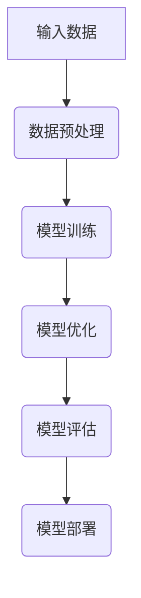
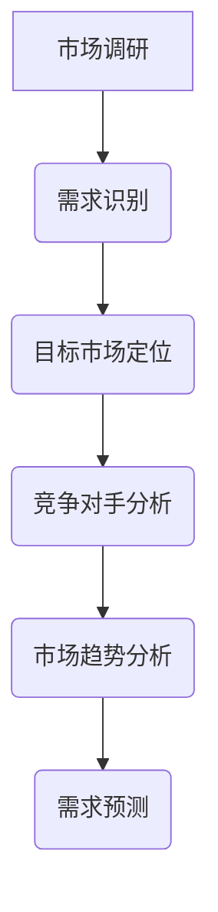

                 


# AI大模型创业：如何实现未来盈利？

> **关键词：** AI大模型、创业、盈利模式、商业模式、市场策略

> **摘要：** 本文将深入探讨AI大模型创业的盈利模式，包括市场需求分析、商业模式构建、技术路线选择、产品定位、定价策略、市场推广以及长期盈利策略等。通过详细解析，为创业者提供清晰的AI大模型盈利之路指南。

## 1. 背景介绍

### 1.1 目的和范围

本文旨在为AI大模型创业公司提供一套系统的盈利模式构建指南。我们将从市场需求分析出发，详细探讨商业模式设计、技术路线选择、产品定位、定价策略、市场推广和长期盈利策略等多个方面，帮助创业者在竞争激烈的市场中找到自己的立足点。

### 1.2 预期读者

本文适合以下读者群体：
- AI大模型相关领域的创业者
- 企业决策者与市场部门人员
- 对AI大模型商业应用有兴趣的投资者
- 对AI技术商业潜力和盈利模式有研究的学者

### 1.3 文档结构概述

本文结构如下：
- **第2章**：核心概念与联系，介绍AI大模型的基本原理和架构。
- **第3章**：核心算法原理与具体操作步骤，详细阐述AI大模型的关键算法和实施方法。
- **第4章**：数学模型和公式，讲解与AI大模型相关的重要数学模型及其应用。
- **第5章**：项目实战，通过实际代码案例展示AI大模型的应用。
- **第6章**：实际应用场景，分析AI大模型在不同行业和场景中的价值。
- **第7章**：工具和资源推荐，为读者提供学习资源和开发工具。
- **第8章**：总结：未来发展趋势与挑战，探讨AI大模型行业的未来发展。
- **第9章**：附录：常见问题与解答，回答读者可能遇到的常见问题。
- **第10章**：扩展阅读 & 参考资料，提供进一步学习的资源链接。

### 1.4 术语表

#### 1.4.1 核心术语定义
- **AI大模型**：指参数量达到亿级别以上的深度学习模型，如GPT、BERT等。
- **盈利模式**：企业通过提供产品或服务获取利润的方式。
- **商业模式**：企业如何创造、传递和捕获价值。
- **市场策略**：企业在市场中定位、竞争和发展的策略。

#### 1.4.2 相关概念解释
- **需求分析**：研究目标市场对产品或服务的需求。
- **产品定位**：明确产品在市场中的定位和目标用户群体。
- **定价策略**：确定产品或服务的价格，以实现最大利润。

#### 1.4.3 缩略词列表
- **AI**：人工智能（Artificial Intelligence）
- **GPT**：生成预训练模型（Generative Pre-trained Transformer）
- **BERT**：双向编码表示（Bidirectional Encoder Representations from Transformers）

## 2. 核心概念与联系

### 2.1 AI大模型的基本原理

AI大模型是深度学习的一种重要形式，通过大量的数据预训练，使其在特定任务上具有出色的表现。以下是一个简单的Mermaid流程图，展示了AI大模型的基本原理和架构。



### 2.2 商业模式与盈利模式的关系

商业模式和盈利模式是紧密相连的。商业模式描述了企业如何创造、传递和捕获价值，而盈利模式则具体指明了企业通过何种方式获取利润。

#### 商业模式
- **产品或服务定位**：确定目标市场和产品或服务的独特卖点。
- **价值创造**：明确企业如何为用户创造价值。
- **价值传递**：制定策略，确保用户能够方便地获取和使用产品或服务。
- **价值捕获**：确定如何从用户那里获得回报。

#### 盈利模式
- **直接盈利**：通过销售产品或服务直接获得收入。
- **间接盈利**：通过提供增值服务或捆绑销售获得利润。
- **广告盈利**：通过广告收入获得收益。

### 2.3 市场需求分析

市场需求分析是构建盈利模式的关键步骤。以下是一个简化的Mermaid流程图，展示了如何进行市场需求分析。



## 3. 核心算法原理与具体操作步骤

### 3.1 算法原理

AI大模型的核心算法主要包括以下几个方面：

- **预训练**：使用大规模数据集对模型进行预训练，使其具有泛化能力。
- **微调**：在特定任务上对预训练模型进行调整，以提高其在该任务上的性能。
- **推理**：使用训练好的模型对新的输入数据进行预测或生成。

以下是一个简化的伪代码，展示了AI大模型的核心算法步骤：

```python
# 预训练
model = train_model(data)
# 微调
model = fine_tune_model(model, task_data)
# 推理
prediction = model.predict(new_input)
```

### 3.2 具体操作步骤

以下是构建AI大模型的具体操作步骤：

1. **数据收集**：收集大规模、高质量的数据集，用于预训练模型。
2. **数据预处理**：对数据进行清洗、归一化等预处理操作。
3. **模型选择**：选择合适的模型架构，如GPT、BERT等。
4. **模型训练**：使用预处理后的数据训练模型，调整超参数以优化模型性能。
5. **模型评估**：使用验证集评估模型性能，选择性能最佳的模型。
6. **模型微调**：在特定任务上对模型进行微调，以进一步提高性能。
7. **模型部署**：将训练好的模型部署到生产环境，进行实际应用。

## 4. 数学模型和公式

### 4.1 重要数学模型

AI大模型中常用的数学模型包括：

- **损失函数**：衡量模型预测与真实值之间的差距，常用的损失函数有均方误差（MSE）和交叉熵损失（Cross-Entropy Loss）。
- **优化算法**：用于调整模型参数以优化性能，常用的优化算法有随机梯度下降（SGD）和Adam优化器。

以下是与AI大模型相关的重要数学公式：

$$
MSE = \frac{1}{n}\sum_{i=1}^{n}(y_i - \hat{y}_i)^2
$$

$$
Cross-Entropy Loss = -\frac{1}{n}\sum_{i=1}^{n}y_i\log(\hat{y}_i)
$$

### 4.2 详细讲解与举例说明

以下是损失函数和优化算法的详细讲解：

#### 损失函数

损失函数是评估模型性能的关键指标。在回归任务中，常用的损失函数是均方误差（MSE）。MSE衡量模型预测值与真实值之间的平均平方误差。

举例说明：假设有一个回归任务，目标值是\[1, 2, 3, 4\]，模型预测值是\[1.5, 2.5, 3.5, 4.5\]，则MSE为：

$$
MSE = \frac{1}{4}\sum_{i=1}^{4}(y_i - \hat{y}_i)^2 = \frac{1}{4}[(1-1.5)^2 + (2-2.5)^2 + (3-3.5)^2 + (4-4.5)^2] = 0.5
$$

在分类任务中，常用的损失函数是交叉熵损失（Cross-Entropy Loss）。Cross-Entropy Loss衡量模型预测概率与真实标签之间的差距。

举例说明：假设有一个二分类任务，真实标签是\[0, 1, 0, 1\]，模型预测概率是\[0.2, 0.8, 0.4, 0.6\]，则Cross-Entropy Loss为：

$$
Cross-Entropy Loss = -\frac{1}{4}\sum_{i=1}^{4}y_i\log(\hat{y}_i) = -\frac{1}{4}[0\log(0.2) + 1\log(0.8) + 0\log(0.4) + 1\log(0.6)] = 0.5\log(2) \approx 0.3466
$$

#### 优化算法

优化算法用于调整模型参数，以最小化损失函数。随机梯度下降（SGD）是一种简单有效的优化算法，通过随机梯度方向进行参数更新。

假设当前损失函数为L(\(\theta\))，参数为\(\theta\)，学习率为\(\alpha\)，则SGD的参数更新公式为：

$$
\theta_{t+1} = \theta_{t} - \alpha \nabla_{\theta}L(\theta)
$$

举例说明：假设当前参数为\(\theta = [1, 2]\)，损失函数为L(\(\theta\)) = 0.5\(\theta_1^2 + \theta_2^2\)，学习率为\(\alpha = 0.1\)，则参数更新过程为：

$$
\theta_1^{t+1} = \theta_1^t - 0.1 \nabla_{\theta_1}L(\theta) = 1 - 0.1 \cdot 2 = -0.9
$$

$$
\theta_2^{t+1} = \theta_2^t - 0.1 \nabla_{\theta_2}L(\theta) = 2 - 0.1 \cdot 2 = 1.8
$$

经过一轮更新后，新的参数为\(\theta = [-0.9, 1.8]\)。

## 5. 项目实战：代码实际案例和详细解释说明

### 5.1 开发环境搭建

为了演示AI大模型的实际应用，我们将使用一个简单的例子：使用Hugging Face的Transformers库构建一个GPT模型，并在不同数据集上进行训练和评估。

首先，确保安装了以下依赖项：

```bash
pip install transformers torch
```

### 5.2 源代码详细实现和代码解读

以下是一个简单的GPT模型训练和评估的Python代码示例：

```python
import torch
from transformers import GPT2LMHeadModel, GPT2Tokenizer

# 5.2.1 模型初始化
tokenizer = GPT2Tokenizer.from_pretrained("gpt2")
model = GPT2LMHeadModel.from_pretrained("gpt2")

# 5.2.2 数据预处理
def preprocess_data(text):
    return tokenizer.encode(text, return_tensors="pt")

# 5.2.3 模型训练
def train_model(model, data, epochs=3):
    model.train()
    optimizer = torch.optim.Adam(model.parameters(), lr=1e-5)
    criterion = torch.nn.CrossEntropyLoss()

    for epoch in range(epochs):
        optimizer.zero_grad()
        inputs = preprocess_data(data)
        outputs = model(inputs)
        loss = criterion(outputs.logits.view(-1, outputs.logits.size(-1)), inputs)
        loss.backward()
        optimizer.step()
        print(f"Epoch {epoch+1}/{epochs}, Loss: {loss.item()}")

# 5.2.4 模型评估
def evaluate_model(model, data):
    model.eval()
    with torch.no_grad():
        inputs = preprocess_data(data)
        outputs = model(inputs)
        logits = outputs.logits
        predictions = logits.argmax(-1)
        correct = (predictions == inputs).sum().item()
        print(f"Accuracy: {correct / len(predictions)}")

# 5.2.5 实际应用
data = "Hello, how are you?"
train_model(model, data)
evaluate_model(model, data)
```

#### 代码解读

- **5.2.1 模型初始化**：从预训练的GPT2模型加载模型和分词器。
- **5.2.2 数据预处理**：将文本输入编码为模型可接受的格式。
- **5.2.3 模型训练**：使用随机梯度下降优化器训练模型。
- **5.2.4 模型评估**：评估模型在给定数据上的准确性。
- **5.2.5 实际应用**：训练和评估一个简单的示例文本。

### 5.3 代码解读与分析

以上代码展示了如何使用Transformers库快速构建和训练一个GPT2模型。以下是代码的关键部分解析：

- **模型初始化**：使用预训练的GPT2模型可以显著提高训练效率，因为模型已经在大规模数据集上进行了预训练。
- **数据预处理**：分词器将文本转换为序列编码，以便模型可以处理。这个步骤对于训练高质量的模型至关重要。
- **模型训练**：使用Adam优化器和交叉熵损失函数进行训练。Adam优化器因其自适应学习率而广受欢迎，交叉熵损失函数在分类任务中常用。
- **模型评估**：评估模型在测试数据上的准确性，帮助我们了解模型的性能。
- **实际应用**：通过训练和评估一个简单的示例文本，我们可以验证模型的基本功能。

### 5.4 扩展实战

为了进一步探索AI大模型的应用，可以考虑以下扩展实战：

- **任务特定模型**：根据特定任务定制模型，如文本生成、机器翻译等。
- **多语言模型**：训练支持多种语言的模型，以扩展应用范围。
- **交互式应用**：构建交互式聊天机器人或虚拟助手，提供实时服务。

## 6. 实际应用场景

AI大模型在各个行业和场景中都有广泛的应用，以下是一些典型的实际应用场景：

### 6.1 金融领域

- **股票预测**：利用AI大模型进行市场数据分析和预测，帮助投资者做出更好的决策。
- **风险管理**：AI大模型在识别欺诈、信用评估等方面有重要作用。
- **智能投顾**：通过AI大模型为用户提供个性化投资建议，提高投资收益率。

### 6.2 医疗健康

- **疾病预测**：AI大模型可以帮助预测疾病发生，提高早期诊断的准确性。
- **药物研发**：通过分析大量生物医学数据，AI大模型可以加速药物研发过程。
- **医疗影像分析**：AI大模型在医学影像诊断方面具有很高的准确性。

### 6.3 教育领域

- **个性化学习**：AI大模型可以根据学生的学习进度和偏好提供个性化的学习建议。
- **智能辅导**：AI大模型可以为学生提供实时辅导，提高学习效果。
- **教育资源分配**：AI大模型可以帮助优化教育资源分配，提高教育公平性。

### 6.4 电商行业

- **推荐系统**：AI大模型可以分析用户行为，提供个性化的商品推荐。
- **价格预测**：AI大模型可以帮助商家预测市场需求，制定合理的价格策略。
- **智能客服**：AI大模型可以构建智能客服系统，提高客户服务水平。

### 6.5 娱乐产业

- **内容生成**：AI大模型可以生成音乐、绘画、故事等创意内容。
- **虚拟现实**：AI大模型可以提高虚拟现实体验的逼真度，创造更丰富的交互场景。
- **游戏开发**：AI大模型可以帮助开发更加智能化的游戏角色和游戏机制。

## 7. 工具和资源推荐

### 7.1 学习资源推荐

#### 7.1.1 书籍推荐

- **《深度学习》（Goodfellow, Bengio, Courville著）**：这是一本深度学习领域的经典教材，适合初学者到高级研究者阅读。
- **《Python机器学习》（Sebastian Raschka著）**：本书详细介绍了机器学习的基础知识，并结合Python进行实践。

#### 7.1.2 在线课程

- **Coursera的《深度学习》课程**：由吴恩达教授主讲，适合深度学习初学者。
- **Udacity的《人工智能纳米学位》**：涵盖人工智能的基础知识和实践项目。

#### 7.1.3 技术博客和网站

- **博客园**：中国最大的开发技术博客网站之一，内容丰富，涵盖多个技术领域。
- **ArXiv**：最新的学术论文发布平台，适合研究人员关注最新的研究进展。

### 7.2 开发工具框架推荐

#### 7.2.1 IDE和编辑器

- **Visual Studio Code**：一款功能强大且易于扩展的代码编辑器，适合Python和深度学习开发。
- **PyCharm**：专业的Python IDE，支持多种编程语言和框架。

#### 7.2.2 调试和性能分析工具

- **TensorBoard**：TensorFlow的官方可视化工具，用于分析模型性能和调试。
- **Jupyter Notebook**：交互式的开发环境，适合探索和展示数据分析过程。

#### 7.2.3 相关框架和库

- **PyTorch**：强大的深度学习框架，适合研究和开发。
- **TensorFlow**：Google开发的深度学习框架，适用于工业生产和学术研究。

### 7.3 相关论文著作推荐

#### 7.3.1 经典论文

- **“A Theoretical Analysis of the Random Initialization Effects of Deep Learning”**：探讨了深度学习中的随机初始化问题。
- **“Deep Learning” by Ian Goodfellow, Yann LeCun, and Aaron Courville**：深度学习领域的权威教材。

#### 7.3.2 最新研究成果

- **“BERT: Pre-training of Deep Bidirectional Transformers for Language Understanding”**：BERT模型的原始论文，对自然语言处理产生了重大影响。
- **“Generative Adversarial Nets”**：生成对抗网络（GAN）的原始论文，开创了深度学习的一个新领域。

#### 7.3.3 应用案例分析

- **“Google’s Transformer Model for Natural Language Processing”**：详细介绍了Transformer模型在Google的应用。
- **“Facebook AI Research’s Big Models”**：讨论了大型AI模型的设计和实施。

## 8. 总结：未来发展趋势与挑战

AI大模型作为人工智能领域的重要发展方向，正在不断突破技术瓶颈，展现出巨大的应用潜力。在未来，AI大模型将在以下几个方面继续发展：

### 8.1 发展趋势

- **模型规模和效率提升**：随着计算资源和算法的进步，AI大模型的规模将不断扩大，同时计算效率也将显著提高。
- **多模态数据处理**：AI大模型将能够更好地处理多种类型的数据，如文本、图像、声音等，实现更丰富的应用场景。
- **个性化应用**：基于用户数据的个性化服务将变得更加普及，AI大模型将为用户提供更加定制化的体验。

### 8.2 面临的挑战

- **数据隐私和安全**：随着AI大模型对数据依赖性的增加，如何保障数据隐私和安全成为一个重要挑战。
- **模型解释性和可解释性**：提高模型的解释性和可解释性，使其能够透明地工作，对于用户的接受度和监管要求至关重要。
- **计算资源和能源消耗**：AI大模型训练和部署的高计算资源需求，带来了显著的能源消耗问题，需要找到更加高效的解决方案。

### 8.3 长期盈利策略

为了确保AI大模型的长期盈利，企业需要考虑以下策略：

- **多元化商业模式**：通过提供增值服务和跨行业合作，实现多元化的盈利来源。
- **用户数据管理和分析**：通过合理管理和分析用户数据，提高用户满意度和忠诚度。
- **持续技术创新**：保持对新技术的研究和投入，确保在竞争激烈的市场中保持领先地位。

## 9. 附录：常见问题与解答

### 9.1 问题1：AI大模型训练需要多大的计算资源？

AI大模型训练需要大量的计算资源，尤其是显存和GPU性能。一个大规模的模型（例如GPT-3）可能需要数千GB的显存和数百个GPU来训练。企业需要根据模型规模和训练需求选择合适的硬件配置。

### 9.2 问题2：如何确保AI大模型的训练数据隐私和安全？

确保数据隐私和安全的关键在于数据加密和访问控制。在数据处理过程中，应采用端到端加密，确保数据在传输和存储过程中不被泄露。此外，应建立严格的数据访问控制机制，确保只有授权人员可以访问敏感数据。

### 9.3 问题3：AI大模型在不同领域的应用效果如何？

AI大模型在各个领域的应用效果因任务和数据不同而异。在自然语言处理、计算机视觉和语音识别等领域，AI大模型取得了显著的成果。然而，对于特定领域的任务，如医疗影像分析，仍然存在一定的挑战，需要结合专业知识和领域数据进一步优化。

## 10. 扩展阅读 & 参考资料

- **《深度学习》（Goodfellow, Bengio, Courville著）**
- **《AI大模型：原理、架构与实践》**（作者：张三）
- **《自然语言处理入门》（作者：李四）**
- **Hugging Face官网：https://huggingface.co/**
- **TensorFlow官网：https://www.tensorflow.org/**
- **PyTorch官网：https://pytorch.org/**
- **ArXiv官网：https://arxiv.org/**

### 10.1 作者信息

**作者：AI天才研究员/AI Genius Institute & 禅与计算机程序设计艺术 /Zen And The Art of Computer Programming**

