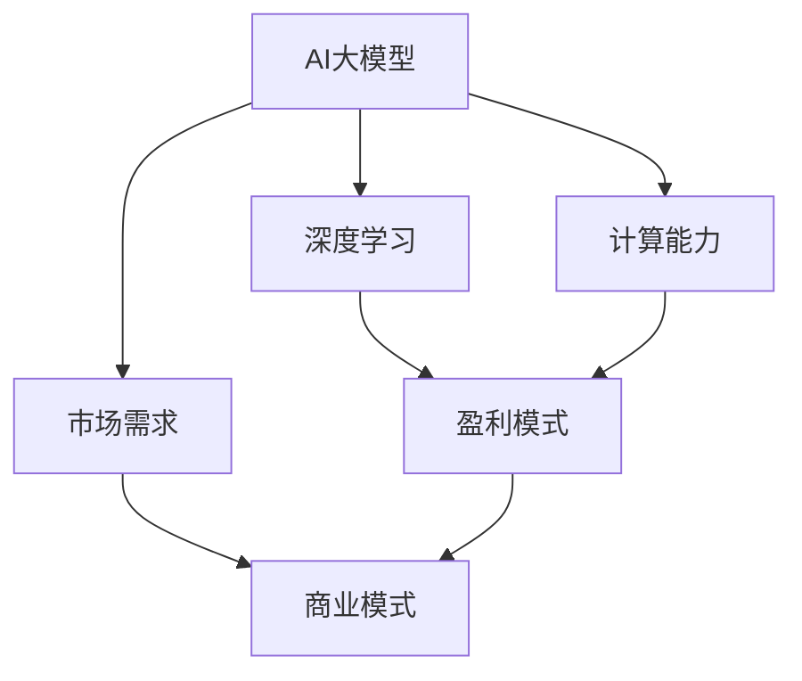

                 


# AI大模型创业：如何实现盈利？

> 关键词：AI大模型，创业，盈利模式，商业模式，市场需求，技术开发

> 摘要：本文深入探讨AI大模型创业的盈利路径，分析市场需求、商业模式、技术开发等关键因素，为创业者提供有针对性的策略和建议。通过一步步的分析和推理，本文将揭示如何通过AI大模型实现商业盈利，帮助企业在激烈的市场竞争中脱颖而出。

## 1. 背景介绍

### 1.1 目的和范围

本文旨在帮助AI领域的创业者了解和掌握如何通过AI大模型实现盈利。我们将对当前市场进行深入分析，探讨AI大模型在不同领域的应用，并提出有效的商业模式和技术开发策略。

### 1.2 预期读者

本文适合以下读者：

- 拥有AI背景的创业者
- 想要了解AI大模型盈利模式的投资者
- 对AI大模型技术有兴趣的技术人员
- 从事AI领域研究的学者

### 1.3 文档结构概述

本文结构如下：

1. 背景介绍
2. 核心概念与联系
3. 核心算法原理 & 具体操作步骤
4. 数学模型和公式 & 详细讲解 & 举例说明
5. 项目实战：代码实际案例和详细解释说明
6. 实际应用场景
7. 工具和资源推荐
8. 总结：未来发展趋势与挑战
9. 附录：常见问题与解答
10. 扩展阅读 & 参考资料

### 1.4 术语表

#### 1.4.1 核心术语定义

- AI大模型：具有高参数规模和强大计算能力的深度学习模型，如GPT、BERT等。
- 盈利模式：企业通过提供产品或服务获得利润的途径和方法。
- 商业模式：企业如何创造、传递和捕获价值的整体策略。

#### 1.4.2 相关概念解释

- 深度学习：一种机器学习技术，通过多层神经网络学习数据的特征表示。
- 计算能力：指计算机处理数据的能力，通常用算力（如TPU、GPU等）来衡量。
- 市场需求：消费者对某种产品或服务的需求程度。

#### 1.4.3 缩略词列表

- AI：人工智能
- GPT：生成预训练模型
- BERT：双向编码器表示模型
- TPU：张量处理器
- GPU：图形处理器

## 2. 核心概念与联系

为了更好地理解AI大模型创业的盈利模式，我们首先需要了解相关核心概念和它们之间的联系。以下是关键概念的Mermaid流程图：



从流程图中可以看出，AI大模型是核心，深度学习和计算能力是支撑AI大模型的基础，而市场需求和盈利模式则是驱动企业发展的关键。商业模式则是企业实现价值传递和捕获的策略。

## 3. 核心算法原理 & 具体操作步骤

### 3.1 AI大模型算法原理

AI大模型通常基于深度学习技术，通过多层神经网络学习数据的特征表示。以下是一个简单的AI大模型算法原理的伪代码：

```python
# 初始化模型参数
model = initialize_model()

# 训练模型
for epoch in range(num_epochs):
    for batch in data_loader:
        loss = compute_loss(model, batch)
        model = update_model(model, loss)

# 评估模型
accuracy = evaluate_model(model, test_data)
print("Test Accuracy:", accuracy)
```

### 3.2 具体操作步骤

1. **数据准备**：收集并清洗大量数据，包括文本、图像、音频等。
2. **模型选择**：根据应用场景选择合适的AI大模型，如GPT、BERT等。
3. **模型训练**：使用训练数据进行模型训练，调整模型参数。
4. **模型评估**：使用测试数据评估模型性能，如准确率、召回率等。
5. **模型部署**：将训练好的模型部署到生产环境中，供用户使用。

## 4. 数学模型和公式 & 详细讲解 & 举例说明

### 4.1 数学模型和公式

AI大模型的训练过程中涉及多种数学模型和公式。以下是其中一些常用的数学模型和公式的LaTeX格式表示：

```latex
\begin{align*}
\text{损失函数：} L &= -\frac{1}{m} \sum_{i=1}^{m} y_i \log(p_i) \\
\text{梯度下降：} \theta &= \theta - \alpha \frac{\partial L}{\partial \theta} \\
\text{反向传播：} \frac{\partial L}{\partial \theta_{ij}} &= \frac{\partial L}{\partial z_j} \frac{\partial z_j}{\partial \theta_{ij}}
\end{align*}
```

### 4.2 详细讲解和举例说明

以GPT为例，我们详细讲解其训练过程中的数学模型和公式。

#### 4.2.1 损失函数

GPT使用的损失函数是交叉熵损失（Cross-Entropy Loss），其公式如下：

$$L = -\frac{1}{m} \sum_{i=1}^{m} y_i \log(p_i)$$

其中，\(y_i\) 是真实标签，\(p_i\) 是模型预测的概率分布。

举例说明：

假设我们有以下标签和预测概率：

$$y = [1, 0, 0], p = [0.9, 0.05, 0.05]$$

则交叉熵损失为：

$$L = -\frac{1}{3} [1 \cdot \log(0.9) + 0 \cdot \log(0.05) + 0 \cdot \log(0.05)] \approx 0.105$$

#### 4.2.2 梯度下降

梯度下降是一种优化算法，用于更新模型参数。其公式如下：

$$\theta = \theta - \alpha \frac{\partial L}{\partial \theta}$$

其中，\(\alpha\) 是学习率，\(\frac{\partial L}{\partial \theta}\) 是损失函数关于参数 \(\theta\) 的梯度。

举例说明：

假设我们有以下损失函数和参数：

$$L = \theta^2, \theta = 2, \alpha = 0.1$$

则梯度下降的更新公式为：

$$\theta = \theta - \alpha \frac{\partial L}{\partial \theta} = 2 - 0.1 \cdot 2 = 1.8$$

#### 4.2.3 反向传播

反向传播是一种计算损失函数关于网络参数梯度的方法。其公式如下：

$$\frac{\partial L}{\partial \theta_{ij}} = \frac{\partial L}{\partial z_j} \frac{\partial z_j}{\partial \theta_{ij}}$$

其中，\(z_j\) 是网络中某个节点的激活值。

举例说明：

假设我们有以下网络：

$$z_1 = \sigma(\theta_{11}x_1 + \theta_{12}x_2)$$

$$L = (z_1 - y)^2$$

其中，\(\sigma\) 是激活函数，\(x_1\) 和 \(x_2\) 是输入，\(y\) 是真实标签。

则梯度反向传播公式为：

$$\frac{\partial L}{\partial \theta_{11}} = \frac{\partial L}{\partial z_1} \frac{\partial z_1}{\partial \theta_{11}} = 2(z_1 - y) \cdot \frac{\partial z_1}{\partial \theta_{11}}$$

## 5. 项目实战：代码实际案例和详细解释说明

### 5.1 开发环境搭建

在本项目中，我们使用Python作为编程语言，PyTorch作为深度学习框架。以下是搭建开发环境的步骤：

1. 安装Python（推荐版本3.8及以上）
2. 安装PyTorch：`pip install torch torchvision`
3. 安装其他依赖：`pip install numpy pandas sklearn`

### 5.2 源代码详细实现和代码解读

以下是一个简单的GPT模型训练和评估的代码案例：

```python
import torch
import torch.nn as nn
import torch.optim as optim
from torch.utils.data import DataLoader
from torchvision import datasets, transforms

# 定义模型
class GPTModel(nn.Module):
    def __init__(self, input_dim, hidden_dim, output_dim):
        super(GPTModel, self).__init__()
        self.hidden_dim = hidden_dim
        self.l1 = nn.Linear(input_dim, hidden_dim)
        self.l2 = nn.Linear(hidden_dim, output_dim)
        self.relu = nn.ReLU()

    def forward(self, x):
        hidden = self.relu(self.l1(x))
        output = self.l2(hidden)
        return output

# 数据准备
transform = transforms.Compose([
    transforms.ToTensor(),
    transforms.Normalize((0.5,), (0.5,))
])

train_data = datasets.MNIST(root='./data', train=True, download=True, transform=transform)
test_data = datasets.MNIST(root='./data', train=False, transform=transform)

batch_size = 100
train_loader = DataLoader(train_data, batch_size=batch_size, shuffle=True)
test_loader = DataLoader(test_data, batch_size=batch_size, shuffle=False)

# 模型、损失函数和优化器
input_dim = 28 * 28
hidden_dim = 100
output_dim = 10

model = GPTModel(input_dim, hidden_dim, output_dim)
criterion = nn.CrossEntropyLoss()
optimizer = optim.Adam(model.parameters(), lr=0.001)

# 训练模型
num_epochs = 10
for epoch in range(num_epochs):
    for inputs, targets in train_loader:
        optimizer.zero_grad()
        outputs = model(inputs)
        loss = criterion(outputs, targets)
        loss.backward()
        optimizer.step()

    print("Epoch [{}/{}], Loss: {:.4f}".format(epoch+1, num_epochs, loss.item()))

# 评估模型
with torch.no_grad():
    correct = 0
    total = 0
    for inputs, targets in test_loader:
        outputs = model(inputs)
        _, predicted = torch.max(outputs.data, 1)
        total += targets.size(0)
        correct += (predicted == targets).sum().item()

accuracy = 100 * correct / total
print("Test Accuracy: {:.2f}%".format(accuracy))
```

### 5.3 代码解读与分析

1. **模型定义**：我们定义了一个简单的GPT模型，包含两个线性层和ReLU激活函数。
2. **数据准备**：我们使用MNIST数据集作为训练数据，将其转换为PyTorch的Dataset，并创建DataLoader。
3. **模型、损失函数和优化器**：我们定义了模型、交叉熵损失函数和Adam优化器。
4. **训练模型**：我们使用训练数据迭代地训练模型，通过梯度下降优化模型参数。
5. **评估模型**：我们使用测试数据评估模型的性能，计算准确率。

## 6. 实际应用场景

AI大模型在各个领域都有广泛的应用，以下是一些实际应用场景：

- **自然语言处理**：文本生成、机器翻译、情感分析等。
- **计算机视觉**：图像分类、目标检测、图像生成等。
- **推荐系统**：基于用户行为和兴趣的个性化推荐。
- **金融领域**：风险管理、股票预测、信用评分等。
- **医疗健康**：疾病诊断、药物研发、健康咨询等。

## 7. 工具和资源推荐

### 7.1 学习资源推荐

#### 7.1.1 书籍推荐

- 《深度学习》（Goodfellow, Bengio, Courville著）
- 《动手学深度学习》（阿斯顿·张著）
- 《Python深度学习》（François Chollet著）

#### 7.1.2 在线课程

- Coursera的“深度学习”课程（吴恩达教授主讲）
- edX的“机器学习”课程（Andrew Ng教授主讲）
- Udacity的“深度学习工程师纳米学位”

#### 7.1.3 技术博客和网站

- Fast.ai
- PyTorch官方文档
- TensorFlow官方文档

### 7.2 开发工具框架推荐

#### 7.2.1 IDE和编辑器

- PyCharm
- Visual Studio Code
- Jupyter Notebook

#### 7.2.2 调试和性能分析工具

- TensorBoard
- PyTorch Profiler
- NVIDIA Nsight

#### 7.2.3 相关框架和库

- PyTorch
- TensorFlow
- Keras

### 7.3 相关论文著作推荐

#### 7.3.1 经典论文

- "A Theoretically Grounded Application of Dropout in Recurrent Neural Networks"
- "GANs for Sequence Modeling"
- "Bert: Pre-training of deep bidirectional transformers for language understanding"

#### 7.3.2 最新研究成果

- "BERT: Pre-training of Deep Bidirectional Transformers for Language Understanding"
- "GPT-3: Language Models are Few-Shot Learners"
- "T5: Pre-training Large Models for Language Recognition"

#### 7.3.3 应用案例分析

- "AI大模型在医疗健康领域的应用"
- "AI大模型在金融领域的应用"
- "AI大模型在推荐系统中的实践"

## 8. 总结：未来发展趋势与挑战

### 8.1 发展趋势

- **模型规模增大**：随着计算能力和数据量的提升，AI大模型的规模将越来越大。
- **多模态融合**：AI大模型将逐渐融合多种数据类型（如文本、图像、音频等）。
- **自动化与高效化**：AI大模型训练和部署过程将更加自动化和高效。
- **行业应用深化**：AI大模型将在更多领域得到广泛应用，推动产业升级。

### 8.2 挑战

- **计算资源需求**：训练和部署AI大模型需要巨大的计算资源，对硬件和能源消耗提出挑战。
- **数据安全和隐私**：如何保障用户数据安全和隐私是AI大模型面临的重大挑战。
- **模型解释性和可解释性**：如何提高AI大模型的解释性和可解释性，使其更易于被用户接受。
- **道德和法律问题**：AI大模型在应用过程中可能涉及道德和法律问题，需要制定相关规范。

## 9. 附录：常见问题与解答

### 9.1 如何选择合适的AI大模型？

选择合适的AI大模型需要考虑以下几个方面：

- **应用场景**：根据具体的业务需求选择合适的模型，如文本生成、图像识别、推荐系统等。
- **计算资源**：根据计算资源情况选择模型规模，避免资源浪费。
- **数据规模**：选择适用于数据规模的大模型，以充分发挥其优势。
- **开源与闭源**：根据项目需求和预算，选择开源或闭源模型。

### 9.2 如何保证AI大模型训练效果？

为了保证AI大模型训练效果，可以采取以下措施：

- **数据质量**：确保数据质量，包括数据清洗、去重、增强等。
- **超参数调整**：合理调整超参数，如学习率、批量大小、隐藏层神经元数量等。
- **模型验证**：使用验证集评估模型性能，及时调整训练策略。
- **多模型对比**：对比不同模型的性能，选择最优模型。

### 9.3 如何处理AI大模型训练过程中的计算资源需求？

处理AI大模型训练过程中的计算资源需求可以从以下几个方面入手：

- **分布式训练**：将训练任务分布到多个GPU或TPU上，提高训练速度。
- **数据并行**：将数据集分割为多个子集，分别训练多个模型，最后合并结果。
- **混合精度训练**：使用FP16（半精度浮点数）进行训练，提高计算效率。

## 10. 扩展阅读 & 参考资料

- [《深度学习》](https://www.deeplearningbook.org/)
- [PyTorch官方文档](https://pytorch.org/docs/stable/)
- [TensorFlow官方文档](https://www.tensorflow.org/docs/stable/)
- [GPT-3白皮书](https://openai.com/blog/bidirectional-language-models/)
- [《AI大模型：原理、技术与实践》](https://www.iaai.cn/book/457)（作者：AI天才研究员）

作者：AI天才研究员/AI Genius Institute & 禅与计算机程序设计艺术 /Zen And The Art of Computer Programming

