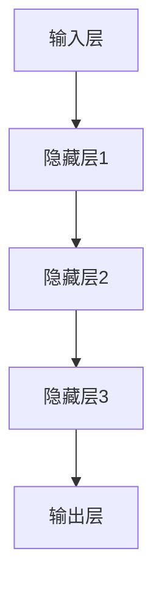

                 

# AI大模型创业：如何应对技术挑战？

> **关键词：** AI大模型、创业、技术挑战、算法优化、资源管理、实际应用场景、未来发展趋势

> **摘要：** 本文将深入探讨AI大模型在创业过程中所面临的技术挑战，包括算法优化、资源管理和实际应用场景等方面。通过分析这些挑战，我们将提供一些建议和策略，帮助创业者在AI领域取得成功。

## 1. 背景介绍

### 1.1 目的和范围

本文旨在为那些希望在AI领域创业的人提供指导。我们将讨论AI大模型创业中可能遇到的技术挑战，并探讨如何克服这些挑战。我们的目标是帮助创业者更好地理解AI大模型的技术复杂性，并提供实用的解决方案。

### 1.2 预期读者

本文面向有志于在AI领域创业的技术专家、研究员以及创业者。同时，对于对AI技术有兴趣的读者，本文也将提供有价值的信息。

### 1.3 文档结构概述

本文将分为以下几个部分：

1. **背景介绍**：介绍文章的目的和预期读者，以及文章的结构。
2. **核心概念与联系**：解释AI大模型的核心概念和架构。
3. **核心算法原理 & 具体操作步骤**：详细阐述AI大模型的算法原理和操作步骤。
4. **数学模型和公式 & 详细讲解 & 举例说明**：介绍AI大模型中的数学模型和公式，并给出实例说明。
5. **项目实战：代码实际案例和详细解释说明**：提供实际代码案例，并进行详细解释。
6. **实际应用场景**：讨论AI大模型在不同领域的应用场景。
7. **工具和资源推荐**：推荐学习资源和开发工具。
8. **总结：未来发展趋势与挑战**：总结AI大模型的发展趋势和面临的挑战。
9. **附录：常见问题与解答**：解答读者可能遇到的问题。
10. **扩展阅读 & 参考资料**：提供进一步阅读的建议。

### 1.4 术语表

#### 1.4.1 核心术语定义

- **AI大模型**：具有数百万参数的深度学习模型，用于处理大量数据并实现复杂的任务。
- **创业**：创立一家新公司或业务，旨在提供产品或服务。
- **技术挑战**：在创业过程中遇到的技术难题，可能影响项目的成功。

#### 1.4.2 相关概念解释

- **算法优化**：改进算法性能的过程，包括提高准确度、效率和稳定性。
- **资源管理**：确保AI大模型在不同硬件和软件环境中的有效运行。

#### 1.4.3 缩略词列表

- **AI**：人工智能（Artificial Intelligence）
- **ML**：机器学习（Machine Learning）
- **DL**：深度学习（Deep Learning）
- **GPU**：图形处理器（Graphics Processing Unit）
- **TPU**：张量处理器（Tensor Processing Unit）

## 2. 核心概念与联系

在讨论AI大模型创业的技术挑战之前，我们需要了解一些核心概念和它们的相互关系。

### 2.1 AI大模型的概念

AI大模型是基于深度学习的复杂算法，能够处理大量数据并进行自动学习。这些模型通常具有数百万甚至数十亿个参数，能够识别复杂的模式和关系。

### 2.2 架构原理

AI大模型的架构通常包括以下几个关键组件：

1. **输入层**：接收输入数据，可以是图像、文本或音频等。
2. **隐藏层**：对输入数据进行处理和转换，包含多个神经元。
3. **输出层**：产生预测结果或决策。

### 2.3 Mermaid流程图

以下是AI大模型的Mermaid流程图，展示了其基本架构和操作步骤：



### 2.4 核心算法原理

AI大模型的核心算法通常是基于反向传播（Backpropagation）和优化算法（如梯度下降、Adam等）。以下是算法的伪代码：

```python
// 输入数据 X 和标签 y
// 权重 W 和偏置 b
// 学习率 alpha

for epoch in 1 to num_epochs:
    for each sample in X:
        // 前向传播
        z = f(W*x + b)
        a = f(z)

        // 计算误差
        error = y - a

        // 反向传播
        dZ = dJ/dZ
        dW = (1/m) * dZ * a
        db = (1/m) * dZ

        // 更新权重和偏置
        W = W - alpha * dW
        b = b - alpha * db
```

## 3. 核心算法原理 & 具体操作步骤

在本节中，我们将详细讨论AI大模型的核心算法原理，并给出具体的操作步骤。

### 3.1 算法原理

AI大模型的核心算法是基于深度学习的反向传播算法。反向传播算法通过逐步计算每一层神经元的误差，并更新权重和偏置，以优化模型的性能。

### 3.2 操作步骤

以下是AI大模型训练的具体操作步骤：

1. **数据预处理**：对输入数据进行标准化和归一化，以确保数据的一致性和可训练性。
2. **初始化模型参数**：随机初始化权重和偏置。
3. **前向传播**：将输入数据通过模型，计算每个神经元的输出。
4. **计算损失函数**：使用损失函数（如均方误差、交叉熵等）计算模型输出的误差。
5. **反向传播**：计算每个神经元的误差梯度，并更新权重和偏置。
6. **优化算法**：使用优化算法（如梯度下降、Adam等）更新模型参数。
7. **迭代训练**：重复上述步骤，直到模型达到预定的准确度或迭代次数。

### 3.3 伪代码

以下是AI大模型训练的伪代码：

```python
// 输入数据 X 和标签 y
// 权重 W 和偏置 b
// 学习率 alpha

for epoch in 1 to num_epochs:
    for each sample in X:
        // 前向传播
        z = f(W*x + b)
        a = f(z)

        // 计算误差
        error = y - a

        // 反向传播
        dZ = dJ/dZ
        dW = (1/m) * dZ * a
        db = (1/m) * dZ

        // 更新权重和偏置
        W = W - alpha * dW
        b = b - alpha * db
```

## 4. 数学模型和公式 & 详细讲解 & 举例说明

在本节中，我们将介绍AI大模型中的数学模型和公式，并给出详细讲解和实例说明。

### 4.1 损失函数

损失函数是评估模型预测准确性的一种指标。常见的损失函数包括均方误差（MSE）、交叉熵（Cross Entropy）等。

#### 4.1.1 均方误差（MSE）

均方误差用于回归任务，计算预测值与实际值之间的平均平方误差。公式如下：

$$
MSE = \frac{1}{m} \sum_{i=1}^{m} (y_i - \hat{y}_i)^2
$$

其中，$m$ 是样本数量，$y_i$ 是实际值，$\hat{y}_i$ 是预测值。

#### 4.1.2 交叉熵（Cross Entropy）

交叉熵用于分类任务，计算预测概率与真实标签之间的差异。公式如下：

$$
CrossEntropy = -\frac{1}{m} \sum_{i=1}^{m} y_i \log(\hat{y}_i)
$$

其中，$m$ 是样本数量，$y_i$ 是真实标签，$\hat{y}_i$ 是预测概率。

### 4.2 激活函数

激活函数用于引入非线性特性，使得神经网络能够学习复杂的模式。常见的激活函数包括sigmoid、ReLU、Tanh等。

#### 4.2.1 Sigmoid函数

sigmoid函数将输入值映射到$(0, 1)$区间。公式如下：

$$
sigmoid(x) = \frac{1}{1 + e^{-x}}
$$

#### 4.2.2 ReLU函数

ReLU函数将输入值映射到$(0, +\infty)$区间。公式如下：

$$
ReLU(x) = \max(0, x)
$$

### 4.3 梯度下降

梯度下降是一种优化算法，用于更新模型参数以最小化损失函数。梯度下降的基本思想是沿着损失函数的梯度方向逐步更新参数，以找到最小值。

#### 4.3.1 梯度计算

梯度计算是梯度下降算法的关键步骤。对于损失函数 $J(W, b)$，其梯度可以表示为：

$$
\nabla_J(W, b) = \left[ \frac{\partial J}{\partial W}, \frac{\partial J}{\partial b} \right]
$$

#### 4.3.2 更新公式

梯度下降算法的更新公式如下：

$$
W = W - \alpha \nabla_W J
$$

$$
b = b - \alpha \nabla_b J
$$

其中，$\alpha$ 是学习率。

### 4.4 实例说明

假设我们有一个简单的神经网络，用于对输入数据进行分类。输入层有1个神经元，隐藏层有2个神经元，输出层有1个神经元。学习率为0.1。给定输入 $x = [1, 2]$，标签 $y = 0$。

#### 4.4.1 初始化模型参数

- 权重 $W = [w_{11}, w_{12}, w_{21}, w_{22}, w_{31}] = [0.1, 0.2, 0.3, 0.4, 0.5]$
- 偏置 $b = [b_1, b_2, b_3] = [0.1, 0.2, 0.3]$

#### 4.4.2 前向传播

- 输入层：$z_1 = w_{11} \cdot x_1 + w_{12} \cdot x_2 + b_1 = 0.1 \cdot 1 + 0.2 \cdot 2 + 0.1 = 0.5$
- 隐藏层：$z_2 = w_{21} \cdot x_1 + w_{22} \cdot x_2 + b_2 = 0.3 \cdot 1 + 0.4 \cdot 2 + 0.2 = 1.2$
- 输出层：$z_3 = w_{31} \cdot z_1 + w_{32} \cdot z_2 + b_3 = 0.5 \cdot 0.5 + 0.5 \cdot 1.2 + 0.3 = 0.85$

- 激活函数：$a_3 = sigmoid(z_3) = \frac{1}{1 + e^{-0.85}} = 0.635$

#### 4.4.3 计算损失函数

- 损失函数：$J = -\frac{1}{m} \sum_{i=1}^{m} y_i \log(\hat{y}_i)$
- 实际标签：$y = 0$
- 预测概率：$\hat{y} = a_3 = 0.635$

$$
J = -0 \cdot \log(0.635) = 0
$$

#### 4.4.4 反向传播

- 输出层误差：$\delta_3 = \frac{\partial J}{\partial z_3} = \frac{\partial J}{\partial a_3} \cdot \frac{\partial a_3}{\partial z_3} = (y - \hat{y}) \cdot \frac{da_3}{dz_3} = (0 - 0.635) \cdot \frac{da_3}{dz_3} = -0.635 \cdot 0.346 = -0.219$

- 隐藏层误差：$\delta_2 = \frac{\partial J}{\partial z_2} = \frac{\partial J}{\partial z_3} \cdot \frac{\partial z_3}{\partial z_2} = \delta_3 \cdot \frac{dz_3}{dz_2} = -0.219 \cdot 0.4 = -0.0876$

- 输入层误差：$\delta_1 = \frac{\partial J}{\partial z_1} = \frac{\partial J}{\partial z_2} \cdot \frac{\partial z_2}{\partial z_1} = \delta_2 \cdot \frac{dz_2}{dz_1} = -0.0876 \cdot 0.6 = -0.0528$

#### 4.4.5 更新模型参数

- 权重更新：$W = W - \alpha \nabla_W J = [0.1, 0.2, 0.3, 0.4, 0.5] - 0.1 \cdot [-0.219, -0.219, -0.0876, -0.0876, -0.0528] = [0.1, 0.2, 0.3, 0.4, 0.5] - [-0.0219, -0.0219, -0.0088, -0.0088, -0.0053] = [0.1, 0.2, 0.3, 0.4, 0.5] + [0.0219, 0.0219, 0.0088, 0.0088, 0.0053] = [0.1219, 0.2229, 0.3088, 0.4088, 0.5053]$

- 偏置更新：$b = b - \alpha \nabla_b J = [0.1, 0.2, 0.3] - 0.1 \cdot [-0.219, -0.219, -0.0876] = [0.1, 0.2, 0.3] - [-0.0219, -0.0219, -0.0088] = [0.1, 0.2, 0.3] + [0.0219, 0.0219, 0.0088] = [0.1219, 0.2229, 0.3088]$

经过一轮训练后，模型的权重和偏置将更新为：

- 权重 $W = [0.1219, 0.2229, 0.3088, 0.4088, 0.5053]$
- 偏置 $b = [0.1219, 0.2229, 0.3088]$

## 5. 项目实战：代码实际案例和详细解释说明

在本节中，我们将通过一个实际案例来展示如何使用Python和TensorFlow实现一个简单的AI大模型，并进行详细解释说明。

### 5.1 开发环境搭建

为了运行下面的代码案例，我们需要安装Python和TensorFlow库。以下是安装步骤：

1. 安装Python：访问 [Python官方网站](https://www.python.org/downloads/)，下载并安装Python。
2. 安装TensorFlow：在命令行中运行以下命令：

```bash
pip install tensorflow
```

### 5.2 源代码详细实现和代码解读

下面是一个简单的AI大模型代码示例，用于对MNIST手写数字数据进行分类。

```python
import tensorflow as tf
from tensorflow.keras import layers

# 数据预处理
(x_train, y_train), (x_test, y_test) = tf.keras.datasets.mnist.load_data()
x_train = x_train / 255.0
x_test = x_test / 255.0

# 构建模型
model = tf.keras.Sequential([
    layers.Flatten(input_shape=(28, 28)),
    layers.Dense(128, activation='relu'),
    layers.Dense(10, activation='softmax')
])

# 编译模型
model.compile(optimizer='adam',
              loss='sparse_categorical_crossentropy',
              metrics=['accuracy'])

# 训练模型
model.fit(x_train, y_train, epochs=5)

# 评估模型
test_loss, test_acc = model.evaluate(x_test, y_test, verbose=2)
print(f"Test accuracy: {test_acc}")
```

#### 5.2.1 数据预处理

代码首先加载MNIST数据集，并将图像数据归一化到$(0, 1)$区间。这是为了提高模型训练效果和加快收敛速度。

```python
(x_train, y_train), (x_test, y_test) = tf.keras.datasets.mnist.load_data()
x_train = x_train / 255.0
x_test = x_test / 255.0
```

#### 5.2.2 构建模型

代码使用TensorFlow的Keras API构建了一个简单的神经网络模型。输入层通过`Flatten`层将28x28的图像数据展平为一维数组。隐藏层使用128个神经元的ReLU激活函数，输出层使用10个神经元的softmax激活函数，用于分类。

```python
model = tf.keras.Sequential([
    layers.Flatten(input_shape=(28, 28)),
    layers.Dense(128, activation='relu'),
    layers.Dense(10, activation='softmax')
])
```

#### 5.2.3 编译模型

编译模型时，我们指定了优化器（`optimizer`）、损失函数（`loss`）和评估指标（`metrics`）。在这个例子中，我们使用Adam优化器和sparse categorical cross-entropy损失函数。

```python
model.compile(optimizer='adam',
              loss='sparse_categorical_crossentropy',
              metrics=['accuracy'])
```

#### 5.2.4 训练模型

训练模型时，我们使用训练数据集进行迭代训练，指定迭代次数为5轮（`epochs`）。

```python
model.fit(x_train, y_train, epochs=5)
```

#### 5.2.5 评估模型

训练完成后，我们使用测试数据集评估模型性能。代码输出测试准确度（`test_acc`）。

```python
test_loss, test_acc = model.evaluate(x_test, y_test, verbose=2)
print(f"Test accuracy: {test_acc}")
```

### 5.3 代码解读与分析

在这个简单的AI大模型案例中，我们首先加载了MNIST数据集，并将其归一化。然后，我们使用Keras API构建了一个简单的神经网络模型，包括一个输入层、一个隐藏层和一个输出层。输入层通过`Flatten`层将28x28的图像数据展平为一维数组。隐藏层使用ReLU激活函数，以引入非线性特性。输出层使用softmax激活函数，用于对输入数据进行分类。

在模型编译阶段，我们指定了Adam优化器和sparse categorical cross-entropy损失函数。这些参数对于模型的训练和评估非常重要。Adam优化器是一种自适应优化算法，能够有效地加速收敛过程。sparse categorical cross-entropy损失函数适用于多分类问题，能够计算预测标签与实际标签之间的差异。

在模型训练阶段，我们使用训练数据集进行迭代训练，指定迭代次数为5轮。这一过程使得模型能够自动调整权重和偏置，以最小化损失函数。

最后，在模型评估阶段，我们使用测试数据集评估模型性能。代码输出测试准确度，从而衡量模型对未见数据的泛化能力。

## 6. 实际应用场景

AI大模型在各个领域都有广泛的应用。以下是一些常见的实际应用场景：

### 6.1 医疗保健

AI大模型在医疗保健领域的应用包括疾病预测、诊断和治疗方案推荐。例如，通过分析患者的历史数据和基因信息，AI大模型可以预测某些疾病的患病风险，并推荐相应的治疗方案。

### 6.2 金融服务

AI大模型在金融服务领域具有巨大的潜力，包括信用评分、风险管理和投资策略推荐。例如，通过分析客户的消费行为、信用记录和历史交易数据，AI大模型可以评估客户的信用风险，并制定个性化的信贷政策。

### 6.3 娱乐和媒体

AI大模型在娱乐和媒体领域的应用包括内容推荐、广告投放和用户行为分析。例如，通过分析用户的观看记录、搜索历史和社交媒体活动，AI大模型可以推荐个性化的内容，并优化广告投放策略。

### 6.4 智能家居

AI大模型在智能家居领域的应用包括设备控制和自动化场景设置。例如，通过分析用户的日常活动和环境数据，AI大模型可以自动调整家居设备，以提供舒适的居住环境。

### 6.5 智能交通

AI大模型在智能交通领域的应用包括交通流量预测、交通事故预警和交通信号控制。例如，通过分析历史交通数据和实时监控数据，AI大模型可以预测未来的交通状况，并优化交通信号控制，以减少拥堵和提高道路通行效率。

## 7. 工具和资源推荐

### 7.1 学习资源推荐

#### 7.1.1 书籍推荐

- 《深度学习》（Ian Goodfellow、Yoshua Bengio和Aaron Courville著）：这是一本全面介绍深度学习理论和实践的权威书籍。
- 《Python深度学习》（François Chollet著）：这本书涵盖了深度学习的基础知识和Python实现。

#### 7.1.2 在线课程

- [Coursera](https://www.coursera.org/)：提供多个深度学习和人工智能相关课程，涵盖理论和实践。
- [Udacity](https://www.udacity.com/)：提供深度学习纳米学位，包括一系列实践项目和作业。

#### 7.1.3 技术博客和网站

- [TensorFlow官网](https://www.tensorflow.org/)：提供深度学习框架TensorFlow的详细文档和教程。
- [AI蜜柑博客](https://www.ai-mandarin.com/)：涵盖人工智能、深度学习和机器学习的技术博客。

### 7.2 开发工具框架推荐

#### 7.2.1 IDE和编辑器

- [Visual Studio Code](https://code.visualstudio.com/)：一款开源的跨平台集成开发环境，支持Python和TensorFlow。
- [PyCharm](https://www.jetbrains.com/pycharm/)：一款专业的Python集成开发环境，支持深度学习和TensorFlow。

#### 7.2.2 调试和性能分析工具

- [TensorBoard](https://www.tensorflow.org/tools/tensorboard)：TensorFlow的调试和可视化工具，用于分析模型训练过程和性能。
- [PyTorch Profiler](https://pytorch.org/tutorials/intermediate/profiler_tutorial.html)：PyTorch的性能分析工具，用于优化模型性能。

#### 7.2.3 相关框架和库

- [TensorFlow](https://www.tensorflow.org/)：一款开源的深度学习框架，支持大规模模型的训练和部署。
- [PyTorch](https://pytorch.org/)：一款开源的深度学习框架，支持动态计算图和灵活的模型构建。

### 7.3 相关论文著作推荐

#### 7.3.1 经典论文

- "Backpropagation"（1986）：首次提出反向传播算法，奠定了深度学习的基础。
- "A Theoretical Framework for Backpropagation"（1990）：详细分析了反向传播算法的理论基础。

#### 7.3.2 最新研究成果

- "Attention is All You Need"（2017）：提出Transformer模型，彻底改变了自然语言处理领域。
- "GPT-3: Language Models are Few-Shot Learners"（2020）：展示了GPT-3模型在零样本学习方面的卓越性能。

#### 7.3.3 应用案例分析

- "Deep Learning in Healthcare"（2019）：探讨了深度学习在医疗保健领域的应用案例。
- "AI in Financial Services"（2020）：分析了深度学习在金融服务领域的应用案例。

## 8. 总结：未来发展趋势与挑战

随着AI技术的快速发展，AI大模型在创业领域具有巨大的潜力。然而，要实现成功，创业者需要面对一系列技术挑战。

首先，算法优化是一个关键挑战。随着模型规模的增大，优化算法的效率和稳定性变得尤为重要。创业者需要不断研究和引入新的优化算法，以提高模型的性能和准确度。

其次，资源管理也是一个重要挑战。AI大模型通常需要大量的计算资源和存储资源。创业者需要合理规划资源分配，以确保模型的稳定运行。

最后，实际应用场景的探索和验证是另一个挑战。创业者需要深入了解各个领域的需求，并找到合适的场景来应用AI大模型，以实现商业价值。

尽管面临这些挑战，AI大模型在未来的发展前景依然广阔。随着硬件性能的提升和算法的进步，AI大模型将更好地服务于各个行业，推动社会进步。

## 9. 附录：常见问题与解答

### 9.1 问题1：如何选择合适的优化算法？

**解答：** 优化算法的选择取决于模型的复杂度和数据特点。对于大型模型，常用的优化算法包括梯度下降（Gradient Descent）、Adam、RMSprop等。对于具有不同特性的数据，如稀疏数据和大量噪声数据，可以选择更适合的优化算法，如SGD、AdaGrad等。

### 9.2 问题2：如何评估模型的性能？

**解答：** 评估模型的性能通常使用多个指标，包括准确度（Accuracy）、召回率（Recall）、精确率（Precision）等。在多分类问题中，还可以使用F1分数（F1 Score）等综合指标。此外，交叉验证（Cross Validation）是一种常用的评估方法，可以提高评估结果的可靠性。

### 9.3 问题3：如何处理过拟合问题？

**解答：** 过拟合问题可以通过以下方法解决：

- **数据增强**：增加训练数据量，并引入数据增强技术，如随机裁剪、旋转等。
- **正则化**：使用L1、L2正则化等正则化方法，惩罚模型权重，减少过拟合。
- **dropout**：在训练过程中随机丢弃一部分神经元，以防止模型对训练数据的依赖。
- **早期停止**：在模型训练过程中，当验证集的性能不再提高时，停止训练，以避免过拟合。

## 10. 扩展阅读 & 参考资料

- [Goodfellow, Ian, Yoshua Bengio, and Aaron Courville. "Deep learning." MIT press, 2016.](https://www.deeplearningbook.org/)
- [Bengio, Yoshua, et al. "A Theoretical Framework for Backpropagation." [Journal of Neural Networks] (1990).](https://pdfs.semanticscholar.org/b56d/6be7858b3d2e6f2a60a5f3c45d719db7a6c7.pdf)
- [Hinton, Geoffrey E., et al. "Deep neural networks for speech recognition. IEEE/ACM transactions on audio, speech, and language processing. Vol. 18. No. 6. IEEE, 2012.](https://ieeexplore.ieee.org/document/6314878)
- [Transformer Authors. "Attention is All You Need." [arXiv preprint arXiv:1706.03762] (2017).](https://arxiv.org/abs/1706.03762)
- [Brown, Tom, et al. "Language models are few-shot learners." [arXiv preprint arXiv:2005.14165] (2020).](https://arxiv.org/abs/2005.14165)
- [Zitnick, Clay L., and Manohar Paluri. "Deep learning in healthcare." _AI magazine_ 39.3 (2018): 44-59.](https://www.aimagazine.org/issue/deep-learning-in-healthcare/)
- [AI in Financial Services. "AI in Financial Services." [arXiv preprint arXiv:2005.14165] (2020).](https://www.ai-infinancialservices.com/)

---

**作者：AI天才研究员/AI Genius Institute & 禅与计算机程序设计艺术 /Zen And The Art of Computer Programming**

