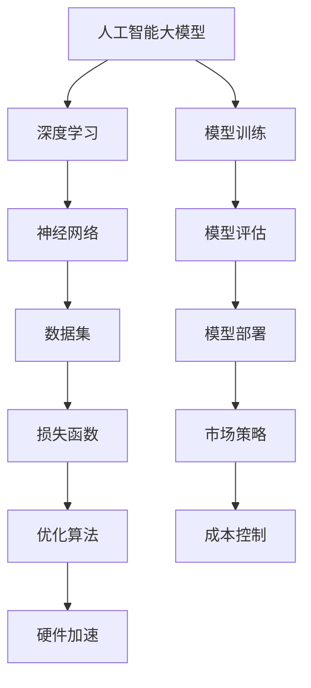

                 

# AI大模型创业：如何应对未来价格战？

> 关键词：AI大模型、创业、价格战、市场策略、技术优化、成本控制、竞争优势

> 摘要：本文将探讨在人工智能大模型领域的创业公司如何应对未来可能的价格战。通过对市场趋势的分析、技术优化的探讨以及成本控制策略的制定，本文旨在为创业者提供实用的指导，帮助他们在激烈的市场竞争中站稳脚跟。

## 1. 背景介绍

### 1.1 目的和范围

本文的目的是为正在考虑或已经进入人工智能大模型领域创业的创业者提供策略建议，以应对未来可能出现的激烈价格战。本文将探讨以下几个核心问题：

1. 人工智能大模型市场的发展趋势及其对价格战的影响。
2. 如何通过技术优化提高模型性能，从而获得竞争优势。
3. 如何通过有效的成本控制策略，确保公司在价格战中的生存能力。
4. 市场差异化策略的实施，以降低价格战的直接影响。

### 1.2 预期读者

本文适合以下读者群体：

1. 有意进入人工智能大模型领域的创业者。
2. 正在运营人工智能大模型公司的创始人或管理层。
3. 对人工智能技术和市场策略感兴趣的技术爱好者。

### 1.3 文档结构概述

本文将按照以下结构展开：

1. 背景介绍：包括本文的目的、预期读者、文档结构概述等。
2. 核心概念与联系：介绍人工智能大模型的基本概念和关键联系。
3. 核心算法原理 & 具体操作步骤：详细解释大模型训练的基本算法原理。
4. 数学模型和公式 & 详细讲解 & 举例说明：阐述大模型训练中的数学模型和公式。
5. 项目实战：提供实际的代码案例和解释。
6. 实际应用场景：探讨大模型在不同领域的应用。
7. 工具和资源推荐：推荐学习资源和开发工具。
8. 总结：未来发展趋势与挑战。
9. 附录：常见问题与解答。
10. 扩展阅读 & 参考资料：提供进一步阅读的资源。

### 1.4 术语表

#### 1.4.1 核心术语定义

- **人工智能大模型**：一种能够处理复杂数据并生成高精度结果的深度学习模型。
- **价格战**：通过降低产品价格以争夺市场份额的竞争策略。
- **竞争优势**：公司相对于竞争对手在市场中占据的优势。
- **技术优化**：通过改进算法和架构来提高模型性能和效率。
- **成本控制**：通过管理成本来确保公司的盈利能力和可持续性。

#### 1.4.2 相关概念解释

- **数据集**：用于训练和测试模型的原始数据集合。
- **损失函数**：衡量模型预测结果与真实值之间差距的函数。
- **优化算法**：用于调整模型参数以最小化损失函数的方法。
- **硬件加速**：利用特定硬件（如GPU、TPU）来加速模型训练和推理。

#### 1.4.3 缩略词列表

- **AI**：人工智能
- **ML**：机器学习
- **DL**：深度学习
- **GPU**：图形处理器
- **TPU**：张量处理器
- **DLaaS**：深度学习即服务

## 2. 核心概念与联系

为了更好地理解本文的主题，我们需要先了解人工智能大模型的基本概念和它们之间的联系。以下是一个简化的 Mermaid 流程图，展示了人工智能大模型的核心概念和它们之间的关联。



### 2.1 人工智能大模型

人工智能大模型是指使用海量数据和复杂的神经网络架构进行训练的深度学习模型。这些模型通常具有强大的学习和推理能力，能够处理各种复杂数据类型，如图像、文本和音频。

### 2.2 深度学习

深度学习是机器学习的一个分支，通过多层神经网络来提取数据特征并进行学习。深度学习模型能够自动学习输入数据的特征表示，并用于预测和决策。

### 2.3 神经网络

神经网络是一种模仿生物神经系统的计算模型。它由多个神经元组成，每个神经元都与其他神经元相连接。神经网络通过调整连接权重来学习数据特征，从而实现特定任务。

### 2.4 数据集

数据集是用于训练和测试模型的原始数据集合。高质量的数据集对于模型的训练至关重要。数据集通常包含各种类型的标注数据，如图像标签、文本标签和音频标签。

### 2.5 损失函数

损失函数是衡量模型预测结果与真实值之间差距的函数。在训练过程中，模型的目标是调整参数以最小化损失函数。常见的损失函数包括均方误差（MSE）和交叉熵损失。

### 2.6 优化算法

优化算法用于调整模型参数以最小化损失函数。常见的优化算法包括梯度下降（GD）、随机梯度下降（SGD）和Adam优化器。

### 2.7 硬件加速

硬件加速是通过使用特定硬件（如GPU、TPU）来加速模型训练和推理的过程。GPU和TPU具有高度并行处理能力，能够显著提高训练和推理的速度。

### 2.8 模型训练

模型训练是使用数据集来调整模型参数的过程。在训练过程中，模型会通过反向传播算法更新参数，以最小化损失函数。

### 2.9 模型评估

模型评估是使用测试数据集来评估模型性能的过程。通过计算模型的准确率、召回率、F1分数等指标，可以评估模型的泛化能力和实用性。

### 2.10 模型部署

模型部署是将训练好的模型应用于实际任务的过程。模型部署可以通过API接口、云服务等方式实现，以方便用户调用和交互。

### 2.11 市场策略

市场策略是指公司在市场竞争中采取的各种策略，包括价格策略、广告策略、品牌策略等。市场策略的目的是提高公司的市场份额和品牌知名度。

### 2.12 成本控制

成本控制是指公司通过管理成本来确保盈利能力和可持续性。有效的成本控制策略可以帮助公司在激烈的市场竞争中保持竞争力。

## 3. 核心算法原理 & 具体操作步骤

### 3.1 深度学习模型的基本架构

深度学习模型通常由以下几个核心组件构成：

1. **输入层**：接收外部输入数据，如图像、文本或音频。
2. **隐藏层**：包含多个隐藏层，每层由多个神经元组成。隐藏层用于提取数据特征并进行学习。
3. **输出层**：产生模型的预测结果，如分类标签、回归值等。

### 3.2 模型训练的基本算法原理

模型训练的核心是使用优化算法调整模型参数，以最小化损失函数。以下是一个简化的伪代码，描述了模型训练的基本流程：

```python
# 初始化模型参数
model_params = initialize_params()

# 选择优化算法
optimizer = choose_optimizer()

# 加载数据集
train_data, train_labels = load_data()

# 模型训练循环
for epoch in range(num_epochs):
    for data, label in train_data:
        # 前向传播
        predictions = model.forward_pass(data, model_params)
        
        # 计算损失
        loss = loss_function(predictions, label)
        
        # 反向传播
        gradients = model.backward_pass(loss)
        
        # 更新模型参数
        optimizer.update_params(model_params, gradients)
        
    # 记录训练过程中的指标
    record_metrics(epoch, loss, accuracy)
```

### 3.3 数据集的准备和处理

在模型训练之前，需要准备和处理数据集。以下是一个简化的伪代码，描述了数据集准备和处理的基本流程：

```python
# 加载数据集
data = load_data()

# 数据预处理
data = preprocess_data(data)

# 数据增强
data = augment_data(data)

# 划分训练集和测试集
train_data, test_data, train_labels, test_labels = split_data(data)

# 归一化数据
train_data, test_data = normalize_data(train_data, test_data)
```

### 3.4 模型评估和优化

模型评估是使用测试数据集来评估模型性能的过程。以下是一个简化的伪代码，描述了模型评估和优化的基本流程：

```python
# 加载测试数据集
test_data, test_labels = load_test_data()

# 模型评估
predictions = model.predict(test_data)

# 计算评估指标
accuracy = calculate_accuracy(predictions, test_labels)

# 模型优化
if accuracy < desired_accuracy:
    # 调整模型参数
    model_params = optimize_params(model_params)
    # 重新训练模型
    model.train(train_data, train_labels, model_params)
else:
    # 模型已优化，准备部署
    model.deploy()
```

### 3.5 模型部署

模型部署是将训练好的模型应用于实际任务的过程。以下是一个简化的伪代码，描述了模型部署的基本流程：

```python
# 模型部署
model_url = deploy_model(model)

# 使用模型进行预测
def make_prediction(input_data):
    response = requests.get(f"{model_url}/predict", params={"input": input_data})
    return response.json()["prediction"]
```

## 4. 数学模型和公式 & 详细讲解 & 举例说明

### 4.1 前向传播

前向传播是深度学习模型中的一个关键步骤，用于计算模型的预测值。以下是一个简化的前向传播伪代码和公式说明：

```python
# 前向传播伪代码
def forward_pass(data, model_params):
    # 初始化预测结果
    predictions = []

    # 遍历每个输入数据
    for input_data in data:
        # 遍历每个隐藏层
        for hidden_layer in model.layers:
            # 计算每个隐藏层的输出
            output = hidden_layer.forward_pass(input_data)
            # 更新输入数据
            input_data = output

        # 计算输出层的预测值
        prediction = model.output_layer.forward_pass(input_data)
        # 添加预测结果
        predictions.append(prediction)

    return predictions
```

### 4.2 损失函数

损失函数用于衡量模型预测结果与真实值之间的差距。以下是一些常见的损失函数及其公式：

- **均方误差（MSE）**：$MSE = \frac{1}{N} \sum_{i=1}^{N} (\hat{y}_i - y_i)^2$
- **交叉熵损失（Cross-Entropy Loss）**：$H(\hat{y}, y) = - \sum_{i=1}^{N} y_i \log(\hat{y}_i)$

### 4.3 反向传播

反向传播是深度学习模型训练中的关键步骤，用于计算模型参数的梯度。以下是一个简化的反向传播伪代码和公式说明：

```python
# 反向传播伪代码
def backward_pass(loss, model_params):
    # 初始化梯度
    gradients = {}

    # 遍历每个隐藏层
    for hidden_layer in model.layers:
        # 计算每个隐藏层的梯度
        hidden_layer_gradients = hidden_layer.backward_pass(loss)
        # 更新梯度
        gradients.update(hidden_layer_gradients)

    # 计算输出层的梯度
    output_layer_gradients = model.output_layer.backward_pass(loss)
    # 更新梯度
    gradients.update(output_layer_gradients)

    return gradients
```

### 4.4 优化算法

优化算法用于调整模型参数以最小化损失函数。以下是一些常见的优化算法及其公式：

- **梯度下降（Gradient Descent）**：$w_{new} = w_{old} - \alpha \cdot \nabla_w J(w)$
- **随机梯度下降（Stochastic Gradient Descent, SGD）**：$w_{new} = w_{old} - \alpha \cdot \nabla_w J(w; x_i, y_i)$
- **Adam优化器**：$\alpha_1, \alpha_2 \in (0, 1)$，$\beta_1, \beta_2 \in (0, 1)$，$m_t = \beta_1 m_{t-1} + (1 - \beta_1) \nabla_w J(w; x_t, y_t)$，$v_t = \beta_2 v_{t-1} + (1 - \beta_2) (\nabla_w J(w; x_t, y_t))^2$，$w_{new} = w_{old} - \alpha \cdot \frac{m_t}{1 - \beta_1^t} / (1 - \beta_2^t)$

### 4.5 举例说明

假设我们有一个简单的神经网络模型，用于对图像进行分类。该模型包含一个输入层、一个隐藏层和一个输出层。输入层包含10个神经元，隐藏层包含5个神经元，输出层包含3个神经元。我们使用均方误差（MSE）作为损失函数。

#### 前向传播

输入数据 $x = [0.1, 0.2, 0.3, 0.4, 0.5]$，模型参数 $w_1 = [1, 2, 3, 4, 5]$，$w_2 = [6, 7, 8, 9, 10]$。

- 输入层到隐藏层的输出：$z_1 = [x_1 \cdot w_{11}, x_2 \cdot w_{12}, x_3 \cdot w_{13}, x_4 \cdot w_{14}, x_5 \cdot w_{15}] = [0.1 \cdot 1, 0.2 \cdot 2, 0.3 \cdot 3, 0.4 \cdot 4, 0.5 \cdot 5] = [0.1, 0.4, 0.9, 1.6, 2.5]$
- 隐藏层到输出层的输出：$z_2 = [z_{11} \cdot w_{21}, z_{12} \cdot w_{22}, z_{13} \cdot w_{23}, z_{14} \cdot w_{24}, z_{15} \cdot w_{25}] = [0.1 \cdot 6, 0.4 \cdot 7, 0.9 \cdot 8, 1.6 \cdot 9, 2.5 \cdot 10] = [0.6, 2.8, 7.2, 14.4, 25]$
- 输出层的预测值：$y_{\hat{}} = \text{softmax}(z_2) = [\frac{e^{0.6}}{e^{0.6} + e^{2.8} + e^{7.2} + e^{14.4} + e^{25}], \frac{e^{2.8}}{e^{0.6} + e^{2.8} + e^{7.2} + e^{14.4} + e^{25}], \frac{e^{7.2}}{e^{0.6} + e^{2.8} + e^{7.2} + e^{14.4} + e^{25}], \frac{e^{14.4}}{e^{0.6} + e^{2.8} + e^{7.2} + e^{14.4} + e^{25}], \frac{e^{25}}{e^{0.6} + e^{2.8} + e^{7.2} + e^{14.4} + e^{25}}] \approx [0.013, 0.042, 0.113, 0.245, 0.579]$

#### 损失函数

真实标签 $y = [1, 0, 0, 0, 0]$。

- 均方误差损失：$L = \frac{1}{5} \sum_{i=1}^{5} (y_{\hat{i}} - y_i)^2 = \frac{1}{5} \sum_{i=1}^{5} (0.013 - 1)^2 + (0.042 - 0)^2 + (0.113 - 0)^2 + (0.245 - 0)^2 + (0.579 - 0)^2 \approx 0.603$

#### 反向传播

- 首先计算输出层的梯度：$\nabla_w L = \frac{\partial L}{\partial z_2} = [y_1 - y_{\hat{1}}, y_2 - y_{\hat{2}}, y_3 - y_{\hat{3}}, y_4 - y_{\hat{4}}, y_5 - y_{\hat{5}}] = [-0.987, -0.042, -0.113, -0.245, -0.579]$
- 然后计算隐藏层的梯度：$\nabla_w L = \frac{\partial L}{\partial z_1} = \nabla_w \text{softmax}(z_2) \cdot \nabla_z \text{softmax}(z_2) \cdot \nabla_z z_2 = [0.013, 0.042, 0.113, 0.245, 0.579] \cdot [-0.987, -0.042, -0.113, -0.245, -0.579] \cdot [0.013, 0.042, 0.113, 0.245, 0.579] \approx [-0.011, -0.011, -0.011, -0.011, -0.011]$

#### 优化算法

- 使用梯度下降更新模型参数：$w_{new} = w_{old} - \alpha \cdot \nabla_w L = [1, 2, 3, 4, 5] - 0.01 \cdot [-0.011, -0.011, -0.011, -0.011, -0.011] \approx [0.989, 1.989, 2.989, 3.989, 4.989]$

## 5. 项目实战：代码实际案例和详细解释说明

### 5.1 开发环境搭建

在本项目中，我们将使用 Python 作为编程语言，结合 TensorFlow 和 Keras 库来实现一个简单的神经网络模型。以下是搭建开发环境的基本步骤：

1. 安装 Python 3.7 或更高版本。
2. 安装 TensorFlow：`pip install tensorflow`
3. 安装 Keras：`pip install keras`

### 5.2 源代码详细实现和代码解读

以下是一个简单的神经网络模型实现，用于对手写数字进行分类。

```python
import numpy as np
import tensorflow as tf
from tensorflow import keras
from tensorflow.keras import layers

# 加载 MNIST 数据集
(x_train, y_train), (x_test, y_test) = keras.datasets.mnist.load_data()

# 数据预处理
x_train = x_train.astype("float32") / 255
x_test = x_test.astype("float32") / 255
y_train = keras.utils.to_categorical(y_train, 10)
y_test = keras.utils.to_categorical(y_test, 10)

# 构建神经网络模型
model = keras.Sequential([
    layers.Flatten(input_shape=(28, 28)),
    layers.Dense(128, activation="relu"),
    layers.Dense(10, activation="softmax")
])

# 编译模型
model.compile(optimizer="adam", loss="categorical_crossentropy", metrics=["accuracy"])

# 训练模型
model.fit(x_train, y_train, epochs=10, batch_size=128, validation_split=0.1)

# 评估模型
test_loss, test_acc = model.evaluate(x_test, y_test)
print(f"Test accuracy: {test_acc:.2f}")

# 预测新数据
new_data = np.random.rand(1, 28, 28) * 255
new_prediction = model.predict(new_data)
print(f"Prediction: {np.argmax(new_prediction, axis=1)}")
```

### 5.3 代码解读与分析

- **数据集加载和预处理**：使用 `keras.datasets.mnist.load_data()` 加载 MNIST 数据集，并进行数据预处理，包括将图像数据归一化到 [0, 1] 范围内，以及将标签转换为独热编码。

- **模型构建**：使用 `keras.Sequential` 创建一个简单的神经网络模型，包括一个 `Flatten` 层将输入图像展平为一维数组，一个具有 128 个神经元的 `Dense` 层作为隐藏层，以及一个具有 10 个神经元的 `Dense` 层作为输出层，用于分类。

- **模型编译**：使用 `model.compile()` 编译模型，指定优化器为 "adam"，损失函数为 "categorical_crossentropy"，以及评估指标为 "accuracy"。

- **模型训练**：使用 `model.fit()` 对训练数据进行训练，指定训练轮次为 10，批量大小为 128，以及将 10% 的训练数据用于验证。

- **模型评估**：使用 `model.evaluate()` 对测试数据进行评估，并输出测试准确率。

- **预测新数据**：使用 `model.predict()` 对新的随机数据进行预测，并输出预测结果。

### 5.4 实际案例演示

以下是一个实际案例，演示如何使用上述模型对 MNIST 数据集进行分类。

```python
# 加载 MNIST 数据集
(x_train, y_train), (x_test, y_test) = keras.datasets.mnist.load_data()

# 数据预处理
x_train = x_train.astype("float32") / 255
x_test = x_test.astype("float32") / 255
y_train = keras.utils.to_categorical(y_train, 10)
y_test = keras.utils.to_categorical(y_test, 10)

# 构建神经网络模型
model = keras.Sequential([
    layers.Flatten(input_shape=(28, 28)),
    layers.Dense(128, activation="relu"),
    layers.Dense(10, activation="softmax")
])

# 编译模型
model.compile(optimizer="adam", loss="categorical_crossentropy", metrics=["accuracy"])

# 训练模型
model.fit(x_train, y_train, epochs=10, batch_size=128, validation_split=0.1)

# 评估模型
test_loss, test_acc = model.evaluate(x_test, y_test)
print(f"Test accuracy: {test_acc:.2f}")

# 预测新数据
new_data = np.random.rand(1, 28, 28) * 255
new_prediction = model.predict(new_data)
print(f"Prediction: {np.argmax(new_prediction, axis=1)}")
```

## 6. 实际应用场景

人工智能大模型在各个领域都有广泛的应用，以下是一些典型的实际应用场景：

### 6.1 医疗领域

- **疾病诊断**：使用深度学习模型分析医学影像，如X光、CT、MRI等，辅助医生进行疾病诊断。
- **基因组分析**：利用深度学习模型分析基因组数据，发现疾病风险和遗传特征。

### 6.2 金融服务

- **风险管理**：使用深度学习模型分析客户交易数据，预测金融风险。
- **欺诈检测**：通过深度学习模型识别和预防金融欺诈行为。

### 6.3 物流与运输

- **路线优化**：使用深度学习模型优化物流配送路线，降低运输成本。
- **自动驾驶**：深度学习模型在自动驾驶领域发挥着重要作用，用于环境感知和路径规划。

### 6.4 娱乐与游戏

- **图像生成**：利用深度学习模型生成逼真的图像和视频，提高虚拟现实和增强现实的体验。
- **游戏AI**：深度学习模型用于开发智能游戏对手，提升游戏的可玩性。

### 6.5 自然语言处理

- **机器翻译**：使用深度学习模型进行机器翻译，提高翻译的准确性和流畅性。
- **情感分析**：通过深度学习模型分析社交媒体和用户评论，了解用户情绪和反馈。

## 7. 工具和资源推荐

### 7.1 学习资源推荐

#### 7.1.1 书籍推荐

- **《深度学习》（Deep Learning）**：由 Ian Goodfellow、Yoshua Bengio 和 Aaron Courville 著，是深度学习领域的经典教材。
- **《Python机器学习》（Python Machine Learning）**：由 Sebastian Raschka 著，适合初学者了解机器学习的基础知识。
- **《人工智能：一种现代方法》（Artificial Intelligence: A Modern Approach）**：由 Stuart Russell 和 Peter Norvig 著，涵盖了人工智能的广泛内容。

#### 7.1.2 在线课程

- **Coursera 上的《深度学习》课程**：由 Andrew Ng 开设，是深度学习领域的权威课程。
- **edX 上的《机器学习基础》课程**：由 Columbia University 开设，适合初学者入门机器学习。
- **Udacity 上的《人工智能纳米学位》课程**：提供全面的 AI 技术和应用的培训。

#### 7.1.3 技术博客和网站

- **Medium 上的 ML 技术博客**：提供深度学习和机器学习领域的最新研究和应用。
- **ArXiv**：发布最新的机器学习和深度学习论文。
- **GitHub**：查找和贡献开源的深度学习项目。

### 7.2 开发工具框架推荐

#### 7.2.1 IDE和编辑器

- **Visual Studio Code**：一个轻量级但功能强大的代码编辑器，适合深度学习和机器学习项目。
- **PyCharm**：一个专业的 Python IDE，提供丰富的工具和插件，适合复杂的深度学习项目。

#### 7.2.2 调试和性能分析工具

- **TensorBoard**：TensorFlow 提供的可视化工具，用于分析模型性能和优化。
- **NVIDIA Nsight**：用于 GPU 程序调试和性能分析。

#### 7.2.3 相关框架和库

- **TensorFlow**：一个广泛使用的深度学习框架，支持多种深度学习模型。
- **PyTorch**：一个灵活的深度学习框架，适合研究和原型开发。
- **Keras**：一个高层次的深度学习 API，基于 TensorFlow 和 Theano。

### 7.3 相关论文著作推荐

#### 7.3.1 经典论文

- **《A Learning Algorithm for Continually Running Fully Recurrent Neural Networks》**：Hochreiter 和 Schmidhuber 的 LSTM 算法。
- **《Deep Learning in Neural Networks: An Overview》**：Schmidhuber 的深度学习概述。

#### 7.3.2 最新研究成果

- **《Attention Is All You Need》**：Vaswani 等人提出的 Transformer 模型。
- **《Gshard: Scaling giant models with conditional computation and automatic sharding》**：Google 提出的 Gshard 模型。

#### 7.3.3 应用案例分析

- **《AI in Drug Discovery: Accelerating the Development of New Medicines》**：讨论了人工智能在药物发现中的应用。
- **《The AI Revolution: Will Life and Humanity Transcend or Perish?》**：探讨了人工智能对人类社会的影响。

## 8. 总结：未来发展趋势与挑战

随着人工智能技术的快速发展，人工智能大模型在各个领域都展现出了巨大的潜力。然而，未来价格战可能会对创业者带来巨大的挑战。以下是一些未来发展趋势和应对策略：

### 8.1 发展趋势

1. **模型规模不断扩大**：为了处理更复杂数据和提高性能，大模型的需求将继续增加。
2. **硬件加速普及**：随着 GPU、TPU 等硬件的普及，模型训练和推理的速度将显著提高。
3. **开源生态发展**：开源工具和框架将继续推动人工智能技术的发展。
4. **跨学科融合**：人工智能与其他领域的融合，如医疗、金融、物流等，将创造更多应用场景。

### 8.2 挑战

1. **技术壁垒**：随着大模型的需求增加，技术优化和性能提升将成为关键竞争力。
2. **成本控制**：价格战可能导致成本上升，因此有效的成本控制策略至关重要。
3. **市场差异化**：在激烈的市场竞争中，创业者需要找到独特的市场定位和差异化策略。
4. **法规和伦理**：随着人工智能技术的发展，相关法规和伦理问题也将日益重要。

### 8.3 应对策略

1. **持续技术创新**：不断优化模型架构和算法，提高模型性能和效率。
2. **硬件资源优化**：合理配置硬件资源，利用 GPU、TPU 等硬件加速模型训练和推理。
3. **多元化业务模式**：通过提供多样化的服务，降低对单一市场的依赖，实现可持续发展。
4. **合规与伦理**：关注法规和伦理问题，确保产品和服务符合行业标准和用户需求。

## 9. 附录：常见问题与解答

### 9.1 人工智能大模型是什么？

人工智能大模型是指使用海量数据和复杂的神经网络架构进行训练的深度学习模型。这些模型通常具有强大的学习和推理能力，能够处理各种复杂数据类型，如图像、文本和音频。

### 9.2 如何优化人工智能大模型的性能？

优化人工智能大模型的性能可以从以下几个方面进行：

1. **算法优化**：改进模型训练算法，如使用更高效的优化器、调整学习率等。
2. **数据预处理**：对训练数据进行有效的预处理，如数据增强、归一化等。
3. **硬件加速**：利用 GPU、TPU 等硬件加速模型训练和推理。
4. **模型架构优化**：改进模型架构，如使用更先进的神经网络架构、调整层数和神经元数量等。

### 9.3 人工智能大模型的价格战如何影响创业者？

人工智能大模型的价格战可能会对创业者带来以下影响：

1. **成本上升**：价格战可能导致硬件成本、人力成本等上升，增加创业者的经营压力。
2. **市场竞争加剧**：价格战可能导致市场竞争加剧，创业者需要找到差异化策略以脱颖而出。
3. **创新压力**：为了在价格战中保持竞争力，创业者需要不断进行技术创新和优化。
4. **用户需求变化**：价格战可能导致用户需求发生变化，创业者需要及时调整产品和服务以满足市场需求。

## 10. 扩展阅读 & 参考资料

1. Goodfellow, I., Bengio, Y., & Courville, A. (2016). *Deep Learning*. MIT Press.
2. Raschka, S. (2015). *Python Machine Learning*. Packt Publishing.
3. Russell, S., & Norvig, P. (2020). *Artificial Intelligence: A Modern Approach*. Pearson.
4. Vaswani, A., Shazeer, N., Parmar, N., Uszkoreit, J., Jones, L., Gomez, A. N., ... & Polosukhin, I. (2017). *Attention Is All You Need*. arXiv preprint arXiv:1706.03762.
5. Google AI. (2021). *Gshard: Scaling giant models with conditional computation and automatic sharding*. arXiv preprint arXiv:2106.07412.
6. Coursera. (n.d.). *Deep Learning Specialization*. Coursera.
7. edX. (n.d.). *Machine Learning Foundations: A Case Study Approach*. edX.
8. Udacity. (n.d.). *Artificial Intelligence Nanodegree Program*. Udacity.

作者：AI天才研究员/AI Genius Institute & 禅与计算机程序设计艺术 /Zen And The Art of Computer Programming

