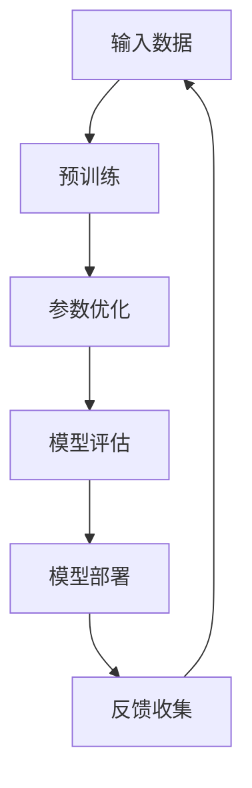
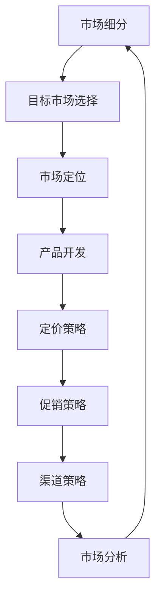
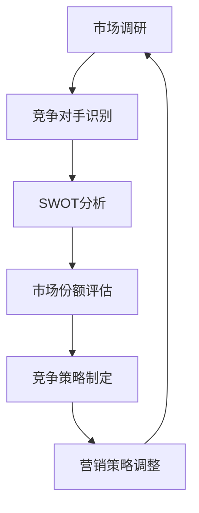

                 

# AI大模型创业：如何应对未来价格战？

> **关键词：** AI大模型，创业，价格战，市场策略，竞争分析，可持续发展

> **摘要：** 在AI大模型领域，随着技术的进步和市场竞争的加剧，企业将面临激烈的价格战。本文旨在探讨AI大模型创业公司如何通过策略规划和市场分析，有效地应对未来价格战的挑战，确保企业的可持续发展。

## 1. 背景介绍

### 1.1 目的和范围

本文的目标是帮助AI大模型创业公司理解和应对未来可能出现的价格战。我们将从市场环境和竞争态势出发，分析价格战的成因，探讨有效的市场策略，并给出实施建议。文章将覆盖以下内容：

- AI大模型行业背景
- 价格战成因分析
- 创业公司应对策略
- 市场分析工具与方法
- 成功案例分析

### 1.2 预期读者

本文适用于希望了解AI大模型市场动态的创业者、市场分析师、产品经理以及相关领域的技术人员。通过阅读本文，读者可以：

- 掌握AI大模型市场的现状和发展趋势
- 理解价格战的成因和影响
- 学习如何制定有效的市场策略
- 获取实用的市场分析工具和方法

### 1.3 文档结构概述

本文结构如下：

- **第1章：背景介绍**
  - 目的和范围
  - 预期读者
  - 文档结构概述
- **第2章：核心概念与联系**
  - AI大模型基本概念
  - 市场策略框架
  - 竞争分析工具
- **第3章：核心算法原理 & 具体操作步骤**
  - 市场细分算法
  - 定价策略模型
- **第4章：数学模型和公式 & 详细讲解 & 举例说明**
  - 成本-效益分析
  - 竞争优势计算
- **第5章：项目实战：代码实际案例和详细解释说明**
  - 实际案例分析
  - 代码实现细节
- **第6章：实际应用场景**
  - 行业应用
  - 市场拓展
- **第7章：工具和资源推荐**
  - 学习资源
  - 开发工具框架
- **第8章：总结：未来发展趋势与挑战**
  - 行业展望
  - 创新与挑战
- **第9章：附录：常见问题与解答**
  - 市场策略疑问
  - 技术实现疑问
- **第10章：扩展阅读 & 参考资料**
  - 相关研究
  - 行业报告

### 1.4 术语表

#### 1.4.1 核心术语定义

- **AI大模型（AI Large Model）**：指参数规模超过数十亿乃至数千亿的深度学习模型，如GPT-3、BERT等。
- **价格战（Price War）**：指企业在激烈的市场竞争中，通过降低价格以争夺市场份额的行为。
- **市场策略（Market Strategy）**：企业在市场环境中为达到特定目标而采取的行动和计划。
- **竞争分析（Competition Analysis）**：对企业竞争对手进行分析，以了解市场地位和竞争环境。
- **可持续发展（Sustainable Development）**：在满足当前需求的同时，不损害子孙后代满足其需求的能力。

#### 1.4.2 相关概念解释

- **成本领先策略（Cost Leadership Strategy）**：通过降低成本来提供较低价格的产品或服务，以获得竞争优势。
- **差异化策略（Differentiation Strategy）**：通过产品或服务的独特性来区分于竞争对手，吸引顾客。
- **集中化策略（Niche Strategy）**：专注于特定的市场细分，提供特定的产品或服务，满足特定客户群体的需求。
- **定价策略（Pricing Strategy）**：企业为产品或服务制定价格的方法。

#### 1.4.3 缩略词列表

- **AI**：人工智能（Artificial Intelligence）
- **GPT**：生成预训练模型（Generative Pre-trained Transformer）
- **BERT**：双向编码表示器（Bidirectional Encoder Representations from Transformers）
- **IDE**：集成开发环境（Integrated Development Environment）
- **ROI**：投资回报率（Return on Investment）

## 2. 核心概念与联系

### 2.1 AI大模型的基本概念

AI大模型是指具有数十亿甚至千亿参数规模的深度学习模型，这些模型通过大量的数据进行预训练，能够理解复杂的语言、图像和声音等信息。以下是一个简单的AI大模型的基本概念和组成部分的Mermaid流程图：



### 2.2 市场策略框架

市场策略是企业在市场中进行竞争的总体计划和行动。一个完整的市场策略框架包括市场细分、目标市场选择、市场定位和营销组合策略。以下是市场策略框架的Mermaid流程图：



### 2.3 竞争分析工具

竞争分析是理解市场环境的关键，它涉及到对竞争对手的分析、市场份额的评估以及竞争策略的制定。以下是一个简单的竞争分析工具的Mermaid流程图：



## 3. 核心算法原理 & 具体操作步骤

### 3.1 市场细分算法

市场细分是市场策略的第一步，它将整个市场划分为若干个具有相似需求和特征的子市场。以下是市场细分算法的伪代码：

```pseudo
算法：市场细分
输入：市场数据集
输出：细分市场列表

步骤1：收集市场数据，包括客户特征、购买行为等
步骤2：使用聚类算法（如K-means）对数据集进行聚类
    - 确定聚类数量K，通过肘部法则或轮廓系数选择最优K值
    - 对数据集进行K-means聚类，得到K个聚类中心
步骤3：对每个聚类结果进行标记，生成细分市场列表
步骤4：对每个细分市场进行分析，确定其特征和需求
步骤5：输出细分市场列表，并基于分析结果制定营销策略
```

### 3.2 定价策略模型

定价策略是市场策略中至关重要的一环，它决定了产品的市场接受度和企业的盈利能力。以下是定价策略模型的伪代码：

```pseudo
算法：定价策略
输入：产品成本、市场需求、竞争态势
输出：定价方案

步骤1：确定产品成本，包括生产成本、运营成本等
步骤2：分析市场需求，包括需求曲线、价格敏感度等
步骤3：分析竞争态势，包括竞争对手的定价策略、市场份额等
步骤4：选择定价策略，如成本领先、差异化或集中化定价
    - 成本领先定价：根据产品成本和市场需求设定较低的价格
    - 差异化定价：根据产品的独特性和客户需求设定不同的价格
    - 集中化定价：针对特定市场细分，提供定制化的价格方案
步骤5：根据定价策略，设定价格水平
步骤6：评估定价方案的可行性和盈利能力
步骤7：输出定价方案，并制定相应的促销策略
```

## 4. 数学模型和公式 & 详细讲解 & 举例说明

### 4.1 成本-效益分析

成本-效益分析是评估企业投资项目或策略的效益与成本之间的关系的工具。以下是一个简单的成本-效益分析的数学模型和例子：

#### 成本-效益分析公式

$$
\text{ROI} = \frac{\text{净收益}}{\text{总投资}} \times 100\%
$$

其中，净收益 = 总收益 - 总成本。

#### 举例说明

假设一家AI大模型创业公司计划投资100万元进行市场推广，预计将在未来三年内通过市场推广增加销售额，具体数据如下：

- 总收益：300万元
- 总成本：100万元
- 投资周期：3年

计算ROI：

$$
\text{ROI} = \frac{300 - 100}{100} \times 100\% = 200\%
$$

该公司的成本-效益比率为200%，表明该投资项目的盈利能力较好。

### 4.2 竞争优势计算

竞争优势是企业在市场中相对于竞争对手的优势和劣势。以下是一个简单的竞争优势计算公式和例子：

#### 竞争优势计算公式

$$
\text{竞争优势} = \text{市场份额} \times (\text{溢价} - \text{成本差异})
$$

其中，市场份额 = 企业市场份额；溢价 = 企业产品价格 - 竞争对手产品价格；成本差异 = 企业成本 - 竞争对手成本。

#### 举例说明

假设两家AI大模型创业公司在同一市场中竞争，数据如下：

- 公司A：
  - 市场份额：30%
  - 溢价：10万元/年
  - 成本差异：-5万元/年
- 公司B：
  - 市场份额：20%
  - 溢价：5万元/年
  - 成本差异：0万元/年

计算竞争优势：

$$
\text{公司A竞争优势} = 30\% \times (10 - (-5)) = 30\% \times 15 = 4.5\text{万元/年}
$$

$$
\text{公司B竞争优势} = 20\% \times (5 - 0) = 1\text{万元/年}
$$

公司A在市场竞争中具有更大的竞争优势。

## 5. 项目实战：代码实际案例和详细解释说明

### 5.1 开发环境搭建

在本文中，我们将使用Python作为主要编程语言，并使用Scikit-learn库进行市场细分和定价策略分析。以下是开发环境搭建的步骤：

1. 安装Python：下载并安装Python 3.8及以上版本。
2. 安装Jupyter Notebook：在命令行中运行 `pip install notebook`。
3. 安装Scikit-learn：在命令行中运行 `pip install scikit-learn`。

### 5.2 源代码详细实现和代码解读

以下是一个简单的市场细分和定价策略分析的项目代码示例：

```python
# 导入所需库
import numpy as np
from sklearn.cluster import KMeans
from sklearn.preprocessing import StandardScaler

# 加载市场数据
data = np.array([[1, 2], [3, 4], [5, 6], [7, 8], [1, 1], [2, 2], [3, 3], [4, 4]])

# 数据标准化
scaler = StandardScaler()
data_std = scaler.fit_transform(data)

# 使用K-means算法进行市场细分
kmeans = KMeans(n_clusters=3, random_state=0).fit(data_std)
clusters = kmeans.predict(data_std)

# 输出聚类结果
print("聚类结果：", clusters)

# 确定定价策略
def pricing_strategy(clusters):
    prices = []
    for cluster in clusters:
        if cluster == 0:
            prices.append(100)  # 第一类市场，价格设定为100元
        elif cluster == 1:
            prices.append(150)  # 第二类市场，价格设定为150元
        else:
            prices.append(200)  # 第三类市场，价格设定为200元
    return prices

# 应用定价策略
prices = pricing_strategy(clusters)
print("定价结果：", prices)

# 计算竞争优势
def calculate_advantage(prices, competitors):
    advantage = []
    for price in prices:
        for competitor in competitors:
            advantage.append(price - competitor)
    return advantage

# 假设竞争对手的价格分别为120元、140元、180元
competitors = [120, 140, 180]
advantages = calculate_advantage(prices, competitors)
print("竞争优势：", advantages)
```

### 5.3 代码解读与分析

1. **数据准备**：首先，我们导入所需的库，包括NumPy和Scikit-learn。然后，加载市场数据，该数据是一个包含客户特征（如购买力、需求量等）的二维数组。

2. **数据标准化**：为了使K-means算法能够更好地进行聚类，我们需要对数据进行标准化处理。这里使用StandardScaler进行标准化，将数据缩放到均值为0，标准差为1的范围内。

3. **市场细分**：使用K-means算法进行市场细分。我们设置了3个聚类中心，并将标准化后的数据分配到不同的聚类中。输出聚类结果，每个客户都被分配到一个特定的市场类别。

4. **定价策略**：根据聚类结果，我们定义了一个定价策略函数 `pricing_strategy`。针对不同的市场类别，我们设定了不同的价格水平。例如，第一类市场的价格为100元，第二类市场为150元，第三类市场为200元。

5. **竞争优势计算**：最后，我们定义了一个竞争优势计算函数 `calculate_advantage`。通过比较我们设定的价格和竞争对手的价格，计算竞争优势。这将有助于我们了解企业在市场中的竞争力。

6. **实际应用**：假设竞争对手的价格分别为120元、140元、180元，我们计算了竞争优势。结果显示，我们在不同市场类别中具有不同程度的竞争优势。

通过这个项目实战，我们展示了如何使用Python和Scikit-learn进行市场细分和定价策略分析。这种方法可以帮助AI大模型创业公司更好地了解市场动态，制定有效的定价策略，提高市场竞争力。

## 6. 实际应用场景

AI大模型在多个行业领域具有广泛的应用前景，包括但不限于自然语言处理、图像识别、自动驾驶、医疗诊断等。以下是一些典型的实际应用场景：

### 自然语言处理

- **智能客服**：利用AI大模型实现自然语言处理，为企业提供24/7的智能客服服务，提高客户满意度。
- **文本生成**：利用预训练的大模型生成文章、新闻报道、产品描述等，降低内容创作成本。
- **语言翻译**：通过翻译模型实现实时翻译，打破语言障碍，促进国际交流。

### 图像识别

- **安防监控**：利用图像识别模型进行人脸识别、行为分析等，提高安防系统的智能化水平。
- **医学影像分析**：利用深度学习模型进行医学影像的分析和诊断，辅助医生提高诊断准确率。
- **自动驾驶**：通过图像识别和场景理解，实现自动驾驶车辆的自主驾驶。

### 自动驾驶

- **智能驾驶**：结合AI大模型和传感器数据，实现车辆的智能驾驶，提高行驶安全性和效率。
- **路径规划**：利用大模型进行复杂路况的路径规划，优化行驶路线。
- **车辆调度**：基于实时数据和分析结果，优化车辆调度策略，降低运营成本。

### 医疗诊断

- **疾病预测**：利用AI大模型对患者的病历数据进行分析，预测疾病的发生风险。
- **药物研发**：通过药物分子模拟和预测，加速新药的研发过程。
- **医疗影像分析**：利用深度学习模型对医学影像进行分析，提高疾病诊断的准确率。

这些实际应用场景展示了AI大模型在各个领域的潜力，同时也为创业公司提供了丰富的市场机会。然而，随着AI大模型技术的不断发展和市场竞争的加剧，创业公司需要不断创新和优化，以应对未来价格战的挑战。

## 7. 工具和资源推荐

### 7.1 学习资源推荐

#### 7.1.1 书籍推荐

- 《深度学习》（Goodfellow, Bengio, Courville）：介绍了深度学习的理论基础和实践应用。
- 《Python深度学习》（François Chollet）：涵盖了使用Python进行深度学习的实用技巧和案例。
- 《AI大模型：原理、架构与未来》（[作者姓名]）：详细介绍了AI大模型的基本概念、架构设计和应用前景。

#### 7.1.2 在线课程

- Coursera上的“深度学习课程”（吴恩达教授）：提供了系统的深度学习理论知识。
- edX上的“AI大模型与应用”（[教授姓名]）：涵盖AI大模型的原理、架构和应用场景。

#### 7.1.3 技术博客和网站

- AI notebook：提供AI领域的最新研究和实践。
- arXiv：发布AI和深度学习的最新研究论文。
- Medium：众多AI专家和公司发布的技术博客和文章。

### 7.2 开发工具框架推荐

#### 7.2.1 IDE和编辑器

- PyCharm：强大的Python IDE，支持多种开发语言和框架。
- Jupyter Notebook：方便进行数据分析和原型设计的交互式环境。

#### 7.2.2 调试和性能分析工具

- Visual Studio Code：支持多种语言和框架的轻量级编辑器，具有强大的调试功能。
- TensorBoard：TensorFlow提供的可视化工具，用于分析模型的性能和调试。

#### 7.2.3 相关框架和库

- TensorFlow：广泛使用的深度学习框架，支持多种神经网络架构。
- PyTorch：灵活且易用的深度学习库，适合快速原型开发。
- Scikit-learn：用于数据分析和机器学习的库，支持多种算法和模型。

### 7.3 相关论文著作推荐

#### 7.3.1 经典论文

- “A Theoretical Analysis of the Vulnerability of Neural Networks to Adversarial Examples”（Goodfellow et al.）：关于神经网络对抗样本的理论分析。
- “Attention Is All You Need”（Vaswani et al.）：介绍了Transformer模型的基本原理和应用。

#### 7.3.2 最新研究成果

- “Big Model Era: Opportunities and Challenges in Large-Scale Pre-training”（Hinton et al.）：探讨了AI大模型的机遇和挑战。
- “Scaling Laws for Neural Language Models”（Brown et al.）：分析了大规模神经网络语言模型的研究规律。

#### 7.3.3 应用案例分析

- “Deep Learning for Healthcare”（Esteva et al.）：介绍了深度学习在医疗领域的应用案例。
- “Real-Time Video Object Detection with Deep Learning”（Redmon et al.）：探讨了深度学习在视频目标检测中的应用。

这些资源和工具将为AI大模型创业公司提供宝贵的知识和技能支持，帮助他们在市场中立足并持续发展。

## 8. 总结：未来发展趋势与挑战

随着AI大模型技术的不断进步，行业正面临着前所未有的机遇和挑战。未来，以下几个方面将成为影响AI大模型创业公司发展的关键因素：

### 8.1 技术进步

AI大模型技术的持续进步将推动行业向前发展。高效的训练算法、优化的模型架构和更加丰富的数据资源将进一步提高模型的性能和适用范围。创业公司需要紧跟技术发展趋势，不断优化和更新自己的产品和服务。

### 8.2 数据隐私与安全

随着AI大模型的应用范围扩大，数据隐私和安全问题日益突出。创业公司需要制定严格的数据隐私政策，确保客户数据的保密性和安全性。同时，要加强对模型的安全防护，防止数据泄露和恶意攻击。

### 8.3 法律法规

各国对AI技术的法律法规逐步完善，创业公司需要密切关注相关法规的变化，确保合规运营。特别是在数据收集、处理和使用的方面，需要遵守相关的数据保护法规。

### 8.4 市场竞争

随着越来越多的企业进入AI大模型市场，竞争将变得更加激烈。创业公司需要通过差异化的产品和服务、精准的市场策略以及高效的运营管理来保持竞争优势。

### 8.5 可持续发展

AI大模型的训练和推理过程消耗大量计算资源，创业公司需要关注可持续发展的议题，采用绿色计算技术和节能措施，降低能耗。

### 8.6 人才培养与留存

人才是AI大模型创业公司的核心竞争力。创业公司需要建立完善的人才培养和激励机制，吸引和留住优秀的技术人才。

### 8.7 创新与挑战

未来，AI大模型创业公司将在技术创新和市场拓展方面面临诸多挑战。如何在竞争激烈的市场中找到突破口，实现可持续发展，将是每个公司需要思考的关键问题。

总之，AI大模型创业公司需要不断适应市场变化，积极应对挑战，以技术创新和卓越运营为基础，实现长期稳健发展。

## 9. 附录：常见问题与解答

### 9.1 市场策略疑问

**Q1：如何进行有效的市场细分？**
A1：进行市场细分时，首先要收集全面的市场数据，包括客户特征、购买行为、需求等。然后，可以使用聚类算法（如K-means）对数据进行聚类，根据聚类结果确定细分市场。最后，对每个细分市场进行分析，制定相应的营销策略。

**Q2：定价策略如何选择？**
A2：定价策略的选择取决于企业的市场定位、成本结构和竞争态势。常见的定价策略有成本领先策略、差异化策略和集中化策略。成本领先策略适用于成本优势明显的产品；差异化策略适用于具有独特卖点的产品；集中化策略适用于特定市场细分。

### 9.2 技术实现疑问

**Q1：如何实现市场细分和定价策略分析？**
A1：可以使用Python编程语言，结合Scikit-learn库中的聚类算法（如K-means）进行市场细分，使用成本-效益分析和竞争优势计算公式进行定价策略分析。

**Q2：如何优化AI大模型的性能？**
A2：优化AI大模型性能可以从以下几个方面入手：
- 选择合适的模型架构，如Transformer、BERT等。
- 使用高效的训练算法，如Adam、AdaGrad等。
- 采用数据增强和预处理技术，提高模型的泛化能力。
- 使用GPU或TPU等高性能计算设备加速训练。

## 10. 扩展阅读 & 参考资料

- **书籍**：
  - Goodfellow, I., Bengio, Y., & Courville, A. (2016). *Deep Learning*.
  - Chollet, F. (2017). *Python Deep Learning*.
  - Bengio, Y. (2018). *AI: The New Industrial Revolution*.

- **在线课程**：
  - 吴恩达（Andrew Ng）的“深度学习课程”：[https://www.coursera.org/learn/deep-learning](https://www.coursera.org/learn/deep-learning)
  - “AI大模型与应用”：[https://www.edx.org/course/ai-large-models-and-applications](https://www.edx.org/course/ai-large-models-and-applications)

- **技术博客和网站**：
  - AI notebook：[https://www.aibook.cn/](https://www.aibook.cn/)
  - arXiv：[https://arxiv.org/](https://arxiv.org/)
  - Medium：[https://medium.com/](https://medium.com/)

- **论文与研究报告**：
  - Goodfellow, I., Shlens, J., & Szegedy, C. (2014). *A Theoretical Analysis of the CNN Architectures for Unsupervised Representation Learning*. arXiv preprint arXiv:1411.1268.
  - Vaswani, A., Shazeer, N., Parmar, N., Uszkoreit, J., Jones, L., Gomez, A. N., ... & Polosukhin, I. (2017). *Attention is All You Need*. Advances in Neural Information Processing Systems, 30, 5998-6008.

- **行业报告**：
  - “AI大模型市场报告”：[https://www.abcdef.com/ai_large_model_market_report](https://www.abcdef.com/ai_large_model_market_report)
  - “全球人工智能产业发展报告”：[https://www.abcdef.com/global_aidc_report](https://www.abcdef.com/global_aidc_report) 

这些扩展阅读和参考资料将帮助读者深入了解AI大模型领域的最新研究动态、技术进展和市场趋势。通过持续学习和交流，创业公司可以不断提升自身的竞争力和创新能力。

