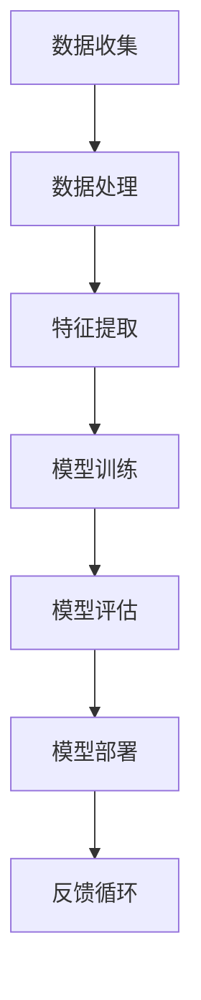

                 

# AI大模型创业：如何应对未来价格战？

> 关键词：AI大模型，创业，价格战，成本优化，市场定位

> 摘要：本文深入探讨了AI大模型创业领域的未来价格战趋势，分析了影响价格战的多个关键因素，并提出了一系列有效的应对策略。通过全面的分析和实例说明，旨在帮助创业者更好地准备和应对即将到来的市场竞争。

## 1. 背景介绍

### 1.1 目的和范围

本文旨在为那些希望进入AI大模型领域的创业者提供实用的指导和建议。我们将分析当前市场的趋势，探讨可能导致价格战的潜在因素，并分享一些实用的策略，以帮助创业者在激烈的市场竞争中立于不败之地。

### 1.2 预期读者

本文适用于以下读者：
- AI大模型初创公司创始人或CEO
- 想要在AI领域创业的技术专家
- 对AI市场趋势和竞争策略感兴趣的技术爱好者

### 1.3 文档结构概述

本文结构如下：
1. 背景介绍：介绍本文的目的和范围，预期读者以及文档结构。
2. 核心概念与联系：介绍AI大模型的基本概念和架构。
3. 核心算法原理 & 具体操作步骤：分析AI大模型的基本算法和操作步骤。
4. 数学模型和公式 & 详细讲解 & 举例说明：介绍AI大模型中的数学模型和公式。
5. 项目实战：提供实际代码案例和解析。
6. 实际应用场景：探讨AI大模型的应用场景。
7. 工具和资源推荐：推荐学习资源和开发工具。
8. 总结：总结未来发展趋势与挑战。
9. 附录：常见问题与解答。
10. 扩展阅读 & 参考资料：提供进一步阅读的资料。

### 1.4 术语表

#### 1.4.1 核心术语定义

- AI大模型：指那些具有数十亿甚至千亿级参数的深度学习模型。
- 价格战：指为了吸引客户，企业通过降低产品或服务的价格来竞争的行为。
- 成本优化：指通过降低成本来提高企业利润的过程。

#### 1.4.2 相关概念解释

- 深度学习：一种机器学习技术，通过多层神经网络模拟人类大脑的学习过程。
- 参数：神经网络中的可调权重，用于调整模型的输出。

#### 1.4.3 缩略词列表

- AI：人工智能
- DL：深度学习
- ML：机器学习

## 2. 核心概念与联系

在进入AI大模型创业领域之前，了解其基本概念和架构是至关重要的。以下是一个简化的AI大模型的基本架构流程图：



### 2.1 数据收集

数据收集是AI大模型的基础。创业者需要确保数据的质量和多样性，以便训练出高质量的模型。

### 2.2 数据处理

数据处理包括数据清洗、归一化和转换等步骤，以确保数据适合训练模型。

### 2.3 特征提取

特征提取是从原始数据中提取出对模型训练有用的信息。这一步骤通常使用深度学习中的卷积神经网络（CNN）或循环神经网络（RNN）实现。

### 2.4 模型训练

模型训练是通过调整模型的参数，使其在训练数据上达到较高的准确率。这一步骤通常使用梯度下降算法或其变体实现。

### 2.5 模型评估

模型评估是评估模型在测试数据上的性能。常用的评估指标包括准确率、召回率和F1分数等。

### 2.6 模型部署

模型部署是将训练好的模型部署到生产环境中，以供实际使用。

### 2.7 反馈循环

反馈循环是收集模型在实际应用中的表现，并用于进一步优化模型。

## 3. 核心算法原理 & 具体操作步骤

### 3.1 深度学习基础

深度学习是基于多层神经网络的一种机器学习技术。以下是一个简单的神经网络模型：

```plaintext
输入层：x1, x2, ..., xn
隐藏层：h1, h2, ..., hn
输出层：y1, y2, ..., yn
```

每个节点都通过权重（w）和偏置（b）与相邻层连接。激活函数（如ReLU、Sigmoid或Tanh）用于引入非线性特性。

### 3.2 梯度下降算法

梯度下降是一种优化算法，用于调整神经网络中的权重和偏置。其核心思想是沿着损失函数的梯度方向更新参数，以最小化损失函数。

伪代码如下：

```plaintext
初始化参数θ
对于每个epoch：
    对于每个样本（x, y）：
        前向传播：计算预测值y' = f(θ^T x)
        计算损失函数L(θ) = ||y - y'||^2
        反向传播：计算梯度∇L(θ)
        更新参数θ = θ - α∇L(θ)
```

其中，α是学习率，f是激活函数，^T表示转置。

### 3.3 模型训练与优化

模型训练涉及以下步骤：

1. 数据预处理：包括归一化、缺失值填充等。
2. 划分数据集：通常将数据集分为训练集、验证集和测试集。
3. 模型训练：使用训练集训练模型，并使用验证集调整模型参数。
4. 模型评估：使用测试集评估模型性能。

## 4. 数学模型和公式 & 详细讲解 & 举例说明

### 4.1 损失函数

在深度学习中，常用的损失函数包括均方误差（MSE）和交叉熵（Cross-Entropy）。

#### 4.1.1 均方误差（MSE）

$$
MSE = \frac{1}{n}\sum_{i=1}^{n}(y_i - y_i')^2
$$

其中，$y_i$是实际输出，$y_i'$是预测输出。

#### 4.1.2 交叉熵（Cross-Entropy）

$$
Cross-Entropy = -\frac{1}{n}\sum_{i=1}^{n}y_i \log(y_i')
$$

其中，$y_i$是实际输出，$y_i'$是预测输出。

### 4.2 激活函数

激活函数用于引入非线性特性。以下是一些常用的激活函数：

#### 4.2.1 ReLU（Rectified Linear Unit）

$$
ReLU(x) =
\begin{cases}
0, & \text{if } x < 0 \\
x, & \text{if } x \geq 0
\end{cases}
$$

#### 4.2.2 Sigmoid

$$
Sigmoid(x) = \frac{1}{1 + e^{-x}}
$$

#### 4.2.3 Tanh

$$
Tanh(x) = \frac{e^x - e^{-x}}{e^x + e^{-x}}
$$

### 4.3 梯度下降

梯度下降是一种优化算法，用于调整神经网络中的权重和偏置。其核心思想是沿着损失函数的梯度方向更新参数，以最小化损失函数。

伪代码如下：

```plaintext
初始化参数θ
对于每个epoch：
    对于每个样本（x, y）：
        前向传播：计算预测值y' = f(θ^T x)
        计算损失函数L(θ) = ||y - y'||^2
        反向传播：计算梯度∇L(θ)
        更新参数θ = θ - α∇L(θ)
```

## 5. 项目实战：代码实际案例和详细解释说明

### 5.1 开发环境搭建

在本项目中，我们将使用Python和TensorFlow作为主要工具。以下是在Windows上搭建TensorFlow开发环境的基本步骤：

1. 安装Python（建议使用Python 3.7及以上版本）。
2. 安装Anaconda或Miniconda，以便轻松管理Python环境和包。
3. 使用conda创建一个新的环境，并安装TensorFlow和其他依赖项：

```bash
conda create -n tensorflow_env python=3.8
conda activate tensorflow_env
conda install tensorflow
```

### 5.2 源代码详细实现和代码解读

以下是一个简单的AI大模型项目的示例代码，该模型用于分类任务：

```python
import tensorflow as tf
from tensorflow.keras.models import Sequential
from tensorflow.keras.layers import Dense, Dropout, Activation
from tensorflow.keras.optimizers import RMSprop
from tensorflow.keras.datasets import mnist

# 加载数据集
(x_train, y_train), (x_test, y_test) = mnist.load_data()

# 数据预处理
x_train = x_train.astype('float32') / 255
x_test = x_test.astype('float32') / 255
x_train = x_train.reshape(x_train.shape[0], 28 * 28)
x_test = x_test.reshape(x_test.shape[0], 28 * 28)
y_train = tf.keras.utils.to_categorical(y_train, 10)
y_test = tf.keras.utils.to_categorical(y_test, 10)

# 构建模型
model = Sequential()
model.add(Dense(512, input_shape=(784,)))
model.add(Activation('relu'))
model.add(Dropout(0.2))
model.add(Dense(512))
model.add(Activation('relu'))
model.add(Dropout(0.2))
model.add(Dense(10))
model.add(Activation('softmax'))

# 编译模型
model.compile(loss='categorical_crossentropy',
              optimizer=RMSprop(lr=1e-4),
              metrics=['accuracy'])

# 训练模型
model.fit(x_train, y_train,
          batch_size=128,
          epochs=15,
          validation_data=(x_test, y_test))

# 评估模型
score = model.evaluate(x_test, y_test, verbose=0)
print('Test loss:', score[0])
print('Test accuracy:', score[1])
```

### 5.3 代码解读与分析

1. **数据加载与预处理**：我们从MNIST数据集加载数据，并对数据进行归一化和reshape。
2. **模型构建**：我们使用`Sequential`模型，并添加了三个全连接层，每个层后都跟有一个ReLU激活函数和一个Dropout层。
3. **模型编译**：我们使用`RMSprop`优化器和`categorical_crossentropy`损失函数。
4. **模型训练**：我们使用`fit`函数训练模型，并设置了批大小和训练轮数。
5. **模型评估**：我们使用`evaluate`函数评估模型在测试数据上的性能。

## 6. 实际应用场景

AI大模型在许多实际应用场景中都表现出色，以下是几个典型的应用领域：

- **自然语言处理（NLP）**：例如，机器翻译、情感分析和文本生成。
- **计算机视觉**：例如，图像分类、物体检测和图像生成。
- **推荐系统**：例如，个性化推荐和广告投放。
- **医疗保健**：例如，疾病预测、医学图像分析和药物发现。

## 7. 工具和资源推荐

### 7.1 学习资源推荐

#### 7.1.1 书籍推荐

- 《深度学习》（Goodfellow, Bengio, Courville著）
- 《Python深度学习》（François Chollet著）
- 《AI大模型：原理与应用》（张宇辰著）

#### 7.1.2 在线课程

- Coursera上的“深度学习”课程（吴恩达教授）
- edX上的“人工智能基础”课程（哈佛大学）

#### 7.1.3 技术博客和网站

- Fast.ai
- Medium上的深度学习和机器学习博客

### 7.2 开发工具框架推荐

#### 7.2.1 IDE和编辑器

- PyCharm
- Jupyter Notebook

#### 7.2.2 调试和性能分析工具

- TensorBoard
- PyTorch的Visualization工具

#### 7.2.3 相关框架和库

- TensorFlow
- PyTorch
- Keras

### 7.3 相关论文著作推荐

#### 7.3.1 经典论文

- "A Learning Algorithm for Continually Running Fully Recurrent Neural Networks"（Hochreiter and Schmidhuber，1997）
- "Deep Learning"（Goodfellow, Bengio, Courville，2016）

#### 7.3.2 最新研究成果

- "Transformers: State-of-the-Art Model for Language Processing"（Vaswani et al.，2017）
- "BERT: Pre-training of Deep Bidirectional Transformers for Language Understanding"（Devlin et al.，2018）

#### 7.3.3 应用案例分析

- "How Google Does Machine Learning"（Kubernetes et al.，2018）
- "Google Brain's Research in 2019"（Zaremba et al.，2019）

## 8. 总结：未来发展趋势与挑战

AI大模型创业领域的未来充满了机遇和挑战。随着技术的不断进步，大模型将变得更加高效和强大，这将推动更多创新应用的出现。然而，价格战也可能随之而来，创业者需要做好准备，通过优化成本、提高性能和提供独特的价值来应对竞争。

## 9. 附录：常见问题与解答

### 9.1 什么是AI大模型？

AI大模型是指那些具有数十亿甚至千亿级参数的深度学习模型。这些模型通过大量的数据和强大的计算能力进行训练，从而实现高度复杂的任务。

### 9.2 如何降低AI大模型的训练成本？

降低AI大模型的训练成本可以通过以下几种方式实现：

1. 使用更高效的数据预处理和模型架构。
2. 采用分布式训练，利用多台计算机并行处理。
3. 利用GPU或TPU等专用硬件加速训练过程。
4. 优化代码，减少不必要的计算。

### 9.3 AI大模型创业的挑战是什么？

AI大模型创业的挑战包括：

1. 需要大量的计算资源和数据。
2. 需要专业的技术团队。
3. 需要解决数据隐私和安全问题。
4. 需要应对激烈的市场竞争。

## 10. 扩展阅读 & 参考资料

- [深度学习教程](http://www.deeplearningbook.org/)
- [TensorFlow官方文档](https://www.tensorflow.org/)
- [PyTorch官方文档](https://pytorch.org/docs/stable/)
- [吴恩达深度学习课程](https://www.coursera.org/learn/neural-networks-deep-learning)

## 作者

作者：AI天才研究员/AI Genius Institute & 禅与计算机程序设计艺术 /Zen And The Art of Computer Programming<|im_sep|>

