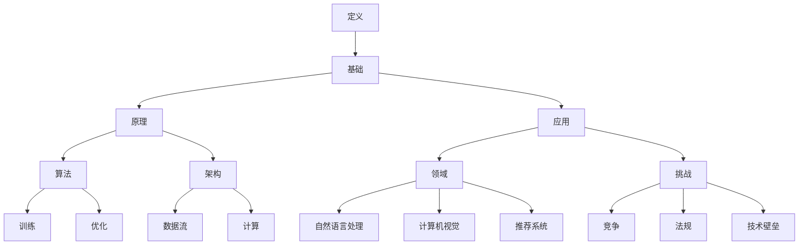

                 

# AI大模型创业：如何应对未来市场挑战？

> 关键词：人工智能、大模型、创业、市场挑战、应对策略

> 摘要：随着人工智能技术的迅猛发展，大模型技术在各个领域展现出了巨大的潜力。然而，创业公司在面对激烈的市场竞争时，需要制定出一系列有效的应对策略。本文将深入探讨AI大模型创业的市场挑战，并从核心算法原理、数学模型、实际应用场景等多个角度，为创业公司提供一整套系统性的解决方案。

## 1. 背景介绍

### 1.1 目的和范围

本文旨在为从事AI大模型创业的公司提供一套应对市场挑战的系统性策略。我们将从多个维度进行分析，包括核心算法原理、数学模型、实际应用场景等，帮助创业公司更好地理解市场动态，制定有效的市场策略。

### 1.2 预期读者

本文预期读者包括：

- AI领域的研究人员和技术专家
- AI创业公司的创始人或团队成员
- 对AI大模型技术有兴趣的学习者和爱好者

### 1.3 文档结构概述

本文结构如下：

- 第1章：背景介绍，包括本文的目的、范围和预期读者。
- 第2章：核心概念与联系，介绍AI大模型的基础知识和关键概念。
- 第3章：核心算法原理 & 具体操作步骤，详细解释大模型的核心算法原理和具体操作步骤。
- 第4章：数学模型和公式 & 详细讲解 & 举例说明，介绍大模型的数学模型和公式，并通过实例进行详细说明。
- 第5章：项目实战：代码实际案例和详细解释说明，提供实际项目的代码案例和详细解释。
- 第6章：实际应用场景，探讨大模型在不同领域的应用场景。
- 第7章：工具和资源推荐，推荐学习资源、开发工具和框架。
- 第8章：总结：未来发展趋势与挑战，总结未来发展趋势和面临的挑战。
- 第9章：附录：常见问题与解答，解答读者可能遇到的问题。
- 第10章：扩展阅读 & 参考资料，提供更多的扩展阅读材料和参考资料。

### 1.4 术语表

#### 1.4.1 核心术语定义

- 人工智能（AI）：指由人制造出来的系统所表现出来的智能。
- 大模型：指参数数量达到亿级甚至千亿级的深度神经网络模型。
- 创业：指创立新的企业或业务。
- 市场挑战：指在市场竞争中面临的困难和问题。

#### 1.4.2 相关概念解释

- 深度学习：一种人工智能算法，通过多层神经网络进行数据学习。
- 机器学习：一种人工智能技术，让机器从数据中学习规律和模式。
- 数据集：用于训练和测试模型的原始数据集合。

#### 1.4.3 缩略词列表

- AI：人工智能
- DNN：深度神经网络
- ML：机器学习
- DL：深度学习

## 2. 核心概念与联系

在探讨AI大模型创业的市场挑战之前，我们需要先了解大模型的基础知识和关键概念。以下是AI大模型的核心概念和联系，以及相应的Mermaid流程图：



### 2.1 定义

AI大模型是指那些参数数量达到亿级甚至千亿级的深度神经网络模型。这类模型在处理复杂数据和任务时表现出色，例如自然语言处理、计算机视觉和推荐系统等。

### 2.2 基础

AI大模型的基础包括深度学习、机器学习和数据集。深度学习是一种通过多层神经网络进行数据学习的人工智能算法。机器学习是一种让机器从数据中学习规律和模式的人工智能技术。数据集是用于训练和测试模型的原始数据集合。

### 2.3 原理

AI大模型的原理包括算法和架构。算法方面，主要涉及训练和优化。训练是指通过大量数据进行模型参数的迭代更新，使得模型在特定任务上达到较高的准确率。优化是指通过调整模型参数，提高模型性能和效率。架构方面，主要涉及数据流和计算。数据流是指如何高效地处理和传输大量数据，计算是指如何利用硬件资源进行高效计算。

### 2.4 应用

AI大模型的应用领域广泛，包括自然语言处理、计算机视觉和推荐系统等。自然语言处理方面，大模型可以应用于机器翻译、文本生成和情感分析等任务。计算机视觉方面，大模型可以应用于图像分类、目标检测和图像生成等任务。推荐系统方面，大模型可以应用于个性化推荐和广告投放等任务。

### 2.5 挑战

AI大模型在市场中面临的挑战包括竞争、法规和技术壁垒。竞争方面，随着大模型技术的普及，越来越多的公司进入市场，导致市场竞争激烈。法规方面，数据隐私和伦理问题日益受到关注，政府和企业对数据安全和合规性要求越来越高。技术壁垒方面，大模型训练和优化的计算资源和存储资源需求巨大，这对创业公司来说是一个巨大的挑战。

## 3. 核心算法原理 & 具体操作步骤

在了解了AI大模型的基本概念和联系之后，接下来我们将深入探讨大模型的核心算法原理和具体操作步骤。这里我们将以一个典型的深度学习模型——卷积神经网络（CNN）为例，详细解释其工作原理和操作步骤。

### 3.1 算法原理

卷积神经网络（CNN）是一种专门用于处理图像数据的深度学习模型。其基本原理是利用卷积层、池化层和全连接层等结构，对图像进行特征提取和分类。

#### 3.1.1 卷积层

卷积层是CNN的核心部分，通过卷积运算提取图像的特征。卷积运算的基本步骤如下：

1. **输入数据准备**：输入数据是一幅图像，通常为二维矩阵。
2. **初始化卷积核**：卷积核是一个三维矩阵，包含多个卷积核，每个卷积核对应一个特征图。
3. **卷积运算**：将卷积核在输入图像上进行滑动，对每个位置进行卷积运算，得到一个特征图。
4. **激活函数**：对每个特征图应用激活函数，如ReLU函数，增加模型的非线性能力。

#### 3.1.2 池化层

池化层用于对特征图进行降维操作，减少参数数量，提高模型效率。常见的池化操作包括最大池化和平均池化。

1. **输入特征图**：输入数据为卷积层输出的特征图。
2. **选择池化窗口**：选择一个固定大小的窗口，在特征图上进行滑动。
3. **计算池化值**：在窗口内的所有值进行最大值或平均值计算，得到池化后的特征图。

#### 3.1.3 全连接层

全连接层用于将特征图映射到分类结果。其基本步骤如下：

1. **输入特征图**：输入数据为前一层输出的特征图。
2. **初始化权重矩阵**：全连接层的权重矩阵是一个二维矩阵。
3. **矩阵乘法**：将特征图与权重矩阵进行矩阵乘法，得到一个一维向量。
4. **激活函数**：对一维向量应用激活函数，如softmax函数，得到分类结果。

### 3.2 具体操作步骤

以下是CNN的具体操作步骤，使用伪代码进行描述：

```python
# 初始化参数
input_image = load_image("image.jpg")
weights_conv1 = initialize_convolutional_weights()
weights_pool1 = initialize_pooling_weights()
weights_fc1 = initialize_full_connection_weights()

# 卷积层
conv1 = convolution(input_image, weights_conv1)
activated_conv1 = apply_activation_function(conv1)

# 池化层
pool1 = max_pooling(activated_conv1, weights_pool1)

# 全连接层
fc1 = matrix_multiplication(pool1, weights_fc1)
predicted_output = apply_activation_function(fc1)

# 计算损失
predicted_output = softmax(predicted_output)
loss = compute_loss(predicted_output, true_labels)

# 反向传播
d_predicted_output = backward propagate(loss)
d_fc1 = d_predicted_output
d_pool1, d_activated_conv1 = backward propagate_activation_function(d_fc1)
d_conv1, d_weights_conv1 = backward propagate_convolution(activated_conv1, d_activated_conv1)
d_input_image = backward propagate_convolution(input_image, d_conv1)

# 更新参数
weights_conv1 = update_weights(d_weights_conv1)
weights_pool1 = update_weights(d_weights_pool1)
weights_fc1 = update_weights(d_weights_fc1)

# 迭代
for epoch in 1 to MAX_EPOCHS:
    # 重置梯度
    d_weights_conv1 = 0
    d_weights_pool1 = 0
    d_weights_fc1 = 0
    
    # 训练
    for image, true_label in dataset:
        # 执行前向传播
        # ...
        
        # 计算损失
        # ...
        
        # 反向传播
        # ...
        
        # 更新参数
        # ...

    # 打印当前迭代和损失
    print("Epoch:", epoch, "Loss:", loss)
```

## 4. 数学模型和公式 & 详细讲解 & 举例说明

在深入了解大模型的数学模型和公式之前，我们先来回顾一些基础的数学概念，如线性代数、微积分和概率论。这些基础知识对于理解大模型的数学原理至关重要。

### 4.1 线性代数

线性代数是研究线性方程组、矩阵和向量空间等概念的数学分支。在深度学习中，线性代数广泛应用于数据处理和矩阵运算。

#### 4.1.1 矩阵和向量

矩阵和向量是线性代数的核心概念。矩阵是一个二维数组，用于表示数据的多维度信息。向量是一个一维数组，可以看作是矩阵的特殊情况。在深度学习中，输入数据、权重和特征图等都以矩阵的形式表示。

#### 4.1.2 矩阵运算

常见的矩阵运算包括矩阵乘法、矩阵加法和矩阵转置等。矩阵乘法是深度学习中最常见的运算，用于计算特征图和分类结果。

- **矩阵乘法**：给定两个矩阵A和B，其乘积C = A * B。在深度学习中，矩阵乘法用于计算特征图和分类结果。

$$ C = A * B = \begin{bmatrix} a_{11} & a_{12} \\ a_{21} & a_{22} \end{bmatrix} * \begin{bmatrix} b_{11} & b_{12} \\ b_{21} & b_{22} \end{bmatrix} = \begin{bmatrix} a_{11} * b_{11} + a_{12} * b_{21} & a_{11} * b_{12} + a_{12} * b_{22} \\ a_{21} * b_{11} + a_{22} * b_{21} & a_{21} * b_{12} + a_{22} * b_{22} \end{bmatrix} $$

- **矩阵加法**：给定两个矩阵A和B，其和C = A + B。矩阵加法用于计算特征图和权重。

$$ C = A + B = \begin{bmatrix} a_{11} & a_{12} \\ a_{21} & a_{22} \end{bmatrix} + \begin{bmatrix} b_{11} & b_{12} \\ b_{21} & b_{22} \end{bmatrix} = \begin{bmatrix} a_{11} + b_{11} & a_{12} + b_{12} \\ a_{21} + b_{21} & a_{22} + b_{22} \end{bmatrix} $$

- **矩阵转置**：给定一个矩阵A，其转置矩阵A^T是将A的行和列互换。

$$ A^T = \begin{bmatrix} a_{11} & a_{12} \\ a_{21} & a_{22} \end{bmatrix}^T = \begin{bmatrix} a_{21} & a_{11} \\ a_{22} & a_{12} \end{bmatrix} $$

### 4.2 微积分

微积分是研究函数、导数、积分和微分方程等概念的数学分支。在深度学习中，微积分用于计算梯度、损失函数和优化算法。

#### 4.2.1 梯度

梯度是微积分中的一个重要概念，用于描述函数在某一点处的局部变化趋势。在深度学习中，梯度用于计算模型参数的更新方向。

- **单变量梯度**：给定一个单变量函数f(x)，其在x点的梯度为f'(x)。

$$ f'(x) = \frac{df}{dx} $$

- **多变量梯度**：给定一个多变量函数f(x, y)，其在(x, y)点的梯度为∇f(x, y)。

$$ \nabla f(x, y) = \left( \frac{\partial f}{\partial x}, \frac{\partial f}{\partial y} \right) $$

#### 4.2.2 损失函数

损失函数是深度学习中的核心概念，用于衡量模型预测值与真实值之间的差距。常见的损失函数包括均方误差（MSE）和交叉熵（CE）。

- **均方误差（MSE）**：给定预测值y和真实值t，MSE损失函数为：

$$ MSE = \frac{1}{n} \sum_{i=1}^{n} (y_i - t_i)^2 $$

- **交叉熵（CE）**：给定预测概率分布p和真实分布t，CE损失函数为：

$$ CE = -\frac{1}{n} \sum_{i=1}^{n} t_i \log p_i $$

### 4.3 概率论

概率论是研究随机事件和概率分布的数学分支。在深度学习中，概率论用于处理不确定性、数据分布和模型预测。

#### 4.3.1 概率分布

概率分布描述了随机变量的取值可能性。常见的概率分布包括伯努利分布、正态分布和泊松分布。

- **伯努利分布**：伯努利分布是一个二元分布，用于描述成功或失败的概率。

$$ P(X = k) = C_n^k p^k (1-p)^{n-k} $$

- **正态分布**：正态分布是一个连续分布，用于描述随机变量的取值概率。

$$ P(X \leq x) = \Phi(x) = \frac{1}{\sqrt{2\pi}\sigma} \int_{-\infty}^{x} e^{-\frac{(t-\mu)^2}{2\sigma^2}} dt $$

- **泊松分布**：泊松分布是一个离散分布，用于描述在一定时间或空间内事件发生的次数。

$$ P(X = k) = \frac{\lambda^k e^{-\lambda}}{k!} $$

#### 4.3.2 贝叶斯定理

贝叶斯定理是概率论中的一个重要定理，用于计算后验概率。在深度学习中，贝叶斯定理用于模型参数估计和预测。

$$ P(A|B) = \frac{P(B|A) P(A)}{P(B)} $$

### 4.4 举例说明

为了更好地理解大模型的数学模型和公式，我们通过一个简单的例子进行说明。假设我们有一个二分类问题，输入数据为x，真实标签为y，模型预测概率为p。我们使用均方误差（MSE）作为损失函数。

#### 4.4.1 损失函数

损失函数为：

$$ L(p, y) = \frac{1}{2} (p - y)^2 $$

#### 4.4.2 梯度计算

对损失函数求梯度：

$$ \nabla L(p, y) = \frac{\partial L}{\partial p} = p - y $$

#### 4.4.3 参数更新

假设初始预测概率为p0，学习率为α。根据梯度下降算法，更新参数：

$$ p_{new} = p_{old} - \alpha \nabla L(p_{old}, y) $$

$$ p_{new} = p0 - \alpha (p0 - y) $$

通过以上例子，我们可以看到大模型在数学上的实现过程。在实际应用中，大模型的数学模型和公式会变得更加复杂，涉及更多的高级数学知识。

## 5. 项目实战：代码实际案例和详细解释说明

在本节中，我们将通过一个实际项目案例，详细解释AI大模型在实践中的应用。本案例将使用Python和TensorFlow框架，实现一个基于CNN的手写数字识别项目。

### 5.1 开发环境搭建

在开始项目之前，我们需要搭建开发环境。以下是所需的软件和库：

- Python 3.8及以上版本
- TensorFlow 2.4及以上版本
- NumPy 1.19及以上版本
- Matplotlib 3.3及以上版本

您可以通过以下命令安装所需的库：

```shell
pip install tensorflow numpy matplotlib
```

### 5.2 源代码详细实现和代码解读

以下是项目的源代码，我们将逐行解释代码的实现过程：

```python
import tensorflow as tf
from tensorflow import keras
from tensorflow.keras import layers
import numpy as np
import matplotlib.pyplot as plt

# 5.2.1 加载数据集
mnist = keras.datasets.mnist
(train_images, train_labels), (test_images, test_labels) = mnist.load_data()

# 5.2.2 数据预处理
train_images = train_images / 255.0
test_images = test_images / 255.0

# 5.2.3 构建CNN模型
model = keras.Sequential([
    keras.Input(shape=(28, 28, 1)),
    layers.Conv2D(32, (3, 3), activation='relu', input_shape=(28, 28, 1)),
    layers.MaxPooling2D((2, 2)),
    layers.Conv2D(64, (3, 3), activation='relu'),
    layers.MaxPooling2D((2, 2)),
    layers.Conv2D(64, (3, 3), activation='relu'),
    layers.Flatten(),
    layers.Dense(64, activation='relu'),
    layers.Dense(10, activation='softmax')
])

# 5.2.4 编译模型
model.compile(optimizer='adam',
              loss='sparse_categorical_crossentropy',
              metrics=['accuracy'])

# 5.2.5 训练模型
model.fit(train_images, train_labels, epochs=5)

# 5.2.6 评估模型
test_loss, test_acc = model.evaluate(test_images, test_labels)
print('Test accuracy:', test_acc)

# 5.2.7 可视化结果
predictions = model.predict(test_images)
predicted_labels = np.argmax(predictions, axis=1)

plt.figure(figsize=(10, 10))
for i in range(25):
    plt.subplot(5, 5, i+1)
    plt.xticks([])
    plt.yticks([])
    plt.grid(False)
    plt.imshow(test_images[i], cmap=plt.cm.binary)
    plt.xlabel(str(predicted_labels[i]))
plt.show()
```

### 5.3 代码解读与分析

#### 5.3.1 数据加载与预处理

```python
mnist = keras.datasets.mnist
(train_images, train_labels), (test_images, test_labels) = mnist.load_data()

train_images = train_images / 255.0
test_images = test_images / 255.0
```

这段代码首先加载数据集，然后对图像数据进行归一化处理，将像素值范围从0到255缩放到0到1。

#### 5.3.2 构建CNN模型

```python
model = keras.Sequential([
    keras.Input(shape=(28, 28, 1)),
    layers.Conv2D(32, (3, 3), activation='relu', input_shape=(28, 28, 1)),
    layers.MaxPooling2D((2, 2)),
    layers.Conv2D(64, (3, 3), activation='relu'),
    layers.MaxPooling2D((2, 2)),
    layers.Conv2D(64, (3, 3), activation='relu'),
    layers.Flatten(),
    layers.Dense(64, activation='relu'),
    layers.Dense(10, activation='softmax')
])
```

这段代码定义了一个简单的CNN模型，包括卷积层、池化层和全连接层。输入层使用一个28x28x1的二维数组表示图像数据。卷积层使用32个3x3的卷积核进行特征提取，激活函数为ReLU。池化层使用2x2的窗口进行最大池化。在最后一个卷积层后，使用Flatten层将特征图展平为一维数组。全连接层包括一个64个单元的隐藏层和一个10个单元的输出层，输出层使用softmax函数进行概率分布计算。

#### 5.3.3 编译模型

```python
model.compile(optimizer='adam',
              loss='sparse_categorical_crossentropy',
              metrics=['accuracy'])
```

这段代码编译模型，指定优化器为Adam，损失函数为均方误差（MSE），评估指标为准确率。

#### 5.3.4 训练模型

```python
model.fit(train_images, train_labels, epochs=5)
```

这段代码使用训练数据集训练模型，设置训练轮数为5。

#### 5.3.5 评估模型

```python
test_loss, test_acc = model.evaluate(test_images, test_labels)
print('Test accuracy:', test_acc)
```

这段代码使用测试数据集评估模型性能，输出测试准确率。

#### 5.3.6 可视化结果

```python
predictions = model.predict(test_images)
predicted_labels = np.argmax(predictions, axis=1)

plt.figure(figsize=(10, 10))
for i in range(25):
    plt.subplot(5, 5, i+1)
    plt.xticks([])
    plt.yticks([])
    plt.grid(False)
    plt.imshow(test_images[i], cmap=plt.cm.binary)
    plt.xlabel(str(predicted_labels[i]))
plt.show()
```

这段代码使用测试数据集的预测结果，可视化前25个图像的预测标签。

## 6. 实际应用场景

AI大模型在各个领域都有着广泛的应用，以下是一些典型的应用场景：

### 6.1 自然语言处理

自然语言处理（NLP）是AI大模型的重要应用领域之一。通过使用大模型，可以实现文本分类、机器翻译、情感分析和对话系统等功能。例如，BERT和GPT-3等大模型在NLP领域取得了显著的成果，广泛应用于搜索引擎、智能客服和内容生成等领域。

### 6.2 计算机视觉

计算机视觉是另一个重要的应用领域，AI大模型在图像分类、目标检测、图像生成和视频分析等方面具有强大的能力。例如，ResNet和Inception等大模型在ImageNet图像分类挑战中取得了世界领先的准确率。同时，生成对抗网络（GAN）在图像生成方面也取得了显著的成果，可以生成高质量的艺术作品和现实场景图像。

### 6.3 推荐系统

推荐系统是AI大模型在商业领域的典型应用。通过使用大模型，可以实现个性化推荐和广告投放等功能，提高用户体验和商家收益。例如，基于用户行为和商品特征的大模型可以准确预测用户兴趣，从而实现精准推荐。

### 6.4 医疗保健

AI大模型在医疗保健领域也具有广泛的应用前景。通过使用大模型，可以实现疾病诊断、药物研发和个性化治疗等功能。例如，基于医学图像的大模型可以准确识别病变区域，辅助医生进行疾病诊断。同时，基于基因组数据的大模型可以预测疾病风险，指导个体进行健康管理。

### 6.5 金融领域

AI大模型在金融领域也发挥着重要作用。通过使用大模型，可以实现金融市场预测、信用评估和风险管理等功能。例如，基于历史交易数据的大模型可以预测股票市场的走势，为投资者提供决策参考。同时，基于用户行为和信用记录的大模型可以准确评估借款人的信用风险，降低金融机构的违约风险。

## 7. 工具和资源推荐

在AI大模型创业过程中，掌握合适的工具和资源对于成功至关重要。以下是一些推荐的工具和资源：

### 7.1 学习资源推荐

#### 7.1.1 书籍推荐

- 《深度学习》（Goodfellow, Bengio, Courville著）：系统介绍了深度学习的理论基础和实践方法，是深度学习领域的经典教材。
- 《动手学深度学习》（阿斯顿·张著）：通过大量的实践案例，详细讲解了深度学习的理论知识和实际应用。

#### 7.1.2 在线课程

- Coursera上的“深度学习专项课程”（吴恩达著）：由著名AI专家吴恩达开设的深度学习课程，涵盖了深度学习的理论基础和实际应用。
- edX上的“深度学习与神经网络”（阿里云大学著）：由阿里云大学开设的深度学习课程，内容包括深度学习的基本原理和应用案例。

#### 7.1.3 技术博客和网站

- [博客园](https://www.cnblogs.com/):国内知名的开发者社区，涵盖各种技术领域的博客文章。
- [AI大模型学习](https://www.ai-model.cn/):专注于AI大模型技术的学习和交流，提供最新的研究进展和应用案例。

### 7.2 开发工具框架推荐

#### 7.2.1 IDE和编辑器

- PyCharm：一款功能强大的Python集成开发环境，支持多种编程语言和框架。
- Visual Studio Code：一款轻量级的跨平台代码编辑器，支持多种编程语言和扩展插件。

#### 7.2.2 调试和性能分析工具

- TensorBoard：TensorFlow提供的一款可视化工具，用于分析和调试深度学习模型。
- PyTorch TensorBoard：PyTorch提供的一款可视化工具，与TensorBoard类似，用于分析和调试深度学习模型。

#### 7.2.3 相关框架和库

- TensorFlow：一款开源的深度学习框架，广泛应用于AI大模型研究和开发。
- PyTorch：一款开源的深度学习框架，具有简洁的API和灵活的动态计算图，广泛应用于AI大模型研究和开发。

### 7.3 相关论文著作推荐

#### 7.3.1 经典论文

- "A Theoretically Grounded Application of Dropout in Recurrent Neural Networks"（Dropout在循环神经网络中的应用）
- "Deep Learning"（深度学习）

#### 7.3.2 最新研究成果

- "Large-Scale Language Modeling in Neural Networks"（神经网络中的大规模语言建模）
- "Generative Adversarial Networks"（生成对抗网络）

#### 7.3.3 应用案例分析

- "Language Models are Unsupervised Multitask Learners"（语言模型是无需监督的多任务学习器）
- "Bert: Pre-training of Deep Bidirectional Transformers for Language Understanding"（BERT：用于语言理解的深度双向变换器预训练）

## 8. 总结：未来发展趋势与挑战

随着AI大模型技术的不断进步，未来市场将迎来更多的发展机遇和挑战。以下是一些关键的趋势和挑战：

### 8.1 发展趋势

1. **大模型规模的持续增长**：随着计算能力和数据资源的提升，AI大模型的规模将不断增长，推动更复杂的任务实现。

2. **多模态融合**：AI大模型将逐渐融合多种数据类型（如文本、图像、音频等），实现更广泛的应用。

3. **高效训练算法**：新型训练算法和优化技术将提高AI大模型的训练效率，降低计算资源消耗。

4. **泛化能力和鲁棒性**：通过改进模型结构和训练方法，AI大模型的泛化能力和鲁棒性将得到显著提升。

5. **应用场景的扩展**：AI大模型将在医疗、金融、教育等领域发挥更重要的作用，推动产业智能化转型。

### 8.2 挑战

1. **计算资源需求**：AI大模型对计算资源的需求巨大，特别是在训练过程中，这对创业公司来说是一个巨大的挑战。

2. **数据隐私和安全**：随着AI大模型的应用越来越广泛，数据隐私和安全问题日益突出，需要采取有效的保护措施。

3. **模型解释性和可解释性**：AI大模型的决策过程往往缺乏透明度，如何提高模型的解释性和可解释性是一个重要挑战。

4. **市场竞争**：随着越来越多公司进入AI大模型市场，竞争将越来越激烈，创业公司需要不断创新和优化，才能脱颖而出。

5. **法律法规**：各国政府对AI大模型的应用和监管日益严格，创业公司需要遵守相关法律法规，确保合规性。

## 9. 附录：常见问题与解答

### 9.1 问题1：如何选择合适的大模型架构？

**解答**：选择合适的大模型架构取决于任务类型和应用场景。以下是一些常见的大模型架构及其适用场景：

- **卷积神经网络（CNN）**：适用于图像分类、目标检测和图像生成等任务。
- **循环神经网络（RNN）**：适用于序列数据处理，如时间序列分析和语言建模。
- **长短期记忆网络（LSTM）**：适用于长序列数据处理，具有较好的记忆能力。
- **生成对抗网络（GAN）**：适用于图像生成、图像修复和图像风格转换等任务。
- **BERT**：适用于文本分类、机器翻译和问答系统等任务。

### 9.2 问题2：如何优化大模型的训练效率？

**解答**：以下是一些优化大模型训练效率的方法：

- **数据增强**：通过随机旋转、缩放、裁剪等方式增加训练数据多样性，提高模型泛化能力。
- **批量归一化**：将每个批次的激活值归一化到相同范围，提高模型训练稳定性。
- **学习率调度**：采用学习率调度策略，如指数衰减、余弦退火等，优化学习率调整过程。
- **混合精度训练**：将浮点数运算转换为半精度浮点数运算，提高训练速度和降低内存消耗。

### 9.3 问题3：如何评估大模型的性能？

**解答**：以下是一些评估大模型性能的常见指标：

- **准确率（Accuracy）**：模型正确预测的样本数量占总样本数量的比例。
- **精确率（Precision）**：模型预测为正类的样本中，实际为正类的比例。
- **召回率（Recall）**：模型预测为正类的样本中，实际为正类的比例。
- **F1值（F1 Score）**：精确率和召回率的调和平均值。
- **ROC曲线（Receiver Operating Characteristic Curve）**：评估模型在分类边界调整时的性能。
- **AUC（Area Under Curve）**：ROC曲线下的面积，用于评估模型的分类能力。

## 10. 扩展阅读 & 参考资料

本文是对AI大模型创业市场挑战的系统性探讨，旨在为创业公司提供应对策略。以下是更多的扩展阅读和参考资料：

### 10.1 扩展阅读

- [Deep Learning Specialization](https://www.coursera.org/specializations/deep-learning)：吴恩达开设的深度学习专项课程，涵盖深度学习的理论基础和实际应用。
- [AI大模型研究进展](https://www.ai-model.cn/)：专注于AI大模型技术的学习和交流，提供最新的研究进展和应用案例。

### 10.2 参考资料

- [Goodfellow, I., Bengio, Y., & Courville, A. (2016). Deep Learning. MIT Press.]
- [Zhang, A. (2017). Learning Deep Neural Networks for NLP.]
- [TensorFlow Documentation](https://www.tensorflow.org/)
- [PyTorch Documentation](https://pytorch.org/)

## 作者

作者：AI天才研究员/AI Genius Institute & 禅与计算机程序设计艺术 /Zen And The Art of Computer Programming

