                 

### AI大模型创业：如何应对未来技术挑战？

> **关键词：** AI 大模型，创业，技术挑战，未来趋势

> **摘要：** 本文将深入探讨 AI 大模型在创业中的应用及其面临的技术挑战，通过理论分析和实际案例，提出有效的应对策略，以期为 AI 大模型创业者和从业者提供有价值的参考。

## 1. 背景介绍

### 1.1 目的和范围

随着人工智能技术的迅猛发展，AI 大模型在自然语言处理、计算机视觉、推荐系统等领域取得了显著的成果。然而，创业公司在引入 AI 大模型技术时，面临着诸多技术挑战。本文旨在分析这些挑战，探讨应对策略，为 AI 大模型创业提供指导。

本文将涵盖以下内容：

- AI 大模型的定义与核心技术
- 创业过程中 AI 大模型的应用场景
- 面临的主要技术挑战
- 应对技术挑战的策略与实践
- 未来发展趋势与创业机会

### 1.2 预期读者

- AI 大模型创业公司创始人或团队成员
- 人工智能领域的研究人员和技术开发者
- 对 AI 大模型创业感兴趣的行业人士
- 对人工智能技术发展有兴趣的读者

### 1.3 文档结构概述

本文结构如下：

- **第1章：背景介绍**：介绍文章的目的、范围、预期读者和文档结构。
- **第2章：核心概念与联系**：阐述 AI 大模型的核心概念及其在技术架构中的关联。
- **第3章：核心算法原理 & 具体操作步骤**：详细讲解 AI 大模型的关键算法原理和操作步骤。
- **第4章：数学模型和公式 & 详细讲解 & 举例说明**：介绍 AI 大模型的数学模型和公式，并通过实例进行说明。
- **第5章：项目实战：代码实际案例和详细解释说明**：提供实际的代码案例，进行详细解释和分析。
- **第6章：实际应用场景**：分析 AI 大模型在不同领域的应用场景。
- **第7章：工具和资源推荐**：推荐学习资源和开发工具。
- **第8章：总结：未来发展趋势与挑战**：展望未来趋势和挑战。
- **第9章：附录：常见问题与解答**：提供常见问题及其解答。
- **第10章：扩展阅读 & 参考资料**：列出参考文献和推荐阅读。

### 1.4 术语表

#### 1.4.1 核心术语定义

- **AI 大模型**：指参数规模巨大、训练数据丰富的深度学习模型。
- **创业公司**：指初创企业，通常指在技术、产品、市场等方面具有创新性的公司。
- **技术挑战**：指在技术实现和应用过程中遇到的困难或问题。
- **模型压缩**：指通过优化算法和架构，减小模型的大小和参数数量。
- **跨模态学习**：指将不同类型的数据（如文本、图像、声音）进行联合学习。

#### 1.4.2 相关概念解释

- **人工智能（AI）**：指模拟、延伸和扩展人类智能的技术。
- **深度学习**：指通过神经网络结构对数据进行学习的一种机器学习方法。
- **模型训练**：指通过大量数据对模型进行调整和优化，使其能够更好地完成任务。
- **模型部署**：指将训练好的模型部署到实际应用场景中，提供计算服务。

#### 1.4.3 缩略词列表

- **AI**：人工智能（Artificial Intelligence）
- **DL**：深度学习（Deep Learning）
- **NLP**：自然语言处理（Natural Language Processing）
- **CV**：计算机视觉（Computer Vision）
- **GAN**：生成对抗网络（Generative Adversarial Network）
- **RL**：强化学习（Reinforcement Learning）

## 2. 核心概念与联系

AI 大模型作为人工智能领域的重要研究方向，其核心概念包括模型架构、训练数据、参数优化等。以下是一个简化的 Mermaid 流程图，展示了 AI 大模型的核心概念及其相互关系。

```mermaid
graph TB
    A[AI 大模型] --> B[模型架构]
    A --> C[训练数据]
    A --> D[参数优化]
    B --> E[神经网络]
    B --> F[注意力机制]
    C --> G[数据预处理]
    C --> H[数据增强]
    D --> I[模型压缩]
    D --> J[加速训练]
    E --> K[卷积神经网络]
    E --> L[循环神经网络]
    F --> M[自注意力机制]
    F --> N[多头注意力机制]
    G --> O[数据清洗]
    G --> P[特征提取]
    H --> Q[随机旋转]
    H --> R[缩放变换]
    I --> S[权重剪枝]
    I --> T[知识蒸馏]
    J --> U[分布式训练]
    J --> V[并行计算]
    K --> W[卷积层]
    K --> X[池化层]
    L --> Y[循环层]
    L --> Z[门控循环单元]
    M --> AA[查询嵌入]
    M --> BB[键值对]
    N --> CC[查询嵌入]
    N --> DD[键值对]
    O --> EE[缺失值填补]
    O --> FF[异常值处理]
    P --> GG[特征转换]
    P --> HH[特征标准化]
    Q --> II[旋转角度]
    Q --> JJ[旋转幅度]
    R --> KK[缩放因子]
    R --> LL[缩放范围]
    S --> MM[剪枝率]
    S --> NN[剪枝方法]
    T --> OO[教师模型]
    T --> PP[学生模型]
    U --> QQ[通信协议]
    U --> RR[数据同步]
    V --> SS[计算资源分配]
    V --> TT[任务调度]
    W --> UU[卷积核]
    W --> VW[步长]
    X --> WW[池化窗口]
    X --> XX[池化类型]
    Y --> YY[隐藏状态]
    Y --> ZZ[门控信号]
    Z --> AA[输入门]
    Z --> BB[遗忘门]
    M --> CC[查询嵌入维度]
    M --> DD[键值对维度]
    N --> EE[查询嵌入维度]
    N --> FF[键值对维度]
    O --> GG[缺失值填补方法]
    O --> HH[异常值处理方法]
    P --> II[特征提取方法]
    P --> JJ[特征转换方法]
    Q --> KK[旋转角度范围]
    Q --> LL[旋转幅度范围]
    R --> MM[缩放因子范围]
    R --> NN[缩放方法]
    S --> OO[剪枝率范围]
    S --> PP[剪枝方法选择]
    T --> QQ[教师模型选择]
    T --> RR[学生模型选择]
    U --> SS[通信协议类型]
    U --> TT[数据同步策略]
    V --> UU[计算资源类型]
    V --> VW[任务调度算法]
```



在这个流程图中，我们列出了 AI 大模型的核心概念及其相互关系。接下来，我们将详细介绍这些概念和它们在实际应用中的重要性。

### 2.1 AI 大模型的核心概念

#### 2.1.1 模型架构

模型架构是 AI 大模型的核心组成部分，决定了模型的性能和计算效率。常见的模型架构包括：

- **卷积神经网络（CNN）**：适用于图像处理和计算机视觉任务，通过卷积层提取图像特征。
- **循环神经网络（RNN）**：适用于序列数据建模，如自然语言处理和时间序列预测。
- **Transformer 架构**：基于自注意力机制，广泛应用于自然语言处理任务，如机器翻译和文本分类。

#### 2.1.2 训练数据

训练数据是模型性能的基础。高质量的训练数据有助于模型更好地学习，减少过拟合现象。数据预处理和增强是提高训练数据质量的重要手段：

- **数据预处理**：包括数据清洗、异常值处理、特征提取等。
- **数据增强**：通过随机旋转、缩放、剪裁等操作，增加数据的多样性，提高模型的泛化能力。

#### 2.1.3 参数优化

参数优化是提高模型性能的关键步骤。常用的优化方法包括：

- **梯度下降**：最常用的优化算法，通过迭代更新模型参数，使其更接近最优解。
- **随机梯度下降（SGD）**：在梯度下降基础上，每次迭代使用部分数据更新参数，加快收敛速度。
- **Adam 优化器**：结合了 SGD 和动量法的优点，在训练过程中自适应调整学习率。

#### 2.1.4 模型压缩

随着模型规模增大，计算和存储成本也相应增加。模型压缩技术旨在减小模型大小和参数数量，提高计算效率。常见的模型压缩方法包括：

- **模型剪枝**：通过删除部分冗余参数，减小模型大小。
- **知识蒸馏**：将大型教师模型的知识传递给小型学生模型，提高学生模型的性能。
- **量化**：将模型中的浮点数参数转换为低比特位表示，降低存储和计算成本。

#### 2.1.5 跨模态学习

跨模态学习是指将不同类型的数据进行联合学习，如文本、图像、声音等。跨模态学习在多模态交互、视频理解、图像生成等领域具有广泛的应用。

- **多模态融合**：将不同类型的数据进行融合，提取共同特征，提高模型性能。
- **自编码器**：将一种模态的数据编码为另一种模态的数据，实现跨模态转换。
- **对抗生成网络（GAN）**：通过生成对抗网络，实现不同模态的数据生成和转换。

### 2.2 AI 大模型在实际应用中的重要性

AI 大模型在多个领域取得了显著的成果，如自然语言处理、计算机视觉、推荐系统等。以下是一些实际应用场景：

- **自然语言处理（NLP）**：AI 大模型在文本分类、机器翻译、情感分析等方面表现出色。如 GPT-3、BERT 等模型在多个 NLP 任务上取得了突破性成果。
- **计算机视觉（CV）**：AI 大模型在图像分类、目标检测、人脸识别等领域广泛应用。如 ResNet、YOLO、Faster R-CNN 等模型在图像识别任务中取得了顶尖性能。
- **推荐系统**：AI 大模型在个性化推荐、广告投放、商品推荐等方面发挥着重要作用。如 DeepFM、Wide & Deep 等模型在推荐系统中取得了较好的效果。
- **医疗健康**：AI 大模型在医学影像分析、疾病预测、药物研发等领域具有广泛的应用前景。如 DeepMind 的 AlphaGo 在围棋领域的突破性成果，为医疗健康领域提供了新的思路。

### 2.3 AI 大模型的发展趋势

随着计算能力和数据资源的不断提升，AI 大模型将继续在多个领域取得突破。以下是一些未来发展趋势：

- **模型压缩与加速**：随着模型规模的增大，模型压缩和加速技术将成为研究重点，以降低计算和存储成本。
- **跨模态学习**：跨模态学习将逐步成熟，实现不同类型数据的联合学习和推理，推动多模态交互和跨领域应用。
- **自适应学习**：AI 大模型将具备更好的自适应学习能力，能够根据不同的应用场景和需求进行自适应调整。
- **联邦学习**：联邦学习作为一种分布式学习方式，将有助于保护用户隐私，提高模型训练效率。

## 3. 核心算法原理 & 具体操作步骤

AI 大模型的核心算法包括深度学习、神经网络、优化算法等。以下将详细介绍这些算法原理及具体操作步骤。

### 3.1 深度学习算法原理

深度学习是一种基于多层神经网络的学习方法，通过堆叠多个简单神经元层，提取数据的层次特征。深度学习的核心算法包括：

#### 3.1.1 神经网络结构

神经网络由多个层组成，包括输入层、隐藏层和输出层。每一层由多个神经元组成，神经元之间通过权重连接。神经网络的基本操作包括：

- **前向传播**：将输入数据传递到网络中，通过每一层神经元计算得到输出。
- **反向传播**：计算输出与真实值之间的误差，通过梯度下降法更新网络参数。

#### 3.1.2 深度学习算法

深度学习算法主要包括：

- **卷积神经网络（CNN）**：适用于图像处理和计算机视觉任务，通过卷积层提取图像特征。
- **循环神经网络（RNN）**：适用于序列数据建模，如自然语言处理和时间序列预测。
- **Transformer 架构**：基于自注意力机制，广泛应用于自然语言处理任务，如机器翻译和文本分类。

### 3.2 神经网络算法具体操作步骤

以卷积神经网络为例，介绍神经网络算法的具体操作步骤：

#### 3.2.1 数据预处理

- **图像缩放**：将图像缩放到固定大小。
- **归一化**：将图像的像素值缩放到[0, 1]范围内。

```python
def preprocess_image(image):
    image = cv2.resize(image, (224, 224))
    image = image / 255.0
    return image
```

#### 3.2.2 构建神经网络

- **定义网络结构**：使用 TensorFlow 或 PyTorch 等框架构建神经网络。
- **定义损失函数**：选择适当的损失函数，如交叉熵损失。

```python
import tensorflow as tf

model = tf.keras.Sequential([
    tf.keras.layers.Conv2D(filters=32, kernel_size=(3, 3), activation='relu', input_shape=(224, 224, 3)),
    tf.keras.layers.MaxPooling2D(pool_size=(2, 2)),
    tf.keras.layers.Conv2D(filters=64, kernel_size=(3, 3), activation='relu'),
    tf.keras.layers.MaxPooling2D(pool_size=(2, 2)),
    tf.keras.layers.Flatten(),
    tf.keras.layers.Dense(units=10, activation='softmax')
])

loss_fn = tf.keras.losses.SparseCategoricalCrossentropy(from_logits=True)
```

#### 3.2.3 模型训练

- **训练过程**：使用训练数据对模型进行训练，通过反向传播更新网络参数。
- **评估模型**：使用验证集评估模型性能，调整超参数。

```python
model.compile(optimizer='adam', loss=loss_fn, metrics=['accuracy'])

train_data = ...
val_data = ...

model.fit(train_data, epochs=10, validation_data=val_data)
```

#### 3.2.4 模型评估

- **测试模型**：使用测试集评估模型性能。
- **结果可视化**：绘制混淆矩阵、ROC 曲线等。

```python
test_data = ...

test_loss, test_acc = model.evaluate(test_data)
print('Test accuracy:', test_acc)

import matplotlib.pyplot as plt
from sklearn.metrics import confusion_matrix

y_pred = model.predict(test_data)
y_pred = np.argmax(y_pred, axis=1)

cm = confusion_matrix(y_true, y_pred)
plt.imshow(cm, interpolation='nearest', cmap=plt.cm.Blues)
plt.colorbar()
tick_marks = np.arange(num_classes)
plt.xticks(tick_marks, class_names, rotation=45)
plt.yticks(tick_marks, class_names)
plt.xlabel('Predicted labels')
plt.ylabel('True labels')
plt.title('Confusion matrix')
plt.show()
```

### 3.3 优化算法原理

优化算法是深度学习中的关键步骤，用于更新网络参数，降低损失函数值。以下介绍几种常见的优化算法：

#### 3.3.1 梯度下降算法

梯度下降算法是最基础的优化算法，通过计算损失函数的梯度，更新网络参数。

#### 3.3.2 随机梯度下降（SGD）

随机梯度下降（SGD）是梯度下降算法的一种变种，每次迭代使用一部分数据更新参数，加快收敛速度。

#### 3.3.3 Adam 优化器

Adam 优化器结合了 SGD 和动量法的优点，自适应调整学习率，适用于各种类型的任务。

```python
from tensorflow.keras.optimizers import Adam

optimizer = Adam(learning_rate=0.001)
```

### 3.4 具体操作步骤

以下是一个使用 TensorFlow 框架进行深度学习训练的具体操作步骤：

#### 3.4.1 导入依赖库

```python
import tensorflow as tf
import numpy as np
import matplotlib.pyplot as plt
```

#### 3.4.2 数据预处理

```python
# 加载数据集
(x_train, y_train), (x_test, y_test) = tf.keras.datasets.mnist.load_data()

# 数据预处理
x_train = preprocess_image(x_train)
x_test = preprocess_image(x_test)

# 归一化
x_train = x_train / 255.0
x_test = x_test / 255.0
```

#### 3.4.3 构建神经网络

```python
model = tf.keras.Sequential([
    tf.keras.layers.Conv2D(filters=32, kernel_size=(3, 3), activation='relu', input_shape=(28, 28, 1)),
    tf.keras.layers.MaxPooling2D(pool_size=(2, 2)),
    tf.keras.layers.Conv2D(filters=64, kernel_size=(3, 3), activation='relu'),
    tf.keras.layers.MaxPooling2D(pool_size=(2, 2)),
    tf.keras.layers.Flatten(),
    tf.keras.layers.Dense(units=10, activation='softmax')
])
```

#### 3.4.4 模型编译

```python
model.compile(optimizer='adam', loss='sparse_categorical_crossentropy', metrics=['accuracy'])
```

#### 3.4.5 模型训练

```python
model.fit(x_train, y_train, epochs=10, batch_size=64, validation_split=0.1)
```

#### 3.4.6 模型评估

```python
test_loss, test_acc = model.evaluate(x_test, y_test)
print('Test accuracy:', test_acc)
```

#### 3.4.7 结果可视化

```python
predictions = model.predict(x_test)
predicted_labels = np.argmax(predictions, axis=1)

confusion_matrix = tf.math.confusion_matrix(y_test, predicted_labels)
confusion_matrix = confusion_matrix.numpy()

plt.imshow(confusion_matrix, cmap=plt.cm.Blues)
plt.colorbar()
tick_marks = np.arange(10)
plt.xticks(tick_marks, range(10))
plt.yticks(tick_marks, range(10))
plt.xlabel('Predicted labels')
plt.ylabel('True labels')
plt.title('Confusion matrix')
plt.show()
```

通过以上步骤，我们完成了深度学习模型的构建和训练，实现了手写数字识别任务。接下来，我们将进一步探讨深度学习模型的优化和加速技术。

## 4. 数学模型和公式 & 详细讲解 & 举例说明

在 AI 大模型的研究和实践中，数学模型和公式是不可或缺的部分。以下我们将详细介绍 AI 大模型中的关键数学模型和公式，并通过实际例子进行说明。

### 4.1 前向传播与反向传播

深度学习中的神经网络通过前向传播和反向传播来更新模型参数，以最小化损失函数。以下是这两个过程的基本公式。

#### 4.1.1 前向传播

前向传播是计算神经网络输出值的过程。给定输入 \( x \)，神经网络通过层层计算得到最终输出 \( y \)。前向传播的公式如下：

$$
z^{(l)} = W^{(l)} \cdot a^{(l-1)} + b^{(l)}
$$

$$
a^{(l)} = \sigma(z^{(l)})
$$

其中，\( z^{(l)} \) 是第 \( l \) 层的线性组合，\( W^{(l)} \) 是第 \( l \) 层的权重矩阵，\( b^{(l)} \) 是第 \( l \) 层的偏置向量，\( \sigma \) 是激活函数，\( a^{(l)} \) 是第 \( l \) 层的激活值。

#### 4.1.2 反向传播

反向传播是计算损失函数关于模型参数的梯度，并通过梯度下降法更新模型参数。反向传播的过程包括以下几个步骤：

1. **计算损失函数的梯度**：

$$
\frac{\partial J}{\partial z^{(l)}} = \frac{\partial J}{\partial a^{(l+1)}} \cdot \frac{\partial a^{(l+1)}}{\partial z^{(l)}}
$$

$$
\frac{\partial J}{\partial W^{(l)}} = \sum_{i=1}^{n} \frac{\partial J}{\partial z^{(l)}} \cdot a^{(l-1)}
$$

$$
\frac{\partial J}{\partial b^{(l)}} = \sum_{i=1}^{n} \frac{\partial J}{\partial z^{(l)}}
$$

其中，\( J \) 是损失函数，\( n \) 是样本数量。

2. **更新模型参数**：

$$
W^{(l)} = W^{(l)} - \alpha \cdot \frac{\partial J}{\partial W^{(l)}}
$$

$$
b^{(l)} = b^{(l)} - \alpha \cdot \frac{\partial J}{\partial b^{(l)}}
$$

其中，\( \alpha \) 是学习率。

### 4.2 激活函数

激活函数是神经网络中的关键组成部分，用于引入非线性特性。以下介绍几种常用的激活函数：

#### 4.2.1 Sigmoid 函数

$$
\sigma(x) = \frac{1}{1 + e^{-x}}
$$

Sigmoid 函数在 \(-\infty\) 到 \(\infty\) 的范围内逐渐逼近 0 和 1，常用于二分类问题。

#### 4.2.2 ReLU 函数

$$
\sigma(x) = \max(0, x)
$$

ReLU 函数在 0 处有陡峭的边缘，能够加快神经网络训练速度，常用于深层神经网络。

#### 4.2.3 Leaky ReLU 函数

$$
\sigma(x) = \max(0.01x, x)
$$

Leaky ReLU 函数是对 ReLU 函数的一种改进，用于解决 ReLU 函数中的梯度消失问题。

#### 4.2.4 Tanh 函数

$$
\sigma(x) = \frac{e^x - e^{-x}}{e^x + e^{-x}}
$$

Tanh 函数将输入值映射到 \(-1\) 到 \(1\) 的范围内，常用于多维数据。

### 4.3 损失函数

损失函数是评价模型预测结果好坏的指标，用于指导模型参数的更新。以下介绍几种常用的损失函数：

#### 4.3.1 交叉熵损失函数

$$
J = -\sum_{i=1}^{n} y_i \cdot \log(a_i)
$$

交叉熵损失函数用于二分类和 多分类问题，其中 \( y_i \) 是真实标签，\( a_i \) 是模型预测的概率。

#### 4.3.2 均方误差损失函数

$$
J = \frac{1}{2n} \sum_{i=1}^{n} (y_i - a_i)^2
$$

均方误差损失函数用于回归问题，其中 \( y_i \) 是真实值，\( a_i \) 是模型预测的值。

### 4.4 实际例子

假设我们有一个二分类问题，需要预测一个样本属于正类还是负类。使用 Sigmoid 函数作为激活函数，交叉熵损失函数作为损失函数。以下是一个简化的例子：

#### 4.4.1 数据集

我们有一个包含 100 个样本的数据集，每个样本包含一个特征 \( x \) 和一个真实标签 \( y \)。

#### 4.4.2 模型参数

我们定义一个单层神经网络，包含一个输入层、一个隐藏层和一个输出层。隐藏层使用 Sigmoid 函数作为激活函数。

$$
W_1 = \begin{bmatrix}
0.1 & 0.2 \\
0.3 & 0.4
\end{bmatrix}
$$

$$
b_1 = \begin{bmatrix}
0.5 \\
0.6
\end{bmatrix}
$$

$$
W_2 = \begin{bmatrix}
0.7 \\
0.8
\end{bmatrix}
$$

$$
b_2 = 0.9
$$

#### 4.4.3 模型训练

1. **前向传播**：

给定一个样本 \( x \)，我们首先计算隐藏层的线性组合和激活值：

$$
z_1 = W_1 \cdot x + b_1 = \begin{bmatrix}
0.1 & 0.2 \\
0.3 & 0.4
\end{bmatrix} \cdot \begin{bmatrix}
x_1 \\
x_2
\end{bmatrix} + \begin{bmatrix}
0.5 \\
0.6
\end{bmatrix} = \begin{bmatrix}
0.1x_1 + 0.2x_2 + 0.5 \\
0.3x_1 + 0.4x_2 + 0.6
\end{bmatrix}
$$

$$
a_1 = \sigma(z_1) = \begin{bmatrix}
\frac{1}{1 + e^{-(0.1x_1 + 0.2x_2 + 0.5)}} \\
\frac{1}{1 + e^{-(0.3x_1 + 0.4x_2 + 0.6)}}
\end{bmatrix}
$$

然后计算输出层的线性组合和激活值：

$$
z_2 = W_2 \cdot a_1 + b_2 = \begin{bmatrix}
0.7 \\
0.8
\end{bmatrix} \cdot \begin{bmatrix}
\frac{1}{1 + e^{-(0.1x_1 + 0.2x_2 + 0.5)}} \\
\frac{1}{1 + e^{-(0.3x_1 + 0.4x_2 + 0.6)}}
\end{bmatrix} + 0.9 = \begin{bmatrix}
0.7 \cdot \frac{1}{1 + e^{-(0.1x_1 + 0.2x_2 + 0.5)}} + 0.8 \cdot \frac{1}{1 + e^{-(0.3x_1 + 0.4x_2 + 0.6)}} + 0.9
\end{bmatrix}
$$

$$
a_2 = \sigma(z_2) = \frac{1}{1 + e^{-z_2}}
$$

2. **计算损失函数**：

给定真实标签 \( y \)，我们计算交叉熵损失：

$$
J = -y \cdot \log(a_2) - (1 - y) \cdot \log(1 - a_2)
$$

3. **反向传播**：

计算损失函数关于模型参数的梯度：

$$
\frac{\partial J}{\partial z_2} = a_2 - y
$$

$$
\frac{\partial J}{\partial W_2} = \frac{\partial J}{\partial z_2} \cdot a_1 = (a_2 - y) \cdot \begin{bmatrix}
\frac{1}{1 + e^{-(0.1x_1 + 0.2x_2 + 0.5)}} \\
\frac{1}{1 + e^{-(0.3x_1 + 0.4x_2 + 0.6)}}
\end{bmatrix}
$$

$$
\frac{\partial J}{\partial b_2} = a_2 - y
$$

$$
\frac{\partial J}{\partial z_1} = \frac{\partial J}{\partial z_2} \cdot W_2' = (a_2 - y) \cdot W_2'
$$

$$
\frac{\partial J}{\partial W_1} = \frac{\partial J}{\partial z_1} \cdot x = (a_2 - y) \cdot W_2' \cdot x
$$

$$
\frac{\partial J}{\partial b_1} = \frac{\partial J}{\partial z_1}
$$

4. **更新模型参数**：

使用学习率 \( \alpha = 0.01 \)，我们更新模型参数：

$$
W_2 = W_2 - \alpha \cdot \frac{\partial J}{\partial W_2}
$$

$$
b_2 = b_2 - \alpha \cdot \frac{\partial J}{\partial b_2}
$$

$$
W_1 = W_1 - \alpha \cdot \frac{\partial J}{\partial W_1}
$$

$$
b_1 = b_1 - \alpha \cdot \frac{\partial J}{\partial b_1}
$$

通过上述步骤，我们完成了一次模型训练。在实际应用中，我们通常会使用更复杂的网络结构、更丰富的数据集和更高效的优化算法。但基本的原理和方法是一致的。接下来，我们将进一步探讨 AI 大模型在实际项目中的应用和实践。

### 4.5 AI 大模型在实际项目中的应用

在实际项目中，AI 大模型的应用场景多种多样。以下介绍几种常见的应用场景和相应的实现方法。

#### 4.5.1 自然语言处理（NLP）

自然语言处理是 AI 大模型的一个重要应用领域。常见的任务包括文本分类、机器翻译、情感分析等。以下是一个简单的文本分类任务的实现：

1. **数据预处理**：将文本数据转换为向量表示，如使用词袋模型或词嵌入。
2. **模型构建**：使用预训练的 Transformer 模型，如 BERT 或 GPT，并添加分类层。
3. **模型训练**：使用训练数据训练模型，调整模型参数以最小化损失函数。
4. **模型评估**：使用验证集评估模型性能，调整超参数以优化模型。

```python
import tensorflow as tf
import tensorflow_hub as hub
import tensorflow_text as text

# 加载预训练模型
model = hub.load("https://tfhub.dev/google/transformer_bert_en_uncased_L-12_H-768_A-12/1")

# 数据预处理
tokenizer = text.BertTokenizer.from_pretrained("bert-base-uncased")
def preprocess_text(texts):
    return [tokenizer.encode(text) for text in texts]

# 模型构建
def build_model():
    inputs = tf.keras.layers.Input(shape=(None,), dtype=tf.int32)
    embeddings = model(inputs)
    pooler = tf.keras.layers.GlobalAveragePooling1D()(embeddings)
    outputs = tf.keras.layers.Dense(1, activation="sigmoid")(pooler)
    model = tf.keras.Model(inputs, outputs)
    return model

# 模型训练
model = build_model()
model.compile(optimizer="adam", loss="binary_crossentropy", metrics=["accuracy"])
train_texts = preprocess_text(train_texts)
val_texts = preprocess_text(val_texts)
model.fit(train_texts, train_labels, epochs=3, validation_data=(val_texts, val_labels))

# 模型评估
test_texts = preprocess_text(test_texts)
test_labels = ...
test_loss, test_accuracy = model.evaluate(test_texts, test_labels)
print("Test accuracy:", test_accuracy)
```

#### 4.5.2 计算机视觉（CV）

计算机视觉是另一个重要应用领域，包括图像分类、目标检测、人脸识别等。以下是一个简单的图像分类任务的实现：

1. **数据预处理**：将图像数据缩放到固定大小，并进行归一化。
2. **模型构建**：使用预训练的卷积神经网络，如 ResNet 或 Inception，并添加分类层。
3. **模型训练**：使用训练数据训练模型，调整模型参数以最小化损失函数。
4. **模型评估**：使用验证集评估模型性能，调整超参数以优化模型。

```python
import tensorflow as tf
import tensorflow.keras.applications as apps

# 加载预训练模型
base_model = apps.ResNet50(weights="imagenet")
base_model.trainable = False

# 数据预处理
def preprocess_image(image):
    image = tf.image.resize(image, (224, 224))
    image = image / 255.0
    return image

# 模型构建
def build_model():
    inputs = tf.keras.layers.Input(shape=(224, 224, 3))
    base_outputs = base_model(inputs)
    pooler = tf.keras.layers.GlobalAveragePooling2D()(base_outputs)
    outputs = tf.keras.layers.Dense(10, activation="softmax")(pooler)
    model = tf.keras.Model(inputs, outputs)
    return model

# 模型训练
model = build_model()
model.compile(optimizer="adam", loss="categorical_crossentropy", metrics=["accuracy"])
train_images = preprocess_image(train_images)
val_images = preprocess_image(val_images)
model.fit(train_images, train_labels, epochs=3, validation_data=(val_images, val_labels))

# 模型评估
test_images = preprocess_image(test_images)
test_labels = ...
test_loss, test_accuracy = model.evaluate(test_images, test_labels)
print("Test accuracy:", test_accuracy)
```

#### 4.5.3 推荐系统

推荐系统是另一个重要的应用领域，用于预测用户可能感兴趣的项目。以下是一个简单的基于深度学习的推荐系统实现：

1. **数据预处理**：将用户行为数据转换为向量表示，如使用用户嵌入和物品嵌入。
2. **模型构建**：使用双向循环神经网络（BiRNN）或 Transformer 架构。
3. **模型训练**：使用训练数据训练模型，调整模型参数以最小化损失函数。
4. **模型评估**：使用验证集评估模型性能，调整超参数以优化模型。

```python
import tensorflow as tf
from tensorflow.keras.layers import Embedding, LSTM, Dense

# 数据预处理
user_embeddings = tf.keras.layers.Embedding(input_dim=num_users, output_dim=user_embedding_size)(user_ids)
item_embeddings = tf.keras.layers.Embedding(input_dim=num_items, output_dim=item_embedding_size)(item_ids)

# 模型构建
def build_model():
    merged_embeddings = tf.keras.layers.Concatenate()([user_embeddings, item_embeddings])
    lstm = LSTM(units=128, return_sequences=True)(merged_embeddings)
    lstm = LSTM(units=128)(lstm)
    outputs = Dense(1, activation="sigmoid")(lstm)
    model = tf.keras.Model(inputs=[user_ids, item_ids], outputs=outputs)
    return model

# 模型训练
model = build_model()
model.compile(optimizer="adam", loss="binary_crossentropy", metrics=["accuracy"])
model.fit([train_user_ids, train_item_ids], train_labels, epochs=3, validation_data=([val_user_ids, val_item_ids], val_labels))

# 模型评估
test_labels = ...
test_user_ids = ...
test_item_ids = ...
test_loss, test_accuracy = model.evaluate([test_user_ids, test_item_ids], test_labels)
print("Test accuracy:", test_accuracy)
```

通过以上实际例子，我们可以看到 AI 大模型在自然语言处理、计算机视觉和推荐系统等领域的广泛应用。在实际应用中，需要根据具体任务和数据特点，选择合适的模型结构和优化策略，以实现良好的性能。

## 5. 项目实战：代码实际案例和详细解释说明

在本节中，我们将通过一个实际项目来演示如何应用 AI 大模型进行文本分类任务。该项目将包括开发环境搭建、源代码实现、代码解读与分析等内容。

### 5.1 开发环境搭建

首先，我们需要搭建一个适合进行 AI 大模型开发的开发环境。以下是所需的环境和工具：

- 操作系统：Linux 或 macOS
- 编程语言：Python 3.7 或以上版本
- 深度学习框架：TensorFlow 2.0 或以上版本
- 数据预处理库：NumPy、Pandas、TensorFlow Text
- 模型训练工具：Google Colab 或本地 Jupyter Notebook

#### 安装和配置步骤：

1. **安装 Python**：前往 [Python 官网](https://www.python.org/) 下载并安装 Python 3.7 或以上版本。

2. **安装深度学习框架**：在终端中执行以下命令安装 TensorFlow：

   ```bash
   pip install tensorflow
   ```

3. **安装数据处理库**：在终端中执行以下命令安装 NumPy、Pandas 和 TensorFlow Text：

   ```bash
   pip install numpy pandas tensorflow-text
   ```

4. **配置 Google Colab**：如果使用 Google Colab，请登录 Google 账户，并在浏览器中访问 Colab。然后创建一个新的笔记本。

### 5.2 源代码详细实现和代码解读

以下是一个简单的文本分类项目的源代码示例。我们将使用预训练的 BERT 模型，并对其进行微调以适应我们的分类任务。

```python
# 导入必要的库
import tensorflow as tf
import tensorflow_text as text
import tensorflow.keras as keras
from tensorflow.keras.optimizers import Adam
from tensorflow.keras.metrics import SparseCategoricalCrossentropy

# 加载预训练的 BERT 模型
bert_model = tf.keras.applications.Bert.from_pretrained('bert-base-uncased')

# 定义输入层
input_ids = keras.layers.Input(shape=(None,), dtype=tf.int32, name='input_ids')
attention_mask = keras.layers.Input(shape=(None,), dtype=tf.int32, name='attention_mask')

# 使用 BERT 模型提取特征
embeddings = bert_model(input_ids, attention_mask=attention_mask)[0]

# 添加分类层
outputs = keras.layers.Dense(2, activation='softmax', name='outputs')(embeddings)

# 构建模型
model = keras.Model(inputs=[input_ids, attention_mask], outputs=outputs)

# 编译模型
model.compile(optimizer=Adam(learning_rate=3e-5), loss=SparseCategoricalCrossentropy(from_logits=True), metrics=['accuracy'])

# 打印模型结构
model.summary()

# 加载数据集
(train_texts, train_labels), (val_texts, val_labels) = ...  # 数据集加载代码（自行实现）

# 预处理数据集
tokenizer = text.BertTokenizer.from_pretrained('bert-base-uncased')
train_encodings = tokenizer(train_texts, truncation=True, padding=True, max_length=128)
val_encodings = tokenizer(val_texts, truncation=True, padding=True, max_length=128)

# 训练模型
model.fit([train_encodings['input_ids'], train_encodings['attention_mask']], train_labels, batch_size=16, epochs=3, validation_data=([val_encodings['input_ids'], val_encodings['attention_mask']], val_labels))

# 模型评估
test_texts = ...  # 测试集文本
test_encodings = tokenizer(test_texts, truncation=True, padding=True, max_length=128)
test_predictions = model.predict([test_encodings['input_ids'], test_encodings['attention_mask']])
print("Test accuracy:", np.mean(np.argmax(test_predictions, axis=1) == test_labels))
```

#### 代码解读与分析

1. **导入库**：首先，我们导入 TensorFlow、TensorFlow Text、Keras 等库，用于构建和训练模型。

2. **加载预训练的 BERT 模型**：我们使用 `tf.keras.applications.Bert.from_pretrained` 函数加载预训练的 BERT 模型。BERT 是一个强大的预训练语言模型，已经在多种 NLP 任务上取得了很好的性能。

3. **定义输入层**：我们定义了两个输入层，`input_ids` 和 `attention_mask`。`input_ids` 表示文本的词嵌入序列，`attention_mask` 用于指示输入序列中的真实词位置。

4. **提取特征**：使用 BERT 模型提取输入文本的特征。`bert_model(input_ids, attention_mask=attention_mask)[0]` 返回特征向量。

5. **添加分类层**：在提取到的特征上添加一个分类层，使用 `Dense` 层，输出维度为类别数量（在本例中为 2，表示二分类任务）。

6. **构建模型**：使用 `keras.Model` 类构建模型，将输入层、特征提取层和分类层组合在一起。

7. **编译模型**：使用 `compile` 方法配置模型训练选项，包括优化器、损失函数和性能指标。

8. **打印模型结构**：使用 `summary` 方法打印模型结构，展示层和参数数量。

9. **加载数据集**：我们使用一个示例数据集来演示模型训练。在实际项目中，需要自行加载和预处理数据集。

10. **预处理数据集**：使用 BERT 的 tokenizer 预处理文本数据，将文本转换为词嵌入序列。我们使用 `tokenizer` 对训练集和验证集的文本进行编码，并进行截断和填充，确保每个序列的长度相同。

11. **训练模型**：使用 `fit` 方法训练模型，将预处理后的数据输入模型。我们使用批量大小为 16，训练 3 个 epoch，并使用验证集进行评估。

12. **模型评估**：在测试集上评估模型性能。我们将测试集的文本预处理后输入模型，得到预测结果。然后计算预测准确率，输出测试集准确率。

### 5.3 代码解读与分析（续）

在上面的代码中，我们使用了一个简单的文本分类任务来演示如何构建和训练一个 AI 大模型。以下是对代码中每个部分的详细解读和分析：

#### 5.3.1 导入库

```python
import tensorflow as tf
import tensorflow_text as text
import tensorflow.keras as keras
from tensorflow.keras.optimizers import Adam
from tensorflow.keras.metrics import SparseCategoricalCrossentropy
```

这里我们导入了 TensorFlow、TensorFlow Text 和 Keras。TensorFlow 是主要的深度学习框架，提供了构建和训练模型的工具。TensorFlow Text 是 TensorFlow 的一个子模块，用于处理文本数据。Keras 是一个高层次的神经网络 API，简化了模型构建和训练的过程。

#### 5.3.2 加载预训练的 BERT 模型

```python
bert_model = tf.keras.applications.Bert.from_pretrained('bert-base-uncased')
```

BERT（Bidirectional Encoder Representations from Transformers）是一个由 Google 开发的预训练语言模型，适用于各种 NLP 任务。这里我们使用 TensorFlow 提供的预训练 BERT 模型。通过 `from_pretrained` 函数，我们可以轻松加载预训练的 BERT 模型。

#### 5.3.3 定义输入层

```python
input_ids = keras.layers.Input(shape=(None,), dtype=tf.int32, name='input_ids')
attention_mask = keras.layers.Input(shape=(None,), dtype=tf.int32, name='attention_mask')
```

BERT 模型需要两个输入层：`input_ids` 和 `attention_mask`。`input_ids` 是词嵌入序列，每个词嵌入是一个整数，表示词汇表中的一个词。`attention_mask` 是一个二进制序列，用于指示输入序列中哪些位置是有效的词，哪些是填充或截断的部分。

#### 5.3.4 提取特征

```python
embeddings = bert_model(input_ids, attention_mask=attention_mask)[0]
```

通过调用 BERT 模型，我们可以得到输入文本的特征表示。`[0]` 表示我们只取模型输出中的第一个部分，即隐藏层表示。这个表示包含了输入文本的语义信息，可以用于下游任务。

#### 5.3.5 添加分类层

```python
outputs = keras.layers.Dense(2, activation='softmax', name='outputs')(embeddings)
```

在特征表示上添加一个全连接层（`Dense` 层），输出维度为类别数量（在本例中为 2）。`activation='softmax'` 用于实现多分类的 Softmax 函数，将特征映射到每个类别的概率分布。

#### 5.3.6 构建模型

```python
model = keras.Model(inputs=[input_ids, attention_mask], outputs=outputs)
```

使用 `keras.Model` 类创建模型，将输入层、特征提取层和分类层组合在一起。模型现在包含了完整的文本分类网络结构。

#### 5.3.7 编译模型

```python
model.compile(optimizer=Adam(learning_rate=3e-5), loss=SparseCategoricalCrossentropy(from_logits=True), metrics=['accuracy'])
```

使用 `compile` 方法配置模型训练选项。我们选择 Adam 优化器，学习率为 \(3e-5\)。`SparseCategoricalCrossentropy` 是一个专门用于多分类问题的损失函数，`from_logits=True` 表示我们在最后一层使用了 Softmax 函数，因此输入的是原始分数（logits）。我们还设置了模型的性能指标为准确率。

#### 5.3.8 打印模型结构

```python
model.summary()
```

调用 `summary` 方法打印模型的详细结构，包括每层的输入形状、输出形状和参数数量。这有助于我们了解模型的大小和复杂度。

#### 5.3.9 加载数据集

```python
(train_texts, train_labels), (val_texts, val_labels) = ...  # 数据集加载代码（自行实现）
```

在这个步骤中，我们需要加载训练集和验证集的文本和标签。在实际项目中，我们通常会从某个数据集（如 IMDb 评论数据集）中加载数据，并进行预处理。

#### 5.3.10 预处理数据集

```python
tokenizer = text.BertTokenizer.from_pretrained('bert-base-uncased')
train_encodings = tokenizer(train_texts, truncation=True, padding=True, max_length=128)
val_encodings = tokenizer(val_texts, truncation=True, padding=True, max_length=128)
```

使用 BERT 的 tokenizer 对文本进行编码。这里我们设置了 `truncation=True` 和 `padding=True`，确保每个序列的长度不超过 128 个词，并通过填充或截断来保持序列长度一致。这将使得输入数据格式一致，便于模型处理。

#### 5.3.11 训练模型

```python
model.fit([train_encodings['input_ids'], train_encodings['attention_mask']], train_labels, batch_size=16, epochs=3, validation_data=([val_encodings['input_ids'], val_encodings['attention_mask']], val_labels))
```

使用 `fit` 方法训练模型。我们设置了批量大小为 16，训练 3 个 epoch。`validation_data` 参数用于在验证集上评估模型性能，帮助我们调整模型参数。

#### 5.3.12 模型评估

```python
test_texts = ...  # 测试集文本
test_encodings = tokenizer(test_texts, truncation=True, padding=True, max_length=128)
test_predictions = model.predict([test_encodings['input_ids'], test_encodings['attention_mask']])
print("Test accuracy:", np.mean(np.argmax(test_predictions, axis=1) == test_labels))
```

在测试集上评估模型性能。我们首先对测试集的文本进行编码，然后使用模型进行预测。最后，我们计算预测准确率，输出测试集准确率。

通过以上步骤，我们完成了一个简单的文本分类项目。在实际应用中，我们可能需要处理更大的数据集、更复杂的模型和更精细的超参数调整，以实现更好的性能。但上述代码提供了一个基础的框架，可以帮助我们开始探索 AI 大模型在文本分类任务中的应用。

### 5.4 实际应用场景

AI 大模型在文本分类任务中具有广泛的应用场景，以下列举几个实际应用案例：

1. **社交媒体分析**：利用 AI 大模型进行社交媒体文本分类，可以帮助识别和过滤垃圾信息、有害内容、违规行为等，保障社交媒体平台的健康发展。

2. **客户服务**：在客户服务领域，AI 大模型可以用于自动分类客户提问，提供智能回复，提高服务效率，降低人工成本。

3. **新闻推荐**：通过 AI 大模型进行新闻文本分类，可以根据用户的兴趣和行为习惯，实现个性化新闻推荐，提升用户体验。

4. **法律文档审核**：在法律领域，AI 大模型可以用于自动分类法律文档，提取关键信息，提高法律工作的效率和准确性。

5. **金融欺诈检测**：在金融行业，AI 大模型可以用于分析交易数据，识别潜在金融欺诈行为，保护用户资金安全。

### 5.5 总结

在本节中，我们通过一个实际项目展示了如何应用 AI 大模型进行文本分类任务。我们详细解读了代码的各个部分，并介绍了实际应用场景。通过这个案例，我们可以看到 AI 大模型在处理大规模文本数据方面的强大能力。在实际项目中，我们需要根据具体需求和数据特点，灵活调整模型结构和超参数，以实现最优性能。

## 6. 实际应用场景

AI 大模型在众多领域展现了其强大的应用潜力，以下是几个具体的应用场景，以及如何利用 AI 大模型实现这些场景的解决方案。

### 6.1 自然语言处理（NLP）

自然语言处理是 AI 大模型的一个重要应用领域。通过预训练的模型，如 GPT-3、BERT 等，AI 大模型可以应用于以下场景：

- **文本生成**：AI 大模型可以生成高质量的文章、摘要、新闻等。例如，OpenAI 的 GPT-3 模型可以生成连贯、引人入胜的文本内容。
- **机器翻译**：AI 大模型在机器翻译领域取得了显著的成果，例如，Google Translate 使用了基于 Transformer 的模型进行高质量翻译。
- **文本分类**：AI 大模型可以用于对大量文本进行分类，例如，用于垃圾邮件过滤、情感分析、话题分类等。

**解决方案**：使用预训练的模型进行微调，以适应特定的任务和数据集。例如，在文本分类任务中，可以先使用预训练的 BERT 模型，然后在特定数据集上进行微调。

### 6.2 计算机视觉（CV）

计算机视觉是另一个重要的应用领域。AI 大模型在图像分类、目标检测、人脸识别等方面取得了巨大的突破。

- **图像分类**：AI 大模型可以自动分类大量图像，例如，使用 ResNet50 模型进行图像分类任务。
- **目标检测**：AI 大模型可以检测图像中的目标物体，例如，使用 YOLOv5 模型进行目标检测。
- **人脸识别**：AI 大模型可以用于人脸识别和验证，例如，使用 FaceNet 模型进行人脸识别。

**解决方案**：利用预训练的模型，如 ResNet、YOLO、FaceNet 等，进行微调和优化，以提高模型的性能和适应性。

### 6.3 推荐系统

推荐系统是另一个重要的应用领域。AI 大模型可以帮助构建高效、个性化的推荐系统。

- **商品推荐**：AI 大模型可以根据用户的浏览历史和购买行为，推荐用户可能感兴趣的商品。
- **内容推荐**：AI 大模型可以推荐用户可能感兴趣的文章、视频、音乐等。
- **广告推荐**：AI 大模型可以根据用户的兴趣和行为，推荐相关的广告。

**解决方案**：使用预训练的模型，如 DeepFM、Wide & Deep 等，结合用户特征和上下文信息，构建个性化推荐系统。

### 6.4 医疗健康

AI 大模型在医疗健康领域具有广泛的应用前景。

- **疾病预测**：AI 大模型可以分析患者的历史数据和生理指标，预测疾病的发生风险。
- **医学影像分析**：AI 大模型可以自动分析医学影像，如 CT、MRI 等，帮助医生进行诊断。
- **药物研发**：AI 大模型可以帮助研究人员设计新的药物分子，优化药物研发过程。

**解决方案**：利用 AI 大模型分析大量的医疗数据，结合生物信息学知识，提高疾病预测和药物研发的效率。

### 6.5 自动驾驶

自动驾驶是 AI 大模型的另一个重要应用领域。

- **环境感知**：AI 大模型可以分析传感器数据，如摄像头、雷达等，识别道路上的车辆、行人、交通标志等。
- **路径规划**：AI 大模型可以根据环境感知结果，规划车辆的行驶路径，避免碰撞和障碍物。
- **行为预测**：AI 大模型可以预测其他车辆、行人的行为，以便进行实时调整。

**解决方案**：使用预训练的模型，如卷积神经网络（CNN）、循环神经网络（RNN）、Transformer 等，结合实时数据，实现自动驾驶系统。

通过以上实际应用场景，我们可以看到 AI 大模型在各个领域的重要性和应用潜力。在实际应用中，我们需要根据具体任务和数据特点，选择合适的模型架构和训练方法，以实现最优的性能。

### 6.6.1 开发环境搭建

搭建一个适合进行 AI 大模型开发的开发环境是成功应用这些模型的关键。以下是一份详细的开发环境搭建指南。

#### 操作系统

- Linux：推荐使用 Ubuntu 或 CentOS，这些系统具有良好的稳定性和开源支持。
- macOS：苹果操作系统的优秀用户体验和高性能计算能力使其成为 AI 开发者的热门选择。

#### 编程语言

- Python：Python 是最流行的 AI 和机器学习编程语言，拥有丰富的库和框架。

#### 深度学习框架

- TensorFlow：TensorFlow 是由 Google 开发的一款开源深度学习框架，支持多种编程语言和平台。
- PyTorch：PyTorch 是由 Facebook 开发的一款开源深度学习框架，以其灵活性和动态计算图而受到广泛欢迎。

#### 数据预处理库

- NumPy：NumPy 是一个用于科学计算的 Python 库，提供高性能的数组处理功能。
- Pandas：Pandas 是一个强大的数据处理库，支持数据清洗、转换和分析。

#### 其他工具

- Jupyter Notebook：Jupyter Notebook 是一个交互式计算平台，方便开发人员编写和分享代码。
- Colab：Google Colab 是一个免费的云端 Jupyter Notebook 环境，适合远程开发和资源共享。

#### 安装和配置步骤

1. **安装操作系统**：选择适合的操作系统并进行安装。
2. **安装 Python**：从 [Python 官网](https://www.python.org/) 下载并安装 Python 3.8 或以上版本。
3. **安装深度学习框架**：在终端中执行以下命令安装 TensorFlow 和 PyTorch：

   ```bash
   pip install tensorflow
   pip install torch torchvision
   ```

4. **安装数据处理库**：在终端中执行以下命令安装 NumPy 和 Pandas：

   ```bash
   pip install numpy
   pip install pandas
   ```

5. **配置 Jupyter Notebook**：在终端中执行以下命令安装 Jupyter Notebook：

   ```bash
   pip install jupyter
   ```

6. **配置 Colab**：登录 Google 账户，在浏览器中访问 Colab 并创建一个新的笔记本。

通过以上步骤，我们成功搭建了一个适合进行 AI 大模型开发的开发环境。接下来，我们可以开始使用这个环境进行模型训练和实验。

### 6.6.2 开发工具框架推荐

在进行 AI 大模型开发时，选择合适的开发工具和框架至关重要。以下是一些推荐的工具和框架。

#### IDE和编辑器

- **Jupyter Notebook**：Jupyter Notebook 是一个交互式的开发环境，非常适合数据可视化和快速原型开发。
- **Visual Studio Code**：Visual Studio Code 是一个轻量级但功能强大的代码编辑器，支持多种编程语言和扩展，特别适合深度学习项目。
- **PyCharm**：PyCharm 是一个专业的 Python IDE，提供了丰富的功能，包括代码调试、版本控制和智能提示。

#### 调试和性能分析工具

- **TensorBoard**：TensorBoard 是 TensorFlow 的可视化工具，用于监控和调试模型的训练过程。
- **Wandb**：Wandb（Weights & Biases）是一个实验跟踪工具，可以帮助我们记录和比较实验结果。
- **Matplotlib**：Matplotlib 是一个用于生成统计图表的 Python 库，方便我们可视化模型性能和实验结果。

#### 相关框架和库

- **TensorFlow**：TensorFlow 是由 Google 开发的一款开源深度学习框架，提供了丰富的工具和API，适用于各种规模的深度学习项目。
- **PyTorch**：PyTorch 是由 Facebook 开发的一款开源深度学习框架，以其动态计算图和灵活的编程接口而受到开发者的青睐。
- **Keras**：Keras 是一个高层次的深度学习 API，构建在 TensorFlow 和 Theano 之上，简化了深度学习模型的构建和训练过程。

通过使用这些工具和框架，我们可以高效地开发、调试和优化 AI 大模型，实现高质量的研究和应用。

### 6.6.3 相关论文著作推荐

在 AI 大模型领域，许多经典论文和最新研究成果为我们提供了宝贵的知识和洞见。以下是一些推荐的论文和著作：

#### 6.6.3.1 经典论文

1. **“A Theoretically Grounded Application of Dropout in Recurrent Neural Networks”**  
   作者：Yarin Gal 和 Zoubin Ghahramani  
   论文摘要：该论文提出了一种基于理论分析的 dropout 应用方法，提高了循环神经网络（RNN）的泛化能力。

2. **“Attention Is All You Need”**  
   作者：Vaswani et al.  
   论文摘要：该论文提出了 Transformer 模型，通过自注意力机制实现了高效的序列建模，改变了自然语言处理领域的研究方向。

3. **“ResNet: Training Deeper Networks with High Efficiency”**  
   作者：He et al.  
   论文摘要：该论文提出了残差网络（ResNet），通过引入残差连接解决了深度神经网络训练的梯度消失问题，推动了深度学习的发展。

#### 6.6.3.2 最新研究成果

1. **“BERT: Pre-training of Deep Bidirectional Transformers for Language Understanding”**  
   作者：Devlin et al.  
   论文摘要：该论文提出了 BERT（双向编码表示器），通过预训练大规模 Transformer 模型，实现了在多种 NLP 任务上的突破。

2. **“GPT-3: Language Models are Few-Shot Learners”**  
   作者：Brown et al.  
   论文摘要：该论文提出了 GPT-3，一个具有 1750 亿参数的 Transformer 模型，展示了在无监督学习任务中的卓越性能。

3. **“DETR: Deformable Transformers for End-to-End Object Detection”**  
   作者：Caron et al.  
   论文摘要：该论文提出了一种新的目标检测方法 DETR，通过变形注意力机制实现了端到端的目标检测，提高了检测精度和速度。

#### 6.6.3.3 应用案例分析

1. **“Deep Learning for Speech Recognition: From Convnets to CTC”**  
   作者：Graves et al.  
   论文摘要：该论文详细介绍了深度学习在语音识别中的应用，包括卷积神经网络（CNN）和连接词表时序分类（CTC）模型的实现。

2. **“Generative Adversarial Networks”**  
   作者：Ian Goodfellow et al.  
   论文摘要：该论文提出了生成对抗网络（GAN），通过生成器和判别器的对抗训练实现了高质量的数据生成。

3. **“AutoML: A Survey of the State-of-the-Art”**  
   作者：Liao et al.  
   论文摘要：该论文综述了自动化机器学习（AutoML）领域的研究进展，包括模型选择、超参数优化和自动化模型部署等方面。

通过阅读这些论文和著作，我们可以深入了解 AI 大模型的理论基础、技术进展和应用实践，为我们的研究和开发提供有力的支持。

### 6.7 总结

通过本节的讨论，我们详细介绍了 AI 大模型在实际应用中的重要性，包括自然语言处理、计算机视觉、推荐系统、医疗健康和自动驾驶等领域的应用场景。此外，我们还推荐了开发环境搭建、开发工具框架以及相关论文著作，为 AI 大模型的研究和开发提供了实用的指导和资源。总之，AI 大模型在推动技术创新和产业应用方面具有巨大潜力，值得我们深入探索和广泛应用。

## 8. 总结：未来发展趋势与挑战

随着人工智能技术的不断发展，AI 大模型已经成为推动各行业进步的重要力量。然而，在未来的发展中，我们面临着诸多挑战。以下是对 AI 大模型未来发展趋势和挑战的总结。

### 8.1 未来发展趋势

1. **模型压缩与加速**：随着 AI 大模型的规模不断增大，计算和存储需求也随之上升。为了降低成本，提高效率，模型压缩与加速技术将成为重要研究方向。通过优化算法和架构，实现更小、更高效的模型，将有助于降低计算资源的消耗。

2. **跨模态学习**：跨模态学习是指将不同类型的数据（如文本、图像、声音）进行联合学习。未来，跨模态学习将在多模态交互、视频理解、图像生成等领域发挥重要作用，实现更丰富的数据融合和更复杂的任务处理。

3. **自适应学习**：AI 大模型将具备更好的自适应学习能力，能够根据不同的应用场景和需求进行自适应调整。通过不断学习和优化，模型将能够更好地适应环境变化，提高任务完成的效率和质量。

4. **联邦学习**：联邦学习是一种分布式学习方式，通过在多个设备上本地训练模型，并共享模型更新，实现大规模数据处理和隐私保护。未来，联邦学习将在医疗健康、金融、物联网等领域得到广泛应用。

5. **知识图谱**：知识图谱是一种将实体、关系和属性组织在一起的数据结构。通过构建和优化知识图谱，AI 大模型将能够更好地理解和处理复杂的信息，提高任务完成的准确性。

### 8.2 面临的挑战

1. **数据隐私**：随着 AI 大模型在各个领域中的应用，数据隐私问题日益凸显。如何在保证数据安全的同时，充分利用数据的价值，是一个亟待解决的挑战。

2. **计算资源**：AI 大模型需要大量的计算资源和存储空间，这对企业和研究机构提出了很高的要求。如何降低计算和存储成本，提高资源利用效率，是未来发展的重要课题。

3. **伦理道德**：AI 大模型在应用过程中可能会出现歧视、偏见等问题，对社会的公平性产生负面影响。如何在设计、开发和部署过程中，充分考虑伦理道德问题，确保模型的使用不会对社会造成负面影响，是一个重要的挑战。

4. **可解释性**：AI 大模型通常被认为是“黑箱”模型，其决策过程难以解释。如何提高模型的可解释性，使其能够被用户理解和信任，是未来研究的重要方向。

5. **模型可靠性**：随着 AI 大模型在关键领域（如自动驾驶、医疗诊断）中的应用，模型的可靠性和稳定性成为关键问题。如何确保模型在复杂环境中的可靠运行，是未来需要解决的重要挑战。

### 8.3 应对策略

1. **技术优化**：通过改进算法和架构，降低模型大小和计算复杂度，提高模型的运行效率。

2. **数据安全**：采用加密、隐私保护等技术，确保数据在传输和存储过程中的安全性。

3. **伦理审查**：建立完善的伦理审查机制，确保 AI 大模型的设计、开发和部署符合道德标准。

4. **开源合作**：鼓励开源合作，促进技术创新和资源共享，提高整个行业的研发能力。

5. **监管政策**：制定合适的监管政策，规范 AI 大模型的应用，保障社会公平和公共利益。

总之，AI 大模型在未来发展中面临着巨大的机遇和挑战。通过技术创新、政策支持和行业合作，我们有望克服这些挑战，推动 AI 大模型在各个领域取得更大的突破。

## 9. 附录：常见问题与解答

### 9.1 什么是 AI 大模型？

AI 大模型是指参数规模巨大、训练数据丰富的深度学习模型。这些模型通常具有数千亿个参数，通过大规模数据训练，能够实现高水平的表现。

### 9.2 AI 大模型有哪些核心技术？

AI 大模型的核心技术包括：

- **深度学习**：通过多层神经网络对数据进行学习，提取数据的层次特征。
- **神经网络架构**：如 Transformer、BERT 等，用于提高模型的性能和计算效率。
- **优化算法**：如 Adam 优化器，用于更新模型参数，提高训练效率。
- **模型压缩**：通过剪枝、量化等方法，减小模型大小，降低计算和存储成本。

### 9.3 AI 大模型在哪些领域有应用？

AI 大模型在多个领域有广泛的应用，包括：

- **自然语言处理**：文本分类、机器翻译、情感分析等。
- **计算机视觉**：图像分类、目标检测、人脸识别等。
- **推荐系统**：商品推荐、内容推荐、广告推荐等。
- **医疗健康**：疾病预测、医学影像分析、药物研发等。
- **自动驾驶**：环境感知、路径规划、行为预测等。

### 9.4 如何应对 AI 大模型的技术挑战？

应对 AI 大模型的技术挑战可以从以下几个方面入手：

- **模型压缩与加速**：通过优化算法和架构，减小模型大小和参数数量，提高计算效率。
- **跨模态学习**：将不同类型的数据进行联合学习，提高模型的泛化能力。
- **自适应学习**：模型能够根据不同应用场景和需求进行自适应调整。
- **联邦学习**：通过分布式学习方式，提高数据处理效率，保护用户隐私。

### 9.5 AI 大模型有哪些开源工具和框架？

以下是一些流行的开源工具和框架：

- **TensorFlow**：由 Google 开发的一款开源深度学习框架。
- **PyTorch**：由 Facebook 开发的一款开源深度学习框架。
- **Keras**：一个高层次的深度学习 API，构建在 TensorFlow 和 Theano 之上。
- **TensorFlow Text**：TensorFlow 的子模块，用于处理文本数据。
- **Transformer**：一个基于自注意力机制的神经网络架构。

### 9.6 如何优化 AI 大模型的性能？

优化 AI 大模型的性能可以从以下几个方面进行：

- **超参数调整**：调整学习率、批量大小、优化器等超参数，以提高模型性能。
- **数据增强**：通过增加数据多样性，提高模型的泛化能力。
- **模型压缩**：通过剪枝、量化等方法，减小模型大小，提高计算效率。
- **分布式训练**：通过分布式计算，提高模型训练速度。

### 9.7 AI 大模型的安全性问题如何解决？

解决 AI 大模型的安全性问题可以从以下几个方面入手：

- **数据加密**：对数据进行加密，确保数据在传输和存储过程中的安全性。
- **隐私保护**：采用隐私保护技术，如联邦学习，确保用户隐私。
- **伦理审查**：建立伦理审查机制，确保 AI 大模型的设计、开发和部署符合道德标准。
- **安全监测**：对 AI 大模型进行安全监测，及时发现和应对潜在的安全威胁。

通过以上常见问题的解答，我们希望能够帮助读者更好地理解和应对 AI 大模型的相关挑战。

## 10. 扩展阅读 & 参考资料

在撰写本文时，我们参考了大量的学术文献、技术博客和开源项目，以下是一些扩展阅读和参考资料，供读者进一步学习研究：

### 10.1 学术论文

1. **“Attention Is All You Need”**  
   作者：Vaswani et al.  
   链接：[https://arxiv.org/abs/1706.03762](https://arxiv.org/abs/1706.03762)

2. **“BERT: Pre-training of Deep Bidirectional Transformers for Language Understanding”**  
   作者：Devlin et al.  
   链接：[https://arxiv.org/abs/1810.04805](https://arxiv.org/abs/1810.04805)

3. **“GPT-3: Language Models are Few-Shot Learners”**  
   作者：Brown et al.  
   链接：[https://arxiv.org/abs/2005.14165](https://arxiv.org/abs/2005.14165)

4. **“A Theoretically Grounded Application of Dropout in Recurrent Neural Networks”**  
   作者：Gal and Ghahramani  
   链接：[https://arxiv.org/abs/1511.06434](https://arxiv.org/abs/1511.06434)

### 10.2 技术博客

1. **“Deep Learning on Neural Networks”**  
   作者：Ian Goodfellow  
   链接：[https://www.deeplearningbook.org/](https://www.deeplearningbook.org/)

2. **“Towards AI”**  
   作者：多个作者  
   链接：[https://towardsai.net/](https://towardsai.net/)

3. **“Medium”**  
   作者：多个作者  
   链接：[https://medium.com/towards-data-science](https://medium.com/towards-data-science)

### 10.3 开源项目

1. **“TensorFlow”**  
   作者：Google AI Research  
   链接：[https://github.com/tensorflow/tensorflow](https://github.com/tensorflow/tensorflow)

2. **“PyTorch”**  
   作者：Facebook AI Research  
   链接：[https://github.com/pytorch/pytorch](https://github.com/pytorch/pytorch)

3. **“Keras”**  
   作者：Fabi Sancho et al.  
   链接：[https://github.com/keras-team/keras](https://github.com/keras-team/keras)

通过阅读这些扩展阅读和参考资料，读者可以进一步深入了解 AI 大模型的理论基础、技术进展和应用实践，为自身的研究和开发提供有力的支持。同时，也欢迎读者在评论区分享更多的优秀资源和观点，共同推动 AI 领域的发展。

