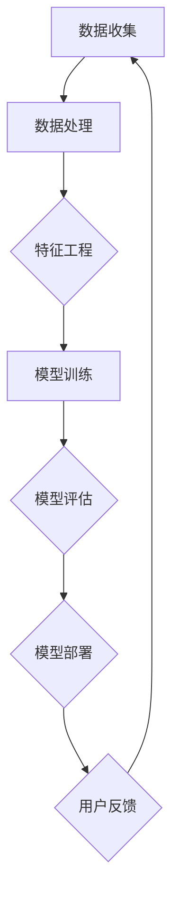

                 

# AI大模型创业：如何应对未来技术挑战？

## 关键词
- AI大模型
- 创业
- 技术挑战
- 算法优化
- 数学模型
- 实战案例
- 资源推荐

## 摘要
本文旨在探讨AI大模型创业所面临的技术挑战，包括核心算法原理、数学模型应用、实际案例解析等。通过对AI大模型的基本概念和架构的深入剖析，结合实际应用场景，提出了一系列应对策略。文章结构清晰，内容丰富，旨在为AI创业者和研究人员提供有价值的参考。

## 1. 背景介绍

### 1.1 目的和范围
本文的目标是帮助AI创业者更好地应对未来技术挑战，特别是在大模型开发和应用方面。文章将涵盖从基础概念到实际应用的全面分析，旨在为读者提供一条清晰的路径，以理解AI大模型的开发和应用，并掌握应对技术挑战的方法。

### 1.2 预期读者
本文面向的读者包括AI创业者、研究人员、软件开发工程师以及对AI技术有兴趣的读者。读者需要具备一定的编程基础和对机器学习的基本了解。

### 1.3 文档结构概述
本文将分为以下几个部分：
1. 背景介绍：介绍AI大模型创业的背景、目的和读者对象。
2. 核心概念与联系：通过Mermaid流程图展示AI大模型的核心概念和架构。
3. 核心算法原理与具体操作步骤：详细讲解大模型的主要算法和操作步骤。
4. 数学模型和公式：分析大模型的数学基础，并举例说明。
5. 项目实战：提供代码案例和详细解释。
6. 实际应用场景：探讨大模型在不同领域的应用。
7. 工具和资源推荐：推荐学习资源和开发工具。
8. 总结：展望未来发展趋势和挑战。
9. 附录：常见问题与解答。
10. 扩展阅读：提供进一步阅读的参考资料。

### 1.4 术语表

#### 1.4.1 核心术语定义
- **AI大模型**：指具有大规模参数和复杂结构的机器学习模型。
- **深度学习**：一种基于人工神经网络的机器学习技术，通过多层非线性变换来学习数据特征。
- **模型训练**：通过输入数据和算法优化模型参数的过程。
- **模型部署**：将训练好的模型部署到生产环境中，以实现具体应用。

#### 1.4.2 相关概念解释
- **卷积神经网络（CNN）**：一种适用于图像处理任务的深度学习模型。
- **循环神经网络（RNN）**：一种适用于序列数据处理任务的神经网络。
- **强化学习**：一种通过试错法学习优化策略的机器学习技术。

#### 1.4.3 缩略词列表
- **ML**：机器学习（Machine Learning）
- **DL**：深度学习（Deep Learning）
- **NLP**：自然语言处理（Natural Language Processing）
- **GAN**：生成对抗网络（Generative Adversarial Networks）

## 2. 核心概念与联系

在AI大模型创业的过程中，理解核心概念和它们之间的联系是至关重要的。以下是一个Mermaid流程图，展示了AI大模型的一些关键组成部分和它们之间的关系。



### 数据收集
数据收集是AI大模型构建的第一步，高质量的数据是模型成功的关键。数据源可以是公开数据集、企业内部数据或第三方数据。

### 数据处理
数据处理包括数据清洗、去重、归一化等步骤，以确保数据的质量和一致性。

### 特征工程
特征工程是构建AI模型的核心步骤，通过选择和变换特征，提高模型的预测性能。

### 模型训练
模型训练是利用大量数据进行迭代学习，优化模型参数。常用的训练算法包括梯度下降、随机梯度下降等。

### 模型评估
模型评估用于衡量模型的性能，常用的评估指标包括准确率、召回率、F1值等。

### 模型部署
模型部署是将训练好的模型部署到生产环境中，以实现实际应用。

### 用户反馈
用户反馈是持续优化模型的重要环节，通过收集用户反馈，进一步调整和改进模型。

## 3. 核心算法原理 & 具体操作步骤

### 3.1 深度学习算法原理

深度学习是构建AI大模型的核心技术。以下是深度学习的基本原理和算法：

#### 3.1.1 神经网络基础

神经网络是由多个神经元（或称为节点）组成的计算模型。每个神经元接收多个输入，通过加权求和后加上偏置，再经过激活函数输出。

伪代码：

```python
# 输入层
inputs = [x1, x2, ..., xn]

# 加权求和
z = w1*x1 + w2*x2 + ... + wn*xn + b

# 激活函数（以Sigmoid为例）
output = 1 / (1 + exp(-z))
```

#### 3.1.2 梯度下降算法

梯度下降是优化神经网络参数的常用算法。通过计算损失函数关于参数的梯度，并沿着梯度方向更新参数。

伪代码：

```python
# 初始化参数
w, b = initialize_parameters()

# 迭代更新参数
for epoch in range(num_epochs):
    for data in dataset:
        # 计算梯度
        gradients = compute_gradients(data, w, b)
        
        # 更新参数
        w -= learning_rate * gradients['w']
        b -= learning_rate * gradients['b']
```

### 3.2 自然语言处理算法

自然语言处理（NLP）是AI大模型在文本数据上的重要应用。以下是NLP中常用的算法：

#### 3.2.1 词嵌入

词嵌入是将文本数据转换为向量表示的方法。Word2Vec是最常见的词嵌入算法。

伪代码：

```python
# 初始化词嵌入矩阵
embedding_matrix = initialize_embedding_matrix()

# 训练词嵌入模型
model = Word2Vec(dataset, size=vector_size, window=window_size)
model.fit()

# 获取词向量
word_vector = model.wv[word]
```

#### 3.2.2 序列模型

序列模型如LSTM（长短期记忆网络）和GRU（门控循环单元）是处理序列数据的常用算法。

伪代码：

```python
# 初始化LSTM模型
model = Sequential()
model.add(LSTM(units=128, activation='relu', return_sequences=True))
model.add(LSTM(units=64, activation='relu'))

# 编译模型
model.compile(optimizer='adam', loss='binary_crossentropy', metrics=['accuracy'])

# 训练模型
model.fit(X_train, y_train, epochs=10, batch_size=32)
```

## 4. 数学模型和公式 & 详细讲解 & 举例说明

### 4.1 损失函数

损失函数是深度学习模型训练中的关键组成部分，用于衡量模型预测值与真实值之间的差异。以下是一些常见的损失函数及其数学公式：

#### 4.1.1 交叉熵损失函数

交叉熵损失函数常用于分类任务，其公式如下：

$$
L = -\sum_{i=1}^{n} y_i \log(p_i)
$$

其中，$y_i$ 是第 $i$ 个样本的真实标签，$p_i$ 是模型预测的概率。

#### 4.1.2 均方误差损失函数

均方误差损失函数常用于回归任务，其公式如下：

$$
L = \frac{1}{2n} \sum_{i=1}^{n} (y_i - \hat{y}_i)^2
$$

其中，$\hat{y}_i$ 是模型预测的值，$y_i$ 是真实值。

### 4.2 梯度下降优化算法

梯度下降优化算法是一种常用的优化方法，用于调整模型参数以最小化损失函数。以下是梯度下降的基本步骤：

#### 4.2.1 初始化参数

初始化模型参数 $w$ 和 $b$。

#### 4.2.2 计算梯度

计算损失函数关于参数 $w$ 和 $b$ 的梯度。

$$
\nabla_w L = \frac{\partial L}{\partial w}, \quad \nabla_b L = \frac{\partial L}{\partial b}
$$

#### 4.2.3 更新参数

根据梯度更新参数：

$$
w = w - \alpha \nabla_w L, \quad b = b - \alpha \nabla_b L
$$

其中，$\alpha$ 是学习率。

### 4.3 示例

假设有一个简单的线性回归模型，其目标是最小化损失函数：

$$
L = (y - \hat{y})^2
$$

其中，$\hat{y} = w \cdot x + b$。

假设当前模型参数为 $w = 2, b = 1$，学习率为 $\alpha = 0.1$。计算一次梯度下降更新后的参数。

首先，计算损失函数关于 $w$ 和 $b$ 的梯度：

$$
\nabla_w L = 2(y - \hat{y})x, \quad \nabla_b L = 2(y - \hat{y})
$$

然后，更新参数：

$$
w = w - \alpha \nabla_w L = 2 - 0.1 \cdot 2(y - (2 \cdot x + 1)) = 2 - 0.2(y - x - 1)
$$

$$
b = b - \alpha \nabla_b L = 1 - 0.1 \cdot 2(y - x - 1) = 1 - 0.2(y - x - 1)
$$

通过以上步骤，我们可以逐步优化模型参数，以最小化损失函数。

## 5. 项目实战：代码实际案例和详细解释说明

### 5.1 开发环境搭建

在进行AI大模型项目实战之前，我们需要搭建一个合适的开发环境。以下是所需的步骤和工具：

#### 5.1.1 硬件环境

- CPU/GPU：推荐使用高性能CPU或GPU，例如NVIDIA Titan Xp或以上的GPU。
- 内存：至少16GB内存。

#### 5.1.2 软件环境

- 操作系统：Linux（推荐Ubuntu 18.04或以上版本）。
- 编程语言：Python（推荐3.7或以上版本）。
- 深度学习框架：TensorFlow或PyTorch（任选其一）。

#### 5.1.3 安装深度学习框架

以下是安装TensorFlow的步骤：

```bash
# 安装依赖库
pip install numpy tensorflow

# 验证安装
python -c "import tensorflow as tf; print(tf.__version__)"
```

### 5.2 源代码详细实现和代码解读

#### 5.2.1 数据预处理

```python
import tensorflow as tf
from tensorflow.keras.preprocessing.sequence import pad_sequences

# 加载和处理数据
def load_and_preprocess_data(file_path, max_length, max_words):
    # 加载数据
    sentences, labels = load_data(file_path)
    
    # 序列化数据
    sequences = tokenizer.texts_to_sequences(sentences)
    
    # 填充序列
    padded_sequences = pad_sequences(sequences, maxlen=max_length, padding='post')
    
    return padded_sequences, labels

# 代码解释
# load_data 是一个自定义函数，用于加载数据集。
# tokenizer 是一个用于序列化文本数据的工具类。
# texts_to_sequences 将文本序列化为整数序列。
# pad_sequences 将整数序列填充为同一长度。
```

#### 5.2.2 构建模型

```python
from tensorflow.keras.models import Sequential
from tensorflow.keras.layers import Embedding, LSTM, Dense

# 构建模型
model = Sequential()
model.add(Embedding(input_dim=max_words, output_dim=50, input_length=max_length))
model.add(LSTM(units=128, return_sequences=True))
model.add(LSTM(units=64))
model.add(Dense(units=1, activation='sigmoid'))

# 编译模型
model.compile(optimizer='adam', loss='binary_crossentropy', metrics=['accuracy'])

# 代码解释
# Sequential 是一个线性堆叠模型层类的容器。
# Embedding 用于将词嵌入转换为向量表示。
# LSTM 用于处理序列数据。
# Dense 用于全连接层，输出最终的分类结果。
```

#### 5.2.3 训练模型

```python
# 训练模型
model.fit(x_train, y_train, epochs=10, batch_size=64)

# 代码解释
# fit 是用于训练模型的方法。
# x_train 和 y_train 分别是训练数据和标签。
# epochs 是训练轮数。
# batch_size 是每次训练的样本数。
```

#### 5.2.4 评估模型

```python
# 评估模型
loss, accuracy = model.evaluate(x_test, y_test)

print(f"Test Loss: {loss}, Test Accuracy: {accuracy}")

# 代码解释
# evaluate 是用于评估模型性能的方法。
# x_test 和 y_test 分别是测试数据和标签。
# loss 和 accuracy 分别是模型在测试数据上的损失和准确率。
```

### 5.3 代码解读与分析

在上述代码中，我们首先对数据进行预处理，包括加载数据、序列化和填充。然后，我们使用Sequential模型构建了一个包含嵌入层、两个LSTM层和全连接层的模型。模型使用adam优化器和binary_crossentropy损失函数进行编译。接着，我们使用fit方法对模型进行训练，并在训练完成后使用evaluate方法对模型进行评估。

通过这个实战案例，我们了解了AI大模型项目开发的基本步骤和关键代码，包括数据预处理、模型构建、训练和评估。

## 6. 实际应用场景

AI大模型在不同领域有着广泛的应用，以下是一些实际应用场景：

### 6.1 自然语言处理（NLP）

- **文本分类**：使用AI大模型对新闻、社交媒体帖子等进行分类，帮助企业进行内容审核和推荐。
- **情感分析**：通过分析用户评论和反馈，帮助企业了解用户情感和需求，优化产品和服务。
- **机器翻译**：利用AI大模型实现高质量、准确度高的机器翻译。

### 6.2 计算机视觉

- **图像识别**：AI大模型可以用于对图像进行分类和识别，例如人脸识别、物体检测等。
- **图像生成**：利用生成对抗网络（GAN）生成逼真的图像和视频，应用于游戏开发、广告制作等领域。

### 6.3 医疗健康

- **疾病预测**：AI大模型可以分析大量医疗数据，预测疾病风险，帮助医生进行早期诊断和治疗。
- **药物研发**：利用AI大模型进行药物分子的设计、筛选和优化，加速药物研发过程。

### 6.4 金融领域

- **风险控制**：AI大模型可以分析金融市场数据，预测市场走势，帮助企业进行风险控制。
- **客户服务**：通过自然语言处理技术，AI大模型可以自动回答客户提问，提供个性化的金融服务。

## 7. 工具和资源推荐

### 7.1 学习资源推荐

#### 7.1.1 书籍推荐

- 《深度学习》（Goodfellow, Bengio, Courville著）
- 《Python机器学习》（Sebastian Raschka著）
- 《自然语言处理实战》（Steven Bird著）

#### 7.1.2 在线课程

- Coursera上的《深度学习》课程（由吴恩达教授讲授）
- Udacity的《机器学习工程师纳米学位》课程
- edX上的《自然语言处理》课程

#### 7.1.3 技术博客和网站

- Medium上的机器学习和深度学习专题
- AI Challenger和LeetCode等算法竞赛平台
- arXiv.org上的最新研究论文和进展

### 7.2 开发工具框架推荐

#### 7.2.1 IDE和编辑器

- PyCharm：功能强大的Python IDE，支持多种编程语言。
- Jupyter Notebook：适用于数据科学和机器学习的交互式计算环境。
- VSCode：轻量级但功能强大的代码编辑器，支持多种编程语言。

#### 7.2.2 调试和性能分析工具

- TensorFlow Profiler：用于分析TensorFlow模型的性能和资源使用情况。
- PyTorch TensorBoard：提供可视化的性能分析工具。
- Nsight Compute：用于NVIDIA GPU性能分析和调试。

#### 7.2.3 相关框架和库

- TensorFlow：由Google开发的深度学习框架，支持多种任务和应用。
- PyTorch：由Facebook开发的深度学习框架，具有灵活性和动态性。
- Keras：用于快速构建和实验深度学习模型的Python库。

### 7.3 相关论文著作推荐

#### 7.3.1 经典论文

- 《A Theoretical Investigation of the Basis of the Generalization of Neural Network and the Effect of Dropout》（2015）
- 《Understanding Deep Learning requires re-thinking generalization》（2018）
- 《Bengio et al.'s "Understanding Neural Networks through the Lens of Optimization" Review》（2019）

#### 7.3.2 最新研究成果

- 《Deep Learning and Transfer Learning for Medical Image Analysis》（2021）
- 《On the Robustness of Neural Networks to Adversarial Examples》（2020）
- 《Revisiting the Role of Dropout in Deep Learning》（2020）

#### 7.3.3 应用案例分析

- 《AI in Healthcare: Transforming Patient Care》（2020）
- 《The Future of Autonomous Driving: Insights from Industry Leaders》（2021）
- 《Deep Learning for Cybersecurity: A Review》（2021）

## 8. 总结：未来发展趋势与挑战

AI大模型在各个领域都有着巨大的潜力和应用价值。然而，随着模型的规模和复杂性不断增加，创业者和研究者在面对未来技术挑战时需要充分考虑以下几个方面：

1. **计算资源**：随着模型规模的扩大，对计算资源的需求也在增加。如何有效地利用GPU、TPU等高性能计算资源，成为创业团队需要考虑的重要问题。

2. **数据质量**：高质量的数据是AI大模型成功的关键。创业者需要确保数据来源的多样性和准确性，同时需要处理数据不平衡、噪声和缺失等问题。

3. **模型优化**：随着深度学习模型规模的扩大，训练时间和资源消耗也在增加。如何优化算法，提高模型训练效率，是创业团队需要关注的问题。

4. **隐私保护**：在应用AI大模型时，保护用户隐私和数据安全至关重要。创业者需要采用加密、差分隐私等技术，确保用户数据的安全和隐私。

5. **可解释性**：随着AI大模型的复杂度增加，模型的可解释性变得越来越重要。如何提高模型的可解释性，帮助用户理解和信任模型，是创业团队需要解决的问题。

6. **伦理和社会影响**：AI大模型的应用可能会带来一系列伦理和社会影响，如算法偏见、就业替代等。创业者需要关注这些问题，确保其应用符合伦理和社会规范。

## 9. 附录：常见问题与解答

### 9.1 Q：AI大模型训练需要多长时间？

A：AI大模型的训练时间取决于多个因素，包括模型规模、数据集大小、硬件配置等。一般来说，大规模模型（如GPT-3）的训练可能需要数天到数周的时间。对于中小规模的模型，训练时间可能在几小时到几天之间。

### 9.2 Q：如何提高AI大模型的性能？

A：提高AI大模型性能的方法包括：
- **数据增强**：通过数据扩充和增强，增加模型的泛化能力。
- **模型优化**：采用更高效的算法和架构，如混合精度训练、模型剪枝等。
- **超参数调整**：通过调整学习率、批量大小等超参数，优化模型性能。
- **多模型融合**：将多个模型的结果进行融合，提高整体性能。

### 9.3 Q：如何确保AI大模型的安全性？

A：确保AI大模型的安全性需要从以下几个方面考虑：
- **数据加密**：对输入数据和模型参数进行加密，防止数据泄露。
- **隐私保护**：采用差分隐私等技术，保护用户隐私。
- **安全审计**：对模型进行定期的安全审计，检测潜在的安全漏洞。
- **访问控制**：限制对模型的访问权限，防止未授权访问。

## 10. 扩展阅读 & 参考资料

- 《Deep Learning》（Goodfellow, Bengio, Courville著）
- 《Python机器学习》（Sebastian Raschka著）
- 《自然语言处理实战》（Steven Bird著）
- [TensorFlow官网](https://www.tensorflow.org/)
- [PyTorch官网](https://pytorch.org/)
- [Keras官网](https://keras.io/)
- [AI Challenger](https://www.aichallenger.com/)
- [LeetCode](https://leetcode.com/)
- [arXiv.org](https://arxiv.org/)

