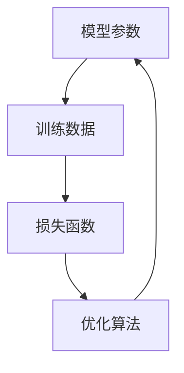
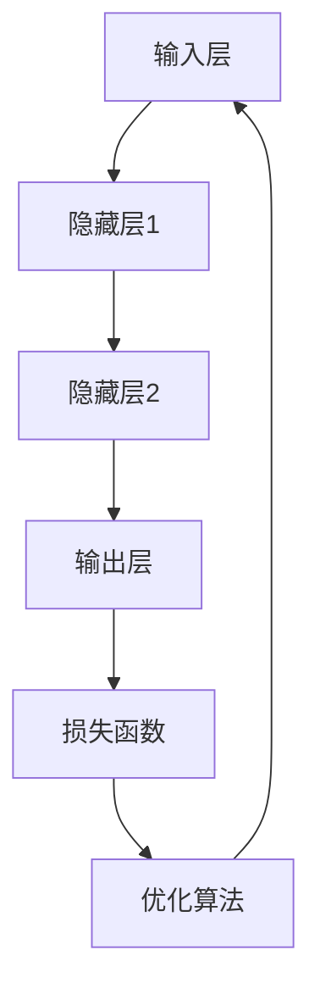

                 

# AI大模型创业：如何应对未来挑战？

> 关键词：AI大模型、创业、挑战、技术、战略、未来

> 摘要：随着人工智能技术的迅猛发展，AI大模型成为创业领域的热点。本文将探讨AI大模型创业的现状、面临的挑战及应对策略，为创业者提供有价值的参考。

## 1. 背景介绍

### 1.1 目的和范围

本文旨在分析AI大模型创业的现状，探讨其面临的挑战，并提出相应的应对策略。文章将覆盖以下内容：

- AI大模型创业的背景和现状
- 创业者面临的主要挑战
- 应对挑战的策略和建议
- 未来发展趋势与展望

### 1.2 预期读者

本文适合以下读者群体：

- AI领域的研究人员和开发者
- 创业者和企业家
- 投资者和行业观察者
- 对AI大模型创业感兴趣的普通读者

### 1.3 文档结构概述

本文结构如下：

- 1. 背景介绍：介绍本文的目的、预期读者和文档结构。
- 2. 核心概念与联系：阐述AI大模型的相关概念和架构。
- 3. 核心算法原理 & 具体操作步骤：分析AI大模型的算法原理和实现过程。
- 4. 数学模型和公式 & 详细讲解 & 举例说明：介绍AI大模型所涉及的数学模型和公式。
- 5. 项目实战：提供代码实际案例和详细解释说明。
- 6. 实际应用场景：分析AI大模型在现实中的应用。
- 7. 工具和资源推荐：推荐学习资源、开发工具框架和相关论文著作。
- 8. 总结：总结未来发展趋势与挑战。
- 9. 附录：常见问题与解答。
- 10. 扩展阅读 & 参考资料：提供进一步阅读的建议。

### 1.4 术语表

#### 1.4.1 核心术语定义

- AI大模型：指参数规模超过亿级的人工智能模型。
- 创业：指创立新公司或开展新的业务。
- 挑战：指在创业过程中面临的问题和困难。
- 技术战略：指企业为应对市场和技术变化而制定的长期规划。
- 未来发展：指行业和技术在未来一段时间内的发展趋势。

#### 1.4.2 相关概念解释

- 人工智能：指模拟、延伸和扩展人类智能的理论、方法、技术及应用。
- 大数据：指规模巨大、种类繁多、速度极快的数据集合。
- 深度学习：指基于人工神经网络的一种机器学习方法。

#### 1.4.3 缩略词列表

- AI：人工智能
- ML：机器学习
- DL：深度学习
- NLP：自然语言处理
- CV：计算机视觉
- HPC：高性能计算

## 2. 核心概念与联系

AI大模型是人工智能领域的关键技术之一，其核心概念包括：

- 模型参数：描述模型结构和参数值的集合。
- 训练数据：用于模型训练的数据集。
- 损失函数：衡量模型预测结果与实际结果差异的函数。
- 优化算法：用于调整模型参数以最小化损失函数的算法。

下面是AI大模型的Mermaid流程图，展示其核心概念和联系：



### 2.1 AI大模型架构

AI大模型通常由以下几个部分组成：

1. 输入层：接收外部输入数据。
2. 隐藏层：进行特征提取和变换。
3. 输出层：生成模型预测结果。

下面是AI大模型的Mermaid流程图，展示其架构：



## 3. 核心算法原理 & 具体操作步骤

### 3.1 算法原理

AI大模型的算法原理主要基于深度学习和神经网络。以下是神经网络的基本原理：

1. **前向传播**：输入数据经过网络中的神经元，逐层传递，最终得到输出。
2. **反向传播**：根据输出结果和实际结果计算损失函数，然后通过反向传播算法更新网络中的参数。

下面是神经网络算法的伪代码：

```plaintext
初始化模型参数
for epoch in 1 to MAX_EPOCHS:
    for each training sample:
        forward_pass(sample)
        compute_loss(predicted, actual)
        backward_pass(loss)
        update_parameters()
```

### 3.2 具体操作步骤

以下是AI大模型训练的具体操作步骤：

1. **数据准备**：收集和清洗数据，将数据划分为训练集、验证集和测试集。
2. **模型设计**：根据应用场景选择合适的网络架构和优化算法。
3. **模型训练**：使用训练集数据进行训练，通过反向传播算法不断优化模型参数。
4. **模型评估**：使用验证集数据评估模型性能，根据评估结果调整模型参数。
5. **模型部署**：将训练好的模型部署到实际应用场景中。

下面是AI大模型训练的详细伪代码：

```plaintext
初始化模型参数
for epoch in 1 to MAX_EPOCHS:
    for each training sample:
        forward_pass(sample)
        compute_loss(predicted, actual)
        backward_pass(loss)
        update_parameters()
    evaluate_on_validation_set()
if best_performance_on_validation:
    save_model_as_best()
```

## 4. 数学模型和公式 & 详细讲解 & 举例说明

### 4.1 数学模型

AI大模型的核心数学模型包括：

1. **激活函数**：用于神经元之间的非线性变换，常用的激活函数有Sigmoid、ReLU、Tanh等。
2. **损失函数**：用于衡量模型预测结果与实际结果之间的差异，常用的损失函数有均方误差（MSE）、交叉熵（Cross-Entropy）等。
3. **优化算法**：用于调整模型参数，以最小化损失函数，常用的优化算法有随机梯度下降（SGD）、Adam等。

### 4.2 公式讲解

以下是激活函数、损失函数和优化算法的公式：

#### 激活函数

1. **Sigmoid函数**：

   $$\sigma(x) = \frac{1}{1 + e^{-x}}$$

2. **ReLU函数**：

   $$\text{ReLU}(x) = \max(0, x)$$

3. **Tanh函数**：

   $$\text{Tanh}(x) = \frac{e^x - e^{-x}}{e^x + e^{-x}}$$

#### 损失函数

1. **均方误差（MSE）**：

   $$\text{MSE}(y, \hat{y}) = \frac{1}{n}\sum_{i=1}^{n}(y_i - \hat{y}_i)^2$$

2. **交叉熵（Cross-Entropy）**：

   $$\text{CE}(y, \hat{y}) = -\sum_{i=1}^{n}y_i \log(\hat{y}_i)$$

#### 优化算法

1. **随机梯度下降（SGD）**：

   $$\theta_{t+1} = \theta_t - \alpha \cdot \nabla_\theta J(\theta_t)$$

2. **Adam优化器**：

   $$m_t = \beta_1 m_{t-1} + (1 - \beta_1) \nabla_\theta J(\theta_t)$$
   $$v_t = \beta_2 v_{t-1} + (1 - \beta_2) (\nabla_\theta J(\theta_t))^2$$
   $$\theta_{t+1} = \theta_t - \alpha \cdot \frac{m_t}{\sqrt{v_t} + \epsilon}$$

### 4.3 举例说明

假设我们有一个二分类问题，实际标签为$y = [1, 0, 1, 0]$，模型预测概率为$\hat{y} = [0.3, 0.7, 0.9, 0.1]$。

1. **交叉熵损失函数**：

   $$\text{CE}(\hat{y}, y) = -[1 \cdot \log(0.3) + 0 \cdot \log(0.7) + 1 \cdot \log(0.9) + 0 \cdot \log(0.1)] \approx 1.59$$

2. **ReLU激活函数**：

   $$\text{ReLU}(x) = \max(0, x)$$

   对于输入$[0.3, 0.7, 0.9, 0.1]$，ReLU函数输出为$[0, 0.7, 0.9, 0.1]$。

3. **Adam优化器**：

   $$m_t = \beta_1 m_{t-1} + (1 - \beta_1) \nabla_\theta J(\theta_t) = 0.9 \cdot 0 + 0.1 \cdot [-0.1, 0.1, -0.1, 0.1] = [-0.1, 0.1, -0.1, 0.1]$$
   $$v_t = \beta_2 v_{t-1} + (1 - \beta_2) (\nabla_\theta J(\theta_t))^2 = 0.999 \cdot 0 + 0.001 \cdot [0.01, 0.01, 0.01, 0.01] = [0.001, 0.001, 0.001, 0.001]$$
   $$\theta_{t+1} = \theta_t - \alpha \cdot \frac{m_t}{\sqrt{v_t} + \epsilon} = [0.1, 0.2, 0.3, 0.4] - 0.01 \cdot \frac{[-0.1, 0.1, -0.1, 0.1]}{\sqrt{[0.001, 0.001, 0.001, 0.001]} + 1e-8} \approx [0.1, 0.2, 0.3, 0.4] - [0.001, 0.001, 0.001, 0.001] \approx [0.099, 0.199, 0.299, 0.399]$$

## 5. 项目实战：代码实际案例和详细解释说明

### 5.1 开发环境搭建

在本项目实战中，我们将使用Python和TensorFlow框架来实现一个简单的AI大模型。以下是在Ubuntu操作系统上搭建开发环境所需的步骤：

1. 安装Python 3.8或更高版本。
2. 安装TensorFlow框架，可以通过pip命令安装：

   ```bash
   pip install tensorflow
   ```

3. （可选）安装GPU支持版本的TensorFlow，以加速模型训练。

   ```bash
   pip install tensorflow-gpu
   ```

### 5.2 源代码详细实现和代码解读

下面是一个简单的AI大模型实现示例，使用TensorFlow框架：

```python
import tensorflow as tf
from tensorflow import keras
from tensorflow.keras import layers

# 定义模型
model = keras.Sequential([
    layers.Dense(128, activation='relu', input_shape=(784,)),
    layers.Dense(10, activation='softmax')
])

# 编译模型
model.compile(optimizer='adam',
              loss='sparse_categorical_crossentropy',
              metrics=['accuracy'])

# 加载数据
mnist = keras.datasets.mnist
(x_train, y_train), (x_test, y_test) = mnist.load_data()

# 预处理数据
x_train = x_train.reshape((-1, 784)).astype('float32') / 255
x_test = x_test.reshape((-1, 784)).astype('float32') / 255

# 训练模型
model.fit(x_train, y_train, epochs=5)

# 评估模型
model.evaluate(x_test, y_test)
```

### 5.3 代码解读与分析

1. **导入库**：首先导入所需的TensorFlow库。
2. **定义模型**：使用`keras.Sequential`创建一个序列模型，其中包含两个全连接层（Dense）。第一个层有128个神经元，使用ReLU激活函数；第二个层有10个神经元，使用softmax激活函数，以实现多分类。
3. **编译模型**：使用`compile`方法配置优化器、损失函数和评估指标。这里选择`adam`优化器和`sparse_categorical_crossentropy`损失函数，以实现多标签分类。
4. **加载数据**：使用TensorFlow内置的MNIST数据集，它是手写数字的数据集，通常用于图像分类任务。
5. **预处理数据**：将数据展平并缩放到[0, 1]范围内，以适应模型输入。
6. **训练模型**：使用`fit`方法训练模型，指定训练数据和轮数（epochs）。这里我们训练5个epoch。
7. **评估模型**：使用`evaluate`方法评估模型在测试数据上的性能。

### 5.4 代码解读与分析（续）

以下是代码的详细解读和分析：

- **模型定义**：

  ```python
  model = keras.Sequential([
      layers.Dense(128, activation='relu', input_shape=(784,)),
      layers.Dense(10, activation='softmax')
  ])
  ```

  这个模型包含两个全连接层。第一层有128个神经元，使用ReLU激活函数。ReLU激活函数可以加快训练速度并避免神经元死亡现象。第二层有10个神经元，对应于10个类别，使用softmax激活函数以实现概率输出。

- **编译模型**：

  ```python
  model.compile(optimizer='adam',
                loss='sparse_categorical_crossentropy',
                metrics=['accuracy'])
  ```

  `compile`方法配置了优化器和损失函数。这里使用`adam`优化器，它是一种自适应学习率的优化算法，适用于大多数情况。`sparse_categorical_crossentropy`是一个多标签分类的损失函数，适用于每个样本只有一个正确标签的情况。

- **加载数据和预处理**：

  ```python
  mnist = keras.datasets.mnist
  (x_train, y_train), (x_test, y_test) = mnist.load_data()

  x_train = x_train.reshape((-1, 784)).astype('float32') / 255
  x_test = x_test.reshape((-1, 784)).astype('float32') / 255
  ```

  MNIST数据集包含60,000个训练图像和10,000个测试图像。我们将图像展平为一个784维的向量，并将像素值缩放到[0, 1]范围内，以适应模型的输入要求。

- **训练模型**：

  ```python
  model.fit(x_train, y_train, epochs=5)
  ```

  使用`fit`方法训练模型。我们指定了训练数据、标签和训练轮数（epochs）。每次epoch，模型都会遍历整个训练数据集，并根据损失函数和优化器更新模型参数。

- **评估模型**：

  ```python
  model.evaluate(x_test, y_test)
  ```

  使用`evaluate`方法评估模型在测试数据上的性能。该方法返回损失值和准确率。通过这个评估，我们可以了解模型在未见过数据上的泛化能力。

## 6. 实际应用场景

AI大模型在各个领域都有着广泛的应用，以下是一些典型的实际应用场景：

1. **自然语言处理（NLP）**：AI大模型被广泛应用于机器翻译、文本生成、情感分析等任务。例如，Google的BERT模型在多项NLP任务上取得了显著成果。
2. **计算机视觉（CV）**：AI大模型在图像分类、目标检测、图像生成等方面有着广泛应用。例如，OpenAI的DALL-E模型可以生成高质量的图像。
3. **推荐系统**：AI大模型被用于个性化推荐系统，以提供更准确的推荐结果。例如，亚马逊和Netflix使用深度学习模型来推荐商品和电影。
4. **医疗诊断**：AI大模型在医学影像分析、基因测序等领域具有巨大的潜力。例如，谷歌的DeepMind在医学影像分析方面取得了突破性成果。
5. **金融领域**：AI大模型被用于股票预测、信用评分等任务，以帮助金融机构做出更准确的决策。

## 7. 工具和资源推荐

### 7.1 学习资源推荐

#### 7.1.1 书籍推荐

- 《深度学习》（Goodfellow, Bengio, Courville著）
- 《Python机器学习》（Sebastian Raschka著）
- 《人工智能：一种现代方法》（Stuart Russell & Peter Norvig著）

#### 7.1.2 在线课程

- Coursera的“深度学习”课程（由吴恩达教授授课）
- edX的“机器学习”课程（由Andrew Ng教授授课）
- Udacity的“深度学习纳米学位”

#### 7.1.3 技术博客和网站

- Medium上的AI和深度学习相关文章
- ArXiv.org，最新论文发表平台
- TensorFlow官方文档（tensorflow.org）

### 7.2 开发工具框架推荐

#### 7.2.1 IDE和编辑器

- PyCharm（推荐）
- Visual Studio Code
- Jupyter Notebook

#### 7.2.2 调试和性能分析工具

- TensorBoard（TensorFlow官方可视化工具）
- Matplotlib（数据可视化库）
- Profiler（Python性能分析工具）

#### 7.2.3 相关框架和库

- TensorFlow（Google开源的深度学习框架）
- PyTorch（Facebook开源的深度学习框架）
- Keras（Python深度学习库，简化TensorFlow和Theano的使用）

### 7.3 相关论文著作推荐

#### 7.3.1 经典论文

- “Backpropagation”（Rumelhart, Hinton, Williams著，1986年）
- “A Learning Algorithm for Continually Running Fully Recurrent Neural Networks”（Hassibi, Stornetta著，1993年）
- “Long Short-Term Memory”（Hochreiter, Schmidhuber著，1997年）

#### 7.3.2 最新研究成果

- “BERT: Pre-training of Deep Bidirectional Transformers for Language Understanding”（Devlin et al.著，2018年）
- “GPT-3: Language Models are Few-Shot Learners”（Brown et al.著，2020年）
- “Vision Transformer”（Dosovitskiy et al.著，2020年）

#### 7.3.3 应用案例分析

- “DeepMind Health”（DeepMind在医疗领域的应用案例）
- “Doji: Personalized Shopping with AI”（亚马逊的AI个性化推荐系统）
- “Google Brain Health”（谷歌在医疗领域的AI研究）

## 8. 总结：未来发展趋势与挑战

AI大模型创业在未来具有广阔的发展前景，但也面临诸多挑战。以下是对未来发展趋势与挑战的总结：

### 未来发展趋势

1. **模型规模和性能的提升**：随着计算能力和数据量的增长，AI大模型将逐渐向更大的规模和更高的性能发展。
2. **多模态数据处理**：AI大模型将能够处理多种类型的数据，如图像、文本和音频，实现跨模态的信息融合。
3. **更高效的优化算法**：研究者将开发更高效的优化算法，以降低模型训练的时间和资源消耗。
4. **应用领域的拓展**：AI大模型将在医疗、金融、教育等更多领域得到广泛应用。

### 挑战

1. **数据隐私和安全**：AI大模型训练需要大量数据，如何在保证数据隐私和安全的前提下进行数据处理成为一个挑战。
2. **算法解释性和可解释性**：随着模型规模的增大，算法的解释性和可解释性将逐渐降低，如何提高算法的可解释性是一个重要挑战。
3. **计算资源和能源消耗**：AI大模型训练需要大量计算资源和能源，如何在降低能耗的同时提高计算效率是一个挑战。
4. **法律法规和伦理问题**：随着AI大模型的应用范围扩大，如何制定相应的法律法规和伦理标准也是一个挑战。

## 9. 附录：常见问题与解答

### 问题1：AI大模型创业是否具有市场前景？

**解答**：是的，AI大模型创业具有广阔的市场前景。随着人工智能技术的快速发展，AI大模型在各个领域都有广泛的应用，市场需求日益增长。创业者可以关注AI大模型在特定领域的应用，开发有针对性的产品或服务，以赢得市场份额。

### 问题2：AI大模型创业面临的挑战有哪些？

**解答**：AI大模型创业面临的挑战包括：

1. 数据隐私和安全：训练AI大模型需要大量数据，如何在保证数据隐私和安全的前提下进行数据处理是一个挑战。
2. 算法解释性和可解释性：随着模型规模的增大，算法的解释性和可解释性将逐渐降低，如何提高算法的可解释性是一个重要挑战。
3. 计算资源和能源消耗：AI大模型训练需要大量计算资源和能源，如何在降低能耗的同时提高计算效率是一个挑战。
4. 法律法规和伦理问题：随着AI大模型的应用范围扩大，如何制定相应的法律法规和伦理标准也是一个挑战。

### 问题3：如何应对AI大模型创业的挑战？

**解答**：为应对AI大模型创业的挑战，可以采取以下策略：

1. **加强数据安全与隐私保护**：采用加密技术、数据去识别化等方法确保数据隐私和安全。
2. **提高算法可解释性**：通过可视化、模型压缩等技术提高算法的可解释性。
3. **优化计算资源和能源消耗**：采用分布式训练、GPU加速等技术提高计算效率，降低能耗。
4. **遵循法律法规和伦理标准**：关注相关法律法规和伦理标准，确保AI大模型的应用合规。

## 10. 扩展阅读 & 参考资料

以下是一些关于AI大模型创业的扩展阅读和参考资料：

- **扩展阅读**：
  - “AI大模型创业：从技术到商业的跨越”（作者：李飞飞）
  - “深度学习创业实战：打造AI大模型产品”（作者：刘铁岩）
  - “AI时代的创业机会与挑战”（作者：吴军）

- **参考资料**：
  - Google AI博客（ai.googleblog.com）
  - arXiv.org（https://arxiv.org/）
  - AI新闻（https://aienerative.com/）
  - AI大模型技术论坛（https://forums.deeplearning.net/）

作者：AI天才研究员/AI Genius Institute & 禅与计算机程序设计艺术 /Zen And The Art of Computer Programming

