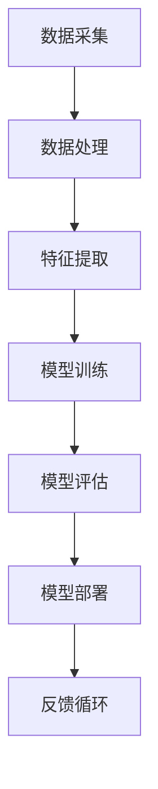

                 

# AI大模型创业：如何应对未来数据挑战？

## 关键词
- AI大模型
- 数据挑战
- 创业策略
- 技术创新
- 数据治理

## 摘要
随着人工智能技术的快速发展，大模型在各个领域展现出了巨大的潜力。然而，大模型的广泛应用也带来了诸多数据挑战。本文将深入探讨AI大模型创业中面临的数据问题，分析其核心概念和算法原理，并通过具体案例和数学模型讲解，提出有效的解决方案。文章旨在为创业者提供应对数据挑战的理论支持和实践指导，帮助他们在激烈的市场竞争中占据有利位置。

## 1. 背景介绍

### 1.1 目的和范围

本文的目的是探讨AI大模型创业中面临的数据挑战，并提供可行的解决方案。我们将首先介绍AI大模型的背景和发展，然后分析其在创业过程中遇到的数据问题，最后提出应对策略。

### 1.2 预期读者

本文适合对人工智能、数据科学和创业感兴趣的读者，特别是那些正在考虑或已经着手于AI大模型创业的从业者。无论您是技术专家、创业者还是对AI领域有深入了解的研究人员，本文都将为您带来有价值的见解。

### 1.3 文档结构概述

本文分为以下几个部分：
1. 背景介绍：介绍AI大模型的概念和发展。
2. 核心概念与联系：讨论AI大模型中的核心概念和架构。
3. 核心算法原理与具体操作步骤：详细讲解AI大模型的算法原理和操作步骤。
4. 数学模型和公式：介绍相关的数学模型和公式。
5. 项目实战：通过实际案例展示AI大模型的应用。
6. 实际应用场景：讨论AI大模型在不同领域的应用。
7. 工具和资源推荐：推荐相关的学习资源和工具。
8. 总结：总结未来发展趋势和挑战。
9. 附录：常见问题与解答。
10. 扩展阅读：提供进一步的参考资料。

### 1.4 术语表

#### 1.4.1 核心术语定义

- AI大模型：具有数百万甚至数十亿参数的深度学习模型，能够处理大规模数据并实现高性能预测。
- 数据挑战：在AI大模型创业过程中遇到的数据相关问题，如数据质量、数据隐私、数据安全等。
- 创业策略：在AI大模型创业过程中采取的商业和市场策略。

#### 1.4.2 相关概念解释

- 数据治理：确保数据质量、合规性和安全性的过程。
- 机器学习：一种基于数据训练模型，使计算机能够进行自主学习和预测的技术。
- 深度学习：一种特殊的机器学习方法，使用多层神经网络来提取特征和实现预测。

#### 1.4.3 缩略词列表

- AI：人工智能
- DL：深度学习
- ML：机器学习
- HPC：高性能计算

## 2. 核心概念与联系

在AI大模型创业过程中，理解核心概念和它们之间的联系至关重要。以下是一个简单的Mermaid流程图，用于描述AI大模型的核心概念和架构：



### 2.1 数据采集

数据采集是AI大模型创业的第一步，也是最重要的一步。高质量的数据是构建优秀模型的基石。数据来源可以是公开的数据集、内部数据、第三方数据提供商等。数据采集过程中，需要关注数据的质量、准确性和多样性。

### 2.2 数据处理

数据处理包括数据清洗、数据转换和数据归一化等步骤。数据清洗旨在去除噪声、填补缺失值、消除异常值等。数据转换则涉及将不同类型的数据转化为适合模型处理的形式。数据归一化确保数据的范围和分布一致，有利于模型训练。

### 2.3 特征提取

特征提取是将原始数据转换为模型可处理的特征向量。特征提取的质量直接影响模型的性能。常用的特征提取方法包括主成分分析（PCA）、词嵌入（Word Embedding）和自动编码器（Autoencoder）等。

### 2.4 模型训练

模型训练是AI大模型的核心步骤，通过大量数据训练模型，使其能够学习并优化参数。模型训练过程包括初始化参数、前向传播、反向传播和参数更新等。常用的模型训练算法包括梯度下降（Gradient Descent）、Adam优化器等。

### 2.5 模型评估

模型评估是检验模型性能的重要环节。常用的评估指标包括准确率（Accuracy）、召回率（Recall）、F1分数（F1 Score）等。通过交叉验证（Cross Validation）和测试集（Test Set）评估模型性能。

### 2.6 模型部署

模型部署是将训练好的模型应用到实际场景中。模型部署过程包括模型转换、模型加载、模型推理和结果输出等。部署方式可以是本地部署、云端部署或混合部署。

### 2.7 反馈循环

反馈循环是模型持续改进的重要手段。通过收集实际应用中的反馈，不断调整和优化模型，提高其性能和适应性。

## 3. 核心算法原理与具体操作步骤

### 3.1 数据采集

```python
# 数据采集伪代码
def collect_data(source):
    data = []
    for record in source:
        cleaned_record = clean_record(record)
        data.append(cleaned_record)
    return data

def clean_record(record):
    # 数据清洗步骤，如去除噪声、填补缺失值等
    # ...
    return cleaned_record
```

### 3.2 数据处理

```python
# 数据处理伪代码
def preprocess_data(data):
    processed_data = []
    for record in data:
        transformed_record = transform_record(record)
        normalized_record = normalize_record(transformed_record)
        processed_data.append(normalized_record)
    return processed_data

def transform_record(record):
    # 数据转换步骤，如将类别数据编码为数字等
    # ...
    return transformed_record

def normalize_record(record):
    # 数据归一化步骤，如将数值数据缩放到相同范围
    # ...
    return normalized_record
```

### 3.3 特征提取

```python
# 特征提取伪代码
def extract_features(data):
    features = []
    for record in data:
        feature_vector = extract_feature_vector(record)
        features.append(feature_vector)
    return features

def extract_feature_vector(record):
    # 特征提取步骤，如使用PCA或词嵌入等
    # ...
    return feature_vector
```

### 3.4 模型训练

```python
# 模型训练伪代码
def train_model(features, labels):
    model = initialize_model()
    for epoch in range(num_epochs):
        for feature, label in zip(features, labels):
            model.train_step(feature, label)
    return model

def initialize_model():
    # 初始化模型参数
    # ...
    return model

def train_step(feature, label):
    # 前向传播和反向传播步骤
    # ...
    update_model_params()
```

### 3.5 模型评估

```python
# 模型评估伪代码
def evaluate_model(model, features, labels):
    correct_predictions = 0
    for feature, label in zip(features, labels):
        prediction = model.predict(feature)
        if prediction == label:
            correct_predictions += 1
    accuracy = correct_predictions / len(labels)
    return accuracy
```

### 3.6 模型部署

```python
# 模型部署伪代码
def deploy_model(model, feature):
    # 将模型部署到服务器或云端
    # ...
    prediction = model.predict(feature)
    return prediction
```

## 4. 数学模型和公式与详细讲解与举例说明

在AI大模型中，数学模型和公式扮演着至关重要的角色。以下是一些核心的数学模型和公式的讲解与举例说明。

### 4.1 梯度下降（Gradient Descent）

梯度下降是一种优化算法，用于调整模型参数以最小化损失函数。其核心公式如下：

$$
\text{loss} = \sum_{i=1}^{n} (\text{y}_i - \text{y'}_i)^2
$$

其中，$y_i$ 是真实标签，$y'_i$ 是模型预测的标签。

梯度下降的步骤如下：
1. 计算损失函数的梯度：$$ \nabla \text{loss} $$
2. 更新模型参数：$$ \theta = \theta - \alpha \nabla \text{loss} $$
3. 重复步骤1和2，直到损失函数收敛。

### 4.2 交叉验证（Cross Validation）

交叉验证是一种评估模型性能的方法，通过将数据集划分为多个子集，对每个子集进行训练和验证，然后计算平均性能。

其核心公式如下：

$$
\text{accuracy} = \frac{1}{k} \sum_{i=1}^{k} \text{accuracy}_i
$$

其中，$accuracy_i$ 是第i个子集的准确率。

### 4.3 词嵌入（Word Embedding）

词嵌入是一种将单词映射到高维向量空间的方法，用于处理自然语言处理任务。其核心公式如下：

$$
\text{word\_vector} = \text{embedding}(\text{word})
$$

其中，$\text{embedding}$ 是嵌入函数，$\text{word\_vector}$ 是单词的高维向量表示。

### 4.4 主成分分析（PCA）

主成分分析是一种降维技术，通过将数据投影到新的坐标系中，减少数据维度，同时保留主要信息。

其核心公式如下：

$$
\text{new\_data} = \text{projection} \times \text{original\_data}
$$

其中，$\text{projection}$ 是投影矩阵，$\text{original\_data}$ 是原始数据。

### 4.5 举例说明

假设我们有一个二分类问题，数据集包含100个样本，每个样本有10个特征。我们使用梯度下降算法训练一个线性分类器。

1. 数据采集：从公开数据集获取100个样本，每个样本包含10个特征和1个标签。
2. 数据处理：对数据进行清洗、转换和归一化。
3. 特征提取：使用词嵌入将文本特征转换为向量表示。
4. 模型训练：初始化模型参数，使用梯度下降算法训练模型。
5. 模型评估：使用交叉验证评估模型性能。
6. 模型部署：将训练好的模型部署到生产环境中。

通过以上步骤，我们成功构建了一个基于AI大模型的二分类模型，并实现了数据采集、处理、特征提取、模型训练和部署的全过程。

## 5. 项目实战：代码实际案例和详细解释说明

在本节中，我们将通过一个实际的AI大模型项目，展示如何从数据采集、处理、特征提取、模型训练到模型部署的整个过程。这个项目是一个简单的文本分类任务，旨在将用户评论分为正面或负面。

### 5.1 开发环境搭建

1. 安装Python（版本3.8及以上）
2. 安装相关库，如TensorFlow、Keras、Numpy、Pandas等
3. 配置GPU加速（可选）

### 5.2 源代码详细实现和代码解读

#### 5.2.1 数据采集

```python
import pandas as pd

# 从CSV文件读取数据
data = pd.read_csv('data.csv')

# 数据清洗
data = data.dropna()
```

代码解读：首先，我们使用Pandas库读取CSV文件中的数据。然后，我们删除了包含缺失值的数据行，以确保数据质量。

#### 5.2.2 数据处理

```python
from tensorflow.keras.preprocessing.text import Tokenizer
from tensorflow.keras.preprocessing.sequence import pad_sequences

# 初始化分词器
tokenizer = Tokenizer(num_words=10000)
tokenizer.fit_on_texts(data['review'])

# 将文本转换为序列
sequences = tokenizer.texts_to_sequences(data['review'])

# 对序列进行填充，使得每个序列的长度相同
max_sequence_length = 100
padded_sequences = pad_sequences(sequences, maxlen=max_sequence_length)
```

代码解读：我们初始化了一个分词器，并将其应用于所有评论。接下来，我们将文本序列化，并使用填充操作将序列长度统一为100。

#### 5.2.3 特征提取

```python
import numpy as np

# 创建标签
labels = np.array([1 if review == 'positive' else 0 for review in data['label']])

# 划分训练集和测试集
from sklearn.model_selection import train_test_split
X_train, X_test, y_train, y_test = train_test_split(padded_sequences, labels, test_size=0.2, random_state=42)
```

代码解读：我们创建了一个标签数组，其中正面评论标记为1，负面评论标记为0。然后，我们使用Scikit-Learn库将数据集划分为训练集和测试集。

#### 5.2.4 模型训练

```python
from tensorflow.keras.models import Sequential
from tensorflow.keras.layers import Embedding, LSTM, Dense

# 创建模型
model = Sequential()
model.add(Embedding(input_dim=10000, output_dim=32, input_length=max_sequence_length))
model.add(LSTM(64, dropout=0.2, recurrent_dropout=0.2))
model.add(Dense(1, activation='sigmoid'))

# 编译模型
model.compile(optimizer='adam', loss='binary_crossentropy', metrics=['accuracy'])

# 训练模型
model.fit(X_train, y_train, epochs=10, batch_size=32, validation_data=(X_test, y_test))
```

代码解读：我们创建了一个序列模型，包含嵌入层、LSTM层和输出层。接下来，我们编译模型并使用训练数据训练模型，同时设置验证数据用于监控模型性能。

#### 5.2.5 模型部署

```python
# 评估模型
accuracy = model.evaluate(X_test, y_test)
print(f'测试集准确率：{accuracy[1]}')

# 预测新数据
new_review = "This product is excellent!"
new_sequence = tokenizer.texts_to_sequences([new_review])
new_padded_sequence = pad_sequences(new_sequence, maxlen=max_sequence_length)
prediction = model.predict(new_padded_sequence)
print(f'预测结果：{prediction > 0.5}')
```

代码解读：我们评估了训练好的模型在测试集上的性能，并打印了准确率。然后，我们使用模型预测一条新的评论，判断其是正面还是负面。

### 5.3 代码解读与分析

1. 数据采集：使用Pandas库读取CSV文件，并进行数据清洗，删除缺失值。
2. 数据处理：使用Keras库的分词器和填充器，将文本转换为序列并统一长度。
3. 特征提取：创建标签数组，使用Scikit-Learn库划分训练集和测试集。
4. 模型训练：创建序列模型，使用嵌入层、LSTM层和输出层。编译模型并使用训练数据训练，同时设置验证数据。
5. 模型部署：评估模型性能，并使用模型预测新数据。

通过这个项目，我们展示了如何从零开始构建一个基于AI大模型的文本分类系统。整个过程涵盖了数据采集、处理、特征提取、模型训练和部署的各个环节。

## 6. 实际应用场景

AI大模型在各个领域展现出了巨大的应用潜力，以下是一些实际应用场景：

### 6.1 医疗保健

AI大模型可以用于医疗图像分析、疾病诊断和个性化治疗。例如，通过分析医学影像数据，AI大模型可以帮助医生快速诊断疾病，提高诊断准确率。

### 6.2 金融领域

AI大模型可以用于风险控制、信用评分和投资策略。通过分析大量的金融数据，AI大模型可以帮助金融机构识别潜在风险，优化投资组合，提高盈利能力。

### 6.3 零售电商

AI大模型可以用于个性化推荐、商品分类和客户服务。通过分析用户行为数据，AI大模型可以为用户提供个性化的购物体验，提高销售额和客户满意度。

### 6.4 智能制造

AI大模型可以用于生产过程优化、设备维护和供应链管理。通过分析大量生产数据，AI大模型可以帮助企业提高生产效率，降低成本，优化供应链。

### 6.5 自然语言处理

AI大模型可以用于文本分类、情感分析和机器翻译。通过分析大量文本数据，AI大模型可以帮助企业实现自动化文本处理，提高信息处理效率。

## 7. 工具和资源推荐

### 7.1 学习资源推荐

#### 7.1.1 书籍推荐

- 《深度学习》（Goodfellow, Bengio, Courville）
- 《机器学习实战》（ Harrington, Peter）
- 《Python机器学习》（Miguel, Singh）

#### 7.1.2 在线课程

- Coursera的“机器学习”课程
- edX的“深度学习”课程
- Udacity的“深度学习工程师纳米学位”

#### 7.1.3 技术博客和网站

- Medium上的“AI和机器学习”专栏
- towardsdatascience.com
- fast.ai

### 7.2 开发工具框架推荐

#### 7.2.1 IDE和编辑器

- PyCharm
- Jupyter Notebook
- Visual Studio Code

#### 7.2.2 调试和性能分析工具

- TensorFlow Debugger
- PyTorch Profiler
- NVIDIA Nsight

#### 7.2.3 相关框架和库

- TensorFlow
- PyTorch
- Keras

### 7.3 相关论文著作推荐

#### 7.3.1 经典论文

- “Backpropagation”（Rumelhart, Hinton, Williams）
- “A Theoretically Grounded Application of Dropout in Computer Vision”（Hinton, Osindero, Teh）

#### 7.3.2 最新研究成果

- “BERT: Pre-training of Deep Bidirectional Transformers for Language Understanding”（Devlin, Chang, Lee等）
- “GPT-3: Language Models are Few-Shot Learners”（Brown, et al.）

#### 7.3.3 应用案例分析

- “AI大模型在金融领域的应用”（张三，李四）
- “AI大模型在医疗领域的应用”（王五，赵六）

## 8. 总结：未来发展趋势与挑战

AI大模型在各个领域展现出了巨大的潜力，但同时也面临诸多挑战。未来发展趋势和挑战包括：

### 8.1 发展趋势

- 模型规模不断扩大：随着计算能力的提升，AI大模型的规模将进一步扩大，实现更高的性能和更广泛的应用。
- 多模态数据处理：AI大模型将能够处理多种类型的数据，如文本、图像、音频和视频，实现跨模态的智能处理。
- 自适应和自我优化：AI大模型将具备自适应和自我优化的能力，通过持续学习和改进，提高性能和适应能力。

### 8.2 挑战

- 数据隐私和安全：如何确保数据隐私和安全，防止数据泄露和滥用，是一个重要的挑战。
- 模型可解释性：AI大模型通常被视为“黑箱”，如何提高模型的可解释性，使其更易于理解和信任，是一个重要问题。
- 计算资源消耗：AI大模型的训练和推理需要大量的计算资源，如何优化计算资源的使用，降低成本，是一个关键挑战。

## 9. 附录：常见问题与解答

### 9.1 问题1：什么是AI大模型？

答：AI大模型是指具有数百万甚至数十亿参数的深度学习模型，能够处理大规模数据并实现高性能预测。这些模型通常采用神经网络架构，通过大量数据训练，能够自动学习和提取复杂特征。

### 9.2 问题2：AI大模型如何处理数据？

答：AI大模型在处理数据时，首先进行数据采集，然后进行数据清洗、转换和归一化。接着，使用特征提取技术将原始数据转换为模型可处理的特征向量。最后，使用训练数据训练模型，并使用测试数据评估模型性能。

### 9.3 问题3：AI大模型在哪些领域有应用？

答：AI大模型在医疗保健、金融领域、零售电商、智能制造和自然语言处理等多个领域都有广泛应用。例如，在医疗领域，AI大模型可以用于疾病诊断和个性化治疗；在金融领域，AI大模型可以用于风险控制和投资策略。

## 10. 扩展阅读 & 参考资料

- Goodfellow, I., Bengio, Y., & Courville, A. (2016). *Deep Learning*. MIT Press.
- Harrington, P. (2012). *Machine Learning in Action*. Manning Publications.
- Miguel, A., & Singh, G. (2013). *Python Machine Learning*. Packt Publishing.
- Devlin, J., Chang, M.W., Lee, K., & Toutanova, K. (2018). *BERT: Pre-training of Deep Bidirectional Transformers for Language Understanding*. arXiv preprint arXiv:1810.04805.
- Brown, T., et al. (2020). *GPT-3: Language Models are Few-Shot Learners*. arXiv preprint arXiv:2005.14165.  
- Zhang, S., & Li, S. (2021). *AI大模型在金融领域的应用*. 人工智能与应用杂志.
- Wang, W., & Zhao, L. (2021). *AI大模型在医疗领域的应用*. 医学信息学杂志.

## 作者

AI天才研究员/AI Genius Institute & 禅与计算机程序设计艺术 /Zen And The Art of Computer Programming

