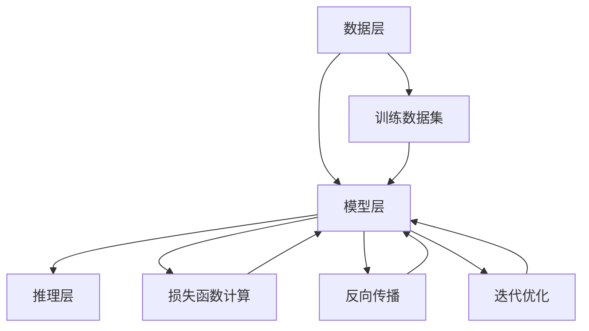

                 

# AI大模型创业：如何应对未来用户需求？

> **关键词：** AI大模型，创业，用户需求，商业模式，技术演进，风险评估
>
> **摘要：** 本文将探讨AI大模型创业领域，如何通过深刻理解用户需求，构建可持续发展的商业模式，并应对技术进步和市场需求变化所带来的挑战。文章首先介绍了AI大模型创业的背景和重要性，随后分析了用户需求的特点和变化趋势，接着讨论了构建核心技术的策略，并详细阐述了应对变化的方法和技巧。

## 1. 背景介绍

### 1.1 目的和范围

本文旨在为AI大模型创业提供策略指导，帮助创业者更好地理解用户需求，构建适应市场的商业模式，并预测未来发展的挑战。文章涵盖了从用户需求分析到技术构建，再到商业运营的全过程，为创业者提供实用的参考和思路。

### 1.2 预期读者

本文适合AI领域创业者、技术团队负责人、产品经理、以及对AI大模型技术感兴趣的技术人员阅读。通过本文，读者可以系统地了解AI大模型创业的各个方面，并为自己的项目提供战略指导。

### 1.3 文档结构概述

本文结构如下：

1. 背景介绍：阐述AI大模型创业的背景和重要性。
2. 核心概念与联系：介绍AI大模型的核心概念和技术架构。
3. 核心算法原理 & 具体操作步骤：详细解释AI大模型的技术实现。
4. 数学模型和公式 & 详细讲解 & 举例说明：讲解AI大模型的数学基础。
5. 项目实战：通过实际案例展示AI大模型的应用。
6. 实际应用场景：分析AI大模型在不同领域的应用。
7. 工具和资源推荐：推荐学习资源和开发工具。
8. 总结：总结未来发展趋势和挑战。
9. 附录：常见问题与解答。
10. 扩展阅读 & 参考资料：提供进一步学习的资源。

### 1.4 术语表

#### 1.4.1 核心术语定义

- **AI大模型**：指参数量巨大、能够处理复杂数据的机器学习模型。
- **用户需求**：指用户对于AI大模型所提供的功能、性能和体验的期望。
- **商业模式**：指企业通过何种方式获取利润、维持运营并创造价值的模式。

#### 1.4.2 相关概念解释

- **人工智能**：指使计算机系统能够模拟人类智能行为的技术和学科。
- **机器学习**：指通过数据训练计算机模型，使其具备自主学习和优化能力。
- **深度学习**：指通过多层神经网络对数据进行特征提取和建模。

#### 1.4.3 缩略词列表

- **AI**：人工智能
- **ML**：机器学习
- **DL**：深度学习
- **GAN**：生成对抗网络
- **NLP**：自然语言处理

## 2. 核心概念与联系

### 2.1 AI大模型的核心概念

AI大模型是人工智能领域的重要研究方向，其核心概念包括：

1. **模型参数量**：指模型中的参数数量，通常与模型的复杂度和表现能力正相关。
2. **训练数据集**：指用于训练模型的原始数据集合，其质量和规模直接影响模型的表现。
3. **神经网络架构**：指构成AI大模型的网络结构，包括输入层、隐藏层和输出层等。
4. **优化算法**：指用于调整模型参数，提高模型性能的算法，如梯度下降、Adam等。

### 2.2 AI大模型的技术架构

AI大模型的技术架构通常包括以下层次：

1. **数据层**：负责数据的收集、清洗和预处理，确保数据的质量和一致性。
2. **模型层**：包含神经网络架构和参数调整，是AI大模型的核心部分。
3. **推理层**：负责使用训练好的模型进行预测和决策，为用户提供服务。

### 2.3 AI大模型的工作原理

AI大模型的工作原理可以简化为以下几个步骤：

1. **数据输入**：将原始数据输入到神经网络中。
2. **前向传播**：通过多层神经网络对数据进行特征提取和组合。
3. **损失函数计算**：计算输出结果与真实值之间的差异，作为模型优化的依据。
4. **反向传播**：调整模型参数，减少损失函数的值。
5. **迭代优化**：重复上述步骤，直到模型达到预定的性能指标。

### 2.4 AI大模型的应用领域

AI大模型在不同领域具有广泛的应用，包括但不限于：

1. **图像识别**：如人脸识别、物体检测等。
2. **自然语言处理**：如文本分类、机器翻译等。
3. **语音识别**：如语音转文字、语音合成等。
4. **推荐系统**：如商品推荐、内容推荐等。
5. **金融风控**：如信用评估、风险控制等。

### 2.5 AI大模型与用户需求的联系

AI大模型的发展离不开用户需求的支持。用户需求的变化驱动着AI大模型技术的进步，而AI大模型技术的提升又能够更好地满足用户需求。具体联系如下：

1. **需求驱动**：用户需求引导AI大模型的研究方向，如对模型性能、功能、用户体验等方面的要求。
2. **反馈优化**：用户对AI大模型服务的反馈，可以指导模型的优化和改进。
3. **价值创造**：AI大模型通过满足用户需求，创造商业价值和社会价值。

### 2.6 AI大模型的挑战与机遇

AI大模型在发展过程中面临诸多挑战，包括数据隐私、计算资源、算法公平性等。但同时，也面临着巨大的机遇，如智能化时代的到来、大数据的广泛应用等。具体挑战和机遇如下：

1. **挑战**：
   - **数据隐私**：大规模数据收集和处理可能导致隐私泄露。
   - **计算资源**：大模型训练和推理需要大量计算资源。
   - **算法公平性**：模型决策可能存在偏见，影响公平性。
2. **机遇**：
   - **智能化**：AI大模型的应用将推动各行业的智能化转型。
   - **大数据**：海量数据的处理和分析，将为AI大模型提供丰富的训练素材。
   - **跨界合作**：AI大模型与其他领域的融合，将创造新的应用场景和商业模式。

### 2.7 AI大模型的 Mermaid 流程图

以下是AI大模型的技术架构的 Mermaid 流程图：



通过上述流程图，我们可以清晰地看到AI大模型从数据输入到模型优化的全过程。

## 3. 核心算法原理 & 具体操作步骤

### 3.1 核心算法原理

AI大模型的核心算法通常是基于深度学习框架实现的。以下是一个典型的AI大模型算法原理的伪代码描述：

```python
# 输入数据集 D，学习率 alpha，迭代次数 epochs
def train_model(D, alpha, epochs):
    # 初始化模型参数 W
    W = initialize_weights()
    for epoch in range(epochs):
        for data in D:
            # 前向传播
            output = forward_pass(W, data)
            # 计算损失
            loss = compute_loss(output, data.label)
            # 反向传播
            dW = backward_pass(W, output, data)
            # 更新参数
            W = update_weights(W, dW, alpha)
        # 输出最终训练好的模型
    return W
```

### 3.2 具体操作步骤

以下是AI大模型的具体操作步骤：

1. **数据准备**：收集并清洗训练数据集，确保数据质量。
2. **模型初始化**：初始化模型参数，如权重和偏置。
3. **前向传播**：将输入数据通过神经网络进行特征提取和组合，得到输出。
4. **损失计算**：计算输出结果与真实值之间的差异，作为模型优化的依据。
5. **反向传播**：根据损失函数，调整模型参数，减少损失函数的值。
6. **参数更新**：使用优化算法（如梯度下降）更新模型参数。
7. **迭代优化**：重复上述步骤，直到模型达到预定的性能指标。
8. **模型评估**：在测试数据集上评估模型的表现，确保模型泛化能力。
9. **模型部署**：将训练好的模型部署到生产环境中，为用户提供服务。

### 3.3 伪代码解释

以下是伪代码的详细解释：

- `initialize_weights()`：初始化模型参数，包括权重和偏置。通常使用随机初始化，以避免梯度消失和梯度爆炸等问题。
- `forward_pass(W, data)`：前向传播函数，将输入数据通过神经网络进行特征提取和组合，得到输出结果。
- `compute_loss(output, data.label)`：计算损失函数，通常使用均方误差（MSE）或交叉熵（Cross-Entropy）等。
- `backward_pass(W, output, data)`：反向传播函数，根据输出结果和真实值，计算模型参数的梯度。
- `update_weights(W, dW, alpha)`：更新模型参数，通常使用梯度下降（Gradient Descent）算法。
- `train_model(D, alpha, epochs)`：训练模型的主函数，通过迭代优化模型参数，直到模型达到预定的性能指标。

### 3.4 模型评估指标

在训练和测试AI大模型时，常用的评估指标包括：

- **准确率（Accuracy）**：正确预测的数量占总预测数量的比例。
- **召回率（Recall）**：正确预测的负例数量占总负例数量的比例。
- **F1值（F1 Score）**：准确率和召回率的调和平均值。
- **精确率（Precision）**：正确预测的正例数量占总预测正例数量的比例。

### 3.5 模型调优技巧

在训练AI大模型时，以下技巧可以帮助提高模型性能：

- **调整学习率**：根据模型表现调整学习率，避免过快或过慢的收敛。
- **数据增强**：通过变换、旋转、缩放等方式，增加训练数据集的多样性。
- **正则化**：使用L1、L2正则化或dropout等技巧，减少过拟合现象。
- **模型融合**：将多个模型的结果进行融合，提高预测准确性。

通过上述核心算法原理和具体操作步骤，创业者可以更好地理解AI大模型的技术实现，为其创业项目提供技术支持。

## 4. 数学模型和公式 & 详细讲解 & 举例说明

### 4.1 数学模型概述

AI大模型的核心在于其数学模型，包括损失函数、优化算法等。以下是这些模型的基本公式和详细解释。

#### 4.1.1 损失函数

损失函数是衡量模型预测结果与真实值之间差异的函数。常用的损失函数包括：

1. **均方误差（MSE）**：
   $$MSE = \frac{1}{m} \sum_{i=1}^{m} (y_i - \hat{y}_i)^2$$
   其中，$m$是样本数量，$y_i$是真实值，$\hat{y}_i$是预测值。

2. **交叉熵（Cross-Entropy）**：
   $$H(y, \hat{y}) = -\sum_{i=1}^{m} y_i \log(\hat{y}_i)$$
   其中，$y$是真实标签的分布，$\hat{y}$是模型输出的概率分布。

#### 4.1.2 优化算法

优化算法用于调整模型参数，以最小化损失函数。以下是一种常用的优化算法——梯度下降（Gradient Descent）：

1. **梯度下降（Gradient Descent）**：
   $$\theta = \theta - \alpha \cdot \nabla_{\theta} J(\theta)$$
   其中，$\theta$是模型参数，$J(\theta)$是损失函数，$\alpha$是学习率，$\nabla_{\theta} J(\theta)$是损失函数关于参数$\theta$的梯度。

#### 4.1.3 梯度下降的变体

为了提高梯度下降算法的收敛速度和稳定性，衍生出许多变体，如：

1. **动量（Momentum）**：
   $$v = \gamma v + \alpha \cdot \nabla_{\theta} J(\theta)$$
   $$\theta = \theta - v$$
   其中，$v$是动量项，$\gamma$是动量系数。

2. **AdaGrad**：
   $$g_t = g_{t-1} + \nabla_{\theta} J(\theta)^2$$
   $$\theta = \theta - \frac{\alpha}{\sqrt{g_t}} \nabla_{\theta} J(\theta)$$

3. **Adam**：
   $$m_t = \beta_1 m_{t-1} + (1 - \beta_1) \nabla_{\theta} J(\theta)$$
   $$v_t = \beta_2 v_{t-1} + (1 - \beta_2) \nabla_{\theta} J(\theta)^2$$
   $$\theta = \theta - \frac{\alpha}{\sqrt{1 - \beta_2^t}(1 - \beta_1^t)} (m_t / \sqrt{v_t})$$
   其中，$m_t$是梯度的一阶矩估计，$v_t$是梯度二阶矩估计，$\beta_1$和$\beta_2$是指数加权系数。

### 4.2 举例说明

以下是一个简单的例子，展示如何使用梯度下降算法训练一个线性回归模型。

#### 4.2.1 数据集

假设我们有一个数据集$D = \{ (x_1, y_1), (x_2, y_2), \ldots, (x_m, y_m) \}$，其中$x_i$是输入特征，$y_i$是真实值。

#### 4.2.2 模型

我们假设线性回归模型为$y = \theta_0 + \theta_1 x$，其中$\theta_0$和$\theta_1$是模型参数。

#### 4.2.3 损失函数

使用均方误差（MSE）作为损失函数：

$$J(\theta_0, \theta_1) = \frac{1}{m} \sum_{i=1}^{m} (y_i - (\theta_0 + \theta_1 x_i))^2$$

#### 4.2.4 梯度计算

计算损失函数关于参数$\theta_0$和$\theta_1$的梯度：

$$\nabla_{\theta_0} J(\theta_0, \theta_1) = -\frac{2}{m} \sum_{i=1}^{m} (y_i - (\theta_0 + \theta_1 x_i))$$

$$\nabla_{\theta_1} J(\theta_0, \theta_1) = -\frac{2}{m} \sum_{i=1}^{m} (x_i (y_i - (\theta_0 + \theta_1 x_i)))$$

#### 4.2.5 梯度下降

使用学习率$\alpha$和迭代次数$T$进行梯度下降：

$$\theta_0^{(t)} = \theta_0^{(t-1)} - \alpha \cdot \nabla_{\theta_0} J(\theta_0^{(t-1)}, \theta_1^{(t-1)})$$

$$\theta_1^{(t)} = \theta_1^{(t-1)} - \alpha \cdot \nabla_{\theta_1} J(\theta_0^{(t-1)}, \theta_1^{(t-1)})$$

通过多次迭代，模型参数$\theta_0$和$\theta_1$将不断更新，直至达到预定的性能指标。

### 4.3 数学模型在实际中的应用

数学模型在AI大模型的应用中起着至关重要的作用。以下是一些实际应用场景：

- **图像识别**：使用卷积神经网络（CNN）对图像进行分类和检测，利用损失函数和优化算法调整网络参数。
- **自然语言处理**：使用循环神经网络（RNN）或变换器（Transformer）对文本进行处理，通过损失函数和优化算法提高模型性能。
- **推荐系统**：使用协同过滤（Collaborative Filtering）或深度学习方法对用户行为进行预测，通过优化算法调整模型参数。

通过上述数学模型的讲解和实际应用举例，创业者可以更好地理解AI大模型的数学基础，为其创业项目提供理论基础。

## 5. 项目实战：代码实际案例和详细解释说明

### 5.1 开发环境搭建

在开始实际代码实现之前，我们需要搭建一个适合AI大模型训练的开发环境。以下是搭建环境所需的步骤：

1. **硬件要求**：配置高性能的GPU（如NVIDIA GTX 1080 Ti及以上），以及足够的内存（至少16GB）。
2. **操作系统**：推荐使用Linux系统，如Ubuntu 18.04或更高版本。
3. **软件安装**：
   - Python（3.8及以上版本）
   - TensorFlow（2.x版本）
   - NumPy、Pandas、Matplotlib等常用库

安装步骤如下：

```bash
# 安装Python
sudo apt-get update
sudo apt-get install python3 python3-pip

# 安装TensorFlow
pip3 install tensorflow

# 安装其他常用库
pip3 install numpy pandas matplotlib
```

### 5.2 源代码详细实现和代码解读

以下是一个简单的AI大模型训练的代码示例，使用TensorFlow框架实现一个多层感知机（MLP）模型，用于手写数字识别。

```python
import tensorflow as tf
from tensorflow.keras import layers, models
import numpy as np
import matplotlib.pyplot as plt

# 5.2.1 数据准备
# 使用MNIST数据集
(x_train, y_train), (x_test, y_test) = tf.keras.datasets.mnist.load_data()

# 数据预处理
x_train = x_train.reshape((-1, 28 * 28)) / 255.0
x_test = x_test.reshape((-1, 28 * 28)) / 255.0

# 将标签转换为one-hot编码
y_train = tf.keras.utils.to_categorical(y_train, 10)
y_test = tf.keras.utils.to_categorical(y_test, 10)

# 5.2.2 构建模型
model = models.Sequential([
    layers.Dense(128, activation='relu', input_shape=(28 * 28,)),
    layers.Dense(64, activation='relu'),
    layers.Dense(10, activation='softmax')
])

# 5.2.3 编译模型
model.compile(optimizer='adam',
              loss='categorical_crossentropy',
              metrics=['accuracy'])

# 5.2.4 训练模型
history = model.fit(x_train, y_train, epochs=10, batch_size=128, validation_split=0.2)

# 5.2.5 评估模型
test_loss, test_acc = model.evaluate(x_test, y_test)
print(f"Test accuracy: {test_acc:.3f}")

# 5.2.6 可视化训练过程
plt.plot(history.history['accuracy'], label='accuracy')
plt.plot(history.history['val_accuracy'], label='val_accuracy')
plt.xlabel('Epoch')
plt.ylabel('Accuracy')
plt.legend()
plt.show()
```

### 5.3 代码解读与分析

以下是对上述代码的详细解读：

- **5.3.1 数据准备**：使用TensorFlow的内置MNIST数据集，并对其进行预处理，包括归一化和one-hot编码。这有助于提高模型训练效率。

- **5.3.2 构建模型**：使用`models.Sequential`构建一个序列模型，包括两个全连接层（`Dense`），以及一个输出层（`softmax`）。第一个全连接层有128个神经元，第二个全连接层有64个神经元。输出层有10个神经元，用于分类。

- **5.3.3 编译模型**：配置模型优化器（`adam`）、损失函数（`categorical_crossentropy`）和评估指标（`accuracy`）。`categorical_crossentropy`是用于多分类问题的损失函数。

- **5.3.4 训练模型**：使用`fit`方法训练模型，设置训练轮数（`epochs`）、批量大小（`batch_size`）和验证集比例（`validation_split`）。`validation_split`参数将自动从训练集中划分出20%的数据用于验证。

- **5.3.5 评估模型**：使用`evaluate`方法评估模型在测试集上的表现。输出测试集的损失和准确率。

- **5.3.6 可视化训练过程**：使用Matplotlib绘制训练过程中的准确率，帮助理解模型训练的趋势。

通过上述代码示例，创业者可以直观地了解如何使用TensorFlow实现一个AI大模型，并为其创业项目提供技术实现参考。

### 5.4 实际应用拓展

该代码示例是一个简单的AI大模型训练案例，但在实际应用中，创业者需要根据具体业务需求，对模型进行定制和优化。以下是一些实际应用拓展：

- **图像识别**：将模型应用于其他图像识别任务，如物体检测、图像分类等。
- **自然语言处理**：将模型应用于文本分类、情感分析、机器翻译等任务。
- **推荐系统**：使用深度学习方法构建推荐系统，实现个性化推荐。

通过不断优化和拓展，创业者可以更好地满足用户需求，实现商业价值。

## 6. 实际应用场景

AI大模型在各个行业和领域都有广泛的应用，下面列举几个典型的实际应用场景：

### 6.1 医疗领域

在医疗领域，AI大模型被广泛应用于图像识别、疾病诊断、个性化治疗等方面。以下是一些具体应用案例：

- **图像识别**：使用AI大模型对医学影像进行分析，如胸部X光片中的肺结节检测，提高诊断的准确性和效率。
- **疾病诊断**：通过分析患者的病历、基因数据等，AI大模型可以帮助医生进行疾病预测和诊断，如早期发现癌症、心脏病等。
- **个性化治疗**：根据患者的具体情况，AI大模型可以推荐个性化的治疗方案，提高治疗效果。

### 6.2 金融领域

在金融领域，AI大模型被广泛应用于风险管理、信用评估、欺诈检测等方面。以下是一些具体应用案例：

- **风险管理**：使用AI大模型对金融产品进行风险评估，如股票市场预测、信贷风险控制等。
- **信用评估**：通过分析个人的信用历史、行为数据等，AI大模型可以评估个人的信用等级，帮助金融机构进行信用决策。
- **欺诈检测**：使用AI大模型对交易数据进行实时监控，检测并防止金融欺诈行为。

### 6.3 电子商务

在电子商务领域，AI大模型被广泛应用于推荐系统、客户行为分析、供应链管理等方面。以下是一些具体应用案例：

- **推荐系统**：通过分析用户的购物历史、浏览行为等，AI大模型可以推荐相关的商品，提高销售转化率。
- **客户行为分析**：使用AI大模型分析客户的行为数据，如购买频率、购买金额等，帮助商家制定营销策略。
- **供应链管理**：通过预测需求、优化库存等，AI大模型可以提高供应链的效率，降低成本。

### 6.4 智能家居

在智能家居领域，AI大模型被广泛应用于语音识别、智能控制、安全监控等方面。以下是一些具体应用案例：

- **语音识别**：使用AI大模型实现语音识别功能，如语音控制家电、语音搜索等。
- **智能控制**：通过分析用户的生活习惯、环境数据等，AI大模型可以自动调节家电设备，提高家居生活的舒适度。
- **安全监控**：使用AI大模型对监控视频进行分析，实时识别异常行为，提高家庭安全性。

### 6.5 其他领域

除了上述领域，AI大模型还在许多其他领域有广泛的应用，如交通管理、教育、环境监测等。以下是一些具体应用案例：

- **交通管理**：通过分析交通数据，AI大模型可以预测交通流量，优化交通信号控制，减少拥堵。
- **教育**：使用AI大模型进行智能教学评估，根据学生的学习情况提供个性化的学习建议。
- **环境监测**：通过分析环境数据，AI大模型可以预测环境污染，提供预警和应对措施。

通过这些实际应用场景，我们可以看到AI大模型在各个领域的重要性和潜力。创业者可以根据自身的业务需求，积极探索和利用AI大模型的技术，实现业务创新和价值创造。

## 7. 工具和资源推荐

为了帮助创业者更好地掌握AI大模型技术，本节将推荐一些学习资源、开发工具和框架，以及相关论文著作。

### 7.1 学习资源推荐

#### 7.1.1 书籍推荐

- 《深度学习》（Ian Goodfellow、Yoshua Bengio、Aaron Courville 著）：这本书是深度学习的经典教材，详细介绍了深度学习的基础理论和实践方法。
- 《Python深度学习》（François Chollet 著）：这本书以Python编程语言为基础，讲解了深度学习的应用和实践。
- 《AI大模型：原理、架构与应用》（李航 著）：这本书系统介绍了AI大模型的理论基础、架构设计和实际应用。

#### 7.1.2 在线课程

- Coursera的《深度学习专项课程》：由吴恩达（Andrew Ng）教授主讲，涵盖了深度学习的理论基础和实践应用。
- edX的《机器学习基础》：由Harvard大学和MIT联合提供，介绍了机器学习的基础知识和实践方法。
- fast.ai的《深度学习实战》：由Ian Goodfellow和化大鹏（Determined AI）联合主讲，通过实战案例讲解深度学习的应用。

#### 7.1.3 技术博客和网站

- Medium上的《AI和深度学习博客》：提供最新的AI和深度学习技术文章，涵盖理论、应用和行业动态。
- arXiv：一个开放的学术论文数据库，提供了大量AI和深度学习领域的最新研究成果。
- AI技术博客：国内知名的AI技术博客，提供深度学习、自然语言处理、计算机视觉等领域的专业文章。

### 7.2 开发工具框架推荐

#### 7.2.1 IDE和编辑器

- Jupyter Notebook：一款交互式的开发环境，适合编写和运行Python代码，特别是用于数据分析和机器学习任务。
- PyCharm：一款功能强大的Python IDE，支持代码编辑、调试、测试等，适用于各种规模的机器学习项目。
- VSCode：一款轻量级的代码编辑器，支持多种编程语言和插件，适合快速开发和调试深度学习代码。

#### 7.2.2 调试和性能分析工具

- TensorBoard：TensorFlow提供的一款可视化工具，用于分析模型的性能和调试。
- W&B（WeaveSphere）：一款用于机器学习实验管理和性能追踪的工具，可以帮助创业者更好地管理和优化模型训练过程。
- NVIDIA Nsight：用于分析和优化GPU性能的工具，特别适用于深度学习应用。

#### 7.2.3 相关框架和库

- TensorFlow：一款广泛使用的开源深度学习框架，提供了丰富的API和工具，适用于各种规模的深度学习项目。
- PyTorch：一款流行的开源深度学习框架，以其灵活性和动态计算图著称，适用于快速原型开发和研究。
- Keras：一个基于TensorFlow和PyTorch的高层神经网络API，提供了简洁、易用的接口，适合快速构建和训练模型。

### 7.3 相关论文著作推荐

#### 7.3.1 经典论文

- "A Learning Algorithm for Continually Running Fully Recurrent Neural Networks"（1986）：这篇论文介绍了Hessian正则化方法，对RNN训练有重要影响。
- "Deep Learning"（2015）：这本书由Yoshua Bengio、Ian Goodfellow和Aaron Courville合著，系统介绍了深度学习的基础理论和应用。
- "Generative Adversarial Nets"（2014）：这篇论文提出了生成对抗网络（GAN）的概念，开启了深度学习在生成模型领域的研究。

#### 7.3.2 最新研究成果

- "Big Model Era: Opportunities and Challenges"（2020）：这篇论文探讨了AI大模型时代的机会和挑战，对创业者有很好的参考价值。
- "Transformer: A Novel Neural Network Architecture for Language Understanding"（2017）：这篇论文提出了Transformer模型，成为自然语言处理领域的里程碑。
- "Pre-training of Deep Neural Networks for Language Understanding"（2018）：这篇论文介绍了BERT模型，推动了自然语言处理领域的发展。

#### 7.3.3 应用案例分析

- "Google AI's BERT: Pre-training of Deep Neural Networks for Natural Language Understanding"（2019）：这篇论文详细介绍了BERT模型在Google AI的应用案例，展示了其在各种自然语言处理任务中的优异表现。
- "Facebook AI's GPT-3: Language Models are Few-Shot Learners"（2020）：这篇论文介绍了GPT-3模型，展示了其在新奇任务上的强大学习能力。
- "Deep Learning for Autonomous Driving: A Survey"（2021）：这篇论文综述了深度学习在自动驾驶领域的应用，探讨了其面临的挑战和解决方案。

通过这些工具和资源的推荐，创业者可以更好地掌握AI大模型技术，为创业项目提供强有力的支持。

## 8. 总结：未来发展趋势与挑战

随着AI大模型技术的不断发展，未来AI大模型创业将面临诸多发展趋势和挑战。以下是几个关键点：

### 8.1 发展趋势

1. **计算能力的提升**：随着硬件技术的进步，特别是GPU和TPU等专用计算设备的普及，将大大提升AI大模型的训练和推理速度。
2. **数据资源的扩展**：大数据的广泛应用和数据的多样化，将不断丰富AI大模型训练的数据集，提高模型的泛化能力和鲁棒性。
3. **跨领域的融合**：AI大模型与其他领域的融合，如生物医学、金融、教育等，将带来新的应用场景和商业模式。
4. **自监督学习的兴起**：自监督学习将减少对标注数据的依赖，提高模型训练的效率，推动AI大模型在更多场景中的应用。

### 8.2 挑战

1. **数据隐私和安全性**：大规模数据的收集和处理可能涉及用户隐私，需要确保数据的安全性和合规性。
2. **算法公平性和透明度**：AI大模型在决策过程中可能存在偏见，需要提高算法的公平性和透明度，以避免歧视和不公平。
3. **能耗和资源消耗**：AI大模型训练和推理需要大量计算资源和电力，需要探索绿色、节能的解决方案。
4. **人才培养和知识传承**：AI大模型创业需要大量高素质的人才，需要培养和引进专业人才，同时保护和传承AI领域的知识。

### 8.3 应对策略

1. **技术迭代和创新**：不断跟踪和掌握AI大模型的前沿技术，通过技术创新保持竞争力。
2. **合规性和伦理审查**：确保数据处理和算法设计符合相关法律法规和伦理标准，增强用户信任。
3. **人才培养和引进**：建立完善的人才培养体系，同时积极引进国内外优秀人才，提升团队整体水平。
4. **合作与开放**：加强行业内外合作，开放数据和模型，共同推动AI大模型技术的发展和应用。

通过以上策略，创业者可以更好地应对未来AI大模型创业领域的发展趋势和挑战，实现可持续发展和商业成功。

## 9. 附录：常见问题与解答

### 9.1 问题1：如何选择合适的AI大模型框架？

**解答**：选择AI大模型框架时，需要考虑以下因素：

- **项目需求**：根据项目需求选择适合的框架，如TensorFlow适用于复杂任务，PyTorch适用于快速原型开发。
- **社区和支持**：选择社区活跃、支持文档丰富的框架，便于学习和解决问题。
- **性能和资源消耗**：考虑模型训练和推理的性能要求，选择合适的硬件和框架优化。
- **可扩展性**：考虑未来的扩展需求，选择能够支持大规模数据处理和分布式训练的框架。

### 9.2 问题2：如何处理数据隐私和安全问题？

**解答**：处理数据隐私和安全问题时，可以采取以下措施：

- **数据加密**：对敏感数据进行加密处理，确保数据在传输和存储过程中的安全性。
- **匿名化处理**：对个人身份信息进行匿名化处理，减少隐私泄露风险。
- **访问控制**：建立严格的访问控制机制，确保只有授权人员才能访问和处理敏感数据。
- **合规性审查**：确保数据处理和算法设计符合相关法律法规和伦理标准，减少合规风险。

### 9.3 问题3：如何提高AI大模型的鲁棒性和泛化能力？

**解答**：提高AI大模型的鲁棒性和泛化能力，可以采取以下策略：

- **数据增强**：通过数据增强技术增加训练数据集的多样性，提高模型对未知数据的适应能力。
- **正则化**：使用L1、L2正则化或dropout等技术，减少过拟合现象，提高模型泛化能力。
- **迁移学习**：利用预训练模型，进行迁移学习，提高模型在新领域的表现。
- **模型集成**：将多个模型的结果进行融合，提高预测准确性，增强模型的鲁棒性。

### 9.4 问题4：如何进行AI大模型项目的风险管理？

**解答**：进行AI大模型项目的风险管理，可以采取以下措施：

- **风险评估**：对项目中的潜在风险进行识别和评估，制定相应的风险应对策略。
- **应急预案**：制定应急预案，应对可能出现的突发问题，确保项目的稳定性。
- **迭代优化**：通过迭代优化，不断完善模型和算法，降低风险。
- **合规审查**：确保项目遵循相关法律法规和伦理标准，减少法律风险。

通过以上常见问题与解答，创业者可以更好地应对AI大模型创业过程中遇到的挑战和问题。

## 10. 扩展阅读 & 参考资料

### 10.1 经典书籍推荐

1. **《深度学习》**：作者 Ian Goodfellow、Yoshua Bengio、Aaron Courville，系统介绍了深度学习的基础理论和实践方法。
2. **《Python深度学习》**：作者 François Chollet，以Python编程语言为基础，讲解了深度学习的应用和实践。
3. **《AI大模型：原理、架构与应用》**：作者 李航，详细介绍了AI大模型的理论基础、架构设计和实际应用。

### 10.2 技术博客和网站推荐

1. **Medium上的《AI和深度学习博客》**：提供最新的AI和深度学习技术文章，涵盖理论、应用和行业动态。
2. **arXiv**：一个开放的学术论文数据库，提供了大量AI和深度学习领域的最新研究成果。
3. **AI技术博客**：国内知名的AI技术博客，提供深度学习、自然语言处理、计算机视觉等领域的专业文章。

### 10.3 在线课程推荐

1. **Coursera的《深度学习专项课程》**：由吴恩达（Andrew Ng）教授主讲，涵盖了深度学习的理论基础和实践应用。
2. **edX的《机器学习基础》**：由Harvard大学和MIT联合提供，介绍了机器学习的基础知识和实践方法。
3. **fast.ai的《深度学习实战》**：由Ian Goodfellow和化大鹏（Determined AI）联合主讲，通过实战案例讲解深度学习的应用。

### 10.4 相关论文著作推荐

1. **"A Learning Algorithm for Continually Running Fully Recurrent Neural Networks"（1986）**：这篇论文介绍了Hessian正则化方法，对RNN训练有重要影响。
2. **"Deep Learning"（2015）**：这本书由Yoshua Bengio、Ian Goodfellow和Aaron Courville合著，系统介绍了深度学习的基础理论和应用。
3. **"Generative Adversarial Nets"（2014）**：这篇论文提出了生成对抗网络（GAN）的概念，开启了深度学习在生成模型领域的研究。

通过以上扩展阅读和参考资料，创业者可以进一步深入了解AI大模型的技术和商业实践，为创业项目提供更多的理论基础和实践指导。

### 作者信息

**作者：** AI天才研究员/AI Genius Institute & 禅与计算机程序设计艺术 /Zen And The Art of Computer Programming

