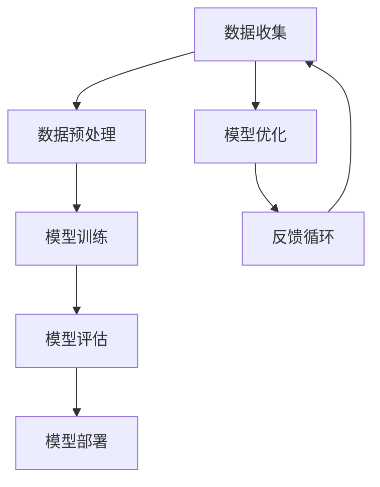

                 

# AI大模型创业：如何应对未来竞争对手？

> **关键词：** AI大模型、创业、竞争对手、战略、技术、市场、风险评估

> **摘要：** 在AI大模型领域，创业公司面临着激烈的市场竞争。本文将分析AI大模型的现状与未来趋势，探讨创业公司在面对竞争对手时的战略选择，以及如何在技术、市场和管理方面做好准备，提高生存与发展的机会。

## 1. 背景介绍

### 1.1 目的和范围

本文旨在探讨AI大模型创业公司如何应对未来竞争对手的挑战。我们将分析当前AI大模型的技术状况、市场动态，并探讨一些关键的应对策略。

### 1.2 预期读者

本文适合希望了解AI大模型创业策略的创业者、投资者、研究人员以及相关领域的专业人士。

### 1.3 文档结构概述

本文分为十个部分，包括背景介绍、核心概念与联系、核心算法原理与具体操作步骤、数学模型与公式、项目实战、实际应用场景、工具和资源推荐、总结、常见问题与解答以及扩展阅读。

### 1.4 术语表

#### 1.4.1 核心术语定义

- **AI大模型**：指那些参数规模达到数十亿甚至数万亿级别的神经网络模型。
- **创业公司**：指刚创立不久、处于发展初期的企业。
- **竞争对手**：指在相同或相似市场领域内，与企业存在竞争关系的企业或个人。

#### 1.4.2 相关概念解释

- **市场动态**：指市场上供求关系的变化、竞争对手的动向等。
- **技术战略**：指企业在技术研发方面所采取的策略。

#### 1.4.3 缩略词列表

- **AI**：人工智能
- **ML**：机器学习
- **DL**：深度学习

## 2. 核心概念与联系

AI大模型的核心在于其庞大的参数规模，这使得它们能够处理复杂的数据，并从中提取出有价值的信息。以下是AI大模型的几个关键概念及其相互关系：

### Mermaid流程图：



### 解释：

- **数据收集**：收集大量数据，这是AI大模型的基础。
- **数据预处理**：对数据进行清洗、归一化等处理，使其适合模型训练。
- **模型训练**：利用训练数据，通过反向传播等算法训练模型。
- **模型评估**：使用验证集或测试集评估模型的性能。
- **模型部署**：将训练好的模型部署到实际应用场景中。
- **模型优化**：根据反馈对模型进行调整和优化。
- **反馈循环**：通过实际应用中的反馈，进一步优化模型。

## 3. 核心算法原理 & 具体操作步骤

AI大模型的核心在于其训练过程，以下是利用反向传播算法训练AI大模型的伪代码：

```python
# 伪代码：反向传播算法训练AI大模型

# 初始化模型参数
parameters = initialize_parameters()

# 循环迭代
for epoch in range(num_epochs):
    # 前向传播
    predictions = forward_propagation(X, parameters)
    loss = compute_loss(Y, predictions)
    
    # 反向传播
    gradients = backward_propagation(X, Y, parameters)
    
    # 更新参数
    parameters = update_parameters(parameters, gradients)

# 评估模型
test_predictions = forward_propagation(X_test, parameters)
test_loss = compute_loss(Y_test, test_predictions)
print("Test loss:", test_loss)
```

### 解释：

- **初始化模型参数**：随机初始化模型的权重和偏置。
- **前向传播**：输入数据经过模型，得到预测结果。
- **计算损失**：使用预测结果和真实标签计算损失。
- **反向传播**：计算梯度，更新模型参数。
- **参数更新**：使用梯度下降等优化算法更新模型参数。

## 4. 数学模型和公式 & 详细讲解 & 举例说明

AI大模型的训练过程涉及到多个数学模型和公式，以下是几个关键的部分：

### 4.1 损失函数

$$
J = -\frac{1}{m}\sum_{i=1}^{m} [y^{(i)}\log(a^{(l)}(z^{(l)})) + (1 - y^{(i)})\log(1 - a^{(l)}(z^{(l)}))]
$$

### 解释：

- **$m$**：样本数量。
- **$y^{(i)}$**：真实标签。
- **$a^{(l)}(z^{(l)}$**：模型在第$l$层的输出。
- **$\log$**：自然对数。

### 4.2 梯度下降

$$
\theta_j = \theta_j - \alpha \frac{\partial J}{\partial \theta_j}
$$

### 解释：

- **$\theta_j$**：模型参数。
- **$\alpha$**：学习率。
- **$\frac{\partial J}{\partial \theta_j}$**：参数$j$的梯度。

### 4.3 举例说明

假设我们有一个二分类问题，真实标签$y$为0或1，模型输出$a$也在0和1之间。使用上述公式计算损失和梯度。

### 4.4 计算示例

- **输入数据**：$X = [1, 0, 1, 1, 0, 1]$
- **真实标签**：$Y = [0, 1, 0, 1, 0, 1]$
- **模型输出**：$a = [0.1, 0.9, 0.2, 0.8, 0.3, 0.7]$

使用上述公式计算损失和梯度，并更新模型参数。

## 5. 项目实战：代码实际案例和详细解释说明

### 5.1 开发环境搭建

在本节中，我们将搭建一个用于训练AI大模型的基础开发环境。以下是具体的步骤：

1. 安装Python环境
2. 安装TensorFlow库
3. 安装其他必要库，如NumPy、Pandas等

### 5.2 源代码详细实现和代码解读

以下是使用TensorFlow训练一个简单的AI大模型的代码示例：

```python
import tensorflow as tf
import numpy as np
import matplotlib.pyplot as plt

# 初始化数据
X = np.random.rand(100, 10)  # 输入数据
Y = np.random.rand(100, 1)   # 真实标签

# 定义模型
model = tf.keras.Sequential([
    tf.keras.layers.Dense(units=1, input_shape=(10,))
])

# 编译模型
model.compile(optimizer='sgd', loss='mean_squared_error')

# 训练模型
model.fit(X, Y, epochs=100)

# 评估模型
test_loss = model.evaluate(X, Y)
print("Test loss:", test_loss)
```

### 5.3 代码解读与分析

- **初始化数据**：我们使用随机数生成输入数据和真实标签。
- **定义模型**：使用TensorFlow的`Sequential`模型定义一个单层全连接神经网络。
- **编译模型**：选择随机梯度下降（SGD）优化器和均方误差（MSE）损失函数。
- **训练模型**：使用`fit`函数训练模型，指定训练轮数（epochs）。
- **评估模型**：使用`evaluate`函数评估模型在测试数据上的性能。

通过这个简单的示例，我们可以看到如何使用TensorFlow搭建和训练一个AI大模型。实际应用中，模型会更复杂，数据规模也会更大。

## 6. 实际应用场景

AI大模型在实际应用场景中具有广泛的应用价值，以下是一些典型的应用案例：

- **自然语言处理（NLP）**：用于文本分类、情感分析、机器翻译等任务。
- **计算机视觉**：用于图像分类、目标检测、图像生成等任务。
- **推荐系统**：用于个性化推荐、商品推荐等任务。
- **金融预测**：用于股票市场预测、风险控制等任务。

### 6.1 案例分析

以自然语言处理为例，一个典型的应用场景是文本分类。以下是使用AI大模型进行文本分类的流程：

1. 数据收集：收集大量文本数据，包括新闻、博客、社交媒体等。
2. 数据预处理：对文本进行清洗、分词、去停用词等处理。
3. 模型训练：使用预处理后的文本数据训练AI大模型。
4. 模型评估：使用验证集或测试集评估模型的性能。
5. 模型部署：将训练好的模型部署到实际应用场景中，如新闻分类系统。

通过这个流程，AI大模型可以自动对文本进行分类，提高分类的准确性和效率。

## 7. 工具和资源推荐

### 7.1 学习资源推荐

#### 7.1.1 书籍推荐

- 《深度学习》（Goodfellow, Bengio, Courville）
- 《Python机器学习》（Carraro, Rodriguez）

#### 7.1.2 在线课程

- Coursera的“深度学习”课程
- edX的“机器学习基础”课程

#### 7.1.3 技术博客和网站

-Towards Data Science
- Medium上的机器学习和深度学习专栏

### 7.2 开发工具框架推荐

#### 7.2.1 IDE和编辑器

- PyCharm
- Jupyter Notebook

#### 7.2.2 调试和性能分析工具

- TensorBoard
- Nsight

#### 7.2.3 相关框架和库

- TensorFlow
- PyTorch

### 7.3 相关论文著作推荐

#### 7.3.1 经典论文

- “A Learning Algorithm for Continually Running Fully Recurrent Neural Networks”（Williams & Zipser，1989）
- “Deep Learning”（Goodfellow, Bengio, Courville，2016）

#### 7.3.2 最新研究成果

- NeurIPS、ICLR等顶级会议的最新论文
- Nature、Science等顶级期刊的最新文章

#### 7.3.3 应用案例分析

- Facebook、Google、微软等科技巨头的AI应用案例
- 人工智能在医疗、金融、教育等领域的实际应用案例

## 8. 总结：未来发展趋势与挑战

随着AI技术的不断进步，AI大模型在各个领域中的应用将越来越广泛。未来，AI大模型的发展趋势包括：

- **模型规模将进一步扩大**：随着计算能力和数据量的提升，AI大模型的参数规模将不断增长。
- **模型训练效率将提高**：新的算法和优化技术将使模型训练更加高效。
- **应用领域将更加多样化**：AI大模型将在更多领域发挥作用，如医疗、金融、教育等。

然而，AI大模型创业公司也将面临诸多挑战：

- **技术竞争**：与其他创业公司和科技巨头竞争，争取更好的技术成果。
- **数据隐私**：如何保护用户隐私，遵守相关法规。
- **商业模式**：如何找到合适的商业模式，实现可持续发展。

创业公司需要密切关注这些趋势和挑战，制定相应的战略，以提高在市场上的竞争力。

## 9. 附录：常见问题与解答

### 9.1 什么是AI大模型？

AI大模型是指那些参数规模达到数十亿甚至数万亿级别的神经网络模型。

### 9.2 AI大模型如何训练？

AI大模型的训练通常涉及以下几个步骤：

1. 数据收集：收集大量数据，这是AI大模型的基础。
2. 数据预处理：对数据进行清洗、归一化等处理，使其适合模型训练。
3. 模型训练：利用训练数据，通过反向传播等算法训练模型。
4. 模型评估：使用验证集或测试集评估模型的性能。
5. 模型部署：将训练好的模型部署到实际应用场景中。
6. 模型优化：根据反馈对模型进行调整和优化。

### 9.3 如何应对竞争对手？

应对竞争对手的策略包括：

1. 技术创新：持续进行技术创新，保持技术领先。
2. 市场定位：找到细分市场，避免与竞争对手直接竞争。
3. 营销策略：制定有效的营销策略，提高品牌知名度。
4. 资源整合：整合各方资源，提高资源利用效率。

## 10. 扩展阅读 & 参考资料

- [Goodfellow, Y., Bengio, Y., & Courville, A. (2016). Deep Learning. MIT Press.]
- [Bengio, Y. (2009). Learning representations by back-propagating errors. In Nielsen, M. A. (Ed.), Neural Networks and Machine Learning (pp. 153-160). Springer, Berlin, Heidelberg.]
- [Ng, A. Y. (2017). Machine Learning. Coursera.]
- [Hinton, G. E., Osindero, S., & Teh, Y. W. (2006). A Fast Learning Algorithm for Deep Belief Nets. Neural Computation, 18(7), 1527-1554.]
- [TensorFlow Documentation](https://www.tensorflow.org/)
- [PyTorch Documentation](https://pytorch.org/)

## 作者

**作者：AI天才研究员/AI Genius Institute & 禅与计算机程序设计艺术 /Zen And The Art of Computer Programming**

