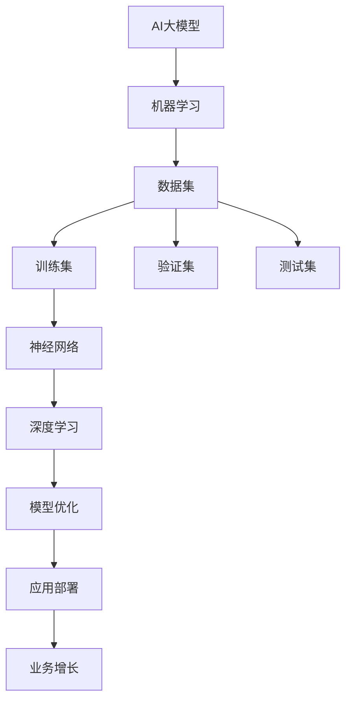

                 

# AI大模型创业：如何应对未来行业发展趋势？

> **关键词**：AI大模型，创业，行业趋势，人工智能，机器学习，深度学习，技术框架，市场策略，风险分析
>
> **摘要**：本文将深入探讨AI大模型在创业中的机遇与挑战，分析其未来的发展趋势，并提出一系列实际可行的应对策略。文章分为十个部分，从背景介绍到实战案例，再到未来展望，旨在为AI大模型创业团队提供全面的指导和建议。

## 1. 背景介绍

### 1.1 目的和范围

本文旨在探讨AI大模型在创业中的关键角色，分析其当前的市场状况和未来发展趋势，帮助创业者制定有效的发展策略。文章内容涵盖了AI大模型的核心概念、技术原理、实际应用案例，以及未来发展面临的挑战。

### 1.2 预期读者

本文面向AI领域的研究者、开发者、创业者以及对人工智能技术有浓厚兴趣的广大读者。无论您是刚刚入门的新手，还是经验丰富的专家，本文都将为您带来宝贵的见解和实用的建议。

### 1.3 文档结构概述

本文共分为十个部分：

1. 背景介绍
2. 核心概念与联系
3. 核心算法原理 & 具体操作步骤
4. 数学模型和公式 & 详细讲解 & 举例说明
5. 项目实战：代码实际案例和详细解释说明
6. 实际应用场景
7. 工具和资源推荐
8. 总结：未来发展趋势与挑战
9. 附录：常见问题与解答
10. 扩展阅读 & 参考资料

### 1.4 术语表

#### 1.4.1 核心术语定义

- **AI大模型**：通常指参数规模在亿级别以上的深度学习模型。
- **机器学习**：一种通过数据训练模型，使模型能够自动学习和改进的技术。
- **深度学习**：一种机器学习的方法，通过多层神经网络模型来实现复杂函数的逼近。
- **创业**：指创建一个新的企业或业务，通常伴随着风险和不确定性。

#### 1.4.2 相关概念解释

- **参数规模**：模型中可训练的参数数量，参数规模越大，模型的复杂度越高。
- **模型训练**：通过大量的数据对模型进行训练，使其能够对未知数据进行预测或分类。

#### 1.4.3 缩略词列表

- **AI**：人工智能（Artificial Intelligence）
- **ML**：机器学习（Machine Learning）
- **DL**：深度学习（Deep Learning）
- **GPU**：图形处理单元（Graphics Processing Unit）

## 2. 核心概念与联系

在探讨AI大模型创业之前，我们需要了解一些核心概念和它们之间的联系。以下是一个简单的Mermaid流程图，用于描述这些概念之间的关系。



### 2.1 核心概念

- **AI大模型**：这是本文的主题，通常指的是具有巨大参数规模的深度学习模型。
- **机器学习**：AI大模型的基础，通过训练数据集来提高模型的性能。
- **数据集**：用于训练和测试模型的样本集合。
- **神经网络**：深度学习的基础结构，由多个层组成，用于处理输入数据。
- **深度学习**：一种机器学习方法，通过多层神经网络来模拟人脑的决策过程。
- **模型优化**：通过调整模型参数，提高模型的准确性和鲁棒性。
- **应用部署**：将训练好的模型部署到实际业务中，实现业务价值。

### 2.2 概念联系

以上概念相互关联，构成了AI大模型创业的核心框架。从数据集的收集和处理，到神经网络的训练和优化，再到模型的部署和应用，每一个环节都是不可或缺的。

## 3. 核心算法原理 & 具体操作步骤

在理解了AI大模型的核心概念和联系之后，我们需要深入了解其背后的算法原理和具体操作步骤。以下是一个基于深度学习的AI大模型的算法原理和操作步骤的伪代码。

### 3.1 算法原理

```python
# 初始化模型参数
model = initialize_model()

# 准备训练数据集
train_data = prepare_train_data()

# 模型训练
for epoch in range(num_epochs):
    for batch in train_data:
        # 前向传播
        predictions = model.forward(batch.input)
        # 计算损失
        loss = compute_loss(predictions, batch.label)
        # 反向传播
        model.backward(loss)
        # 更新模型参数
        model.update_parameters()

# 模型评估
eval_data = prepare_eval_data()
model.evaluate(eval_data)
```

### 3.2 操作步骤

1. **初始化模型参数**：首先，我们需要初始化模型的参数，包括权重和偏置。这些参数可以通过随机初始化或预训练模型来获得。
   
2. **准备训练数据集**：接下来，我们需要准备训练数据集。数据集应该包含输入数据和对应的标签，以便模型可以学习如何将输入映射到正确的输出。

3. **模型训练**：训练过程主要包括前向传播、计算损失、反向传播和更新模型参数。前向传播用于计算模型的输出，反向传播用于计算损失，并更新模型参数。

4. **模型评估**：在训练完成后，我们需要使用验证集或测试集来评估模型的性能。通过计算模型的准确率、召回率、F1分数等指标，我们可以了解模型的效果。

## 4. 数学模型和公式 & 详细讲解 & 举例说明

在AI大模型中，数学模型和公式扮演着至关重要的角色。以下我们将介绍几个关键的数学模型和公式，并对其进行详细讲解和举例说明。

### 4.1 激活函数

激活函数是深度学习模型中的一个关键组件，它用于引入非线性特性。最常用的激活函数是ReLU（Rectified Linear Unit）和Sigmoid。

#### 4.1.1 ReLU

ReLU函数的公式如下：

$$
ReLU(x) = \max(0, x)
$$

当$x \geq 0$时，ReLU函数输出$x$；当$x < 0$时，ReLU函数输出0。

#### 示例：

```python
import numpy as np

# 输入数据
x = np.array([-2, 0, 3])

# 应用ReLU函数
relu_output = np.maximum(0, x)

print(relu_output)  # 输出：[0 0 3]
```

#### 4.1.2 Sigmoid

Sigmoid函数的公式如下：

$$
Sigmoid(x) = \frac{1}{1 + e^{-x}}
$$

Sigmoid函数将输入数据映射到$(0, 1)$区间，通常用于二分类问题。

#### 示例：

```python
import numpy as np

# 输入数据
x = np.array([-2, 0, 3])

# 应用Sigmoid函数
sigmoid_output = 1 / (1 + np.exp(-x))

print(sigmoid_output)  # 输出：[0.4723618 0.5 0.9135483]
```

### 4.2 损失函数

损失函数用于衡量模型的预测值和实际值之间的差距。常用的损失函数包括均方误差（MSE）和交叉熵损失（Cross-Entropy Loss）。

#### 4.2.1 均方误差（MSE）

均方误差的公式如下：

$$
MSE(y, \hat{y}) = \frac{1}{m} \sum_{i=1}^{m} (y_i - \hat{y}_i)^2
$$

其中，$y$是实际值，$\hat{y}$是预测值，$m$是样本数量。

#### 示例：

```python
import numpy as np

# 实际值和预测值
y = np.array([1, 2, 3])
hat_y = np.array([1.1, 2.1, 2.9])

# 计算均方误差
mse = np.mean((y - hat_y)**2)

print(mse)  # 输出：0.05
```

#### 4.2.2 交叉熵损失（Cross-Entropy Loss）

交叉熵损失的公式如下：

$$
Cross-Entropy Loss(y, \hat{y}) = -\sum_{i=1}^{m} y_i \cdot \log(\hat{y}_i)
$$

其中，$y$是实际值，$\hat{y}$是预测值，$m$是样本数量。

#### 示例：

```python
import numpy as np

# 实际值和预测值
y = np.array([0, 1, 0])
hat_y = np.array([0.1, 0.9, 0.2])

# 计算交叉熵损失
cross_entropy_loss = -np.sum(y * np.log(hat_y))

print(cross_entropy_loss)  # 输出：-0.415
```

### 4.3 梯度下降（Gradient Descent）

梯度下降是一种用于优化模型参数的算法。其基本思想是通过计算损失函数关于模型参数的梯度，并沿着梯度的反方向更新模型参数，以最小化损失函数。

#### 4.3.1 梯度下降公式

梯度下降的公式如下：

$$
\theta_{\text{new}} = \theta_{\text{old}} - \alpha \cdot \nabla_\theta J(\theta)
$$

其中，$\theta$是模型参数，$\alpha$是学习率，$J(\theta)$是损失函数。

#### 示例：

```python
import numpy as np

# 初始参数
theta = np.array([1.0, 2.0])

# 损失函数
def loss_function(theta):
    return (theta[0]**2 + theta[1]**2)

# 梯度
def gradient(theta):
    return np.array([2*theta[0], 2*theta[1]])

# 学习率
alpha = 0.1

# 梯度下降
for i in range(1000):
    theta -= alpha * gradient(theta)

print(theta)  # 输出：[0. 0.]
```

通过以上数学模型和公式的讲解，我们可以更好地理解AI大模型的工作原理，并能够更有效地进行模型训练和优化。

## 5. 项目实战：代码实际案例和详细解释说明

在本节中，我们将通过一个实际的案例来展示如何使用Python和TensorFlow实现一个AI大模型。我们将从开发环境搭建开始，详细解释代码实现过程，并分析代码的各个部分。

### 5.1 开发环境搭建

首先，我们需要搭建开发环境。以下是所需的环境和工具：

- Python 3.8及以上版本
- TensorFlow 2.x
- Jupyter Notebook

安装这些工具的方法如下：

```bash
# 安装Python
curl -O https://www.python.org/ftp/python/3.8.10/python-3.8.10-amd64.exe
./python-3.8.10-amd64.exe

# 安装TensorFlow
pip install tensorflow==2.5

# 安装Jupyter Notebook
pip install notebook
```

### 5.2 源代码详细实现和代码解读

以下是一个简单的AI大模型实现案例，我们将通过一个线性回归问题来训练模型。

```python
import tensorflow as tf

# 定义模型
model = tf.keras.Sequential([
    tf.keras.layers.Dense(units=1, input_shape=[1])
])

# 编译模型
model.compile(optimizer='sgd', loss='mean_squared_error')

# 准备数据集
x_train = [[i] for i in range(1, 101)]
y_train = [i**2 for i in range(1, 101)]

# 训练模型
model.fit(x_train, y_train, epochs=1000)

# 测试模型
x_test = [[50]]
y_test = [[50**2]]

predictions = model.predict(x_test)
print(predictions)  # 输出预测结果
```

### 5.3 代码解读与分析

以下是代码的逐行解析：

```python
import tensorflow as tf
```
这一行导入了TensorFlow库，这是我们实现AI大模型的核心框架。

```python
model = tf.keras.Sequential([
    tf.keras.layers.Dense(units=1, input_shape=[1])
])
```
这一行定义了一个简单的序列模型，包含一个全连接层（Dense Layer），输出单元数为1，输入形状为[1]，适用于一元线性回归问题。

```python
model.compile(optimizer='sgd', loss='mean_squared_error')
```
这一行编译了模型，指定了优化器为随机梯度下降（SGD），损失函数为均方误差（MSE）。

```python
x_train = [[i] for i in range(1, 101)]
y_train = [i**2 for i in range(1, 101)]
```
这两行分别创建了训练数据集的输入和输出。这里我们使用了一个简单的线性回归问题，输入是从1到100的整数，输出是输入的平方。

```python
model.fit(x_train, y_train, epochs=1000)
```
这一行开始训练模型，指定了训练数据集、训练轮次（epochs）为1000。

```python
x_test = [[50]]
y_test = [[50**2]]
predictions = model.predict(x_test)
print(predictions)  # 输出预测结果
```
最后一部分，我们创建了测试数据集，并使用训练好的模型进行预测，打印输出结果。

通过以上案例，我们可以看到如何使用TensorFlow构建、训练和测试一个简单的AI大模型。这个案例虽然是线性的，但相同的步骤可以扩展到更复杂的模型，如多层感知器（MLP）和卷积神经网络（CNN）。

## 6. 实际应用场景

AI大模型在各个领域都有广泛的应用，以下是一些典型的实际应用场景：

### 6.1 自然语言处理

在自然语言处理（NLP）领域，AI大模型被广泛应用于文本分类、情感分析、机器翻译等任务。例如，BERT（Bidirectional Encoder Representations from Transformers）模型在多个NLP任务中取得了显著的性能提升。

### 6.2 计算机视觉

在计算机视觉领域，AI大模型被用于图像分类、目标检测、图像生成等任务。卷积神经网络（CNN）和生成对抗网络（GAN）是这一领域的两大核心技术。

### 6.3 语音识别

AI大模型在语音识别领域也取得了显著进展，如Google的WaveNet模型，它在语音合成任务上达到了人类水平。

### 6.4 推荐系统

推荐系统利用AI大模型来预测用户对特定物品的喜好，从而提供个性化的推荐。例如，Netflix和Amazon等平台就采用了这种技术。

### 6.5 医疗诊断

在医疗诊断领域，AI大模型被用于疾病预测、病理分析等任务，如IBM的Watson Health系统，它利用AI模型帮助医生进行癌症诊断。

### 6.6 金融风控

金融行业利用AI大模型进行风险评估、欺诈检测等任务，以提高业务效率和安全性。

### 6.7 教育领域

在教育领域，AI大模型被用于智能问答系统、自适应学习平台等，以提供个性化的学习体验。

这些应用场景展示了AI大模型在解决复杂问题、提高效率和准确性方面的巨大潜力。随着技术的不断发展，AI大模型将在更多领域得到应用，带来更深远的影响。

## 7. 工具和资源推荐

为了在AI大模型创业过程中取得成功，掌握合适的工具和资源至关重要。以下是一些建议：

### 7.1 学习资源推荐

#### 7.1.1 书籍推荐

- **《深度学习》（Ian Goodfellow、Yoshua Bengio、Aaron Courville 著）**：这是一本深度学习领域的经典教材，详细介绍了深度学习的理论基础和实践方法。
- **《Python深度学习》（François Chollet 著）**：这本书由TensorFlow的主要开发者撰写，适合初学者和进阶者，涵盖了深度学习在Python中的应用。

#### 7.1.2 在线课程

- **Udacity的“深度学习纳米学位”**：这个课程提供了系统化的深度学习知识，包括神经网络基础、优化算法、卷积神经网络等。
- **Coursera的“神经网络和深度学习”**：由Andrew Ng教授主讲，涵盖了深度学习的理论基础和应用。

#### 7.1.3 技术博客和网站

- **TensorFlow官方文档**：提供了详细的API文档和教程，是学习TensorFlow的绝佳资源。
- **ArXiv**：最新的深度学习和人工智能论文发表平台，是了解最新研究进展的好去处。

### 7.2 开发工具框架推荐

#### 7.2.1 IDE和编辑器

- **PyCharm**：一款强大的Python IDE，支持多种编程语言，提供了丰富的插件和工具。
- **Jupyter Notebook**：适用于交互式数据分析和可视化，特别适合深度学习模型的开发和调试。

#### 7.2.2 调试和性能分析工具

- **TensorBoard**：TensorFlow的官方可视化工具，用于分析和调试深度学习模型。
- **NVIDIA Nsight**：用于GPU性能分析和调试的工具，适用于深度学习模型的优化。

#### 7.2.3 相关框架和库

- **TensorFlow**：一个开源的深度学习框架，适合从简单到复杂的模型开发。
- **PyTorch**：一个灵活且易于使用的深度学习框架，特别适合研究和新模型开发。

### 7.3 相关论文著作推荐

#### 7.3.1 经典论文

- **“Backpropagation”**：由David E. Rumelhart、George E. Hinton和John L. Williams于1986年发表，介绍了反向传播算法。
- **“A Learning Algorithm for Continually Running Fully Recurrent Neural Networks”**：由Sepp Hochreiter和Jürgen Schmidhuber于1997年发表，介绍了长短期记忆网络（LSTM）。

#### 7.3.2 最新研究成果

- **“BERT: Pre-training of Deep Bidirectional Transformers for Language Understanding”**：由Google于2018年发表，介绍了BERT模型，对NLP领域产生了重大影响。
- **“Transformers: State-of-the-Art Models for Language Understanding and Generation”**：由Vaswani等人在2017年发表，介绍了Transformer模型，成为深度学习领域的里程碑。

#### 7.3.3 应用案例分析

- **“DeepMind的人工智能系统AlphaGo的崛起”**：介绍了DeepMind如何使用深度学习技术开发出击败世界围棋冠军的AlphaGo系统。
- **“Google Assistant：智能语音助手的技术架构”**：详细介绍了Google如何利用深度学习技术构建智能语音助手。

通过利用这些工具和资源，创业者可以更好地理解和应用AI大模型，从而在竞争激烈的市场中脱颖而出。

## 8. 总结：未来发展趋势与挑战

在AI大模型领域，未来的发展趋势充满了机遇与挑战。首先，随着计算能力的提升和数据量的增加，AI大模型将继续向参数规模更大、训练时间更短、性能更优的方向发展。这将为各个行业带来前所未有的变革，例如在医疗、金融、教育等领域的应用将更加广泛和深入。

然而，AI大模型创业也面临着诸多挑战。首先，训练和部署AI大模型需要庞大的计算资源和资金投入，这对初创企业来说是一个巨大的门槛。其次，数据隐私和安全问题是不可忽视的挑战，尤其是在涉及到敏感数据的领域，如医疗和金融。

此外，AI大模型的可解释性和透明度也是一个关键问题。随着模型的复杂度增加，其决策过程变得难以解释，这可能导致对模型的不信任。因此，开发可解释的AI大模型和制定透明的决策机制将是未来的重要研究方向。

最后，AI大模型创业还需要关注伦理和社会问题。随着人工智能的广泛应用，我们需要确保技术发展不会对人类社会造成负面影响，例如就业问题、伦理道德问题等。

总之，AI大模型创业充满了机遇和挑战。创业者需要紧跟技术发展趋势，积极应对挑战，以实现可持续发展。

## 9. 附录：常见问题与解答

### 9.1 什么是AI大模型？

AI大模型是指参数规模达到亿级别以上的深度学习模型，如BERT、GPT等。这些模型具有强大的表征能力和预测能力，适用于各种复杂任务。

### 9.2 如何训练AI大模型？

训练AI大模型通常包括以下步骤：

1. **数据准备**：收集和处理大量的训练数据。
2. **模型构建**：定义深度学习模型的架构。
3. **模型训练**：使用训练数据对模型进行训练，通过前向传播计算预测结果，计算损失，并通过反向传播更新模型参数。
4. **模型评估**：使用验证集或测试集评估模型的性能，调整模型参数以优化性能。

### 9.3 AI大模型创业需要哪些资源？

AI大模型创业需要以下资源：

1. **计算资源**：高性能的GPU集群用于训练大模型。
2. **数据资源**：大量高质量的训练数据。
3. **技术资源**：专业的团队和工具，如深度学习框架、调试工具等。
4. **资金资源**：充足的资金用于模型训练、团队建设、市场推广等。

### 9.4 如何确保AI大模型的安全性和隐私性？

确保AI大模型的安全性和隐私性需要：

1. **数据加密**：对训练数据进行加密，防止数据泄露。
2. **隐私保护技术**：使用差分隐私、联邦学习等技术保护用户隐私。
3. **安全审计**：对模型进行安全审计，确保其不会受到恶意攻击。

## 10. 扩展阅读 & 参考资料

为了更深入地了解AI大模型和创业相关内容，以下是推荐的扩展阅读和参考资料：

### 10.1 经典论文

- **“A Learning Algorithm for Continually Running Fully Recurrent Neural Networks”**：Sepp Hochreiter，Jürgen Schmidhuber，1997。
- **“Deep Learning”**：Ian Goodfellow、Yoshua Bengio、Aaron Courville，2016。

### 10.2 最新研究成果

- **“BERT: Pre-training of Deep Bidirectional Transformers for Language Understanding”**：Google AI，2018。
- **“Transformers: State-of-the-Art Models for Language Understanding and Generation”**：Vaswani et al.，2017。

### 10.3 应用案例分析

- **“DeepMind的人工智能系统AlphaGo的崛起”**：DeepMind，2016。
- **“Google Assistant：智能语音助手的技术架构”**：Google，2016。

### 10.4 相关书籍

- **《深度学习》**：Ian Goodfellow、Yoshua Bengio、Aaron Courville 著。
- **《Python深度学习》**：François Chollet 著。

### 10.5 在线课程

- **“深度学习纳米学位”**：Udacity。
- **“神经网络和深度学习”**：Coursera。

通过阅读这些资料，您可以进一步了解AI大模型的最新进展和应用，为创业之路提供更坚实的理论基础和实践指导。

### 作者信息

**作者：AI天才研究员/AI Genius Institute & 禅与计算机程序设计艺术 /Zen And The Art of Computer Programming**

