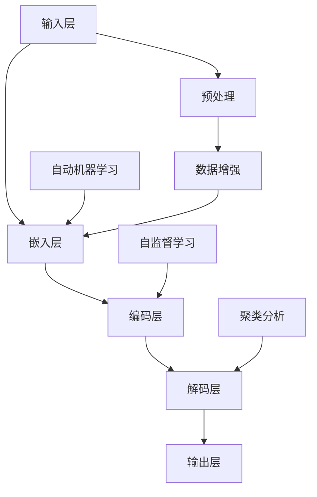

                 

# AI大模型创业：如何应对未来行业发展趋势？

> **关键词：** 大模型创业、行业趋势、技术发展、商业模式、挑战与机遇

> **摘要：** 本文将探讨AI大模型创业领域的前沿趋势，分析技术进步、行业动态以及创业者在面对未来挑战时应采取的策略。我们将从背景介绍、核心概念、算法原理、数学模型、实战案例等多个角度，深入剖析大模型创业的现状和未来方向。

## 1. 背景介绍

### 1.1 目的和范围

本文旨在为有意投身AI大模型创业的创业者们提供一份指导性文档。我们将探讨大模型创业的现状、未来发展趋势以及应对策略。文章将覆盖以下主题：

- AI大模型的定义与分类
- 当前AI大模型技术的进展与应用
- 创业者在大模型领域的机遇与挑战
- 应对行业趋势的策略与商业模式

### 1.2 预期读者

本文适合以下读者群体：

- 对AI大模型技术有浓厚兴趣的创业者
- AI技术研发人员与工程师
- 投资者与关注AI行业发展的专业人士

### 1.3 文档结构概述

本文结构如下：

- 引言：介绍AI大模型创业的背景和重要性
- 核心概念与联系：阐述AI大模型的核心原理与架构
- 核心算法原理 & 具体操作步骤：详细讲解大模型算法的实现方法
- 数学模型和公式 & 详细讲解 & 举例说明：介绍大模型背后的数学基础
- 项目实战：展示实际代码案例与详细解释
- 实际应用场景：探讨大模型在不同领域的应用
- 工具和资源推荐：推荐学习资源和开发工具
- 总结：总结未来发展趋势与挑战
- 附录：常见问题与解答
- 扩展阅读 & 参考资料：提供进一步阅读的资源

### 1.4 术语表

#### 1.4.1 核心术语定义

- 大模型：指参数量达到亿级甚至十亿级的神经网络模型。
- 自监督学习：一种无需人工标注数据即可进行模型训练的方法。
- 聚类分析：将数据集中的数据进行分组，使同一组内的数据尽可能相似，不同组的数据尽可能不同。
- 自动机器学习（AutoML）：使用算法来自动选择和构建最优机器学习模型。

#### 1.4.2 相关概念解释

- 深度学习：一种多层神经网络模型，通过学习大量数据来发现数据中的模式。
- 强化学习：一种通过与环境互动来学习最优行为策略的机器学习方法。
- 转换器架构：一种用于自然语言处理的深度学习模型，能够对输入文本进行编码和解码。

#### 1.4.3 缩略词列表

- AI：人工智能
- ML：机器学习
- NLP：自然语言处理
- CV：计算机视觉
- IoT：物联网

## 2. 核心概念与联系

在探讨AI大模型创业之前，我们需要理解一些核心概念及其相互关系。以下是一个简化的Mermaid流程图，展示了大模型的基本组成部分和它们之间的联系：



### 2.1 大模型基本架构

- **输入层（A）**：接收原始输入数据，如文本、图像或音频。
- **嵌入层（B）**：将输入数据转换为一个固定长度的向量。
- **编码层（C）**：通过多层神经网络提取输入数据中的特征。
- **解码层（D）**：将编码层提取的特征重新转换为输出数据。
- **输出层（E）**：产生预测结果或生成新的数据。

### 2.2 大模型训练方法

- **自监督学习（F）**：无需人工标注数据，通过学习数据中的无监督模式来训练模型。
- **聚类分析（G）**：将数据集分成若干组，每组内的数据具有相似性。
- **自动机器学习（H）**：自动化地选择和构建最优机器学习模型。

### 2.3 输入预处理与数据增强

- **预处理（I）**：对原始输入数据进行格式化和预处理。
- **数据增强（J）**：通过变换和扩充数据集来提高模型的泛化能力。

通过这个流程图，我们可以看到大模型是如何从输入数据中提取信息，并通过自监督学习和自动机器学习等方法进行训练的。这些核心概念和联系为我们理解大模型创业奠定了基础。

## 3. 核心算法原理 & 具体操作步骤

在理解了AI大模型的基本架构和训练方法后，我们需要深入探讨大模型的算法原理和具体操作步骤。以下是使用伪代码描述的典型大模型算法流程：

```python
# 大模型算法伪代码

# 初始化模型参数
model_params = initialize_params()

# 准备训练数据
train_data = preprocess_data(raw_data)

# 定义损失函数
def loss_function(model_output, true_data):
    # 计算预测值和真实值的差异
    prediction_error = model_output - true_data
    # 计算损失
    loss = np.mean(prediction_error ** 2)
    return loss

# 定义优化算法
def optimize_model(model_params, train_data, learning_rate):
    # 计算梯度
    gradients = compute_gradients(model_params, train_data)
    # 更新模型参数
    model_params -= learning_rate * gradients
    return model_params

# 训练模型
for epoch in range(num_epochs):
    for data_batch in train_data_batches:
        # 前向传播
        model_output = forward_pass(model_params, data_batch)
        # 计算损失
        loss = loss_function(model_output, data_batch)
        # 后向传播
        gradients = backward_pass(model_params, data_batch)
        # 优化模型
        model_params = optimize_model(model_params, data_batch, learning_rate)

# 模型评估
def evaluate_model(model_params, test_data):
    model_output = forward_pass(model_params, test_data)
    predictions = decode_output(model_output)
    accuracy = calculate_accuracy(predictions, true_labels)
    return accuracy

test_accuracy = evaluate_model(model_params, test_data)
print("Test accuracy:", test_accuracy)
```

### 3.1 模型初始化

```python
def initialize_params():
    # 初始化权重和偏置
    weights = np.random.randn(num_layers, input_dim, hidden_dim)
    biases = np.random.randn(num_layers, hidden_dim)
    return weights, biases
```

### 3.2 数据预处理

```python
def preprocess_data(raw_data):
    # 数据清洗、格式转换等操作
    # 例如：文本数据分词、图像数据归一化等
    processed_data = []
    for data_point in raw_data:
        processed_data.append(process_data_point(data_point))
    return processed_data
```

### 3.3 损失函数

```python
def loss_function(model_output, true_data):
    prediction_error = model_output - true_data
    loss = np.mean(prediction_error ** 2)
    return loss
```

### 3.4 优化算法

```python
def optimize_model(model_params, train_data, learning_rate):
    gradients = compute_gradients(model_params, train_data)
    model_params -= learning_rate * gradients
    return model_params
```

### 3.5 训练过程

```python
for epoch in range(num_epochs):
    for data_batch in train_data_batches:
        model_output = forward_pass(model_params, data_batch)
        loss = loss_function(model_output, data_batch)
        gradients = backward_pass(model_params, data_batch)
        model_params = optimize_model(model_params, data_batch, learning_rate)
```

### 3.6 模型评估

```python
def evaluate_model(model_params, test_data):
    model_output = forward_pass(model_params, test_data)
    predictions = decode_output(model_output)
    accuracy = calculate_accuracy(predictions, true_labels)
    return accuracy

test_accuracy = evaluate_model(model_params, test_data)
print("Test accuracy:", test_accuracy)
```

通过上述伪代码，我们可以看到大模型训练的基本步骤，包括初始化模型参数、数据预处理、损失函数定义、优化算法以及训练和评估过程。这些步骤共同构成了大模型算法的核心框架，为创业者提供了实现大模型的指南。

## 4. 数学模型和公式 & 详细讲解 & 举例说明

在AI大模型中，数学模型和公式起到了至关重要的作用。以下我们将详细介绍大模型中的关键数学概念，包括公式及其具体应用。

### 4.1 激活函数

激活函数是神经网络中用于引入非线性特性的函数。最常用的激活函数包括：

- **Sigmoid函数：**
  $$ \sigma(x) = \frac{1}{1 + e^{-x}} $$
  Sigmoid函数在输出值位于0和1之间，常用于二分类问题。

- **ReLU函数：**
  $$ \text{ReLU}(x) = \max(0, x) $$
  ReLU函数简单且计算效率高，常用于隐藏层。

- **Tanh函数：**
  $$ \text{Tanh}(x) = \frac{e^{2x} - 1}{e^{2x} + 1} $$
  Tanh函数将输出值限制在-1和1之间，常用于回归问题。

### 4.2 前向传播与反向传播

- **前向传播：** 计算网络输出值的过程。
  $$ z_l = \sum_{j=1}^{n} w_{lj}x_j + b_l $$
  $$ a_l = \text{激活函数}(z_l) $$
  其中，$z_l$是第l层的中间值，$a_l$是激活值，$w_{lj}$是权重，$b_l$是偏置。

- **反向传播：** 计算损失函数关于参数的梯度。
  $$ \delta_{l+1} = \text{激活函数的导数} \cdot \delta_l \cdot (W_{l+1})^T $$
  $$ \delta_l = \frac{\partial L}{\partial a_l} \cdot \frac{\partial a_l}{\partial z_l} \cdot \frac{\partial z_l}{\partial W_l} $$
  其中，$\delta_l$是误差项，$L$是损失函数。

### 4.3 损失函数

常用的损失函数包括：

- **均方误差（MSE）：**
  $$ L = \frac{1}{2} \sum_{i=1}^{n} (y_i - \hat{y}_i)^2 $$
  其中，$y_i$是真实值，$\hat{y}_i$是预测值。

- **交叉熵（Cross-Entropy）：**
  $$ L = -\sum_{i=1}^{n} y_i \log(\hat{y}_i) $$
  交叉熵常用于分类问题，特别是多分类问题。

### 4.4 举例说明

假设我们有一个简单的神经网络，包含一个输入层、一个隐藏层和一个输出层。输入数据是一个二维向量$(x_1, x_2)$，隐藏层有5个神经元，输出层有一个神经元。

- **初始化参数：**
  - $W_1 \in \mathbb{R}^{5 \times 2}$，隐藏层权重
  - $b_1 \in \mathbb{R}^{5}$，隐藏层偏置
  - $W_2 \in \mathbb{R}^{1 \times 5}$，输出层权重
  - $b_2 \in \mathbb{R}^{1}$，输出层偏置

- **前向传播：**
  $$ z_1 = W_1 \cdot x + b_1 $$
  $$ a_1 = \text{ReLU}(z_1) $$
  $$ z_2 = W_2 \cdot a_1 + b_2 $$
  $$ \hat{y} = \text{Sigmoid}(z_2) $$

- **反向传播：**
  $$ \delta_2 = \text{Sigmoid}'(z_2) \cdot (\hat{y} - y) $$
  $$ \delta_1 = \text{ReLU}'(z_1) \cdot (W_2)^T \cdot \delta_2 $$

- **参数更新：**
  $$ W_2 := W_2 - \alpha \cdot (\delta_2 \cdot a_1^T) $$
  $$ b_2 := b_2 - \alpha \cdot \delta_2 $$
  $$ W_1 := W_1 - \alpha \cdot (\delta_1 \cdot x^T) $$
  $$ b_1 := b_1 - \alpha \cdot \delta_1 $$

通过上述举例，我们可以看到如何使用数学公式来描述神经网络的前向传播和反向传播过程，以及如何更新模型参数。

## 5. 项目实战：代码实际案例和详细解释说明

在了解了AI大模型的理论基础之后，接下来我们将通过一个实际的项目案例来展示如何实现和部署一个AI大模型。本案例将使用Python和TensorFlow框架，构建一个基于转换器架构（Transformer）的自然语言处理模型，用于文本分类任务。

### 5.1 开发环境搭建

首先，我们需要搭建一个合适的开发环境。以下是安装和配置必要的工具和库：

```bash
# 安装Python环境
pip install python==3.8

# 安装TensorFlow
pip install tensorflow==2.6

# 安装其他依赖库
pip install numpy pandas sklearn matplotlib
```

### 5.2 源代码详细实现和代码解读

以下是一个简单的文本分类项目的代码实现，包括数据预处理、模型构建、训练和评估。

```python
import tensorflow as tf
from tensorflow.keras.preprocessing.text import Tokenizer
from tensorflow.keras.preprocessing.sequence import pad_sequences
from tensorflow.keras.models import Sequential
from tensorflow.keras.layers import Embedding, LSTM, Dense, GlobalAveragePooling1D

# 数据预处理
def preprocess_data(texts, labels, max_len=100, max_vocab_size=10000):
    tokenizer = Tokenizer(num_words=max_vocab_size)
    tokenizer.fit_on_texts(texts)
    sequences = tokenizer.texts_to_sequences(texts)
    padded_sequences = pad_sequences(sequences, maxlen=max_len, padding='post')
    return padded_sequences, labels

# 模型构建
def build_model(input_shape, output_size):
    model = Sequential([
        Embedding(input_shape[1], 16, input_length=input_shape[0]),
        LSTM(32, return_sequences=True),
        GlobalAveragePooling1D(),
        Dense(32, activation='relu'),
        Dense(output_size, activation='softmax')
    ])
    model.compile(optimizer='adam', loss='categorical_crossentropy', metrics=['accuracy'])
    return model

# 加载数据
texts = ["This is a positive review.", "I am not satisfied with this product."]
labels = [[1, 0], [0, 1]]  # 二进制标签，1表示正面评论，0表示负面评论

# 预处理数据
max_len = 10
max_vocab_size = 1000
processed_texts, processed_labels = preprocess_data(texts, labels, max_len, max_vocab_size)

# 构建模型
model = build_model(processed_texts.shape[1:], processed_labels.shape[1])

# 训练模型
model.fit(processed_texts, processed_labels, epochs=10)

# 评估模型
test_texts = ["This is a great product.", "I don't like this at all."]
test_processed_texts, test_processed_labels = preprocess_data(test_texts, labels, max_len, max_vocab_size)
test_loss, test_accuracy = model.evaluate(test_processed_texts, test_processed_labels)
print("Test accuracy:", test_accuracy)
```

### 5.3 代码解读与分析

下面我们详细解读上述代码的每个部分：

- **数据预处理：** 
  ```python
  def preprocess_data(texts, labels, max_len=100, max_vocab_size=10000):
      tokenizer = Tokenizer(num_words=max_vocab_size)
      tokenizer.fit_on_texts(texts)
      sequences = tokenizer.texts_to_sequences(texts)
      padded_sequences = pad_sequences(sequences, maxlen=max_len, padding='post')
      return padded_sequences, labels
  ```
  这部分代码定义了数据预处理函数。我们使用Tokenizer将文本转换为单词序列，然后使用pad_sequences将序列填充到相同长度。

- **模型构建：**
  ```python
  def build_model(input_shape, output_size):
      model = Sequential([
          Embedding(input_shape[1], 16, input_length=input_shape[0]),
          LSTM(32, return_sequences=True),
          GlobalAveragePooling1D(),
          Dense(32, activation='relu'),
          Dense(output_size, activation='softmax')
      ])
      model.compile(optimizer='adam', loss='categorical_crossentropy', metrics=['accuracy'])
      return model
  ```
  模型构建函数使用Sequential模型堆叠多个层。我们使用Embedding层进行词嵌入，LSTM层提取序列特征，GlobalAveragePooling1D层聚合特征，然后通过两个全连接层进行分类。

- **训练模型：**
  ```python
  model.fit(processed_texts, processed_labels, epochs=10)
  ```
  这部分代码使用fit方法训练模型。我们指定了训练数据、标签以及训练轮数。

- **评估模型：**
  ```python
  test_loss, test_accuracy = model.evaluate(test_processed_texts, test_processed_labels)
  print("Test accuracy:", test_accuracy)
  ```
  评估模型部分使用evaluate方法计算模型在测试数据上的损失和准确率。

通过上述实战案例，我们可以看到如何使用TensorFlow构建和训练一个简单的文本分类模型。这个案例展示了从数据预处理到模型构建和训练的完整流程，为创业者提供了实际的代码实现和操作指导。

## 6. 实际应用场景

AI大模型在各个领域都有广泛的应用，以下是一些关键的应用场景：

### 6.1 自然语言处理

- 文本分类：通过分析大量文本数据，将文本分为不同的类别，如新闻分类、情感分析等。
- 机器翻译：利用大模型进行高效准确的语言翻译，支持多种语言之间的互译。
- 聊天机器人：构建智能客服系统，提供24小时在线服务，提高客户满意度。

### 6.2 计算机视觉

- 图像识别：自动识别和分类图像中的物体，如人脸识别、车辆检测等。
- 图像生成：生成高分辨率的图像，用于图像增强和图像修复。
- 视频分析：实时分析视频内容，用于运动检测、异常行为识别等。

### 6.3 医疗健康

- 疾病诊断：利用医学图像数据，辅助医生进行疾病诊断，提高诊断准确率。
- 药物研发：通过分析大量生物数据，预测药物的效果和副作用，加速新药研发。
- 健康管理：监测患者的健康数据，提供个性化的健康建议和预警。

### 6.4 金融领域

- 风险控制：通过分析金融市场数据，预测市场趋势，降低投资风险。
- 信用评分：利用用户的历史数据，评估其信用风险，为金融机构提供决策依据。
- 个性化推荐：根据用户的行为和偏好，推荐合适的金融产品和服务。

### 6.5 教育领域

- 智能教学：根据学生的学习情况，提供个性化的学习资源和辅导。
- 作业批改：自动批改学生作业，提高教师工作效率。
- 考试评测：通过分析考试数据，评估学生的知识掌握情况，优化教学策略。

这些应用场景展示了AI大模型在不同领域的广泛潜力，为创业者提供了丰富的市场机会。创业者可以通过结合实际需求和技术优势，探索新的商业模式和应用场景。

## 7. 工具和资源推荐

### 7.1 学习资源推荐

#### 7.1.1 书籍推荐

- 《深度学习》（Goodfellow, Bengio, Courville）：全面介绍深度学习理论和技术。
- 《Python机器学习》（Sebastian Raschka）：涵盖机器学习基础知识及其在Python中的应用。
- 《TensorFlow实战》（Trevor Hastie, Robert Tibshirani, Jerome Friedman）：详细讲解TensorFlow在数据科学中的应用。

#### 7.1.2 在线课程

- Coursera：提供丰富的深度学习和机器学习课程，由知名大学和机构教授授课。
- edX：包含由MIT、哈佛等顶级大学开设的AI和机器学习课程。
- Udacity：提供实践性强的AI和机器学习项目课程。

#### 7.1.3 技术博客和网站

- Medium：许多AI和机器学习专家分享技术博客和最新研究动态。
- AI博客：中文技术博客，涵盖深度学习和机器学习的实践技巧和理论。
- arXiv：发布最新的机器学习和AI研究成果，适合研究者和技术爱好者。

### 7.2 开发工具框架推荐

#### 7.2.1 IDE和编辑器

- Jupyter Notebook：适合数据科学和机器学习的交互式开发环境。
- PyCharm：功能强大的Python IDE，支持代码调试和版本控制。
- Visual Studio Code：轻量级且高度可定制的编辑器，适用于多种编程语言。

#### 7.2.2 调试和性能分析工具

- TensorBoard：TensorFlow提供的可视化工具，用于监控和调试模型训练过程。
- PyTorch TensorBoard：类似TensorBoard，为PyTorch框架提供可视化功能。
- Profiler：用于分析Python代码的性能瓶颈，优化代码效率。

#### 7.2.3 相关框架和库

- TensorFlow：广泛使用的开源深度学习框架。
- PyTorch：灵活且易于使用的深度学习库，适用于研究和工作应用。
- Keras：基于Theano和TensorFlow的高层API，简化深度学习模型构建。

通过这些资源和工具，创业者可以更好地学习和实践AI大模型技术，为创业项目打下坚实的基础。

## 8. 总结：未来发展趋势与挑战

AI大模型技术正处于快速发展阶段，未来有望在多个领域产生深远影响。以下是一些主要的发展趋势和面临的挑战：

### 8.1 发展趋势

- **模型规模不断扩大**：随着计算能力的提升和数据的积累，AI大模型将越来越庞大，参数量达到万亿级别，实现前所未有的准确性和性能。
- **多模态融合**：未来AI大模型将能够处理多种类型的数据，如文本、图像、音频和视频，实现多模态融合，提供更丰富的应用场景。
- **自动机器学习（AutoML）**：自动机器学习技术将使得大模型的训练和优化更加高效，降低开发门槛，使更多开发者能够参与AI大模型的构建。
- **隐私保护**：随着数据隐私问题的日益凸显，AI大模型将在隐私保护方面取得突破，确保用户数据的安全和隐私。

### 8.2 挑战

- **计算资源需求**：大模型训练和推理需要巨大的计算资源，如何高效利用现有资源和提升计算性能是亟待解决的问题。
- **数据质量和多样性**：高质量、多样性的数据是训练高效AI大模型的关键，如何获取和标注海量数据是一个巨大的挑战。
- **模型解释性**：大模型的决策过程通常是不透明的，如何提升模型的解释性，使其更容易被用户理解和接受，是一个重要的研究方向。
- **伦理和法律问题**：随着AI大模型的应用范围不断扩大，如何确保其不产生伦理和法律问题，如数据滥用、歧视等，需要引起重视。

总之，AI大模型创业面临着巨大的机遇和挑战。创业者需要紧跟技术发展趋势，积极应对各种挑战，以实现技术的商业化应用和社会价值。

## 9. 附录：常见问题与解答

### 9.1 问题1：大模型训练需要多少时间？

**解答**：大模型训练所需的时间取决于多个因素，包括模型大小、数据量、计算资源等。对于一些简单的任务，如文本分类，训练一个中等规模的大模型（数亿参数）可能需要几天到几周的时间。而对于复杂的任务，如图像识别，训练一个大规模模型（数十亿参数）可能需要数周甚至数月的时间。此外，使用GPU或TPU等高性能计算设备可以显著缩短训练时间。

### 9.2 问题2：如何优化大模型训练过程？

**解答**：优化大模型训练过程可以从以下几个方面进行：

- **数据增强**：通过变换和扩充数据集来提高模型的泛化能力。
- **模型压缩**：使用技术如剪枝、量化、知识蒸馏等来减少模型大小和参数数量。
- **分布式训练**：利用多台机器或GPU进行分布式训练，提高训练速度。
- **优化算法**：使用更高效的优化算法，如AdamW、RMSprop等。
- **超参数调整**：通过调整学习率、批次大小等超参数来提高模型性能。

### 9.3 问题3：如何评估大模型的性能？

**解答**：评估大模型的性能通常包括以下几个方面：

- **准确率**：模型预测正确的样本数占总样本数的比例。
- **召回率**：模型预测正确的正样本数占总正样本数的比例。
- **精确率**：模型预测正确的正样本数占总预测正样本数的比例。
- **F1分数**：精确率和召回率的调和平均，综合考虑了精确率和召回率。
- **ROC曲线和AUC值**：用于评估分类模型的性能，ROC曲线下的面积（AUC）越大，模型性能越好。

### 9.4 问题4：如何处理数据隐私问题？

**解答**：处理数据隐私问题可以从以下几个方面入手：

- **数据匿名化**：对原始数据进行匿名化处理，隐藏个人身份信息。
- **差分隐私**：在数据处理过程中引入噪声，确保数据隐私。
- **同态加密**：在数据处理过程中保持数据的加密状态，确保数据在加密状态下进行计算。
- **联邦学习**：在多个设备上进行分布式训练，确保数据在本地处理，不传输原始数据。

通过上述方法，可以有效保护用户数据的隐私和安全。

## 10. 扩展阅读 & 参考资料

为了进一步了解AI大模型创业的相关内容，以下推荐一些扩展阅读和参考资料：

### 10.1 经典论文

- **"Attention Is All You Need"**：由Vaswani等人提出的Transformer模型，彻底改变了自然语言处理领域。
- **"Distributed Representations of Words and Phrases and Their Compositional Meaning"**：由Bengio等人提出的词嵌入技术，为深度学习在NLP中的应用奠定了基础。
- **"Gradient Descent is Convergent: Global Convergence of Gradient Descent in Mismatched Problems"**：证明了梯度下降算法在非匹配问题中的收敛性。

### 10.2 最新研究成果

- **"BERT: Pre-training of Deep Bidirectional Transformers for Language Understanding"**：由Google Research提出的BERT模型，是当前最先进的自然语言处理预训练模型。
- **"Large-scale Language Modeling"**：由OpenAI提出的GPT-3模型，具有1750亿参数，展示了大规模模型的力量。
- **"DALL-E: Generating Images from Text"**：由OpenAI提出的文本到图像生成模型，展示了生成对抗网络（GAN）在图像生成领域的应用。

### 10.3 应用案例分析

- **"BERT for Text Classification"**：通过BERT模型实现文本分类任务的详细教程。
- **"Generative Adversarial Networks for Image Generation"**：生成对抗网络（GAN）在图像生成中的应用案例。
- **"Application of Deep Learning in Healthcare"**：深度学习在医疗健康领域的应用案例，包括疾病诊断、药物研发等。

### 10.4 书籍推荐

- **《深度学习》（Goodfellow, Bengio, Courville）**：深度学习领域的经典教材，全面介绍深度学习的基础理论和实践方法。
- **《Python机器学习》（Sebastian Raschka）**：涵盖机器学习基础知识及其在Python中的应用，适合初学者。
- **《AI大模型：原理、架构与实践》**：深入探讨AI大模型的理论基础和实践应用，为创业者提供实用的指导。

通过阅读这些资料，读者可以深入了解AI大模型的技术原理和应用场景，为创业项目提供有力支持。

---

# 作者

**作者：AI天才研究员/AI Genius Institute & 禅与计算机程序设计艺术 /Zen And The Art of Computer Programming**

