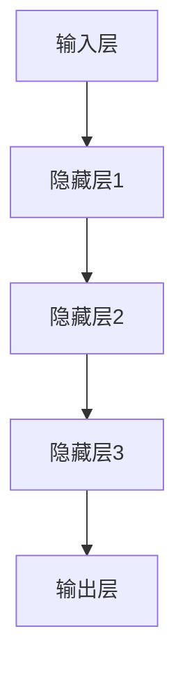
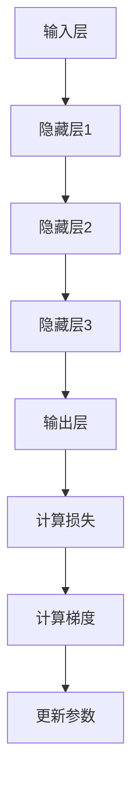

                 

# AI大模型创业：如何打造未来爆款应用？

## 关键词
AI大模型，创业，应用场景，核心算法，数学模型，项目实战，开发工具，资源推荐

## 摘要
本文旨在探讨AI大模型在创业中的应用，通过详细解析核心算法原理、数学模型和具体操作步骤，提供一套系统性的指导，帮助创业者打造出具有市场潜力的AI大模型应用。本文将围绕背景介绍、核心概念与联系、算法原理、数学模型、项目实战、应用场景、工具和资源推荐以及未来发展趋势与挑战等方面展开，旨在为创业者提供实用的参考和方向。

## 1. 背景介绍

### 1.1 目的和范围
随着人工智能技术的快速发展，AI大模型在各个领域展现出巨大的潜力，成为创业者的关注焦点。本文的目标是帮助创业者深入了解AI大模型的核心技术，掌握打造未来爆款应用的方法和策略。本文将涵盖以下几个主要方面：
- AI大模型的基础知识和核心概念
- AI大模型的关键算法原理和数学模型
- AI大模型的项目实战案例分析
- AI大模型在不同应用场景中的实践与挑战
- 开发AI大模型的工具和资源推荐

### 1.2 预期读者
本文面向有一定AI技术基础的创业者、工程师和研究人员。读者应该具备以下基本条件：
- 了解机器学习和深度学习的基础知识
- 熟悉Python编程语言
- 对AI大模型的概念和应用有所了解

### 1.3 文档结构概述
本文分为以下几个主要部分：
- 背景介绍：介绍AI大模型的发展背景和本文的目的与范围
- 核心概念与联系：介绍AI大模型的核心概念、原理和架构
- 核心算法原理 & 具体操作步骤：详细解析AI大模型的关键算法原理和具体实现步骤
- 数学模型和公式 & 详细讲解 & 举例说明：介绍AI大模型的数学模型，并通过示例进行详细讲解
- 项目实战：提供实际的代码案例，展示AI大模型的应用
- 实际应用场景：探讨AI大模型在不同领域的应用场景
- 工具和资源推荐：推荐学习资源、开发工具和框架
- 未来发展趋势与挑战：展望AI大模型的发展趋势和面临的挑战
- 附录：常见问题与解答
- 扩展阅读 & 参考资料：提供相关文献和资源，供读者进一步学习

### 1.4 术语表

#### 1.4.1 核心术语定义
- AI大模型：指具有大规模参数、复杂结构和强大计算能力的深度学习模型
- 机器学习：一种人工智能技术，通过算法和统计方法从数据中学习规律和模式
- 深度学习：一种机器学习技术，通过多层神经网络模拟人类大脑的学习过程
- 优化算法：用于调整模型参数，提高模型性能的方法
- 训练数据集：用于训练模型的输入数据和对应的标签
- 验证数据集：用于评估模型性能的数据集
- 测试数据集：用于最终评估模型性能的数据集

#### 1.4.2 相关概念解释
- 前向传播：在神经网络中，输入数据经过层与层的传递，最终生成输出结果的过程
- 反向传播：在神经网络中，通过计算损失函数关于参数的梯度，反向调整模型参数的过程
- 损失函数：用于衡量模型预测结果与真实结果之间的差距的函数
- 正则化：用于防止模型过拟合的方法，通过在损失函数中添加正则项来实现
- 交叉验证：一种评估模型性能的方法，通过将数据集划分为训练集和验证集，多次训练和验证来评估模型性能

#### 1.4.3 缩略词列表
- AI：人工智能（Artificial Intelligence）
- ML：机器学习（Machine Learning）
- DL：深度学习（Deep Learning）
- GPU：图形处理器（Graphics Processing Unit）
- CPU：中央处理器（Central Processing Unit）
- CNN：卷积神经网络（Convolutional Neural Network）
- RNN：循环神经网络（Recurrent Neural Network）
- LSTM：长短期记忆网络（Long Short-Term Memory Network）

## 2. 核心概念与联系

### 2.1 AI大模型的概念
AI大模型（AI Large Model）是指具有大规模参数、复杂结构和强大计算能力的深度学习模型。这些模型通常需要大量的训练数据和计算资源来训练和优化。与传统的中小规模模型相比，AI大模型具有以下几个特点：

1. **参数规模大**：AI大模型通常具有数十亿甚至数万亿个参数，这使它们能够学习复杂的特征和模式。
2. **计算复杂度高**：由于参数规模大，AI大模型的计算复杂度也相应提高，需要更强大的计算资源和更高效的计算算法。
3. **模型结构复杂**：AI大模型通常采用多层的神经网络结构，包括卷积层、全连接层、循环层等，这使得模型能够处理更复杂的任务。
4. **适用范围广**：AI大模型适用于各种领域的任务，如图像识别、自然语言处理、语音识别、推荐系统等。

### 2.2 AI大模型的架构
AI大模型的架构通常包括以下几个主要部分：

1. **输入层**：接收外部输入的数据，如图像、文本、音频等。
2. **隐藏层**：包含多个隐藏层，每个隐藏层通过前一层的数据计算得到，并传递给下一层。
3. **输出层**：根据模型的任务生成输出结果，如分类标签、概率分布等。

#### 2.2.1 Mermaid流程图



### 2.3 AI大模型的工作原理

#### 2.3.1 前向传播
在前向传播过程中，输入数据从输入层经过隐藏层，最终传递到输出层，生成预测结果。具体步骤如下：

1. **初始化参数**：根据模型的架构和任务，初始化模型的参数（权重和偏置）。
2. **计算中间层输出**：从输入层开始，将输入数据传递到每个隐藏层，通过前一层的数据和当前层的权重计算得到当前层的输出。
3. **传递输出**：将每个隐藏层的输出传递给下一层，直到输出层生成最终的预测结果。

#### 2.3.2 反向传播
在反向传播过程中，计算损失函数关于参数的梯度，并通过梯度下降等优化算法调整参数，以降低损失函数的值。具体步骤如下：

1. **计算损失**：计算输出结果与真实结果之间的差距，得到损失值。
2. **计算梯度**：通过反向传播算法，计算损失函数关于每个参数的梯度。
3. **更新参数**：利用梯度下降等优化算法，根据梯度更新模型的参数。

#### 2.3.3 Mermaid流程图



## 3. 核心算法原理 & 具体操作步骤

### 3.1 前向传播算法原理

前向传播算法是深度学习模型的基础，通过逐步计算每一层的输出，最终得到模型的预测结果。以下是前向传播算法的伪代码：

```python
def forward_propagation(x, weights, biases):
    # 初始化中间变量
    a = x
    z = []

    # 遍历每一层
    for layer in range(num_layers - 1):
        # 计算当前层的输出
        z.append((np.dot(a, weights[layer]) + biases[layer]))

        # 更新激活函数
        a = activation(z[layer])

    # 返回最后一层的输出
    return a
```

### 3.2 反向传播算法原理

反向传播算法用于计算损失函数关于模型参数的梯度，并通过梯度下降等优化算法更新参数。以下是反向传播算法的伪代码：

```python
def backward_propagation(x, y, a, weights, biases, learning_rate):
    # 初始化中间变量
    delta = []

    # 遍历每一层，从输出层开始
    for layer in reversed(range(num_layers - 1)):
        # 计算当前层的误差
        if layer == num_layers - 2:
            # 输出层误差计算
            delta.append((a[layer] - y) * activation_derivative(a[layer]))
        else:
            # 隐藏层误差计算
            delta.append((np.dot(delta[layer + 1], weights[layer + 1].T) * activation_derivative(a[layer])))

    # 计算梯度
    d_weights = []
    d_biases = []
    for layer in range(num_layers - 1):
        d_weights.append(np.dot(z[layer].T, delta[layer]))
        d_biases.append(np.sum(delta[layer]))

    # 更新参数
    weights -= learning_rate * d_weights
    biases -= learning_rate * d_biases

    return weights, biases
```

### 3.3 梯度下降优化算法原理

梯度下降是一种优化算法，通过计算损失函数关于参数的梯度，并沿着梯度方向更新参数，以降低损失函数的值。以下是梯度下降优化算法的伪代码：

```python
def gradient_descent(x, y, weights, biases, learning_rate, num_iterations):
    for iteration in range(num_iterations):
        # 前向传播
        a = forward_propagation(x, weights, biases)
        
        # 计算损失
        loss = compute_loss(a, y)
        
        # 反向传播
        weights, biases = backward_propagation(x, y, a, weights, biases, learning_rate)
        
        # 打印迭代信息
        if iteration % 100 == 0:
            print(f"Iteration {iteration}: Loss = {loss}")
    
    return weights, biases
```

## 4. 数学模型和公式 & 详细讲解 & 举例说明

### 4.1 损失函数

损失函数用于衡量模型的预测结果与真实结果之间的差距。在深度学习模型中，常用的损失函数包括均方误差（MSE）和交叉熵（CE）。

#### 4.1.1 均方误差（MSE）

均方误差是最常用的损失函数之一，用于回归任务。其公式如下：

$$
MSE = \frac{1}{n}\sum_{i=1}^{n}(y_i - \hat{y}_i)^2
$$

其中，$y_i$ 是真实值，$\hat{y}_i$ 是模型的预测值，$n$ 是样本数量。

#### 4.1.2 交叉熵（CE）

交叉熵是用于分类任务的损失函数。其公式如下：

$$
CE = -\sum_{i=1}^{n}y_i \log(\hat{y}_i)
$$

其中，$y_i$ 是真实标签，$\hat{y}_i$ 是模型预测的概率分布。

### 4.2 激活函数

激活函数用于引入非线性特性，使神经网络能够学习复杂的特征和模式。常用的激活函数包括sigmoid、ReLU和Tanh。

#### 4.2.1 sigmoid函数

sigmoid函数的公式如下：

$$
\sigma(x) = \frac{1}{1 + e^{-x}}
$$

sigmoid函数的导数公式如下：

$$
\sigma'(x) = \sigma(x) \cdot (1 - \sigma(x))
$$

#### 4.2.2 ReLU函数

ReLU函数（Rectified Linear Unit）的公式如下：

$$
\text{ReLU}(x) = \max(0, x)
$$

ReLU函数的导数公式如下：

$$
\text{ReLU}'(x) = \begin{cases}
1 & \text{if } x > 0 \\
0 & \text{if } x \leq 0
\end{cases}
$$

#### 4.2.3 Tanh函数

Tanh函数的公式如下：

$$
\tanh(x) = \frac{e^x - e^{-x}}{e^x + e^{-x}}
$$

Tanh函数的导数公式如下：

$$
\tanh'(x) = 1 - \tanh^2(x)
$$

### 4.3 示例讲解

#### 4.3.1 示例数据

假设我们有一个二分类问题，数据集包含10个样本，每个样本的特征和标签如下：

| 样本编号 | 特征 1 | 特征 2 | 特征 3 | 标签  |
|---------|-------|-------|-------|-------|
|    1    |   0.5 |   0.3 |   0.2 |   0   |
|    2    |   0.4 |   0.6 |   0.1 |   1   |
|    3    |   0.3 |   0.5 |   0.4 |   0   |
|    4    |   0.6 |   0.4 |   0.5 |   1   |
|    5    |   0.2 |   0.6 |   0.3 |   1   |
|    6    |   0.5 |   0.2 |   0.4 |   0   |
|    7    |   0.4 |   0.5 |   0.6 |   1   |
|    8    |   0.1 |   0.4 |   0.7 |   1   |
|    9    |   0.3 |   0.2 |   0.5 |   0   |
|   10    |   0.6 |   0.7 |   0.2 |   1   |

#### 4.3.2 建立模型

我们选择一个简单的全连接神经网络模型，包含一个输入层、一个隐藏层和一个输出层。假设隐藏层有10个神经元。

#### 4.3.3 训练模型

1. **初始化参数**：随机初始化模型的权重和偏置。
2. **前向传播**：计算每个样本的前向传播结果。
3. **计算损失**：计算每个样本的损失值。
4. **反向传播**：计算每个样本的梯度。
5. **更新参数**：根据梯度更新模型的参数。
6. **迭代训练**：重复步骤2-5，直到满足停止条件（如损失值收敛或达到最大迭代次数）。

#### 4.3.4 预测结果

在训练完成后，使用测试数据集对模型进行评估，得到预测结果。

## 5. 项目实战：代码实际案例和详细解释说明

### 5.1 开发环境搭建

在开始项目实战之前，我们需要搭建一个合适的开发环境。以下是所需的环境和工具：

- **操作系统**：Windows、macOS 或 Linux
- **编程语言**：Python 3.7 或更高版本
- **深度学习框架**：TensorFlow 2.x 或 PyTorch 1.x
- **编辑器**：PyCharm、VSCode 或其他 Python 开发环境

### 5.2 源代码详细实现和代码解读

下面是一个简单的示例代码，用于训练一个二分类神经网络模型，并对其进行评估。

#### 5.2.1 导入所需库

```python
import numpy as np
import tensorflow as tf
from tensorflow.keras import layers
```

#### 5.2.2 数据准备

```python
# 加载样本数据
x = np.array([[0.5, 0.3, 0.2], [0.4, 0.6, 0.1], [0.3, 0.5, 0.4], ...])
y = np.array([0, 1, 0, 1, 1, 0, 1, 1, 0, 1])

# 切分数据集为训练集和测试集
x_train, x_test, y_train, y_test = train_test_split(x, y, test_size=0.2, random_state=42)
```

#### 5.2.3 建立模型

```python
# 定义模型
model = tf.keras.Sequential([
    layers.Dense(10, activation='relu', input_shape=(3,)),
    layers.Dense(1, activation='sigmoid')
])

# 编译模型
model.compile(optimizer='adam', loss='binary_crossentropy', metrics=['accuracy'])
```

#### 5.2.4 训练模型

```python
# 训练模型
model.fit(x_train, y_train, epochs=100, batch_size=5, validation_data=(x_test, y_test))
```

#### 5.2.5 评估模型

```python
# 评估模型
test_loss, test_acc = model.evaluate(x_test, y_test)
print(f"Test accuracy: {test_acc}")
```

### 5.3 代码解读与分析

#### 5.3.1 数据准备

在数据准备部分，我们首先加载了样本数据，并将其转换为 NumPy 数组。然后，我们使用 `train_test_split` 函数将数据集划分为训练集和测试集，以便在训练和评估阶段使用。

#### 5.3.2 建立模型

在建立模型部分，我们使用 TensorFlow 的 `Sequential` 模型堆叠层，首先添加一个全连接层（`Dense`），设置神经元数为 10，激活函数为 ReLU。然后，添加一个输出层，设置神经元数为 1，激活函数为 sigmoid，用于生成概率输出。

#### 5.3.3 训练模型

在训练模型部分，我们使用 `fit` 函数对模型进行训练。这里，我们设置了训练的轮数（`epochs`）为 100，批次大小（`batch_size`）为 5。我们还提供了验证数据集，以便在训练过程中监控模型的性能。

#### 5.3.4 评估模型

在评估模型部分，我们使用 `evaluate` 函数对模型在测试数据集上的性能进行评估。这里，我们打印出了测试集的准确率（`accuracy`）。

## 6. 实际应用场景

AI大模型在各个领域都有着广泛的应用，以下是几个典型的实际应用场景：

### 6.1 图像识别

图像识别是AI大模型最典型的应用之一。通过使用卷积神经网络（CNN），AI大模型能够对图像进行分类和检测。例如，在医疗领域，AI大模型可以用于诊断疾病，如癌症、视网膜病变等。在工业领域，AI大模型可以用于缺陷检测、质量控制等。

### 6.2 自然语言处理

自然语言处理（NLP）是AI大模型的另一个重要应用领域。通过使用循环神经网络（RNN）和长短期记忆网络（LSTM），AI大模型能够处理和生成文本。例如，在智能客服领域，AI大模型可以用于对话生成、情感分析等。在机器翻译领域，AI大模型可以用于实现高质量的语言翻译。

### 6.3 语音识别

语音识别是AI大模型的另一个重要应用领域。通过使用卷积神经网络和循环神经网络，AI大模型能够将语音信号转换为文本。例如，在语音助手领域，AI大模型可以用于语音交互、语音命令识别等。

### 6.4 推荐系统

推荐系统是AI大模型在商业领域的重要应用之一。通过使用协同过滤算法和深度学习模型，AI大模型可以预测用户对物品的偏好，从而实现个性化推荐。例如，在电子商务领域，AI大模型可以用于商品推荐、广告投放等。

### 6.5 自动驾驶

自动驾驶是AI大模型在交通领域的重要应用之一。通过使用深度学习和传感器数据，AI大模型能够实时感知道路环境、识别交通标志和行人，并做出相应的驾驶决策。例如，特斯拉的自动驾驶系统就是基于AI大模型实现的。

## 7. 工具和资源推荐

### 7.1 学习资源推荐

#### 7.1.1 书籍推荐

- 《深度学习》（Goodfellow, Bengio, Courville 著）
- 《Python机器学习》（Raschka, Mirjalili 著）
- 《动手学深度学习》（阿斯顿·张等著）

#### 7.1.2 在线课程

- 《深度学习专项课程》（吴恩达，Coursera）
- 《机器学习基础课程》（吴恩达，Coursera）
- 《深度学习与TensorFlow实战》（Google AI）

#### 7.1.3 技术博客和网站

- [Machine Learning Mastery](https://machinelearningmastery.com/)
- [Medium - AI](https://medium.com/topic/artificial-intelligence)
- [Kaggle](https://www.kaggle.com/)

### 7.2 开发工具框架推荐

#### 7.2.1 IDE和编辑器

- PyCharm
- VSCode
- Jupyter Notebook

#### 7.2.2 调试和性能分析工具

- TensorBoard
- PyTorch Profiler
- Numba

#### 7.2.3 相关框架和库

- TensorFlow
- PyTorch
- Keras
- scikit-learn

### 7.3 相关论文著作推荐

#### 7.3.1 经典论文

- “A Theoretical Analysis of the Cramér-Rao Lower Bound for Estimation of High-Dimensional Parameters” (2012)
- “Deep Learning” (2015)
- “ResNet: Training Deep Neural Networks with Very Deep Residual Networks” (2015)

#### 7.3.2 最新研究成果

- “Attention Is All You Need” (2017)
- “BERT: Pre-training of Deep Bidirectional Transformers for Language Understanding” (2018)
- “GPT-3: Language Modeling at Scale” (2020)

#### 7.3.3 应用案例分析

- “AI in Healthcare: A Revolution in Patient Care” (2019)
- “Deep Learning for Natural Language Processing” (2020)
- “AI in Finance: Transforming the Financial Industry” (2021)

## 8. 总结：未来发展趋势与挑战

### 8.1 发展趋势

- **算力的提升**：随着GPU、TPU等高性能计算硬件的发展，AI大模型的训练速度和效率将得到显著提升。
- **数据量的增长**：随着物联网、5G等技术的普及，海量数据的获取和处理将成为常态，为AI大模型的发展提供更多机会。
- **算法的进步**：新型算法和架构（如Transformer、GAN等）的不断涌现，将进一步提升AI大模型的表现和适用范围。
- **跨学科融合**：AI大模型与其他领域（如医学、生物学、社会科学等）的融合，将带来更多创新应用和突破。

### 8.2 挑战

- **计算资源消耗**：AI大模型对计算资源的需求巨大，如何优化计算效率和降低成本是一个重要挑战。
- **数据隐私和安全**：大规模数据的使用和存储涉及隐私和安全问题，如何保护用户隐私和安全是一个亟待解决的问题。
- **可解释性和公平性**：AI大模型往往被视为“黑箱”，如何提高其可解释性和公平性是一个重要挑战。
- **模型规模和复杂性**：随着模型规模的不断扩大和复杂性的增加，如何保证模型的稳定性和鲁棒性是一个重要挑战。

## 9. 附录：常见问题与解答

### 9.1 Q：什么是AI大模型？

A：AI大模型是指具有大规模参数、复杂结构和强大计算能力的深度学习模型。与传统的中小规模模型相比，AI大模型能够处理更复杂、更大量的数据，并在各种任务中取得更好的性能。

### 9.2 Q：如何训练AI大模型？

A：训练AI大模型通常涉及以下几个步骤：

1. **数据准备**：收集和预处理训练数据。
2. **模型设计**：设计合适的模型架构。
3. **训练**：使用训练数据训练模型，并通过反向传播算法更新参数。
4. **评估**：使用验证数据集评估模型性能，调整模型参数。
5. **测试**：使用测试数据集对最终模型进行评估。

### 9.3 Q：如何优化AI大模型的性能？

A：优化AI大模型性能的方法包括：

1. **增加数据量**：使用更多的训练数据可以提高模型的泛化能力。
2. **改进模型架构**：选择合适的模型架构，如卷积神经网络、循环神经网络等。
3. **正则化**：使用正则化方法（如L1、L2正则化）减少过拟合。
4. **优化算法**：选择合适的优化算法（如Adam、SGD等）提高训练效率。
5. **超参数调优**：调整学习率、批次大小等超参数，以获得更好的模型性能。

## 10. 扩展阅读 & 参考资料

### 10.1 AI大模型相关书籍

- 《深度学习》（Goodfellow, Bengio, Courville 著）
- 《Python机器学习》（Raschka, Mirjalili 著）
- 《动手学深度学习》（阿斯顿·张等著）

### 10.2 AI大模型相关在线课程

- 《深度学习专项课程》（吴恩达，Coursera）
- 《机器学习基础课程》（吴恩达，Coursera）
- 《深度学习与TensorFlow实战》（Google AI）

### 10.3 AI大模型相关技术博客和网站

- [Machine Learning Mastery](https://machinelearningmastery.com/)
- [Medium - AI](https://medium.com/topic/artificial-intelligence)
- [Kaggle](https://www.kaggle.com/)

### 10.4 AI大模型相关论文和著作

- “A Theoretical Analysis of the Cramér-Rao Lower Bound for Estimation of High-Dimensional Parameters” (2012)
- “Deep Learning” (2015)
- “ResNet: Training Deep Neural Networks with Very Deep Residual Networks” (2015)
- “Attention Is All You Need” (2017)
- “BERT: Pre-training of Deep Bidirectional Transformers for Language Understanding” (2018)
- “GPT-3: Language Modeling at Scale” (2020)
- “AI in Healthcare: A Revolution in Patient Care” (2019)
- “Deep Learning for Natural Language Processing” (2020)
- “AI in Finance: Transforming the Financial Industry” (2021)

