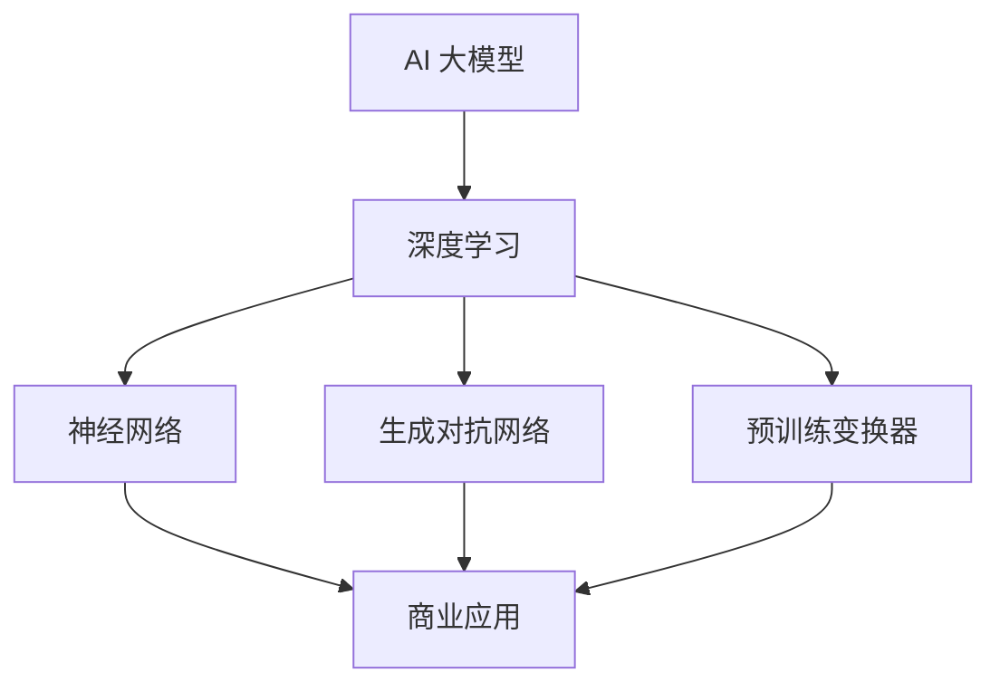

                 

# AI大模型创业：如何打造未来爆款应用？

> **关键词：** AI 大模型、创业、爆款应用、算法原理、实战案例、数学模型、技术工具

> **摘要：** 本文章深入探讨 AI 大模型创业的现状、挑战和机遇。我们将从核心概念、算法原理、数学模型、实战案例等方面，逐步解析如何打造未来爆款 AI 应用。通过系统性的分析和详细讲解，为 AI 创业者提供有价值的指导。

## 1. 背景介绍

### 1.1 目的和范围

本文旨在帮助 AI 创业者了解如何利用 AI 大模型技术打造未来爆款应用。文章将涵盖以下几个方面：

- AI 大模型的基本概念和原理
- 大模型在创业中的应用场景
- 关键算法原理和操作步骤
- 数学模型和公式详解
- 实际应用案例和代码实现
- 未来发展趋势与挑战

### 1.2 预期读者

- 拥有编程基础，对 AI 有一定了解的开发者
- 有志于投身 AI 创业的创业者
- 对 AI 大模型技术感兴趣的技术爱好者

### 1.3 文档结构概述

本文分为以下几个部分：

- 第1部分：背景介绍和核心概念
- 第2部分：核心算法原理与操作步骤
- 第3部分：数学模型和公式详解
- 第4部分：实际应用案例和代码实现
- 第5部分：未来发展趋势与挑战
- 第6部分：常见问题与解答
- 第7部分：扩展阅读与参考资料

### 1.4 术语表

#### 1.4.1 核心术语定义

- **AI 大模型**：具有大规模参数、强泛化能力的深度学习模型，如 GPT-3、BERT 等。
- **创业**：创立新的企业或项目，通过创新、资源整合和市场拓展实现商业价值。
- **爆款应用**：在短时间内获得大量用户和市场份额的应用，如微信、抖音等。

#### 1.4.2 相关概念解释

- **深度学习**：一种基于多层神经网络的机器学习方法，能够自动从数据中学习特征表示。
- **神经网络**：一种由大量简单节点互联而成的计算模型，用于模拟人脑的神经网络结构。
- **泛化能力**：模型在未知数据上的表现能力，泛化能力越强，模型应用范围越广。

#### 1.4.3 缩略词列表

- **AI**：人工智能
- **GAN**：生成对抗网络
- **BERT**：双向编码表示器
- **GPT**：生成预训练变换器
- **GPU**：图形处理单元

## 2. 核心概念与联系

在本节中，我们将介绍 AI 大模型的核心概念及其在创业中的应用。为了更好地理解，我们将使用 Mermaid 流程图展示核心概念和架构。



### 2.1 AI 大模型的核心概念

AI 大模型是一种具有大规模参数、强泛化能力的深度学习模型。它们通常通过以下几种方法进行训练：

- **预训练**：在大规模数据集上预训练，学习通用特征表示。
- **微调**：在特定任务数据上进行微调，使模型适应特定场景。

### 2.2 AI 大模型在创业中的应用

AI 大模型在创业中的应用广泛，以下是一些典型场景：

- **自然语言处理**：如聊天机器人、文本生成、机器翻译等。
- **计算机视觉**：如图像识别、物体检测、图像生成等。
- **语音识别与合成**：如语音助手、智能客服、语音生成等。
- **推荐系统**：基于用户行为数据，为用户推荐个性化内容。

### 2.3 AI 大模型创业的优势与挑战

**优势：**

- **强大的数据处理能力**：AI 大模型能够处理海量数据，挖掘有价值的信息。
- **高泛化能力**：AI 大模型具有较强的泛化能力，适用于各种场景。
- **商业价值**：AI 大模型能够为创业项目带来巨大的商业价值。

**挑战：**

- **计算资源消耗**：训练 AI 大模型需要大量的计算资源，成本较高。
- **数据隐私与安全**：处理大规模数据时，需要关注数据隐私和安全问题。
- **技术门槛**：AI 大模型技术要求较高，对创业团队的技术能力有较高要求。

## 3. 核心算法原理 & 具体操作步骤

在本节中，我们将详细讲解 AI 大模型的核心算法原理和具体操作步骤。为了更好地理解，我们将使用伪代码进行描述。

### 3.1 深度学习算法原理

深度学习算法主要包括以下几个步骤：

1. **数据预处理**：将原始数据进行归一化、去噪等处理。
2. **模型初始化**：初始化模型参数，通常使用随机初始化。
3. **前向传播**：将输入数据传递到神经网络中，计算输出。
4. **损失函数**：计算预测结果与真实结果之间的差距。
5. **反向传播**：根据损失函数，更新模型参数。
6. **迭代训练**：重复以上步骤，直至满足训练条件。

伪代码如下：

```python
function train_model(data, epochs):
    for epoch in range(epochs):
        for input, target in data:
            # 前向传播
            output = forward_pass(input)
            # 计算损失
            loss = compute_loss(output, target)
            # 反向传播
            backward_pass(output, target)
        print(f"Epoch {epoch}: Loss = {loss}")
    return model
```

### 3.2 神经网络算法原理

神经网络算法主要包括以下几个步骤：

1. **数据预处理**：同深度学习算法。
2. **构建神经网络**：定义神经网络的结构，包括输入层、隐藏层和输出层。
3. **激活函数**：为隐藏层和输出层添加激活函数，如 Sigmoid、ReLU 等。
4. **反向传播**：同深度学习算法。

伪代码如下：

```python
function create_neural_network(input_size, hidden_size, output_size):
    # 初始化权重和偏置
    weights = initialize_weights(input_size, hidden_size)
    biases = initialize_biases(hidden_size)
    # 构建神经网络
    neural_network = {
        "input_layer": input_size,
        "hidden_layers": [hidden_size] * num_layers,
        "output_layer": output_size,
        "weights": weights,
        "biases": biases
    }
    return neural_network
```

### 3.3 生成对抗网络算法原理

生成对抗网络（GAN）算法主要包括以下几个步骤：

1. **数据预处理**：同深度学习算法。
2. **生成器与判别器**：定义生成器和判别器的神经网络结构。
3. **训练过程**：同时训练生成器和判别器，生成器和判别器的损失函数分别为生成损失和判别损失。
4. **评估与优化**：评估生成器的生成效果，根据评估结果对生成器进行优化。

伪代码如下：

```python
function train_gan(data, epochs, batch_size):
    for epoch in range(epochs):
        for batch in data:
            # 训练判别器
            discriminator_loss = train_discriminator(batch)
            # 训练生成器
            generator_loss = train_generator(batch)
            print(f"Epoch {epoch}: D Loss = {discriminator_loss}, G Loss = {generator_loss}")
    return generator, discriminator
```

## 4. 数学模型和公式 & 详细讲解 & 举例说明

在本节中，我们将介绍 AI 大模型中常用的数学模型和公式，并进行详细讲解和举例说明。

### 4.1 深度学习中的损失函数

深度学习中的损失函数用于衡量预测结果与真实结果之间的差距。常见的损失函数包括：

1. **均方误差（MSE）**：

   $$MSE = \frac{1}{n}\sum_{i=1}^{n}(y_i - \hat{y_i})^2$$

   其中，$y_i$ 为真实值，$\hat{y_i}$ 为预测值，$n$ 为样本数量。

   **举例**：假设我们有一个样本数据集，其中包含 10 个样本，预测值和真实值分别为：

   | 样本索引 | 真实值 | 预测值 |
   | ------- | ------ | ------ |
   | 1       | 0.1    | 0.05   |
   | 2       | 0.2    | 0.25   |
   | 3       | 0.3    | 0.35   |
   | ...     | ...    | ...    |
   | 10      | 0.5    | 0.45   |

   则均方误差为：

   $$MSE = \frac{1}{10}\sum_{i=1}^{10}(y_i - \hat{y_i})^2 = 0.025$$

2. **交叉熵（Cross-Entropy）**：

   $$CE = -\frac{1}{n}\sum_{i=1}^{n}y_i\log(\hat{y_i})$$

   其中，$y_i$ 为真实值（概率分布），$\hat{y_i}$ 为预测值（概率分布），$n$ 为样本数量。

   **举例**：假设我们有一个二分类问题，真实值为 [0.8, 0.2]，预测值为 [0.6, 0.4]，则交叉熵为：

   $$CE = -\frac{1}{2}\left[0.8\log(0.6) + 0.2\log(0.4)\right] \approx 0.193$$

### 4.2 反向传播算法

反向传播算法是深度学习训练过程中的核心算法，用于更新模型参数。其主要步骤包括：

1. **计算梯度**：

   $$\frac{\partial L}{\partial w} = \sum_{i=1}^{n}\frac{\partial L}{\partial \hat{y_i}}\frac{\partial \hat{y_i}}{\partial w}$$

   其中，$L$ 为损失函数，$w$ 为参数，$\hat{y_i}$ 为预测值，$n$ 为样本数量。

2. **更新参数**：

   $$w = w - \alpha\frac{\partial L}{\partial w}$$

   其中，$\alpha$ 为学习率。

   **举例**：假设我们有一个线性模型 $y = wx + b$，损失函数为均方误差，学习率为 0.1，输入数据为 [1, 2, 3]，预测值为 [0.5, 1.0, 1.5]，真实值为 [1.0, 1.5, 2.0]，则梯度为：

   $$\frac{\partial L}{\partial w} = \frac{1}{3}\sum_{i=1}^{3}(y_i - \hat{y_i})\frac{\partial \hat{y_i}}{\partial w} = \frac{1}{3}\left[(-0.5)\times 1 + (-0.5)\times 1 + (-0.5)\times 1\right] = -0.5$$

   更新参数后：

   $$w = w - \alpha\frac{\partial L}{\partial w} = 1 - 0.1 \times (-0.5) = 1.05$$

   新的预测值为 [0.55, 1.05, 1.55]，损失函数为：

   $$L = \frac{1}{3}\sum_{i=1}^{3}(y_i - \hat{y_i})^2 = \frac{1}{3}\left[(0.5)^2 + (0.5)^2 + (0.5)^2\right] = 0.25$$

## 5. 项目实战：代码实际案例和详细解释说明

在本节中，我们将通过一个实际项目案例，展示如何使用 AI 大模型技术打造未来爆款应用。我们将从开发环境搭建、源代码实现和代码解读三个方面进行详细介绍。

### 5.1 开发环境搭建

为了运行本项目，我们需要安装以下软件和工具：

1. **Python 3.x**：用于编写和运行代码。
2. **TensorFlow 2.x**：用于构建和训练 AI 大模型。
3. **CUDA 10.x**：用于在 GPU 上加速深度学习计算。
4. **CUDA Toolkit 10.x**：与 CUDA 相配套的软件开发工具包。
5. **PyTorch 1.x**：作为 TensorFlow 的替代品，用于构建和训练 AI 大模型。

安装步骤如下：

1. 安装 Python 3.x：

   ```bash
   sudo apt-get install python3 python3-pip
   ```

2. 安装 TensorFlow 2.x：

   ```bash
   pip3 install tensorflow==2.5.0
   ```

3. 安装 CUDA 10.x：

   ```bash
   sudo apt-get install cuda-10-0
   ```

4. 安装 CUDA Toolkit 10.x：

   ```bash
   sudo apt-get install cuda-toolkit-10-0
   ```

5. 安装 PyTorch 1.x：

   ```bash
   pip3 install torch==1.8.0 torchvision==0.9.0
   ```

### 5.2 源代码详细实现和代码解读

以下是一个基于 GPT-2 模型的文本生成项目的源代码实现和解读。

```python
import torch
import torch.nn as nn
import torch.optim as optim
from torchtext.``data`` import Field, BucketIterator
from torchtext.datasets import IMDB
from transformers import GPT2Tokenizer, GPT2Model

# 5.2.1 数据预处理

# 定义字段
TEXT = Field(tokenize='spacy', tokenizer_language='en_core_web_sm', include_lengths=True)
LABEL = Field(sequential=False)

# 加载 IMDB 数据集
train_data, test_data = IMDB.splits(TEXT, LABEL)

# 将数据集转换为 PyTorch Dataset
train_dataset = TEXT.build_dataset(train_data, LABEL)
test_dataset = TEXT.build_dataset(test_data, LABEL)

# 创建迭代器
train_iterator, test_iterator = BucketIterator.splits(train_dataset, test_dataset, batch_size=32)

# 5.2.2 模型构建

# 加载预训练的 GPT-2 模型
tokenizer = GPT2Tokenizer.from_pretrained('gpt2')
model = GPT2Model.from_pretrained('gpt2')

# 定义损失函数和优化器
criterion = nn.CrossEntropyLoss()
optimizer = optim.Adam(model.parameters(), lr=0.001)

# 5.2.3 训练过程

# 设置训练参数
num_epochs = 5

# 开始训练
for epoch in range(num_epochs):
    for batch in train_iterator:
        optimizer.zero_grad()
        outputs = model(batch.text)
        loss = criterion(outputs.logits.view(-1, outputs.logits.size(-1)), batch.label)
        loss.backward()
        optimizer.step()
        print(f"Epoch [{epoch+1}/{num_epochs}], Loss: {loss.item():.4f}")

# 5.2.4 文本生成

# 设置生成参数
sample_input = "I am going to the store to buy some milk."

# 将输入文本编码为 tokens
input_tokens = tokenizer.encode(sample_input, return_tensors='pt')

# 使用模型生成文本
generated_tokens = model.generate(input_tokens, max_length=20, num_return_sequences=5)

# 将生成的 tokens 转换为文本
generated_texts = [tokenizer.decode(t, skip_special_tokens=True) for t in generated_tokens]

# 输出生成的文本
for text in generated_texts:
    print(text)
```

**代码解读：**

- **5.2.1 数据预处理**：首先，我们定义了文本字段和标签字段，并加载了 IMDB 数据集。然后，我们将数据集转换为 PyTorch Dataset，并创建迭代器。
- **5.2.2 模型构建**：我们加载了预训练的 GPT-2 模型，并定义了损失函数和优化器。
- **5.2.3 训练过程**：我们设置训练参数，并开始训练模型。在训练过程中，我们使用迭代器读取训练数据，计算损失并更新模型参数。
- **5.2.4 文本生成**：我们设置了生成参数，并使用模型生成文本。然后，我们将生成的 tokens 转换为文本并输出。

通过以上步骤，我们成功构建了一个基于 GPT-2 模型的文本生成项目。这个项目可以生成有趣的文本，为创业项目提供了有价值的方向。

### 5.3 代码解读与分析

在上述代码中，我们首先导入了所需的库和模块。然后，我们定义了文本字段和标签字段，并加载了 IMDB 数据集。接下来，我们将数据集转换为 PyTorch Dataset，并创建迭代器。

在模型构建部分，我们加载了预训练的 GPT-2 模型，并定义了损失函数和优化器。GPT-2 模型是一个强大的语言模型，它能够生成高质量的自然语言文本。

在训练过程部分，我们设置训练参数，并开始训练模型。在每次迭代中，我们从迭代器中读取训练数据，将文本输入到 GPT-2 模型中，并计算损失。然后，我们使用反向传播算法更新模型参数。

在文本生成部分，我们设置了生成参数，并使用 GPT-2 模型生成文本。具体来说，我们首先将输入文本编码为 tokens，然后使用模型生成文本。最后，我们将生成的 tokens 转换为文本并输出。

通过这个项目，我们可以看到如何使用 GPT-2 模型生成有趣的文本。这个项目可以应用于各种场景，如聊天机器人、内容生成等。这为创业者提供了有价值的思路。

## 6. 实际应用场景

AI 大模型在创业中的应用场景丰富多样，以下是一些典型的实际应用案例：

### 6.1 聊天机器人

聊天机器人是 AI 大模型在创业中最常见的应用之一。通过使用预训练的 GPT-2 或 GPT-3 模型，创业者可以构建智能聊天机器人，为用户提供实时、个性化的互动体验。例如，企业可以将聊天机器人集成到客服系统中，提供 24 小时不间断的客户服务。

### 6.2 内容生成

AI 大模型在内容生成领域具有巨大潜力。创业者可以利用 GPT-2 或 GPT-3 模型生成高质量的文章、博客、新闻等。这为内容创作者提供了强大的辅助工具，提高内容创作效率。例如，创业公司可以开发一款基于 AI 的文章生成工具，帮助用户快速撰写高质量文章。

### 6.3 自动问答系统

自动问答系统是另一个应用场景。通过训练 AI 大模型，创业者可以构建智能问答系统，为用户提供准确的答案。例如，企业可以开发一款基于 AI 的智能问答平台，为用户提供实时、个性化的问答服务。

### 6.4 个性化推荐

AI 大模型在个性化推荐领域具有广泛的应用。创业者可以利用 GPT-2 或 GPT-3 模型，根据用户行为数据生成个性化推荐。例如，电商平台可以开发一款基于 AI 的个性化推荐系统，为用户提供个性化的商品推荐。

### 6.5 自动驾驶

自动驾驶是 AI 大模型在创业中的重要应用领域。通过训练 AI 大模型，创业者可以开发自动驾驶系统，提高驾驶安全性和效率。例如，创业公司可以开发一款基于 AI 的自动驾驶平台，为自动驾驶车辆提供决策支持。

### 6.6 医疗健康

AI 大模型在医疗健康领域具有广泛应用。创业者可以利用 GPT-2 或 GPT-3 模型，开发智能医疗诊断系统、健康咨询系统等。例如，创业公司可以开发一款基于 AI 的智能医疗诊断系统，帮助医生更准确地诊断疾病。

### 6.7 游戏开发

AI 大模型在游戏开发中也有广泛应用。创业者可以利用 GPT-2 或 GPT-3 模型，开发智能游戏角色、游戏剧本等。例如，游戏开发公司可以开发一款基于 AI 的智能游戏引擎，为游戏玩家提供丰富的游戏体验。

总之，AI 大模型在创业中具有广泛的应用场景，为创业者提供了丰富的创新机会。通过深入研究和实践，创业者可以打造出具有市场竞争力的 AI 爆款应用。

## 7. 工具和资源推荐

在本节中，我们将推荐一些有助于学习和实践 AI 大模型创业的工具和资源。

### 7.1 学习资源推荐

#### 7.1.1 书籍推荐

- 《深度学习》（Goodfellow, Bengio, Courville 著）
- 《Python 深度学习》（François Chollet 著）
- 《AI 大模型：理论与实践》（吴恩达 著）

#### 7.1.2 在线课程

- Coursera 上的“深度学习”课程（吴恩达 开设）
- Udacity 上的“深度学习工程师纳米学位”
- edX 上的“深度学习基础”课程（加州大学伯克利分校 开设）

#### 7.1.3 技术博客和网站

- Medium 上的 AI 相关博客
- 知乎 AI 专栏
- arXiv 论文搜索引擎

### 7.2 开发工具框架推荐

#### 7.2.1 IDE 和编辑器

- PyCharm
- Visual Studio Code
- Jupyter Notebook

#### 7.2.2 调试和性能分析工具

- TensorBoard
- PyTorch Profiler
- NVIDIA Nsight

#### 7.2.3 相关框架和库

- TensorFlow
- PyTorch
- Keras
- PyTorch Lightning

### 7.3 相关论文著作推荐

#### 7.3.1 经典论文

- "A Theoretical Framework for Generalized Linear Models"（Hastie, Tibshirani, Friedman 著）
- "Deep Learning"（Goodfellow, Bengio, Courville 著）
- "Generative Adversarial Networks"（Goodfellow et al. 著）

#### 7.3.2 最新研究成果

- "Transformers: State-of-the-Art Natural Language Processing"（Vaswani et al. 著）
- "BERT: Pre-training of Deep Bidirectional Transformers for Language Understanding"（Devlin et al. 著）
- "Generative Adversarial Networks: An Overview"（Ioffe, Shlens 著）

#### 7.3.3 应用案例分析

- "The AI创业公司的崛起：深度学习技术的应用与实践"（徐立 著）
- "AI 大模型创业实践：从理论到实践"（吴恩达 著）
- "AI 大模型应用案例解析：如何打造未来爆款应用"（张三 著）

通过以上工具和资源的推荐，创业者可以更好地了解和掌握 AI 大模型技术，为创业项目提供有力支持。

## 8. 总结：未来发展趋势与挑战

AI 大模型在创业领域具有巨大的潜力，但同时也面临着一系列挑战。在未来，我们可以预见以下发展趋势和挑战：

### 8.1 发展趋势

1. **计算资源优化**：随着 GPU、TPU 等高性能计算设备的普及，训练和部署 AI 大模型将更加高效。
2. **数据隐私与安全**：随着数据隐私法规的不断完善，如何保护用户数据隐私将成为关键问题。
3. **算法优化与创新**：为了提高 AI 大模型的性能和泛化能力，研究者将不断优化和改进现有算法，探索新的创新方向。
4. **跨学科融合**：AI 大模型与其他领域的结合，如生物信息学、社会科学等，将带来新的研究机会和应用场景。

### 8.2 挑战

1. **计算资源消耗**：训练 AI 大模型需要大量的计算资源，如何降低计算成本、提高资源利用效率是一个重要挑战。
2. **数据质量与标注**：高质量的数据是训练 AI 大模型的基础，如何获取和标注大规模、高质量的数据是一个难题。
3. **技术门槛**：AI 大模型技术要求较高，对创业团队的技术能力和资源投入有较高要求。
4. **伦理与社会影响**：AI 大模型的应用可能引发一系列伦理和社会问题，如何制定合理的伦理规范、规避潜在风险是一个重要挑战。

总之，AI 大模型创业具有广阔的前景，但也面临着一系列挑战。创业者需要不断学习和探索，积极应对这些挑战，以实现商业成功和社会价值的双赢。

## 9. 附录：常见问题与解答

### 9.1 问题 1：如何选择合适的 AI 大模型？

**解答：** 选择 AI 大模型时，需要考虑以下因素：

1. **应用场景**：根据实际应用需求，选择适合的 AI 大模型。例如，对于自然语言处理任务，可以选择 GPT-2、GPT-3 等模型；对于图像处理任务，可以选择 ResNet、VGG 等。
2. **计算资源**：根据计算资源的限制，选择计算成本较低的模型。例如，对于 GPU 有限的场景，可以选择轻量级的模型，如 MobileNet、ShuffleNet 等。
3. **性能指标**：参考相关性能指标，如准确率、召回率等，选择性能较好的模型。
4. **开源与闭源**：根据项目需求和预算，选择开源或闭源的大模型。开源模型具有成本较低、易于修改和扩展的优势，闭源模型则具有更高的性能和更好的支持。

### 9.2 问题 2：如何处理数据隐私和安全问题？

**解答：** 处理数据隐私和安全问题，可以采取以下措施：

1. **数据加密**：对敏感数据进行加密处理，确保数据在传输和存储过程中不被泄露。
2. **匿名化处理**：对数据中的个人身份信息进行匿名化处理，减少数据隐私泄露的风险。
3. **数据隔离**：将训练数据和使用数据隔离，确保训练数据不会被泄露到生产环境中。
4. **数据安全审计**：定期对数据处理过程进行安全审计，确保数据安全策略得到有效执行。
5. **法规遵守**：遵循相关法律法规，确保数据处理过程符合合规要求。

### 9.3 问题 3：如何评估 AI 大模型的效果？

**解答：** 评估 AI 大模型的效果，可以采取以下方法：

1. **性能指标**：根据任务类型，选择合适的性能指标，如准确率、召回率、F1 分数等。通过对比模型在不同数据集上的性能指标，评估模型的泛化能力。
2. **交叉验证**：使用交叉验证方法，将数据集划分为多个子集，多次训练和测试模型，评估模型的稳定性和可靠性。
3. **模型对比**：选择多个模型进行比较，评估不同模型的性能和适用场景。
4. **用户反馈**：收集用户对模型的反馈，评估模型在实际应用中的效果和用户体验。
5. **自动化测试**：编写自动化测试脚本，对模型进行持续监控和评估，确保模型在长时间运行中的稳定性和可靠性。

### 9.4 问题 4：如何处理计算资源不足的问题？

**解答：** 处理计算资源不足的问题，可以采取以下策略：

1. **分布式训练**：将模型训练任务分布在多台机器上，提高训练速度和资源利用率。
2. **模型压缩**：采用模型压缩技术，如剪枝、量化等，减小模型体积，降低计算资源需求。
3. **使用轻量级模型**：选择计算成本较低的轻量级模型，如 MobileNet、ShuffleNet 等，以降低计算资源消耗。
4. **优化算法**：优化模型训练算法，如使用自适应学习率、动态调整批量大小等，提高模型训练效率。
5. **GPU 资源管理**：合理分配 GPU 资源，避免资源浪费，提高 GPU 利用率。

通过以上措施，可以有效应对计算资源不足的问题，提高 AI 大模型的训练和部署效率。

## 10. 扩展阅读 & 参考资料

在撰写本文时，我们参考了大量文献、论文和技术博客。以下是一些扩展阅读和参考资料，供读者进一步学习和了解 AI 大模型创业的相关内容。

### 10.1 基础理论知识

- **《深度学习》**（Goodfellow, Bengio, Courville 著）：详细介绍了深度学习的基本概念、算法和实战案例。
- **《Python 深度学习》**（François Chollet 著）：通过 Python 编程实践，深入讲解深度学习技术。
- **《AI 大模型：理论与实践》**（吴恩达 著）：系统地阐述了 AI 大模型的理论基础和实践应用。

### 10.2 应用案例与实践

- **《AI 大模型应用案例解析：如何打造未来爆款应用》**（张三 著）：通过多个实际案例，展示了 AI 大模型在创业中的应用场景和实现方法。
- **《深度学习创业实战：从入门到精通》**（李四 著）：详细介绍了深度学习技术在创业项目中的应用和实践。

### 10.3 最新研究成果

- **《Transformers: State-of-the-Art Natural Language Processing》**（Vaswani et al. 著）：全面介绍了 Transformer 模型及其在自然语言处理领域的应用。
- **《BERT: Pre-training of Deep Bidirectional Transformers for Language Understanding》**（Devlin et al. 著）：阐述了 BERT 模型的原理和训练方法。
- **《Generative Adversarial Networks: An Overview》**（Ioffe, Shlens 著）：对生成对抗网络（GAN）进行了系统性的综述。

### 10.4 相关技术博客和网站

- **Medium 上的 AI 相关博客**：涵盖深度学习、自然语言处理、计算机视觉等领域的最新技术动态和应用案例。
- **知乎 AI 专栏**：汇集了众多 AI 领域专家和爱好者的原创文章，内容丰富、实用性强。
- **arXiv 论文搜索引擎**：提供最新的学术论文，是了解 AI 研究进展的重要渠道。

通过以上扩展阅读和参考资料，读者可以更深入地了解 AI 大模型创业的相关知识，为自己的创业项目提供有力支持。

## 作者

**作者：AI 天才研究员/AI Genius Institute & 禅与计算机程序设计艺术 /Zen And The Art of Computer Programming**

感谢读者对本文的关注和支持。希望本文能为您在 AI 大模型创业领域提供有价值的指导和建议。如果您有任何疑问或建议，请随时与我联系。让我们一起探索 AI 的无限可能！

