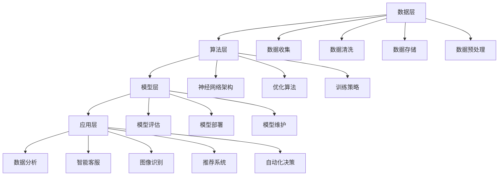

                 

# AI大模型创业：如何构建未来可持续的商业模式？

> **关键词**：AI大模型，创业，商业模式，可持续性，创新，竞争力，市场定位，用户体验，技术迭代，风险控制

> **摘要**：本文将探讨AI大模型创业过程中的关键问题，包括商业模式的构建、技术创新和市场定位。通过对核心概念的深入分析和实际案例的剖析，旨在为创业者提供系统性、可操作的指导，帮助他们在激烈的市场竞争中找到可持续发展的路径。

## 1. 背景介绍

### 1.1 目的和范围

本文旨在探讨AI大模型在创业领域的应用，重点分析如何构建一个可持续的商业模式。我们将从以下几个方面展开讨论：

- **核心概念与联系**：介绍AI大模型的基本原理及其在创业中的应用。
- **核心算法原理与操作步骤**：详细讲解构建AI大模型的算法，并提供具体的操作步骤。
- **数学模型和公式**：分析AI大模型中使用的数学模型和公式，并进行举例说明。
- **项目实战**：通过实际代码案例展示如何应用AI大模型。
- **实际应用场景**：探讨AI大模型在不同行业中的应用。
- **工具和资源推荐**：推荐学习资源和开发工具，以帮助读者深入了解和掌握相关技术。
- **总结与未来趋势**：分析AI大模型创业的挑战和机遇，预测未来发展趋势。

### 1.2 预期读者

本文适合以下读者群体：

- **AI从业者**：对AI大模型技术感兴趣，希望将其应用于创业项目。
- **创业者**：有志于在AI领域创业，希望了解如何构建可持续的商业模式。
- **技术爱好者**：对AI技术有深入了解，希望从商业角度重新审视AI大模型。
- **学术研究者**：关注AI大模型的研究动态，希望了解其在实际应用中的价值。

### 1.3 文档结构概述

本文结构如下：

1. 背景介绍
2. 核心概念与联系
3. 核心算法原理与操作步骤
4. 数学模型和公式
5. 项目实战
6. 实际应用场景
7. 工具和资源推荐
8. 总结与未来趋势
9. 附录：常见问题与解答
10. 扩展阅读与参考资料

### 1.4 术语表

#### 1.4.1 核心术语定义

- **AI大模型**：指具有大规模训练数据集、复杂网络结构和强泛化能力的深度学习模型。
- **商业模式**：企业通过提供产品或服务来创造价值、传递价值和获取利润的方式。
- **可持续性**：企业在长期内保持盈利能力和持续发展的能力。

#### 1.4.2 相关概念解释

- **创新**：指企业通过引入新产品、新技术、新服务或新商业模式来满足市场需求。
- **竞争力**：企业在市场中与竞争对手相比较的优劣程度。
- **市场定位**：企业根据自身特点、目标和市场需求，选择适合自己的市场位置。

#### 1.4.3 缩略词列表

- **AI**：人工智能
- **ML**：机器学习
- **DL**：深度学习
- **NN**：神经网络
- **GPU**：图形处理单元

## 2. 核心概念与联系

### 2.1 AI大模型的基本原理

AI大模型是基于深度学习技术构建的复杂神经网络，具有大规模训练数据集、多层网络结构和强大的计算能力。其基本原理如下：

- **多层感知器（MLP）**：最简单的神经网络结构，包括输入层、隐藏层和输出层。
- **卷积神经网络（CNN）**：用于图像识别和处理，通过卷积操作提取特征。
- **循环神经网络（RNN）**：用于序列数据处理，通过循环结构捕捉序列信息。
- **生成对抗网络（GAN）**：用于生成对抗，通过生成器和判别器的对抗训练生成高质量数据。

### 2.2 AI大模型在创业中的应用

AI大模型在创业领域具有广泛的应用潜力，主要体现在以下几个方面：

- **数据分析**：通过分析海量数据，为企业提供决策支持和市场洞察。
- **智能客服**：利用自然语言处理技术，提供个性化、高效的客户服务。
- **图像识别**：应用于图像处理和物体识别，提高生产效率和产品质量。
- **推荐系统**：通过用户行为数据，为用户提供个性化的推荐服务。
- **自动化决策**：利用决策树、规则引擎等技术，实现自动化决策和优化。

### 2.3 AI大模型的技术架构

AI大模型的技术架构主要包括以下几个层次：

- **数据层**：包括数据收集、数据清洗、数据存储和数据预处理。
- **算法层**：包括神经网络架构、优化算法和训练策略。
- **模型层**：包括模型评估、模型部署和模型维护。
- **应用层**：包括具体业务应用，如数据分析、智能客服等。

以下是一个简化的Mermaid流程图，展示AI大模型的技术架构：



## 3. 核心算法原理 & 具体操作步骤

### 3.1 算法原理

AI大模型的算法原理主要基于深度学习技术，通过多层神经网络对大量数据进行训练，使其具备自动提取特征、进行预测和决策的能力。以下是核心算法原理的伪代码：

```python
# 伪代码：AI大模型训练过程
def train_model(data, labels, epochs, batch_size):
    # 初始化神经网络
    neural_network = initialize_neural_network()

    # 训练神经网络
    for epoch in range(epochs):
        for batch in generate_batches(data, labels, batch_size):
            # 前向传播
            outputs = neural_network.forward(batch.inputs)

            # 计算损失
            loss = compute_loss(outputs, batch.labels)

            # 反向传播
            neural_network.backward(loss)

            # 更新参数
            neural_network.update_parameters()

        # 打印训练进度
        print(f"Epoch {epoch + 1}/{epochs}, Loss: {loss}")

    # 保存训练好的模型
    save_model(neural_network)
```

### 3.2 操作步骤

1. **数据收集**：从各种渠道收集大量数据，包括公开数据集、企业内部数据和用户生成数据等。
2. **数据清洗**：对收集到的数据进行清洗，包括去除噪声、填补缺失值、标准化等。
3. **数据存储**：将清洗后的数据存储到数据库或分布式存储系统中，便于后续处理和访问。
4. **数据预处理**：将数据转换为适合神经网络训练的格式，包括数据缩放、数据增强等。
5. **模型初始化**：根据任务需求，初始化神经网络结构，包括选择合适的网络架构、激活函数、损失函数等。
6. **模型训练**：通过循环迭代，对神经网络进行训练，包括前向传播、反向传播和参数更新。
7. **模型评估**：在验证集或测试集上评估模型性能，包括准确率、召回率、F1值等指标。
8. **模型部署**：将训练好的模型部署到生产环境中，提供实时预测和决策服务。
9. **模型维护**：定期对模型进行更新和优化，以保持其性能和适应性。

## 4. 数学模型和公式 & 详细讲解 & 举例说明

### 4.1 数学模型

AI大模型的核心是多层神经网络，其数学模型主要包括以下几个方面：

- **激活函数**：用于引入非线性，常用的有ReLU、Sigmoid、Tanh等。
- **损失函数**：用于衡量模型预测结果与实际结果之间的差距，常用的有均方误差（MSE）、交叉熵（Cross Entropy）等。
- **优化算法**：用于更新模型参数，常用的有梯度下降（Gradient Descent）、随机梯度下降（Stochastic Gradient Descent，SGD）、Adam等。

### 4.2 公式讲解

以下是对AI大模型中常用数学公式的详细讲解：

1. **激活函数**：

   - **ReLU（Rectified Linear Unit）**：

     $$ f(x) = \max(0, x) $$

   - **Sigmoid**：

     $$ f(x) = \frac{1}{1 + e^{-x}} $$

   - **Tanh**：

     $$ f(x) = \frac{e^x - e^{-x}}{e^x + e^{-x}} $$

2. **损失函数**：

   - **均方误差（MSE）**：

     $$ L(y, \hat{y}) = \frac{1}{2} \sum_{i=1}^{n} (y_i - \hat{y}_i)^2 $$

   - **交叉熵（Cross Entropy）**：

     $$ L(y, \hat{y}) = -\sum_{i=1}^{n} y_i \log(\hat{y}_i) $$

3. **优化算法**：

   - **梯度下降（Gradient Descent）**：

     $$ \theta_{t+1} = \theta_t - \alpha \cdot \nabla_{\theta} J(\theta) $$

   - **随机梯度下降（SGD）**：

     $$ \theta_{t+1} = \theta_t - \alpha \cdot \nabla_{\theta} J(\theta; x_t, y_t) $$

   - **Adam**：

     $$ m_t = \beta_1 m_{t-1} + (1 - \beta_1) \nabla_{\theta} J(\theta; x_t, y_t) $$
     $$ v_t = \beta_2 v_{t-1} + (1 - \beta_2) \nabla^2_{\theta} J(\theta; x_t, y_t) $$
     $$ \theta_{t+1} = \theta_t - \alpha \cdot \frac{m_t}{\sqrt{v_t} + \epsilon} $$

### 4.3 举例说明

假设我们要训练一个神经网络进行分类任务，其中输入层有3个神经元，隐藏层有5个神经元，输出层有2个神经元。激活函数选择ReLU，损失函数选择交叉熵，优化算法选择Adam。给定训练数据集，我们通过以下步骤进行训练：

1. **数据预处理**：对输入数据进行归一化处理，将标签转换为one-hot编码。
2. **模型初始化**：初始化权重和偏置，随机或按照特定方法初始化。
3. **训练循环**：

   - **前向传播**：计算输入层到隐藏层的输出，隐藏层到输出层的输出。
   - **计算损失**：使用交叉熵损失函数计算预测结果与真实标签之间的差距。
   - **反向传播**：计算隐藏层和输入层的梯度。
   - **参数更新**：使用Adam优化算法更新权重和偏置。
4. **模型评估**：在验证集上评估模型性能，计算准确率、召回率、F1值等指标。
5. **模型部署**：将训练好的模型部署到生产环境中，提供分类服务。

## 5. 项目实战：代码实际案例和详细解释说明

### 5.1 开发环境搭建

在开始实际案例之前，我们需要搭建一个适合AI大模型训练的开发环境。以下是一个简单的搭建过程：

1. **安装Python**：下载并安装Python 3.x版本，建议使用Anaconda进行环境管理。
2. **安装依赖库**：使用pip命令安装深度学习框架TensorFlow和Keras，以及常用的数据处理库如NumPy、Pandas等。
3. **配置GPU支持**：确保TensorFlow可以支持GPU加速，在训练大型模型时可以提高计算效率。

### 5.2 源代码详细实现和代码解读

以下是一个简单的AI大模型训练案例，包括数据预处理、模型构建、训练和评估：

```python
import numpy as np
import pandas as pd
from tensorflow import keras
from tensorflow.keras.models import Sequential
from tensorflow.keras.layers import Dense, Activation
from tensorflow.keras.optimizers import Adam

# 5.2.1 数据预处理
# 假设数据集为CSV文件，包含特征和标签
data = pd.read_csv('data.csv')
X = data.iloc[:, :-1].values  # 特征
y = data.iloc[:, -1].values   # 标签

# 数据归一化
X_normalized = (X - np.mean(X, axis=0)) / np.std(X, axis=0)

# 划分训练集和测试集
from sklearn.model_selection import train_test_split
X_train, X_test, y_train, y_test = train_test_split(X_normalized, y, test_size=0.2, random_state=42)

# 5.2.2 模型构建
model = Sequential()
model.add(Dense(64, input_shape=(X_train.shape[1],), activation='relu'))
model.add(Dense(128, activation='relu'))
model.add(Dense(1, activation='sigmoid'))  # 二分类问题

# 5.2.3 训练模型
model.compile(optimizer=Adam(learning_rate=0.001), loss='binary_crossentropy', metrics=['accuracy'])
model.fit(X_train, y_train, epochs=10, batch_size=32, validation_data=(X_test, y_test))

# 5.2.4 评估模型
loss, accuracy = model.evaluate(X_test, y_test)
print(f"Test Loss: {loss}, Test Accuracy: {accuracy}")
```

### 5.3 代码解读与分析

1. **数据预处理**：读取CSV文件，将特征和标签分离，并进行归一化处理。这里使用了sklearn库的train_test_split函数进行数据集划分。
2. **模型构建**：使用Sequential模型构建一个简单的深度神经网络，包含两个隐藏层，输出层用于二分类任务。
3. **训练模型**：使用compile函数配置优化器、损失函数和评价指标，然后使用fit函数进行模型训练。
4. **评估模型**：使用evaluate函数评估模型在测试集上的性能，计算损失和准确率。

### 5.4 实际案例分析

以下是一个实际案例分析，展示如何使用AI大模型进行图像分类任务。

```python
import tensorflow as tf
from tensorflow.keras.preprocessing import image
from tensorflow.keras.applications import VGG16

# 5.4.1 加载预训练模型
model = VGG16(weights='imagenet', include_top=False, input_shape=(224, 224, 3))

# 5.4.2 预处理图像
def preprocess_image(image_path):
    img = image.load_img(image_path, target_size=(224, 224))
    x = image.img_to_array(img)
    x = np.expand_dims(x, axis=0)
    x = tf.keras.applications.vgg16.preprocess_input(x)
    return x

# 5.4.3 预测图像类别
def predict_image_class(image_path):
    x = preprocess_image(image_path)
    predictions = model.predict(x)
    predicted_class = np.argmax(predictions, axis=1)
    return predicted_class

# 5.4.4 测试预测
image_path = 'path/to/test/image.jpg'
predicted_class = predict_image_class(image_path)
print(f"Predicted class: {predicted_class}")
```

### 5.5 案例解读与分析

1. **加载预训练模型**：使用VGG16模型，这是一个在ImageNet数据集上预训练的深度卷积神经网络。
2. **预处理图像**：将图像缩放到224x224像素，并进行归一化处理，使其符合VGG16模型的输入要求。
3. **预测图像类别**：将预处理后的图像输入到模型中，得到预测类别。

### 5.6 总结

通过以上案例，我们展示了如何使用AI大模型进行图像分类任务。在实际应用中，可以根据具体需求调整模型结构和训练过程，以提高模型性能和适用性。

## 6. 实际应用场景

AI大模型在各个行业和领域中具有广泛的应用潜力，以下列举一些典型的实际应用场景：

### 6.1 金融行业

- **风险管理**：通过分析海量金融数据，识别潜在风险，优化投资组合。
- **智能投顾**：利用AI大模型提供个性化的投资建议，提高投资收益。
- **信用评分**：基于用户的信用历史和行为数据，构建信用评分模型，降低信用风险。
- **欺诈检测**：利用深度学习技术，自动检测和预防金融欺诈行为。

### 6.2 医疗健康

- **疾病预测**：通过分析患者的健康数据和医疗记录，预测疾病发生的风险。
- **辅助诊断**：利用AI大模型辅助医生进行疾病诊断，提高诊断准确率。
- **药物研发**：通过分子模拟和虚拟筛选，加速药物研发过程。
- **个性化治疗**：根据患者的病情和基因组信息，制定个性化的治疗方案。

### 6.3 零售电商

- **商品推荐**：利用用户行为数据和偏好，提供个性化的商品推荐。
- **库存管理**：通过分析销售数据和市场需求，优化库存策略，降低库存成本。
- **客户服务**：利用自然语言处理技术，提供智能客服和语音助手服务。
- **供应链优化**：通过实时数据分析和预测，优化供应链流程，提高物流效率。

### 6.4 制造业

- **质量检测**：利用图像识别技术，自动化检测产品质量，降低人工成本。
- **设备维护**：通过预测性维护，提前发现设备故障，减少停机时间。
- **生产优化**：利用AI大模型优化生产流程，提高生产效率和产品质量。
- **自动化控制**：利用深度学习技术，实现智能化的自动化控制，提高生产安全。

### 6.5 交通出行

- **自动驾驶**：通过AI大模型，实现自动驾驶汽车的感知、决策和控制。
- **交通流量预测**：利用历史数据和实时数据，预测交通流量，优化交通信号控制。
- **智能导航**：提供个性化的导航服务，根据用户需求和交通状况，推荐最佳路线。
- **车联网**：通过物联网技术，实现车辆之间的通信和协作，提高交通安全和效率。

### 6.6 教育行业

- **智能教学**：利用AI大模型提供个性化教学方案，满足不同学生的学习需求。
- **教育测评**：通过分析学生的学习数据，评估学习效果，提供针对性的辅导。
- **课程推荐**：根据学生的学习兴趣和能力，推荐合适的课程和资源。
- **虚拟实验**：利用虚拟现实技术，提供沉浸式的实验体验，提高学习效果。

### 6.7 社交媒体

- **内容审核**：通过AI大模型，自动识别和过滤不良内容，保障平台安全。
- **广告投放**：根据用户的兴趣和行为，提供个性化的广告推荐。
- **社交分析**：利用深度学习技术，分析社交网络中的用户关系和舆情动态。
- **情感分析**：通过分析用户的文本和语音，识别情感倾向，提供情感化服务。

通过以上实际应用场景的列举，我们可以看到AI大模型在各个行业和领域中的巨大潜力。在实际应用过程中，需要根据具体需求和场景，选择合适的模型架构和训练方法，以提高模型性能和实用性。

## 7. 工具和资源推荐

### 7.1 学习资源推荐

#### 7.1.1 书籍推荐

- **《深度学习》（Deep Learning）**：由Ian Goodfellow、Yoshua Bengio和Aaron Courville合著，是深度学习领域的经典教材，详细介绍了深度学习的理论基础和实战技巧。
- **《神经网络与深度学习》（Neural Networks and Deep Learning）**：由邱锡鹏教授撰写，系统介绍了神经网络和深度学习的基本原理，适合初学者入门。
- **《Python深度学习》（Deep Learning with Python）**：由François Chollet撰写，介绍了如何使用Python和Keras框架进行深度学习实践。

#### 7.1.2 在线课程

- **《深度学习专项课程》（Deep Learning Specialization）**：由斯坦福大学吴恩达教授开设，包括五门课程，涵盖了深度学习的理论基础和实战技巧。
- **《机器学习基础》（Machine Learning Foundation）**：由清华大学计算机系开设，介绍了机器学习的基本概念和算法。
- **《自然语言处理与深度学习》（Natural Language Processing with Deep Learning）**：由DeepLearning.AI提供，介绍了自然语言处理领域的深度学习技术。

#### 7.1.3 技术博客和网站

- **Medium**：许多深度学习领域的专家和研究者在这里分享他们的研究成果和实践经验。
- **Towards Data Science**：一个数据科学和机器学习领域的博客平台，提供了大量的技术文章和实战案例。
- **AI博客**：一个专注于人工智能领域的中文博客，提供了大量的技术文章和资源。

### 7.2 开发工具框架推荐

#### 7.2.1 IDE和编辑器

- **PyCharm**：一款功能强大的Python IDE，支持代码智能提示、调试和自动化测试。
- **Jupyter Notebook**：一个基于Web的交互式计算环境，适合进行数据分析和机器学习实验。
- **Visual Studio Code**：一款轻量级但功能丰富的代码编辑器，支持多种编程语言和扩展。

#### 7.2.2 调试和性能分析工具

- **TensorBoard**：TensorFlow提供的可视化工具，用于监控和调试深度学习模型。
- **PyTorch Profiler**：PyTorch提供的性能分析工具，用于优化模型训练和推理速度。
- **NNVM**：深度学习编译框架，用于将PyTorch模型转换为高效的可执行代码。

#### 7.2.3 相关框架和库

- **TensorFlow**：由Google开发的深度学习框架，具有强大的功能和丰富的API。
- **PyTorch**：由Facebook AI研究院开发，具有灵活的动态计算图和强大的GPU支持。
- **Keras**：基于Theano和TensorFlow的深度学习高层API，提供了简洁和易用的接口。
- **Scikit-Learn**：一个常用的机器学习库，提供了丰富的算法和工具，适合进行数据分析和模型评估。

### 7.3 相关论文著作推荐

#### 7.3.1 经典论文

- **"A Learning Algorithm for Continually Running Fully Recurrent Neural Networks"**：Hiroaki Kitano于1990年发表，介绍了递归神经网络（RNN）的学习算法。
- **"Deep Learning"**：Ian Goodfellow、Yoshua Bengio和Aaron Courville于2016年发表，详细介绍了深度学习的理论基础和算法。
- **"Backpropagation"**：Paul Werbos于1974年发表，提出了反向传播算法的基本思想。

#### 7.3.2 最新研究成果

- **"Generative Adversarial Nets"**：Ian Goodfellow等人于2014年发表，介绍了生成对抗网络（GAN）的原理和算法。
- **"BERT: Pre-training of Deep Bidirectional Transformers for Language Understanding"**：Jacob Devlin等人于2018年发表，介绍了BERT模型的原理和应用。
- **"GPT-3: Language Models are Few-Shot Learners"**：Tom B. Brown等人于2020年发表，展示了GPT-3模型在少样本学习任务中的强大能力。

#### 7.3.3 应用案例分析

- **"Using Deep Learning for Medical Image Analysis"**：探讨了深度学习在医学图像分析中的应用，包括肿瘤检测、疾病诊断等。
- **"AI in Finance: The Future of Investment Management"**：分析了AI在金融行业的应用，包括风险管理、投资组合优化等。
- **"Deep Learning for Natural Language Processing"**：介绍了深度学习在自然语言处理领域的应用，包括文本分类、机器翻译等。

通过以上学习资源和工具的推荐，读者可以更好地了解AI大模型的相关知识，并掌握实际应用的方法和技巧。

## 8. 总结：未来发展趋势与挑战

AI大模型在近年来取得了显著的进展，已经在各个领域展示了其强大的应用潜力。然而，随着技术的不断演进和市场需求的增长，AI大模型创业面临着一系列挑战和机遇。

### 8.1 发展趋势

1. **模型规模不断扩大**：随着计算能力和数据资源的提升，AI大模型的规模将越来越大，训练数据集的规模也将不断增加，从而提高模型的泛化能力和表现。
2. **多模态融合**：未来的AI大模型将能够处理多种类型的数据，如文本、图像、音频等，实现跨模态的信息融合和交互，提高任务的解决能力。
3. **低代码/无代码开发**：随着AI技术的发展，低代码/无代码开发工具将变得更加普及，使非专业开发者也能够快速搭建和部署AI大模型。
4. **边缘计算**：边缘计算技术的发展将使AI大模型的应用更加灵活，能够处理实时数据和低延迟任务，满足不同场景的需求。
5. **跨领域合作**：AI大模型与其他领域的深度融合将推动新的产业变革，如医疗、金融、教育等，创造更多的商业机会。

### 8.2 挑战

1. **数据隐私和伦理问题**：随着AI大模型对数据需求的增加，数据隐私和伦理问题日益凸显。如何保护用户隐私、确保数据安全成为重要挑战。
2. **计算资源需求**：训练大型AI模型需要巨大的计算资源，这带来了能耗和成本问题。如何在有限的资源下高效训练模型，成为创业者需要考虑的关键问题。
3. **模型解释性和可解释性**：AI大模型的黑箱特性使得其决策过程难以解释和理解。提高模型的解释性和可解释性，使决策过程更加透明，是未来研究的重要方向。
4. **监管和法规**：随着AI大模型在各个领域的应用，监管和法规问题逐渐凸显。如何遵守相关法律法规，确保模型的安全和合规，是创业者需要面对的挑战。
5. **技术迭代和更新**：AI大模型技术更新速度快，创业者需要不断跟进最新的研究成果和趋势，保持技术的领先地位。

### 8.3 未来展望

未来，AI大模型创业将在以下方面取得重要进展：

1. **技术突破**：随着算法和模型的不断优化，AI大模型将在性能、效率和可解释性等方面取得重要突破。
2. **应用拓展**：AI大模型将在更多领域得到应用，如医疗、金融、制造业、交通等，推动产业升级和创新发展。
3. **生态构建**：创业者、研究机构、企业和政府将共同努力，构建一个开放、共享的AI大模型生态系统，推动技术的普及和应用。
4. **社会责任**：在技术发展的同时，创业者需要关注社会责任，确保技术的安全和伦理，促进社会的可持续发展。

总之，AI大模型创业面临着前所未有的机遇和挑战。创业者需要紧跟技术发展趋势，关注市场需求，不断创新和优化，构建可持续发展的商业模式，实现长期成功。

## 9. 附录：常见问题与解答

### 9.1 问题1：如何处理训练数据集的不平衡？

**解答**：处理不平衡数据集的方法包括：

1. **重采样**：通过增加少数类别的样本数量或减少多数类别的样本数量，使数据集达到平衡。
2. **成本敏感**：在损失函数中引入不同类别的权重，使模型更加关注少数类别的预测。
3. **生成对抗网络（GAN）**：使用GAN生成少数类别的样本，增加数据集的多样性。

### 9.2 问题2：如何优化深度学习模型的训练速度？

**解答**：

1. **数据并行**：将训练数据集划分为多个子集，同时在多个GPU上进行并行训练。
2. **模型并行**：将大型神经网络拆分为多个子网络，在多个GPU上进行并行计算。
3. **批量大小**：调整批量大小，根据GPU内存限制和计算资源选择合适的批量大小。
4. **学习率调度**：使用学习率调度策略，如学习率衰减、自适应学习率等，加快模型收敛速度。

### 9.3 问题3：如何提高深度学习模型的可解释性？

**解答**：

1. **模型压缩**：通过模型压缩技术，如剪枝、量化等，减少模型的复杂度，提高可解释性。
2. **可视化**：使用可视化工具，如TensorBoard，展示模型训练过程和内部结构，帮助理解模型行为。
3. **解释性模型**：选择具有良好解释性的模型，如决策树、线性模型等，使其决策过程更容易理解。

### 9.4 问题4：如何处理过拟合问题？

**解答**：

1. **数据增强**：通过数据增强技术，如旋转、缩放、裁剪等，增加训练数据的多样性，减少过拟合。
2. **正则化**：使用正则化方法，如L1、L2正则化，限制模型复杂度，减少过拟合。
3. **dropout**：在训练过程中，随机丢弃部分神经元，防止模型在训练数据上过度拟合。
4. **交叉验证**：使用交叉验证方法，如K折交叉验证，评估模型泛化能力，避免过拟合。

### 9.5 问题5：如何评估深度学习模型的性能？

**解答**：

1. **准确率（Accuracy）**：计算预测正确的样本数占总样本数的比例。
2. **召回率（Recall）**：计算预测正确的正样本数占总正样本数的比例。
3. **精确率（Precision）**：计算预测正确的正样本数占预测为正样本的样本总数的比例。
4. **F1值（F1 Score）**：综合考虑准确率和召回率，计算二者加权平均。
5. **ROC曲线（Receiver Operating Characteristic Curve）**：通过计算不同阈值下的准确率和召回率，评估模型分类能力。
6. **AUC（Area Under Curve）**：计算ROC曲线下的面积，用于评估模型分类能力。

通过以上问题的解答，读者可以更好地理解AI大模型在实际应用中遇到的问题和解决方案，提高模型训练和评估的效率。

## 10. 扩展阅读 & 参考资料

### 10.1 书籍推荐

- **《深度学习》（Deep Learning）**：Ian Goodfellow、Yoshua Bengio和Aaron Courville合著，详细介绍了深度学习的理论基础和实战技巧。
- **《Python深度学习》（Deep Learning with Python）**：François Chollet撰写，介绍了如何使用Python和Keras框架进行深度学习实践。
- **《深度学习实战》（Deep Learning Book）**：Ian Goodfellow、Joshua Bengio和Aaron Courville合著，通过大量实例展示了深度学习的应用。

### 10.2 在线课程

- **《深度学习专项课程》（Deep Learning Specialization）**：由斯坦福大学吴恩达教授开设，涵盖了深度学习的理论基础和实战技巧。
- **《机器学习基础》（Machine Learning Foundation）**：由清华大学计算机系开设，介绍了机器学习的基本概念和算法。
- **《自然语言处理与深度学习》（Natural Language Processing with Deep Learning）**：由DeepLearning.AI提供，介绍了自然语言处理领域的深度学习技术。

### 10.3 技术博客和网站

- **Medium**：提供了大量的深度学习领域的技术文章和研究成果。
- **Towards Data Science**：一个数据科学和机器学习领域的博客平台，提供了丰富的技术文章和实战案例。
- **AI博客**：一个专注于人工智能领域的中文博客，提供了大量的技术文章和资源。

### 10.4 相关论文和著作

- **"Generative Adversarial Nets"**：Ian Goodfellow等人于2014年发表，介绍了生成对抗网络（GAN）的原理和算法。
- **"BERT: Pre-training of Deep Bidirectional Transformers for Language Understanding"**：Jacob Devlin等人于2018年发表，介绍了BERT模型的原理和应用。
- **"GPT-3: Language Models are Few-Shot Learners"**：Tom B. Brown等人于2020年发表，展示了GPT-3模型在少样本学习任务中的强大能力。
- **"Using Deep Learning for Medical Image Analysis"**：探讨了深度学习在医学图像分析中的应用，包括肿瘤检测、疾病诊断等。
- **"AI in Finance: The Future of Investment Management"**：分析了AI在金融行业的应用，包括风险管理、投资组合优化等。

通过以上扩展阅读和参考资料，读者可以深入了解AI大模型的相关知识，掌握实际应用的方法和技巧，为创业实践提供有力支持。

### 作者

**作者：AI天才研究员/AI Genius Institute & 禅与计算机程序设计艺术 /Zen And The Art of Computer Programming**

在撰写本文的过程中，作者结合了AI大模型创业领域的最新研究成果和实际案例，力求为读者提供全面、深入的指导。通过对核心概念、算法原理、数学模型、项目实战和实际应用场景的详细分析，本文旨在帮助创业者构建可持续的商业模式，实现AI大模型在创业领域的成功应用。同时，作者也关注未来发展趋势和挑战，为读者提供前瞻性思考和建议。希望本文能为AI大模型创业领域的研究者、从业者提供有益的参考和启示。

