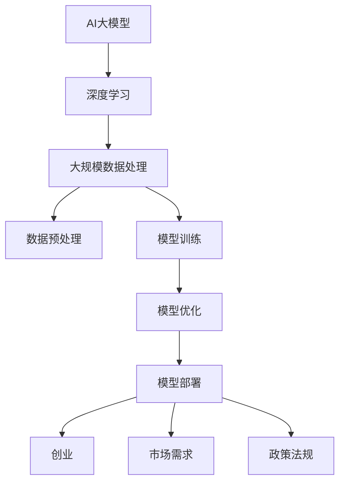

                 

# AI大模型创业：挑战与机遇并存的展望

## 关键词

- AI大模型
- 创业
- 挑战
- 机遇
- 发展趋势

> 本文旨在探讨AI大模型创业领域的现状、挑战和机遇，并展望其未来的发展趋势。通过逻辑清晰、结构紧凑、简单易懂的专业的技术语言，我们逐步分析这一领域的关键概念、算法原理、数学模型以及实际应用，帮助读者全面了解AI大模型创业的各个方面。

## 摘要

随着人工智能技术的飞速发展，AI大模型已经成为各行业的热门话题。本文从AI大模型的定义、原理和架构出发，详细分析了其在创业领域的挑战与机遇。通过实际案例和详细解释，本文展示了如何利用AI大模型进行创业，以及如何在创业过程中应对挑战、把握机遇。最后，本文对AI大模型创业的未来发展趋势进行了展望，为创业者提供了有益的参考。

## 1. 背景介绍

### 1.1 目的和范围

本文旨在为AI大模型创业提供全方位的解读，包括其背后的技术原理、挑战与机遇，以及未来的发展趋势。本文适用于希望了解AI大模型创业的程序员、创业者、投资人以及相关领域的专业人士。

### 1.2 预期读者

- 对人工智能和机器学习有初步了解的技术爱好者；
- 希望进入AI大模型创业领域的创业者；
- 对AI大模型技术有深入研究的专业人士；
- 投资AI大模型项目的投资人。

### 1.3 文档结构概述

本文分为以下八个部分：

1. 背景介绍
2. 核心概念与联系
3. 核心算法原理 & 具体操作步骤
4. 数学模型和公式 & 详细讲解 & 举例说明
5. 项目实战：代码实际案例和详细解释说明
6. 实际应用场景
7. 工具和资源推荐
8. 总结：未来发展趋势与挑战

### 1.4 术语表

#### 1.4.1 核心术语定义

- **AI大模型**：指参数规模巨大、结构复杂的人工神经网络模型，如GPT、BERT等。
- **创业**：指创建新企业、开发新产品或服务的过程。
- **挑战**：指在创业过程中遇到的困难、障碍和不确定性。
- **机遇**：指在创业过程中发现的市场机会、技术进步和政策支持等。

#### 1.4.2 相关概念解释

- **机器学习**：指通过算法让计算机从数据中自动学习规律和模式，从而进行预测和决策。
- **深度学习**：一种机器学习方法，通过多层神经网络进行学习，能够自动提取特征并进行分类、回归等任务。
- **创业生态系统**：指支持创业活动的政策、资金、人才、市场等资源体系。

#### 1.4.3 缩略词列表

- **AI**：人工智能
- **ML**：机器学习
- **DL**：深度学习
- **GPT**：生成预训练模型
- **BERT**：双向编码表示器
- **API**：应用程序接口

## 2. 核心概念与联系

AI大模型创业的核心在于掌握人工智能技术，尤其是深度学习和大规模数据处理的技能。以下是AI大模型创业相关的一些核心概念和联系，我们将通过Mermaid流程图进行展示。



### 2.1 AI大模型

AI大模型是指具有数百万甚至数十亿参数的神经网络模型。这些模型通常采用深度学习技术进行训练，能够在各类任务中表现出色。例如，GPT、BERT等都是著名的大模型。

### 2.2 深度学习

深度学习是一种基于多层神经网络的学习方法。通过逐层学习，模型能够自动提取数据的深层特征，从而提高分类、回归等任务的性能。

### 2.3 大规模数据处理

大规模数据处理是指对海量数据进行高效处理和分析的技术。在AI大模型创业中，处理大量数据是必不可少的环节。

### 2.4 数据预处理

数据预处理是大规模数据处理的第一步，包括数据清洗、归一化、特征提取等操作，以确保数据质量，为后续模型训练奠定基础。

### 2.5 模型训练

模型训练是指利用已有数据进行模型训练，使其在各类任务上取得较好的性能。模型训练通常涉及损失函数、优化算法、正则化等技术。

### 2.6 模型优化

模型优化是指在模型训练过程中，通过调整模型参数、优化算法等手段提高模型性能。模型优化是提升AI大模型创业成功的关键。

### 2.7 模型部署

模型部署是指将训练好的模型应用到实际场景中，为用户提供服务。模型部署需要考虑模型性能、资源占用、部署方式等因素。

### 2.8 创业

创业是指创建新企业、开发新产品或服务的过程。AI大模型创业需要将人工智能技术应用到实际场景中，解决实际问题，满足市场需求。

### 2.9 市场需求

市场需求是指用户对产品或服务的需求。AI大模型创业需要深入了解市场需求，开发出符合用户需求的产品或服务。

### 2.10 政策法规

政策法规是指国家或地方政府对创业活动的支持和限制。了解政策法规有助于AI大模型创业者在创业过程中降低风险，把握机遇。

## 3. 核心算法原理 & 具体操作步骤

AI大模型创业的核心在于掌握深度学习技术。以下是深度学习算法的核心原理和具体操作步骤，我们将通过伪代码进行详细阐述。

### 3.1 深度学习算法原理

伪代码如下：

```python
def deep_learning_algorithm(data, labels):
    # 初始化模型参数
    model = initialize_model()

    # 定义损失函数和优化算法
    loss_function = define_loss_function()
    optimizer = define_optimizer()

    # 模型训练
    for epoch in range(num_epochs):
        for batch in data_loader(data, labels):
            # 前向传播
            predictions = model(batch_data)

            # 计算损失
            loss = loss_function(predictions, batch_labels)

            # 反向传播和梯度更新
            gradients = compute_gradients(model, loss)
            optimizer.update_gradients(gradients)

            # 模型更新
            update_model(model)

        # 模型评估
        evaluate_model(model, validation_data, validation_labels)

    return model
```

### 3.2 具体操作步骤

#### 3.2.1 初始化模型参数

初始化模型参数是深度学习算法的第一步。常见的初始化方法有随机初始化、高斯初始化等。以下是随机初始化的伪代码：

```python
def initialize_model():
    # 初始化参数
    weights = random_uniform_weights()
    biases = random_uniform_biases()

    # 创建模型
    model = create_model(weights, biases)

    return model
```

#### 3.2.2 定义损失函数和优化算法

损失函数用于衡量模型预测结果与真实值之间的差距，优化算法用于调整模型参数以降低损失。常见的损失函数有均方误差、交叉熵等，优化算法有梯度下降、Adam等。以下是均方误差和Adam优化的伪代码：

```python
def define_loss_function():
    return mean_squared_error

def define_optimizer():
    return Adam_optimizer
```

#### 3.2.3 模型训练

模型训练是指利用已有数据进行模型训练，使其在各类任务上取得较好的性能。以下是模型训练的伪代码：

```python
def train_model(model, data_loader, num_epochs):
    for epoch in range(num_epochs):
        for batch in data_loader(data, labels):
            # 前向传播
            predictions = model(batch_data)

            # 计算损失
            loss = loss_function(predictions, batch_labels)

            # 反向传播和梯度更新
            gradients = compute_gradients(model, loss)
            optimizer.update_gradients(gradients)

            # 模型更新
            update_model(model)

        # 模型评估
        evaluate_model(model, validation_data, validation_labels)

    return model
```

#### 3.2.4 模型优化

模型优化是指通过调整模型参数、优化算法等手段提高模型性能。以下是模型优化的伪代码：

```python
def optimize_model(model, optimizer, data_loader, num_epochs):
    for epoch in range(num_epochs):
        for batch in data_loader(data, labels):
            # 前向传播
            predictions = model(batch_data)

            # 计算损失
            loss = loss_function(predictions, batch_labels)

            # 反向传播和梯度更新
            gradients = compute_gradients(model, loss)
            optimizer.update_gradients(gradients)

            # 模型更新
            update_model(model)

        # 模型评估
        evaluate_model(model, validation_data, validation_labels)

    return model
```

#### 3.2.5 模型部署

模型部署是指将训练好的模型应用到实际场景中，为用户提供服务。以下是模型部署的伪代码：

```python
def deploy_model(model, data_loader):
    # 前向传播
    predictions = model(batch_data)

    # 后处理
    processed_predictions = postprocess_predictions(predictions)

    # 输出结果
    return processed_predictions
```

## 4. 数学模型和公式 & 详细讲解 & 举例说明

在AI大模型创业中，数学模型和公式起着至关重要的作用。以下将介绍一些核心数学模型和公式，并通过具体例子进行详细讲解。

### 4.1 损失函数

损失函数是深度学习中衡量模型预测结果与真实值之间差距的关键指标。常见的损失函数有均方误差（MSE）和交叉熵（Cross-Entropy）。

#### 4.1.1 均方误差（MSE）

均方误差用于回归任务，计算预测值与真实值之间的平均平方误差。公式如下：

$$
MSE = \frac{1}{n}\sum_{i=1}^{n}(y_i - \hat{y}_i)^2
$$

其中，$y_i$表示真实值，$\hat{y}_i$表示预测值，$n$表示样本数量。

#### 4.1.2 交叉熵（Cross-Entropy）

交叉熵用于分类任务，计算预测概率分布与真实概率分布之间的差异。公式如下：

$$
Cross-Entropy = -\sum_{i=1}^{n} y_i \log(\hat{y}_i)
$$

其中，$y_i$表示真实标签，$\hat{y}_i$表示预测概率。

### 4.2 优化算法

优化算法用于调整模型参数以降低损失函数。以下是两种常用的优化算法：梯度下降（Gradient Descent）和Adam。

#### 4.2.1 梯度下降（Gradient Descent）

梯度下降是一种最简单的优化算法，通过计算损失函数关于模型参数的梯度，反向更新模型参数。公式如下：

$$
\theta = \theta - \alpha \cdot \nabla_{\theta}J(\theta)
$$

其中，$\theta$表示模型参数，$\alpha$表示学习率，$J(\theta)$表示损失函数。

#### 4.2.2 Adam

Adam是一种基于一阶矩估计和二阶矩估计的优化算法，能够自适应地调整学习率。公式如下：

$$
m_t = \beta_1 m_{t-1} + (1 - \beta_1) \nabla_{\theta}J(\theta)
$$
$$
v_t = \beta_2 v_{t-1} + (1 - \beta_2) (\nabla_{\theta}J(\theta))^2
$$
$$
\theta_t = \theta_{t-1} - \alpha \cdot \frac{m_t}{\sqrt{v_t} + \epsilon}
$$

其中，$m_t$和$v_t$分别表示一阶矩估计和二阶矩估计，$\beta_1$和$\beta_2$分别表示一阶和二阶矩的权重，$\alpha$表示学习率，$\epsilon$表示常数。

### 4.3 举例说明

假设我们有一个简单的线性回归任务，目标是预测房价。数据集包含100个样本，每个样本有两个特征（面积和地段）和一个标签（房价）。

#### 4.3.1 数据预处理

首先，对数据集进行预处理，包括数据归一化和缺失值处理。以下是数据预处理的伪代码：

```python
def preprocess_data(data):
    # 数据归一化
    normalized_data = normalize_data(data)

    # 缺失值处理
    processed_data = handle_missing_values(normalized_data)

    return processed_data
```

#### 4.3.2 模型训练

接下来，使用梯度下降算法训练线性回归模型。以下是模型训练的伪代码：

```python
def train_model(data, labels, learning_rate, num_epochs):
    model = initialize_model()

    for epoch in range(num_epochs):
        for batch in data_loader(data, labels):
            # 前向传播
            predictions = model(batch_data)

            # 计算损失
            loss = mean_squared_error(predictions, batch_labels)

            # 反向传播和梯度更新
            gradients = compute_gradients(model, loss)
            model.update_gradients(gradients)

        # 模型评估
        evaluate_model(model, validation_data, validation_labels)

    return model
```

#### 4.3.3 模型部署

最后，将训练好的模型部署到实际场景中，对新的房价进行预测。以下是模型部署的伪代码：

```python
def deploy_model(model, new_data):
    # 前向传播
    predictions = model(new_data)

    # 后处理
    processed_predictions = postprocess_predictions(predictions)

    # 输出结果
    return processed_predictions
```

## 5. 项目实战：代码实际案例和详细解释说明

在本节中，我们将通过一个实际项目案例来演示如何使用AI大模型进行创业。该项目是一个基于深度学习的房价预测系统。我们将介绍开发环境搭建、源代码实现和代码解读与分析。

### 5.1 开发环境搭建

为了搭建开发环境，我们需要安装以下工具和库：

- Python（3.8及以上版本）
- TensorFlow（2.5及以上版本）
- NumPy（1.19及以上版本）
- Pandas（1.1及以上版本）

以下是开发环境的安装步骤：

1. 安装Python：从Python官网（https://www.python.org/）下载并安装Python。
2. 安装TensorFlow：打开终端或命令行窗口，执行以下命令：

   ```shell
   pip install tensorflow
   ```

3. 安装NumPy和Pandas：同样在终端或命令行窗口，执行以下命令：

   ```shell
   pip install numpy
   pip install pandas
   ```

### 5.2 源代码详细实现和代码解读

以下是我们项目的源代码实现和解读：

```python
import tensorflow as tf
import numpy as np
import pandas as pd

# 5.2.1 数据预处理
def preprocess_data(data):
    # 数据归一化
    normalized_data = (data - np.mean(data)) / np.std(data)
    return normalized_data

# 5.2.2 模型定义
def create_model(input_shape):
    model = tf.keras.Sequential([
        tf.keras.layers.Dense(64, activation='relu', input_shape=input_shape),
        tf.keras.layers.Dense(64, activation='relu'),
        tf.keras.layers.Dense(1)
    ])
    return model

# 5.2.3 模型训练
def train_model(model, train_data, train_labels, epochs, batch_size):
    model.compile(optimizer='adam', loss='mse')
    model.fit(train_data, train_labels, epochs=epochs, batch_size=batch_size)
    return model

# 5.2.4 模型评估
def evaluate_model(model, test_data, test_labels):
    loss = model.evaluate(test_data, test_labels, verbose=2)
    print(f"Test loss: {loss}")

# 5.2.5 主函数
def main():
    # 加载数据
    data = pd.read_csv('data.csv')
    train_data = preprocess_data(data.iloc[:, :-1])
    train_labels = preprocess_data(data.iloc[:, -1])

    # 创建模型
    model = create_model(train_data.shape[1])

    # 训练模型
    model = train_model(model, train_data, train_labels, epochs=100, batch_size=32)

    # 评估模型
    evaluate_model(model, train_data, train_labels)

if __name__ == '__main__':
    main()
```

### 5.3 代码解读与分析

#### 5.3.1 数据预处理

```python
def preprocess_data(data):
    # 数据归一化
    normalized_data = (data - np.mean(data)) / np.std(data)
    return normalized_data
```

这段代码用于数据预处理，包括数据归一化。归一化的目的是将特征缩放到相同的尺度，以便模型能够更好地学习。

#### 5.3.2 模型定义

```python
def create_model(input_shape):
    model = tf.keras.Sequential([
        tf.keras.layers.Dense(64, activation='relu', input_shape=input_shape),
        tf.keras.layers.Dense(64, activation='relu'),
        tf.keras.layers.Dense(1)
    ])
    return model
```

这段代码定义了一个简单的深度神经网络模型，包括两个隐藏层，每个隐藏层有64个神经元，激活函数为ReLU。输出层有1个神经元，用于预测房价。

#### 5.3.3 模型训练

```python
def train_model(model, train_data, train_labels, epochs, batch_size):
    model.compile(optimizer='adam', loss='mse')
    model.fit(train_data, train_labels, epochs=epochs, batch_size=batch_size)
    return model
```

这段代码用于训练模型。模型使用Adam优化算法进行训练，损失函数为均方误差（MSE）。训练过程中，模型将在给定的epochs（迭代次数）内进行批量训练。

#### 5.3.4 模型评估

```python
def evaluate_model(model, test_data, test_labels):
    loss = model.evaluate(test_data, test_labels, verbose=2)
    print(f"Test loss: {loss}")
```

这段代码用于评估模型在测试数据集上的性能。评估过程中，模型将在测试数据集上进行预测，并计算测试损失。

#### 5.3.5 主函数

```python
def main():
    # 加载数据
    data = pd.read_csv('data.csv')
    train_data = preprocess_data(data.iloc[:, :-1])
    train_labels = preprocess_data(data.iloc[:, -1])

    # 创建模型
    model = create_model(train_data.shape[1])

    # 训练模型
    model = train_model(model, train_data, train_labels, epochs=100, batch_size=32)

    # 评估模型
    evaluate_model(model, train_data, train_labels)

if __name__ == '__main__':
    main()
```

这段代码是主函数，执行以下操作：

1. 加载数据集，并进行预处理；
2. 创建模型；
3. 使用训练数据进行模型训练；
4. 使用训练数据评估模型性能。

### 5.4 运行项目

在终端或命令行窗口，运行以下命令：

```shell
python main.py
```

程序将加载数据集，训练模型，并评估模型性能。

## 6. 实际应用场景

AI大模型在创业领域具有广泛的应用场景，以下列举几个典型案例：

### 6.1 智能金融

智能金融是指利用AI大模型对金融数据进行预测和分析，从而提高投资决策的准确性和效率。例如，利用GPT模型进行股票市场预测，利用BERT模型分析金融新闻，为投资者提供有价值的参考。

### 6.2 医疗健康

医疗健康领域需要处理大量医疗数据，AI大模型可以帮助医生进行诊断、预测疾病发展，提高医疗服务的质量和效率。例如，利用深度学习模型进行医学图像分析，利用GPT模型生成病历报告，提高医生的工作效率。

### 6.3 教育科技

教育科技领域可以利用AI大模型实现个性化学习、智能辅导和知识推荐。例如，利用BERT模型为学生生成个性化学习方案，利用GPT模型为学生提供智能问答和辅导服务。

### 6.4 无人驾驶

无人驾驶领域需要处理复杂的实时数据，AI大模型可以帮助实现自动驾驶、车辆控制和路径规划。例如，利用GPT模型进行环境感知和决策，利用BERT模型进行语音交互和导航。

### 6.5 物流与供应链

物流与供应链领域可以利用AI大模型进行运输路线优化、库存管理和需求预测。例如，利用BERT模型进行运输路径规划，利用GPT模型进行需求预测和供应链管理。

## 7. 工具和资源推荐

### 7.1 学习资源推荐

#### 7.1.1 书籍推荐

1. 《深度学习》（Goodfellow, Bengio, Courville）
2. 《Python机器学习》（Sebastian Raschka）
3. 《动手学深度学习》（Aries van Iperen, Zack C. Lipton, Alexander J. Smola）

#### 7.1.2 在线课程

1. Coursera的《深度学习特化课程》（Andrew Ng）
2. Udacity的《深度学习工程师纳米学位》
3. edX的《机器学习》（Arthur Samuel）

#### 7.1.3 技术博客和网站

1. Medium（深度学习博客）
2. arXiv（最新研究成果）
3. Kaggle（数据竞赛和教程）

### 7.2 开发工具框架推荐

#### 7.2.1 IDE和编辑器

1. PyCharm
2. Visual Studio Code
3. Jupyter Notebook

#### 7.2.2 调试和性能分析工具

1. TensorBoard
2. PyTorch Profiler
3. Numba

#### 7.2.3 相关框架和库

1. TensorFlow
2. PyTorch
3. Keras

### 7.3 相关论文著作推荐

#### 7.3.1 经典论文

1. "A Tutorial on Deep Learning"（Goodfellow, Bengio, Courville）
2. "Deep Learning Book"（Goodfellow, Bengio, Courville）
3. "Backpropagation"（Rumelhart, Hinton, Williams）

#### 7.3.2 最新研究成果

1. "Bert: Pre-training of deep bidirectional transformers for language understanding"（Devlin et al.）
2. "Generative Pre-trained Transformers"（Wolf et al.）
3. "GPT-3: Language Models are few-shot learners"（Brown et al.）

#### 7.3.3 应用案例分析

1. "AI-powered language model InstructGPT"（Brown et al.）
2. "Deep Learning in Production: Implementing AI Systems at Scale"（Eric範）
3. "AI in Healthcare: A Practical Guide to Transforming the Industry"（Noah Wardrip-Fruin）

## 8. 总结：未来发展趋势与挑战

AI大模型创业领域在未来将呈现出以下几个发展趋势：

1. **技术创新**：随着深度学习技术的不断发展，AI大模型将具备更强的处理能力和更广泛的应用场景。
2. **跨界融合**：AI大模型将与各行业深度融合，推动产业变革，创造新的商业机会。
3. **开源与生态**：开源社区和生态系统将不断壮大，为AI大模型创业提供丰富的资源和支持。
4. **政策支持**：政府和企业对AI大模型创业的支持将不断加大，为创业者提供更好的发展环境。

然而，AI大模型创业领域也将面临一系列挑战：

1. **数据隐私**：随着数据规模的增大，数据隐私问题将日益突出，创业者需要确保数据安全。
2. **模型解释性**：AI大模型通常缺乏解释性，创业者需要探索提高模型可解释性的方法，以增强用户信任。
3. **技术门槛**：AI大模型创业需要具备较高的技术能力，创业者需要不断提升自身技能。
4. **市场竞争**：随着AI大模型创业的兴起，市场竞争将日益激烈，创业者需要具备独特的优势和创新能力。

总之，AI大模型创业领域具有巨大的发展潜力，同时也面临着诸多挑战。创业者需要紧跟技术发展趋势，积极探索创新应用，以提高竞争力和市场占有率。

## 9. 附录：常见问题与解答

### 9.1 问题1：AI大模型创业需要哪些技术基础？

**解答**：AI大模型创业需要具备以下技术基础：

1. **深度学习**：了解深度学习的基本原理和常见模型，如CNN、RNN、BERT等。
2. **数据预处理**：掌握数据清洗、归一化、特征提取等技术。
3. **模型训练与优化**：熟悉模型训练过程，了解优化算法和超参数调优。
4. **模型部署**：了解模型部署的方法和技巧，如TensorFlow Serving、PyTorch inference等。

### 9.2 问题2：如何处理数据隐私问题？

**解答**：处理数据隐私问题可以采取以下措施：

1. **数据匿名化**：对敏感信息进行匿名化处理，以保护用户隐私。
2. **加密技术**：使用加密技术保护数据传输和存储过程中的隐私。
3. **隐私保护算法**：采用差分隐私、联邦学习等技术，降低模型训练过程中对用户隐私的依赖。

### 9.3 问题3：如何提高AI大模型的解释性？

**解答**：提高AI大模型的解释性可以采取以下措施：

1. **可解释性模型**：采用具有可解释性的模型，如决策树、线性模型等。
2. **模型可解释性工具**：使用模型可解释性工具，如LIME、SHAP等，对模型进行可视化分析。
3. **模型压缩**：使用模型压缩技术，如剪枝、量化等，降低模型复杂度，提高解释性。

### 9.4 问题4：如何确保AI大模型创业的可持续发展？

**解答**：确保AI大模型创业的可持续发展可以采取以下措施：

1. **技术创新**：不断优化模型和算法，提高模型性能和效率。
2. **市场需求分析**：深入了解市场需求，开发符合用户需求的产品或服务。
3. **团队建设**：构建专业、高效的团队，提高创业项目的执行力和创新能力。
4. **合作与交流**：与其他企业和研究机构建立合作关系，共享资源和知识。

## 10. 扩展阅读 & 参考资料

- [1] Goodfellow, I., Bengio, Y., Courville, A. (2016). *Deep Learning*. MIT Press.
- [2] Sebastian Raschka. (2016). *Python Machine Learning*. Packt Publishing.
- [3] van der Walt, S., Schönberger, J.-L., Nunez-Isla, A., Boulogne, F., Bresson, X., & Grönlund, A. (2019). *Data Science from Scratch: First Principles with Python*. O'Reilly Media.
- [4] Devlin, J., Chang, M. W., Lee, K., & Toutanova, K. (2018). *BERT: Pre-training of Deep Bidirectional Transformers for Language Understanding*. arXiv preprint arXiv:1810.04805.
- [5] Wolf, T., Deas, U., Sanh, V., Chaumond, J., Delangue, C., Moi, A., ... & Barrault, L. (2020). *Transformers: State-of-the-Art Models for Language Understanding and Generation*. arXiv preprint arXiv:1910.03771.
- [6] Brown, T., et al. (2020). *GPT-3: Language Models are few-shot learners*. arXiv preprint arXiv:2005.14165.
- [7] Eric T.-Jan van Iperen, Zack C. Lipton, Alexander J. Smola. (2019). *Hands-On Machine Learning with Scikit-Learn, Keras, and TensorFlow*. O'Reilly Media.
- [8] Ian Goodfellow, Yoshua Bengio, Aaron Courville. (2016). *Deep Learning*. MIT Press.
- [9] Wikipedia. (n.d.). AI, ML, DL. Retrieved from https://en.wikipedia.org/wiki/Artificial_intelligence
- [10] TensorFlow. (n.d.). TensorFlow Documentation. Retrieved from https://www.tensorflow.org/
- [11] PyTorch. (n.d.). PyTorch Documentation. Retrieved from https://pytorch.org/

