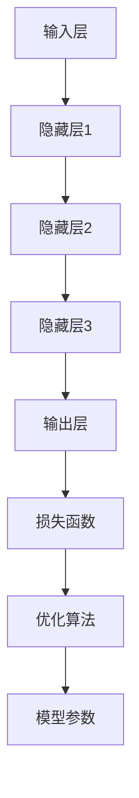

                 

# AI大模型创业：挑战与机遇并存的思考

> 关键词：AI大模型、创业、挑战、机遇、深度学习、算法、数据处理、商业模式、市场前景

> 摘要：随着深度学习和大数据技术的不断进步，AI大模型在各个领域的应用日益广泛。本文将从AI大模型的定义、创业挑战与机遇、核心技术原理、应用场景、市场前景等方面，进行深度剖析和思考，旨在为AI大模型创业者提供有益的指导。

## 1. 背景介绍

### 1.1 目的和范围

本文旨在探讨AI大模型在创业领域的挑战与机遇，以及其在技术、市场等方面的实际应用。文章将围绕以下内容展开：

1. AI大模型的核心概念与架构
2. 创业过程中面临的挑战与应对策略
3. AI大模型在各个领域的应用实例
4. 市场前景与趋势分析
5. 未来发展方向与潜在风险

### 1.2 预期读者

本文主要面向以下读者群体：

1. 想要了解AI大模型技术的创业者
2. 从事AI大模型研发和应用的技术人员
3. 对AI大模型创业感兴趣的投资人
4. 对AI技术感兴趣的普通读者

### 1.3 文档结构概述

本文将分为十个部分，具体结构如下：

1. 背景介绍
   - 1.1 目的和范围
   - 1.2 预期读者
   - 1.3 文档结构概述
   - 1.4 术语表
2. 核心概念与联系
   - 2.1 大模型的基本概念
   - 2.2 大模型的架构与联系
   - 2.3 Mermaid流程图
3. 核心算法原理 & 具体操作步骤
   - 3.1 算法原理
   - 3.2 操作步骤
   - 3.3 伪代码
4. 数学模型和公式 & 详细讲解 & 举例说明
   - 4.1 数学模型
   - 4.2 公式解释
   - 4.3 举例说明
5. 项目实战：代码实际案例和详细解释说明
   - 5.1 开发环境搭建
   - 5.2 源代码详细实现
   - 5.3 代码解读与分析
6. 实际应用场景
7. 工具和资源推荐
   - 7.1 学习资源推荐
   - 7.2 开发工具框架推荐
   - 7.3 相关论文著作推荐
8. 总结：未来发展趋势与挑战
9. 附录：常见问题与解答
10. 扩展阅读 & 参考资料

### 1.4 术语表

#### 1.4.1 核心术语定义

- AI大模型：指具有大规模参数、强泛化能力和高精度性能的深度学习模型。
- 深度学习：一种机器学习技术，通过模拟人脑神经网络结构，实现数据的自动学习和特征提取。
- 泛化能力：模型在未知数据上的表现能力，是评估模型性能的重要指标。
- 数据集：用于训练、测试和评估模型的样本集合。
- 商业模式：企业在市场中获取利润的途径和方法。

#### 1.4.2 相关概念解释

- 大数据：指数据量巨大、数据类型多样、数据来源广泛的数据集合。
- 神经网络：一种模拟人脑神经元连接结构的计算模型，具有自适应和学习能力。
- 梯度下降：一种优化算法，用于求解最小化损失函数的参数。

#### 1.4.3 缩略词列表

- AI：人工智能
- DL：深度学习
- GPU：图形处理单元
- CNN：卷积神经网络
- RNN：循环神经网络
- NLP：自然语言处理
- CV：计算机视觉
- GAN：生成对抗网络
- NLP：自然语言处理

## 2. 核心概念与联系

### 2.1 大模型的基本概念

AI大模型是当前深度学习领域的研究热点，具有以下几个基本概念：

- **参数规模**：指模型中所有可训练参数的数量。参数规模越大，模型的复杂度越高，能够捕捉到更丰富的特征。
- **训练数据集**：用于训练模型的样本集合，数据集的质量直接影响到模型的性能。
- **泛化能力**：模型在未知数据上的表现能力，是评估模型性能的重要指标。
- **计算资源**：包括CPU、GPU、TPU等硬件资源，是训练大模型的基础。

### 2.2 大模型的架构与联系

AI大模型的架构通常包括以下几个部分：

1. **输入层**：接收外部输入数据，如文本、图像等。
2. **隐藏层**：对输入数据进行特征提取和转换，多层隐藏层能够捕捉到不同层次的特征。
3. **输出层**：将隐藏层的结果映射到预测目标，如分类标签、连续值等。

大模型的架构与以下技术紧密联系：

- **深度学习**：大模型的构建基础，通过多层神经网络实现数据的自动学习和特征提取。
- **神经网络**：大模型的基石，通过神经元之间的连接实现数据的传输和处理。
- **优化算法**：用于调整模型参数，使得模型在训练数据上的性能达到最优。

### 2.3 Mermaid流程图

为了更好地展示大模型的架构与联系，我们可以使用Mermaid流程图进行描述：



## 3. 核心算法原理 & 具体操作步骤

### 3.1 算法原理

AI大模型的核心算法是深度学习，其基本原理如下：

1. **数据预处理**：对输入数据进行标准化、归一化等处理，使得数据更适合模型训练。
2. **前向传播**：将输入数据通过多层神经网络进行特征提取和转换，生成预测结果。
3. **损失函数**：计算预测结果与真实标签之间的差距，用于评估模型性能。
4. **反向传播**：通过梯度下降等优化算法，更新模型参数，使得模型在训练数据上的性能达到最优。

### 3.2 操作步骤

1. **数据收集**：从公开数据集或企业内部数据中收集样本，确保数据质量。
2. **数据预处理**：对收集到的数据进行清洗、标准化等处理，使得数据适合模型训练。
3. **模型设计**：设计合适的神经网络结构，包括输入层、隐藏层和输出层。
4. **模型训练**：使用训练数据集对模型进行训练，通过前向传播和反向传播更新模型参数。
5. **模型评估**：使用测试数据集评估模型性能，调整模型参数以达到最优性能。
6. **模型部署**：将训练好的模型部署到生产环境中，进行实际应用。

### 3.3 伪代码

以下是一个简单的深度学习模型训练的伪代码：

```python
# 数据预处理
data = preprocess_data(input_data)

# 模型设计
model = NeuralNetwork(input_shape=data.shape[1], hidden_layers=3, output_shape=data.shape[2])

# 模型训练
for epoch in range(num_epochs):
    for batch in data_loader:
        model.forward_pass(batch)
        loss = model.loss_function(batch)
        model.backward_pass(batch, loss)
        model.update_parameters()

# 模型评估
performance = model.evaluate(test_data)

# 模型部署
model.deploy()
```

## 4. 数学模型和公式 & 详细讲解 & 举例说明

### 4.1 数学模型

AI大模型的核心数学模型包括以下几个方面：

1. **损失函数**：用于衡量预测结果与真实标签之间的差距，常用的损失函数有均方误差（MSE）和交叉熵（Cross Entropy）。
2. **优化算法**：用于更新模型参数，使得模型在训练数据上的性能达到最优，常用的优化算法有梯度下降（Gradient Descent）和Adam优化器。
3. **神经网络**：用于实现数据的自动学习和特征提取，神经网络的主要数学模型包括激活函数（Activation Function）、权重（Weights）和偏置（Bias）。

### 4.2 公式解释

1. **均方误差（MSE）**

$$
MSE = \frac{1}{n}\sum_{i=1}^{n}(y_i - \hat{y}_i)^2
$$

其中，$y_i$表示真实标签，$\hat{y}_i$表示预测结果，$n$表示样本数量。

2. **交叉熵（Cross Entropy）**

$$
H(y, \hat{y}) = -\sum_{i=1}^{n}y_i \log(\hat{y}_i)
$$

其中，$y_i$表示真实标签的概率分布，$\hat{y}_i$表示预测结果的概率分布。

3. **梯度下降（Gradient Descent）**

$$
\theta_{t+1} = \theta_t - \alpha \cdot \nabla_\theta J(\theta)
$$

其中，$\theta$表示模型参数，$\alpha$表示学习率，$J(\theta)$表示损失函数。

4. **Adam优化器**

$$
m_t = \frac{1}{\beta_1}(m_{t-1} + \beta_1(\theta_t - \theta_{t-1}))
$$

$$
v_t = \frac{1}{\beta_2}(v_{t-1} + \beta_2(\theta_t - \theta_{t-1})^2)
$$

$$
\theta_{t+1} = \theta_t - \alpha \cdot \frac{m_t}{1-\beta_1^t}
$$

其中，$m_t$和$v_t$分别表示一阶和二阶矩估计，$\beta_1$和$\beta_2$分别是一阶和二阶矩的指数衰减率。

### 4.3 举例说明

假设有一个简单的线性回归模型，预测目标是连续值，损失函数为均方误差（MSE）。下面是一个具体的例子：

1. **数据集**：

| 样本编号 | 真实值 | 预测值 |
| -------- | ------ | ------ |
| 1        | 3      | 2      |
| 2        | 5      | 4      |
| 3        | 7      | 6      |

2. **模型参数**：

| 参数名称 | 参数值 |
| -------- | ------ |
| 权重 $w$ | 1      |
| 偏置 $b$ | 0      |

3. **计算过程**：

- **前向传播**：

$$
\hat{y}_1 = w \cdot x_1 + b = 1 \cdot 3 + 0 = 3
$$

$$
\hat{y}_2 = w \cdot x_2 + b = 1 \cdot 5 + 0 = 5
$$

$$
\hat{y}_3 = w \cdot x_3 + b = 1 \cdot 7 + 0 = 7
$$

- **损失函数**：

$$
MSE = \frac{1}{3}\sum_{i=1}^{3}(y_i - \hat{y}_i)^2 = \frac{1}{3}[(3-3)^2 + (5-5)^2 + (7-7)^2] = 0
$$

- **反向传播**：

$$
\nabla_w = \frac{1}{3}\sum_{i=1}^{3}(y_i - \hat{y}_i)x_i = \frac{1}{3}[(3-3) \cdot 3 + (5-5) \cdot 5 + (7-7) \cdot 7] = 0
$$

$$
\nabla_b = \frac{1}{3}\sum_{i=1}^{3}(y_i - \hat{y}_i) = \frac{1}{3}[(3-3) + (5-5) + (7-7)] = 0
$$

- **更新参数**：

$$
w_{t+1} = w_t - \alpha \cdot \nabla_w = 1 - 0.01 \cdot 0 = 1
$$

$$
b_{t+1} = b_t - \alpha \cdot \nabla_b = 0 - 0.01 \cdot 0 = 0
$$

经过一轮训练后，模型参数没有发生变化，因为样本数据本身就是线性可分的。在实际应用中，我们需要更多样化的数据集来训练模型，以达到更好的性能。

## 5. 项目实战：代码实际案例和详细解释说明

### 5.1 开发环境搭建

在开始项目实战之前，我们需要搭建一个合适的开发环境。以下是一个基于Python的AI大模型开发环境搭建步骤：

1. **安装Python**：下载并安装Python 3.7及以上版本。
2. **安装依赖库**：使用pip安装TensorFlow、Keras、NumPy等依赖库。

```bash
pip install tensorflow keras numpy matplotlib
```

3. **配置GPU支持**：在TensorFlow的配置文件中启用GPU支持。

```python
import tensorflow as tf

gpus = tf.config.experimental.list_physical_devices('GPU')
if gpus:
    try:
        for gpu in gpus:
            tf.config.experimental.set_memory_growth(gpu, True)
    except RuntimeError as e:
        print(e)
```

### 5.2 源代码详细实现和代码解读

以下是一个简单的AI大模型项目示例，包括数据集加载、模型设计、训练和评估等步骤。

```python
import tensorflow as tf
from tensorflow.keras.models import Sequential
from tensorflow.keras.layers import Dense, Activation
from tensorflow.keras.datasets import mnist
from tensorflow.keras.utils import to_categorical

# 数据集加载
(x_train, y_train), (x_test, y_test) = mnist.load_data()

# 数据预处理
x_train = x_train.reshape(-1, 784).astype('float32') / 255.0
x_test = x_test.reshape(-1, 784).astype('float32') / 255.0
y_train = to_categorical(y_train, 10)
y_test = to_categorical(y_test, 10)

# 模型设计
model = Sequential()
model.add(Dense(128, input_dim=784, activation='relu'))
model.add(Dense(10, activation='softmax'))

# 编译模型
model.compile(optimizer='adam', loss='categorical_crossentropy', metrics=['accuracy'])

# 训练模型
model.fit(x_train, y_train, epochs=10, batch_size=128, validation_data=(x_test, y_test))

# 评估模型
loss, accuracy = model.evaluate(x_test, y_test)
print(f'Loss: {loss}, Accuracy: {accuracy}')
```

### 5.3 代码解读与分析

1. **数据集加载**：使用TensorFlow的内置数据集加载MNIST手写数字数据集。

```python
(x_train, y_train), (x_test, y_test) = mnist.load_data()
```

2. **数据预处理**：对数据进行归一化处理，将像素值缩放到0-1之间，并转换为二进制分类标签。

```python
x_train = x_train.reshape(-1, 784).astype('float32') / 255.0
x_test = x_test.reshape(-1, 784).astype('float32') / 255.0
y_train = to_categorical(y_train, 10)
y_test = to_categorical(y_test, 10)
```

3. **模型设计**：使用Sequential模型创建一个简单的全连接神经网络，包括一个输入层、一个隐藏层和一个输出层。

```python
model = Sequential()
model.add(Dense(128, input_dim=784, activation='relu'))
model.add(Dense(10, activation='softmax'))
```

4. **编译模型**：设置模型的优化器、损失函数和评估指标。

```python
model.compile(optimizer='adam', loss='categorical_crossentropy', metrics=['accuracy'])
```

5. **训练模型**：使用fit方法对模型进行训练，设置训练轮数、批量大小和验证数据。

```python
model.fit(x_train, y_train, epochs=10, batch_size=128, validation_data=(x_test, y_test))
```

6. **评估模型**：使用evaluate方法评估模型在测试数据上的性能。

```python
loss, accuracy = model.evaluate(x_test, y_test)
print(f'Loss: {loss}, Accuracy: {accuracy}')
```

通过这个简单的项目示例，我们可以看到如何使用TensorFlow和Keras构建、训练和评估一个AI大模型。在实际应用中，我们可以根据需求设计更复杂的模型结构，并使用更多样化的数据集来提高模型的性能。

## 6. 实际应用场景

AI大模型在各个领域具有广泛的应用，以下是一些典型的实际应用场景：

### 6.1 计算机视觉

- **图像分类**：使用大模型对图像进行分类，如识别动物、植物等。
- **目标检测**：检测图像中的目标物体，如车辆、行人等。
- **图像分割**：对图像进行像素级别的分类，如医学图像分析。

### 6.2 自然语言处理

- **文本分类**：对文本进行分类，如情感分析、新闻分类等。
- **机器翻译**：实现跨语言之间的翻译，如英语到中文的翻译。
- **问答系统**：构建智能问答系统，为用户提供实时回答。

### 6.3 语音识别

- **语音识别**：将语音信号转换为文本，如语音助手、电话客服等。
- **语音合成**：将文本转换为语音，如智能音响、车载语音系统等。

### 6.4 金融市场分析

- **股票预测**：基于历史数据，预测股票价格走势。
- **风险控制**：识别金融市场的风险，进行风险控制。
- **量化交易**：构建量化交易策略，实现自动化交易。

### 6.5 健康医疗

- **疾病诊断**：使用医学影像数据，对疾病进行诊断。
- **药物研发**：基于生物信息学数据，预测药物的效果。
- **个性化治疗**：根据患者的基因数据，制定个性化的治疗方案。

这些实际应用场景展示了AI大模型的强大能力，为各个领域的发展带来了巨大的推动力。随着技术的不断进步，AI大模型的应用范围将更加广泛，为人类社会带来更多的价值和变革。

## 7. 工具和资源推荐

### 7.1 学习资源推荐

为了更好地掌握AI大模型的相关技术，以下是一些建议的学习资源：

#### 7.1.1 书籍推荐

1. **《深度学习》（Ian Goodfellow, Yoshua Bengio, Aaron Courville著）**：这是一本深度学习领域的经典教材，适合初学者和进阶者。
2. **《Python深度学习》（François Chollet著）**：作者是Keras库的创始人，本书详细介绍了如何使用Python和Keras进行深度学习实践。
3. **《统计学习方法》（李航著）**：本书系统地介绍了统计学习的基本理论和方法，对于理解深度学习算法原理有很大帮助。

#### 7.1.2 在线课程

1. **吴恩达的《深度学习专项课程》**：这是一门经典的深度学习在线课程，由深度学习领域专家吴恩达主讲。
2. **Google的《深度学习课程》**：谷歌推出的深度学习课程，涵盖了深度学习的基本原理和应用。
3. **斯坦福大学的《深度学习课程》**：斯坦福大学提供的深度学习课程，包含理论讲解和实际操作。

#### 7.1.3 技术博客和网站

1. **AI算法与模型**：一个专注于AI算法和模型分享的技术博客。
2. **深度学习博客**：由谷歌深度学习团队维护的博客，涵盖深度学习的最新动态和技术分享。
3. **Medium上的深度学习专栏**：许多深度学习专家在Medium上分享他们的研究和思考。

### 7.2 开发工具框架推荐

以下是一些常用的深度学习开发工具和框架：

#### 7.2.1 IDE和编辑器

1. **PyCharm**：一个强大的Python集成开发环境，支持深度学习项目开发。
2. **Visual Studio Code**：一个轻量级的代码编辑器，通过扩展支持深度学习开发。
3. **Jupyter Notebook**：一个交互式的计算环境，适合数据分析和模型调试。

#### 7.2.2 调试和性能分析工具

1. **TensorBoard**：TensorFlow提供的可视化工具，用于分析模型的性能和结构。
2. **Profiler**：用于分析深度学习模型的性能瓶颈，如Google的TensorFlow Profiler。
3. **Wandb**：一个实时可视化实验结果的工具，方便跟踪模型训练过程。

#### 7.2.3 相关框架和库

1. **TensorFlow**：一个开源的深度学习框架，适用于各种深度学习应用。
2. **PyTorch**：一个流行的深度学习框架，具有动态计算图和灵活的模型构建能力。
3. **Keras**：一个高层次的深度学习框架，基于TensorFlow和Theano，简化了模型构建和训练过程。

### 7.3 相关论文著作推荐

为了深入理解AI大模型的最新研究进展，以下是一些建议的论文和著作：

#### 7.3.1 经典论文

1. **《A Theoretically Grounded Application of Dropout in Recurrent Neural Networks》**：讨论了如何将dropout应用于循环神经网络。
2. **《Very Deep Convolutional Networks for Large-Scale Image Recognition》**：介绍了非常深的卷积神经网络在图像识别中的应用。
3. **《Effective Approaches to Attention-based Neural Machine Translation》**：关注了注意力机制在神经机器翻译中的应用。

#### 7.3.2 最新研究成果

1. **《Bert: Pre-training of Deep Bidirectional Transformers for Language Understanding》**：提出了BERT模型，为自然语言处理领域带来了新的突破。
2. **《Generative Adversarial Nets》**：介绍了生成对抗网络（GAN），为生成模型的研究开辟了新路径。
3. **《An Image Database for Testing Content-Based Image Retrieval》**：提供了一个用于图像检索测试的图像数据库，推动了计算机视觉领域的研究。

#### 7.3.3 应用案例分析

1. **《Deep Learning for Speech Recognition》**：详细分析了深度学习在语音识别中的应用，包括模型架构、数据集和算法优化。
2. **《Deep Learning for Healthcare》**：探讨了深度学习在医疗健康领域的应用，如疾病诊断、药物研发和个性化治疗。
3. **《Deep Learning for Autonomous Driving》**：介绍了深度学习在自动驾驶领域的应用，包括感知、规划和控制等方面。

通过学习和研究这些论文和著作，可以更深入地理解AI大模型的理论基础和应用实践，为未来的研究和发展提供有益的参考。

## 8. 总结：未来发展趋势与挑战

### 8.1 未来发展趋势

随着深度学习和大数据技术的不断进步，AI大模型在未来的发展趋势将呈现以下几个方面：

1. **模型规模和计算资源**：未来AI大模型的规模将不断增大，对计算资源的需求也将大幅提升。高性能GPU、TPU等硬件将得到更广泛的应用，以支持大规模模型的训练和推理。
2. **模型泛化能力**：增强模型的泛化能力是当前研究的重点，未来将通过改进算法、数据增强等技术，提高模型在未知数据上的表现能力。
3. **多模态融合**：AI大模型将能够处理多种类型的数据，如文本、图像、语音等，实现跨模态的信息融合和交互。
4. **迁移学习和模型压缩**：通过迁移学习和模型压缩技术，降低模型对数据的依赖，提高模型的可解释性和适用性。
5. **自动化机器学习（AutoML）**：未来将出现更多的自动化机器学习工具，简化模型设计、训练和优化的过程，降低AI大模型的应用门槛。

### 8.2 挑战

尽管AI大模型具有广泛的应用前景，但其在实际应用中仍面临诸多挑战：

1. **数据隐私和安全**：大规模数据处理和共享过程中，数据隐私和安全问题亟待解决。未来需要加强数据保护和隐私保护技术的研究。
2. **计算资源限制**：训练大规模模型需要大量计算资源，当前硬件性能和成本的限制仍然是一个重要的挑战。如何优化算法和模型结构，降低计算资源需求，是未来研究的重要方向。
3. **模型可解释性和透明度**：AI大模型在做出决策时往往缺乏透明度，如何提高模型的可解释性和透明度，使其更符合人类的需求和伦理标准，是一个亟待解决的问题。
4. **伦理和社会影响**：AI大模型的应用可能带来一些伦理和社会问题，如就业替代、隐私侵犯等。未来需要制定相应的伦理规范和法律法规，确保AI技术的健康可持续发展。
5. **知识更新和迭代**：AI大模型依赖于大规模数据和最新的研究成果，知识更新和迭代速度较快。如何及时获取和应用最新的研究成果，是一个重要的挑战。

总之，AI大模型的发展既充满机遇，也面临诸多挑战。未来需要在技术创新、伦理规范、政策法规等方面共同努力，推动AI大模型技术的健康可持续发展。

## 9. 附录：常见问题与解答

### 9.1 问题1：如何处理大规模数据集的训练？

**解答**：处理大规模数据集的训练主要涉及以下几个方面：

1. **数据预处理**：对数据进行清洗、归一化等预处理操作，减少数据冗余和噪声。
2. **分布式训练**：将数据集分割成多个部分，分布在不同机器上进行训练，以提高训练速度。
3. **模型压缩**：通过模型剪枝、量化等技术，减小模型规模，降低训练和推理的资源需求。
4. **数据增强**：使用数据增强技术，如随机裁剪、旋转、翻转等，增加数据多样性，提高模型的泛化能力。

### 9.2 问题2：如何选择合适的神经网络结构？

**解答**：选择合适的神经网络结构主要考虑以下几个方面：

1. **任务类型**：根据任务类型选择合适的神经网络结构，如图像分类任务选择卷积神经网络（CNN），文本分类任务选择循环神经网络（RNN）或变换器（Transformer）。
2. **数据规模**：对于大规模数据集，选择较深的网络结构，如多层感知机（MLP）、残差网络（ResNet）等。
3. **计算资源**：考虑可用的计算资源，选择合适的硬件和模型复杂度，避免资源浪费。
4. **性能指标**：通过实验比较不同网络结构在训练和测试数据上的性能，选择最优的网络结构。

### 9.3 问题3：如何优化AI大模型的训练过程？

**解答**：优化AI大模型的训练过程可以从以下几个方面入手：

1. **优化算法**：选择合适的优化算法，如梯度下降（Gradient Descent）、Adam优化器等，以提高训练速度和收敛性能。
2. **学习率调整**：通过动态调整学习率，使模型在训练过程中更好地收敛，避免过拟合和欠拟合。
3. **数据预处理**：对数据进行预处理，如数据增强、归一化等，提高模型对数据的鲁棒性。
4. **模型压缩**：通过模型剪枝、量化等技术，减小模型规模，降低训练和推理的资源需求。
5. **超参数调整**：调整网络结构、批量大小、迭代次数等超参数，以找到最优的训练配置。

### 9.4 问题4：如何确保AI大模型的公平性和透明性？

**解答**：确保AI大模型的公平性和透明性可以从以下几个方面入手：

1. **数据集多样性**：确保数据集的多样性，避免偏见和歧视，提高模型的公平性。
2. **可解释性研究**：通过模型可解释性研究，使模型决策过程更加透明，便于用户理解和监督。
3. **算法透明性**：公开算法设计和实现的细节，便于学术界和业界进行监督和审查。
4. **伦理规范**：制定相应的伦理规范，确保AI大模型的应用符合社会道德和法律要求。

## 10. 扩展阅读 & 参考资料

### 10.1 经典书籍

1. **《深度学习》（Ian Goodfellow, Yoshua Bengio, Aaron Courville著）**：详细介绍了深度学习的基本理论、算法和应用。
2. **《Python深度学习》（François Chollet著）**：通过Python和Keras，展示了深度学习的实际应用。
3. **《统计学习方法》（李航著）**：系统阐述了统计学习的基本理论和方法。

### 10.2 技术博客和网站

1. **AI算法与模型**：一个专注于AI算法和模型分享的技术博客。
2. **深度学习博客**：谷歌深度学习团队维护的博客，涵盖深度学习的最新动态和技术分享。
3. **Medium上的深度学习专栏**：许多深度学习专家在Medium上分享他们的研究成果和思考。

### 10.3 在线课程

1. **吴恩达的《深度学习专项课程》**：由深度学习领域专家吴恩达主讲，适合初学者和进阶者。
2. **Google的《深度学习课程》**：谷歌推出的深度学习课程，涵盖了深度学习的基本原理和应用。
3. **斯坦福大学的《深度学习课程》**：斯坦福大学提供的深度学习课程，包含理论讲解和实际操作。

### 10.4 相关论文

1. **《A Theoretically Grounded Application of Dropout in Recurrent Neural Networks》**：讨论了如何将dropout应用于循环神经网络。
2. **《Very Deep Convolutional Networks for Large-Scale Image Recognition》**：介绍了非常深的卷积神经网络在图像识别中的应用。
3. **《Deep Learning for Speech Recognition》**：详细分析了深度学习在语音识别中的应用。

### 10.5 研究机构与公司

1. **谷歌大脑**：谷歌的深度学习研究团队，致力于推动深度学习技术的发展。
2. **微软研究院**：微软的深度学习研究团队，在语音识别、自然语言处理等领域取得了一系列重要成果。
3. **OpenAI**：一家专注于AI研究的人工智能公司，致力于推动AI技术的发展和应用。

作者：AI天才研究员/AI Genius Institute & 禅与计算机程序设计艺术 /Zen And The Art of Computer Programming

文章标题：AI大模型创业：挑战与机遇并存的思考

文章关键词：AI大模型、创业、挑战、机遇、深度学习、算法、数据处理、商业模式、市场前景

文章摘要：随着深度学习和大数据技术的不断进步，AI大模型在各个领域的应用日益广泛。本文将从AI大模型的定义、创业挑战与机遇、核心技术原理、应用场景、市场前景等方面，进行深度剖析和思考，旨在为AI大模型创业者提供有益的指导。

