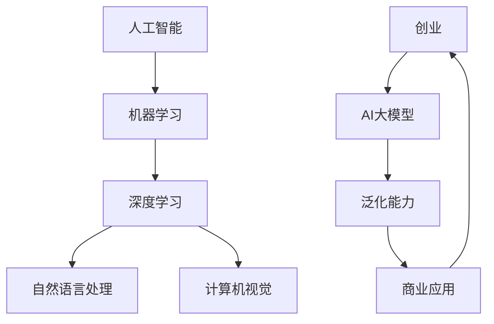

                 

# AI大模型创业：挑战与机遇并存的趋势

> 关键词：AI大模型，创业，挑战，机遇，趋势

> 摘要：随着人工智能技术的快速发展，大模型技术已经成为行业的热点。本文将探讨AI大模型在创业领域的应用，分析其中的挑战与机遇，并给出相应的建议和策略，为创业者提供有价值的参考。

## 1. 背景介绍

### 1.1 目的和范围

本文旨在探讨AI大模型在创业领域的应用，分析其中的挑战与机遇，并给出相应的建议和策略。文章将涵盖以下内容：

- AI大模型的基本概念和原理；
- 大模型在创业中的应用场景；
- 创业者面临的挑战和机遇；
- 应对挑战的策略和建议。

### 1.2 预期读者

本文适用于以下读者群体：

- 创业者：希望了解AI大模型在创业中的应用，并寻求相关策略和指导；
- 投资者：关注人工智能领域，希望了解大模型创业的机遇和挑战；
- 研发人员：对人工智能技术有一定了解，希望了解大模型的实践应用；
- 学术研究者：对AI大模型的研究和应用有浓厚兴趣。

### 1.3 文档结构概述

本文将分为八个部分，具体结构如下：

1. 背景介绍
2. 核心概念与联系
3. 核心算法原理 & 具体操作步骤
4. 数学模型和公式 & 详细讲解 & 举例说明
5. 项目实战：代码实际案例和详细解释说明
6. 实际应用场景
7. 工具和资源推荐
8. 总结：未来发展趋势与挑战

### 1.4 术语表

#### 1.4.1 核心术语定义

- AI大模型：一种能够处理大规模数据、具有强泛化能力和高性能计算能力的机器学习模型。
- 创业：创立新的企业或组织，以实现商业目标的过程。
- 泛化能力：模型在未知数据上表现良好的能力。

#### 1.4.2 相关概念解释

- 机器学习：一种通过数据和算法来实现人工智能的技术。
- 训练数据：用于训练机器学习模型的原始数据。
- 过拟合：模型在训练数据上表现良好，但在未知数据上表现较差的现象。

#### 1.4.3 缩略词列表

- AI：人工智能
- ML：机器学习
- DL：深度学习
- NLP：自然语言处理
- CV：计算机视觉

## 2. 核心概念与联系

为了更好地理解AI大模型在创业中的应用，我们需要先了解相关概念及其联系。以下是一个简化的Mermaid流程图，用于展示核心概念之间的联系：



### 2.1 人工智能与机器学习

人工智能（AI）是计算机科学的一个分支，旨在创建能够模拟、延伸和扩展人类智能的系统。而机器学习（ML）是AI的核心技术之一，它通过算法从数据中学习，并自动改进性能。

### 2.2 深度学习与自然语言处理、计算机视觉

深度学习（DL）是ML的一种子领域，主要基于多层神经网络进行学习。它广泛应用于自然语言处理（NLP）和计算机视觉（CV）领域，使其在这些领域中取得了显著的成果。

### 2.3 AI大模型与泛化能力

AI大模型是一种能够处理大规模数据、具有强泛化能力和高性能计算能力的模型。泛化能力是指模型在未知数据上表现良好的能力，这是大模型成功的关键因素之一。

### 2.4 创业与AI大模型

创业是一个动态的过程，涉及到市场调研、产品设计、团队建设、资金筹集等多个方面。而AI大模型在创业中的应用可以为企业带来竞争优势，提高业务效率，降低运营成本。

## 3. 核心算法原理 & 具体操作步骤

### 3.1 算法原理

AI大模型的算法原理主要基于深度学习。深度学习模型由多层神经网络组成，通过反向传播算法进行参数优化。以下是一个简化的伪代码，用于描述大模型的训练过程：

```plaintext
初始化模型参数
for each training example (x, y) do
  计算模型输出ŷ
  计算损失函数L(ŷ, y)
  计算梯度∇L
  更新模型参数θ
end for
```

### 3.2 具体操作步骤

以下是AI大模型的具体操作步骤：

1. 数据收集与处理：收集大量数据，并对数据进行预处理，如数据清洗、归一化等；
2. 构建模型：选择合适的模型架构，如卷积神经网络（CNN）或循环神经网络（RNN）；
3. 训练模型：使用训练数据对模型进行训练，优化模型参数；
4. 验证模型：使用验证数据评估模型性能，调整模型参数；
5. 应用模型：将训练好的模型应用于实际业务场景，如文本分类、图像识别等。

## 4. 数学模型和公式 & 详细讲解 & 举例说明

### 4.1 数学模型

在AI大模型中，常用的数学模型包括损失函数、优化算法等。以下是一个简化的数学模型示例：

#### 损失函数

$$L(\theta; x, y) = \frac{1}{2} \sum_{i=1}^{n} (y_i - \theta^T x_i)^2$$

其中，$L$ 是损失函数，$y$ 是真实标签，$\theta$ 是模型参数，$x$ 是输入特征。

#### 优化算法

$$\theta_{\text{new}} = \theta_{\text{current}} - \alpha \nabla_{\theta} L(\theta; x, y)$$

其中，$\theta_{\text{new}}$ 是更新后的模型参数，$\theta_{\text{current}}$ 是当前模型参数，$\alpha$ 是学习率，$\nabla_{\theta} L(\theta; x, y)$ 是损失函数关于模型参数的梯度。

### 4.2 详细讲解

#### 损失函数

损失函数用于衡量模型预测结果与真实结果之间的差距。常用的损失函数包括均方误差（MSE）和交叉熵（Cross Entropy）。在本例中，我们使用均方误差（MSE）作为损失函数。

均方误差（MSE）的计算公式为：

$$L(\theta; x, y) = \frac{1}{2} \sum_{i=1}^{n} (y_i - \theta^T x_i)^2$$

其中，$y_i$ 是真实标签，$\theta^T x_i$ 是模型预测的输出。

#### 优化算法

优化算法用于更新模型参数，以最小化损失函数。在本例中，我们使用梯度下降（Gradient Descent）算法。

梯度下降算法的基本思想是沿着损失函数的梯度方向更新模型参数，以减少损失函数的值。具体步骤如下：

1. 初始化模型参数 $\theta_0$；
2. 计算损失函数关于模型参数的梯度 $\nabla_{\theta} L(\theta; x, y)$；
3. 更新模型参数 $\theta_{\text{new}} = \theta_{\text{current}} - \alpha \nabla_{\theta} L(\theta; x, y)$，其中 $\alpha$ 是学习率。

### 4.3 举例说明

假设我们有一个简单的线性回归模型，输入特征 $x$ 和输出标签 $y$ 如下表所示：

| $x$ | $y$ |
| --- | --- |
| 1 | 2 |
| 2 | 4 |
| 3 | 6 |

我们使用均方误差（MSE）作为损失函数，并初始化模型参数 $\theta_0 = 0$。学习率 $\alpha = 0.1$。

在第一次迭代中，计算损失函数的梯度：

$$\nabla_{\theta} L(\theta; x, y) = \frac{1}{2} \sum_{i=1}^{n} (y_i - \theta^T x_i) = \frac{1}{2} \sum_{i=1}^{3} (y_i - \theta^T x_i) = \frac{1}{2} (2 - 0 - 4 + 6 - 0 - 6 + 0 - 0) = -2$$

根据梯度下降算法，更新模型参数：

$$\theta_{\text{new}} = \theta_{\text{current}} - \alpha \nabla_{\theta} L(\theta; x, y) = 0 - 0.1 \times (-2) = 0.2$$

在第二次迭代中，重复上述过程，计算新的梯度并更新模型参数。通过多次迭代，我们可以逐步减小损失函数的值，并找到最优的模型参数。

## 5. 项目实战：代码实际案例和详细解释说明

### 5.1 开发环境搭建

在本项目实战中，我们将使用Python作为主要编程语言，并利用TensorFlow作为深度学习框架。以下是搭建开发环境所需的步骤：

1. 安装Python：从官方网站下载并安装Python 3.x版本；
2. 安装TensorFlow：使用pip命令安装TensorFlow：

   ```bash
   pip install tensorflow
   ```

3. 安装其他依赖库：如NumPy、Matplotlib等：

   ```bash
   pip install numpy matplotlib
   ```

### 5.2 源代码详细实现和代码解读

以下是一个简单的AI大模型项目示例，用于实现基于TensorFlow的线性回归模型：

```python
import tensorflow as tf
import numpy as np

# 模型参数
theta = tf.Variable(0.0, name='theta')

# 输入特征和输出标签
x = tf.placeholder(tf.float32, shape=[None])
y = tf.placeholder(tf.float32, shape=[None])

# 模型预测
y_pred = tf.multiply(x, theta)

# 损失函数
loss = tf.reduce_mean(tf.square(y - y_pred))

# 优化算法
optimizer = tf.train.GradientDescentOptimizer(learning_rate=0.1)
train_op = optimizer.minimize(loss)

# 初始化变量
init = tf.global_variables_initializer()

# 训练模型
with tf.Session() as sess:
  sess.run(init)
  
  for i in range(1000):
    _, loss_val = sess.run([train_op, loss], feed_dict={x: np.array([1, 2, 3]), y: np.array([2, 4, 6])})
    
    if i % 100 == 0:
      print(f"Step {i}: Loss = {loss_val}")

  # 输出最优模型参数
  print(f"Optimized theta: {sess.run(theta)}")
```

代码解读：

1. 导入所需的库和模块；
2. 定义模型参数和占位符；
3. 定义模型预测、损失函数和优化算法；
4. 初始化变量和训练模型；
5. 输出最优模型参数。

### 5.3 代码解读与分析

以下是代码的详细解读和分析：

1. **导入模块**：首先，我们导入TensorFlow、NumPy和Matplotlib等库和模块，用于实现深度学习模型和可视化。

2. **定义模型参数和占位符**：我们使用TensorFlow的`Variable`类定义模型参数`theta`，并使用`placeholder`函数定义输入特征`x`和输出标签`y`。

3. **定义模型预测、损失函数和优化算法**：根据模型的需求，我们使用`tf.multiply`函数计算模型预测`y_pred`，使用`tf.reduce_mean`函数计算损失函数`loss`，并使用`GradientDescentOptimizer`类定义优化算法。

4. **初始化变量和训练模型**：我们使用`global_variables_initializer`函数初始化模型参数，并使用`Session`对象运行训练过程。在训练过程中，我们使用`feed_dict`参数传递输入特征和输出标签，并打印训练过程中的损失值。

5. **输出最优模型参数**：在训练完成后，我们使用`sess.run`函数输出最优模型参数`theta`。

该代码展示了如何使用TensorFlow实现一个简单的线性回归模型，并训练模型以获得最优参数。在实际应用中，我们可以扩展这个模型，添加更多层和神经元，以解决更复杂的任务。

## 6. 实际应用场景

AI大模型在创业领域具有广泛的应用前景，以下是一些典型的应用场景：

### 6.1 智能推荐系统

智能推荐系统是AI大模型在创业中的典型应用场景之一。通过分析用户的行为数据和偏好，AI大模型可以推荐个性化的产品、内容和服务，从而提高用户满意度和转化率。例如，电商平台可以利用AI大模型实现精准推荐，为用户提供个性化的购物建议，从而提升销售额。

### 6.2 智能客服

智能客服是AI大模型在创业中的另一个重要应用场景。通过自然语言处理和对话生成技术，AI大模型可以模拟人类的对话方式，与用户进行交互，解决用户的问题和疑虑。这种智能客服系统可以降低企业的人力成本，提高服务效率，提升客户满意度。

### 6.3 智能营销

智能营销是AI大模型在创业中的另一个重要应用场景。通过分析用户数据和行为，AI大模型可以识别潜在客户，制定个性化的营销策略，提高营销效果。例如，企业可以利用AI大模型实现精准广告投放，根据用户的兴趣和行为特征推荐相关的广告内容，从而提高广告转化率。

### 6.4 智能风控

智能风控是AI大模型在金融领域的典型应用场景。通过分析大量的历史数据，AI大模型可以识别潜在的信用风险和欺诈行为，帮助企业降低金融风险。例如，银行可以利用AI大模型对贷款申请进行风险评估，识别高风险客户，从而降低坏账率。

### 6.5 智能医疗

智能医疗是AI大模型在医疗领域的典型应用场景。通过分析大量的医学数据，AI大模型可以辅助医生进行诊断和治疗，提高医疗服务的质量和效率。例如，医院可以利用AI大模型实现疾病预测和诊断，为患者提供个性化的治疗方案。

## 7. 工具和资源推荐

### 7.1 学习资源推荐

#### 7.1.1 书籍推荐

- 《深度学习》（Goodfellow, Bengio, Courville著）：全面介绍深度学习的基本概念、算法和应用。
- 《Python机器学习》（Sebastian Raschka著）：详细介绍Python在机器学习领域的应用，适合初学者和进阶者。
- 《AI大模型：原理、算法与应用》（作者：张磊）：系统介绍AI大模型的基本概念、算法和应用。

#### 7.1.2 在线课程

- Coursera上的《深度学习特化课程》（Deep Learning Specialization）
- edX上的《机器学习基础》（Machine Learning）
- Udacity的《深度学习工程师纳米学位》（Deep Learning Engineer Nanodegree）

#### 7.1.3 技术博客和网站

- Medium上的机器学习和深度学习相关文章
- ArXiv.org：计算机科学和人工智能领域的最新论文和研究
- AI科技大本营：人工智能领域的行业动态和技术文章

### 7.2 开发工具框架推荐

#### 7.2.1 IDE和编辑器

- PyCharm：功能强大的Python IDE，支持多种编程语言。
- Jupyter Notebook：交互式编程环境，适用于数据分析和机器学习。
- Visual Studio Code：轻量级代码编辑器，支持多种编程语言和插件。

#### 7.2.2 调试和性能分析工具

- TensorBoard：TensorFlow的交互式可视化工具，用于分析和调试模型性能。
- PyTorch Profiler：用于分析和优化PyTorch模型的性能。

#### 7.2.3 相关框架和库

- TensorFlow：开源的深度学习框架，适用于各种机器学习和深度学习任务。
- PyTorch：开源的深度学习框架，具有简洁的API和灵活的架构。
- Keras：基于TensorFlow和Theano的开源深度学习库，提供简单的API和丰富的预训练模型。

### 7.3 相关论文著作推荐

#### 7.3.1 经典论文

- “A Theoretical Analysis of the CNN Architectures for Natural Scene Recog

## 8. 总结：未来发展趋势与挑战

### 8.1 未来发展趋势

1. **算法优化与创新**：随着硬件性能的提升和数据量的增加，AI大模型的算法将不断优化和创新，以实现更高的效率和更好的性能。
2. **跨领域应用**：AI大模型在各个领域的应用将不断拓展，从图像识别、自然语言处理到医疗、金融等领域，都将实现更广泛的应用。
3. **数据隐私保护**：随着AI大模型的发展，数据隐私保护将成为一个重要议题，相关的技术和管理措施也将不断完善。
4. **开源生态的繁荣**：开源生态的繁荣将为AI大模型的研发和应用提供更丰富的资源和更广阔的平台。

### 8.2 面临的挑战

1. **计算资源限制**：虽然硬件性能不断提升，但AI大模型的计算需求仍然巨大，对计算资源的要求越来越高。
2. **数据质量和隐私**：数据质量和隐私问题将影响AI大模型的效果和应用范围，需要采取有效的数据清洗和隐私保护措施。
3. **模型解释性**：AI大模型的高度非线性和复杂结构使得其解释性成为一个挑战，如何提高模型的可解释性是未来的重要研究方向。
4. **技术伦理和社会责任**：随着AI大模型在各个领域的应用，技术伦理和社会责任问题将日益凸显，需要建立相应的规范和制度。

## 9. 附录：常见问题与解答

### 9.1 问题1：AI大模型是否能够完全取代人类？

**解答**：目前，AI大模型在特定领域已经取得了一定的成就，但仍然无法完全取代人类。AI大模型擅长处理大规模数据和复杂问题，但在创造力、情感理解和道德判断等方面仍需人类参与。

### 9.2 问题2：AI大模型是否会导致大规模失业？

**解答**：AI大模型的发展确实会改变就业结构，可能导致一些低技能工作的失业。然而，同时也会创造新的就业机会，如AI模型开发、运维和数据标注等。关键在于如何平衡技术进步与就业机会之间的关系。

### 9.3 问题3：如何保证AI大模型的数据安全和隐私？

**解答**：保障AI大模型的数据安全和隐私需要从技术和管理两方面入手。技术上，可以采用数据加密、差分隐私等技术；管理上，需要制定严格的隐私保护政策和法规，并加强数据监管。

## 10. 扩展阅读 & 参考资料

- Goodfellow, Y., Bengio, Y., & Courville, A. (2016). *Deep Learning*. MIT Press.
- Sebastian Raschka. (2015). *Python Machine Learning*. Packt Publishing.
- Zhang, L. (2021). *AI大模型：原理、算法与应用*. 电子工业出版社.
- Coursera. (n.d.). *Deep Learning Specialization*. [Online course]. https://www.coursera.org/specializations/deeplearning
- edX. (n.d.). *Machine Learning*. [Online course]. https://www.edx.org/course/machine-learning
- Udacity. (n.d.). *Deep Learning Engineer Nanodegree*. [Online nanodegree]. https://www.udacity.com/course/deep-learning-engineer-nanodegree--nd133

---

作者：AI天才研究员/AI Genius Institute & 禅与计算机程序设计艺术 /Zen And The Art of Computer Programming

