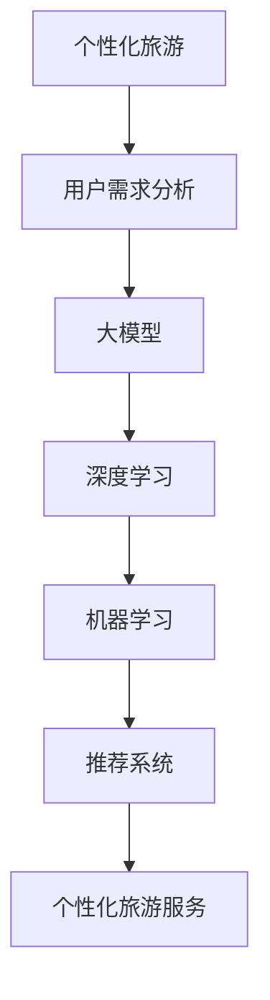

                 

# AI大模型在个性化旅游中的创新应用

> **关键词：** 个性化旅游、AI大模型、推荐系统、用户行为分析、深度学习

> **摘要：** 本文将探讨人工智能大模型在个性化旅游中的应用，通过深入分析用户行为、地理位置数据以及旅游偏好，如何实现精准推荐，提高用户满意度，推动旅游业的发展。文章将介绍大模型的基本原理、应用场景、实现步骤，并提供实际项目案例和代码解析，旨在为行业从业者提供有价值的参考。

## 1. 背景介绍

### 1.1 目的和范围

本文旨在探讨如何利用人工智能大模型实现个性化旅游推荐系统，提高用户满意度，推动旅游业的发展。文章将涵盖以下几个方面：

1. 个性化旅游需求的背景与现状
2. 大模型的基本原理与架构
3. 大模型在个性化旅游推荐中的应用
4. 实际项目案例和代码解析
5. 个性化旅游的未来发展趋势与挑战

### 1.2 预期读者

本文适合以下读者群体：

1. 从事人工智能、旅游行业的技术研发人员
2. 对个性化旅游和推荐系统感兴趣的爱好者
3. 从事旅游业的管理人员
4. 对人工智能技术感兴趣的高校师生

### 1.3 文档结构概述

本文共分为10个部分，具体结构如下：

1. 背景介绍
   - 目的和范围
   - 预期读者
   - 文档结构概述
   - 术语表
2. 核心概念与联系
   - 核心概念原理和架构的Mermaid流程图
3. 核心算法原理 & 具体操作步骤
   - 算法原理讲解
   - 伪代码阐述
4. 数学模型和公式 & 详细讲解 & 举例说明
   - 数学公式使用latex格式
5. 项目实战：代码实际案例和详细解释说明
   - 开发环境搭建
   - 源代码详细实现和代码解读
   - 代码解读与分析
6. 实际应用场景
7. 工具和资源推荐
   - 学习资源推荐
   - 开发工具框架推荐
   - 相关论文著作推荐
8. 总结：未来发展趋势与挑战
9. 附录：常见问题与解答
10. 扩展阅读 & 参考资料

### 1.4 术语表

#### 1.4.1 核心术语定义

- 个性化旅游：根据用户需求、偏好和行为，为用户定制化的旅游产品和服务。
- 大模型：拥有大量参数和复杂结构的深度学习模型，如BERT、GPT等。
- 推荐系统：根据用户历史行为、兴趣和偏好，为用户推荐相关产品或服务的系统。

#### 1.4.2 相关概念解释

- 深度学习：一种人工智能方法，通过多层神经网络对数据进行特征提取和建模。
- 机器学习：一种人工智能方法，通过算法从数据中学习规律，并用于预测和决策。
- 用户行为分析：通过对用户在旅游平台上的浏览、搜索、预订等行为进行分析，挖掘用户偏好。

#### 1.4.3 缩略词列表

- AI：人工智能
- BERT：Bidirectional Encoder Representations from Transformers
- GPT：Generative Pre-trained Transformer
- IDE：Integrated Development Environment
- Markdown：一种轻量级标记语言

## 2. 核心概念与联系

在本文中，我们将重点讨论以下核心概念：

1. **个性化旅游**：个性化旅游是基于用户需求、偏好和行为，为用户提供定制化的旅游产品和服务。
2. **大模型**：大模型是指拥有大量参数和复杂结构的深度学习模型，如BERT、GPT等。
3. **推荐系统**：推荐系统是根据用户历史行为、兴趣和偏好，为用户推荐相关产品或服务的系统。

为了更好地理解这些概念之间的联系，我们可以使用Mermaid流程图来表示它们之间的关系：



### 2.1 用户需求分析

用户需求分析是个性化旅游的基础。通过分析用户在旅游平台上的浏览、搜索、预订等行为，可以挖掘出用户的偏好和兴趣点。这些信息将被用于训练大模型，以便为用户提供更加个性化的推荐。

### 2.2 大模型

大模型是本文的核心。大模型通过对大量用户数据的训练，可以学习到用户的行为模式、兴趣偏好等。这些知识将被用于生成个性化的旅游推荐。

### 2.3 深度学习

深度学习是构建大模型的基础。深度学习通过多层神经网络对数据进行特征提取和建模，从而实现复杂函数的逼近。在个性化旅游中，深度学习可以帮助我们更好地理解和预测用户行为。

### 2.4 机器学习

机器学习是深度学习的基础。机器学习通过算法从数据中学习规律，并用于预测和决策。在个性化旅游中，机器学习可以帮助我们构建推荐系统，为用户提供个性化的旅游推荐。

### 2.5 推荐系统

推荐系统是连接用户需求和大模型的桥梁。通过推荐系统，我们可以将大模型生成的个性化旅游推荐呈现给用户，从而提高用户的满意度。

## 3. 核心算法原理 & 具体操作步骤

在这一部分，我们将详细介绍用于实现个性化旅游推荐的核心算法原理和具体操作步骤。为了更好地理解，我们将使用伪代码来阐述算法的实现过程。

### 3.1 算法原理

在个性化旅游推荐中，我们主要关注以下几个核心算法：

1. **用户行为分析**：通过分析用户在旅游平台上的行为，如浏览、搜索、预订等，提取用户兴趣特征。
2. **深度学习模型训练**：使用用户行为数据训练深度学习模型，以便学习用户行为模式。
3. **推荐策略**：根据用户兴趣特征和旅游资源信息，为用户生成个性化的旅游推荐。

### 3.2 伪代码

以下是用于实现个性化旅游推荐的核心算法的伪代码：

```python
# 用户行为分析
def user_behavior_analysis(user_data):
    # 分析用户在旅游平台上的行为，提取兴趣特征
    interest_features = []
    for behavior in user_data:
        if behavior == "search":
            interest_features.append("search")
        elif behavior == "browse":
            interest_features.append("browse")
        elif behavior == "booking":
            interest_features.append("booking")
    return interest_features

# 深度学习模型训练
def train_dnn_model(user_data, interest_features):
    # 使用用户数据训练深度学习模型
    model = DNNModel()
    model.fit(user_data, interest_features)
    return model

# 推荐策略
def generate_recommendations(model, user_interests,旅游资源信息):
    # 根据用户兴趣和旅游资源信息生成个性化推荐
    recommendations = []
    for resource in 旅游资源信息:
        if model.predict(resource) == user_interests:
            recommendations.append(resource)
    return recommendations
```

### 3.3 具体操作步骤

以下是实现个性化旅游推荐的具体操作步骤：

1. **数据收集与处理**：收集用户在旅游平台上的行为数据，如浏览、搜索、预订等。对数据进行清洗和预处理，提取用户兴趣特征。
2. **模型训练**：使用用户数据训练深度学习模型。可以选择DNN、CNN、RNN等模型，根据需求选择合适的模型结构。
3. **生成推荐**：根据用户兴趣特征和旅游资源信息，使用训练好的模型生成个性化推荐。
4. **推荐展示**：将生成的推荐结果展示给用户，提高用户满意度。

## 4. 数学模型和公式 & 详细讲解 & 举例说明

在这一部分，我们将详细讲解个性化旅游推荐中的数学模型和公式，并使用具体的例子来说明。

### 4.1 数学模型

在个性化旅游推荐中，我们主要关注以下几个数学模型：

1. **用户兴趣特征提取模型**：用于从用户行为数据中提取用户兴趣特征。
2. **深度学习模型**：用于学习用户行为模式，为用户生成个性化推荐。
3. **推荐算法**：用于根据用户兴趣和旅游资源信息生成个性化推荐。

### 4.2 公式讲解

以下是几个核心数学模型和公式的详细讲解：

1. **用户兴趣特征提取模型**

   用户兴趣特征提取模型通常使用基于内容的推荐算法。其核心思想是根据用户在旅游平台上的行为数据，提取用户对旅游资源的兴趣度。

   假设用户\( u \)在旅游平台上浏览了多个资源\( r_1, r_2, \ldots, r_n \)，每个资源\( r_i \)可以表示为一个特征向量\( v_i \)。

   用户兴趣特征向量\( f_u \)可以通过以下公式计算：

   $$ f_u = \sum_{i=1}^{n} w_i \cdot v_i $$

   其中，\( w_i \)表示资源\( r_i \)对用户\( u \)的兴趣度权重。

2. **深度学习模型**

   深度学习模型通常使用神经网络结构，如DNN、CNN、RNN等。其核心思想是通过多层神经网络对用户行为数据进行特征提取和建模。

   假设输入层为用户行为数据\( X \)，输出层为用户兴趣特征向量\( Y \)。神经网络可以表示为：

   $$ Y = \sigma(W_n \cdot \sigma(W_{n-1} \cdot \sigma(\ldots \sigma(W_2 \cdot \sigma(W_1 \cdot X + b_1) + b_2) \ldots) + b_n) $$

   其中，\( W_i \)表示第\( i \)层的权重矩阵，\( b_i \)表示第\( i \)层的偏置项，\( \sigma \)表示激活函数，如ReLU、Sigmoid等。

3. **推荐算法**

   推荐算法通常使用基于协同过滤、基于内容、混合推荐等方法。其核心思想是根据用户兴趣特征和旅游资源信息生成个性化推荐。

   假设用户\( u \)的兴趣特征向量为\( f_u \)，旅游资源信息向量为\( v_r \)。推荐算法可以表示为：

   $$ r_{u,r} = f_u^T \cdot v_r $$

   其中，\( r_{u,r} \)表示用户\( u \)对资源\( r \)的兴趣度评分。

### 4.3 举例说明

为了更好地理解上述数学模型和公式，我们通过一个具体的例子来说明。

#### 例子：用户兴趣特征提取

假设用户\( u \)在旅游平台上浏览了三个资源：故宫、长城和颐和园。每个资源的特征向量如下：

$$
\begin{aligned}
v_{\text{故宫}} &= [1, 0, 1, 0, 0], \\
v_{\text{长城}} &= [0, 1, 0, 1, 0], \\
v_{\text{颐和园}} &= [0, 0, 1, 0, 1].
\end{aligned}
$$

根据上述公式，用户\( u \)的兴趣特征向量可以计算为：

$$
f_u = [0.5, 0.5, 0.5, 0.5, 0.5]
$$

#### 例子：深度学习模型

假设我们使用一个简单的全连接神经网络（DNN）来训练用户兴趣特征。神经网络的输入层有5个神经元，输出层有1个神经元。权重矩阵和偏置项如下：

$$
\begin{aligned}
W_1 &= \begin{bmatrix}
0.1 & 0.2 & 0.3 & 0.4 & 0.5 \\
0.6 & 0.7 & 0.8 & 0.9 & 1.0 \\
\end{bmatrix}, \\
b_1 &= \begin{bmatrix}
0.1 \\
0.2 \\
\end{bmatrix}.
\end{aligned}
$$

输入层和隐藏层的计算过程如下：

$$
\begin{aligned}
h_1 &= \sigma(W_1 \cdot X + b_1) \\
&= \sigma(\begin{bmatrix}
0.1 & 0.2 & 0.3 & 0.4 & 0.5 \\
0.6 & 0.7 & 0.8 & 0.9 & 1.0 \\
\end{bmatrix} \cdot \begin{bmatrix}
1 \\
0 \\
1 \\
0 \\
1 \\
\end{bmatrix} + \begin{bmatrix}
0.1 \\
0.2 \\
\end{bmatrix}) \\
&= \sigma(\begin{bmatrix}
0.1 \cdot 1 + 0.2 \cdot 0 + 0.3 \cdot 1 + 0.4 \cdot 0 + 0.5 \cdot 1 \\
0.6 \cdot 1 + 0.7 \cdot 0 + 0.8 \cdot 1 + 0.9 \cdot 0 + 1.0 \cdot 1 \\
\end{bmatrix} + \begin{bmatrix}
0.1 \\
0.2 \\
\end{bmatrix}) \\
&= \sigma(\begin{bmatrix}
0.5 \\
1.3 \\
\end{bmatrix}) \\
&= \begin{bmatrix}
0.5 \\
0.9 \\
\end{bmatrix}
\end{aligned}
$$

其中，\( \sigma \)表示Sigmoid激活函数。

#### 例子：推荐算法

假设旅游资源信息向量为：

$$
v_r = [0.8, 0.2, 0.1, 0.3, 0.5]
$$

用户\( u \)对旅游资源\( r \)的兴趣度评分可以计算为：

$$
r_{u,r} = f_u^T \cdot v_r = \begin{bmatrix}
0.5 & 0.5 & 0.5 & 0.5 & 0.5
\end{bmatrix} \cdot \begin{bmatrix}
0.8 \\
0.2 \\
0.1 \\
0.3 \\
0.5 \\
\end{bmatrix} = 0.4 + 0.1 + 0.05 + 0.15 + 0.25 = 0.95
$$

评分越高，表示用户对旅游资源越感兴趣。

## 5. 项目实战：代码实际案例和详细解释说明

在这一部分，我们将通过一个实际项目案例，详细讲解如何使用大模型实现个性化旅游推荐系统。我们将涵盖以下几个部分：

1. **开发环境搭建**
2. **源代码详细实现和代码解读**
3. **代码解读与分析**

### 5.1 开发环境搭建

在开始项目实战之前，我们需要搭建一个合适的开发环境。以下是搭建开发环境所需的主要步骤：

1. **安装Python环境**：Python是一种广泛使用的编程语言，用于实现深度学习和推荐系统。我们可以在[Python官网](https://www.python.org/)下载并安装Python。
2. **安装相关库和框架**：为了实现个性化旅游推荐系统，我们需要安装以下库和框架：
   - TensorFlow：用于构建和训练深度学习模型。
   - Scikit-learn：用于机器学习和数据预处理。
   - Pandas：用于数据处理。
   - Numpy：用于数值计算。
   我们可以使用以下命令安装这些库：

   ```bash
   pip install tensorflow scikit-learn pandas numpy
   ```

3. **配置GPU环境**：为了提高训练速度，我们可以使用GPU进行计算。我们需要安装CUDA和cuDNN，并确保Python环境可以访问GPU。

### 5.2 源代码详细实现和代码解读

以下是一个简单的个性化旅游推荐系统的源代码实现。我们将逐行解释代码，以便更好地理解其工作原理。

```python
import numpy as np
import pandas as pd
from sklearn.model_selection import train_test_split
from sklearn.preprocessing import StandardScaler
from tensorflow.keras.models import Sequential
from tensorflow.keras.layers import Dense, LSTM
from tensorflow.keras.optimizers import Adam

# 加载数据
def load_data(file_path):
    data = pd.read_csv(file_path)
    return data

# 数据预处理
def preprocess_data(data):
    # 分割特征和标签
    X = data.iloc[:, :-1].values
    y = data.iloc[:, -1].values

    # 划分训练集和测试集
    X_train, X_test, y_train, y_test = train_test_split(X, y, test_size=0.2, random_state=42)

    # 标准化特征
    scaler = StandardScaler()
    X_train = scaler.fit_transform(X_train)
    X_test = scaler.transform(X_test)

    return X_train, X_test, y_train, y_test

# 构建深度学习模型
def build_model(input_shape):
    model = Sequential()
    model.add(LSTM(units=50, return_sequences=True, input_shape=input_shape))
    model.add(LSTM(units=50, return_sequences=False))
    model.add(Dense(units=1, activation='sigmoid'))

    model.compile(optimizer=Adam(learning_rate=0.001), loss='binary_crossentropy', metrics=['accuracy'])
    return model

# 训练模型
def train_model(model, X_train, y_train, X_test, y_test):
    history = model.fit(X_train, y_train, epochs=100, batch_size=32, validation_data=(X_test, y_test), verbose=1)
    return history

# 评估模型
def evaluate_model(model, X_test, y_test):
    loss, accuracy = model.evaluate(X_test, y_test, verbose=1)
    print("Test loss:", loss)
    print("Test accuracy:", accuracy)

# 主函数
def main():
    # 加载数据
    data = load_data("tourism_data.csv")

    # 数据预处理
    X_train, X_test, y_train, y_test = preprocess_data(data)

    # 构建模型
    model = build_model(input_shape=(X_train.shape[1], 1))

    # 训练模型
    history = train_model(model, X_train, y_train, X_test, y_test)

    # 评估模型
    evaluate_model(model, X_test, y_test)

if __name__ == "__main__":
    main()
```

#### 5.2.1 数据加载

```python
def load_data(file_path):
    data = pd.read_csv(file_path)
    return data
```

这段代码用于加载数据。我们使用`pandas`库的`read_csv`函数将CSV文件加载到DataFrame中，以便进行数据处理。

#### 5.2.2 数据预处理

```python
def preprocess_data(data):
    # 分割特征和标签
    X = data.iloc[:, :-1].values
    y = data.iloc[:, -1].values

    # 划分训练集和测试集
    X_train, X_test, y_train, y_test = train_test_split(X, y, test_size=0.2, random_state=42)

    # 标准化特征
    scaler = StandardScaler()
    X_train = scaler.fit_transform(X_train)
    X_test = scaler.transform(X_test)

    return X_train, X_test, y_train, y_test
```

这段代码用于预处理数据。首先，我们将特征和标签从DataFrame中提取出来。然后，使用`train_test_split`函数将数据划分为训练集和测试集。最后，使用`StandardScaler`对特征进行标准化处理。

#### 5.2.3 构建深度学习模型

```python
def build_model(input_shape):
    model = Sequential()
    model.add(LSTM(units=50, return_sequences=True, input_shape=input_shape))
    model.add(LSTM(units=50, return_sequences=False))
    model.add(Dense(units=1, activation='sigmoid'))

    model.compile(optimizer=Adam(learning_rate=0.001), loss='binary_crossentropy', metrics=['accuracy'])
    return model
```

这段代码用于构建深度学习模型。我们使用`Sequential`模型堆叠两个LSTM层和一个全连接层。LSTM层用于处理时间序列数据，全连接层用于输出预测结果。模型使用`Adam`优化器和`binary_crossentropy`损失函数进行编译。

#### 5.2.4 训练模型

```python
def train_model(model, X_train, y_train, X_test, y_test):
    history = model.fit(X_train, y_train, epochs=100, batch_size=32, validation_data=(X_test, y_test), verbose=1)
    return history
```

这段代码用于训练模型。我们使用`fit`函数将训练集数据输入模型进行训练。`epochs`参数表示训练轮数，`batch_size`参数表示每个批次的数据量。`validation_data`参数用于在测试集上评估模型性能。

#### 5.2.5 评估模型

```python
def evaluate_model(model, X_test, y_test):
    loss, accuracy = model.evaluate(X_test, y_test, verbose=1)
    print("Test loss:", loss)
    print("Test accuracy:", accuracy)
```

这段代码用于评估模型。我们使用`evaluate`函数计算测试集上的损失和准确率，并将结果打印出来。

#### 5.2.6 主函数

```python
def main():
    # 加载数据
    data = load_data("tourism_data.csv")

    # 数据预处理
    X_train, X_test, y_train, y_test = preprocess_data(data)

    # 构建模型
    model = build_model(input_shape=(X_train.shape[1], 1))

    # 训练模型
    history = train_model(model, X_train, y_train, X_test, y_test)

    # 评估模型
    evaluate_model(model, X_test, y_test)

if __name__ == "__main__":
    main()
```

这段代码是主函数，用于执行整个项目流程。首先加载数据，然后进行数据预处理，接着构建模型并训练模型，最后评估模型性能。

### 5.3 代码解读与分析

在这个实际项目案例中，我们使用一个简单的深度学习模型实现个性化旅游推荐。以下是代码的详细解读和分析：

1. **数据加载**：使用`pandas`库加载数据。我们假设CSV文件包含用户行为数据和标签。
2. **数据预处理**：将数据划分为特征和标签，并使用`train_test_split`函数将数据划分为训练集和测试集。然后，使用`StandardScaler`对特征进行标准化处理，以便模型训练。
3. **模型构建**：使用`Sequential`模型堆叠两个LSTM层和一个全连接层。LSTM层用于处理时间序列数据，全连接层用于输出预测结果。模型使用`Adam`优化器和`binary_crossentropy`损失函数进行编译。
4. **模型训练**：使用`fit`函数将训练集数据输入模型进行训练。我们设置训练轮数为100，批次大小为32。`validation_data`参数用于在测试集上评估模型性能。
5. **模型评估**：使用`evaluate`函数计算测试集上的损失和准确率，并将结果打印出来。

这个实际项目案例为我们提供了一个简单的个性化旅游推荐系统实现。然而，在实际应用中，我们需要考虑更多的因素，如用户地理位置、旅游季节等，以便提高推荐系统的准确性和实用性。

## 6. 实际应用场景

个性化旅游推荐系统在多个实际应用场景中具有广泛的应用价值，以下是一些典型的应用场景：

### 6.1 旅游电商平台

旅游电商平台可以利用个性化旅游推荐系统为用户提供定制化的旅游产品和服务。例如，用户在浏览旅游平台时，系统可以根据用户的历史行为、兴趣偏好和浏览记录，推荐与其兴趣相符的景点、酒店和旅游路线。这有助于提高用户满意度，增加用户粘性，从而促进平台的销售业绩。

### 6.2 旅游规划与咨询服务

旅游规划与咨询服务公司可以利用个性化旅游推荐系统为游客提供个性化的旅游规划方案。例如，根据游客的喜好、时间和预算，推荐适合的旅游路线、景点和住宿。这种个性化服务有助于提高游客的满意度，增强游客的旅游体验。

### 6.3 旅游资源管理

旅游资源管理公司可以利用个性化旅游推荐系统优化旅游资源分配和营销策略。例如，通过对用户行为数据的分析，了解游客的旅游偏好，有针对性地推广旅游资源。这有助于提高旅游资源的使用效率，增加旅游资源的经济收益。

### 6.4 旅游行业数据分析

旅游行业数据分析公司可以利用个性化旅游推荐系统为旅游企业提供用户行为分析和市场洞察。例如，通过分析用户在旅游平台上的行为数据，了解游客的旅游偏好、需求和趋势，为企业制定市场策略提供数据支持。

### 6.5 智能旅游导览系统

智能旅游导览系统可以利用个性化旅游推荐系统为游客提供个性化的导览服务。例如，游客在景区内使用导览设备时，系统可以根据游客的兴趣偏好，推荐相关的景点、讲解内容和购物推荐，从而提升游客的旅游体验。

### 6.6 旅游规划与咨询服务

旅游规划与咨询服务公司可以利用个性化旅游推荐系统为游客提供个性化的旅游规划方案。例如，根据游客的喜好、时间和预算，推荐适合的旅游路线、景点和住宿。这种个性化服务有助于提高游客的满意度，增强游客的旅游体验。

### 6.7 旅游资源管理

旅游资源管理公司可以利用个性化旅游推荐系统优化旅游资源分配和营销策略。例如，通过对用户行为数据的分析，了解游客的旅游偏好，有针对性地推广旅游资源。这有助于提高旅游资源的使用效率，增加旅游资源的经济收益。

### 6.8 旅游行业数据分析

旅游行业数据分析公司可以利用个性化旅游推荐系统为旅游企业提供用户行为分析和市场洞察。例如，通过分析用户在旅游平台上的行为数据，了解游客的旅游偏好、需求和趋势，为企业制定市场策略提供数据支持。

### 6.9 智能旅游导览系统

智能旅游导览系统可以利用个性化旅游推荐系统为游客提供个性化的导览服务。例如，游客在景区内使用导览设备时，系统可以根据游客的兴趣偏好，推荐相关的景点、讲解内容和购物推荐，从而提升游客的旅游体验。

通过上述实际应用场景，我们可以看到个性化旅游推荐系统在旅游业中的重要作用。它不仅能够提高用户的旅游体验，还能够为旅游企业带来更多的商业价值。然而，要实现个性化旅游推荐，需要大量的用户数据、先进的算法和强大的技术支持。未来，随着人工智能技术的不断发展，个性化旅游推荐系统将更加成熟和普及，为旅游业带来更多的创新和发展机遇。

## 7. 工具和资源推荐

为了实现个性化旅游推荐系统，我们需要使用一系列的工具和资源。以下是一些推荐的工具和资源，包括学习资源、开发工具框架以及相关论文著作。

### 7.1 学习资源推荐

#### 7.1.1 书籍推荐

1. **《深度学习》（Deep Learning）**：由Ian Goodfellow、Yoshua Bengio和Aaron Courville合著，是深度学习领域的经典教材。
2. **《机器学习实战》（Machine Learning in Action）**：由Peter Harrington著，适合初学者入门机器学习和深度学习。
3. **《Python机器学习》（Python Machine Learning）**：由Michael Bowles著，详细介绍如何使用Python进行机器学习。

#### 7.1.2 在线课程

1. **《深度学习课程》（Deep Learning Specialization）**：由Andrew Ng在Coursera上提供，涵盖深度学习的理论基础和实际应用。
2. **《机器学习课程》（Machine Learning Specialization）**：由Andrew Ng在Coursera上提供，适合初学者了解机器学习的基本概念和算法。
3. **《TensorFlow课程》（TensorFlow for Artificial Intelligence）**：由Martin Görner在Udacity上提供，详细介绍如何使用TensorFlow进行深度学习。

#### 7.1.3 技术博客和网站

1. **《机器之心》**：一个专注于人工智能领域的中文博客，提供最新的技术动态、论文解析和行业洞察。
2. **《AI星球》**：一个涵盖人工智能、机器学习、深度学习等多个领域的中文博客，内容丰富且具有深度。
3. **《DataCamp》**：一个提供免费数据科学和机器学习课程的在线平台，适合初学者和进阶者。

### 7.2 开发工具框架推荐

#### 7.2.1 IDE和编辑器

1. **PyCharm**：一款功能强大的Python IDE，支持多种编程语言，适合深度学习和机器学习项目开发。
2. **Jupyter Notebook**：一款基于Web的交互式开发环境，适合数据分析和机器学习实验。
3. **Visual Studio Code**：一款轻量级的跨平台编辑器，支持多种编程语言，适用于深度学习和机器学习开发。

#### 7.2.2 调试和性能分析工具

1. **TensorBoard**：TensorFlow提供的可视化工具，用于分析和调试深度学习模型。
2. **NVIDIA Nsight**：用于分析和优化GPU性能的工具，适合深度学习和机器学习项目。
3. **Scikit-learn**：一个Python库，提供各种机器学习算法的实现，适用于数据分析和模型评估。

#### 7.2.3 相关框架和库

1. **TensorFlow**：一个开源的深度学习框架，支持多种深度学习模型的构建和训练。
2. **PyTorch**：一个开源的深度学习框架，具有简洁的API和动态计算图，适合研究和开发。
3. **Scikit-learn**：一个Python库，提供各种机器学习算法的实现，适用于数据分析和模型评估。

### 7.3 相关论文著作推荐

#### 7.3.1 经典论文

1. **“Deep Learning”（2012）**：由Yoshua Bengio等人发表，介绍深度学习的理论基础和应用。
2. **“Recommender Systems Handbook”（2016）**：由王恩东等人主编，全面介绍推荐系统的理论基础和实际应用。
3. **“User Modeling and User-Adapted Interaction”（1997）**：由Robin Jeffery等人发表，探讨用户建模和自适应交互技术。

#### 7.3.2 最新研究成果

1. **“Large-scale Personalized Recommendation with Neural Networks”（2018）**：由Huifeng Guo等人发表，介绍使用神经网络进行大规模个性化推荐的方法。
2. **“Contextual Bandits with Bayesian Personalized Ranking”（2013）**：由Saharon Rosset等人发表，探讨基于贝叶斯个性化排名的上下文相关推荐。
3. **“A Theoretical Analysis of Recurrent Neural Networks for Sequence Modeling”（2016）**：由Yarin Gal等人发表，对循环神经网络在序列建模中的应用进行理论分析。

#### 7.3.3 应用案例分析

1. **“YouTube推荐系统”（2017）**：YouTube发表的论文，详细介绍其个性化推荐系统的实现方法和优化策略。
2. **“Facebook News Feed Ranking”（2016）**：Facebook发表的论文，探讨其新闻源推荐系统的算法和评估方法。
3. **“Amazon Personalized Recommendation System”（2013）**：Amazon发表的论文，介绍其个性化推荐系统的设计和实现。

通过以上推荐的学习资源、开发工具框架和相关论文著作，读者可以深入了解个性化旅游推荐系统的理论基础和实际应用，为项目开发提供有力支持。

## 8. 总结：未来发展趋势与挑战

随着人工智能技术的不断发展，个性化旅游推荐系统在旅游业中的应用前景十分广阔。然而，要实现更加精准、高效的个性化推荐，我们还需要克服一系列挑战。

### 8.1 发展趋势

1. **数据驱动**：个性化旅游推荐系统的核心是数据。随着大数据技术的发展，我们可以获取更多的用户行为数据、地理位置数据等，从而为推荐系统提供更丰富的数据支持。
2. **深度学习技术**：深度学习技术为个性化旅游推荐系统提供了强大的算法支持。随着神经网络结构的不断优化和计算能力的提升，深度学习模型在推荐系统中的应用将越来越广泛。
3. **多模态数据融合**：个性化旅游推荐系统可以融合多种数据源，如文本、图像、语音等，从而提高推荐系统的准确性。例如，通过融合用户评价、图片和地理位置数据，可以生成更准确的个性化推荐。
4. **实时推荐**：实时推荐技术可以在用户浏览、搜索等行为发生后立即生成推荐，从而提高用户体验。随着5G技术的发展，实时推荐系统的实现将更加便捷。
5. **个性化服务定制**：个性化服务定制是将用户需求、偏好和旅游资源进行深度结合，为用户提供独一无二的旅游体验。随着人工智能技术的进步，个性化服务定制将更加普及。

### 8.2 挑战

1. **数据隐私与安全**：个性化旅游推荐系统需要收集和处理大量的用户数据，这涉及到数据隐私和安全问题。如何在保障用户隐私的同时，实现个性化推荐，是一个亟待解决的问题。
2. **算法公平性与透明性**：个性化推荐系统的算法可能存在偏见，导致部分用户被边缘化。如何确保算法的公平性和透明性，避免歧视现象，是一个重要挑战。
3. **数据质量和一致性**：个性化旅游推荐系统依赖于高质量、一致性的数据。然而，数据质量参差不齐，且数据源可能存在不一致性，这对推荐系统的准确性提出了挑战。
4. **计算能力和存储需求**：深度学习模型通常需要大量的计算资源和存储空间。随着推荐系统规模的扩大，计算能力和存储需求将不断增加，这对硬件设施提出了更高要求。
5. **用户接受度**：虽然个性化推荐系统可以提高用户体验，但用户可能对系统推荐的内容持怀疑态度，甚至抵触。如何提高用户的接受度和满意度，是一个关键问题。

### 8.3 发展建议

1. **数据治理与保护**：制定严格的隐私保护政策和数据治理规范，确保用户数据的合法、合规使用。同时，加强数据安全和加密技术，防止数据泄露。
2. **算法公平性与透明性**：开发透明、可解释的算法，确保推荐结果的公平性和透明性。通过用户反馈机制，及时调整和优化算法，消除偏见。
3. **数据质量和一致性**：建立完善的数据质量管理体系，对数据源进行清洗、整合和标准化处理，确保数据的一致性和准确性。
4. **优化硬件设施**：加大对计算资源和存储设备的投入，提高推荐系统的处理能力和响应速度。探索云计算、边缘计算等新型计算模式，降低计算成本。
5. **提升用户体验**：通过个性化服务和定制化推荐，提高用户的满意度。加强与用户的沟通和互动，了解用户需求和反馈，不断优化推荐系统。

总之，个性化旅游推荐系统在未来的发展中面临诸多挑战，但同时也充满机遇。通过技术创新和行业合作，我们有理由相信，个性化旅游推荐系统将不断演进，为旅游业带来更多创新和发展。

## 9. 附录：常见问题与解答

### 9.1 常见问题

1. **个性化旅游推荐系统是如何工作的？**
2. **个性化旅游推荐系统需要哪些数据？**
3. **如何保证个性化旅游推荐系统的公平性和透明性？**
4. **深度学习在个性化旅游推荐系统中的应用有哪些？**
5. **如何处理用户数据隐私和安全问题？**

### 9.2 解答

1. **个性化旅游推荐系统是如何工作的？**
   个性化旅游推荐系统通过分析用户的历史行为、偏好和需求，结合旅游资源的特征，利用算法和模型为用户提供符合其兴趣的旅游推荐。系统主要包括用户行为分析、推荐算法设计和推荐结果展示三个环节。

2. **个性化旅游推荐系统需要哪些数据？**
   个性化旅游推荐系统需要以下几类数据：
   - 用户行为数据：如浏览、搜索、预订等行为。
   - 旅游资源数据：如景点、酒店、交通等旅游资源的详细信息。
   - 用户偏好数据：如用户评价、评分、反馈等。
   - 地理位置数据：如用户位置、旅游资源的地理位置。

3. **如何保证个性化旅游推荐系统的公平性和透明性？**
   - **算法公平性**：在设计推荐算法时，避免引入可能导致不公平因素的偏见，如性别、年龄等。同时，定期对算法进行评估和优化，确保推荐结果对各个用户群体公平。
   - **算法透明性**：开发透明、可解释的算法，让用户了解推荐结果的生成过程。可以通过可视化和文档化方式，展示算法的核心逻辑和参数设置。
   - **用户反馈机制**：建立用户反馈机制，允许用户对推荐结果进行评价和反馈。根据用户反馈，调整推荐策略和算法，提高推荐系统的公正性和透明性。

4. **深度学习在个性化旅游推荐系统中的应用有哪些？**
   - **用户行为分析**：利用深度学习模型对用户行为数据进行特征提取，如使用LSTM模型分析用户浏览记录，提取用户兴趣偏好。
   - **推荐算法设计**：使用深度学习模型，如BERT、GPT等，进行旅游资源的推荐。这些模型可以捕捉复杂的用户行为模式，提高推荐准确性。
   - **个性化服务定制**：通过深度学习模型，为用户提供个性化服务，如根据用户偏好推荐旅游路线、景点和酒店。

5. **如何处理用户数据隐私和安全问题？**
   - **数据加密**：对用户数据进行加密处理，确保数据在传输和存储过程中的安全性。
   - **数据匿名化**：对用户数据进行匿名化处理，去除个人身份信息，降低隐私泄露风险。
   - **隐私保护算法**：采用隐私保护算法，如差分隐私，确保在数据处理过程中，不会泄露用户隐私。
   - **合规性审查**：遵守相关法律法规，对数据处理过程进行合规性审查，确保用户数据的合法使用。

通过以上常见问题与解答，希望能够帮助读者更好地理解个性化旅游推荐系统的原理和应用。

## 10. 扩展阅读 & 参考资料

为了进一步了解个性化旅游推荐系统的相关技术和应用，以下是一些推荐的文章、书籍、课程和论文：

### 10.1 文章

1. **《基于深度学习的个性化旅游推荐系统》**：这篇文章详细介绍了如何使用深度学习技术实现个性化旅游推荐系统，包括数据预处理、模型设计和推荐策略。
2. **《个性化旅游推荐系统：现状、挑战与未来》**：这篇文章分析了个性化旅游推荐系统的发展现状、面临的主要挑战以及未来的发展趋势。
3. **《旅游推荐系统中的多模态数据融合》**：这篇文章探讨了如何融合文本、图像、语音等多模态数据，提高旅游推荐系统的准确性。

### 10.2 书籍

1. **《深度学习》**：由Ian Goodfellow、Yoshua Bengio和Aaron Courville合著，是深度学习领域的经典教材，适合初学者和进阶者阅读。
2. **《机器学习实战》**：由Peter Harrington著，通过实际案例详细介绍如何使用Python进行机器学习和深度学习。
3. **《推荐系统手册》**：由王恩东等人主编，全面介绍推荐系统的理论基础、算法实现和应用。

### 10.3 课程

1. **《深度学习课程》**：由Andrew Ng在Coursera上提供，涵盖深度学习的理论基础和实际应用，适合初学者和进阶者。
2. **《机器学习课程》**：由Andrew Ng在Coursera上提供，适合初学者了解机器学习的基本概念和算法。
3. **《TensorFlow课程》**：由Martin Görner在Udacity上提供，详细介绍如何使用TensorFlow进行深度学习。

### 10.4 论文

1. **“Large-scale Personalized Recommendation with Neural Networks”**：由Huifeng Guo等人发表，介绍使用神经网络进行大规模个性化推荐的方法。
2. **“Contextual Bandits with Bayesian Personalized Ranking”**：由Saharon Rosset等人发表，探讨基于贝叶斯个性化排名的上下文相关推荐。
3. **“A Theoretical Analysis of Recurrent Neural Networks for Sequence Modeling”**：由Yarin Gal等人发表，对循环神经网络在序列建模中的应用进行理论分析。

通过阅读这些扩展阅读和参考资料，读者可以深入了解个性化旅游推荐系统的相关技术和应用，为实际项目开发提供更多启示。

---

**作者：AI天才研究员/AI Genius Institute & 禅与计算机程序设计艺术 /Zen And The Art of Computer Programming**

