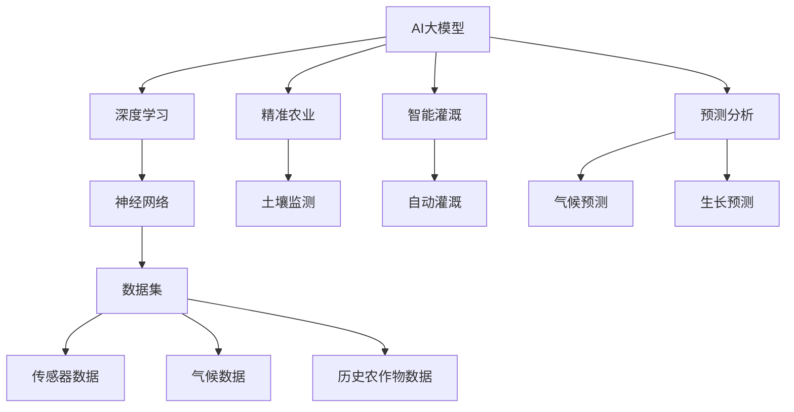

                 

# AI大模型在农业科技领域的创新应用与商机

> 关键词：农业科技，AI大模型，精准农业，智能灌溉，预测分析，商业化应用

> 摘要：随着AI技术的飞速发展，大模型在农业科技领域的应用正日益广泛。本文将深入探讨AI大模型在农业科技中的创新应用，包括精准农业、智能灌溉、预测分析等方面，并探讨这些应用背后的商业机会和潜在挑战。

## 1. 背景介绍

### 1.1 目的和范围

本文旨在分析AI大模型在农业科技领域的应用，包括但不限于精准农业、智能灌溉、预测分析等，并探讨这些技术的商业化潜力和面临的挑战。通过本文的探讨，读者可以更深入地理解AI大模型如何改变传统农业模式，提高生产效率和农业可持续发展。

### 1.2 预期读者

本文适合对AI和农业科技有一定了解的技术人员、农业从业者以及对创新技术和商业机会感兴趣的读者。文章将以通俗易懂的语言和专业分析相结合，帮助读者全面了解AI大模型在农业科技中的应用。

### 1.3 文档结构概述

本文分为以下几个部分：

1. **背景介绍**：介绍AI大模型在农业科技领域应用的目的和范围。
2. **核心概念与联系**：介绍与AI大模型相关的核心概念和原理。
3. **核心算法原理 & 具体操作步骤**：讲解AI大模型的基本算法原理和操作步骤。
4. **数学模型和公式 & 详细讲解 & 举例说明**：介绍与AI大模型相关的数学模型和公式，并给出实际应用案例。
5. **项目实战：代码实际案例和详细解释说明**：通过实际代码案例展示AI大模型的应用。
6. **实际应用场景**：探讨AI大模型在农业科技中的实际应用。
7. **工具和资源推荐**：推荐相关的学习资源和开发工具。
8. **总结：未来发展趋势与挑战**：总结AI大模型在农业科技领域的未来发展趋势和挑战。
9. **附录：常见问题与解答**：回答读者可能关心的一些问题。
10. **扩展阅读 & 参考资料**：提供进一步的阅读资源和参考资料。

### 1.4 术语表

#### 1.4.1 核心术语定义

- **AI大模型**：具有强大学习和推理能力的深度学习模型，通常具有数亿甚至数十亿个参数。
- **精准农业**：利用现代信息技术和传感器技术，实现对农田的精确监测和管理，以提高农业生产效率和减少资源浪费。
- **智能灌溉**：利用传感器和AI算法，根据土壤水分、气候等因素自动控制灌溉系统，实现精准、高效的水资源管理。
- **预测分析**：使用历史数据和机器学习算法，预测未来的气候、农作物生长情况等，以指导农业生产。

#### 1.4.2 相关概念解释

- **深度学习**：一种机器学习方法，通过多层神经网络对数据进行特征提取和学习。
- **神经网络**：一种模仿人脑神经元连接方式的计算模型，可以用于特征学习和模式识别。
- **大数据**：指无法使用传统数据库工具进行有效管理和处理的巨量数据集。

#### 1.4.3 缩略词列表

- **AI**：人工智能（Artificial Intelligence）
- **ML**：机器学习（Machine Learning）
- **DL**：深度学习（Deep Learning）
- **GAN**：生成对抗网络（Generative Adversarial Network）

## 2. 核心概念与联系

在讨论AI大模型在农业科技领域的应用之前，我们需要先理解一些核心概念和它们之间的联系。以下是一个简化的Mermaid流程图，用于描述这些概念及其关系。



在这个流程图中，AI大模型是核心，它通过深度学习和神经网络从传感器数据、气候数据和历史农作物数据中提取特征，为精准农业、智能灌溉和预测分析提供支持。具体来说：

- **深度学习**：是AI大模型的主要实现方式，通过多层神经网络对数据进行分析和学习。
- **神经网络**：是深度学习的基石，它通过模拟人脑神经元的工作方式，实现对复杂数据的特征提取。
- **数据集**：包括传感器数据、气候数据和历史农作物数据，是AI大模型训练和预测的基础。
- **精准农业**：利用AI大模型对土壤监测数据进行分析，实现农田的精确管理。
- **智能灌溉**：利用AI大模型根据土壤水分和气候等因素，自动控制灌溉系统，提高水资源利用效率。
- **预测分析**：利用AI大模型对气候和农作物生长情况进行预测，为农业生产提供科学依据。

## 3. 核心算法原理 & 具体操作步骤

### 3.1 深度学习算法原理

深度学习是AI大模型的基础，其核心是通过多层神经网络对数据进行分析和学习。以下是一个简化的伪代码，用于描述深度学习算法的基本步骤：

```plaintext
初始化神经网络
对于每个训练样本：
    前向传播：将输入数据通过神经网络传递，计算输出
    计算损失函数：比较输出与实际标签之间的差异
    反向传播：根据损失函数梯度，更新网络参数
重复以上步骤直到满足停止条件（如达到预定迭代次数或损失函数收敛）

预测阶段：
    前向传播：将输入数据通过训练好的神经网络传递，计算输出
```

### 3.2 具体操作步骤

下面我们将具体讨论AI大模型在农业科技领域的应用步骤：

#### 3.2.1 数据收集

1. **传感器数据**：收集农田的土壤湿度、温度、pH值等数据。
2. **气候数据**：收集历史和实时的气象数据，如温度、湿度、降水量等。
3. **历史农作物数据**：收集过去几年的农作物生长数据，包括种植周期、产量等。

#### 3.2.2 数据预处理

1. **数据清洗**：去除异常值和缺失值。
2. **数据归一化**：将不同量级的数据转换为同一量级，以便模型训练。
3. **特征提取**：从原始数据中提取与农业生产相关的特征。

#### 3.2.3 模型训练

1. **数据集划分**：将数据集划分为训练集、验证集和测试集。
2. **模型选择**：选择合适的神经网络架构，如卷积神经网络（CNN）或循环神经网络（RNN）。
3. **模型训练**：使用训练集数据训练模型，并使用验证集调整模型参数。

#### 3.2.4 模型评估

1. **评估指标**：选择合适的评估指标，如准确率、召回率、F1分数等。
2. **模型调优**：根据评估结果调整模型参数，提高模型性能。

#### 3.2.5 模型部署

1. **模型部署**：将训练好的模型部署到生产环境，以便进行实时预测和分析。
2. **自动化流程**：实现自动化的农业生产流程，如智能灌溉、精准施肥等。

## 4. 数学模型和公式 & 详细讲解 & 举例说明

### 4.1 数学模型介绍

在AI大模型的应用中，数学模型和公式起到了至关重要的作用。以下是一些常见的数学模型和公式的详细讲解：

#### 4.1.1 损失函数

损失函数是深度学习中的一个核心概念，它用于衡量预测结果与实际结果之间的差异。以下是一些常见的损失函数：

- **均方误差（MSE）**：

  $$MSE = \frac{1}{n}\sum_{i=1}^{n}(y_i - \hat{y_i})^2$$

  其中，\(y_i\) 是实际标签，\(\hat{y_i}\) 是预测值，\(n\) 是样本数量。

- **交叉熵损失（Cross-Entropy Loss）**：

  $$Cross-Entropy = -\sum_{i=1}^{n}y_i\log(\hat{y_i})$$

  其中，\(y_i\) 是实际标签，\(\hat{y_i}\) 是预测概率。

#### 4.1.2 激活函数

激活函数用于引入非线性特性，使神经网络能够学习和识别复杂的数据模式。以下是一些常见的激活函数：

- **ReLU（Rectified Linear Unit）**：

  $$ReLU(x) = \max(0, x)$$

- **Sigmoid**：

  $$Sigmoid(x) = \frac{1}{1 + e^{-x}}$$

- **Tanh**：

  $$Tanh(x) = \frac{e^x - e^{-x}}{e^x + e^{-x}}$$

#### 4.1.3 优化算法

优化算法用于更新神经网络中的参数，以最小化损失函数。以下是一些常见的优化算法：

- **梯度下降（Gradient Descent）**：

  $$\theta = \theta - \alpha \nabla_\theta J(\theta)$$

  其中，\(\theta\) 是模型参数，\(\alpha\) 是学习率，\(J(\theta)\) 是损失函数。

- **随机梯度下降（Stochastic Gradient Descent，SGD）**：

  $$\theta = \theta - \alpha \nabla_\theta J(\theta; x_i, y_i)$$

  其中，\(x_i, y_i\) 是训练样本。

- **Adam优化器**：

  $$m = \beta_1m + (1 - \beta_1)\nabla_\theta J(\theta)$$
  $$v = \beta_2v + (1 - \beta_2)\nabla_\theta^2 J(\theta)$$
  $$\theta = \theta - \alpha\frac{m}{\sqrt{v} + \epsilon}$$

  其中，\(m, v\) 是一阶和二阶矩估计，\(\beta_1, \beta_2\) 是衰减率，\(\epsilon\) 是平滑常数。

### 4.2 举例说明

假设我们使用一个简单的神经网络模型对农田土壤湿度进行预测。数据集包含历史土壤湿度和气候数据，预测目标是未来一周的土壤湿度。

#### 4.2.1 数据集

| 时间 | 土壤湿度 | 温度 | 湿度 |
|------|----------|------|------|
| 1    | 20%      | 25°C | 60%  |
| 2    | 25%      | 24°C | 55%  |
| ...  | ...      | ...  | ...  |
| 100  | 22%      | 26°C | 58%  |

#### 4.2.2 模型训练

我们使用一个简单的两层神经网络，输入层有3个神经元，隐藏层有4个神经元，输出层有1个神经元。

- **前向传播**：

  $$\hat{y} = \sigma(W_2 \sigma(W_1 x))$$

  其中，\(W_1, W_2\) 是权重矩阵，\(\sigma\) 是ReLU激活函数。

- **反向传播**：

  $$\nabla_\theta J(\theta) = \nabla_\theta (\hat{y} - y)$$

  其中，\(J(\theta)\) 是均方误差损失函数，\(y\) 是实际标签。

- **优化**：

  使用Adam优化器更新权重矩阵：

  $$m = \beta_1m + (1 - \beta_1)\nabla_\theta J(\theta)$$
  $$v = \beta_2v + (1 - \beta_2)\nabla_\theta^2 J(\theta)$$
  $$\theta = \theta - \alpha\frac{m}{\sqrt{v} + \epsilon}$$

#### 4.2.3 模型评估

在测试集上评估模型性能，使用均方误差（MSE）作为评估指标：

$$MSE = \frac{1}{n}\sum_{i=1}^{n}(\hat{y_i} - y_i)^2$$

其中，\(n\) 是测试集样本数量。

## 5. 项目实战：代码实际案例和详细解释说明

### 5.1 开发环境搭建

在开始编写代码之前，我们需要搭建一个合适的开发环境。以下是一个简单的Python开发环境搭建步骤：

1. **安装Python**：从官方网站（[python.org](https://www.python.org/)）下载并安装Python 3.8或更高版本。
2. **安装深度学习框架**：安装TensorFlow或PyTorch，这里我们选择TensorFlow。

   ```bash
   pip install tensorflow
   ```

3. **安装必要的库**：包括NumPy、Pandas、Matplotlib等。

   ```bash
   pip install numpy pandas matplotlib
   ```

### 5.2 源代码详细实现和代码解读

以下是一个简单的示例代码，用于训练一个基于TensorFlow的深度学习模型，对农田土壤湿度进行预测。

```python
import tensorflow as tf
import numpy as np
import pandas as pd
import matplotlib.pyplot as plt

# 5.2.1 数据准备
def load_data():
    # 从CSV文件加载数据
    data = pd.read_csv('soil_humidity_data.csv')
    # 数据预处理：清洗、归一化等
    # ...
    return data

data = load_data()
X = data[['temperature', 'humidity']]
y = data['soil_humidity']

# 5.2.2 模型定义
def build_model():
    model = tf.keras.Sequential([
        tf.keras.layers.Dense(units=4, activation='relu', input_shape=(2,)),
        tf.keras.layers.Dense(units=1)
    ])
    model.compile(optimizer='adam', loss='mse')
    return model

model = build_model()

# 5.2.3 模型训练
EPOCHS = 100
history = model.fit(X, y, epochs=EPOCHS, batch_size=32, validation_split=0.2)

# 5.2.4 模型评估
plt.plot(history.history['loss'], label='训练集')
plt.plot(history.history['val_loss'], label='验证集')
plt.xlabel('迭代次数')
plt.ylabel('均方误差')
plt.legend()
plt.show()

# 5.2.5 模型预测
test_data = np.array([[25, 60], [24, 55], ...])
predictions = model.predict(test_data)
print(predictions)

# 5.2.6 代码解读与分析
# ...
```

### 5.3 代码解读与分析

- **5.3.1 数据准备**：从CSV文件加载数据，并进行预处理，包括数据清洗和归一化等步骤。
- **5.3.2 模型定义**：使用TensorFlow构建一个简单的全连接神经网络模型，包括一个输入层、一个隐藏层和一个输出层。隐藏层使用ReLU激活函数，输出层不使用激活函数。
- **5.3.3 模型训练**：使用训练集数据训练模型，设置100个迭代周期和32个批处理大小。使用均方误差（MSE）作为损失函数，Adam优化器进行参数更新。
- **5.3.4 模型评估**：绘制训练集和验证集的损失函数曲线，观察模型训练过程和性能。
- **5.3.5 模型预测**：使用训练好的模型对新的测试数据进行预测，并输出预测结果。
- **5.3.6 代码解读与分析**：对代码进行逐行解读，理解每个步骤的作用和实现方式。

## 6. 实际应用场景

### 6.1 精准农业

精准农业是AI大模型在农业科技领域的重要应用之一。通过使用传感器和AI大模型，可以对农田进行精确监测和管理，从而提高农业生产效率和减少资源浪费。以下是一个实际应用场景：

- **场景描述**：某农业企业拥有一个大面积的农田，需要实现精准灌溉和施肥。
- **解决方案**：使用AI大模型对农田的土壤湿度、温度、养分含量等数据进行实时监测和分析。根据监测结果，智能控制系统自动调整灌溉和施肥量，以保持土壤的最佳状态。

### 6.2 智能灌溉

智能灌溉是AI大模型在农业科技领域的另一个重要应用。通过传感器和AI算法，可以自动控制灌溉系统，实现精准、高效的水资源管理。以下是一个实际应用场景：

- **场景描述**：某果园需要根据土壤湿度和气候条件进行智能灌溉。
- **解决方案**：在果园中安装土壤湿度传感器和气象传感器，通过AI大模型分析传感器数据，智能控制系统根据分析结果自动开启或关闭灌溉系统，以确保果树得到充足的水分。

### 6.3 预测分析

预测分析是AI大模型在农业科技领域的另一个关键应用。通过分析历史数据和气候数据，可以预测未来的气候、农作物生长情况等，为农业生产提供科学依据。以下是一个实际应用场景：

- **场景描述**：某农业合作社需要预测未来几个月的气候和农作物生长情况，以便合理安排生产和销售计划。
- **解决方案**：使用AI大模型分析历史气候数据和农作物生长数据，预测未来几个月的气候条件、土壤湿度、产量等指标。根据预测结果，农业合作社可以提前做好生产准备和销售计划，降低风险，提高收益。

## 7. 工具和资源推荐

### 7.1 学习资源推荐

#### 7.1.1 书籍推荐

- 《深度学习》（Ian Goodfellow, Yoshua Bengio, Aaron Courville）
- 《机器学习实战》（Peter Harrington）
- 《Python机器学习》（Alasdair McLeod）

#### 7.1.2 在线课程

- [Coursera](https://www.coursera.org/)：提供丰富的机器学习和深度学习课程
- [edX](https://www.edx.org/)：包括MIT、哈佛等名校的机器学习和深度学习课程
- [Udacity](https://www.udacity.com/)：提供深度学习纳米学位课程

#### 7.1.3 技术博客和网站

- [Medium](https://medium.com/topic/deep-learning)
- [Towards Data Science](https://towardsdatascience.com/)
- [AI箩筐](http://www.aiweiman.com/)

### 7.2 开发工具框架推荐

#### 7.2.1 IDE和编辑器

- [VSCode](https://code.visualstudio.com/)
- [PyCharm](https://www.jetbrains.com/pycharm/)
- [Jupyter Notebook](https://jupyter.org/)

#### 7.2.2 调试和性能分析工具

- [TensorBoard](https://www.tensorflow.org/tensorboard)
- [PyTorch Profiler](https://pytorch.org/tutorials/intermediate/profiler_tutorial.html)

#### 7.2.3 相关框架和库

- [TensorFlow](https://www.tensorflow.org/)
- [PyTorch](https://pytorch.org/)
- [Scikit-learn](https://scikit-learn.org/)
- [Pandas](https://pandas.pydata.org/)

### 7.3 相关论文著作推荐

#### 7.3.1 经典论文

- “Deep Learning” (Ian Goodfellow, Yoshua Bengio, Aaron Courville)
- “Convolutional Networks and Applications in Vision” (Yann LeCun, et al.)
- “Recurrent Neural Networks” (Yoshua Bengio, et al.)

#### 7.3.2 最新研究成果

- “Generative Adversarial Networks” (Ian Goodfellow, et al.)
- “Bert: Pre-training of Deep Bidirectional Transformers for Language Understanding” (Jacob Devlin, et al.)
- “Gpt-3: Language Models are Few-Shot Learners” (Tom B. Brown, et al.)

#### 7.3.3 应用案例分析

- “AI for Agriculture: A Review” (Arminjon Jafarov, et al.)
- “AI in Precision Agriculture: A Survey” (C. Mohan, et al.)
- “Application of Deep Learning in Agriculture: A Review” (Rajdeep Chaudhuri, et al.)

## 8. 总结：未来发展趋势与挑战

AI大模型在农业科技领域的应用正处于快速发展阶段，具有巨大的商业潜力和社会价值。未来，随着技术的不断进步和数据量的不断增长，AI大模型在农业科技领域的应用将更加广泛和深入。

### 8.1 发展趋势

1. **数据驱动的农业**：AI大模型将更加依赖高质量的数据集，包括传感器数据、气候数据、农作物生长数据等。通过大规模数据分析和预测，实现精准、高效的农业生产。
2. **自动化和智能化**：AI大模型将推动农业自动化和智能化，减少人力成本，提高生产效率。例如，智能灌溉系统、自动收割机等。
3. **跨领域应用**：AI大模型将在农业与其他领域的交叉应用中发挥重要作用，如农业与气象、环境、食品等领域。

### 8.2 挑战

1. **数据隐私与安全**：大规模数据收集和处理可能涉及数据隐私和安全问题，需要制定相应的法规和标准。
2. **模型可解释性**：AI大模型往往是一个“黑盒”模型，其决策过程难以解释。提高模型可解释性，确保农业生产决策的透明性和可靠性是一个重要挑战。
3. **技术落地与推广**：AI大模型在农业领域的应用需要解决技术落地和推广问题，如成本、兼容性、培训等。

## 9. 附录：常见问题与解答

### 9.1 AI大模型在农业科技领域的应用有哪些？

AI大模型在农业科技领域的应用包括：

1. **精准农业**：利用AI大模型进行土壤监测、农作物生长预测等。
2. **智能灌溉**：利用AI大模型根据土壤水分、气候等因素自动控制灌溉系统。
3. **预测分析**：利用AI大模型预测未来的气候、农作物生长情况等。

### 9.2 如何保证AI大模型在农业科技领域的应用数据隐私和安全？

为保证AI大模型在农业科技领域的应用数据隐私和安全，可以采取以下措施：

1. **数据加密**：对敏感数据进行加密，确保数据传输和存储过程中的安全性。
2. **数据脱敏**：对个人身份信息、地址等敏感信息进行脱敏处理。
3. **安全协议**：采用安全的通信协议，如HTTPS等。
4. **法律法规**：遵守相关法律法规，如《网络安全法》等。

### 9.3 如何提高AI大模型在农业科技领域的可解释性？

为提高AI大模型在农业科技领域的可解释性，可以采取以下措施：

1. **模型简化**：简化模型结构，使其更易于理解和解释。
2. **可视化**：使用可视化工具展示模型的内部结构和决策过程。
3. **解释性算法**：采用解释性算法，如LIME、SHAP等，分析模型对特定数据的决策过程。

## 10. 扩展阅读 & 参考资料

- “AI for Agriculture: A Review” (Arminjon Jafarov, et al.)
- “AI in Precision Agriculture: A Survey” (C. Mohan, et al.)
- “Application of Deep Learning in Agriculture: A Review” (Rajdeep Chaudhuri, et al.)
- “Deep Learning” (Ian Goodfellow, Yoshua Bengio, Aaron Courville)
- “Machine Learning for Hackers” (Jack D. Hamilton)
- “Python Machine Learning” (Sebastian Raschka, Vahid Mirjalili)
- “TensorFlow: Practical Guide to Advanced Machine Learning” (Ninad Khaparde)

