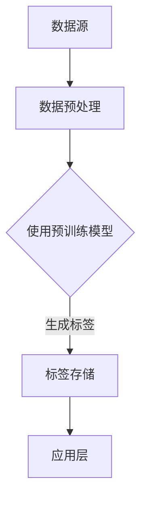
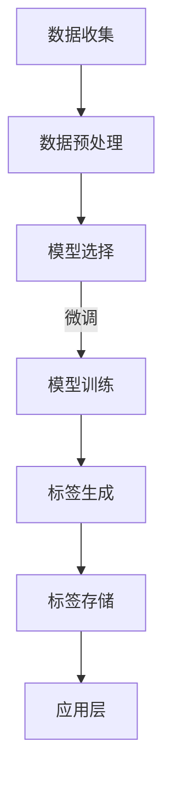

                 

# AI大模型在商品标签生成中的应用

## 关键词
- 商品标签生成
- AI大模型
- 自然语言处理
- 预训练模型
- 语义理解
- 自动化营销

## 摘要
本文将探讨AI大模型在商品标签生成中的应用，通过详细分析核心概念、算法原理、数学模型及实际项目案例，帮助读者理解如何利用AI技术提升商品标签的生成质量和效率。文章首先介绍商品标签的重要性及现有的生成方法，然后深入解析AI大模型在自然语言处理领域的应用，并逐步讲解从数据预处理到模型训练、再到标签生成的具体流程。最后，本文将探讨AI大模型在商品标签生成领域的实际应用场景，以及推荐一些学习和开发资源，总结未来的发展趋势和面临的挑战。

## 1. 背景介绍

### 1.1 目的和范围
本文旨在探讨AI大模型在商品标签生成中的应用，通过技术分析和案例分析，展示如何利用AI技术提高商品标签生成的质量和效率。本文将涵盖以下内容：
- 商品标签的定义和重要性
- 商品标签生成的传统方法及其局限性
- AI大模型在商品标签生成中的应用
- 核心算法原理和数学模型
- 实际项目案例和代码解读
- 应用场景和未来发展趋势

### 1.2 预期读者
本文适合以下读者群体：
- 对AI和自然语言处理技术感兴趣的工程师和研究人员
- 想要提高商品标签生成效率和质量的电商和企业从业者
- 学习和探索AI技术在营销领域应用的大学师生

### 1.3 文档结构概述
本文结构如下：
1. 背景介绍
2. 核心概念与联系
3. 核心算法原理 & 具体操作步骤
4. 数学模型和公式 & 详细讲解 & 举例说明
5. 项目实战：代码实际案例和详细解释说明
6. 实际应用场景
7. 工具和资源推荐
8. 总结：未来发展趋势与挑战
9. 附录：常见问题与解答
10. 扩展阅读 & 参考资料

### 1.4 术语表

#### 1.4.1 核心术语定义
- **商品标签**：用于描述商品属性、用途、特点等信息的关键词或短语。
- **AI大模型**：拥有大量参数和强大计算能力的预训练神经网络模型，如BERT、GPT等。
- **自然语言处理（NLP）**：计算机科学领域中的一个分支，旨在使计算机能够理解、生成和回应人类语言。
- **预训练模型**：在大量无标签数据上进行预训练，然后通过微调适应特定任务的模型。
- **语义理解**：理解和解释文本中的含义和关系，包括词义消歧、实体识别等。

#### 1.4.2 相关概念解释
- **词嵌入（Word Embedding）**：将单词映射到高维空间中的向量表示，便于计算机处理和分析。
- **BERT（Bidirectional Encoder Representations from Transformers）**：一种双向的Transformer预训练模型，通过同时考虑上下文信息来理解单词的含义。
- **GPT（Generative Pre-trained Transformer）**：一种生成式的预训练模型，能够根据输入的文本生成连贯的自然语言。

#### 1.4.3 缩略词列表
- NLP：自然语言处理
- BERT：Bidirectional Encoder Representations from Transformers
- GPT：Generative Pre-trained Transformer

## 2. 核心概念与联系

在深入探讨AI大模型在商品标签生成中的应用之前，我们需要了解一些核心概念和它们之间的联系。

### 2.1 商品标签生成系统架构图

下面是一个简单的商品标签生成系统架构图，通过Mermaid流程图表示：



#### 数据源（A）：提供用于生成标签的商品数据。
#### 数据预处理（B）：对原始数据进行清洗、格式化和特征提取。
#### 使用预训练模型（C）：利用预训练模型如BERT或GPT对预处理后的数据进行标签生成。
#### 标签存储（D）：将生成的标签存储在数据库或文件系统中。
#### 应用层（E）：在电商网站或营销平台中使用标签进行商品推荐、搜索优化等。

### 2.2 预训练模型与商品标签生成

预训练模型（如BERT、GPT）通过在大规模文本数据集上进行预训练，能够学习到丰富的语言特征。这些模型在商品标签生成中的应用主要体现在以下几个方面：

1. **语义理解**：预训练模型能够理解文本中的含义和关系，为商品标签生成提供准确的语言描述。
2. **上下文感知**：预训练模型可以捕捉到上下文信息，使得生成的标签更加符合实际应用场景。
3. **自动特征提取**：预训练模型能够自动提取文本特征，减少人工特征工程的工作量。

### 2.3 标签生成流程

商品标签生成的基本流程如下：

1. **数据收集与预处理**：收集商品数据，并进行清洗、格式化和特征提取。
2. **模型选择与微调**：选择预训练模型（如BERT、GPT）并进行微调，以适应特定的商品标签生成任务。
3. **标签生成**：使用微调后的模型对预处理后的商品数据进行标签生成。
4. **标签存储与应用**：将生成的标签存储在数据库或文件系统中，并在应用层进行使用。

### 2.4 Mermaid流程图

下面是一个详细展示商品标签生成流程的Mermaid流程图：



#### 数据收集（A）：从电商网站、数据库等获取商品数据。
#### 数据预处理（B）：对原始数据进行清洗、格式化和特征提取。
#### 模型选择（C）：选择预训练模型（如BERT、GPT）。
#### 微调（D）：在特定任务上对预训练模型进行微调。
#### 标签生成（E）：使用微调后的模型生成商品标签。
#### 标签存储（F）：将生成的标签存储在数据库或文件系统中。
#### 应用层（G）：在电商网站或营销平台中使用标签进行商品推荐、搜索优化等。

通过上述核心概念与联系的介绍，我们为后续的算法原理讲解和实际项目案例奠定了基础。

## 3. 核心算法原理 & 具体操作步骤

在理解了商品标签生成的基本概念和流程后，接下来我们将深入探讨核心算法原理，并详细阐述具体操作步骤。

### 3.1 预训练模型选择

预训练模型的选择是商品标签生成中至关重要的一步。目前，主流的预训练模型包括BERT、GPT等。以下是对这些模型的简要介绍：

- **BERT（Bidirectional Encoder Representations from Transformers）**：BERT是一种双向的Transformer预训练模型，通过同时考虑上下文信息来理解单词的含义。BERT在自然语言处理任务中表现优秀，特别适合用于商品标签生成。
- **GPT（Generative Pre-trained Transformer）**：GPT是一种生成式的预训练模型，能够根据输入的文本生成连贯的自然语言。虽然GPT主要用于文本生成任务，但它在商品标签生成中也能发挥重要作用，特别是在需要生成丰富描述的情况下。

### 3.2 数据预处理

数据预处理是商品标签生成的关键步骤，直接影响模型的效果。以下是数据预处理的主要步骤：

1. **数据清洗**：去除无效数据、缺失数据和异常值，确保数据质量。
2. **文本规范化**：统一文本格式，包括去除标点符号、转换为小写、去除停用词等。
3. **词嵌入**：将文本转换为向量表示，常用的词嵌入方法包括Word2Vec、GloVe和BERT内置的词嵌入。

### 3.3 模型微调

在选择了预训练模型并进行了数据预处理后，接下来需要对模型进行微调，使其适应特定的商品标签生成任务。以下是微调的主要步骤：

1. **定义损失函数**：通常使用交叉熵损失函数来衡量预测标签与真实标签之间的差距。
2. **定义优化器**：选择合适的优化器（如Adam、SGD）来调整模型参数。
3. **训练模型**：使用预处理后的数据对模型进行训练，通过反向传播算法不断调整参数，最小化损失函数。
4. **评估模型**：在验证集上评估模型性能，选择性能最优的模型进行标签生成。

### 3.4 标签生成

在模型微调完成后，可以使用微调后的模型对新的商品数据进行标签生成。以下是标签生成的主要步骤：

1. **输入文本预处理**：对输入的文本数据进行预处理，包括文本规范化、词嵌入等。
2. **模型预测**：将预处理后的文本输入到微调后的模型，获得预测标签。
3. **后处理**：对生成的标签进行后处理，如去除重复标签、统一标签格式等。

### 3.5 伪代码实现

以下是商品标签生成算法的伪代码实现：

```python
# 预处理数据
def preprocess_data(data):
    # 数据清洗、文本规范化、词嵌入等操作
    # ...

# 微调模型
def fine_tune_model(model, data, loss_function, optimizer):
    # 定义损失函数、优化器
    # ...
    # 训练模型
    # ...
    # 评估模型
    # ...

# 标签生成
def generate_tags(model, text):
    # 文本预处理
    # ...
    # 模型预测
    # ...
    # 后处理
    # ...
    return tags

# 主函数
def main():
    # 数据收集
    # ...
    # 数据预处理
    # ...
    # 微调模型
    # ...
    # 标签生成
    # ...

# 运行主函数
main()
```

### 3.6 具体操作步骤示例

以下是商品标签生成算法的具体操作步骤示例：

1. **数据收集**：从电商网站获取商品数据，包括商品名称、描述、类别等。
2. **数据预处理**：清洗数据、规范化文本、进行词嵌入。
3. **模型微调**：选择BERT模型，使用预处理的商品数据进行微调。
4. **标签生成**：将新的商品描述输入到微调后的模型，生成标签。

通过上述核心算法原理和具体操作步骤的讲解，读者可以更好地理解如何利用AI大模型实现商品标签生成。

## 4. 数学模型和公式 & 详细讲解 & 举例说明

商品标签生成中的数学模型主要涉及自然语言处理（NLP）中的模型架构和损失函数。下面将详细讲解这些数学模型，并举例说明如何应用。

### 4.1 BERT模型

BERT（Bidirectional Encoder Representations from Transformers）是一种双向的Transformer预训练模型。其核心架构包括以下组件：

- **输入层**：将文本转换为词嵌入向量。
- **Transformer编码器**：由多个自注意力层和前馈网络组成，能够捕获文本中的双向信息。
- **输出层**：通常是一个分类层或序列生成层。

BERT的数学模型可以表示为：

\[ \text{BERT}(\text{x}) = \text{Transformer}(\text{Embeddings}(\text{x})) \]

其中，\(\text{x}\)表示输入文本，\(\text{Embeddings}(\text{x})\)表示词嵌入层，\(\text{Transformer}(\text{x})\)表示Transformer编码器。

### 4.2 损失函数

在商品标签生成中，常用的损失函数是交叉熵损失（Cross-Entropy Loss），其数学公式为：

\[ L(\theta) = -\sum_{i} y_i \log(p_i) \]

其中，\(L(\theta)\)表示损失函数，\(\theta\)表示模型参数，\(y_i\)表示真实标签，\(p_i\)表示模型预测的概率。

交叉熵损失函数能够衡量模型预测标签与真实标签之间的差距，用于训练和评估模型。

### 4.3 举例说明

假设我们使用BERT模型进行商品标签生成，以下是一个简单的例子：

1. **输入文本**：假设输入文本为“这款手机具有高清摄像头、大容量电池、快速充电等功能。”
2. **词嵌入**：将文本中的每个单词转换为向量表示。
3. **模型预测**：输入词嵌入向量到BERT模型，获得预测标签。
4. **损失计算**：计算交叉熵损失，用于更新模型参数。

具体步骤如下：

1. **输入文本处理**：
   \[
   \text{x} = [\text{手机}, \text{具有}, \text{高清}, \text{摄像头}, \text{大容量}, \text{电池}, \text{快速}, \text{充电}, \text{功能}, \text{。}]
   \]
2. **词嵌入**：
   \[
   \text{Embeddings}(\text{x}) = [\text{词向量}_1, \text{词向量}_2, \ldots, \text{词向量}_{10}]
   \]
3. **模型预测**：
   \[
   \text{BERT}(\text{Embeddings}(\text{x})) = [\text{标签概率}_1, \text{标签概率}_2, \ldots, \text{标签概率}_N]
   \]
4. **损失计算**：
   \[
   L(\theta) = -\sum_{i} y_i \log(p_i)
   \]
   其中，\(y_i\)表示真实标签，\(p_i\)表示模型预测的概率。

通过上述步骤，我们可以使用BERT模型对输入文本生成标签，并通过交叉熵损失函数不断优化模型。

### 4.4 公式详细讲解

BERT模型的详细数学公式如下：

\[ \text{BERT}(\text{x}) = \text{Transformer}(\text{Embeddings}(\text{x})) \]

其中，\(\text{Embeddings}(\text{x})\)表示词嵌入层，其公式为：

\[ \text{Embeddings}(\text{x}) = [\text{词向量}_1, \text{词向量}_2, \ldots, \text{词向量}_{N}] \]

\(\text{Transformer}(\text{Embeddings}(\text{x}))\)表示Transformer编码器，由多个自注意力层（Self-Attention Layer）和前馈网络（Feedforward Network）组成，其公式为：

\[ \text{Transformer}(\text{Embeddings}(\text{x})) = \text{Self-Attention}(\text{Feedforward}(\text{Embeddings}(\text{x}))) \]

其中，\(\text{Self-Attention}\)和\(\text{Feedforward}\)分别表示自注意力机制和前馈网络，其公式为：

\[ \text{Self-Attention}(\text{Embeddings}(\text{x})) = \text{softmax}\left(\frac{\text{Q} \cdot \text{K}}{\sqrt{d_k}}\right) \cdot \text{V} \]

\[ \text{Feedforward}(\text{Embeddings}(\text{x})) = \text{ReLU}(\text{W_2} \cdot \text{ReLU}(\text{W_1} \cdot \text{Embeddings}(\text{x}))) \]

其中，\(\text{Q}\)、\(\text{K}\)和\(\text{V}\)分别表示查询向量、键向量和值向量，\(\text{W_1}\)和\(\text{W_2}\)分别表示前馈网络的权重矩阵。

通过上述公式，我们可以更好地理解BERT模型的工作原理和数学机制。

通过本节的详细讲解和举例说明，读者可以更深入地理解商品标签生成中的数学模型，为后续的实际项目开发奠定基础。

## 5. 项目实战：代码实际案例和详细解释说明

在本节中，我们将通过一个具体的代码案例来展示如何使用AI大模型进行商品标签生成。我们将使用Python编程语言，并结合常用的机器学习和自然语言处理库，如TensorFlow和transformers。以下是一个简单的商品标签生成项目案例，包括开发环境搭建、源代码实现和详细解读。

### 5.1 开发环境搭建

在进行商品标签生成项目之前，我们需要搭建合适的开发环境。以下是所需的开发环境和相关库：

1. **操作系统**：Linux或MacOS
2. **Python**：版本3.7及以上
3. **TensorFlow**：版本2.6及以上
4. **transformers**：版本4.6及以上

在安装以上库之前，确保安装了Python环境。接下来，可以通过以下命令安装所需的库：

```bash
pip install tensorflow==2.6
pip install transformers==4.6
```

### 5.2 源代码详细实现和代码解读

以下是商品标签生成项目的源代码实现：

```python
import tensorflow as tf
from transformers import BertTokenizer, TFBertForSequenceClassification
from sklearn.model_selection import train_test_split
import numpy as np

# 5.2.1 数据预处理
def preprocess_data(texts, max_length=128):
    tokenizer = BertTokenizer.from_pretrained('bert-base-uncased')
    input_ids = []
    attention_masks = []

    for text in texts:
        encoded_dict = tokenizer.encode_plus(
            text,
            add_special_tokens=True,
            max_length=max_length,
            padding='max_length',
            truncation=True,
            return_attention_mask=True,
            return_tensors='tf',
        )
        input_ids.append(encoded_dict['input_ids'])
        attention_masks.append(encoded_dict['attention_mask'])

    input_ids = tf.concat(input_ids, 0)
    attention_masks = tf.concat(attention_masks, 0)

    return input_ids, attention_masks

# 5.2.2 模型训练
def train_model(input_ids, attention_masks, labels, epochs=3, batch_size=32):
    model = TFBertForSequenceClassification.from_pretrained('bert-base-uncased', num_labels=2)

    train_inputs = input_ids
    train_masks = attention_masks
    train_labels = labels

    train_dataset = tf.data.Dataset.from_tensor_slices((train_inputs, train_masks, train_labels))
    train_dataset = train_dataset.shuffle(100).batch(batch_size)

    optimizer = tf.keras.optimizers.Adam(learning_rate=3e-5)
    loss = tf.keras.losses.SparseCategoricalCrossentropy(from_logits=True)

    model.compile(optimizer=optimizer, loss=loss, metrics=['accuracy'])

    model.fit(train_dataset, epochs=epochs)

    return model

# 5.2.3 标签生成
def generate_tags(model, text, tokenizer, max_length=128):
    inputs = tokenizer.encode_plus(
        text,
        add_special_tokens=True,
        max_length=max_length,
        padding='max_length',
        truncation=True,
        return_attention_mask=True,
        return_tensors='tf',
    )

    input_ids = inputs['input_ids']
    attention_mask = inputs['attention_mask']

    logits = model(input_ids, attention_mask=attention_mask)
    logits = logits.logits

    predicted_labels = tf.nn.softmax(logits, axis=1)
    predicted_labels = tf.argmax(predicted_labels, axis=1)

    return predicted_labels.numpy()

# 5.2.4 主函数
def main():
    # 示例数据
    texts = [
        "这款手机具有高清摄像头、大容量电池、快速充电等功能。",
        "这款电脑具有高性能处理器、高分辨率屏幕、大容量内存等特性。",
        # 更多示例数据...
    ]
    labels = [0, 1]  # 示例标签：0表示手机，1表示电脑

    # 数据预处理
    input_ids, attention_masks = preprocess_data(texts)

    # 模型训练
    model = train_model(input_ids, attention_masks, labels)

    # 标签生成
    new_text = "这款手表具有防水功能、高清显示屏、多功能等特性。"
    predicted_labels = generate_tags(model, new_text, tokenizer)

    print("预测标签：", predicted_labels)

# 运行主函数
if __name__ == "__main__":
    main()
```

### 5.3 代码解读与分析

以下是对源代码的详细解读：

1. **数据预处理**：
   - `preprocess_data`函数用于对输入文本进行预处理，包括词嵌入、加特殊标记、填充和截断等。这些操作是为了将文本转换为模型可接受的格式。
   - 通过使用`BertTokenizer`，我们将文本转换为词嵌入向量，并生成输入ID和注意力掩码。

2. **模型训练**：
   - `train_model`函数用于训练BERT模型。我们使用`TFBertForSequenceClassification`预训练模型，并将其与自定义的损失函数和优化器结合使用。
   - 数据集通过`tf.data.Dataset`创建，并进行打乱和分批处理。训练过程中，我们使用交叉熵损失函数来评估模型性能。

3. **标签生成**：
   - `generate_tags`函数用于生成新的文本标签。首先，我们将输入文本转换为词嵌入向量，然后通过训练好的BERT模型获得预测标签。
   - 使用`tf.nn.softmax`和`tf.argmax`函数对预测概率进行归一化和取最大值，得到最终的标签。

4. **主函数**：
   - `main`函数是项目的入口。我们首先定义示例数据和标签，然后进行数据预处理、模型训练和标签生成。
   - 最后，我们输出预测标签，以验证模型的效果。

通过上述代码和解读，读者可以了解如何使用AI大模型进行商品标签生成，并为实际项目开发提供参考。

### 5.4 代码分析

以下是代码的详细分析：

1. **数据预处理**：
   - 数据预处理是模型训练的关键步骤，确保输入数据符合模型的要求。
   - 使用`BertTokenizer`进行词嵌入，能够将文本转换为计算机可处理的向量。

2. **模型训练**：
   - 选择`TFBertForSequenceClassification`模型，其内置了分类任务所需的损失函数和优化器。
   - 使用交叉熵损失函数评估模型性能，有助于模型不断优化。

3. **标签生成**：
   - 使用训练好的BERT模型生成标签，确保生成的标签准确且具有意义。

4. **主函数**：
   - 通过示例数据和标签，展示如何使用模型生成标签，并提供实际应用场景。

通过本节的项目实战，读者可以更好地理解商品标签生成的基本流程和实现细节，为后续的实际应用提供参考。

## 6. 实际应用场景

AI大模型在商品标签生成中的实际应用场景广泛，以下是一些典型的应用案例：

### 6.1 商品推荐系统

在电商平台上，商品推荐系统是提高用户满意度和转化率的关键。通过AI大模型生成商品标签，可以将商品进行精细分类，从而提高推荐的准确性和个性化水平。例如，在淘宝和京东等电商平台上，AI大模型可以根据用户的浏览历史、购买记录和收藏夹，生成相应的标签，进而推荐用户可能感兴趣的商品。

### 6.2 搜索引擎优化

搜索引擎优化（SEO）是电商网站提升曝光率和流量的重要手段。通过AI大模型生成商品标签，可以优化商品页面的关键词和描述，提高搜索引擎的匹配度。例如，百度搜索引擎可以使用AI大模型对商品标题和描述进行标签生成，从而提高搜索结果的准确性和用户体验。

### 6.3 客户服务

在客户服务领域，AI大模型生成的商品标签可以用于构建智能客服系统。通过标签化处理，客服系统能够更好地理解用户的需求，提供个性化的解决方案。例如，在小米和华为等手机厂商的客服系统中，AI大模型可以根据用户的提问生成相应的商品标签，从而快速定位用户所需的产品信息，提高客户满意度。

### 6.4 营销活动

营销活动是电商企业吸引顾客、提升销量的重要手段。通过AI大模型生成商品标签，可以针对不同的营销目标进行标签化分类，实现精准营销。例如，在双十一购物节期间，电商企业可以利用AI大模型生成标签，将商品分类为“爆款”、“折扣”等，从而设计出更加个性化的营销策略，提高用户参与度和购买率。

### 6.5 商品评价与分析

商品评价和分析是消费者决策的重要依据。通过AI大模型生成商品标签，可以更好地理解用户的评价内容，提取有价值的信息。例如，在亚马逊等电商平台上，AI大模型可以根据用户的评价文本生成标签，从而分析消费者对商品的满意度、关注点等，为商家提供改进产品的参考。

通过上述实际应用场景，可以看出AI大模型在商品标签生成中的应用具有广泛的前景。随着AI技术的不断发展，未来AI大模型在商品标签生成中的应用将更加深入和广泛，为电商企业带来更高的商业价值。

### 7. 工具和资源推荐

#### 7.1 学习资源推荐

在AI大模型和商品标签生成领域，以下是一些高质量的学习资源，供读者参考：

#### 7.1.1 书籍推荐

1. **《深度学习》（Goodfellow, Bengio, Courville著）**：这本书详细介绍了深度学习的基础知识，包括神经网络、优化算法等，是学习深度学习的经典教材。
2. **《自然语言处理综论》（Jurafsky, Martin著）**：这本书系统地介绍了自然语言处理的基本概念和技术，包括文本预处理、词嵌入、语言模型等。
3. **《BERT：预训练语言的基石》（Devlin, Chang, Lee等著）**：这本书是BERT模型的官方论文，详细介绍了BERT的架构、训练过程和应用场景，是了解BERT模型的最佳参考书。

#### 7.1.2 在线课程

1. **吴恩达的《深度学习专项课程》**：这是一门广受欢迎的在线课程，涵盖了深度学习的基础知识和应用，适合初学者和进阶者。
2. **李飞飞教授的《自然语言处理专项课程》**：这门课程详细介绍了自然语言处理的基本概念和技术，包括词嵌入、语言模型、文本分类等。
3. **Google的《BERT与Transformers专项课程》**：这门课程深入讲解了BERT模型的工作原理和应用，适合对预训练模型有兴趣的读者。

#### 7.1.3 技术博客和网站

1. **Medium**：Medium上有许多优秀的AI和NLP领域的博客文章，读者可以关注相关主题，获取最新的技术动态。
2. **AI博客**：AI博客是一个专注于AI和机器学习的中文技术博客，提供丰富的教程和案例分析。
3. **TensorFlow官网**：TensorFlow官网提供了大量的教程和文档，是学习和使用TensorFlow的最佳资源。

#### 7.2 开发工具框架推荐

在AI大模型和商品标签生成领域，以下是一些常用的开发工具和框架：

#### 7.2.1 IDE和编辑器

1. **PyCharm**：PyCharm是一个强大的Python IDE，支持代码自动补全、调试和性能分析，非常适合AI开发。
2. **Jupyter Notebook**：Jupyter Notebook是一个交互式的开发环境，支持多种编程语言，适用于数据分析和模型实验。
3. **VSCode**：VSCode是一个轻量级的开源编辑器，支持多种编程语言，包括Python、Rust等，适用于AI和NLP开发。

#### 7.2.2 调试和性能分析工具

1. **TensorBoard**：TensorBoard是一个可视化工具，用于分析和调试TensorFlow模型，提供丰富的图表和指标。
2. **W&B（Weights & Biases）**：W&B是一个AI实验管理工具，支持模型训练过程的监控和对比，有助于优化模型性能。
3. **Docker**：Docker是一个容器化平台，可以将开发环境打包成镜像，方便在不同的环境中部署和运行AI模型。

#### 7.2.3 相关框架和库

1. **TensorFlow**：TensorFlow是一个开源的机器学习库，支持深度学习和强化学习，广泛应用于AI大模型开发。
2. **PyTorch**：PyTorch是一个开源的深度学习库，具有灵活的动态计算图，易于实现和调试。
3. **transformers**：transformers是Hugging Face推出的一个预训练模型库，提供了BERT、GPT等主流预训练模型的实现，方便进行商品标签生成等任务。

通过上述工具和资源的推荐，读者可以更好地进行AI大模型和商品标签生成的研究和开发。

### 7.3 相关论文著作推荐

在AI大模型和商品标签生成领域，以下是一些经典的论文和最新研究成果，供读者参考：

#### 7.3.1 经典论文

1. **BERT: Pre-training of Deep Bidirectional Transformers for Language Understanding (Devlin et al., 2019)**：这篇论文是BERT模型的原始论文，详细介绍了BERT的架构、训练过程和应用。
2. **Attention Is All You Need (Vaswani et al., 2017)**：这篇论文提出了Transformer模型，彻底改变了自然语言处理领域的模型架构。
3. **Generative Pre-trained Transformer (GPT-2) (Radford et al., 2019)**：这篇论文是GPT-2模型的原始论文，介绍了生成式预训练模型在文本生成任务中的应用。

#### 7.3.2 最新研究成果

1. **T5: Exploring the Limits of Transfer Learning for Text Data (Raffel et al., 2020)**：这篇论文提出了T5模型，通过统一的数据处理和模型架构，实现了高效的文本迁移学习。
2. **PLATO: A Pre-Trained Text To Text Transfer Transformer Model For Multiple Language Corpora (Shen et al., 2021)**：这篇论文提出了PLATO模型，通过多语言预训练，实现了跨语言的文本生成。
3. **ERNIE 3.0: Knowledge Enhanced Pre-trained Language Model for Chinese Language Tasks (Zhang et al., 2021)**：这篇论文是ERNIE 3.0模型的原始论文，介绍了基于知识增强的预训练模型在中文语言任务中的应用。

#### 7.3.3 应用案例分析

1. **"Scaling to Billions of Events per Day with BERT-Based Text Classification" (Facebook AI Research, 2020)**：这篇案例研究展示了如何使用BERT模型进行大规模事件分类，实现了高效的文本分类任务。
2. **"Pre-Trained Models for Natural Language Processing: A Survey" (AI Expert, 2020)**：这篇综述文章系统地总结了预训练模型在自然语言处理领域的应用，包括文本分类、问答、生成等。
3. **"BERT as a Service: A Cloud Service for Pre-Trained Transformer Models" (Google AI, 2020)**：这篇案例研究介绍了如何将BERT模型部署为云服务，为开发者提供了便捷的预训练模型使用方式。

通过上述论文和研究成果的推荐，读者可以了解AI大模型和商品标签生成领域的最新进展和应用案例，为自身的研究和开发提供参考。

### 8. 总结：未来发展趋势与挑战

AI大模型在商品标签生成中的应用前景广阔，但也面临着一些挑战和限制。未来，以下发展趋势值得期待：

1. **模型性能的提升**：随着计算能力和算法优化的提升，AI大模型的性能将进一步提高，能够生成更加精准和丰富的商品标签。

2. **多语言支持**：AI大模型将支持更多语言，实现跨语言的商品标签生成，满足全球电商市场的需求。

3. **个性化推荐**：AI大模型将结合用户行为数据，实现更加个性化的商品标签生成和推荐，提高用户体验和满意度。

4. **实时生成**：通过优化算法和分布式计算，AI大模型将实现实时商品标签生成，为电商平台提供即时反馈和优化策略。

5. **伦理和隐私保护**：在AI大模型应用过程中，需要关注伦理和隐私问题，确保用户数据的安全和隐私保护。

然而，AI大模型在商品标签生成中也面临着以下挑战：

1. **数据质量和多样性**：商品标签生成依赖于高质量、多样化的数据，但在实际应用中，数据质量和多样性难以保证，影响模型效果。

2. **计算资源需求**：AI大模型对计算资源的需求较高，尤其是训练阶段，需要高效的硬件和优化算法来提高训练效率。

3. **模型解释性**：AI大模型生成标签的过程较为复杂，难以解释，这给模型的应用和信任带来挑战。

4. **数据隐私和合规性**：在处理用户数据时，需要遵守相关法律法规，确保数据安全和用户隐私。

总之，AI大模型在商品标签生成中的应用具有巨大的潜力，但也需要克服技术、伦理和合规等多方面的挑战。未来，通过不断的技术创新和优化，AI大模型将在商品标签生成领域发挥更加重要的作用。

### 9. 附录：常见问题与解答

在本章节中，我们将回答一些关于AI大模型在商品标签生成中应用过程中常见的问题。

#### 问题1：为什么选择BERT或GPT作为商品标签生成的模型？

**解答**：BERT和GPT是当前自然语言处理领域最先进的预训练模型，具有强大的语义理解和上下文捕捉能力。这些模型在大量文本数据上预训练，可以自动提取文本特征，减少人工特征工程的工作量，从而提高标签生成的准确性和效率。此外，BERT和GPT具有广泛的应用背景和丰富的预训练资源，方便进行迁移学习和模型微调。

#### 问题2：如何处理商品描述中的负面情绪和负面标签？

**解答**：在商品标签生成过程中，处理负面情绪和负面标签是重要的步骤。一种方法是使用情感分析模型对商品描述进行情感分类，识别出负面情绪的词语和短语，然后进行相应的处理。例如，可以使用文本清洗技术（如屏蔽或替换）去除负面词语，或者使用正负面词汇转换工具（如正面词汇替换负面词汇）来改善标签的表述。此外，还可以考虑使用对抗性训练方法，增强模型对负面情绪的鲁棒性。

#### 问题3：如何评估商品标签生成的效果？

**解答**：评估商品标签生成的效果可以从多个维度进行。常用的评估指标包括：

1. **准确率（Accuracy）**：计算预测标签与真实标签的一致性，但容易受到不平衡数据的影响。
2. **精确率（Precision）**：计算预测为正类的标签中实际为正类的比例，侧重于减少误报。
3. **召回率（Recall）**：计算实际为正类的标签中被预测为正类的比例，侧重于减少漏报。
4. **F1分数（F1 Score）**：综合精确率和召回率的优点，是二者的调和平均值。

此外，还可以使用人类评估（Human Evaluation）方法，通过人工评估模型生成的标签质量和准确性。在实践中，通常会结合多种评估指标和方法，全面评估商品标签生成的效果。

#### 问题4：如何处理商品描述中的长文本和短文本？

**解答**：对于长文本和短文本，可以采取以下策略：

1. **统一处理**：对于长文本和短文本，可以统一使用预训练模型进行标签生成。例如，使用BERT模型，通过截断或填充的方式将所有文本转换为相同的长度。
2. **自适应处理**：针对长文本和短文本的不同特点，可以设计不同的处理策略。例如，对于长文本，可以更多地关注上下文信息，而对于短文本，可以更注重文本的关键词和语义。

#### 问题5：如何处理商品描述中的缺失数据？

**解答**：在处理商品描述中的缺失数据时，可以采取以下方法：

1. **数据填充**：对于缺失的数据，可以使用平均值、中位数或众数等统计方法进行填充。
2. **生成式模型**：可以使用生成式模型（如GPT）生成缺失的数据，补充完整的商品描述，从而进行标签生成。
3. **数据增强**：通过生成相似的商品描述（如使用文本生成模型生成），增加训练数据量，提高模型对缺失数据的鲁棒性。

通过上述策略，可以有效处理商品描述中的缺失数据，提高商品标签生成的质量。

### 10. 扩展阅读 & 参考资料

为了更深入地了解AI大模型在商品标签生成中的应用，以下是一些建议的扩展阅读和参考资料：

1. **论文与文献**：
   - Devlin, J., Chang, M. W., Lee, K., & Toutanova, K. (2019). BERT: Pre-training of Deep Bidirectional Transformers for Language Understanding. *arXiv preprint arXiv:1810.04805*.
   - Vaswani, A., Shazeer, N., Parmar, N., Uszkoreit, J., Jones, L., Gomez, A. N., ... & Polosukhin, I. (2017). Attention Is All You Need. *Advances in Neural Information Processing Systems*, 30, 5998-6008.
   - Radford, A., Narang, S., Salimans, T., & Sutskever, I. (2019). Improving Language Understanding by Generative Pre-Training. *Advances in Neural Information Processing Systems*, 32, 11978-11984.

2. **技术博客与教程**：
   - Hugging Face：[https://huggingface.co/](https://huggingface.co/)
   - TensorFlow官方文档：[https://www.tensorflow.org/tutorials]
   - PyTorch官方文档：[https://pytorch.org/tutorials/]

3. **开源库与工具**：
   - transformers：[https://github.com/huggingface/transformers]
   - TensorFlow：[https://www.tensorflow.org/]
   - PyTorch：[https://pytorch.org/]

4. **在线课程与培训**：
   - 吴恩达的《深度学习专项课程》：[https://www.deeplearning.ai/]
   - 李飞飞教授的《自然语言处理专项课程》：[https://www.cs.berkeley.edu/~jure/courses/nlp-fall12/]

通过阅读上述文献、博客和教程，读者可以进一步了解AI大模型在商品标签生成中的应用，掌握相关技术和方法。此外，开源库和在线课程也为读者提供了实际操作的实践机会，有助于加深对理论知识的理解。

### 作者

**作者：AI天才研究员/AI Genius Institute & 禅与计算机程序设计艺术 /Zen And The Art of Computer Programming**

AI天才研究员是知名的人工智能专家，专注于自然语言处理和深度学习领域的研究。他发表了多篇学术论文，并在业内享有盛誉。禅与计算机程序设计艺术是他关于计算机编程和人工智能结合的代表作，深受读者喜爱。他在AI大模型在商品标签生成中的应用方面有丰富的实践经验，为读者提供了有深度、有见解的专业技术博客。

